# AI咨询引擎设计文档

## 一、系统概述

### 1.1 系统定位

AI咨询引擎是一个通用的智能咨询框架，首个应用场景为CBT（认知行为疗法）心理咨询。系统采用"LLM + YAML脚本"的混合架构，结合大语言模型的语言理解与生成能力，以及结构化脚本的流程控制能力，将专业咨询师的经验、技术、流程和数据沉淀为可执行、可维护的脚本化知识库。

### 1.2 核心价值

- **经验结构化沉淀**：通过YAML脚本将咨询师的专业经验转化为可复用的知识资产
- **灵活性与可控性平衡**：LLM提供自然语言交互的灵活性，脚本保证咨询流程的专业性和可控性
- **领域知识可扩展**：支持不同咨询领域、不同症状类型的专业化脚本定制
- **质量可追溯**：脚本化的流程便于审计、优化和质量管理

### 1.3 系统边界

**系统包含**：
- 脚本执行引擎（核心运行时）
- 多类型YAML脚本定义体系
- LLM集成与编排机制
- 会话状态管理与持久化
- 脚本开发工具（编辑器、调试器）
- 用户交互前端（SDK版本和完整应用版本）

**系统不包含**：
- LLM模型本身的训练与调优
- 医疗诊断与处方功能
- 用户身份认证与权限管理（可集成外部系统）
- 支付与商业化运营功能

## 二、系统架构

### 2.1 整体架构

系统采用分层架构设计，从下至上分为五层。本节从引擎与脚本执行的视角描述系统架构，不展开完整的DDD战略/战术设计，仅固化关键领域边界（如会谈执行、脚本管理、记忆管理）作为实现参考：

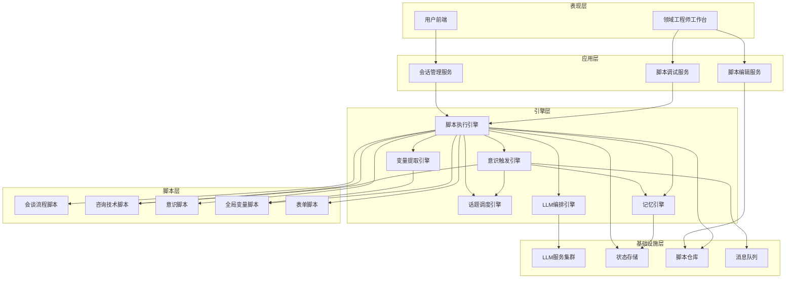

### 2.2 核心组件职责

| 组件 | 职责 |
|------|------|
| 脚本执行引擎 | 解析YAML脚本，管理Phase和Action的执行流程，维护执行栈 |
| 话题调度引擎 | 管理话题（Topic）队列，根据计划和意识触发动态调度话题执行顺序 |
| 意识触发引擎 | 监控对话上下文，按优先级和策略触发意识脚本，生成话题调整指令 |
| 记忆引擎 | 管理短期、中期、长期记忆，提供记忆存储、检索、唤起（RAG）能力 |
| 变量提取引擎 | 基于LLM从对话中提取结构化或非结构化变量，管理变量生命周期 |
| LLM编排引擎 | 统一管理LLM调用资源，支持批量调用、上下文共享、超时重试、降级策略 |
| 会话管理服务 | 管理用户咨询会话的生命周期，支持暂停恢复 |
| 脚本调试服务 | 支持脚本执行的断点、回滚、快照等调试功能 |
| 脚本编辑服务 | 提供脚本的CRUD操作和版本管理 |

## 三、YAML脚本体系设计

### 3.1 脚本类型概览

系统支持五类YAML脚本，各司其职并相互调用。本节同时作为系统的领域通用语言约定，后文提到的 Session、Phase、Topic 等术语均以本节定义为准：

| 脚本类型 | 作用 | 结构层级 | 调用关系 |
|---------|------|---------|---------|
| 会谈流程脚本 | 定义完整咨询会谈的主线流程 | session → phase → topic → action | 调用咨询技术脚本、引用全局变量、使用表单脚本 |
| 咨询技术脚本 | 封装可复用的咨询技术单元 | topic → action | 被会谈流程和意识脚本调用 |
| 意识脚本 | 定义情境感知与流程干预规则 | condition → trigger → action | 调用咨询技术脚本 |
| 全局变量脚本 | 定义领域变量及提取规则 | variable → extraction_rule | 被所有脚本引用 |
| 表单脚本 | 定义结构化信息展示与收集 | form → field → validation | 被会谈流程和咨询技术调用 |

### 3.2 会谈流程脚本

#### 3.2.1 四层结构

会谈流程脚本采用四层嵌套结构，从粗到细依次为：

**Session（会谈）**：一次完整的咨询会谈，例如"CBT抑郁症评估性会谈"
- 定义会谈的整体目标、适用对象、预期时长
- 包含多个Phase

**Phase（阶段）**：会谈中的逻辑阶段，例如"建立关系阶段"、"问题评估阶段"
- 定义阶段目标和转换条件
- 包含多个Topic

**Topic（话题）**：一个具体的咨询话题，例如"了解主要症状"、"探索触发事件"
- 定义话题的咨询目标和完成标准
- 包含多个Action

**Action（咨询动作）**：最小执行单元，例如"ai_say"、"ai_ask"
- 定义具体的交互行为和参数
- 直接与LLM或用户交互

#### 3.2.2 执行机制

- **顺序执行**：默认按定义顺序执行Phase、Topic、Action
- **条件跳转**：支持基于变量值或LLM判断结果的跳转
- **循环控制**：支持Topic级别的重复执行（如信息未收集完整）
- **意识干预**：意识脚本可中断当前Topic并插入技术脚本

### 3.3 咨询技术脚本

#### 3.3.1 结构设计

咨询技术脚本是独立的、可复用的咨询技术单元，结构等价于"一个Topic + 若干Action"。

典型技术脚本示例：
- 苏格拉底式提问
- 认知重构引导
- 情绪调节技术
- 暴露疗法引导

#### 3.3.2 参数化调用

技术脚本支持参数传入，例如：
- 目标认知偏差类型
- 当前情绪强度
- 参考上下文变量

### 3.4 意识脚本

#### 3.4.1 意识的概念

意识是咨询引擎的"元认知层"，在主流程执行过程中持续监控对话情境，根据触发条件灵活调整咨询流程。

#### 3.4.2 意识分级

考虑性能和注意力资源，意识脚本分为三个优先级：

| 优先级 | 执行频率 | 典型场景 | 执行方式 |
|--------|---------|---------|---------|
| P0 高优先级 | 每个用户回复后 | 安全风险意识、伦理合规意识 | 串行阻塞执行 |
| P1 中优先级 | 特定Action前后 | 矛盾检测意识、阻抗识别意识 | 串行执行 |
| P2 低优先级 | 异步周期检查 | 进度监控意识、关系质量意识 | 异步执行 |

#### 3.4.3 触发机制

意识脚本包含两部分：
- **触发条件**：由LLM基于上下文判断是否满足（返回布尔值或置信度）
- **干预动作**：条件满足后执行的技术脚本或流程调整

#### 3.4.4 意识的启停

意识可动态启用或禁用，避免性能浪费：
- 会谈流程脚本可指定在特定Phase启用哪些意识
- 意识脚本可定义自动失效条件

### 3.5 全局变量脚本

#### 3.5.1 变量类型

| 变量类型 | 数据结构 | 典型示例 | 用途 |
|---------|---------|---------|------|
| 结构化变量 | 枚举、数值、布尔 | 情绪强度（1-10）、认知偏差类型 | 流程控制、条件判断 |
| 文本变量 | 自由文本 | 用户主诉、核心信念描述 | 上下文传递、报告生成 |
| 复合变量 | 嵌套对象 | 用户简历（包含多个字段） | 结构化信息管理 |
| 控制变量 | 布尔、计数器 | 当前Topic是否完成 | Action执行控制 |

#### 3.5.2 变量提取规则

每个变量定义包含：
- **变量标识**：唯一的变量名
- **数据类型**：结构化或文本类型
- **提取提示词**：指导LLM如何从对话中提取该变量
- **验证规则**：提取后的合法性校验
- **提取失败处理**：失败时的降级策略（重问、跳过、默认值）

#### 3.5.3 变量作用域

- **全局作用域（global）**：跨会话持久化，如用户基本信息、长期治疗目标
- **会话作用域（session）**：单次会话内有效，如本次会谈目标、当前会谈中的重要结论
- **阶段作用域（phase）**：在当前阶段内有效，如该阶段内需要持续追踪的症状信息
- **话题作用域（topic）**：在当前话题内有效，通常对应某个具体提问或练习过程中的中间变量

在提示词中引用变量时，引擎按 **Topic → Phase → Session → Global** 的顺序自内向外查找，内层同名变量会遮蔽外层变量；脚本在需要时可以通过显式前缀访问指定作用域（例如 `${session.xxx}`）。

### 3.6 表单脚本

#### 3.6.1 表单类型

| 表单类型 | 目标用户 | 典型场景 |
|---------|---------|---------|
| 用户量表 | 咨询用户 | PHQ-9抑郁量表、GAD-7焦虑量表 |
| 咨询师笔记 | 咨询师/系统 | 案例概念化记录、督导笔记 |
| 评估报告 | 咨询师/用户 | 会谈总结报告、进展评估 |

#### 3.6.2 表单结构

表单脚本定义：
- **字段列表**：字段名、类型、是否必填
- **展示逻辑**：动态显示隐藏规则
- **验证规则**：字段级和表单级验证
- **提交动作**：提交后的数据存储和流程触发

## 五、引擎层详细设计

### 5.1 脚本执行引擎

#### 5.1.1 职责定位

脚本执行引擎是系统的核心协调者，负责解析YAML脚本并管理Phase和Action的执行流程。它维护执行栈，处理流程控制逻辑，但不直接负责话题（Topic）的调度。

#### 5.1.2 核心能力

| 能力 | 说明 |
|------|------|
| 脚本解析 | 将YAML脚本解析为可执行的内部数据结构 |
| 执行栈管理 | 维护当前执行的Session → Phase → Topic → Action路径 |
| 流程控制 | 处理顺序执行、条件分支、循环等控制逻辑 |
| Action编排 | 协调Action的生命周期（准备、执行、后处理） |
| 技术脚本调用 | 处理use_skill动作，加载并执行技术脚本 |
| 快照创建 | 在关键节点创建执行快照，支持调试回滚 |

#### 5.1.3 与话题调度引擎的协作

脚本执行引擎按照会谈脚本定义的Phase顺序执行，当进入某个Phase时：

1. 将该Phase下的所有Topic提交给话题调度引擎
2. 话题调度引擎返回当前应执行的Topic
3. 脚本执行引擎执行该Topic下的所有Action
4. Topic完成后，继续从话题调度引擎获取下一个Topic
5. 当Phase内所有Topic完成，进入下一个Phase

### 5.2 话题调度引擎

#### 5.2.1 核心理念

**话题是会谈的最小组织单元**。一次会谈结束时，咨询师实际上是串行经历了一个个话题。话题调度引擎管理这些话题的执行顺序，支持动态调整。

#### 5.2.2 话题队列模型

话题调度引擎为每个Phase维护一个话题队列：

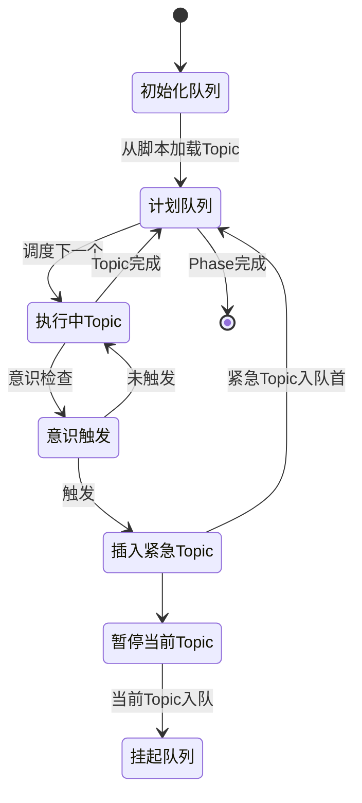

#### 5.2.3 话题状态

| 状态 | 说明 |
|------|------|
| 计划中（Planned） | 在计划队列中等待执行 |
| 执行中（Running） | 当前正在执行的Topic |
| 已完成（Completed） | 执行完成的Topic |
| 已挂起（Suspended） | 被意识打断而暂停的Topic |
| 已跳过（Skipped） | 因条件不满足被跳过 |

#### 5.2.4 调度策略

**默认调度（计划驱动）**：
- 按脚本定义的顺序依次执行Topic
- 支持条件跳过：基于变量值判断是否跳过某个Topic

**意识驱动调整**：
- 意识触发引擎可以发出话题调整指令：
  - **插入Topic**：在队列头部插入紧急Topic（如安全干预）
  - **暂停当前Topic**：将当前Topic挂起，稍后恢复
  - **跳过后续Topic**：取消计划队列中的某些Topic
  - **修改优先级**：调整计划队列中Topic的顺序

**恢复机制**：
- 紧急Topic完成后，可选择恢复被暂停的Topic或跳过
- 恢复时从暂停点继续，保留之前的执行状态

#### 5.2.5 话题上下文

每个Topic执行时，话题调度引擎提供话题上下文：

| 上下文信息 | 说明 |
|----------|------|
| 话题目标 | Topic定义的咨询目标 |
| 已完成话题列表 | 本Phase已完成的Topic |
| 计划话题列表 | 后续待执行的Topic |
| 挂起原因 | 如果是恢复的Topic，记录之前为何挂起 |
| 话题尝试次数 | Topic被执行的次数（支持重试） |

### 5.3 意识触发引擎

#### 5.3.1 职责定位

意识触发引擎是系统的"元认知层"，持续监控对话情境，评估是否需要干预当前会谈流程。它不直接执行咨询动作，而是生成话题调整指令交给话题调度引擎。

#### 5.3.2 意识分级与检查时机

| 优先级 | 检查时机 | 执行方式 | 典型意识 |
|--------|---------|---------|----------|
| P0 关键意识 | 每条用户消息后 | 串行阻塞 | 自杀风险、伦理违规 |
| P1 重要意识 | Topic开始/结束时 | 串行 | 阻抗识别、矛盾检测 |
| P2 监控意识 | 异步周期检查（如每5分钟） | 异步非阻塞 | 进度监控、关系质量 |

#### 5.3.3 意识触发流程

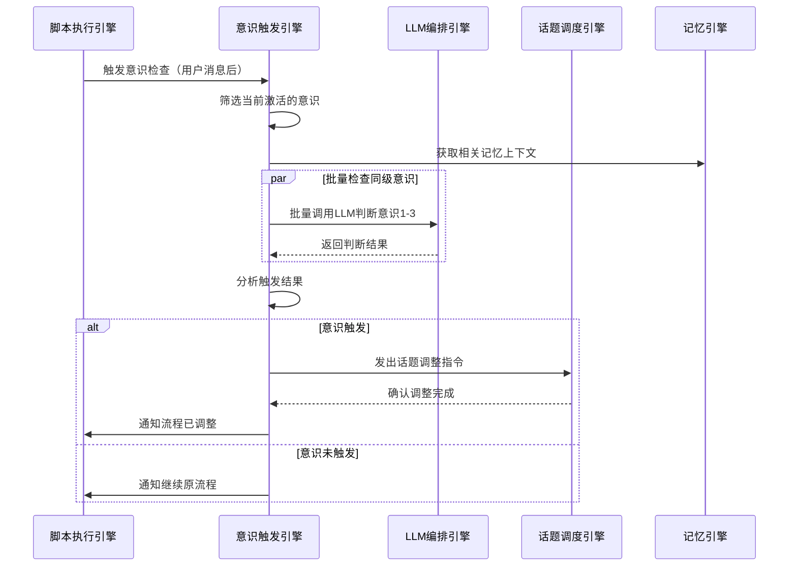

#### 5.3.4 话题调整指令

意识触发后，生成结构化的话题调整指令：

| 指令类型 | 参数 | 效果 |
|---------|------|------|
| INSERT_TOPIC | topic_id, position=HEAD | 在队列头部插入Topic |
| SUSPEND_CURRENT | reason | 暂停当前Topic，入挂起队列 |
| SKIP_TOPICS | topic_ids[] | 跳过指定的计划Topic |
| REORDER_TOPICS | priority_map | 调整计划队列顺序 |
| CALL_TECHNIQUE | technique_id, params | 插入技术脚本（封装为临时Topic） |

### 5.4 记忆引擎

#### 5.4.1 多层次记忆架构

记忆引擎管理四个层次的记忆，支持不同时间尺度和不同用途：

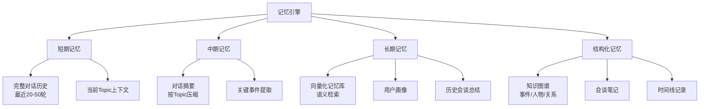

#### 5.4.2 短期记忆（Working Memory）

**存储内容**：
- 当前会话的完整对话历史（最近N轮，默认20-50轮）
- 当前Topic内的所有交互
- 最近提取的变量值

**存储位置**：内存 + 数据库

**使用场景**：
- LLM生成回复时的直接上下文
- 变量提取的源数据
- 意识触发的判断依据

**管理策略**：
- 滑动窗口：超过窗口大小时，最老的消息移入中期记忆
- Topic边界标记：记录每个Topic的消息范围

#### 5.4.3 中期记忆（Session Memory）

**存储内容**：
- 按Topic压缩的对话摘要
- 关键转折点的完整片段
- 重要情绪事件记录

**生成时机**：
- Topic完成时，调用LLM生成该Topic的摘要
- 检测到关键事件时（如情绪激增、重要决策）

**存储位置**：数据库（结构化）

**使用场景**：
- 当短期记忆窗口不足时，提供更长的上下文
- 生成会谈报告时的素材
- 跨会话恢复时快速回顾

#### 5.4.4 长期记忆（Long-term Memory）

**存储内容**：
- 用户基本信息（人口学、病史）
- 历史会谈的总结摘要
- 核心认知模式、行为模式
- 咨询目标和进展

**向量化存储**：
- 所有文本内容通过Embedding模型转为向量
- 存储于向量数据库（如Milvus、Pinecone）
- 支持语义相似度检索

**使用场景**：
- RAG检索：根据当前话题检索相关历史记忆
- 跨会话记忆：新会话开始时加载用户画像
- 模式识别：发现用户的重复模式

**更新策略**：
- 会谈结束时，更新用户画像和总结
- 增量更新：新信息补充到向量库
- 定期整合：LLM重新整合碎片化记忆

#### 5.4.5 结构化记忆（Structured Memory）

**知识图谱**：
- 实体：人物（家人、朋友、同事）、事件、地点
- 关系：人物关系、事件因果、时间顺序
- 属性：情绪标签、重要性评分

**会谈笔记**：
- 咨询师（AI）的观察和假设
- 案例概念化记录
- 干预计划和效果评估

**时间线**：
- 按时间顺序记录关键事件
- 症状变化曲线
- 治疗进展里程碑

**存储位置**：图数据库（如Neo4j）+ 关系型数据库

**使用场景**：
- 关系推理："用户提到的'他'是指之前的男友还是父亲？"
- 事件关联："这次焦虑发作与上次提到的工作压力是否相关？"
- 进展追踪："用户的抑郁评分相比一个月前有何变化？"

#### 5.4.6 记忆检索（RAG）

**检索触发时机**：
- Action执行前：根据Action目标检索相关记忆
- 意识检查时：检索相关历史情境
- 用户提及过往：检索对应事件或话题

**检索策略**：

| 检索方式 | 适用场景 | 技术实现 |
|---------|---------|----------|
| 关键词检索 | 精确匹配（人名、日期） | 倒排索引 |
| 语义检索 | 相似话题、类似情境 | 向量相似度 |
| 图检索 | 关系推理、事件链 | 图遍历算法 |
| 时间检索 | 时间相关查询 | 时间索引 |
| 混合检索 | 复杂查询 | 多路召回+重排序 |

**检索结果处理**：
- 根据相关性排序
- 限制返回数量（避免上下文过载）
- 标注记忆来源（哪次会谈、哪个Topic）
- 注入到LLM的上下文中

#### 5.4.7 记忆管理API

记忆引擎向其他引擎提供统一的API：

| API | 功能 |
|-----|------|
| add_message(role, content) | 添加对话消息到短期记忆 |
| get_recent_context(n) | 获取最近n轮对话 |
| summarize_topic(topic_id) | 生成Topic摘要并存入中期记忆 |
| retrieve_memory(query, top_k) | RAG检索相关记忆 |
| update_long_term(key, value) | 更新长期记忆（如用户画像） |
| add_entity(entity, attrs) | 添加实体到知识图谱 |
| add_relation(entity1, relation, entity2) | 添加关系到知识图谱 |
| query_graph(query) | 图查询 |
| get_timeline(start, end) | 获取时间线片段 |

### 5.5 变量提取引擎

#### 5.5.1 职责定位

变量提取引擎负责从对话中提取脚本定义的变量，管理变量的生命周期，处理提取失败的补救策略。

#### 5.5.2 提取流程

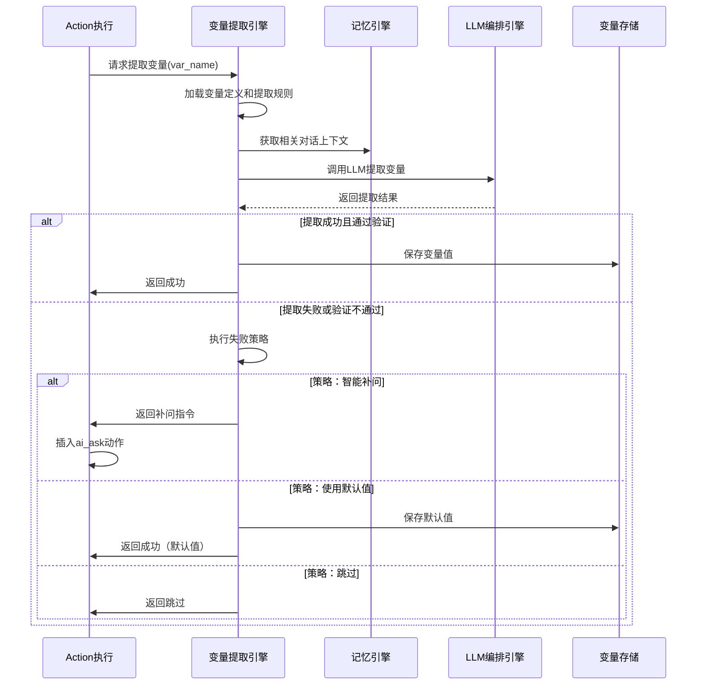

#### 5.5.3 提取失败的智能补问

当变量提取失败时，引擎可以智能生成补充提问：

1. 分析提取失败原因（用户未提及、信息模糊、信息矛盾）
2. 生成针对性的追问提示词
3. 动态插入ai_ask动作到当前Action
4. 用户回答后重新尝试提取

**示例**：
- 变量：用户年龄
- 失败原因：用户未提及
- 补问："为了更好地理解您的情况，可以告诉我您今年多大吗？"

#### 5.5.4 变量依赖管理

部分变量的提取依赖其他变量：

**依赖示例**：
- 变量"焦虑触发情境"依赖变量"是否有焦虑症状"为true
- 变量"药物副作用"依赖变量"是否服药"为true

**处理策略**：
- 构建变量依赖图
- 按依赖顺序提取变量
- 依赖条件不满足时跳过提取

#### 5.5.5 变量更新模式

变量提取引擎在更新变量时，会根据变量定义中的更新模式与已有值进行合并或覆盖：

- **覆盖模式（overwrite）**：每次提取结果直接替换原有值，适用于单值类变量，如年龄、单次量表得分等。
- **追加模式（append）**：对列表或日志类变量进行追加，例如“家庭成员”、“重要事件列表”等，允许在会谈过程中持续补充信息。
- **合并唯一模式（merge_unique）**：对实体列表做去重与字段合并，例如针对家庭成员，若再次提到同一人物，则更新其属性而非新增重复条目。
- **版本化模式（versioned）**：保留变量的历史版本和当前版本，适用于需要追踪演化过程的关键结论类变量。

变量值通常在 **ai_ask** 和 **ai_think** 等 Action 中，通过变量提取引擎基于用户回复与上下文由 LLM 识别、抽取并更新；其他 Action（如 `set_var`、表单提交后的处理）也可以直接更新变量，但同样应遵守该变量配置的更新模式。

#### 5.5.6 主动/被动提取与提前/后补更新

变量提取引擎同时支持主动提取和被动提取两种模式：

- **主动提取（on_demand）**：在特定 Action 中显式发起提取请求，例如某个 ai_ask 的目标就是收集特定变量，执行时根据该变量的提取规则和当前上下文调用 LLM 完成提取。
- **被动提取（passive）**：对配置了监听能力的变量，在其作用域内（如 phase 或 session）对所有新到的用户消息进行监听；一旦检测到与该变量相关的信息，即尝试自动更新变量。变量定义中可以通过类似 `listen_scope`、`listen_mode` 字段声明其是否参与被动提取。

为控制性能与成本，被动提取任务不会为每个变量单独调用 LLM，而是由 LLM 编排引擎与意识检查、其他变量提取任务一起 **批量合并调用**，共享相同的对话上下文，并在一次调用中返回多个变量或意识判断结果，再分别分发处理。

在此基础上，变量提取引擎支持：

- **提前识别**：当某个信息在后续节点（例如第 10 个 ai_ask）才会被显式询问，但用户在较早的对话轮次中已经提到相关内容时，被动提取可以提前填充对应变量；当执行到该 ai_ask 时，脚本可根据信息是否齐备决定是直接跳过还是只做简短确认，从而减少重复追问。
- **后补更新**：同一信息在早期已被写入某个变量，但用户在后续对话中对该信息进行补充或修正时，被动提取可以再次触发，对同一变量做增量更新；具体合并策略由该变量的更新模式决定。实际实现中可以在 `VariableState` 中保留变量更新历史（时间戳、来源 Action、旧值、新值等），便于脚本调试和审计追溯。

### 5.6 LLM编排引擎

#### 5.6.1 作为底层智能资源

**设计理念**：将LLM视为底层智能计算资源，类似GPU资源池，需要统一管理和高效调度。

#### 5.6.2 核心能力

| 能力 | 说明 |
|------|------|
| 资源池管理 | 管理多个LLM服务实例（不同模型、不同服务商） |
| 批量调用 | 合并多个独立请求，批量调用以提升效率 |
| 上下文共享 | 相同上下文的多个任务共享记忆加载，减少重复 |
| 并行调度 | 无依赖任务并行发起，缩短总延迟 |
| 串行编排 | 有依赖任务按序执行，后续任务使用前序结果 |
| 超时重试 | 自动处理超时、失败，重试或降级 |
| 负载均衡 | 在多个LLM实例间分配请求 |
| 成本优化 | 根据任务复杂度选择合适的模型 |

#### 5.6.3 上下文共享机制

**问题**：
多个意识检查都需要相同的对话上下文，如果每个意识独立调用LLM，会重复发送大量上下文，浪费tokens和时间。

**解决方案**：

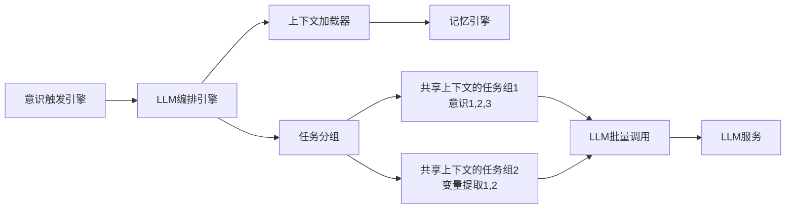

**实现策略**：

1. **任务收集**：在一个检查点（如用户消息后），收集所有待执行的LLM任务
2. **上下文分析**：识别哪些任务需要相同的上下文
3. **任务分组**：将共享上下文的任务分为一组
4. **批量构造提示词**：
   ```
   [共享上下文]
   对话历史：...
   
   [任务1：安全意识检查]
   请判断用户是否表达自杀倾向...
   
   [任务2：矛盾意识检查]
   请判断用户本轮表达是否与之前矛盾...
   
   [任务3：阻抗意识检查]
   请判断用户是否表现出阻抗...
   ```
5. **一次调用返回多个结果**：LLM返回JSON格式，包含所有任务的结果
6. **结果分发**：将结果分发给各个任务发起者

**效果**：
- 3个意识检查从串行3次调用（6-9秒）变为1次调用（2-3秒）
- tokens消耗减少约60%

#### 5.6.4 LLM任务类型

| 任务类型 | 输入 | 输出 | 典型用途 |
|---------|------|------|----------|
| 判断型 | 上下文+判断目标 | 布尔值或枚举 | 意识触发、条件分支 |
| 提取型 | 上下文+变量定义 | 结构化数据 | 变量提取、信息抽取 |
| 生成型 | 上下文+生成目标 | 自然语言文本 | AI回复、摘要生成 |
| 分析型 | 上下文+分析维度 | 分析报告 | 情绪分析、模式识别 |

#### 5.6.5 降级策略

当LLM调用失败（重试后仍失败）时，根据任务类型降级：

| 任务类型 | 降级策略 |
|---------|----------|
| 判断型 | 使用保守默认值（如意识检查返回false） |
| 提取型 | 使用规则提取（正则表达式、关键词匹配） |
| 生成型 | 使用预设模板回复 |
| 分析型 | 跳过分析或使用历史平均值 |

#### 5.6.6 性能监控

LLM编排引擎记录所有调用的性能指标：

- 调用延迟分布（P50、P95、P99）
- 成功率和失败率
- 每次调用的tokens消耗
- 批量调用的合并率
- 不同模型的性能对比

这些数据用于：
- 识别性能瓶颈
- 优化调度策略
- 成本核算和优化
- 模型选择决策

## 六、LLM与脚本协作机制

### 6.1 LLM的角色定位

在AI咨询引擎中，LLM扮演三类角色：

| 角色 | 职责 | 输入 | 输出 |
|------|------|------|------|
| 理解者 | 理解用户意图、情绪、内容 | 用户输入+上下文+提示词 | 结构化理解结果 |
| 生成者 | 生成咨询师回复、引导语 | 咨询目标+上下文+提示词 | 自然语言回复 |
| 判断者 | 判断条件、评估状态 | 判断目标+上下文+提示词 | 布尔值或枚举值 |

### 6.2 LLM编排模式

#### 6.2.1 串行调用

多个LLM调用按依赖关系顺序执行，后续调用依赖前序结果。

典型场景：识别用户情绪波动后启动"小心状态"
1. 先调用LLM理解用户输入，提取情绪和内容
2. 基于提取结果，调用LLM生成针对性回复


#### 6.2.2 并行调用

多个LLM调用相互独立，可同时发起以提升性能。

典型场景：意识识别
- 同时检查多个意识的触发条件
- 同时提取多个独立变量

典型场景：沟通策略调整
- 独立一个线程观察对话进度并必要时调整沟通策略
- 主线程代入调整后的沟通策略或进度状态

#### 6.2.3 条件调用

根据前序结果或变量状态决定是否调用LLM。

典型场景：
- 仅在用户情绪异常时调用情绪干预LLM
- 仅在变量缺失时调用补充提问LLM

### 6.3 提示词管理

#### 6.3.1 提示词结构

每个LLM调用的提示词由多部分组合而成：

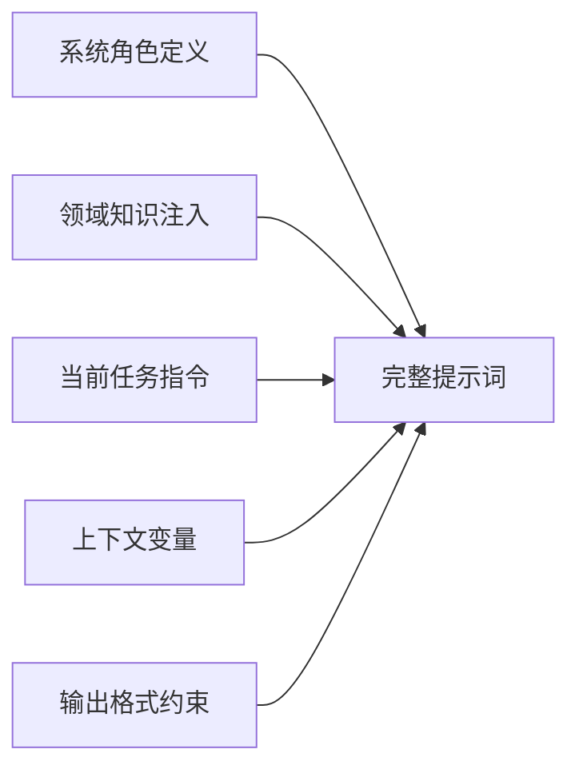

#### 6.3.2 提示词来源

| 来源 | 定义位置 | 变更频率 | 示例 |
|------|---------|---------|------|
| 系统级提示词 | 引擎配置 | 很少 | "你是一名专业的CBT咨询师" |
| 脚本级提示词 | 会谈流程脚本 | 中等 | "当前处于评估阶段，关注用户症状" |
| Action级提示词 | Action定义 | 频繁 | "引导用户描述最近一次焦虑发作" |
| 动态提示词 | 运行时生成 | 每次 | "用户在上一轮提到了{变量}" |

### 6.4 LLM输出解析

#### 6.4.1 结构化输出

对于需要结构化结果的场景，要求LLM输出JSON格式，并定义Schema进行验证。

#### 6.4.2 自然语言输出

对于生成咨询师回复的场景，LLM输出自然语言文本，可选进行敏感词过滤和风格校准。

#### 6.4.3 混合输出

LLM同时输出结构化数据和自然语言，例如：
- 变量提取结果（JSON）
- 向用户的回复（文本）
- 流程控制建议（枚举）

### 6.5 LLM调用的超时与重试

#### 6.5.1 超时策略

| LLM角色 | 超时时长 | 超时处理 |
|---------|---------|---------|
| 理解者 | 10秒 | 重试或使用规则兜底 |
| 生成者 | 15秒 | 重试或使用预设回复 |
| 判断者 | 8秒 | 重试或默认判断结果 |

#### 6.5.2 重试机制

- **最大重试次数**：3次
- **重试间隔**：指数退避（1秒、2秒、4秒）
- **重试条件**：网络错误、超时、LLM服务异常（非业务逻辑错误）
- **重试时提示词调整**：可简化提示词或降低输出要求


## 七、咨询动作（Action）体系

### 7.1 Action类型定义

Action是脚本执行的最小单元，每种Action类型代表一类咨询交互模式。

| Action类型 | 功能描述 | 关键参数 | 结束条件 |
|-----------|---------|---------|---------|
| ai_say | 向用户传达信息、解释概念、说服方案 | 信息内容、说服目标 | 用户理解确认或达到最大轮次 |
| ai_ask | 引导式提问收集信息 | 目标变量、提问策略 | 变量成功提取或用户拒绝回答 |
| ai_think | 内部认知加工与决策（个案概念化、治疗计划调整、风险评估、作业生成） | 输入来源（对话历史、量表结果、变量集）、加工目标、输出变量/决策键名 | 完成内部推理并更新相关变量或确定后续路径 |
| set_var | 显式设置变量值 | 变量名、赋值表达式 | 立即完成 |
| use_skill | 调用咨询技术脚本 | 技术脚本ID、传入参数 | 技术脚本执行完毕 |
| ai_guide | 引导用户完成练习或任务 | 练习类型、步骤定义 | 练习完成或中断 |
| show_form | 展示表单给用户或咨询师 | 表单ID、填写模式 | 表单提交或取消 |
| show_pic | 向用户展示图片或图示辅助沟通 | 图片ID或URL、展示目的、可选说明文案 | 图片展示完成或用户继续会谈 |
| ai_pic | 基于文字生成图片，例如绘制梦境 | 图片ID或URL、图片绘制描述 | 图片生成完 |
| parallel_actions | 并行执行多个Action | Action列表 | 所有Action完成 |

### 7.2 Action执行生命周期

每个Action的执行遵循标准生命周期：

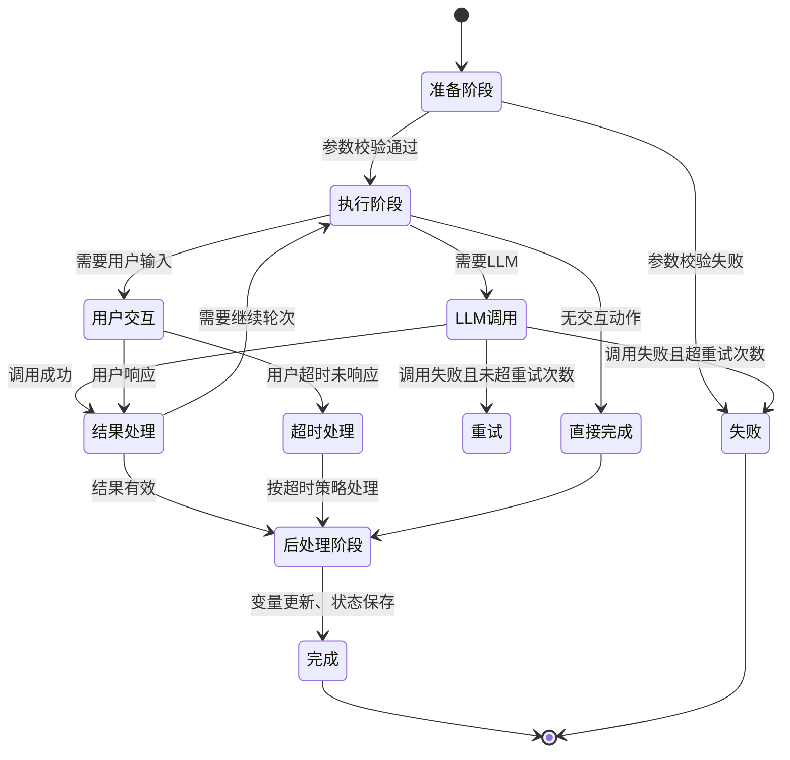

### 7.3 Action的快照与回滚

为支持脚本调试，每个Action执行前后创建快照：

**快照内容**：
- Action标识和参数
- 执行前的全部变量状态
- 执行前的对话历史
- 执行过程中的LLM调用记录
- 执行后的变量变更

**回滚机制**：
- 调试模式下，可回滚到任意Action快照
- 回滚后重新执行，可使用修改后的脚本
- 生产模式下快照仅用于审计，不可回滚

## 八、会话管理与状态持久化

### 8.1 会话生命周期

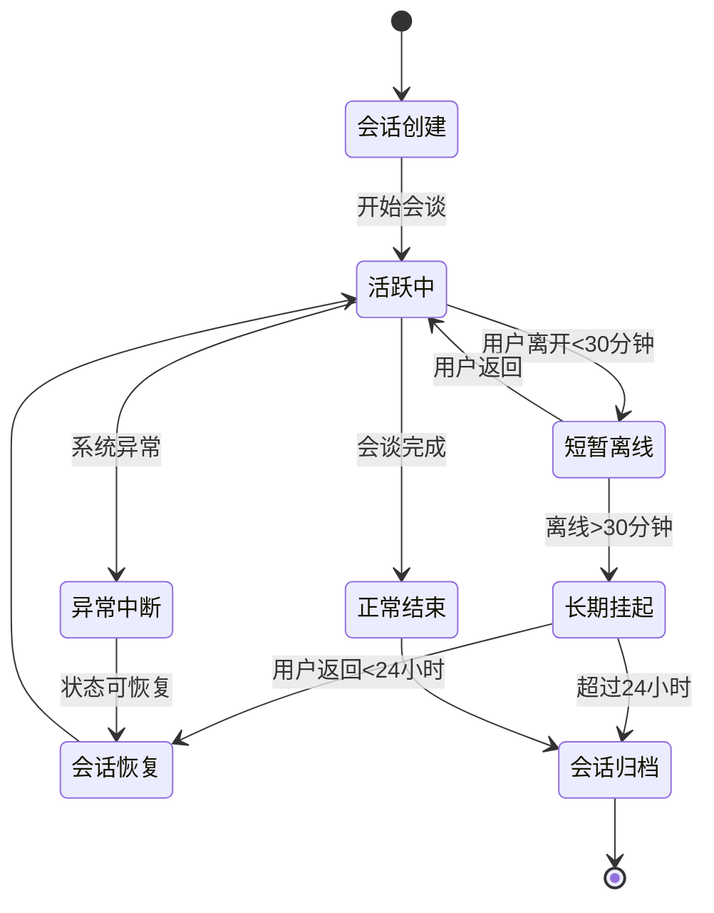

### 8.2 状态持久化策略

采用混合持久化策略，平衡性能与可靠性：

| 持久化对象 | 持久化时机 | 存储位置 | 用途 |
|-----------|-----------|---------|------|
| 对话消息 | 每条消息发送/接收后 | 消息数据库 | 对话历史展示、上下文加载 |
| 变量状态 | 变量值变更后 | 状态数据库 | 流程控制、跨会话传递 |
| Action快照 | 每个Action执行前 | 快照存储 | 调试回滚、审计追溯 |
| 会话元信息 | 会话状态变化时 | 会话数据库 | 会话管理、统计分析 |
| LLM调用日志 | 每次LLM调用后 | 日志系统 | 性能监控、成本核算 |

### 8.3 状态恢复机制

当用户返回中断的会话时：

1. **加载会话元信息**：确认会话状态和当前执行位置
2. **恢复变量状态**：加载最新的全部变量值
3. **重建对话上下文**：加载最近N条对话消息（默认20条）
4. **定位执行节点**：恢复到中断的Action位置
5. **重新激活意识**：根据当前Phase重新启用相应意识

### 8.4 跨会话记忆

部分变量需要跨会话持久化，实现长期记忆：

**长期记忆变量类型**：
- 用户基本信息（昵称、年龄、职业等）
- 诊断信息（症状类型、严重程度）
- 历史会谈记录摘要
- 用户偏好设置（沟通风格、敏感话题）

**记忆更新策略**：
- 增量更新：新信息补充到历史记忆
- 覆盖更新：新信息替代旧信息（如症状变化）
- 版本保留：关键信息保留历史版本（如症状演变）

## 九、脚本开发工具设计

### 9.1 工具定位

为领域工程师（咨询师、心理学专家）提供低门槛的脚本开发环境，无需编程背景即可创建和维护咨询脚本。

### 9.2 脚本编辑器

#### 9.2.1 编辑模式

支持两种编辑模式，满足不同用户需求：

**代码编辑模式**：
- 直接编辑YAML文本
- 语法高亮和自动补全
- 基于Schema的实时校验
- 适合熟悉YAML的高级用户

**可视化编辑模式**：
- 以节点流程图展示会谈流程
- 每个Action节点可双击打开配置面板
- 拖拽方式调整流程顺序
- 自动生成YAML代码
- 适合不熟悉代码的领域专家

#### 9.2.2 模式切换

两种模式实时同步，用户可随时切换：
- 代码修改后，可视化视图自动更新
- 可视化操作后，代码立即反映变化

#### 9.2.3 编辑辅助功能

| 功能 | 说明 |
|------|------|
| 模板库 | 提供常用脚本模板快速起步 |
| 智能提示 | 根据上下文提示可用变量和技术脚本 |
| 错误检查 | 实时检查脚本语法和逻辑错误 |
| 变量追踪 | 高亮显示变量的定义和引用位置 |
| 依赖分析 | 显示脚本间的调用关系 |

### 9.3 脚本调试器

#### 9.3.1 调试功能

| 功能 | 描述 | 应用场景 |
|------|------|---------|
| 模拟对话 | 扮演用户与脚本对话测试 | 快速验证脚本逻辑 |
| 断点设置 | 在特定Action处暂停执行 | 检查中间状态 |
| 单步执行 | 逐个Action执行并观察 | 精细调试 |
| 变量监控 | 实时查看所有变量值 | 跟踪变量变化 |
| 回滚重放 | 回滚到历史快照重新执行 | 修改脚本后重测 |
| LLM调用查看 | 查看每次LLM的输入输出 | 优化提示词 |
| 意识触发日志 | 查看意识检查和触发记录 | 调试意识逻辑 |

#### 9.3.2 调试界面布局

```
+----------------------------------+-------------------+
|                                  |                   |
|    对话模拟窗口                   |   变量监控面板     |
|   （用户输入/AI回复）              |  （当前变量列表）   |
|                                  |                   |
+----------------------------------+                   |
|                                  |                   |
|    脚本执行视图                   |                   |
|  （当前执行的Action高亮）          +-------------------+
|                                  |                   |
|                                  |  LLM调用日志       |
+----------------------------------+                   |
|           操作控制栏              |                   |
|  [继续] [单步] [回滚] [重启]      |                   |
+----------------------------------+-------------------+
```

### 9.4 脚本版本管理

#### 9.4.1 版本控制

- 每次脚本保存自动创建版本
- 记录修改人、修改时间、修改说明
- 支持版本对比查看差异
- 支持回退到历史版本

#### 9.4.2 发布管理

脚本经历三个状态：

**草稿状态**：开发中，仅开发者可见
**测试状态**：可用于调试，但不对外服务
**发布状态**：正式生产使用

发布时需要：
- 通过脚本校验（无语法错误）
- 完成基本测试（至少一次完整调试）
- 填写发布说明

### 9.5 脚本协作

#### 9.5.1 权限管理

| 角色 | 权限 |
|------|------|
| 脚本开发者 | 创建、编辑、调试自己的脚本 |
| 脚本审核者 | 审核并发布脚本 |
| 系统管理员 | 管理所有脚本和用户权限 |

#### 9.5.2 协作功能

- 脚本分享：将脚本分享给其他开发者
- 脚本复制：基于现有脚本创建副本修改
- 评论标注：在脚本特定位置添加评论讨论

## 十、用户交互前端设计

### 10.1 前端形态

系统提供三种前端形态，满足不同场景需求：

| 形态 | 目标用户 | 主要功能 | 技术形式 |
|------|---------|---------|---------|
| 嵌入式SDK | 第三方应用开发者 | 提供会话API和UI组件 | JavaScript SDK |
| 独立调试前端 | 脚本开发者 | 快速测试脚本效果 | Web应用 |
| 完整咨询应用 | 最终用户 | 提供完整咨询体验 | Web或移动应用 |

### 10.2 核心交互模式

#### 10.2.1 对话式交互

主交互方式为对话界面，类似即时通讯：
- 用户发送文字消息
- AI咨询师回复文字消息
- 支持打字动画增强真实感
- 支持消息撤回（限定时间内）

#### 10.2.2 结构化输入

部分场景需要结构化输入：
- 量表填写（单选、多选、滑动条）
- 情绪评分（可视化评分组件）
- 日期时间选择

#### 10.2.3 富媒体展示

支持多种内容展示形式：
- 文字消息（支持Markdown）
- 卡片式信息（如技术说明卡片）
- 图表（如情绪变化曲线）
- 音频（如放松引导音频）

### 10.3 用户体验要点

#### 10.3.1 响应感知

- 用户发送消息后，立即显示"AI正在思考"状态
- LLM生成较慢时，分段流式显示回复
- 长时间处理时，显示预估等待时间

#### 10.3.2 安全感营造

- 强调隐私保护和保密原则
- 提供随时暂停和退出选项
- 在敏感话题前给予提示和选择权

#### 10.3.3 进度可视化

- 显示当前会谈所处阶段
- 显示预计剩余时长
- 标记已完成的里程碑

## 十一、数据模型设计

### 11.1 核心实体

#### 11.1.1 会话（Session）

| 字段 | 类型 | 说明 |
|------|------|------|
| session_id | 字符串 | 会话唯一标识 |
| user_id | 字符串 | 用户标识 |
| script_id | 字符串 | 使用的会谈流程脚本ID |
| status | 枚举 | 会话状态（活跃/挂起/结束/归档） |
| current_position | 对象 | 当前执行位置（phase/topic/action） |
| created_at | 时间戳 | 创建时间 |
| last_active_at | 时间戳 | 最后活跃时间 |
| ended_at | 时间戳 | 结束时间 |
| metadata | JSON | 扩展元信息 |

#### 11.1.2 消息（Message）

| 字段 | 类型 | 说明 |
|------|------|------|
| message_id | 字符串 | 消息唯一标识 |
| session_id | 字符串 | 所属会话 |
| sender | 枚举 | 发送者（user/ai/system） |
| content | 文本 | 消息内容 |
| content_type | 枚举 | 内容类型（text/card/form） |
| timestamp | 时间戳 | 发送时间 |
| action_id | 字符串 | 触发该消息的Action标识（可选） |
| metadata | JSON | 扩展信息（如LLM参数） |

#### 11.1.3 变量状态（VariableState）

| 字段 | 类型 | 说明 |
|------|------|------|
| session_id | 字符串 | 所属会话 |
| variable_name | 字符串 | 变量名 |
| variable_value | JSON | 变量值（支持任意类型） |
| scope | 枚举 | 作用域（global/session/temp） |
| updated_at | 时间戳 | 最后更新时间 |
| updated_by | 字符串 | 更新来源（action_id或system） |

#### 11.1.4 执行快照（Snapshot）

| 字段 | 类型 | 说明 |
|------|------|------|
| snapshot_id | 字符串 | 快照唯一标识 |
| session_id | 字符串 | 所属会话 |
| action_id | 字符串 | Action标识 |
| snapshot_type | 枚举 | 快照类型（before/after） |
| variables | JSON | 变量状态快照 |
| messages | 数组 | 对话历史快照 |
| llm_calls | 数组 | LLM调用记录 |
| timestamp | 时间戳 | 快照时间 |

#### 11.1.5 脚本（Script）

| 字段 | 类型 | 说明 |
|------|------|------|
| script_id | 字符串 | 脚本唯一标识 |
| script_type | 枚举 | 脚本类型（session/technique/awareness/variable/form） |
| script_name | 字符串 | 脚本名称 |
| script_content | YAML文本 | 脚本内容 |
| version | 整数 | 版本号 |
| status | 枚举 | 状态（draft/testing/published） |
| author | 字符串 | 作者 |
| created_at | 时间戳 | 创建时间 |
| published_at | 时间戳 | 发布时间 |
| metadata | JSON | 扩展元信息 |

### 11.2 实体关系

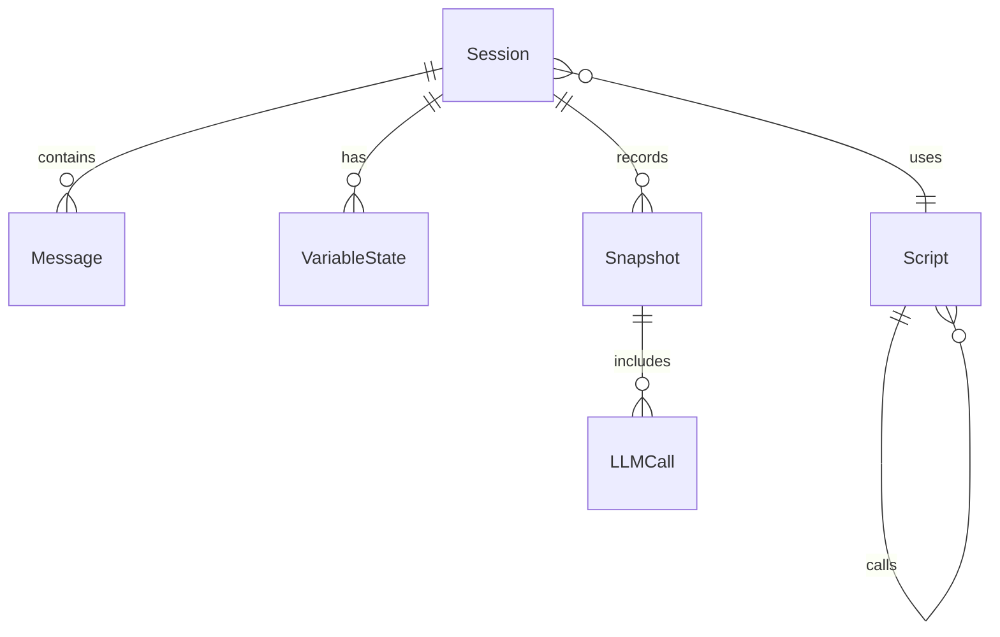

### 11.3 数据存储选型

| 数据类型 | 存储方案 | 理由 |
|---------|---------|------|
| 会话元信息 | 关系型数据库（PostgreSQL） | 需要事务和复杂查询 |
| 消息历史 | 文档数据库（MongoDB） | 读写频繁，结构灵活 |
| 变量状态 | 键值存储（Redis）+ 持久化 | 快速读写，支持过期策略 |
| 执行快照 | 对象存储（S3/OSS） | 大容量，低成本，访问频率低 |
| 脚本内容 | 文件系统 + 版本控制 | 支持Git集成，便于管理 |
| LLM调用日志 | 时序数据库（InfluxDB） | 大量时序数据，分析需求 |

## 十二、系统流程设计

### 12.1 会谈启动流程

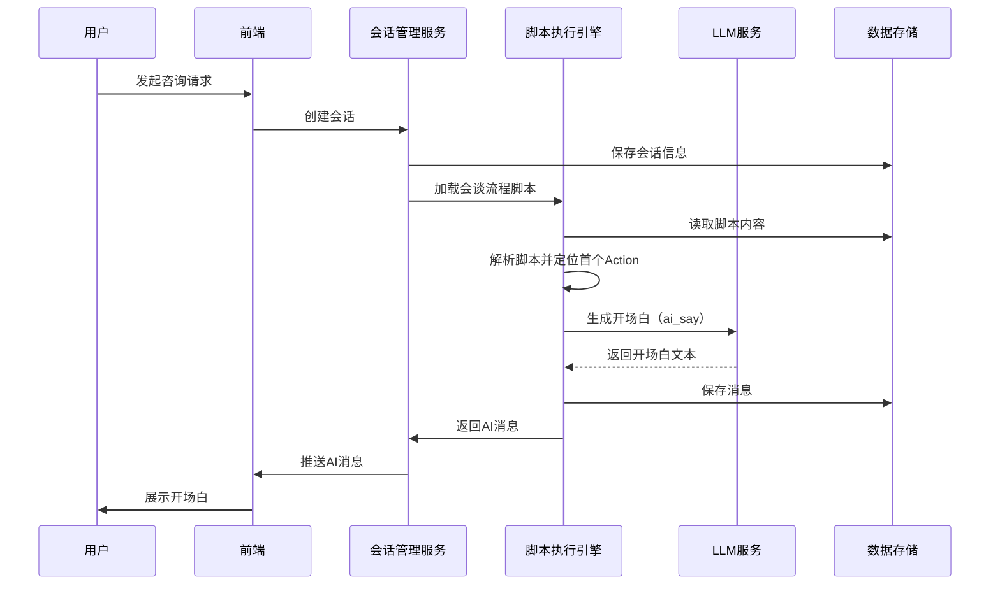

### 12.2 用户消息处理流程

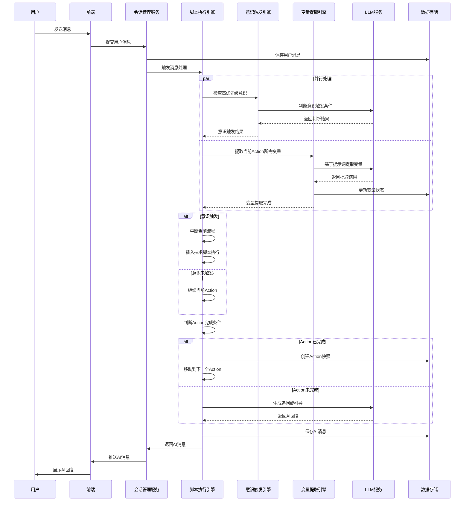

### 12.3 脚本调试流程

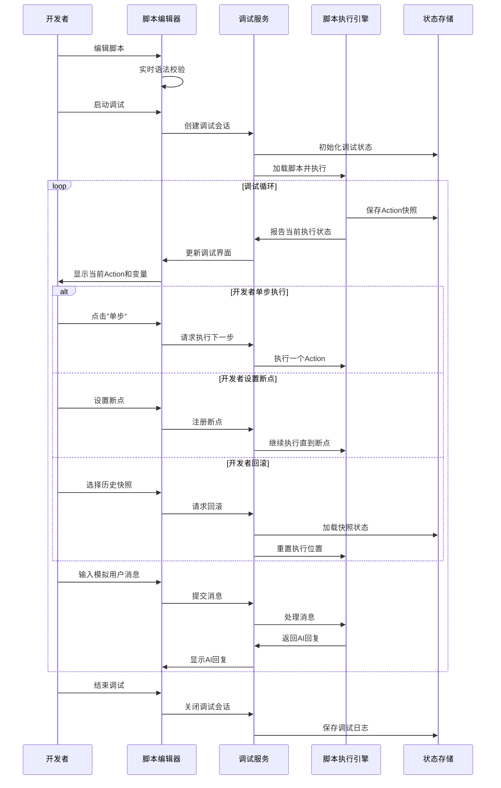

## 十三、关键技术决策

### 13.1 为什么选择YAML作为脚本语言

| 决策因素 | YAML优势 |
|---------|---------|
| 可读性 | 类似自然语言，非技术背景的领域专家容易理解 |
| 结构化 | 天然支持嵌套和层级，适合表达会谈流程结构 |
| 工具生态 | 丰富的解析库和Schema校验工具 |
| 版本控制友好 | 纯文本格式，便于Git管理和差异对比 |
| 可扩展性 | 支持自定义标签和锚点引用 |

### 13.2 LLM调用粒度的权衡

**不采用"一次调用完成整个会谈"**：
- 缺乏流程可控性，难以保证专业性
- 无法实现复杂的条件跳转和状态管理
- 成本过高且不可预测

**不采用"每句话都独立调用"**：
- 缺乏上下文连贯性
- 性能开销过大
- 难以实现复杂的咨询技术

**采用"以Action为粒度调用"**：
- 平衡灵活性和可控性
- Action内部可包含多轮对话，保证技术完整性
- 便于调试和优化单个咨询动作

### 13.3 状态管理的持久化策略

**挑战**：
- 全量持久化：性能差，存储成本高
- 不持久化：无法容错，调试困难

**解决方案（混合策略）**：
- 用户可见内容（消息）：立即持久化，保证体验连续性
- 关键节点（Action边界）：创建快照，支持回滚
- 中间状态（Action内部）：仅内存保存，性能优先

### 13.4 意识脚本的分级设计

**挑战**：
- 所有意识每轮检查：性能不可接受（假设10个意识，每个调用LLM 2秒，串行需20秒）
- 不检查意识：失去灵活性和安全保障

**解决方案（分级+并行）**：
- P0意识（如安全风险）：必须每轮检查，但数量极少（1-2个）
- P1意识（如矛盾检测）：在特定阶段或Action类型时检查
- P2意识（如进度监控）：异步周期检查，不阻塞主流程
- 同优先级意识：并行调用LLM，降低延迟

### 13.5 话题调度引擎的独立性

**挑战**：
- 话题是会谈的核心组织单元，需要灵活的调度策略
- 意识触发需要能够动态调整话题顺序
- 脚本执行引擎如果直接管理话题，职责过重

**解决方案（独立话题调度引擎）**：
- 脚本执行引擎专注于Phase和Action层面的执行
- 话题调度引擎独立管理Topic队列和调度策略
- 意识触发引擎通过话题调整指令影响调度
- 清晰的责任分离，便于各自优化

### 13.6 记忆引擎的多层次设计

**挑战**：
- 单一记忆模式无法平衡性能和信息完整性
- 完整对话历史加载到LLM上下文：tokens消耗大、成本高
- 不保留历史：失去上下文连贯性和长期记忆

**解决方案（四层记忆架构）**：
- 短期记忆：滑动窗口，保持最近对话的完整性
- 中期记忆：按Topic压缩，平衡信息量和细节
- 长期记忆：向量化存储，支持语义检索（RAG）
- 结构化记忆：知识图谱，支持关系推理
- 不同场景按需加载不同层次的记忆

### 13.7 LLM编排引擎的资源视角

**挑战**：
- 多个独立的LLM调用导致重复加载相同上下文
- 串行调用延迟累加，用户等待时间长
- LLM成本高昂，需要优化tokens消耗

**解决方案（批量调用+上下文共享）**：
- 将LLM视为底层智能资源池，统一调度
- 识别共享上下文的任务，批量构造提示词
- 一次LLM调用返回多个任务的结果
- 效果：3个意识检查从串行9秒降至批量3秒，tokens节省60%

## 十四、非功能性需求

### 14.1 性能指标

| 指标 | 目标值 | 说明 |
|------|--------|------|
| 用户消息响应时间 | <3秒（P95） | 从用户发送到AI回复展示 |
| 会话启动时间 | <2秒 | 从请求到首条AI消息 |
| 意识检查延迟 | <1秒（并行） | 高优先级意识检查总耗时 |
| 变量提取成功率 | >90% | 首次提取成功的比例 |
| LLM调用重试成功率 | >95% | 重试后最终成功的比例 |
| 会话恢复时间 | <5秒 | 加载历史状态并恢复 |
| 脚本加载时间 | <500ms | 从存储读取并解析脚本 |

### 14.2 可靠性要求

| 方面 | 要求 | 实现策略 |
|------|------|---------|
| 服务可用性 | 99.5% | 多实例部署、健康检查、自动重启 |
| 数据持久化 | 零丢失 | 关键数据同步写入、定期备份 |
| 会话容错 | 自动恢复 | 状态快照、异常后自动加载最近快照 |
| LLM失败降级 | 优雅降级 | 重试后仍失败时使用规则兜底 |

### 14.3 安全性要求

| 风险 | 防护措施 |
|------|---------|
| 用户隐私泄露 | 数据加密存储、传输加密、访问控制、脱敏展示 |
| LLM输出不当内容 | 敏感词过滤、输出内容审核、人工抽检 |
| 脚本注入攻击 | 脚本Schema严格校验、禁止动态代码执行 |
| 未授权访问 | 会话token验证、接口鉴权、操作审计 |

### 14.4 可扩展性设计

| 扩展点 | 设计策略 |
|--------|---------|
| 新增Action类型 | Action插件化，注册机制 |
| 新增脚本类型 | 统一脚本接口，类型枚举扩展 |
| 新增LLM服务 | LLM抽象层，适配器模式 |
| 新增咨询领域 | 领域隔离，脚本命名空间 |
| 水平扩展 | 无状态服务设计，状态外部化 |

### 14.5 可维护性要求

| 方面 | 要求 |
|------|------|
| 日志记录 | 结构化日志，包含trace_id关联请求链路 |
| 监控告警 | 关键指标实时监控，异常自动告警 |
| 可观测性 | 提供执行链路追踪、LLM调用分析 |
| 文档维护 | 脚本编写文档、Action类型说明、API文档 |

## 十五、实施路线图

### 15.1 MVP阶段（第一期）

**目标**：验证核心架构可行性，实现基础的CBT评估性会谈。

**范围**：
- 脚本执行引擎（支持会谈流程脚本、咨询技术脚本）
- 基础Action类型（ai_say、ai_ask、ai_think、use_skill）
- 简单变量提取（仅文本类型）
- 单一LLM服务集成（串行调用）
- 基础会话管理（创建、活跃、结束）
- 代码模式脚本编辑器（YAML编辑+Schema校验）
- 简单调试功能（对话模拟、变量查看）
- 简单聊天前端（用户侧）

**不包含**：
- 意识脚本
- 复杂变量类型
- LLM并行调用
- 可视化编辑器
- 快照回滚
- 跨会话记忆

**预期时长**：8-10周

### 15.2 增强阶段（第二期）

**目标**：完善脚本能力，增强调试体验。

**新增功能**：
- 意识脚本（仅高优先级，串行检查）
- 全局变量脚本（支持结构化和文本混合）
- 表单脚本（用户量表）
- 更多Action类型（ai_pic、show_pic、show_form等）
- LLM并行调用
- 脚本调试增强（快照、回滚、单步执行）
- 脚本版本管理
- 状态持久化增强（混合策略）

**预期时长**：6-8周

### 15.3 完善阶段（第三期）

**目标**：提升易用性，支持生产级应用。

**新增功能**：
- 可视化脚本编辑器（节点流程图）
- 意识分级（P0/P1/P2）和异步检查
- 跨会话记忆（全局变量持久化）
- 会话暂停恢复
- 领域工程师协作功能（权限、分享、评论）
- 嵌入式SDK
- 完整咨询应用前端（进度可视化、富媒体展示）
- 性能优化和监控告警

**预期时长**：8-10周

### 15.4 扩展阶段（第四期）

**目标**：支持多领域、多场景。

**新增功能**：
- 更多咨询领域脚本（焦虑症、强迫症等）
- 更多咨询类型（巩固性会谈、危机干预等）
- 多租户隔离
- 脚本市场（脚本分享和交易）
- 移动端应用
- 数据分析和报表（咨询质量、脚本效果）

**预期时长**：持续迭代

## 十六、风险与应对

### 16.1 技术风险

| 风险 | 影响 | 概率 | 应对策略 |
|------|------|------|---------|
| LLM服务不稳定 | 用户体验差，会话中断 | 中 | 多LLM服务商接入、自动重试、降级规则 |
| 变量提取准确率低 | 流程判断错误，影响咨询质量 | 高 | 提示词工程优化、多轮确认机制、人工校验 |
| 复杂脚本性能差 | 响应慢，用户流失 | 中 | 脚本复杂度限制、异步处理、缓存优化 |
| 状态恢复失败 | 会话无法继续 | 低 | 多级快照、降级到新会话 |

### 16.2 业务风险

| 风险 | 影响 | 概率 | 应对策略 |
|------|------|------|---------|
| 领域专家学习成本高 | 脚本开发效率低 | 中 | 简化脚本语法、提供模板和教程、可视化工具 |
| 脚本质量参差不齐 | 咨询效果差，用户投诉 | 高 | 脚本审核机制、质量评分、专家督导 |
| LLM输出不可控 | 产生不当或错误建议 | 中 | 输出审核、敏感话题限制、免责声明 |
| 用户依赖AI产生风险 | 医疗事故责任 | 低 | 明确定位为辅助工具、危机情况转人工 |

### 16.3 合规风险

| 风险 | 影响 | 概率 | 应对策略 |
|------|------|------|---------|
| 用户隐私泄露 | 法律责任、信任危机 | 低 | 数据加密、访问控制、隐私协议 |
| 医疗资质问题 | 监管处罚 | 中 | 明确非诊断定位、配合持证咨询师使用 |
| AI生成内容责任 | 法律纠纷 | 低 | 免责条款、内容审核、操作日志留存 |

## 十七、成功指标

### 17.1 技术指标

| 指标 | 目标值 | 测量方式 |
|------|--------|---------|
| 系统可用性 | >99.5% | 监控系统统计 |
| 平均响应时间 | <3秒 | 监控系统P95值 |
| 变量提取成功率 | >90% | 提取日志分析 |
| LLM调用成功率 | >98% | 调用日志分析 |
| 会话恢复成功率 | >95% | 恢复日志分析 |

### 17.2 业务指标

| 指标 | 目标值 | 测量方式 |
|------|--------|---------|
| 脚本开发者数量 | >20人（首年） | 用户注册统计 |
| 发布脚本数量 | >50个（首年） | 脚本库统计 |
| 咨询会话数量 | >1000次/月（半年后） | 会话统计 |
| 用户满意度 | >4.0/5.0 | 会话后问卷 |
| 会话完成率 | >70% | 会话结束比例 |

### 17.3 质量指标

| 指标 | 目标值 | 测量方式 |
|------|--------|---------|
| 脚本bug率 | <5% | 调试日志和用户反馈 |
| AI不当回复率 | <1% | 人工抽检和用户举报 |
| 用户投诉率 | <2% | 客服记录 |
| 专家审核通过率 | >80% | 审核记录 |

## 十八、术语表

| 术语 | 定义 |
|------|------|
| 会谈（Session） | 一次完整的咨询会话，从开始到结束 |
| 阶段（Phase） | 会谈中的逻辑阶段，如"建立关系阶段" |
| 话题（Topic） | 一个具体的咨询话题，如"了解主要症状" |
| 咨询动作（Action） | 最小执行单元，如ai_say、ai_ask |
| 咨询技术脚本 | 封装可复用咨询技术的脚本单元 |
| 意识脚本 | 定义情境感知与流程干预的脚本 |
| 全局变量 | 跨会话持久化的变量 |
| 会话变量 | 单次会话内有效的变量 |
| 概念化提取 | 从对话中提取结构化信息的过程 |
| 快照 | Action执行前后的状态记录，用于回滚 |
| 领域工程师 | 编写咨询脚本的专业人员（咨询师、心理学专家） |
| CBT | 认知行为疗法（Cognitive Behavioral Therapy） |
| LLM | 大语言模型（Large Language Model） |
| 串行调用 | 多个LLM调用按顺序依次执行 |
| 并行调用 | 多个LLM调用同时发起 |
| 降级策略 | LLM失败时的备用处理方案 |
