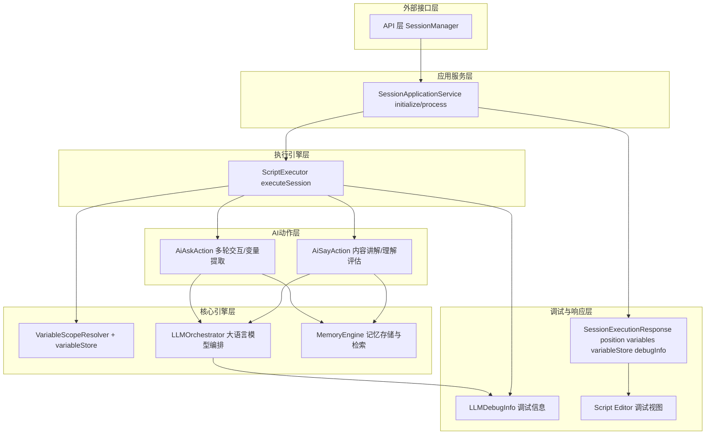
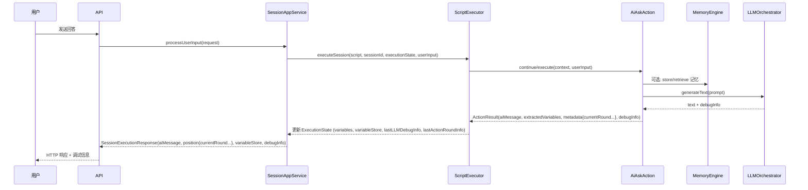

# AI 交互控制优化设计（ai_ask / ai_say）

## 1. 背景与目标

本设计基于现有 SessionApplicationService、ScriptExecutor、variableStore 以及 ExtendedExecutionPosition，系统性提升 ai_ask / ai_say 的三类可控能力：

- 变量可控：变量定义清晰、作用域可预期、写入路径统一，可追踪每个变量的来源与更新策略。
- 轮次可控：多轮交互的 currentRound / maxRounds 有统一抽象，可在脚本、全局配置与运行时之间协调控制。
- 策略可控：提问策略、讲解策略、记忆读写策略与调试策略可配置、可扩展、可观测。

同时，顺势拉起记忆框架与调试能力，使 ai_ask / ai_say 成为记忆写入/检索与 LLM 调试视图的主要入口，在不破坏现有接口与 DDD 分层的前提下完成增强。

## 2. 现状梳理

### 2.1 SessionApplicationService

- 作为应用服务层，对外暴露 initializeSession / processUserInput 两个标准接口。
- 输入：脚本内容、当前执行状态（含 position、variables、variableStore、conversationHistory、metadata）。
- 输出：SessionExecutionResponse，包含：
  - aiMessage
  - executionStatus
  - position: ExtendedExecutionPosition（已扩展 currentRound / maxRounds 却尚未系统化使用）
  - variables（扁平）
  - variableStore（分层，仅结构约定）
  - debugInfo（设计上存在，实际使用有限）
- 职责：
  - 构造初始 ExecutionState（createInitialExecutionState）。
  - 将持久化状态还原为 ExecutionState（restoreExecutionState）。
  - 调 ScriptExecutor 并将结果转换为响应模型（buildResponse / buildErrorResponse）。

### 2.2 ScriptExecutor & ExecutionState

- ExecutionState 是运行时执行视图，包含：
  - 执行游标：currentPhaseIdx / currentTopicIdx / currentActionIdx
  - 动作状态：currentAction、status
  - 变量：variables（扁平）+ variableStore（分层，含 global/session/phase/topic）
  - 对话历史：conversationHistory
  - 元数据：metadata（actionState、lastActionRoundInfo 等）
  - 调试：lastAiMessage、lastLLMDebugInfo
- 变量写入：
  - 每个 Action 返回 extractedVariables；ScriptExecutor 同时更新 variables 与 variableStore（通过 VariableScopeResolver）。
- 轮次信息：
  - AiAskAction / AiSayAction 在元数据中写入 currentRound / maxRounds；ScriptExecutor 将其落到 metadata.lastActionRoundInfo，但 ExtendedExecutionPosition 尚未系统承接。

### 2.3 AiAskAction / AiSayAction

- AiAskAction：
  - 多轮追问能力：multi-round 模板 + exit 条件；simple 模式用于单轮提问与变量直接提取。
  - 变量提取：
    - multi-round 模式：从 JSON 输出中提取 output 配置的变量；
    - simple 模式：直接将用户输入写入 target 变量。
  - 作用域：
    - 首轮执行时通过 scopeResolver 自动在 topic 作用域注册 output 变量定义。
  - 调试：
    - 调用 LLMOrchestrator 时产生 debugInfo，随 ActionResult 向上返回。

- AiSayAction：
  - 模型：
    - 模板模式：max_rounds / exit_criteria 控制多轮讲解、理解度评估与退出决策；
    - 兼容模式：require_acknowledgment 控制单轮/双轮确认逻辑。
  - 调试：
    - LLM 改写/讲解路径中，始终返回 debugInfo。

### 2.4 MemoryEngine 与调试信息

- MemoryEngine：接口与占位实现已存在，数据库层定义 memories 表，文档中明确：
  - AiAskAction / AiSayAction 是记忆写入与检索的自然触发点。
  - Session / Message 领域模型承载记忆关联信息。
- 调试信息管道：
  - LLMProvider → LLMOrchestrator → ActionResult.debugInfo → ExecutionState.lastLLMDebugInfo → SessionExecutionResponse.debugInfo。
  - 当前已实现基本传递，但缺少：
    - 与位置信息、变量快照和记忆操作的系统性关联。

## 3. 设计原则

- DDD 分层一致性：
  - 新能力优先落在应用层（SessionApplicationService）、引擎层（ScriptExecutor）、动作层（AiAskAction / AiSayAction），不侵入 API 与持久化层接口形态。
- 渐进式演进：
  - 保留现有字段与行为，新增字段/策略均为可选；
  - 优先实现“读调试/看变量”的观察性，再逐步引入复杂记忆策略。
- 策略外置，行为内核稳定：
  - 策略通过脚本配置 + 全局配置 + ActionConfig 组合驱动，不改变基础执行流（Phase → Topic → Action）。
- 单一来源与可追踪：
  - 变量来源、轮次状态与策略决策均通过 metadata 和 variableStore 可追踪，避免隐式魔法。

## 4. 能力拆解：变量可控、轮次可控、策略可控

### 4.1 变量可控

- 目标：
  - 每个变量具备：名称、作用域、定义来源、值历史、最近写入 Action 与策略。
  - ai_ask / ai_say 对变量的读/写均通过 VariableScopeResolver + variableStore，消除“隐式 session 级复制”和跨层级重复创建问题。
- 核心设计点：
  - 变量定义（VariableDefinition）统一由：
    - 脚本 output / target_variable 配置，
    - 以及 Action 运行时自动注册，
    - 通过 scopeResolver.setVariableDefinition 形成集中登记表。
  - variableStore 成为“真相源”，扁平 variables 仅作为向后兼容视图。
  - 调试 & 记忆读取时，使用 variableStore 快照而非单一扁平 Map。

### 4.2 轮次可控

- 目标：
  - currentRound / maxRounds 形成统一抽象：
    - 对前端：通过 ExtendedExecutionPosition 读到当前正在执行的 Action 轮次信息；
    - 对脚本：通过配置 max_rounds、exit 条件等控制最大轮次；
    - 对调度：ScriptExecutor / SessionApplicationService 不再散落维护轮次，而是从 Action 元数据中派生。
- 核心设计点：
  - ActionResult.metadata 始终携带 currentRound / maxRounds（如适用）。
  - ScriptExecutor 将该信息同步到 ExecutionState.metadata.lastActionRoundInfo。
  - SessionApplicationService 在 buildResponse 时，将 lastActionRoundInfo 合并进 ExtendedExecutionPosition。

### 4.3 策略可控

- 目标：
  - 提问/讲解策略、记忆读写策略、变量写入策略与调试可视化策略通过配置矩阵可组合，而不是写死在 Action 内部逻辑中。
- 核心设计点：
  - 引入“策略维度”：
    - 问答策略（ai_ask）：multi-round / simple、变量提取策略（JSON 优先 / LLM 提取 / 用户输入兜底）、验证策略、退出策略。
    - 讲解策略（ai_say）：模板模式 / 兼容模式、理解度阈值、是否要求确认、轮次上限策略。
    - 记忆策略：每个 Action 对应“写入/读取”记忆类型、重要性级别与是否启用向量检索。
    - 调试策略：是否开启 debugInfo、是否附带变量快照 / 记忆操作日志、是否在生产环境过滤。

## 5. 目标架构概览

### 5.1 组件关系

### 5.2 执行时序（多轮 ai_ask 示例）

## 6. 详细设计

### 6.1 领域模型扩展

#### 6.1.1 ExtendedExecutionPosition

- 现状：只扩展了 currentRound / maxRounds，未贯穿使用。
- 设计：
  - 字段：
    - phaseIndex / topicIndex / actionIndex（继承）
    - currentRound / maxRounds
    - actionId / actionType（从 ExecutionState.currentActionId / currentActionType 派生）
  - 来源：
    - ScriptExecutor 在每次 Action 执行/续执行后更新 ExecutionState.currentXXXId。
    - SessionApplicationService.buildResponse 组装 ExtendedExecutionPosition：
      - 从 ExecutionState 索引信息 + metadata.lastActionRoundInfo 派生轮次字段。

#### 6.1.2 变量模型与 variableStore

- 变量定义（逻辑模型）：
  - 字段：name、scope（global/session/phase/topic）、define（提取变量值的提示词）、sourceActionId、typeHint、createdAt、updatedAt。
  - 存放位置：
    - 运行时通过 VariableScopeResolver 管理定义表；
    - variableStore 以层级 Map 存值（每个条目包含 value、type、source、lastUpdated）。
- 变量写入规范：
  - 所有 extractedVariables 必须：
    - 先通过 scopeResolver.determineScope(varName) 得出作用域；
    - 再通过 scopeResolver.setVariable(varName, value, scope, position, actionId) 写入 variableStore；
    - 然后同步更新扁平 variables 视图（用于兼容旧逻辑和外部调用方）。
- 变量观察性：
  - ScriptExecutor 负责在调试日志中输出变量写入过程（已部分存在，可收敛格式）。
  - 调试信息（见 6.7）将可选携带 variableStore 快照或摘要。

#### 6.1.3 记忆模型（抽象）

- 记忆条目（MemoryItem）：id、content、importance、memoryType（短期/中期/长期/工作）、sessionId、actionId、createdAt、metadata。
- 记忆操作：
  - store：由 Action 在关键时刻进行写入；
  - retrieve：由 Action 在构建 prompt 或决策前进行检索；
  - 策略：不同 memoryType、importance 由配置控制。

### 6.2 应用服务层：SessionApplicationService 增强

#### 6.2.1 buildResponse 增强

- 责任：将 ExecutionState 映射为 SessionExecutionResponse。
- 增强点：
  - position：
    - 读取 ExecutionState.currentPhaseIdx / currentTopicIdx / currentActionIdx；
    - 读取 metadata.lastActionRoundInfo.currentRound / maxRounds；
    - 读取 currentActionId / currentActionType；
    - 组装为 ExtendedExecutionPosition。
  - variables：
    - 从 variableStore 提取扁平视图（通过 extractFlatVariables），保证变量来源统一；
  - variableStore：
    - 原样透出，用于编辑器调试视图；
  - debugInfo：
    - 指向 ExecutionState.lastLLMDebugInfo；
    - 若存在变量快照/记忆操作日志，则通过 debugInfo.metadata 或额外字段传递。

#### 6.2.2 状态恢复与 variableStore 同步

- restoreExecutionState：
  - 保证 variableStore 至少包含 global/session/phase/topic 四个层级；
  - 在同步 globalVariables 时，如果 variableStore.global 中缺少对应键，按统一包装规则补全；
  - 对 metadata 中的 actionState / lastActionRoundInfo 保持不变，供 ScriptExecutor 恢复。

#### 6.2.3 记忆与策略配置入口（抽象）

- SessionApplicationService 不直接操作 MemoryEngine，但可以成为策略的入口：
  - 预留可选配置：
    - per-session 策略：例如“是否开启记忆”、“默认记忆类型”、“调试级别”等；
    - per-request 调试开关：是否返回 debugInfo / variableStore。
  - 这些配置通过 request 中的 metadata 或上层 SessionManager 填充，SessionApplicationService 只负责向下透传到 ExecutionState.metadata 中，供 Action / ScriptExecutor 使用。

### 6.3 引擎层：ScriptExecutor 增强

#### 6.3.1 轮次信息标准化

- 规范：
  - 每次 executeAction / continueAction 收到 ActionResult 后：
    - 若 metadata.currentRound / maxRounds 存在，则更新 ExecutionState.metadata.lastActionRoundInfo；
    - 该字段仅表示“当前处于哪个轮次”，不内嵌业务含义。

#### 6.3.2 变量写入路径统一

- 已有行为：
  - 对 extractedVariables，先合并到 executionState.variables，再通过 VariableScopeResolver 写入 variableStore。
- 增强点：
  - 明确：variableStore 是写入主路径；variables 仅为镜像视图；
  - 在调试日志中统一输出：变量名、目标作用域、ActionId、Phase/Topic Id；
  - 若 variableStore 未初始化，记录警告并避免静默丢失变量写入。

#### 6.3.3 调试信息与变量快照

- 在每次保存 executionState.lastLLMDebugInfo 时：
  - 可选：
    - 将当前 position（phase/topic/action index + id）与关键变量快照（例如会话级与当前 topic 下的变量键列表）附加到 debugInfo 的元数据中；
  - 不改变 LLMDebugInfo 核心字段结构，仅通过扩展元数据实现。

#### 6.3.4 MemoryEngine 协作模型（抽象）

- ScriptExecutor 本身不直接依赖 MemoryEngine，避免引擎之间强耦合；
- 但负责为 Action 提供足够的上下文：
  - ExecutionState.conversationHistory / variableStore 中留有历史消息与变量，供 Action 在调用 MemoryEngine 时构造查询条件；
  - ExecutionState.metadata 可携带“记忆策略”参数，由上层填充。

### 6.4 动作层：AiAskAction 增强设计

#### 6.4.1 变量可控

- Output 变量注册：
  - 首轮执行时，遍历 config.output：
    - 检查 scopeResolver 中是否已有定义；
    - 若无，则在 topic 作用域自动注册；
    - 可支持从 output 配置中读取 scope 字段，允许脚本显式声明作用域。
- 变量提取策略矩阵：
  - 优先级顺序：
    1. 结构化 JSON 输出（多轮模式下）；
    2. 历史 JSON 输出 / 历史对话中寻找（findVariableInHistory）；
    3. LLM 专门提取（extractVariableByLlm）；
    4. 用户最后输入兜底。
  - 将实际采用的策略记录在 ActionResult.metadata 中（例如 extractionStrategy: 'json' / 'history' / 'llm' / 'fallback'）。

#### 6.4.2 轮次可控

- 模式统一：
  - multi-round 模式：
    - currentRound 由 BaseAction 维护；
    - 每次生成问题或处理回答时，metadata 中写入 currentRound / maxRounds；
  - simple 模式：
    - 至少在首轮发送问题时写入 currentRound / maxRounds（通常为 1）。
- 轮次策略：
  - max_rounds 决定上限；达到上限时，强制进入 finishAction；
  - exit 条件满足时提前结束；
  - 在 metadata 中记录退出原因（exitReason）。

#### 6.4.3 策略可控（问答 + 记忆）

- 问答策略：
  - 脚本配置支持：
    - 提问风格：开放式/封闭式（影响模板变量）；
    - 验证强度：是否要求非空、是否需要 LLM 二次校验结构；
    - 追问策略：继续追问条件（例如 exit 条件包含“信息是否完整”）。
- 记忆策略：
  - 写入：
    - 在 finishAction 之后，根据配置决定是否写入记忆：
      - 写入内容：变量快照 + 用户关键回答摘要；
      - 记忆类型：短期或中期（由 importance 或 memory_type 控制）。
  - 读取：
    - 在首次生成问题前，可选择性从 MemoryEngine 检索相关历史（例如用户偏好、既往回答），注入到 prompt 的系统变量中；
  - 策略元数据：
    - 在 metadata 中记录 memoryWrite / memoryRead 的开关状态与结果数量。

### 6.5 动作层：AiSayAction 增强设计

#### 6.5.1 变量可控

- 变量读取：
  - 通过 extractCommonProfileVariables / extractTopicContent 等方法，从 variableStore 中提取当前主题所需变量；
  - 保证对变量的读取使用统一接口，便于未来接入记忆回填变量。

#### 6.5.2 轮次可控

- 模板模式：
  - currentRound 每次执行自增；
  - maxRounds 控制上限；
  - exitDecision 决定是否提前结束；
  - metadata 中统一记录 currentRound / maxRounds / exitDecision。
- 兼容模式：
  - require_acknowledgment 控制是否需要第二轮确认；
  - 虽然没有 LLM 多轮逻辑，但仍可在 metadata 中显式写入 currentRound / maxRounds（固定为 1 或 2），统一外部视图。

#### 6.5.3 策略可控（讲解 + 记忆）

- 讲解策略：
  - 配置项：
    - exit_criteria：理解度阈值、是否允许带着问题退出等；
    - tone：语气风格；
    - topic_content 来源策略（当前 topic / 上下文汇总）。
- 记忆策略：
  - 写入：
    - 将关键 psychoeducation 片段写入记忆，标记类型为“教育性”或类似枚举；
  - 读取：
    - 在再次讲解同一概念时，可从记忆中检索先前解释及用户反馈，调整讲解策略（例如缩短说明，强调新增信息）。

### 6.6 记忆引擎集成模式

#### 6.6.1 写入时机

- AiAskAction：
  - 在 finishAction 后：
    - 根据 output 变量，构建记忆条目（包含变量值摘要、BRIEF 等）；
  - 可根据配置决定：
    - 是否写入；
    - 写入 memoryType（短期/中期）。
- AiSayAction：
  - 在每次完成一次讲解后：
    - 记录讲解内容、用户反馈（理解度、提问情况）为记忆；

#### 6.6.2 读取时机

- AiAskAction：
  - 在首次生成问题前：
    - 通过 MemoryEngine 检索与当前 session/topic 相关的既往回答；
    - 可将检索结果以摘要形式注入 prompt 模板的系统变量，使追问更加个性化。
- AiSayAction：
  - 在构建讲解 prompt 前：
    - 检索历史讲解片段与用户反馈，决定是否简化重复信息。

#### 6.6.3 策略与配置

- 记忆策略配置表（逻辑）：
  - 维度：Action 类型（ai_ask/ai_say）、阶段（前置读取/后置写入）、记忆类型、重要性阈值、检索模式。
  - 来源：
    - 全局配置（config/dev.yaml 等）；
    - 脚本级 overrides；
    - Session 级动态策略（由 SessionManager 注入 metadata）。

### 6.7 调试能力与观察性

#### 6.7.1 调试信息结构

- LLMDebugInfo 保持核心字段不变（prompt、response、model、config、timestamp、tokensUsed）；
- 通过可选元数据扩展：
  - 位置信息：sessionId、phaseId、topicId、actionId、indices；
  - 变量摘要：本轮涉及的变量名列表及其作用域；
  - 记忆操作：本次调用前后是否进行 retrieve/store，以及条目数量与类型。

#### 6.7.2 调试视图数据来源

- SessionExecutionResponse：
  - position：ExtendedExecutionPosition，展示当前 Action 与轮次信息；
  - variableStore：展示分层变量状态，可按作用域折叠；
  - debugInfo：展示最近一次 LLM 调用的 prompt/response 与元数据；
  - conversationHistory：已由上层持久化，可与 debugInfo 关联显示。

#### 6.7.3 环境与安全

- 开发环境：
  - 默认开启 debugInfo 与 variableStore 透出；
  - 可以透出记忆操作摘要。
- 生产环境：
  - 可按配置关闭 prompt/response 明文，仅保留必要摘要或关闭调试字段；
  - 记忆内容需要脱敏，避免在调试视图泄露敏感信息。

## 7. 配置与策略矩阵

### 7.1 ai_ask 关键配置矩阵

| 维度           | 配置项示例                    | 作用范围           | 默认行为                         |
|----------------|-------------------------------|--------------------|----------------------------------|
| 轮次控制       | max_rounds                    | Action 级           | 3 轮，多轮模式生效               |
| 退出条件       | exit 条件                     | Action 级           | 无则由 LLM 自主判断              |
| 变量声明       | output[].get / scope         | 脚本 + 运行时      | 未显式 scope 时默认 topic        |
| 变量提取策略   | extraction_strategy           | 运行时（metadata） | JSON → 历史 → LLM → 输入兜底     |
| 记忆写入       | memory.write.enabled/type     | 全局/脚本/Action   | 默认关闭，需显式开启             |
| 记忆读取       | memory.read.enabled/type      | 全局/脚本/Action   | 默认关闭，逐步灰度               |
| 调试级别       | debug.level                   | 环境/Session       | dev: full, prod: summary/none   |

### 7.2 ai_say 关键配置矩阵

| 维度           | 配置项示例                       | 作用范围         | 默认行为                           |
|----------------|----------------------------------|------------------|------------------------------------|
| 模式选择       | max_rounds / exit_criteria      | Action 级         | 无配置走 require_acknowledgment    |
| 确认策略       | require_acknowledgment          | Action 级         | true（需用户确认）                 |
| 理解度门槛     | exit_criteria.understanding_threshold | Action 级   | 80                                 |
| 记忆写入       | memory.write.enabled/type        | 全局/脚本/Action | 默认关闭                           |
| 记忆读取       | memory.read.enabled/type         | 全局/脚本/Action | 默认关闭                           |
| 调试级别       | debug.level                      | 环境/Session     | 同 ai_ask                          |

## 8. 渐进式演进与测试策略

### 8.1 阶段划分

1. 阶段一：调试与轮次可视化
   - 在不改变现有行为的前提下：
     - 完成 ExecutionState → ExtendedExecutionPosition 的轮次/Action 信息映射；
     - 将 lastLLMDebugInfo 显式透出到 SessionExecutionResponse；
     - 在 ScriptExecutor 中统一记录变量写入与轮次日志。

2. 阶段二：变量可控收敛
   - 强化 VariableScopeResolver 与 variableStore：
     - 统一变量写入路径；
     - 明确变量定义与作用域规则；
     - 修复/防止 session/topic 重复变量与作用域污染问题。

3. 阶段三：策略可控与记忆集成
   - 引入配置矩阵：
     - 在脚本与全局配置中支持记忆开关与类型选择；
     - 在 Action 元数据中记录使用的策略；
   - 与 MemoryEngine 集成：
     - 实现基础的短期/中期记忆写入；
     - 在少量关键 ai_ask / ai_say 节点上尝试记忆读取增强对话。

### 8.2 测试策略

- 单元测试：
  - AiAskAction / AiSayAction：
    - 验证 metadata 中轮次与策略字段；
    - 验证变量定义与写入行为（variableStore + variables）。
  - ScriptExecutor：
    - 验证 extractedVariables 写入 variableStore 的作用域正确；
    - 验证 lastLLMDebugInfo 与 lastActionRoundInfo 的保存与透出。
  - SessionApplicationService：
    - 验证 ExtendedExecutionPosition 中轮次与 ActionId 映射；
    - 验证 debugInfo 与 variableStore 的透出。

- 集成测试：
  - 多轮 ai_ask：
    - 验证每轮 debugInfo 更新、变量提取策略执行正确；
    - 验证退出条件与 max_rounds 行为。
  - ai_say 多轮讲解：
    - 验证理解度评估与退出决策；
  - 记忆集成（后续）：
    - 验证写入/读取行为对 prompt 的影响以及回归稳定性。
