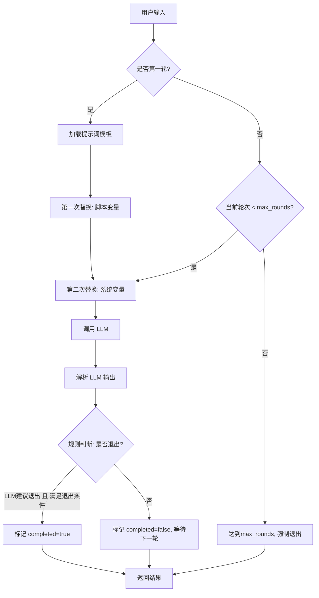

# ai_say 基础能力实现设计

## 一、实现目标

实现 ai_say 的第一阶段基础能力，包括：

1. **连续介绍能力**：ai_say 可以进行多轮对话，通过 LLM 提示词模板系统与用户持续交互
2. **理解度退出机制**：基于用户理解度自动判断何时结束当前话题
3. **提示词模板系统**：打通提示词模板的加载、变量替换（脚本层变量 `{变量名}` 与系统层变量 ``）和调用
4. **编辑器配置能力**：前端脚本编辑器支持 ai_say 新增字段的可视化配置

## 二、核心设计理念

### 2.1 设计边界

本次实现聚焦于 **第一阶段**，不包含：
- ❌ 支线 B（分析层）的深度评估与策略生成
- ❌ 支线 C（监控层）的风险监控
- ❌ 多种 subtype 的提示词模板（仅实现 introduce_concept 基础场景）
- ❌ 端到端策略生成

第一阶段包含：
- ✅ 基于单一 LLM 调用的主线 A 基础能力
- ✅ 提示词模板的两层变量替换机制
- ✅ 理解度评估与退出判断（在主线 A 内完成）
- ✅ 脚本层 ai_say 字段配置能力
- ✅ 编辑器界面对新字段的支持

### 2.2 架构简化原则

按照渐进式演进策略：
1. 先实现主线 A 的核心流程（包含简化的理解度评估）
2. 提示词模板与变量系统完整打通
3. 为后续支线 B/C 留出架构空间（接口预留，不实现）

## 三、ai_say 脚本字段设计

### 3.1 YAML 脚本结构

```yaml
sessions:
  - session: "ABC模型介绍"
    declare:
      # 用户画像变量（脚本层定义）
      - var: 教育背景
        value: 本科
      - var: 心理学知识
        value: 无
      - var: 学习风格
        value: 视觉型，喜欢具体例子
      - var: 用户名
        value: 小明
      - var: 咨询师名
        value: 李医生
    
    phases:
      - phase: "概念介绍"
        steps:
          - topic: "ABC模型核心概念"
            actions:
              - type: ai_say
                # 核心内容（必填）
                content: |
                  ABC模型是CBT的核心概念，包括三个部分：
                  - A (Activating Event): 诱发事件
                  - B (Belief): 信念/想法
                  - C (Consequence): 结果/情绪
                  它们之间的关系是：A → B → C
                  
                  【讲解要点】
                  1. 先整体介绍ABC三个要素
                  2. 用生活化例子说明A→B→C的关系
                  3. 强调B是关键，不是A直接导致C
                  4. 引导用户举出自己的例子
                
                # 新增：是否需要用户确认（默认true）
                require_acknowledgment: false
                
                # 新增：最大交互轮数（第一阶段实现）
                max_rounds: 5
                
                # 新增：退出条件（简化版，用于规则判断）
                exit_criteria:
                  understanding_threshold: 80  # 理解度阈值
                  has_questions: false         # 是否仍有疑问
```

### 3.2 字段说明

| 字段名 | 类型 | 必填 | 默认值 | 说明 |
|--------|------|------|--------|------|
| `type` | string | 是 | - | 固定为 "ai_say" |
| `content` | string | 是 | - | 讲解/说服的核心内容，支持多行 |
| `require_acknowledgment` | boolean | 否 | true | 是否需要用户确认后才继续 |
| `max_rounds` | number | 否 | 5 | 最大交互轮数（防止无限循环） |
| `exit_criteria` | object | 否 | 见下 | 退出条件配置 |
| `exit_criteria.understanding_threshold` | number | 否 | 80 | 理解度阈值（0-100） |
| `exit_criteria.has_questions` | boolean | 否 | false | 是否允许有未解决疑问 |

## 四、提示词模板系统设计

### 4.1 提示词模板存储

**目录结构**：
```
config/
  prompts/
    ai-say/
      mainline-a-introduce-concept.md  # 主线A：introduce_concept场景
```

### 4.2 主线 A 提示词模板（简化版）

**文件**: `config/prompts/ai-say/mainline-a-introduce-concept.md`

```markdown
现时间 ，你是 。请延续对话，生成给  的回应。

【讲解主题】
{topic_content}

【当前对话历史】


【用户基础信息】
- 教育背景：{教育背景}
- 心理学知识：{心理学知识}
- 学习风格：{学习风格}

【你的任务】

1. **理解度评估**：
   - 基于用户最近的回复，评估用户对讲解内容的理解度（0-100分）
   - 判断用户是否有疑问（has_questions: true/false）
   - 判断用户是否明确表达理解（expressed_understanding: true/false）

2. **生成回复**：
   - 根据【讲解主题】的要求，生成你的回复
   - 根据【用户基础信息】调整语言风格和难度
   - 确保回复自然、温暖、专业

3. **判断是否退出**：
   - 退出条件：理解度 >=  且无疑问
   - 或：理解度 >= 70 且用户明确表达理解

【输出格式】
严格按照以下 JSON 格式输出：
{
  "assessment": {
    "understanding_level": 0-100,
    "has_questions": true|false,
    "expressed_understanding": true|false,
    "reasoning": "评估理由..."
  },
  "response": {
    "咨询师": "你的回复内容..."
  },
  "should_exit": true|false,
  "exit_reason": "退出或继续的原因..."
}
```

### 4.3 两层变量系统

#### 脚本层变量：`{变量名}`
- 来源：脚本 YAML 的 `declare` 部分
- 示例：`{教育背景}`, `{心理学知识}`, `{用户名}`
- 替换时机：**第一次**（在加载模板后立即替换）

#### 系统层变量：``
- 来源：运行时上下文、系统计算
- 示例：``, ``, ``, ``
- 替换时机：**第二次**（在脚本变量替换后，调用 LLM 前替换）

#### 替换顺序示例

**原始模板**：
```
你是 ，用户的教育背景是{教育背景}。
理解度阈值：
```

**第一次替换（脚本变量）**：
```
你是 ，用户的教育背景是本科。
理解度阈值：
```

**第二次替换（系统变量）**：
```
你是 李医生，用户的教育背景是本科。
理解度阈值：80
```

### 4.4 变量映射表

#### 系统层变量定义

| 变量名 | 数据来源 | 说明 |
|--------|----------|------|
| `` | `new Date().toISOString()` | 当前时间 |
| `` | `context.variables.get('咨询师名')` | AI 角色名称 |
| `` | `context.variables.get('用户名')` | 用户名称 |
| `` | `context.conversationHistory` 最近N条 | 对话历史 |
| `` | `action.exit_criteria?.understanding_threshold ?? 80` | 理解度阈值 |
| `` | `action.currentRound` | 当前轮次 |
| `` | `action.max_rounds ?? 5` | 最大轮次 |

#### 特殊变量：`{topic_content}`

`{topic_content}` 是一个混合变量：
- 它本身是脚本层变量（从 `action.content` 获取）
- 但它的内容中可能包含其他脚本层变量
- 需要在主模板替换前，先对 `content` 内部进行脚本变量替换

## 五、核心执行流程设计

### 5.1 ai_say Action 执行流程



### 5.2 退出决策机制（简化版）

第一阶段采用**规则 + LLM建议**的混合决策：

#### 规则层判断

```typescript
interface ExitDecision {
  should_exit: boolean;
  reason: string;
  decision_source: 'max_rounds' | 'exit_criteria' | 'llm_suggestion';
}

function decideExit(
  currentRound: number,
  maxRounds: number,
  exitCriteria: ExitCriteria,
  llmOutput: MainLineOutput
): ExitDecision {
  // 规则1: 达到最大轮次
  if (currentRound >= maxRounds) {
    return {
      should_exit: true,
      reason: `达到最大轮次限制 (${maxRounds})`,
      decision_source: 'max_rounds'
    };
  }

  // 规则2: LLM 建议退出 + 满足退出条件
  if (llmOutput.should_exit) {
    const { understanding_level, has_questions, expressed_understanding } = llmOutput.assessment;
    const threshold = exitCriteria.understanding_threshold ?? 80;

    // 条件1：理解度达标且无疑问
    if (understanding_level >= threshold && !has_questions) {
      return {
        should_exit: true,
        reason: `理解度${understanding_level}达到${threshold}且无疑问`,
        decision_source: 'exit_criteria'
      };
    }

    // 条件2：理解度70+且明确表达理解
    if (understanding_level >= 70 && expressed_understanding) {
      return {
        should_exit: true,
        reason: `理解度${understanding_level}达到70+且用户明确表达理解`,
        decision_source: 'exit_criteria'
      };
    }
  }

  // 规则3: 继续
  return {
    should_exit: false,
    reason: llmOutput.exit_reason || '继续讲解',
    decision_source: 'llm_suggestion'
  };
}
```

## 六、核心类与接口设计

### 6.1 提示词模板管理器

```typescript
/**
 * 提示词模板加载器
 */
interface PromptTemplate {
  templateId: string;
  content: string;
  variables: string[];  // 模板中使用的变量列表
}

class PromptTemplateManager {
  private templates: Map<string, PromptTemplate> = new Map();

  /**
   * 加载提示词模板
   */
  async loadTemplate(templatePath: string): Promise<PromptTemplate>;

  /**
   * 获取模板
   */
  getTemplate(templateId: string): PromptTemplate | undefined;

  /**
   * 两层变量替换
   * @param template 原始模板
   * @param scriptVariables 脚本层变量 (从 context.variables 获取)
   * @param systemVariables 系统层变量 (运行时计算)
   */
  substituteVariables(
    template: string,
    scriptVariables: Map<string, any>,
    systemVariables: Record<string, any>
  ): string;
}
```

### 6.2 AiSayAction 增强

```typescript
/**
 * ai_say 配置（扩展）
 */
interface AiSayConfig {
  content: string;  // 必填：讲解内容
  require_acknowledgment?: boolean;  // 是否需要确认
  max_rounds?: number;  // 最大轮数
  exit_criteria?: {
    understanding_threshold?: number;
    has_questions?: boolean;
  };
}

/**
 * LLM 输出格式（主线 A 简化版）
 */
interface MainLineOutput {
  assessment: {
    understanding_level: number;  // 0-100
    has_questions: boolean;
    expressed_understanding: boolean;
    reasoning: string;
  };
  response: {
    咨询师: string;
  };
  should_exit: boolean;
  exit_reason: string;
}

class AiSayAction extends BaseAction {
  private templateManager: PromptTemplateManager;
  private currentRound: number = 0;
  private maxRounds: number;
  private exitCriteria: AiSayConfig['exit_criteria'];

  async execute(context: ActionContext, userInput?: string): Promise<ActionResult> {
    // 1. 加载提示词模板
    const template = await this.loadPromptTemplate();

    // 2. 准备变量
    const scriptVariables = this.extractScriptVariables(context);
    const systemVariables = this.buildSystemVariables(context);

    // 3. 两层变量替换
    const prompt = this.templateManager.substituteVariables(
      template.content,
      scriptVariables,
      systemVariables
    );

    // 4. 调用 LLM
    const llmOutput = await this.callLLM(prompt);

    // 5. 退出决策
    this.currentRound++;
    const exitDecision = this.decideExit(llmOutput);

    // 6. 返回结果
    return {
      success: true,
      completed: exitDecision.should_exit,
      aiMessage: llmOutput.response.咨询师,
      metadata: {
        actionType: 'ai_say',
        currentRound: this.currentRound,
        assessment: llmOutput.assessment,
        exitDecision
      }
    };
  }

  private async loadPromptTemplate(): Promise<PromptTemplate> {
    // 第一阶段固定使用 introduce_concept 模板
    return this.templateManager.getTemplate('ai-say-mainline-a-introduce-concept');
  }

  private extractScriptVariables(context: ActionContext): Map<string, any> {
    // 从 context.variables 提取脚本定义的变量
    const variables = new Map<string, any>();
    
    // 添加核心内容
    variables.set('topic_content', this.config.content);
    
    // 添加用户画像变量
    const userVars = ['教育背景', '心理学知识', '学习风格', '用户名', '咨询师名'];
    userVars.forEach(varName => {
      const value = context.variables.get(varName);
      if (value !== undefined) {
        variables.set(varName, value);
      }
    });

    return variables;
  }

  private buildSystemVariables(context: ActionContext): Record<string, any> {
    return {
      time: new Date().toISOString(),
      who: context.variables.get('咨询师名') || 'AI咨询师',
      user: context.variables.get('用户名') || '来访者',
      chat_history: this.formatChatHistory(context.conversationHistory),
      understanding_threshold: this.exitCriteria?.understanding_threshold ?? 80,
      current_round: this.currentRound,
      max_rounds: this.maxRounds
    };
  }

  private formatChatHistory(history: Message[]): string {
    // 获取最近 10 条消息
    const recent = history.slice(-10);
    return recent
      .map(msg => `${msg.role}: ${msg.content}`)
      .join('\n');
  }

  private async callLLM(prompt: string): Promise<MainLineOutput> {
    const result = await this.llmOrchestrator.generateText(prompt, {
      temperature: 0.7,
      maxTokens: 1000
    });

    // 解析 JSON 输出
    try {
      return JSON.parse(result.text);
    } catch (error) {
      throw new Error(`Failed to parse LLM output: ${result.text}`);
    }
  }

  private decideExit(llmOutput: MainLineOutput): ExitDecision {
    // 实现前文的退出决策逻辑
    return decideExit(
      this.currentRound,
      this.maxRounds,
      this.exitCriteria,
      llmOutput
    );
  }
}
```

### 6.3 变量替换实现

```typescript
class PromptTemplateManager {
  /**
   * 两层变量替换
   */
  substituteVariables(
    template: string,
    scriptVariables: Map<string, any>,
    systemVariables: Record<string, any>
  ): string {
    let result = template;

    // 第一层：替换脚本变量 {变量名}
    scriptVariables.forEach((value, key) => {
      const pattern = new RegExp(`\\{${key}\\}`, 'g');
      result = result.replace(pattern, String(value));
    });

    // 第二层：替换系统变量 
    Object.entries(systemVariables).forEach(([key, value]) => {
      const pattern = new RegExp(`\\{%${key}%\\}`, 'g');
      result = result.replace(pattern, String(value));
    });

    return result;
  }

  /**
   * 提取模板中的变量
   */
  extractVariables(template: string): {
    scriptVars: string[];
    systemVars: string[];
  } {
    const scriptVars: string[] = [];
    const systemVars: string[] = [];

    // 匹配 {变量名}
    const scriptPattern = /\{([^%\}]+)\}/g;
    let match;
    while ((match = scriptPattern.exec(template)) !== null) {
      scriptVars.push(match[1]);
    }

    // 匹配 
    const systemPattern = /\{%([^%]+)%\}/g;
    while ((match = systemPattern.exec(template)) !== null) {
      systemVars.push(match[1]);
    }

    return { scriptVars, systemVars };
  }
}
```

## 七、前端编辑器配置能力

### 7.1 脚本类型定义扩展

**文件**: `packages/script-editor/src/types/action.ts`

```typescript
export interface Action {
  type: 'ai_say' | 'ai_ask' | 'ai_think' | 'use_skill' | 'show_form' | 'show_pic';
  condition?: string;

  // ai_say 特有字段
  ai_say?: string;  // 保留向后兼容
  content?: string;  // 新字段（优先使用）
  require_acknowledgment?: boolean;
  max_rounds?: number;
  exit_criteria?: {
    understanding_threshold?: number;
    has_questions?: boolean;
  };

  // 其他 action 类型字段...
}
```

### 7.2 ActionPropertyPanel 增强

**文件**: `packages/script-editor/src/components/ActionPropertyPanel/index.tsx`

**修改内容**：

```tsx
{/* AI Say 类型 */}
{action.type === 'ai_say' && (
  <>
    <Form.Item
      label="讲解内容"
      name="content"
      rules={[{ required: true, message: '请输入讲解内容' }]}
      tooltip="讲解/说服的核心内容，支持多行文本和脚本变量"
    >
      <TextArea 
        rows={10} 
        placeholder="输入讲解内容，可使用变量 {变量名}..." 
        showCount 
      />
    </Form.Item>

    <Divider orientation="left">交互设置</Divider>

    <Row gutter={16}>
      <Col span={8}>
        <Form.Item 
          label="需要用户确认" 
          name="require_acknowledgment"
          valuePropName="checked"
          tooltip="是否需要用户回复后才继续执行"
        >
          <Switch defaultChecked />
        </Form.Item>
      </Col>
      <Col span={8}>
        <Form.Item 
          label="最大交互轮数" 
          name="max_rounds"
          tooltip="防止无限循环的保护机制"
          rules={[{ type: 'number', min: 1, max: 20 }]}
        >
          <InputNumber min={1} max={20} defaultValue={5} style={{ width: '100%' }} />
        </Form.Item>
      </Col>
    </Row>

    <Divider orientation="left">退出条件</Divider>

    <Collapse ghost defaultActiveKey={[]}>
      <Panel header="高级退出条件配置（可选）" key="exit_criteria">
        <Row gutter={16}>
          <Col span={12}>
            <Form.Item 
              label="理解度阈值" 
              name={['exit_criteria', 'understanding_threshold']}
              tooltip="用户理解度达到此阈值时允许退出（0-100）"
            >
              <InputNumber 
                min={0} 
                max={100} 
                defaultValue={80} 
                style={{ width: '100%' }}
                formatter={value => `${value}%`}
                parser={value => value?.replace('%', '') as any}
              />
            </Form.Item>
          </Col>
          <Col span={12}>
            <Form.Item 
              label="允许有疑问退出" 
              name={['exit_criteria', 'has_questions']}
              valuePropName="checked"
              tooltip="是否允许用户仍有疑问时退出话题"
            >
              <Switch />
            </Form.Item>
          </Col>
        </Row>
      </Panel>
    </Collapse>
  </>
)}
```

### 7.3 Form 初始化与保存逻辑

```tsx
// 当选中的 Action 变化时,更新表单
React.useEffect(() => {
  if (action && action.type === 'ai_say') {
    form.setFieldsValue({
      content: action.content || action.ai_say || '',  // 兼容旧字段
      require_acknowledgment: action.require_acknowledgment ?? true,
      max_rounds: action.max_rounds ?? 5,
      exit_criteria: {
        understanding_threshold: action.exit_criteria?.understanding_threshold ?? 80,
        has_questions: action.exit_criteria?.has_questions ?? false
      }
    });
  }
}, [action, form]);

// 保存逻辑
const handleSave = () => {
  form.validateFields().then((values) => {
    if (action?.type === 'ai_say') {
      const updatedAction: Action = {
        ...action,
        content: values.content,
        require_acknowledgment: values.require_acknowledgment,
        max_rounds: values.max_rounds,
        exit_criteria: values.exit_criteria
      };
      onSave(updatedAction);
    }
  });
};
```

## 八、数据流与调用链路

### 8.1 完整调用链路

```
1. 脚本加载
   └─> ScriptExecutor.loadScript(yaml)
       └─> 解析 YAML
       └─> 创建 AiSayAction 实例
           ├─> config.content
           ├─> config.max_rounds
           └─> config.exit_criteria

2. 首次执行
   └─> AiSayAction.execute(context, userInput)
       ├─> loadPromptTemplate() 
       │   └─> 从文件系统加载模板
       │
       ├─> extractScriptVariables(context)
       │   └─> 提取 {教育背景}, {心理学知识} 等
       │
       ├─> buildSystemVariables(context)
       │   └─> 构建 ,  等
       │
       ├─> substituteVariables(template, scriptVars, sysVars)
       │   └─> 执行两层替换
       │
       ├─> llmOrchestrator.generateText(prompt)
       │   └─> 调用 LLM API
       │
       ├─> parseJSON(llmOutput)
       │   └─> 解析结构化输出
       │
       └─> decideExit(llmOutput)
           └─> 返回 ActionResult

3. 后续轮次
   └─> AiSayAction.execute(context, userInput)
       └─> currentRound++
       └─> 重复步骤 2（使用更新后的对话历史）
```

### 8.2 变量流转示意

```
YAML 脚本
  ↓
declare:
  - var: 教育背景
    value: 本科
  ↓
SessionContext.variables
  ↓
ActionContext.variables.get('教育背景')
  ↓
scriptVariables Map
  ↓
第一次替换: {教育背景} → 本科
  ↓
systemVariables Object
  ↓
第二次替换:  → 2025-01-20T10:30:00Z
  ↓
完整提示词
  ↓
LLM API
```

## 九、实现阶段规划

### 阶段 1：提示词模板基础设施（优先）

**目标**：建立提示词模板加载和变量替换机制

**任务**：
1. 创建 `PromptTemplateManager` 类
2. 实现两层变量替换逻辑
3. 编写单元测试验证替换正确性
4. 创建示例提示词模板文件

**交付物**：
- `packages/core-engine/src/engines/prompt-template/template-manager.ts`
- `config/prompts/ai-say/mainline-a-introduce-concept.md`
- 单元测试

### 阶段 2：AiSayAction 核心逻辑增强

**目标**：实现多轮对话与退出决策

**任务**：
1. 扩展 `AiSayAction` 类
   - 添加 `currentRound`, `maxRounds` 属性
   - 实现提示词模板加载逻辑
   - 实现变量提取与注入
2. 实现退出决策逻辑（规则 + LLM建议）
3. 集成 LLM 调用并解析 JSON 输出

**交付物**：
- `packages/core-engine/src/actions/ai-say-action.ts` (增强版)
- 集成测试脚本

### 阶段 3：脚本类型扩展

**目标**：支持 ai_say 新字段的解析与验证

**任务**：
1. 扩展 Action 接口定义
2. 更新 YAML 解析器以支持新字段
3. 添加字段验证逻辑

**交付物**：
- `packages/shared-types/src/domain/action.ts`
- `packages/api-server/src/services/script-parser.ts`

### 阶段 4：前端编辑器界面

**目标**：可视化配置 ai_say 新字段

**任务**：
1. 更新 `ActionPropertyPanel` 组件
2. 添加表单字段和验证规则
3. 实现自动保存逻辑
4. 编写前端单元测试

**交付物**：
- `packages/script-editor/src/components/ActionPropertyPanel/index.tsx` (增强版)
- 组件测试

### 阶段 5：端到端集成测试

**目标**：验证完整流程

**任务**：
1. 创建测试脚本（ABC 模型介绍场景）
2. 模拟多轮对话交互
3. 验证退出决策正确性
4. 验证编辑器配置保存和加载

**交付物**：
- E2E 测试用例
- 测试报告

## 十、测试策略

### 10.1 单元测试

#### 提示词模板管理器
```typescript
describe('PromptTemplateManager', () => {
  test('应正确替换脚本变量', () => {
    const template = '用户的教育背景是{教育背景}';
    const scriptVars = new Map([['教育背景', '本科']]);
    const result = manager.substituteVariables(template, scriptVars, {});
    expect(result).toBe('用户的教育背景是本科');
  });

  test('应正确替换系统变量', () => {
    const template = '当前时间是';
    const sysVars = { time: '2025-01-20' };
    const result = manager.substituteVariables(template, new Map(), sysVars);
    expect(result).toBe('当前时间是2025-01-20');
  });

  test('应按顺序执行两层替换', () => {
    const template = '{用户名}，现在是';
    const scriptVars = new Map([['用户名', '小明']]);
    const sysVars = { time: '10:00' };
    const result = manager.substituteVariables(template, scriptVars, sysVars);
    expect(result).toBe('小明，现在是10:00');
  });
});
```

#### 退出决策逻辑
```typescript
describe('Exit Decision Logic', () => {
  test('达到max_rounds时应强制退出', () => {
    const decision = decideExit(5, 5, {}, mockLLMOutput);
    expect(decision.should_exit).toBe(true);
    expect(decision.decision_source).toBe('max_rounds');
  });

  test('理解度达标且无疑问时应退出', () => {
    const llmOutput = {
      should_exit: true,
      assessment: {
        understanding_level: 85,
        has_questions: false,
        expressed_understanding: false
      }
    };
    const decision = decideExit(2, 5, { understanding_threshold: 80 }, llmOutput);
    expect(decision.should_exit).toBe(true);
    expect(decision.decision_source).toBe('exit_criteria');
  });

  test('理解度70+且明确表达理解时应退出', () => {
    const llmOutput = {
      should_exit: true,
      assessment: {
        understanding_level: 75,
        has_questions: true,
        expressed_understanding: true
      }
    };
    const decision = decideExit(2, 5, {}, llmOutput);
    expect(decision.should_exit).toBe(true);
  });
});
```

### 10.2 集成测试

```typescript
describe('AiSayAction Integration', () => {
  test('应完成完整的多轮对话流程', async () => {
    const action = new AiSayAction(
      'action-1',
      {
        content: 'ABC模型的讲解...',
        max_rounds: 3
      },
      mockLLMOrchestrator
    );

    // 第1轮
    const result1 = await action.execute(context, '请告诉我什么是ABC模型');
    expect(result1.completed).toBe(false);
    expect(result1.metadata.currentRound).toBe(1);

    // 第2轮
    const result2 = await action.execute(context, '我有点明白了');
    expect(result2.completed).toBe(false);
    expect(result2.metadata.currentRound).toBe(2);

    // 第3轮（达到理解度阈值）
    mockLLMOrchestrator.setResponse({
      assessment: { understanding_level: 85, has_questions: false },
      should_exit: true
    });
    const result3 = await action.execute(context, '我完全理解了');
    expect(result3.completed).toBe(true);
  });
});
```

### 10.3 E2E 测试

```yaml
# test-script.yaml
sessions:
  - session: "测试ABC模型讲解"
    declare:
      - var: 教育背景
        value: 本科
      - var: 用户名
        value: 测试用户
      - var: 咨询师名
        value: AI助手
    
    phases:
      - phase: "概念讲解"
        steps:
          - topic: "ABC模型"
            actions:
              - type: ai_say
                content: "ABC模型包括..."
                max_rounds: 3
                exit_criteria:
                  understanding_threshold: 80
```

**测试场景**：
1. 加载测试脚本
2. 模拟用户输入："什么是ABC模型？"
3. 验证 AI 回复包含讲解内容
4. 模拟用户输入："我有点理解了"
5. 验证 AI 继续讲解
6. 模拟用户输入："我完全明白了"
7. 验证 AI 识别理解度并退出

## 十一、关键技术决策

### 11.1 为什么采用两层变量系统？

**决策**：分离脚本层变量 `{变量名}` 和系统层变量 ``

**理由**：
1. **关注点分离**：脚本作者只关心业务变量（用户画像），系统变量由框架自动注入
2. **替换顺序明确**：先替换脚本变量，再替换系统变量，避免冲突
3. **扩展性**：未来添加新的系统变量不影响脚本层

### 11.2 为什么第一阶段不实现支线 B/C？

**决策**：仅实现主线 A（单一 LLM 调用）

**理由**：
1. **渐进式演进**：先打通提示词模板与变量系统的基础设施
2. **降低复杂度**：支线 B/C 涉及异步调度、策略生成等复杂逻辑
3. **快速验证**：简化版可快速验证核心流程是否可行
4. **架构预留**：接口设计已考虑未来扩展（`PromptTemplateManager` 支持多模板）

### 11.3 为什么退出决策采用规则 + LLM建议？

**决策**：规则层做最终决策，LLM 提供建议

**理由**：
1. **可控性**：规则保证系统行为的确定性（如 max_rounds 强制退出）
2. **灵活性**：LLM 提供语义判断（理解度、疑问识别）
3. **可观测性**：分离决策来源，便于调试和优化

## 十二、风险与应对

### 12.1 LLM 输出格式不稳定

**风险**：LLM 可能不输出严格的 JSON 格式

**应对**：
1. 在提示词中强调输出格式要求
2. 实现健壮的 JSON 解析（容错处理）
3. 添加格式验证和重试机制
4. 记录解析失败的原始输出，用于优化提示词

### 12.2 变量替换遗漏

**风险**：模板中的变量未被替换

**应对**：
1. 在替换后检查是否仍存在未替换的变量标记
2. 记录告警日志
3. 提供变量检查工具（开发时）

### 12.3 提示词模板维护成本

**风险**：提示词模板难以维护和版本管理

**应对**：
1. 使用 Markdown 格式（便于阅读和编辑）
2. 提示词文件纳入版本控制
3. 建立提示词优化流程（数据分析 → 优化 → A/B测试）

## 十三、后续演进路径

### 第二阶段：支线 B 分析层

**目标**：实现深度评估与策略生成

**关键能力**：
- 异步执行（不阻塞主线 A）
- 用户画像的动态更新
- 端到端策略生成
- 步骤规划与调整

### 第三阶段：支线 C 监控层

**目标**：实现风险监控与干预

**关键能力**：
- 风险信号识别
- 回复内容审核
- 安全干预建议

### 第四阶段：多 subtype 支持

**目标**：支持不同场景的提示词模板

**关键能力**：
- subtype 自动推断
- 模板组管理
- 评估维度配置化

## 十四、成功标准

### 14.1 功能完整性

- [x] ai_say 可以进行多轮对话（max_rounds 限制内）
- [x] 基于理解度评估自动退出
- [x] 提示词模板系统正常工作
- [x] 两层变量替换正确执行
- [x] 前端编辑器支持新字段配置

### 14.2 质量标准

- [x] 单元测试覆盖率 ≥ 80%
- [x] 集成测试通过率 100%
- [x] E2E 测试验证完整流程
- [x] 代码符合 TypeScript 规范

### 14.3 性能标准

- [x] 单轮 LLM 调用响应时间 ≤ 3秒
- [x] 变量替换耗时 ≤ 10ms
- [x] 模板加载缓存命中率 ≥ 95%

### 14.4 可用性标准

- [x] CBT 工程师可以通过编辑器配置 ai_say
- [x] 提示词模板易于阅读和修改
- [x] 调试信息完整（LLM 输入输出、决策依据）
