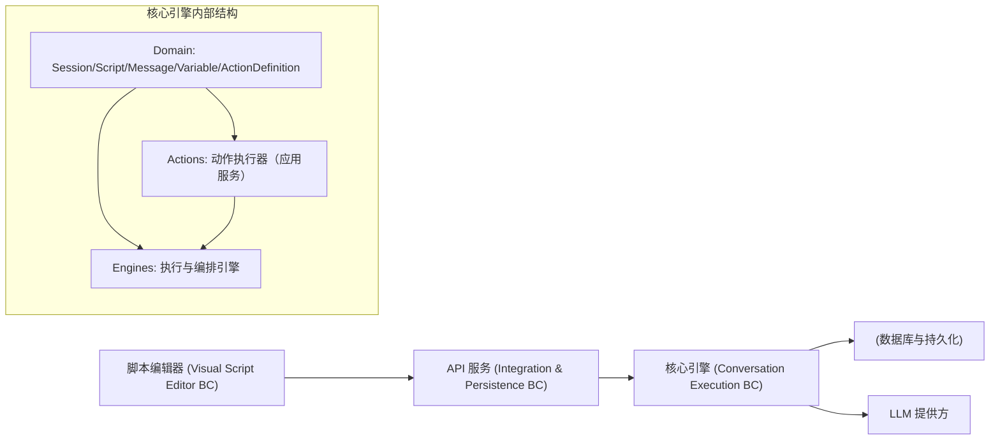
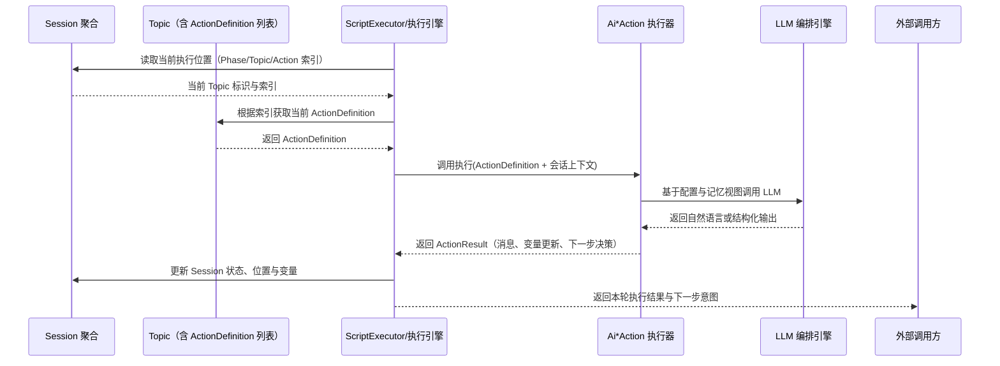

# HeartRule 核心引擎 DDD 分析与重构规划

## 1. 背景与范围

本设计文档从领域驱动设计（DDD）的视角，对当前 HeartRule 项目的核心能力（尤其是脚本驱动的咨询引擎）进行战略设计与战术设计梳理，并基于 Martin Fowler 的重构思想给出演进式重构规划。重点聚焦于：

- packages/core-engine：脚本执行引擎、LLM 编排、变量提取、记忆等“核心引擎”能力
- packages/api-server：会话管理、脚本管理等 API 层能力
- packages/script-editor：脚本编辑器与调试工具

目标是：

- 统一领域语言与边界上下文（战略层）
- 澄清领域模型、Action 系统与引擎层的职责（战术层）
- 规划一条在不改变既有行为前提下、可渐进实施的重构路径

## 2. 业务概览与核心场景

### 2.1 业务价值

系统通过“脚本 + 核心引擎”的模式驱动咨询会话，围绕心理咨询和对话式干预提供能力：

- 咨询脚本建模：用 YAML/JSON 描述 Session–Phase–Topic–Action 的层级结构
- 会话执行：根据脚本驱动 AI 与用户的多轮交互，维护会话状态与变量
- 变量提取与记忆：在对话中抽取关键变量，维护多层作用域变量与长期记忆
- 调试与可视化：通过脚本编辑器和调试面板理解与验证脚本执行行为

### 2.2 关键概念（领域语言）

- Session（会话）：一次完整的咨询过程，是核心聚合
- Script（脚本）：描述 Session 内部结构的配置与流程
- Message（消息）：会话中的单条对话记录
- Variable（变量）：会话中被跟踪与使用的状态数据
- Action（动作）：
  - 在脚本中以 ActionDefinition 的形式出现，是最小的“咨询行为”定义单元（如 ai_say、ai_ask 等）
  - 在运行时由 Action 执行器（如 AiSayAction、AiAskAction）在应用层完成具体执行
- Engine（引擎）：围绕脚本执行、变量提取、LLM 编排等的编排器

## 3. 战略设计：领域划分与上下文边界

### 3.1 Bounded Context 划分

从当前代码结构与文档出发，可以抽象出以下主要边界上下文：

1. 会话执行上下文（Conversation Execution BC）
   - 主要位置：core-engine（domain + actions + engines），api-server 中与 Session 执行相关的路由
   - 关注点：会话生命周期、脚本驱动执行、变量与消息流转

2. 脚本管理上下文（Script Management BC）
   - 主要位置：api-server 的脚本路由与数据库 Schema，core-engine 中 Script 领域模型
   - 关注点：脚本的导入、解析、版本管理、发布/归档

3. 记忆与知识上下文（Memory & Knowledge BC）
   - 主要位置：core-engine 的记忆引擎、RAG/检索组件、知识图谱相关模块，以及负责持久化聊天记录与咨询笔记的 API/存储层
   - 关注点：对咨询过程中的“可回顾事实”的建模与组织（聊天记录、咨询笔记、长期记忆、知识图谱与索引），支撑后续检索与推理

4. 可视化脚本编辑上下文（Visual Script Editor BC）
   - 主要位置：script-editor 前端应用
   - 关注点：脚本可视化编辑、版本管理、调试工具、与核心引擎的交互

5. 系统接入与存储上下文（Integration & Persistence BC）
   - 主要位置：api-server、数据库 Schema、外部 LLM 服务适配
   - 关注点：HTTP API、数据库持久化、LLM 提供方接入

### 3.1.1 变量 vs 记忆的边界（Evans 视角）

从领域语言与用例出发，可以将“变量”和“记忆/知识”明确区分为两个不同关注点：

- 变量（Variables）
  - 主要作用：驱动和控制会谈流程的运行时状态，例如：当前已问到哪一步、某个问题的回答是否完整、某个分支条件是否满足等。
  - 所属上下文：会话执行 BC（Conversation Execution BC）的内部状态，是 Session/Topic/ActionDefinition 周围的“控制数据”。
  - 面向对象：更多是“系统自身”，通常不直接以原样展示给来访者或咨询师。

- 记忆/知识（Memory & Knowledge）
  - 主要作用：沉淀和组织“可被回顾和理解的事实”，包括：聊天记录、咨询笔记、长期记忆片段、知识图谱节点与关系等。
  - 所属上下文：记忆与知识 BC（Memory & Knowledge BC），在系统架构中作为独立支撑子域存在。
  - 面向对象：既服务于系统内部检索与推理（RAG、策略选择），也可以以合适的形式展示给咨询师和来访者（例如会谈记录、摘要、结构化笔记）。

变量与记忆之间的关系：

- 会话执行 BC 在运行时维护变量，用于控制流程与分支；
- 记忆与知识 BC 可以基于聊天记录、咨询笔记和部分变量“生成或更新长期记忆与知识结构”；
- 两者通过明确的接口交互，而不是共享同一个聚合或上下文，避免将“控制状态”和“业务事实/知识”混在一个 BC 中。

### 3.2 上下文之间的关系

用 DDD 视角抽象当前分层与依赖关系：

这里 Core Engine 被视为会话执行 BC 的核心，API 层作为其上游调用者，脚本编辑器作为更外层的 UI/工具 BC。

### 3.3 核心域与支撑域

- 核心域（Core Domain）
  - 会话执行与脚本驱动引擎（Conversation Execution BC）
  - 领域模型：Session、Script、Message、Variable
  - 能力：脚本解析与执行、变量与记忆管理、多轮 AI 交互

- 支撑子域（Supporting Subdomains）
  - 可视化脚本编辑与调试（Visual Script Editor BC）
  - 记忆与知识（Memory & Knowledge BC：聊天记录、咨询笔记、长期记忆、知识图谱等）

- 通用子域（Generic Subdomains）
  - API 路由与会话/脚本 CRUD
  - 数据库 Schema 与持久化
  - LLM 提供方适配与调用

## 4. 战术设计：核心引擎与 API 层

### 4.1 领域模型（Domain Layer）

#### 4.1.1 Session 聚合

Session 是会话执行 BC 的核心聚合，负责：

- 会话生命周期：启动、暂停、恢复、完成、失败
- 执行状态：运行、等待用户输入、暂停、完成等
- 执行位置：当前 Phase/Topic/Action 索引
- 变量与元数据：保存会话级变量与元信息

表：Session 聚合的关键职责

| 方面           | 职责概述                                    |
| -------------- | ------------------------------------------- |
| 身份与关联     | 标识、关联用户、关联脚本                    |
| 生命周期控制   | 根据业务规则变更会话状态与执行状态          |
| 执行位置管理   | 维护当前 Phase/Topic/Action 的索引与标识    |
| 变量管理       | 读写会话级变量，协调 variableStore 与作用域 |
| 序列化与持久化 | 提供向 API 层/数据库的结构化输出            |

#### 4.1.2 Script 实体

Script 体现脚本管理 BC 与会话执行 BC 的交界：

- 描述脚本元数据（名称、类型、版本、状态、标签等）
- 封装脚本原始内容与解析后的结构
- 提供发布、归档等状态转换行为

#### 4.1.3 Message 值对象/实体

Message 在会话执行 BC 中承担：

- 表达一条对话消息（角色、内容、关联 Action、时间戳等）
- 参与 conversationHistory 的维护
- 为调试与可视化提供基础数据

#### 4.1.4 Variable 领域对象

Variable 与 VariableState 聚焦：

- 表达变量的值、类型、作用域、更新策略与历史
- 为 variableStore 提供结构化视图
- 支持变量回滚与溯源

在会话执行 BC 中，变量更接近“控制状态”：

- 用于驱动会谈流程（决定走哪条分支、是否进入某个 Topic、Action 是否完成等）
- 通常不以原始形式呈现给来访者或咨询师，而是作为内部决策依据
- 在需要时，记忆与知识 BC 可以基于变量和聊天记录，将重要信息沉淀为长期记忆或结构化知识条目

#### 4.1.5 脚本与 ActionDefinition 结构

在会话执行 BC 中，脚本不仅仅是一段 YAML 文本，而是一个包含层次与意图的领域结构模型：

- Session Script：描述一整场会谈的流程与元数据
- Phase（阶段）：围绕一个阶段性目标组织相关话题
- Topic（话题）：围绕一个具体、可描述的“最小咨询目标”组织一组动作
- ActionDefinition（动作定义）：Topic 内最小的“可执行领域行为”单元

在解析后的领域模型中，可将脚本结构抽象为：

- Script 聚合：
  - 持有 Phase 列表
  - 提供按会谈流程顺序遍历 Phase/Topic 的能力
- Phase 对象：
  - 持有 Topic 列表
  - 承载阶段级别的目标说明与元数据
- Topic 对象：
  - 持有 ActionDefinition 列表
  - 表达“这个话题要通过哪些动作达成什么目标”
- ActionDefinition 值对象：
  - 动作类型（ai_say / ai_ask / ai_think / use_skill / show_form / show_pic 等）
  - 业务意图标签（介绍、澄清、追问、评估、填表、 psychoeducation 等）
  - 配置参数（内容模板、变量映射、最大轮数、退出条件等）
  - 所需上下文视图（需要访问的变量范围、记忆视图、历史消息窗口等）

表：ActionDefinition 领域结构要素

| 维度         | 示例字段/含义                                     |
| ------------ | ------------------------------------------------- |
| 身份与类型   | action_id（脚本内标识）、action_type（ai_ask 等） |
| 业务意图     | intent（介绍/追问/评估/填表等）                   |
| 配置         | content、max_rounds、exit_criteria 等             |
| 变量交互     | read_variables、write_variables、作用域策略       |
| 记忆与上下文 | memory_view（短期/中期/长期）、history_window     |
| 调试与标签   | tracing_tag、explain_label（供调试与可视化使用）  |

从 Evans 的视角看：

- Script/Phase/Topic 是会谈流程的结构化领域模型，属于聚合/实体层次
- ActionDefinition 是 Topic 内的值对象，描述“要做什么”和“为什么这么做”
- 运行时的 Action 执行由应用层的动作执行器承担，而非 ActionDefinition 自身直接操作基础设施

### 4.2 领域行为与 Action 系统（Evans 视角修订）

在 Evans 的 DDD 语境里，“领域行为”通常是附着在领域对象（实体、值对象、聚合根）上的方法，或极少数独立的领域服务；DDD 并没有一个与领域对象并列、叫作“领域行为层”的结构。本项目里的 Action 恰好把几个概念揉在一起，需要先拆开看清：

1. 领域层的“咨询动作定义”（Action Definition）

- 含义：
  - 在 YAML 脚本中以 ai_say / ai_ask / ai_think / use_skill / show_form / show_pic 等标识出来的“动作类型 + 配置”，本质上是“咨询行为模式”的领域概念。
  - 例如“智能追问”“智能介绍”“智能填表”，作为专业咨询语境下的术语，确实属于领域语言的一部分。
- 在模型中的落点：
  - 归属于 Script/Topic 相关的领域模型，可作为脚本结构中的值对象存在（ActionDefinition），描述：
    - 动作类型（ai_say/ai_ask/…）
    - 业务意图（介绍、澄清、追问、评估、填表等）
    - 需读取/写入的变量列表
    - 需要的记忆视图（近期对话、长期记忆片段等）
- 特点：
  - 纯粹描述“要做什么”和“为什么这么做”，不关心“怎么调用 LLM”“怎么读写存储”。
  - 这是典型的领域模型组成部分，可以被 Session/Script 聚合引用和编排。

2. 应用层的“动作执行器”（Action Executor）

- 含义：
  - 代码中的 AiSayAction、AiAskAction 等类，是在运行时“执行某个动作定义”的组件。
  - 它们需要：
    - 访问记忆与变量（variableStore、Memory Engine）
    - 调用 LLM 编排引擎
    - 与用户进行一轮或多轮交互
- 在 DDD 层次中的定位：
  - 更接近“应用服务 / 策略对象”，而不是传统意义上的领域实体：
    - 输入：ActionDefinition + 当前 Session/Topic/变量/记忆 + 用户输入
    - 过程：协调 LLM、记忆引擎、变量提取引擎等基础设施
    - 输出：新的 Message、变量更新、下一步执行意图（继续当前 Action、跳转下一 Action 等）
  - Evans 视角下，可以理解为：
    - 它们“实现了领域行为”，但自身处于领域与基础设施之间的“边界地带”，属于应用层中的领域导向服务（application service with rich domain logic）。

3. YAML 驱动下的组合关系

- YAML 中预置的各类 action：
  - 是脚本领域模型的一部分，相当于对“咨询流程”的声明式描述。
- 组合方式：
  - 多个 ActionDefinition 组成一个 Topic（最小目标单元）
  - 多个 Topic 串联成一场 Session 会谈
- 引擎职责：
  - 脚本执行引擎负责：
    - 按 Session → Phase → Topic → Action 的顺序，逐一取出 ActionDefinition
    - 选择对应的 Action Executor（AiAskAction/AiSayAction/…）来“执行”这份定义

基于上述拆分，本设计对 Action 的 DDD 定位调整为：

- 概念层（领域语言）：
  - “智能追问”“智能介绍”“智能填表”等是脚本模型中的领域概念，由 Script/Topic/ActionDefinition 组合表达。
- 实现层（应用服务）：
  - core-engine/src/actions 下的各类 \*Action 类是“动作执行器”，属于应用层服务，负责把领域概念落地到 LLM 调用、记忆读写与用户多轮交互上。

表：Action 相关角色在 DDD 中的分工

| 视角                | 角色/对象                        | DDD 层次与职责说明                                  |
| ------------------- | -------------------------------- | --------------------------------------------------- |
| 领域模型            | ActionDefinition（脚本中的动作） | Script/Topic 聚合内的值对象，描述要做什么与业务意图 |
| 领域模型            | Topic / Session                  | 聚合根，负责组织动作序列与会谈整体目标              |
| 应用服务            | AiAskAction / AiSayAction 等     | 执行动作定义，协调 LLM/记忆/变量/用户交互           |
| 应用服务 + 基础设施 | LLM Orchestrator / Memory Engine | 为动作执行器提供技术能力，不直接承载业务语义        |

这样区分后，可以同时满足两点：

- 从业务语言与建模角度看，“智能追问”“智能介绍”等保持为一等公民的领域概念，体现在脚本与 Topic/ActionDefinition 结构里；
- 从技术与分层角度看，真正与 LLM、记忆、外部世界交互的部分，通过 Action 执行器和引擎落在应用层，避免把大量基础设施细节挤进领域对象本身。

#### 4.2.1 动作执行时序（脚本 → 执行器 → 引擎）

下面从时序角度刻画“脚本结构、ActionDefinition、动作执行器与引擎”的协作关系：

在这个图中：

- Topic/ActionDefinition 保持为纯领域结构，负责表达“做什么”与“顺序/目标”
- Ai\*Action 执行器承担“怎么做”，包括多轮交互与 LLM/记忆/变量协作
- ScriptExecutor 作为应用编排层，负责在 Session 生命周期中按脚本结构逐步推进会谈

### 4.3 引擎层（Application Layer）

引擎层对应 DDD 中的应用服务与流程编排：

- 脚本执行引擎：根据脚本结构与当前 ExecutionState 决定下一步要执行的 Action
- LLM 编排引擎：封装与 LLM 的交互，提供结构化输出与调试信息
- 变量提取引擎：从对话与 LLM 输出中抽取变量
- 变量作用域解析器：确定变量应写入哪个作用域
- 记忆引擎：管理长期/短期记忆的读写

引擎层应：

- 组合使用领域模型、ActionDefinition 与 Action 执行器，而不直接编码业务细节
- 聚焦“如何串起一个完整用例”，而非“每一步的业务含义”
- 避免直接依赖基础设施细节，通过适配器对接 LLM、持久化等

### 4.4 API 层与数据库（Infrastructure & Application）

API 层主要承担：

- 暴露会话管理与脚本管理接口
- 构造核心引擎所需的领域对象与调用参数
- 将核心引擎执行结果转化为 HTTP 响应与持久化操作

数据库 Schema 与共享类型承担：

- 为领域模型提供一致的类型约束与枚举
- 将复杂结构（position、variables、metadata、parsedContent 等）映射到 JSONB 字段
- 支持领域模型的序列化/反序列化

## 5. 当前 DDD 落地评估

### 5.1 已经做得好的方面

1. 分层清晰
   - domain：聚焦 Session、Script、Message、Variable 等领域核心概念
   - actions：提供围绕 ActionDefinition 的动作执行器，使用注册表与策略模式承载用例级执行逻辑
   - engines：承担脚本执行、LLM 编排、变量提取、记忆、变量作用域等应用服务职责

2. 依赖方向合理
   - 引擎依赖 actions 与 domain
   - actions 依赖 domain
   - domain 不依赖外层
   - 整体符合“外层依赖内层”的 DDD 层次划分

3. 充血领域模型
   - Session/Script 等模型封装了状态转换行为
   - Variable 模型承载变量更新与历史管理规则

4. 类型与 Schema 一致性
   - 共享类型与领域模型在字段与枚举上保持一致
   - API 层与数据库 Schema 与领域模型协同良好

### 5.2 主要问题与设计气味

1. 过渡性实现与重复结构
   - Action 基类存在旧版与新版并存的情况，引擎中也存在旧版执行器与新版执行器并存
   - API 层与核心引擎之间的接口形态尚未完全统一，增加理解成本

2. 领域规则与应用编排的混杂
   - 少量领域规则散落在引擎层，而非集中在领域模型或 Action 中
   - LLM 调用细节在 Action 与引擎之间的分工需要进一步澄清

3. 跨上下文边界相对模糊
   - 会话执行 BC 与脚本管理 BC 在数据库与 API 层交界处存在一定耦合
   - 变量与记忆 BC 的职责在领域模型、引擎与共享类型中交织，需要更明确的边界约定

4. 调试与可观测性散落
   - LLM 调试信息、脚本执行调试信息在多个模块中分散处理
   - 调试视角尚未在战略层面被视为独立关注点

## 6. 重构总体思路（基于 Martin Fowler 思想）

### 6.1 重构原则

- 以行为保持为前提：所有重构都应保持与现有（包括 Python 版本）行为等价
- 小步快跑：以小批量、可回滚的变更为单位推进
- 先整理后优化：优先“理清结构与边界”，再讨论性能与高级抽象
- 以测试为安全网：单元测试与集成测试覆盖关键领域行为与执行流程
- 文档与代码并行：每次重构都更新 DDD 视角下的设计文档

### 6.2 重构视角

从三个维度规划重构：

1. 战略层：聚焦边界上下文、依赖关系与模块责任
2. 战术层：聚焦聚合、实体、值对象、领域服务与应用服务的职责划分
3. 代码层：聚焦命名、函数拆分、重复逻辑消除等细粒度重构

## 7. 战略层重构设计

### 7.1 明确边界上下文与包边界

目标：让每个包/子目录都能清晰映射到一个 Bounded Context 或 DDD 层次。

建议：

- 保持 core-engine 作为会话执行 BC 的核心实现
- 在文档中明确：
  - domain = 领域层
  - actions = 动作执行器层（应用层组件），实现围绕 ActionDefinition 的用例执行逻辑
  - engines = 应用服务层
- 在 api-server 中显式区分：
  - 会话管理路由（会话执行 BC 的应用入口）
  - 脚本管理路由（脚本管理 BC）
  - 与基础设施相关的适配层（数据库、LLM、配置）

### 7.2 上下游关系与集成模式

- Script Editor 只通过 API 与核心引擎交互，不直接依赖 domain 代码
- api-server 使用核心引擎提供的领域模型与应用服务完成会话执行
- 核心引擎与数据库之间的交互由 api-server 负责，避免核心引擎直接依赖存储
- LLM 提供方通过编排引擎中的抽象接口隔离，将其视为外部系统

## 8. 战术层重构设计

### 8.1 领域模型演进

1. Session 聚合
   - 目标：强化 Session 作为会话执行单一真相源（Single Source of Truth）
   - 重构要点：
     - 明确 Session 与 ExecutionState 的关系，避免状态散落
     - 将与执行位置与状态变更相关的逻辑尽量收拢到 Session

2. Script 与脚本层级
   - 目标：让 Script 既适配存储需求，又不失去对业务结构的表达力
   - 重构要点：
     - 在解析后的结构中显式建模 Phase/Topic/ActionDefinition，便于执行器使用
     - 将脚本的版本状态机保持在 Script 领域模型中

3. Variable 与 variableStore
   - 目标：统一变量作用域与更新策略的领域规则
   - 重构要点：
     - 通过 Variable 领域对象表达作用域、更新策略与历史记录
     - 将 variableStore 与 VariableScopeResolver 的行为抽象为领域规则，而非散落在引擎中

### 8.2 Action/引擎协作模式

1. 统一 Action 基础模型
   - 目标：收敛到一套一致的 Action 基类与上下文/结果结构
   - 重构要点：
     - 逐步淘汰旧版 Action 基类与执行器接口
     - 在不改变对外行为的前提下，将现有 Action 迁移到统一的基类

2. 精简引擎职责
   - 目标：引擎只做流程编排，不直接承载业务规则
   - 重构要点：
     - 将与“如何提问/讲解”相关的规则下沉到 AiAskAction/AiSayAction 等 Action 内部
     - 引擎聚焦于：
       - 解析脚本结构
       - 根据 ExecutionState 决定下一个 Action
       - 维护与 Session/Variable 的协作

### 8.3 调试与可观测性

- 将脚本执行与 LLM 调试信息视为领域行为的“副产品”，而非随机日志
- 抽象出统一的调试信息结构，由引擎收集、由上层 API/编辑器展示
- 在会话执行 BC 内部，调试信息生成与传递不应破坏领域模型的纯净性

## 9. 分阶段重构计划

### 9.1 第一阶段：结构整理与边界澄清

目标：在不改变行为的前提下，让结构更贴近 DDD 分层。

主要任务：

1. 统一核心引擎的导出接口
   - 明确核心引擎对外暴露的领域模型与应用服务集合

2. 整理 Action 与执行器
   - 识别旧版 Action/执行器接口
   - 为新旧接口之间添加适配层，避免上层频繁修改

3. 文档同步
   - 更新架构图与领域模型文档，使其反映最新结构

### 9.2 第二阶段：领域模型收敛与行为下沉

目标：强化“厚领域层”，让业务规则更集中于领域模型与围绕 ActionDefinition 的领域策略。

主要任务：

1. Session 与 ExecutionState 收敛
   - 明确哪些状态由 Session 维护，哪些状态作为执行器的临时结构

2. Variable 规则集中
   - 将变量作用域解析与历史回滚规则在领域内形成统一抽象

3. Action 行为增强
   - 将 AiSay/AiAsk 中与业务含义强相关的规则进一步结构化

### 9.3 第三阶段：跨上下文协作与工具化增强

目标：让各 BC 之间的协作更显式、可演进，并强化调试与编辑体验。

主要任务：

1. API 层与核心引擎的边界
   - 为核心引擎定义清晰的应用服务接口形态
   - 在 API 层统一处理持久化与会话管理

2. 调试信息管道化
   - 定义统一的调试信息结构与传输路径
   - 在脚本编辑器中提供与领域模型一致的调试视图

3. 版本演进策略
   - 为脚本与引擎的版本演化定义兼容性策略

## 10. 风险与权衡

- 行为等价风险：重构可能引入与 Python 版本不一致的行为，需要通过回归测试与对比验证
- 复杂度控制：过度抽象可能增加理解成本，应坚持按业务复杂度驱动设计
- 跨团队协作：API 层、核心引擎与编辑器团队需要在领域语言与边界上达成共识

## 11. 后续工作与协作建议

- 以本设计为基础，在每个重构阶段前补充更细致的任务拆解文档
- 在核心领域模型（Session、Script、Variable、ActionDefinition）上先达成团队共识，再推进代码层调整
- 持续维护“领域词汇表”与“上下文映射图”，作为日常沟通与需求评审的参考
