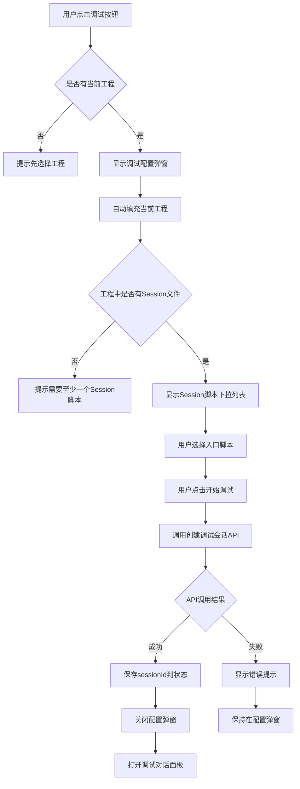
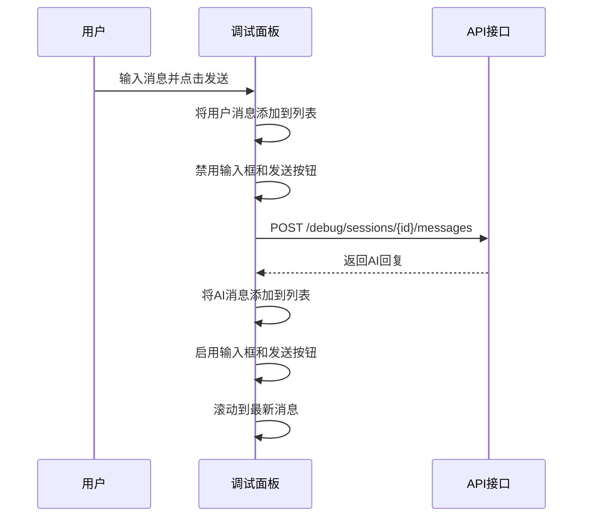
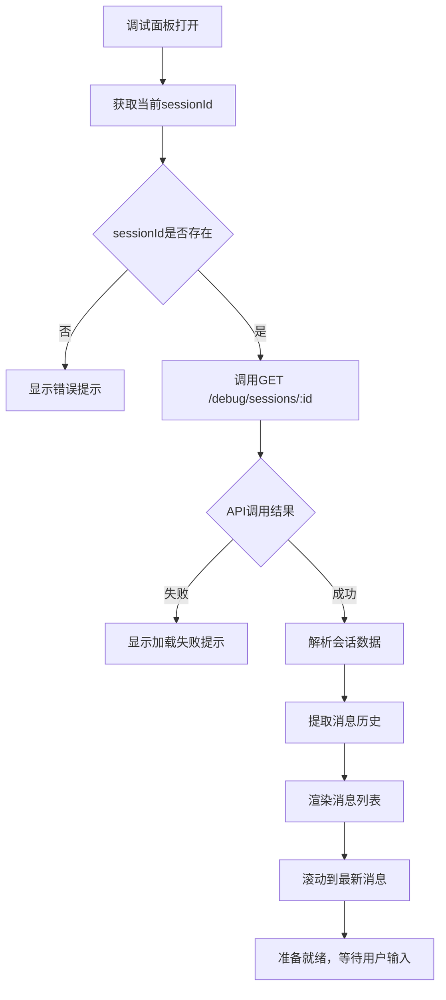

# 脚本编辑器调试配置与对话面板设计

## 1. 需求概述

为脚本编辑器添加调试功能的前端部分，包括调试入口配置和基础对话面板，实现从编辑器内启动调试会话并进行多轮对话的完整流程。

### 核心目标

- 用户可以在编辑器中选择工程和调试入口脚本
- 用户可以配置调试选项并启动调试会话
- 用户可以在调试对话面板中与AI进行多轮交互
- 提供简洁实用的调试体验，无需复杂的UI设计

### 范围说明

本设计覆盖以下任务：

- **P0-T2**：编辑器内的调试入口配置与工程选择
- **P0-T3**：基础调试对话面板

## 2. 功能设计

### 2.1 调试入口配置（P0-T2）

#### 配置入口位置

在编辑器顶部导航栏右侧添加调试入口按钮，与现有的保存、发布按钮并列。

#### 配置项说明

调试配置包含以下核心参数：

| 配置项   | 说明                  | 数据来源                                   | 是否必填 |
| -------- | --------------------- | ------------------------------------------ | -------- |
| 当前工程 | 要调试的脚本工程      | 从已加载的工程上下文获取，或从工程列表选择 | 是       |
| 入口脚本 | 调试的起始Session脚本 | 从当前工程的Session类型文件中选择          | 是       |
| 用户ID   | 模拟的用户标识        | 默认为"debug_user"，可自定义               | 否       |

#### 交互流程

调试配置和启动的完整交互流程如下：



#### 状态管理

前端需要维护的调试相关状态：

| 状态字段            | 类型               | 说明                   |
| ------------------- | ------------------ | ---------------------- |
| debugSessionId      | string 或 null     | 当前调试会话的ID       |
| debugConfigVisible  | boolean            | 调试配置弹窗的显示状态 |
| debugPanelVisible   | boolean            | 调试对话面板的显示状态 |
| selectedSessionFile | ScriptFile 或 null | 选中的入口脚本文件     |
| debugUserId         | string             | 模拟的用户ID           |

### 2.2 基础调试对话面板（P0-T3）

#### 面板布局

调试对话面板采用侧边栏方式呈现，位于编辑器右侧，包含以下区域：

```
┌─────────────────────────────────┐
│ 调试面板标题栏                    │
│ [会话信息] [关闭按钮]             │
├─────────────────────────────────┤
│                                 │
│  消息列表区域                     │
│  （可滚动）                       │
│                                 │
│  ┌─ AI 消息 ──────────────┐    │
│  │ 消息内容...             │    │
│  └────────────────────────┘    │
│                                 │
│  ┌─ 用户消息 ─────────────┐    │
│  │ 消息内容...             │    │
│  └────────────────────────┘    │
│                                 │
├─────────────────────────────────┤
│ 输入框                          │
│ [发送按钮]                      │
└─────────────────────────────────┘
```

#### 消息展示规则

消息列表中需要区分不同角色的消息：

| 消息角色 | 显示样式       | 对齐方式 | 背景色建议 |
| -------- | -------------- | -------- | ---------- |
| AI       | 带"AI："前缀   | 左对齐   | 浅蓝色     |
| 用户     | 带"用户："前缀 | 右对齐   | 浅灰色     |
| 系统     | 带"系统："前缀 | 居中     | 浅黄色     |

#### 消息数据结构

前端消息对象的结构定义：

| 字段      | 类型                     | 说明           |
| --------- | ------------------------ | -------------- |
| messageId | string                   | 消息唯一标识   |
| role      | 'ai' / 'user' / 'system' | 消息角色       |
| content   | string                   | 消息内容       |
| timestamp | Date 或 string           | 消息时间戳     |
| metadata  | object                   | 元数据（可选） |

#### 对话交互流程

用户发送消息和接收回复的流程如下：



#### 初始化流程

调试面板打开时的初始化流程：



### 2.3 错误处理策略

#### API调用错误

当调试相关的API调用失败时，应按以下方式处理：

| 错误场景     | 处理方式                                     |
| ------------ | -------------------------------------------- |
| 创建会话失败 | 在配置弹窗中显示错误提示，允许用户重试       |
| 获取会话失败 | 在对话面板中显示错误提示，提供重新加载按钮   |
| 发送消息失败 | 保留用户输入，显示发送失败提示，允许重新发送 |
| 网络超时     | 显示超时提示，提供重试选项                   |

#### 用户操作约束

为避免无效操作和数据不一致，需要实施以下约束：

| 约束场景          | 约束规则                     |
| ----------------- | ---------------------------- |
| 未选择工程        | 调试按钮禁用或点击后提示     |
| 工程无Session文件 | 不允许开始调试，给出明确提示 |
| 正在发送消息      | 禁用输入框和发送按钮         |
| 会话已结束        | 显示会话结束提示，禁用输入   |

## 3. 数据交互设计

### 3.1 调试会话创建

#### 请求接口

```
POST /api/sessions
```

#### 请求参数

| 参数          | 类型   | 必填 | 说明                     |
| ------------- | ------ | ---- | ------------------------ |
| projectId     | string | 是   | 工程ID                   |
| sessionFileId | string | 是   | Session脚本文件ID        |
| userId        | string | 否   | 用户ID，默认"debug_user" |

实际请求可能需要传递scriptId（脚本在数据库中的ID），需要通过以下方式获取：

- 从工程文件中读取yamlContent
- 临时导入为script记录
- 或后端支持通过projectId和fileId直接创建会话

#### 响应数据

| 字段            | 类型   | 说明               |
| --------------- | ------ | ------------------ |
| sessionId       | string | 调试会话的唯一标识 |
| status          | string | 会话状态           |
| createdAt       | string | 创建时间           |
| aiMessage       | string | 初始欢迎消息       |
| executionStatus | string | 执行状态           |

### 3.2 获取会话状态

#### 请求接口

```
GET /api/sessions/{id}
```

#### 路径参数

| 参数 | 类型   | 说明   |
| ---- | ------ | ------ |
| id   | string | 会话ID |

#### 响应数据

| 字段            | 类型   | 说明                                                |
| --------------- | ------ | --------------------------------------------------- |
| sessionId       | string | 会话ID                                              |
| userId          | string | 用户ID                                              |
| scriptId        | string | 脚本ID                                              |
| status          | string | 会话状态                                            |
| executionStatus | string | 执行状态                                            |
| position        | object | 当前执行位置（phaseIndex, topicIndex, actionIndex） |
| variables       | object | 会话变量                                            |
| metadata        | object | 元数据                                              |
| messages        | array  | 消息历史列表                                        |

消息历史列表中每条消息的结构：

| 字段      | 类型   | 说明                       |
| --------- | ------ | -------------------------- |
| messageId | string | 消息ID                     |
| role      | string | 消息角色（ai/user/system） |
| content   | string | 消息内容                   |
| timestamp | string | 时间戳                     |

### 3.3 发送用户消息

#### 请求接口

```
POST /api/sessions/{id}/messages
```

#### 路径参数

| 参数 | 类型   | 说明   |
| ---- | ------ | ------ |
| id   | string | 会话ID |

#### 请求参数

| 参数    | 类型   | 必填 | 说明               |
| ------- | ------ | ---- | ------------------ |
| content | string | 是   | 用户输入的消息内容 |

#### 响应数据

| 字段            | 类型   | 说明                 |
| --------------- | ------ | -------------------- |
| aiMessage       | string | AI的回复消息         |
| sessionStatus   | string | 会话状态             |
| executionStatus | string | 执行状态             |
| variables       | object | 更新后的变量（可选） |

## 4. 组件设计

### 4.1 调试配置弹窗组件

**组件名称**：DebugConfigModal

**职责**：提供调试会话的配置界面，收集调试参数并发起会话创建请求

**属性定义**：

| 属性           | 类型             | 说明                  |
| -------------- | ---------------- | --------------------- |
| visible        | boolean          | 弹窗显示状态          |
| currentProject | Project 或 null  | 当前工程对象          |
| sessionFiles   | ScriptFile[]     | 可选的Session文件列表 |
| onStart        | (config) => void | 开始调试的回调函数    |
| onCancel       | () => void       | 取消的回调函数        |

**内部状态**：

| 状态           | 类型           | 说明                |
| -------------- | -------------- | ------------------- |
| selectedFileId | string 或 null | 选中的Session文件ID |
| userId         | string         | 用户ID输入值        |
| loading        | boolean        | 请求加载状态        |
| error          | string 或 null | 错误信息            |

**主要方法**：

- handleFileSelect：处理Session文件选择
- handleUserIdChange：处理用户ID输入变化
- handleSubmit：提交配置并创建调试会话
- handleCancel：关闭弹窗并重置状态

### 4.2 调试对话面板组件

**组件名称**：DebugChatPanel

**职责**：展示调试会话的对话历史，处理用户输入和消息发送

**属性定义**：

| 属性      | 类型           | 说明               |
| --------- | -------------- | ------------------ |
| visible   | boolean        | 面板显示状态       |
| sessionId | string 或 null | 当前调试会话ID     |
| onClose   | () => void     | 关闭面板的回调函数 |

**内部状态**：

| 状态        | 类型           | 说明           |
| ----------- | -------------- | -------------- |
| messages    | Message[]      | 消息列表       |
| inputValue  | string         | 输入框内容     |
| loading     | boolean        | 消息发送中状态 |
| sessionInfo | object 或 null | 会话基本信息   |
| error       | string 或 null | 错误信息       |

**主要方法**：

- loadSessionData：加载会话数据和消息历史
- handleSendMessage：发送用户消息
- handleInputChange：处理输入框变化
- scrollToBottom：滚动到最新消息
- formatMessage：格式化消息显示

### 4.3 消息列表组件

**组件名称**：MessageList

**职责**：渲染消息列表，区分不同角色的消息样式

**属性定义**：

| 属性     | 类型      | 说明     |
| -------- | --------- | -------- |
| messages | Message[] | 消息数组 |
| loading  | boolean   | 加载状态 |

**消息项组件**：MessageItem

**属性定义**：

| 属性    | 类型    | 说明         |
| ------- | ------- | ------------ |
| message | Message | 单条消息对象 |

## 5. 页面集成方案

### 5.1 ProjectEditor组件改造

在现有的ProjectEditor组件中，需要新增以下元素和逻辑：

#### 顶部导航栏扩展

在现有的保存、发布按钮旁边，添加调试按钮：

- 按钮文案：开始调试 / Debug
- 图标：PlayCircleOutlined 或 BugOutlined
- 位置：右上角操作区
- 启用条件：当前已选择工程且工程中存在Session类型文件

#### 状态扩展

在ProjectEditor组件的state中新增：

| 状态字段           | 类型           | 初始值 | 说明                 |
| ------------------ | -------------- | ------ | -------------------- |
| debugConfigVisible | boolean        | false  | 调试配置弹窗显示状态 |
| debugPanelVisible  | boolean        | false  | 调试面板显示状态     |
| debugSessionId     | string 或 null | null   | 当前调试会话ID       |

#### 布局调整

当调试面板打开时，编辑器主内容区需要为面板腾出空间：

- 调试面板宽度建议：400-500px
- 编辑器主区域宽度相应缩小
- 使用flex布局或绝对定位实现自适应

### 5.2 路由和导航考虑

调试功能不需要独立路由，作为ProjectEditor页面的一部分即可：

- 调试面板通过状态控制显示隐藏
- 刷新页面后调试会话丢失（可接受的简化方案）
- 未来可考虑将sessionId存入URL query或localStorage以支持恢复

## 6. API服务层设计

### 6.1 调试API模块

在现有的api目录中新增debugApi模块

**文件位置**：packages/script-editor/src/api/debug.ts

**导出的API方法**：

| 方法名             | 说明             | 返回类型                                               |
| ------------------ | ---------------- | ------------------------------------------------------ |
| createDebugSession | 创建调试会话     | Promise&lt;ApiResponse&lt;DebugSession&gt;&gt;         |
| getDebugSession    | 获取调试会话详情 | Promise&lt;ApiResponse&lt;DebugSessionDetail&gt;&gt;   |
| sendDebugMessage   | 发送调试消息     | Promise&lt;ApiResponse&lt;DebugMessageResponse&gt;&gt; |

### 6.2 类型定义

需要定义的TypeScript接口：

#### DebugSession

| 字段            | 类型   | 说明       |
| --------------- | ------ | ---------- |
| sessionId       | string | 会话ID     |
| status          | string | 会话状态   |
| createdAt       | string | 创建时间   |
| aiMessage       | string | 初始AI消息 |
| executionStatus | string | 执行状态   |

#### DebugSessionDetail

| 字段            | 类型                          | 说明     |
| --------------- | ----------------------------- | -------- |
| sessionId       | string                        | 会话ID   |
| userId          | string                        | 用户ID   |
| scriptId        | string                        | 脚本ID   |
| status          | string                        | 会话状态 |
| executionStatus | string                        | 执行状态 |
| position        | ExecutionPosition             | 执行位置 |
| variables       | Record&lt;string, unknown&gt; | 变量     |
| metadata        | Record&lt;string, unknown&gt; | 元数据   |
| messages        | DebugMessage[]                | 消息列表 |

#### DebugMessage

| 字段      | 类型                       | 说明   |
| --------- | -------------------------- | ------ |
| messageId | string                     | 消息ID |
| role      | 'ai' \| 'user' \| 'system' | 角色   |
| content   | string                     | 内容   |
| timestamp | string                     | 时间戳 |

#### DebugMessageResponse

| 字段            | 类型                          | 说明     |
| --------------- | ----------------------------- | -------- |
| aiMessage       | string                        | AI回复   |
| sessionStatus   | string                        | 会话状态 |
| executionStatus | string                        | 执行状态 |
| variables       | Record&lt;string, unknown&gt; | 变量     |

### 6.3 错误处理封装

API调用应统一处理以下情况：

- 网络错误：返回统一错误结构
- HTTP状态码错误：解析错误信息
- 响应数据格式错误：提供默认值或错误提示
- 超时处理：设置合理的超时时间（建议30秒）

## 7. 用户体验设计

### 7.1 加载状态提示

在以下操作中需要显示加载状态：

| 操作         | 提示方式                | 提示内容              |
| ------------ | ----------------------- | --------------------- |
| 创建调试会话 | 弹窗内loading           | "正在创建调试会话..." |
| 加载会话数据 | 面板内skeleton或spinner | "正在加载对话历史..." |
| 发送消息     | 禁用输入，按钮loading   | "发送中..."           |

### 7.2 成功反馈

| 操作         | 反馈方式                       |
| ------------ | ------------------------------ |
| 会话创建成功 | 自动关闭配置弹窗，打开对话面板 |
| 消息发送成功 | 清空输入框，显示AI回复         |

### 7.3 错误提示

| 错误类型     | 提示位置       | 提示方式                 |
| ------------ | -------------- | ------------------------ |
| 配置验证错误 | 配置弹窗内     | 表单字段下方红色提示文字 |
| API调用错误  | 弹窗或面板顶部 | Alert组件显示错误信息    |
| 网络错误     | 面板顶部       | Alert组件，提供重试按钮  |

### 7.4 空状态处理

| 场景              | 显示内容                            |
| ----------------- | ----------------------------------- |
| 工程无Session文件 | "当前工程没有Session脚本，请先创建" |
| 消息列表为空      | "暂无消息记录"                      |
| 会话加载失败      | "加载失败，请重试"                  |

## 8. 实现优先级

### 8.1 核心功能（必须实现）

1. 调试配置弹窗
   - 工程上下文获取
   - Session文件列表
   - 开始调试按钮

2. 调试会话创建
   - API调用封装
   - sessionId状态管理
   - 错误处理

3. 调试对话面板
   - 消息列表展示
   - 用户输入和发送
   - 滚动到最新消息

4. 消息交互
   - 发送用户消息
   - 接收AI回复
   - 消息状态同步

### 8.2 辅助功能（建议实现）

1. 用户ID自定义
2. 会话信息显示（脚本名称、创建时间等）
3. 输入框回车发送
4. 消息时间戳显示

### 8.3 可选增强（未来迭代）

1. 消息加载更多（分页）
2. 调试会话持久化（刷新后恢复）
3. 多个调试会话管理
4. 消息搜索和过滤
5. 导出对话记录

## 9. 技术约束

### 9.1 依赖的后端接口

必须依赖P0-T1任务完成的以下接口：

- POST /debug/sessions - 创建调试会话
- GET /debug/sessions/:id - 获取会话详情
- POST /debug/sessions/:id/messages - 发送消息

### 9.2 前端技术栈

- React 18+
- TypeScript
- Ant Design（与现有编辑器保持一致）
- Axios（HTTP客户端）

### 9.3 兼容性要求

- 与现有的ProjectEditor组件无破坏性集成
- 不影响现有的编辑、保存、发布功能
- 调试功能可独立开关，不影响其他模块

## 10. 验收标准

### 10.1 P0-T2验收标准

- [ ] 编辑器顶部有明显的调试入口按钮
- [ ] 点击调试按钮后显示配置弹窗
- [ ] 配置弹窗正确显示当前工程信息
- [ ] 配置弹窗正确列出所有Session类型文件
- [ ] 可以选择入口Session文件
- [ ] 点击"开始调试"后成功调用创建会话API
- [ ] API返回sessionId后保存到组件状态
- [ ] 配置成功后自动打开调试对话面板

### 10.2 P0-T3验收标准

- [ ] 调试面板在编辑器右侧正确显示
- [ ] 面板打开时自动加载会话消息历史
- [ ] 消息列表正确区分AI和用户消息
- [ ] AI消息和用户消息有不同的视觉样式
- [ ] 可以在输入框中输入文本
- [ ] 点击发送按钮后消息成功发送
- [ ] 发送后用户消息立即显示在列表中
- [ ] AI回复返回后正确显示在列表中
- [ ] 消息列表自动滚动到最新消息
- [ ] 可以进行连续多轮对话（至少3轮）
- [ ] 发送消息时输入框和按钮正确禁用
- [ ] 发送完成后输入框和按钮恢复可用
- [ ] API错误时有明确的错误提示
- [ ] 可以通过关闭按钮关闭调试面板

## 11. 后续扩展方向

### 11.1 与四层结构的联动

当后端支持返回当前执行位置时，可以在左侧的Phase/Topic/Action树中高亮当前执行节点，帮助用户理解脚本执行流程。

### 11.2 执行状态可视化

在调试面板中增加执行状态区域，显示：

- 当前执行位置（Phase > Topic > Action）
- 执行进度百分比
- 已执行和未执行节点数量

### 11.3 变量查看面板

增加变量查看功能，展示当前会话的变量状态：

- Session级变量
- Topic级局部变量
- 变量值的实时更新

### 11.4 调试工具栏

增加调试控制按钮：

- 重新开始调试
- 停止调试
- 清空对话历史
- 导出调试日志

### 11.5 消息重试机制

当消息发送失败时：

- 保留用户输入的内容
- 显示“重试”按钮
- 点击后重新发送相同的消息

### 11.6 会话状态恢复

支持页面刷新后恢复调试会话：

- 将sessionId存入localStorage
- 页面加载时检查是否有未完成的会话
- 提示用户是否继续

### 11.7 调试会话列表

支持多个调试会话并存：

- 以Tab形式管理多个会话
- 可以快速切换
- 显示每个会话的基本信息

### 11.8 消息加载优化

实现分页加载：

- 默认加载最近20条消息
- 滚动到顶部时加载更多历史消息
- 显示加载中和“没有更多”状态
