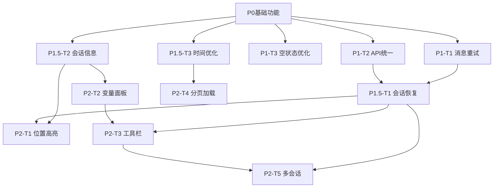

# 调试功能 Phase 1 需求设计

**版本**: v1.0  
**日期**: 2026-01-14  
**基于**: P0-T2和P0-T3验收测试结果

## 1. 概述

基于P0阶段调试功能的验收测试，本文档定义Phase 1阶段需要进一步设计和实现的功能。Phase 1的目标是在P0基础上，提升调试功能的用户体验和实用性，为Phase 2的高级调试能力打好基础。

## 2. 优先级分类

### 2.1 必须实现（Must Have - P1）

#### P1-T1: 消息重试机制

**优先级**: 🔴 高  
**理由**: 提升用户体验，避免因网络问题导致消息丢失

**功能描述**:

- 当消息发送失败时，保留用户输入的内容
- 在消息列表中显示失败状态
- 提供"重试"按钮
- 点击重试后重新发送相同的消息

**设计要点**:

1. 消息状态：pending（发送中）、success（成功）、failed（失败）
2. 失败消息显示：红色边框或错误图标
3. 重试按钮位置：消息下方或消息旁边
4. 重试后的状态转换：failed → pending → success/failed

**验收标准**:

- [ ] 发送失败的消息有明显的视觉标识
- [ ] 重试按钮可见且可点击
- [ ] 点击重试后消息成功发送
- [ ] 重试成功后错误标识消失
- [ ] 多次重试不会产生重复消息

---

#### P1-T2: API路径统一和错误处理改进

**优先级**: 🔴 高  
**理由**: 修复文档与实现不一致的问题，改进错误提示

**功能描述**:

1. 统一API路径：使用 `/api/sessions` 而非 `/debug/sessions`
2. 改进错误提示：更详细的错误信息，包含错误代码
3. 网络超时处理：超时后给出明确提示和重试选项

**设计要点**:

1. 错误分类：
   - 网络错误（超时、无网络）
   - 服务器错误（500系列）
   - 业务错误（脚本不存在、会话过期等）
2. 错误提示格式：
   ```
   错误类型 [错误代码]
   错误描述
   [建议操作]
   ```
3. 超时配置：可配置的超时时间（默认30秒）

**验收标准**:

- [ ] 所有API路径统一使用 `/api` 前缀
- [ ] 网络错误有专门的提示
- [ ] 超时后提供重试选项
- [ ] 错误信息包含错误代码
- [ ] 业务错误有明确的解决建议

---

#### P1-T3: 空状态优化

**优先级**: 🟡 中  
**理由**: 改善首次使用体验，减少用户困惑

**功能描述**:

1. 无Session文件时的引导
2. 无消息时的提示优化
3. 加载中的骨架屏

**设计要点**:

1. 无Session文件场景：
   - 显示创建Session文件的引导
   - 提供快速创建入口
2. 无消息场景：
   - 友好的欢迎文案
   - 使用示例或提示
3. 加载状态：
   - 使用Skeleton而非简单的Spin
   - 模拟实际内容布局

**验收标准**:

- [ ] 无Session文件时有明确的引导信息
- [ ] 无消息时的提示友好且有用
- [ ] 加载状态有合适的骨架屏
- [ ] 所有空状态都有对应的插图或图标

---

### 2.2 应该实现（Should Have - P1.5）

#### P1.5-T1: 会话状态恢复

**优先级**: 🟡 中  
**理由**: 提升用户体验，避免刷新后丢失调试进度

**功能描述**:

- 将当前调试会话ID存入localStorage
- 页面刷新时检查是否有未完成的会话
- 提示用户是否继续之前的会话
- 支持清除历史会话

**设计要点**:

1. 存储结构：
   ```json
   {
     "debugSession": {
       "sessionId": "xxx",
       "projectId": "xxx",
       "fileName": "xxx",
       "timestamp": 1234567890,
       "messageCount": 5
     }
   }
   ```
2. 恢复提示：
   - 弹窗或顶部提示条
   - 显示会话基本信息
   - "继续"和"新建"两个选项
3. 过期处理：
   - 超过24小时的会话提示可能已过期
   - 仍然允许尝试恢复

**验收标准**:

- [ ] 刷新页面后可以恢复调试会话
- [ ] 恢复时显示会话基本信息
- [ ] 用户可以选择继续或新建
- [ ] 过期会话有明确提示
- [ ] 可以清除已保存的会话记录

---

#### P1.5-T2: 调试会话信息增强

**优先级**: 🟡 中  
**理由**: 帮助用户更好地了解当前调试状态

**功能描述**:

- 在面板标题栏显示更多会话信息
- 显示当前脚本名称
- 显示创建时间和消息数量
- 显示执行状态（running/waiting/completed）

**设计要点**:

1. 信息布局：
   ```
   Debug Chat | script_name.yaml
   Session: abc123... | Messages: 5 | Status: Running
   ```
2. 状态颜色：
   - Running: 绿色
   - Waiting: 橙色
   - Completed: 灰色
   - Error: 红色
3. 工具提示：
   - 鼠标悬停显示完整信息
   - 包括创建时间、用户ID等

**验收标准**:

- [ ] 面板显示脚本名称
- [ ] 显示消息数量
- [ ] 显示执行状态（带颜色）
- [ ] 完整的会话ID可以通过工具提示查看
- [ ] 所有信息实时更新

---

#### P1.5-T3: 消息时间戳优化

**优先级**: 🟢 低  
**理由**: 改善消息可读性

**功能描述**:

- 智能显示时间：今天显示时分秒，昨天及更早显示完整日期
- 消息分组：按时间段分组显示（如"今天"、"昨天"）
- 时间间隔提示：相邻消息间隔较长时显示时间分隔线

**设计要点**:

1. 时间显示规则：
   - 今天：HH:mm:ss
   - 昨天：昨天 HH:mm
   - 更早：MM-DD HH:mm
2. 分组标题：
   - "今天"、"昨天"、"本周"、"更早"
3. 时间分隔线：
   - 间隔超过30分钟时显示

**验收标准**:

- [ ] 时间显示符合智能规则
- [ ] 消息有合理的分组
- [ ] 长时间间隔有分隔线提示
- [ ] 工具提示显示完整时间戳

---

### 2.3 可以实现（Could Have - P2）

#### P2-T1: 执行位置高亮

**优先级**: 🟢 低  
**依赖**: 后端返回position字段

**功能描述**:

- 在左侧Action树中高亮当前执行的节点
- 显示执行路径（已执行的节点标记）
- 点击节点查看该位置的变量状态

**设计要点**:

1. 高亮样式：
   - 当前节点：蓝色背景 + 图标
   - 已执行：勾选图标
   - 未执行：灰色
2. 联动滚动：
   - 执行位置变化时自动滚动到当前节点
3. 交互：
   - 点击节点显示该位置的快照信息

**验收标准**:

- [ ] 当前执行节点有明显的高亮
- [ ] 已执行节点有视觉标记
- [ ] 节点变化时自动滚动
- [ ] 可以查看任意位置的状态

---

#### P2-T2: 变量查看面板

**优先级**: 🟢 低  
**依赖**: 后端返回variables字段

**功能描述**:

- 在调试面板中增加变量查看区域
- 分类显示：Session级变量、Topic级变量
- 支持变量值的实时更新
- 支持变量搜索和过滤

**设计要点**:

1. 布局：
   - 可折叠的面板，在消息列表上方或下方
   - 树形结构显示嵌套对象
2. 变量分类：
   - Session Variables
   - Topic Variables
   - Action Variables
3. 值显示：
   - 字符串、数字：直接显示
   - 对象、数组：可展开
   - 长文本：折叠显示

**验收标准**:

- [ ] 变量面板可见且可折叠
- [ ] 正确分类显示变量
- [ ] 变量值实时更新
- [ ] 复杂类型可以展开查看
- [ ] 支持变量搜索

---

#### P2-T3: 调试工具栏

**优先级**: 🟢 低

**功能描述**:

- 在面板顶部增加工具栏
- 重新开始：创建新的调试会话
- 停止调试：结束当前会话
- 清空消息：清空当前对话历史（不影响会话）
- 导出日志：导出对话记录为文本或JSON

**设计要点**:

1. 工具栏位置：
   - 标题栏下方，消息列表上方
   - 横向排列的按钮组
2. 按钮功能：
   - 重新开始：确认后创建新会话
   - 停止调试：灰色按钮，点击关闭面板
   - 清空消息：二次确认
   - 导出日志：选择格式（TXT/JSON）
3. 状态禁用：
   - 部分按钮根据状态禁用（如已停止时不能再停止）

**验收标准**:

- [ ] 工具栏位置合理
- [ ] 所有按钮功能正常
- [ ] 危险操作有二次确认
- [ ] 导出的日志格式正确
- [ ] 按钮状态正确响应

---

#### P2-T4: 消息分页加载

**优先级**: 🟢 低

**功能描述**:

- 默认只加载最近20条消息
- 滚动到顶部时自动加载更多
- 显示加载中和"没有更多"状态
- 支持跳转到最早/最新消息

**设计要点**:

1. 加载策略：
   - 初始加载：最近20条
   - 上拉加载：每次20条
   - 缓存：已加载的消息保留
2. UI提示：
   - 顶部显示"加载更多..."
   - 到达顶部显示"已加载全部"
   - 快速跳转按钮
3. 性能优化：
   - 虚拟滚动（消息数量>100时）
   - 懒加载图片和附件

**验收标准**:

- [ ] 初始只加载20条消息
- [ ] 上拉可以加载更多
- [ ] 加载状态明确显示
- [ ] 没有更多时有提示
- [ ] 性能在大量消息时仍流畅

---

#### P2-T5: 多会话管理

**优先级**: 🟢 低

**功能描述**:

- 支持同时打开多个调试会话
- Tab形式管理会话
- 每个Tab显示会话基本信息
- 支持关闭、切换会话

**设计要点**:

1. Tab布局：
   - 面板顶部横向Tab栏
   - 每个Tab显示：脚本名 + 状态图标
   - 活动Tab高亮
2. Tab操作：
   - 点击切换
   - 关闭按钮（二次确认）
   - 最多同时8个会话
3. 会话切换：
   - 切换时保存当前状态
   - 恢复切换到的会话状态

**验收标准**:

- [ ] 可以同时打开多个会话
- [ ] Tab切换流畅无卡顿
- [ ] 每个会话状态独立
- [ ] 关闭会话有确认
- [ ] 达到上限时有提示

---

## 3. 技术实现建议

### 3.1 消息重试机制实现

**状态管理**:

```typescript
interface MessageStatus {
  status: 'pending' | 'success' | 'failed';
  error?: string;
  retryCount?: number;
}

interface Message extends DebugMessage {
  sendStatus?: MessageStatus;
}
```

**重试逻辑**:

```typescript
const handleRetry = async (messageId: string) => {
  const message = messages.find((m) => m.messageId === messageId);
  if (!message) return;

  // 更新状态为pending
  updateMessageStatus(messageId, 'pending');

  try {
    // 重新发送
    await debugApi.sendDebugMessage(sessionId, {
      content: message.content,
    });
    updateMessageStatus(messageId, 'success');
  } catch (error) {
    updateMessageStatus(messageId, 'failed', error.message);
  }
};
```

### 3.2 会话状态恢复实现

**LocalStorage结构**:

```typescript
interface StoredSession {
  sessionId: string;
  projectId: string;
  projectName: string;
  fileName: string;
  timestamp: number;
  messageCount: number;
  lastMessageTime: string;
}

const STORAGE_KEY = 'debug_session';
```

**恢复逻辑**:

```typescript
useEffect(() => {
  const stored = localStorage.getItem(STORAGE_KEY);
  if (stored) {
    const session: StoredSession = JSON.parse(stored);

    // 检查是否过期（24小时）
    const isExpired = Date.now() - session.timestamp > 24 * 60 * 60 * 1000;

    // 提示用户
    showRestorePrompt(session, isExpired);
  }
}, []);
```

### 3.3 变量查看面板实现

**组件结构**:

```typescript
<DebugChatPanel>
  <ChatHeader />
  <VariablesPanel
    variables={sessionVariables}
    collapsed={variablesPanelCollapsed}
    onToggle={handleVariablesToggle}
  />
  <MessageList />
  <InputArea />
</DebugChatPanel>
```

**变量面板组件**:

```typescript
const VariablesPanel: React.FC<{
  variables: Record<string, unknown>;
  collapsed: boolean;
  onToggle: () => void;
}> = ({ variables, collapsed, onToggle }) => {
  return (
    <div className="variables-panel">
      <div className="panel-header" onClick={onToggle}>
        <span>Variables</span>
        <Icon type={collapsed ? 'down' : 'up'} />
      </div>
      {!collapsed && (
        <div className="panel-content">
          <VariableTree data={variables} />
        </div>
      )}
    </div>
  );
};
```

## 4. 实现优先级建议

### 第一阶段（本周完成）

1. ✅ P1-T2: API路径统一（已在文档中修复）
2. 🔴 P1-T1: 消息重试机制
3. 🟡 P1-T3: 空状态优化

### 第二阶段（下周完成）

4. 🟡 P1.5-T1: 会话状态恢复
5. 🟡 P1.5-T2: 调试会话信息增强
6. 🟢 P1.5-T3: 消息时间戳优化

### 第三阶段（根据需求）

7. 🟢 P2-T1: 执行位置高亮（依赖后端）
8. 🟢 P2-T2: 变量查看面板（依赖后端）
9. 🟢 P2-T3: 调试工具栏
10. 🟢 P2-T4: 消息分页加载
11. 🟢 P2-T5: 多会话管理

## 5. 依赖关系



## 6. 验收标准总结

### Phase 1 完成标准

- [ ] 所有P1任务（P1-T1, P1-T2, P1-T3）完成并测试通过
- [ ] 至少完成2个P1.5任务
- [ ] 代码质量达标（TypeScript类型完整，无编译错误）
- [ ] 用户体验显著提升
- [ ] 文档更新完整

### Phase 2 完成标准

- [ ] 所有P2任务根据优先级完成
- [ ] 高级调试功能可用
- [ ] 性能指标达标（加载时间、渲染性能）
- [ ] 完整的单元测试和集成测试

## 7. 风险评估

| 风险项               | 概率 | 影响 | 缓解措施                         |
| -------------------- | ---- | ---- | -------------------------------- |
| 后端接口变更         | 中   | 高   | 保持前后端接口文档同步，及时沟通 |
| 性能问题（大量消息） | 中   | 中   | 实现虚拟滚动和分页加载           |
| LocalStorage限制     | 低   | 低   | 限制存储内容大小，定期清理       |
| 浏览器兼容性         | 低   | 中   | 使用Polyfill，测试主流浏览器     |

## 8. 下一步行动

1. **立即执行**:
   - 与团队评审本需求文档
   - 确定Phase 1的实现优先级
   - 分配开发任务

2. **本周完成**:
   - 实现P1-T1消息重试机制
   - 完成P1-T3空状态优化
   - 更新单元测试

3. **下周启动**:
   - 设计P1.5任务的详细方案
   - 开始实现会话状态恢复
   - 准备用户测试

---

**文档维护**: 本文档应随着实现进度更新，记录实际完成情况和遇到的问题。
