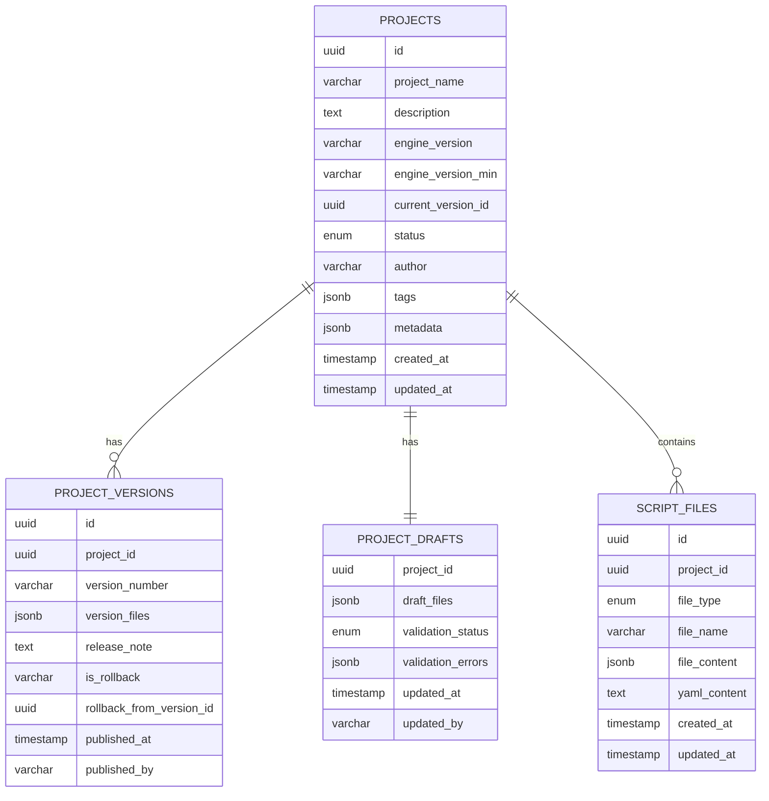
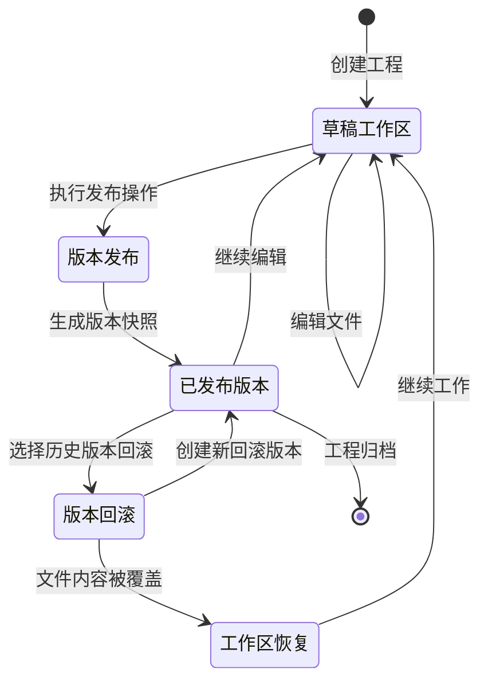
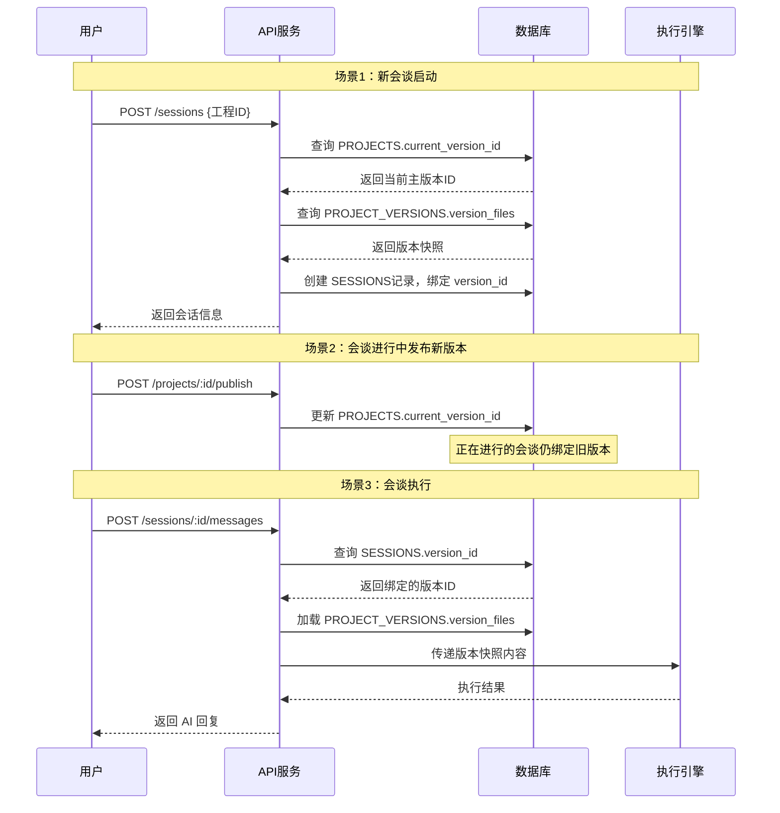
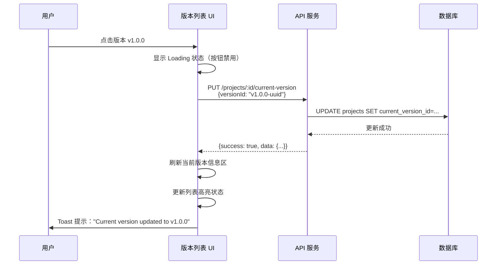

# 工程版本数据模型与 API 落地设计

## 1. 设计目标与业务价值

### 1.1 核心目标

基于脚本编辑器核心能力迭代规划中的 P1-T1、P1-T2 任务,本设计文档旨在定义和落地脚本工程版本管理的完整数据模型与 API 接口体系。核心目标包括:

**P1-T1:工程版本数据模型与 API 落地**
- **版本模型落地**:实现 PROJECT、PROJECT_VERSION、PROJECT_DRAFT 三表协同的版本管理体系
- **最小可用接口**:提供版本列表查询、版本发布、版本回滚等核心能力接口
- **与调试流程打通**:为后续 P1-T4(调试与版本关系)奠定数据基础
- **保持简洁性**:暂不实现高级特性(如版本 diff、标签、分支等),聚焦基础能力

**P1-T2:编辑器中的版本列表与当前版本显示**
- **版本信息展示**:在编辑器 UI 中显示当前版本号、草稿状态、版本历史列表
- **当前版本标记**:通过视觉标识明确展示工程当前生效的版本
- **版本切换能力**:支持用户点击版本标记为当前版本(不含回滚操作)
- **草稿状态感知**:清晰区分"已发布版本"与"未发布草稿"状态

设计遵循"读多写少"的业务特征,确保版本查询性能优先,同时保证版本数据的一致性与可追溯性。

### 1.2 业务价值与用户视角

本版本管理系统需要满足三类核心用户的关键诉求：

**咨询工程师日常场景**
- **版本识别**：快速知道"我现在调试的是哪个版本"，明确当前生效版本与草稿状态
- **快速回滚**：当新改动发布后出现问题，能立即退回到之前稳定版本
- **草稿管理**：工作区草稿与已发布版本严格解耦，支持多人分时段协作维护
- **调试目标选择**：可选择调试草稿或指定历史版本，灵活排查不同环境问题
- **发布控制**：通过接口校验和版本号规范，避免误发布和版本混乱

**最终用户（运营/业务侧）**
- **稳定性保障**：版本可回退，任何问题都能快速恢复到稳定状态
- **变更追踪**：清楚知道每次变更的时间、操作人、发布说明及回滚关系
- **可控演进**：支持渐进式迭代，而非覆盖式修改导致无法回退
- **历史审计**：完整保存版本历史链，满足合规审计需求

**脚本语法版本兼容性**
- **引擎版本声明**：工程明确声明目标引擎版本与最低兼容版本
- **向后兼容**：历史版本脚本能在新引擎上正确运行
- **升级迁移**：提供脚本结构演进的数据基础，支持批量迁移
- **执行保障**：版本快照完整性确保特定版本能在对应引擎环境正常运行

---

## 2. 数据模型设计

### 2.1 核心实体关系

工程版本管理涉及三个核心实体及其关系：



**实体关系说明**
- PROJECTS 与 PROJECT_VERSIONS：一对多关系，一个工程拥有多个历史版本
- PROJECTS 与 PROJECT_DRAFTS：一对一关系，一个工程拥有唯一草稿
- PROJECTS 与 SCRIPT_FILES：一对多关系，一个工程包含多个脚本文件

**字段说明**
- PK：主键
- FK：外键
- PK_FK：主键同时也是外键（用于一对一关系）
- 所有外键均配置 CASCADE 删除策略

### 2.2 实体详细说明

#### 2.2.1 工程表（PROJECTS）

工程表作为版本管理的主体实体，承载工程基础信息与版本指针。

**字段约束**
- `id`：主键，UUID 类型，默认随机生成
- `project_name`：非空，最大长度 255，工程显示名称
- `description`：非空，默认空字符串，工程详细说明
- `engine_version` / `engine_version_min`：非空，最大长度 50，声明引擎版本兼容性
- `current_version_id`：可为空，指向当前生效的版本记录
- `status`：非空，枚举类型（draft / published / archived），默认 draft
- `author`：非空，最大长度 255，工程创建者或负责人
- `tags`：非空，JSONB 类型存储字符串数组，默认空数组
- `metadata`：非空，JSONB 类型存储扩展信息，默认空对象
- `created_at` / `updated_at`：非空，时间戳，自动维护

**索引策略**
- 单列索引：status、author、project_name
- 查询场景：按状态筛选工程列表、按作者查询工程、按名称搜索

**业务规则**
- 工程创建时状态默认为 draft
- 首次发布版本后状态转为 published
- 归档操作将状态改为 archived，但不物理删除记录
- `current_version_id` 初始为空，首次发布后指向最新版本

**业务场景支持**
- **版本识别**：`current_version_id` 明确指向当前线上生效版本，解答"我现在调试的是哪个版本"
- **引擎兼容声明**：`engine_version` 和 `engine_version_min` 为引擎版本匹配检查提供依据
- **多人协作追踪**：`author` 字段记录工程创建者，`updated_at` 追踪最后修改时间

#### 2.2.2 版本表（PROJECT_VERSIONS）

版本表记录每次发布的完整文件快照，支持版本追溯与回滚。

**字段约束**
- `id`：主键，UUID 类型，默认随机生成
- `project_id`：非空，外键引用 PROJECTS.id，CASCADE 删除
- `version_number`：非空，最大长度 32，推荐语义化版本格式（如 1.0.0）
- `version_files`：非空，JSONB 类型，存储文件快照结构如下：
  ```typescript
  {
    [fileId: string]: {
      fileType: 'global' | 'roles' | 'skills' | 'forms' | 'rules' | 'session',
      fileName: string,
      fileContent: object,  // 解析后的JSON对象
      yamlContent: string   // 原始YAML文本
    }
  }
  ```
- `release_note`：非空，默认空字符串，发布说明文档
- `is_rollback`：非空，字符串类型（'true' / 'false'），默认 'false'
- `rollback_from_version_id`：可为空，记录回滚操作的源版本
- `published_at`：非空，时间戳，记录发布时刻
- `published_by`：非空，最大长度 255，发布操作人

**索引策略**
- 单列索引：project_id、published_at
- 查询场景：按工程ID查询版本历史、按时间倒序排列版本

**业务规则**
- 版本号由用户指定，建议遵循语义化版本规范（主版本.次版本.修订号）
- 回滚操作创建新版本记录，`is_rollback` 标记为 'true'
- 版本文件快照存储完整文件内容，确保版本独立可恢复
- 删除工程时级联删除所有版本记录

**业务场景支持**
- **历史追溯**：`published_at` / `published_by` / `release_note` 三元组提供完整变更信息
- **回滚关系**：`is_rollback` 和 `rollback_from_version_id` 明确标记回滚操作的来龙去脉
- **快照完整性**：`version_files` 包含 `fileContent` 和 `yamlContent`，确保调试时能准确加载历史版本
- **语法兼容**：结合工程的 `engine_version` 和版本的 `published_at`，支持引擎对老版本做兼容处理

#### 2.2.3 草稿表（PROJECT_DRAFTS）

草稿表存储工程的工作区状态，与已发布版本解耦。

**字段约束**
- `project_id`：主键兼外键，引用 PROJECTS.id，CASCADE 删除，一对一关系
- `draft_files`：非空，JSONB 类型，存储草稿文件差异或完整草稿（结构与 version_files 类似）
- `validation_status`：非空，枚举类型（valid / invalid / unknown），默认 unknown
- `validation_errors`：可为空，JSONB 类型存储数组，默认空数组
- `updated_at`：非空，时间戳，记录草稿最后修改时间
- `updated_by`：非空，最大长度 255，最后修改人

**索引策略**
- 无额外索引（主键即 project_id，已天然支持快速查询）

**业务规则**
- 每个工程有且仅有一个草稿记录
- 草稿创建时默认校验状态为 unknown
- 草稿内容可基于当前版本进行增量修改
- 发布版本后草稿内容不自动清空，需手动同步或保留工作区状态

**业务场景支持**
- **草稿独立性**：与版本解耦，支持"工作区草稿 vs 已发布版本"边界清晰
- **多人协作**：`updated_by` / `updated_at` 记录最后编辑人与时间，避免草稿状态混乱
- **校验反馈**：`validation_status` / `validation_errors` 支持发布前校验，提前发现问题
- **渐进式迭代**：发布后不清空草稿，支持在稳定版本基础上继续演进

#### 2.2.4 脚本文件表（SCRIPT_FILES）

脚本文件表存储工程的当前工作区文件，与草稿和版本协同工作。

**字段约束**
- `id`：主键，UUID 类型，默认随机生成
- `project_id`：非空，外键引用 PROJECTS.id，CASCADE 删除
- `file_type`：非空，枚举类型（global / roles / skills / forms / rules / session）
- `file_name`：非空，最大长度 255，文件名称（含扩展名）
- `file_content`：非空，JSONB 类型，解析后的脚本对象结构
- `yaml_content`：可为空，TEXT 类型，原始 YAML 源码
- `created_at` / `updated_at`：非空，时间戳，自动维护

**索引策略**
- 单列索引：project_id、file_type
- 查询场景：按工程ID获取文件列表、按文件类型筛选

**业务规则**
- 文件由编辑器直接操作，代表工程当前状态
- 发布版本时，文件快照被保存到版本表
- 回滚操作时，文件内容被目标版本快照覆盖
- 删除工程时级联删除所有文件

### 2.3 版本生命周期流程



**关键流程节点说明**

1. **创建工程**：自动创建空草稿记录，工程状态为 draft
2. **编辑文件**：修改 SCRIPT_FILES 表内容，草稿表记录变更时间
3. **发布版本**：
   - 从 SCRIPT_FILES 读取当前文件内容
   - 生成版本快照写入 PROJECT_VERSIONS
   - 更新 PROJECTS.current_version_id 指向新版本
   - 工程状态转为 published
4. **版本回滚**：
   - 读取目标版本的 version_files 快照
   - 覆盖 SCRIPT_FILES 对应文件内容
   - 创建新的回滚版本记录（标记 is_rollback='true'）
   - 更新 current_version_id 指向新回滚版本

### 2.4 会话版本绑定策略

**设计原则**

工程多次发布后，版本管理需要支持两种不同的版本使用场景：

1. **新会谈启动**：使用工程的当前主版本（`PROJECTS.current_version_id`）
2. **进行中的会谈**：继续绑定创建时的版本快照，不随新发布自动切换

**核心规则**

- **新发版默认为主版本**：每次发布新版本后，`current_version_id` 自动指向该版本，成为后续新会谈的默认版本
- **会谈版本锁定**：已启动的会谈应继续绑定其创建时的版本快照，确保对话过程的一致性与可追溯性
- **版本独立性**：新版本发布不影响正在运行的会谈，避免中断用户体验

**数据模型支持**

在会话表（SESSIONS）中需要增加版本关联字段：

```typescript
SESSIONS {
  id: uuid,
  project_id: uuid,              // 所属工程
  version_id: uuid,              // 绑定的版本ID（外键到 PROJECT_VERSIONS）
  version_snapshot: jsonb,       // 版本快照副本（可选，用于性能优化）
  user_id: string,
  status: enum,
  created_at: timestamp,
  // ... 其他会话字段
}
```

**业务流程**



**实现要点**

1. **会话创建时版本绑定**
   - 创建会话时，读取 `PROJECTS.current_version_id`
   - 将该版本ID 写入 `SESSIONS.version_id` 字段
   - 可选：同时将 `version_files` 快照副本存入 `SESSIONS.version_snapshot`，减少执行时查询

2. **会话执行时版本加载**
   - 执行引擎从 `SESSIONS.version_id` 加载绑定的版本快照
   - 不再依赖 `PROJECTS.current_version_id`，避免新版本发布影响

3. **版本发布隔离**
   - 新版本发布仅更新 `PROJECTS.current_version_id`
   - 不修改已存在的 `SESSIONS` 记录
   - 确保进行中的会谈不受影响

**业务场景示例**

| 时间点 | 操作 | PROJECTS.current_version_id | 会谈A.version_id | 会谈B.version_id |
|--------|------|----------------------------|-------------------|-------------------|
| T1 | 发布版本 v1.0.0 | v1.0.0 | - | - |
| T2 | 启动会谈A | v1.0.0 | **v1.0.0** | - |
| T3 | 发布版本 v1.1.0 | **v1.1.0** | v1.0.0（不变） | - |
| T4 | 启动会谈B | v1.1.0 | v1.0.0 | **v1.1.0** |
| T5 | 会谈A继续对话 | v1.1.0 | v1.0.0（保持） | v1.1.0 |

**价值与保障**

- **对话一致性**：会谈全程使用同一版本脚本，避免中途逻辑变化导致用户困惑
- **可追溯性**：任何会谈都可回溯其使用的精确版本，便于问题排查和审计
- **灰度发布**：支持渐进式上线新版本，老用户会谈不受影响，新用户使用新版本
- **回滚安全**：回滚版本后，仅影响新启动的会谈，已进行的会谈不受影响

---

## 3. API 接口设计

### 3.1 接口路由规划

所有版本管理相关接口均挂载在 `/api/projects/:id` 路径下，保持 RESTful 风格。

| 方法 | 路径 | 功能描述 |
|------|------|----------|
| GET | `/projects/:id/versions` | 获取工程版本历史列表 |
| GET | `/projects/:id/versions/:versionId` | 获取单个版本详细信息 |
| POST | `/projects/:id/publish` | 从当前草稿发布新版本 |
| POST | `/projects/:id/rollback` | 回滚到指定历史版本 |
| PUT | `/projects/:id/current-version` | 设置工程当前版本(不触发回滚) |
| GET | `/projects/:id/draft` | 获取工程草稿状态 |
| PUT | `/projects/:id/draft` | 保存草稿内容 |

### 3.2 接口详细规约

#### 3.2.1 获取版本历史列表

**请求规约**
```
GET /api/projects/:id/versions
```

**路径参数**
- `id`：工程唯一标识（UUID）

**查询参数**
- 无（暂不支持分页与过滤）

**响应结构**
```typescript
{
  success: boolean,
  data: Array<{
    id: string,                    // 版本ID
    projectId: string,             // 所属工程ID
    versionNumber: string,         // 版本号
    releaseNote: string,           // 发布说明
    isRollback: string,            // 是否回滚版本
    rollbackFromVersionId?: string,// 回滚源版本ID
    publishedAt: string,           // 发布时间（ISO 8601格式）
    publishedBy: string            // 发布人
  }>
}
```

**业务逻辑**
- 按 `published_at` 倒序排列（最新版本在前）
- 不返回 `version_files` 字段（减少响应体积）
- 若工程不存在或无版本，返回空数组

**错误响应**
- `500 Internal Server Error`：数据库查询失败

#### 3.2.2 获取单个版本详情

**请求规约**
```
GET /api/projects/:id/versions/:versionId
```

**路径参数**
- `id`：工程唯一标识（UUID）
- `versionId`：版本唯一标识（UUID）

**响应结构**
```typescript
{
  success: boolean,
  data: {
    id: string,
    projectId: string,
    versionNumber: string,
    versionFiles: Record<string, {  // 完整文件快照
      fileType: string,
      fileName: string,
      fileContent: object,
      yamlContent: string
    }>,
    releaseNote: string,
    isRollback: string,
    rollbackFromVersionId?: string,
    publishedAt: string,
    publishedBy: string
  }
}
```

**业务逻辑**
- 返回完整版本信息，包含文件快照
- 用于版本预览、调试时加载指定版本

**错误响应**
- `404 Not Found`：版本不存在或不属于指定工程
- `500 Internal Server Error`：数据库查询失败

#### 3.2.3 发布新版本

**请求规约**
```
POST /api/projects/:id/publish
```

**路径参数**
- `id`：工程唯一标识（UUID）

**请求体**
```typescript
{
  versionNumber: string,  // 必填，版本号（如 "1.0.0"）
  releaseNote?: string,   // 可选，发布说明，默认空字符串
  publishedBy: string     // 必填，发布人标识
}
```

**响应结构**
```typescript
{
  success: boolean,
  data: {
    id: string,            // 新版本ID
    projectId: string,
    versionNumber: string,
    publishedAt: string,
    publishedBy: string
    // ... 其他版本字段
  }
}
```

**业务逻辑**
1. 验证工程存在性
2. 验证草稿存在性（若无草稿，拒绝发布）
3. 从 SCRIPT_FILES 表聚合当前文件内容
4. 构造版本快照结构：
   ```typescript
   versionFiles[fileId] = {
     fileType: file.fileType,
     fileName: file.fileName,
     fileContent: file.fileContent,
     yamlContent: file.yamlContent
   }
   ```
5. 插入新版本记录到 PROJECT_VERSIONS
6. 更新 PROJECTS 表：
   - `current_version_id` = 新版本ID
   - `status` = 'published'
   - `updated_at` = 当前时间
7. 返回新版本信息

**错误响应**
- `400 Bad Request`：请求体校验失败（版本号格式错误等）
- `404 Not Found`：工程或草稿不存在
- `500 Internal Server Error`：数据库操作失败

**注意事项**
- 版本号由用户指定，系统不强制自增或语义化版本规则
- 发布操作不清空草稿内容

#### 3.2.4 回滚到指定版本

**请求规约**
```
POST /api/projects/:id/rollback
```

**路径参数**
- `id`：工程唯一标识（UUID）

**请求体**
```typescript
{
  targetVersionId: string,  // 必填，目标版本ID
  publishedBy: string       // 必填，回滚操作人
}
```

**响应结构**
```typescript
{
  success: boolean,
  data: {
    id: string,              // 新回滚版本ID
    projectId: string,
    versionNumber: string,   // 自动生成的版本号
    isRollback: 'true',
    rollbackFromVersionId: string,
    releaseNote: string,     // 自动生成："回滚到版本 X.X.X"
    publishedAt: string,
    publishedBy: string
  }
}
```

**业务逻辑**
1. 验证目标版本存在性
2. 读取目标版本的 `version_files` 快照
3. 遍历快照中的文件，逐一更新 SCRIPT_FILES 表对应记录：
   ```typescript
   UPDATE script_files 
   SET file_content = snapshot.fileContent,
       yaml_content = snapshot.yamlContent,
       updated_at = NOW()
   WHERE id = fileId
   ```
4. 生成新版本号：
   - 查询当前最新版本号（按 `published_at` 排序）
   - 修订号递增（如 1.0.5 → 1.0.6）
5. 创建新版本记录：
   - `version_files` 复制目标版本快照
   - `is_rollback` = 'true'
   - `rollback_from_version_id` = 目标版本ID
   - `release_note` = "回滚到版本 {targetVersionNumber}"
6. 更新 PROJECTS 表：
   - `current_version_id` = 新回滚版本ID
   - `updated_at` = 当前时间

**错误响应**
- `404 Not Found`：目标版本不存在或不属于指定工程
- `500 Internal Server Error`：数据库操作失败

**注意事项**
- 回滚操作会覆盖当前工作区文件，草稿内容同步丢失
- 回滚本质上是创建新版本，保留完整历史链路

#### 3.2.5 获取工程草稿

**请求规约**
```
GET /api/projects/:id/draft
```

**路径参数**
- `id`：工程唯一标识（UUID）

**响应结构**
```typescript
{
  success: boolean,
  data: {
    projectId: string,
    draftFiles: Record<string, any>,  // 草稿文件差异或完整内容
    validationStatus: 'valid' | 'invalid' | 'unknown',
    validationErrors?: Array<any>,
    updatedAt: string,
    updatedBy: string
  }
}
```

**业务逻辑**
- 直接查询 PROJECT_DRAFTS 表
- 若草稿不存在，返回 404 错误

**错误响应**
- `404 Not Found`：草稿不存在
- `500 Internal Server Error`：数据库查询失败

#### 3.2.6 保存草稿内容

**请求规约**
```
PUT /api/projects/:id/draft
```

**路径参数**
- `id`：工程唯一标识（UUID）

**请求体**
```typescript
{
  draftFiles: Record<string, any>,  // 必填，草稿文件内容
  updatedBy: string                 // 必填，更新人标识
}
```

**响应结构**
```typescript
{
  success: boolean,
  data: {
    projectId: string,
    draftFiles: Record<string, any>,
    validationStatus: 'unknown',
    updatedAt: string,
    updatedBy: string
  }
}
```

**业务逻辑**
1. 验证工程存在性
2. 检查草稿记录是否存在：
   - 若存在，执行 UPDATE 操作
   - 若不存在，执行 INSERT 操作
3. 更新草稿内容与元信息：
   - `draft_files` = 请求体内容
   - `validation_status` = 'unknown'（重置校验状态）
   - `updated_at` = 当前时间
   - `updated_by` = 请求参数
4. 同步更新 PROJECTS 表的 `updated_at` 字段

**错误响应**
- `400 Bad Request`:请求体校验失败
- `404 Not Found`:工程不存在
- `500 Internal Server Error`:数据库操作失败

#### 3.2.7 设置当前版本

**请求规约**
```
PUT /api/projects/:id/current-version
```

**路径参数**
- `id`:工程唯一标识(UUID)

**请求体**
```typescript
{
  versionId: string  // 必填,目标版本ID
}
```

**响应结构**
```typescript
{
  success: boolean,
  data: {
    projectId: string,
    currentVersionId: string,  // 更新后的当前版本ID
    updatedAt: string
  }
}
```

**业务逻辑**
1. 验证工程存在性
2. 验证目标版本存在性并属于该工程
3. 更新 PROJECTS 表:
   - `current_version_id` = 目标版本ID
   - `updated_at` = 当前时间
4. 返回更新后的工程信息

**关键特性**
- **仅更新指针**:只修改 `current_version_id` 字段,不触发文件覆盖操作
- **与回滚区分**:不创建新版本记录,不修改工作区文件内容
- **用于版本浏览**:支持用户在编辑器中快速切换查看不同版本,不影响草稿状态
- **新会谈使用**:切换后新启动的会谈将绑定新设置的版本

**与回滚操作的差异对比**

| 维度 | 设置当前版本(PUT current-version) | 回滚操作(POST rollback) |
|------|----------------------------------|-------------------------|
| 操作对象 | 仅更新 `current_version_id` 指针 | 覆盖工作区文件 + 创建新版本 |
| 版本记录 | 不创建新版本 | 创建回滚版本记录(is_rollback=true) |
| 工作区文件 | 不修改 SCRIPT_FILES 表 | 覆盖 SCRIPT_FILES 为目标版本快照 |
| 草稿状态 | 保持不变 | 被覆盖清空 |
| 使用场景 | 版本浏览、快速切换查看 | 真正恢复到历史版本并继续编辑 |
| 新会谈影响 | 使用新设置的版本 | 使用回滚后的新版本 |
| 进行中会谈 | 不受影响 | 不受影响 |

**错误响应**
- `400 Bad Request`:请求体校验失败
- `404 Not Found`:工程或目标版本不存在
- `500 Internal Server Error`:数据库操作失败

**注意事项**
- 此接口用于 P1-T2 编辑器版本列表功能,支持用户点击版本标记为当前版本
- 不替代回滚操作,两者服务于不同的业务场景
- 推荐在编辑器 UI 中明确区分"设置当前版本"与"回滚到此版本"按钮

### 3.3 接口安全与校验

**参数校验策略**
- 使用 Zod Schema 进行请求体校验
- UUID 格式校验（路径参数）
- 字符串长度限制（版本号 ≤ 32 字符，用户标识 ≤ 255 字符）

**错误响应标准格式**
```typescript
{
  success: false,
  error: string,         // 错误描述
  details?: Array<any>   // 详细校验错误（仅 400 响应）
}
```

**认证与鉴权**
- 当前阶段简化认证逻辑，默认本地开发环境
- 后续可通过中间件扩展 JWT 或 Session 认证
- 预留 `publishedBy` / `updatedBy` 字段记录操作人

---

## 4. 实现要点与约束

### 4.1 数据库约束保障

**外键级联删除**
- 删除工程时，自动删除关联的版本、草稿、文件记录
- 保证数据一致性，避免孤儿数据

**索引优化目标**
- 版本列表查询（按工程ID + 发布时间倒序）利用复合索引路径
- 草稿查询通过主键（project_id）直接定位，无需额外索引

**JSONB 字段使用原则**
- 版本文件快照适合 JSONB 存储，减少表结构复杂度
- 不对 JSONB 内部字段建索引（避免过度索引）

### 4.2 业务逻辑约束

**版本号管理**
- 系统不强制版本号格式，由用户自行维护语义化版本
- 回滚操作自动生成新版本号，采用"最新版本号 + 修订号递增"策略

**草稿与版本解耦**
- 发布版本不清空草稿内容
- 回滚操作不自动同步草稿，需用户手动处理

**文件快照完整性**
- 版本快照包含文件的完整内容（fileContent + yamlContent）
- 回滚时按文件ID精确匹配并覆盖

### 4.3 暂不实现的高级特性

以下功能不在本次设计范围内，留待后续迭代：

- **版本 Diff 计算**：两版本间的文件差异对比（已有接口框架但未实现）
- **标签与分支**：为版本打标签、创建分支管理
- **版本锁定**：阻止特定版本被回滚或删除
- **自动版本号生成**：基于规则自动递增版本号
- **草稿冲突检测**：多人协作时的草稿冲突合并

---

## 5. 与调试流程的集成准备

### 5.1 调试会话版本选择机制

为支持 P1-T4（调试与版本关系），数据模型需提供以下能力：

**调试目标类型**
- **草稿调试**：使用 SCRIPT_FILES 表当前内容
- **版本调试**：使用 PROJECT_VERSIONS 表指定版本快照

**调试会话扩展字段建议**
```typescript
// 在未来的 DEBUG_SESSIONS 表中
{
  projectId: string,
  targetType: 'draft' | 'version',
  targetVersionId?: string,  // 当 targetType='version' 时必填
  // ... 其他调试会话字段
}
```

### 5.2 版本内容加载策略

**草稿模式加载**
1. 查询 `SELECT * FROM script_files WHERE project_id = :id`
2. 将文件内容传递给执行引擎

**版本模式加载**
1. 查询 `SELECT version_files FROM project_versions WHERE id = :versionId`
2. 从 JSONB 字段解析文件快照
3. 构造临时文件结构传递给执行引擎

**性能优化考虑**
- 版本快照查询为单行记录，性能优于多表关联
- JSONB 字段支持部分路径查询（如仅加载特定文件类型）

---

## 6. 编辑器版本列表界面布局设计（P1-T2）

### 6.1 布局方案选择

根据 P1-T2 任务要求，版本信息需要在编辑器中清晰展示，支持两种可选布局方案：

**方案 A：右侧栏 Tab 页**
- 在编辑器右侧栏增加「Versions」Tab，与其他功能 Tab（如 Debug、History）并列
- 优点：独立区域，信息展示空间充足，不影响编辑区布局
- 缺点：需要用户主动切换 Tab 才能查看版本信息

**方案 B：顶部工具栏下拉菜单**
- 在编辑器顶部工具栏增加「Versions」下拉菜单按钮
- 优点：快速访问，一键打开版本列表弹窗
- 缺点：弹窗形式可能遮挡编辑区内容

**推荐方案：方案 A（右侧栏 Tab 页）**
- 与现有 Debug 面板布局一致，用户习惯统一
- 支持持久化显示，便于版本对比与调试
- 为后续 P1-T3（发布/回滚按钮）预留足够交互空间

### 6.2 版本列表 UI 结构

#### 6.2.1 整体布局

```
┌─────────────────────────────────────────────┐
│  Versions Tab                        [×]    │  ← Tab 标题栏
├─────────────────────────────────────────────┤
│  ┌───────────────────────────────────────┐  │
│  │ 📌 Current Version                    │  │  ← 当前版本信息区
│  │ v1.2.0  •  Published 2 hours ago      │  │
│  │ by [user_name]                        │  │
│  └───────────────────────────────────────┘  │
│                                             │
│  ┌───────────────────────────────────────┐  │
│  │ 📝 Draft Status                       │  │  ← 草稿状态区
│  │ ✅ Draft Exists (Modified 10 min ago) │  │
│  │    or                                 │  │
│  │ ⚪ No Draft                           │  │
│  └───────────────────────────────────────┘  │
│                                             │
│  ───────────────────────────────────────────  │  ← 分隔线
│                                             │
│  Version History               ↻ Refresh   │  ← 列表标题 + 刷新按钮
│                                             │
│  ┌───────────────────────────────────────┐  │
│  │ ✓ v1.2.0 (Current)                    │  │  ← 当前版本（高亮）
│  │   2024-01-19 14:30                    │  │
│  │   by Alice                            │  │
│  │   ↩ Rollback from v1.0.0             │  │  ← 回滚标记
│  ├───────────────────────────────────────┤  │
│  │   v1.1.0                              │  │  ← 普通历史版本
│  │   2024-01-18 10:00                    │  │
│  │   by Bob                              │  │
│  ├───────────────────────────────────────┤  │
│  │   v1.0.0                              │  │
│  │   2024-01-15 09:00                    │  │
│  │   by Alice                            │  │
│  └───────────────────────────────────────┘  │
│  ↓ Scroll for more versions...             │  ← 滚动提示
└─────────────────────────────────────────────┘
```

#### 6.2.2 区域功能说明

**当前版本信息区（顶部固定）**
- 显示字段：
  - 版本号：`PROJECTS.current_version_id` → `PROJECT_VERSIONS.version_number`
  - 发布时间：相对时间（"2 hours ago"）+ 绝对时间（hover 显示完整时间戳）
  - 发布人：`PROJECT_VERSIONS.published_by`
- 视觉特征：
  - 📌 图标标识当前版本
  - 背景色浅色高亮（如 `#f0f9ff`）
  - 文字加粗显示版本号

**草稿状态区（顶部固定）**
- 显示逻辑：
  - 调用 `GET /projects/:id/draft` 判断草稿是否存在
  - 若存在：显示 ✅ 绿色标记 + "Draft Exists" + 最后修改时间
  - 若不存在：显示 ⚪ 灰色标记 + "No Draft"
- 交互行为：
  - 可点击跳转到编辑区（聚焦到草稿文件）

**版本历史列表（可滚动区域）**
- 数据来源：`GET /projects/:id/versions`
- 排序规则：按 `published_at` 倒序排列（最新版本在顶部）
- 列表项结构：
  ```
  ┌─────────────────────────────────┐
  │ [✓] v1.2.0 (Current)            │  ← 当前版本带 ✓ 标记
  │     2024-01-19 14:30            │  ← 发布时间
  │     by Alice                    │  ← 发布人
  │     ↩ Rollback from v1.0.0      │  ← 回滚标记（仅回滚版本显示）
  └─────────────────────────────────┘
  ```
- 视觉状态：
  - **当前版本**：高亮背景（`#e0f2fe`）+ ✓ 图标 + "(Current)" 后缀
  - **普通版本**：白色背景 + 灰色边框
  - **回滚版本**：显示 ↩ 图标 + "Rollback from vX.X.X" 提示
  - **Hover 状态**：背景变为浅灰（`#f5f5f5`）+ 鼠标变为 pointer

### 6.3 交互行为设计

#### 6.3.1 版本切换操作（P1-T2 核心功能）

**触发方式**
- 点击版本历史列表中的任意非当前版本

**交互流程**


**视觉反馈**
1. 点击瞬间：按钮背景变为加载状态（旋转图标 or 进度条）
2. 成功后：
   - 顶部"当前版本信息区"内容更新
   - 列表中新当前版本高亮 + ✓ 标记
   - 旧当前版本恢复普通样式
   - 显示 Toast 通知："✅ Current version updated to vX.X.X"
3. 失败后：
   - 显示 Toast 错误："❌ Failed to update version: [error message]"
   - 列表状态回滚到点击前

**注意事项**
- 此操作**不触发回滚**，不修改工作区文件（SCRIPT_FILES）
- 草稿状态区保持不变，不受版本切换影响
- 切换后新启动的会谈将使用新设置的版本

#### 6.3.2 版本详情查看（可选功能）

**触发方式**
- 点击版本列表项右侧的 ℹ️ 图标 or 双击版本列表项

**展示内容**
- 弹出 Modal 对话框，显示版本详细信息：
  - 版本号、发布时间、发布人
  - 发布说明（`release_note`）
  - 文件快照列表（`version_files` 中的文件名列表）
  - 是否为回滚版本 + 回滚源版本号

**数据来源**
- `GET /projects/:id/versions/:versionId`

#### 6.3.3 刷新版本列表

**触发方式**
- 点击列表标题栏右侧的 ↻ 刷新按钮
- 自动刷新：发布/回滚操作成功后自动重新拉取列表

**交互流程**
1. 显示刷新图标旋转动画
2. 调用 `GET /projects/:id/versions` 重新拉取列表
3. 更新 UI 显示，保持滚动位置（如果可能）
4. 停止旋转动画

### 6.4 视觉规范

#### 6.4.1 色彩系统

| 元素 | 颜色值 | 说明 |
|------|--------|------|
| 当前版本背景 | `#e0f2fe` | 浅蓝色，明显但不刺眼 |
| 当前版本信息区背景 | `#f0f9ff` | 更浅的蓝色，与列表高亮区分 |
| 草稿存在标记 | `#10b981` | 绿色，表示有未发布内容 |
| 草稿不存在标记 | `#9ca3af` | 灰色，表示无草稿 |
| 回滚版本图标 | `#f59e0b` | 橙色，警示性标识 |
| Hover 背景 | `#f5f5f5` | 浅灰色 |
| 边框颜色 | `#e5e7eb` | 中性灰 |
| 主要文字 | `#111827` | 深灰黑 |
| 次要文字（时间/发布人） | `#6b7280` | 中灰 |

#### 6.4.2 图标规范

| 图标 | Unicode/Emoji | 说明 |
|------|---------------|------|
| 当前版本标识 | ✓ (`U+2713`) | 对勾，表示当前生效 |
| 置顶图钉 | 📌 (`U+1F4CC`) | 强调当前版本区域 |
| 草稿存在 | ✅ (`U+2705`) | 白底绿勾 |
| 草稿不存在 | ⚪ (`U+26AA`) | 白色圆圈 |
| 回滚标记 | ↩ (`U+21A9`) | 返回箭头 |
| 信息查看 | ℹ️ (`U+2139`) | 信息图标 |
| 刷新操作 | ↻ (`U+21BB`) | 循环箭头 |

#### 6.4.3 间距与排版

- **区域间距**：顶部信息区、草稿区、列表区之间间隔 16px
- **列表项高度**：单个版本项最小高度 80px，支持内容自适应
- **内边距**：列表项内边距 12px，确保内容不贴边
- **字体大小**：
  - 版本号：16px，加粗
  - 时间/发布人：14px，常规
  - 回滚提示：12px，斜体

### 6.5 响应式与状态处理

#### 6.5.1 加载状态

**初次打开版本 Tab**
```
┌─────────────────────────────┐
│  Versions Tab               │
├─────────────────────────────┤
│                             │
│      🔄 Loading versions... │  ← 居中显示加载动画
│                             │
└─────────────────────────────┘
```

**刷新状态**
- 保持现有内容显示，刷新按钮旋转动画
- 避免整个列表闪烁

#### 6.5.2 空状态

**无版本记录**
```
┌─────────────────────────────────────┐
│  Versions Tab                       │
├─────────────────────────────────────┤
│  📌 Current Version                 │
│  No version published yet           │
│                                     │
│  📝 Draft Status                    │
│  ⚪ No Draft                        │
│                                     │
│  ─────────────────────────────────  │
│                                     │
│  📦 No version history              │  ← 空状态插画
│  Publish your first version to      │
│  start tracking changes.            │
│                                     │
│  [Go to Publish →]                  │  ← 引导按钮（可选）
└─────────────────────────────────────┘
```

#### 6.5.3 错误状态

**API 请求失败**
```
┌─────────────────────────────────────┐
│  Versions Tab                       │
├─────────────────────────────────────┤
│  ❌ Failed to load versions         │
│  Error: [error message]             │
│                                     │
│  [Retry ↻]                          │  ← 重试按钮
└─────────────────────────────────────┘
```

### 6.6 技术实现要点

#### 6.6.1 数据流设计

**组件状态管理**
```typescript
interface VersionTabState {
  currentVersion: {
    id: string;
    versionNumber: string;
    publishedAt: string;
    publishedBy: string;
  } | null;
  
  draftExists: boolean;
  draftUpdatedAt: string | null;
  
  versions: Array<{
    id: string;
    versionNumber: string;
    publishedAt: string;
    publishedBy: string;
    isRollback: boolean;
    rollbackFromVersionId?: string;
  }>;
  
  loading: boolean;
  error: string | null;
}
```

**数据获取时机**
1. Tab 首次打开时（lazy loading）
2. 发布/回滚操作成功后（自动刷新）
3. 用户手动点击刷新按钮
4. WebSocket 推送版本变更事件（后续优化）

#### 6.6.2 性能优化策略

**列表虚拟滚动**
- 当版本数量 > 50 时，启用虚拟滚动（react-window / react-virtualized）
- 减少 DOM 节点数量，提升滚动性能

**缓存策略**
- 版本列表数据缓存 30 秒，避免频繁请求
- 当前版本信息缓存在全局状态（Redux / Context）

**增量更新**
- 仅刷新变化的版本项，避免整个列表重新渲染
- 使用 React.memo / shouldComponentUpdate 优化

#### 6.6.3 可访问性（a11y）

**键盘导航**
- Tab 键在版本列表项之间切换焦点
- Enter 键触发版本切换操作
- Esc 键关闭版本详情 Modal

**屏幕阅读器支持**
- 当前版本添加 `aria-current="true"` 属性
- 版本列表项添加 `role="listitem"` 属性
- 操作按钮添加 `aria-label` 描述

**视觉辅助**
- 确保色彩对比度符合 WCAG 2.1 AA 标准
- 不仅依赖颜色区分状态，配合图标/文字标识

---

## 7. 验收标准

### 7.1 数据模型验收

- [ ] 数据库 Schema 已通过 Drizzle ORM 定义
- [ ] 所有表的外键约束已正确配置（CASCADE 删除）
- [ ] 索引已创建并通过 EXPLAIN 验证查询计划
- [ ] 枚举类型已定义（project_status、file_type、validation_status）

### 7.2 API 接口验收

- [ ] 使用 HTTP 客户端(curl / Postman / REST Client)完成以下场景:
  - 创建工程并自动生成草稿
  - 保存草稿内容(PUT /draft)
  - 发布第一个版本(POST /publish)
  - 查询版本历史(GET /versions)
  - 获取单个版本详情(GET /versions/:id)
  - 设置当前版本(PUT /current-version)
  - 验证 current_version_id 更新但工作区文件不变
  - 回滚到历史版本(POST /rollback)
  - 验证回滚后版本号递增且 is_rollback='true'

### 7.3 边界条件验收

- [ ] 工程无草稿时,发布接口返回 404
- [ ] 设置不存在的版本为当前版本时,接口返回 404
- [ ] 设置其他工程的版本为当前版本时,接口返回 404 或 403

### 7.4 P1-T2 编辑器功能验收

- [ ] 打开工程时,编辑器 UI 显示版本区域(侧栏 Tab 或顶部下拉)
- [ ] 版本区域展示以下信息:
  - [ ] 当前已发布版本号(读取 PROJECTS.current_version_id)
  - [ ] 是否有未发布草稿(草稿存在/不存在状态标记)
  - [ ] 版本历史列表(版本号 + 发布时间,按时间倒序)
- [ ] 当前版本在列表中有明显视觉标记(如高亮、图标、徽章)
- [ ] 点击某个历史版本,调用 PUT /current-version 接口
- [ ] 版本切换后,UI 刷新显示新的当前版本标记
- [ ] 版本切换不影响草稿状态显示
- [ ] 未实现回滚按钮(留给 P1-T3 任务)
- [ ] 回滚到不存在的版本时，返回 404
- [ ] 版本号重复时，数据库允许插入（暂不强制唯一性）
- [ ] 删除工程时，版本、草稿、文件均被级联删除

### 7.5 P1-T2 UI 布局验收

- [ ] 版本 Tab 页在右侧栏正确显示，与其他 Tab 并列
- [ ] 当前版本信息区显示正确：
  - [ ] 显示版本号、发布时间、发布人
  - [ ] 有 📌 图标标识
  - [ ] 背景颜色为浅蓝色 (`#f0f9ff`)
- [ ] 草稿状态区显示正确：
  - [ ] 存在草稿时显示 ✅ + "草稿存在" + 修改时间
  - [ ] 不存在草稿时显示 ⚪ + "无草稿"
- [ ] 版本历史列表显示正确：
  - [ ] 按时间倒序排列（最新在顶部）
  - [ ] 当前版本有 ✓ 标记 + "(Current)" + 高亮背景
  - [ ] 回滚版本有 ↩ 图标 + 回滚提示
  - [ ] 非当前版本 hover 时背景变为浅灰色
- [ ] 点击版本切换交互正常：
  - [ ] 显示 Loading 状态
  - [ ] 成功后显示 Toast 通知
  - [ ] 当前版本标记更新
  - [ ] 草稿状态不受影响
- [ ] 刷新按钮功能正常，显示旋转动画
- [ ] 空状态显示正确（无版本时显示引导信息）
- [ ] 错误状态显示正确（加载失败时显示重试按钮）

### 7.6 性能基准

- [ ] 版本列表查询（100 个版本）响应时间 < 100ms
- [ ] 发布版本操作（10 个文件）完成时间 < 500ms
- [ ] 回滚操作（恢复 10 个文件）完成时间 < 1s

---

## 8. 后续迭代建议

**P1-T2（编辑器版本列表展示）**
- 前端调用 `GET /versions` 接口渲染版本历史
- 显示版本号、发布时间、发布人、是否回滚标记

**P1-T3（发布与回滚操作）**
- 前端实现发布对话框，收集版本号与发布说明
- 实现回滚确认弹窗，警告文件覆盖风险

**P1-T4（调试与版本关系）**
- 扩展调试接口，支持 `targetVersionId` 参数
- 调试时根据版本ID加载文件快照

**后续优化方向**
- 实现版本 Diff 算法（基于文本差异或语义差异）
- 引入版本标签系统（stable、beta、experimental）
- 支持版本分支管理（feature 分支、hotfix 分支）

---

## 9. 版本管理业务场景综合映射

本节将三类用户视角的关键场景与数据模型 / API 进行全面关联，证明设计的完整性与可行性。

### 9.1 咨询工程师日常场景映射

#### 场景 1：“我现在调试的是哪个版本？”

**场景描述**  
改了一堆 YAML，在本地跑调试，过几天回来已经不记得当时发布到线上的是哪一版。

**数据模型支持**
- `PROJECTS.current_version_id` 指向当前生效版本
- `PROJECT_VERSIONS` 保存完整版本历史，包含 `version_number` / `published_at` / `published_by` / `is_rollback`

**API 支持**
- `GET /projects/:id` 返回工程信息，包含 `current_version_id`
- `GET /projects/:id/versions` 返回按 `published_at` 倒序的版本列表

**交互流程**
1. 编辑器打开工程时，调用 `GET /projects/:id` 获取当前版本ID
2. 根据 `current_version_id` 到 `PROJECT_VERSIONS` 表查询版本号
3. 版本列表中明确标记当前生效版本（高亮显示）

---

#### 场景 2：“我改挂了，想退回上一版/某个稳定版”

**场景描述**  
新改动发布后，发现某些对话流程异常，想快速回滚到之前稳定版本。

**数据模型支持**
- `PROJECT_VERSIONS.version_files` 保存完整文件快照（`fileContent` + `yamlContent`）
- 回滚操作创建新版本，`is_rollback='true'`、`rollback_from_version_id` 指向源版本

**API 支持**
- `POST /projects/:id/rollback`
  - 请求体：`{ targetVersionId, publishedBy }`
  - 业务逻辑：
    1. 读取目标版本的 `version_files` 快照
    2. 遍历快照中的文件，逼一更新 `SCRIPT_FILES` 表对应记录
    3. 生成新版本号（最新版本修订号 + 1）
    4. 创建新版本记录，标记 `is_rollback='true'`
    5. 更新 `PROJECTS.current_version_id` 为新回滚版本ID

**交互流程**
1. 用户在版本列表中选择目标版本，点击“回滚”按钮
2. 弹窗确认“回滚将覆盖当前工作区文件，草稿内容丢失”
3. 调用 `POST /rollback` 接口
4. 成功后刷新版本列表，新回滚版本显示为当前版本

---

#### 场景 3：“多人一起改同一个工程，草稿状态会不会乱？”

**场景描述**  
多个咨询工程师协同维护一个脚本工程，不同人分时段修改；需要区分“工作区草稿”和“已经发布的稳定版本”。

**数据模型支持**
- `PROJECT_DRAFTS` 一对一挂在 `PROJECTS` 上，代表工作区状态
- `draft_files` 与 `version_files` 严格解耦
- `updated_by` / `updated_at` 记录最近编辑人与时间

**API 支持**
- `GET /projects/:id/draft` 获取当前草稿
- `PUT /projects/:id/draft` 保存草稿内容，重置 `validation_status='unknown'`

**业务规则**
- 发布版本不清空草稿，草稿是“工作区”，版本是“快照”
- 回滚操作覆盖 `SCRIPT_FILES`，但不自动同步草稿

**协作策略**
1. 当前阶段：“最后一次修改生效”模式，通过 `updated_by` 追踪最后编辑人
2. 后续增强：草稿冲突检测、多人协作锁（文档第 4.2 节已标记为后续特性）

---

#### 场景 4：“我怎么确保调试时用的是草稿/某个版本？”

**场景描述**  
工程师有时要调试未发布草稿，有时要排查上线版本的问题，需要明确调试目标。

**数据模型支持**
- 调试会话预留字段（文档第 5.1 节）：
  ```typescript
  {
    projectId: string,
    targetType: 'draft' | 'version',
    targetVersionId?: string
  }
  ```

**加载策略**
- **草稿模式**：`SELECT * FROM script_files WHERE project_id = :id`
- **版本模式**：`SELECT version_files FROM project_versions WHERE id = :versionId`

**性能优化**
- 版本快照查询为单行记录，性能优于多表关联
- JSONB 字段支持部分路径查询（如仅加载特定文件类型）

---

#### 场景 5：“发布流程如何控制，避免误发、重复版本号冲突？”

**数据模型支持**
- 版本号由用户指定，系统不强制唯一性/自增
- 通过接口校验确保必填字段完整

**API 支持**
- `POST /projects/:id/publish`
  - 请求体 Zod Schema 校验：
    - `versionNumber`: 必填，最大长度 32
    - `releaseNote`: 可选，默认空字符串
    - `publishedBy`: 必填
  - 业务验证：
    1. 验证工程存在
    2. 验证草稿存在，否则返回 404
    3. 从 `SCRIPT_FILES` 聚合当前文件内容
    4. 生成版本快照并插入 `PROJECT_VERSIONS`
    5. 更新 `PROJECTS.current_version_id` 和 `status='published'`

**团队约定**
- 推荐遵循语义化版本规范（主版本.次版本.修订号）
- 前端可在发布对话框中提供版本号提示（基于最新版本自动递增）

---

### 9.2 最终用户（运营/业务侧）视角映射

#### 价值 1：稳定性保障

**用户诉求**  
任何问题都能快速恢复到稳定状态，版本可回退。

**数据模型保障**
- `PROJECT_VERSIONS` 保存完整快照，不依赖外部文件系统
- 回滚操作创建新版本而非修改旧版本，保持历史链完整
- `PROJECTS.current_version_id` 确保线上生效版本唯一明确

**API 流程**
- 线上执行永远按 `current_version_id` 对应版本运行
- 回滚通过 `POST /rollback` 一次调用完成文件恢复 + 版本记录 + 指针更新

---

#### 价值 2：变更追踪

**用户诉求**  
清楚知道每次变更的时间、操作人、发布说明及回滚关系。

**数据模型支持**
- `published_at` / `published_by` / `release_note` 三元组提供完整变更信息
- `is_rollback` 和 `rollback_from_version_id` 明确标记回滚操作的来龙去脉

**API 支持**
- `GET /projects/:id/versions` 返回按时间倒序的完整版本列表
- 前端可展示为时间线视图，回滚版本显示与源版本的关联线

---

#### 价值 3：可控演进

**用户诉求**  
支持渐进式迭代，而非覆盖式修改导致无法回退。

**数据模型支持**
- 所有版本完整保存，不覆盖也不删除
- 发布不清空草稿，可以在一个稳定版本基础上继续演进草稿
- 回滚创建新版本，保持“时间线”清晰

**工作流程**
1. 开发阶段：随时保存草稿（`PUT /draft`）
2. 测试阶段：针对草稿进行调试（`targetType='draft'`）
3. 部署阶段：发布版本（`POST /publish`）
4. 线上运行：按 `current_version_id` 执行
   - **新会谈**：自动绑定 `current_version_id` 对应的版本
   - **进行中的会谈**：继续使用创建时绑定的版本，不受新发布影响
5. 问题回退：回滚到稳定版本（`POST /rollback`）
   - 仅影响后续新启动的会谈
   - 已进行中的会谈仍用其原绑定版本
6. 继续演进：在回滚版本基础上修复草稿

**会话版本绑定保障**
- 会谈创建时，`SESSIONS.version_id` 绑定 `PROJECTS.current_version_id`
- 会谈执行时，从 `SESSIONS.version_id` 加载版本快照，不再查询工程的当前版本
- 新版本发布不修改已存在的会话记录，确保对话一致性

---

### 9.3 脚本语法版本兼容性映射

#### 兼容场景 1：引擎版本声明与匹配

**业务需求**  
一个脚本工程应该明确自己是为哪个引擎版本设计的，以及最低兼容版本。

**数据模型支持**
- `PROJECTS.engine_version`：推荐/主目标引擎版本
- `PROJECTS.engine_version_min`：最低兼容引擎版本

**引擎加载策略**
```typescript
if (engineCurrentVersion < project.engine_version_min) {
  throw new Error("当前引擎版本低于最低兼容版本")
}
if (engineCurrentVersion > project.engine_version) {
  console.warn("当前引擎版本高于推荐版本，可能需要兼容处理")
}
```

---

#### 兼容场景 2：向后兼容（旧脚本在新引擎上运行）

**业务需求**  
引擎升级后，历史版本脚本仍能在调试/回放时正确加载。

**数据模型支持**
- 每个版本的文件完整快照保存在 `PROJECT_VERSIONS.version_files`
- 调试时，如果 `targetType='version'`，引擎可以加载历史版本快照

**兼容策略**
- 引擎逻辑根据 `PROJECTS.engine_version` 和版本的 `published_at` 决定是否走兼容路径
- 例如：当引擎版本 N 发布后，所有 `published_at < T` 的版本视为“按旧规则生成”，需要兼容逻辑

---

#### 兼容场景 3：升级迁移（脚本结构变更）

**业务需求**  
当脚本语法/结构发生重大调整时，需要把老版本工程迁移到新结构。

**数据模型支持**
- JSONB 存储的快照，便于写“迁移脚本”：
  1. 读取老版本的 `version_files`
  2. 转换为新结构
  3. 再生成一个“迁移后的新版本”
- 因为版本历史是追加的，可以：
  - 从老版本生成迁移后的版本
  - 保留老版本，保证可回退

**迁移流程**
1. 开发迁移脚本（读取老版本 `version_files` 并转换）
2. 运行迁移脚本，生成新 `SCRIPT_FILES` 内容
3. 发布为新版本（`POST /publish`，`release_note` 标明“从版本 X.X.X 迁移”）
4. 草稿表也可以填入“新结构的草稿”，引导工程师逐步修复兼容问题

---

### 8.4 三表模型 + API 的整体支撑能力

**PROJECTS 表**
- 承载工程元信息和“当前生效版本指针”，以及引擎兼容范围
- 支撑：用户视角的“当前线上版本是谁”“这个工程适配什么引擎版本”

**PROJECT_VERSIONS 表**
- 记录每次发布（和回滚）的完整文件快照及发布元数据
- 支撑：
  - 工程师视角：历史追溯、回滚、调试指定版本
  - 用户视角：稳定性、可追溯性（版本号、时间、发布人、回滚关系）
  - 语法兼容视角：提供完整历史快照，用于兼容与迁移

**PROJECT_DRAFTS + SCRIPT_FILES**
- 表示工作区状态，与已发布版本解耦
- 支撑：
  - 工程师日常编辑、验证、保存草稿
  - 调试时使用“当前草稿”作为执行来源
  - 将来做草稿冲突检测、多协作者工作流

**API 接口**
- `/versions` 系列：浏览历史 + 获取详情
- `/publish`：将当前工作区快照固化为版本
- `/rollback`：从历史版本恢复并生成新的回滚版本
- `/draft`：管理工作区草稿

这些接口构成了一个“读多写少”的版本管理闭环，既满足日常工作流，又为后续的调试集成、兼容迁移预留了足够空间。
    1. 读取目标版本的 `version_files` 快照
    2. 遍历快照中的文件，逼一更新 `SCRIPT_FILES` 表对应记录
    3. 生成新版本号（最新版本修订号 + 1）
    4. 创建新版本记录，标记 `is_rollback='true'`
    5. 更新 `PROJECTS.current_version_id` 为新回滚版本ID

**交互流程**
1. 用户在版本列表中选择目标版本，点击“回滚”按钮
2. 弹窗确认“回滚将覆盖当前工作区文件，草稿内容丢失”
3. 调用 `POST /rollback` 接口
4. 成功后刷新版本列表，新回滚版本显示为当前版本

---

#### 场景 3：“多人一起改同一个工程，草稿状态会不会乱？”

**场景描述**  
多个咨询工程师协同维护一个脚本工程，不同人分时段修改；需要区分“工作区草稿”和“已经发布的稳定版本”。

**数据模型支持**
- `PROJECT_DRAFTS` 一对一挂在 `PROJECTS` 上，代表工作区状态
- `draft_files` 与 `version_files` 严格解耦
- `updated_by` / `updated_at` 记录最近编辑人与时间

**API 支持**
- `GET /projects/:id/draft` 获取当前草稿
- `PUT /projects/:id/draft` 保存草稿内容，重置 `validation_status='unknown'`

**业务规则**
- 发布版本不清空草稿，草稿是“工作区”，版本是“快照”
- 回滚操作覆盖 `SCRIPT_FILES`，但不自动同步草稿

**协作策略**
1. 当前阶段：“最后一次修改生效”模式，通过 `updated_by` 追踪最后编辑人
2. 后续增强：草稿冲突检测、多人协作锁（文档第 4.2 节已标记为后续特性）

---

#### 场景 4：“我怎么确保调试时用的是草稿/某个版本？”

**场景描述**  
工程师有时要调试未发布草稿，有时要排查上线版本的问题，需要明确调试目标。

**数据模型支持**
- 调试会话预留字段（文档第 5.1 节）：
  ```typescript
  {
    projectId: string,
    targetType: 'draft' | 'version',
    targetVersionId?: string
  }
  ```

**加载策略**
- **草稿模式**：`SELECT * FROM script_files WHERE project_id = :id`
- **版本模式**：`SELECT version_files FROM project_versions WHERE id = :versionId`

**性能优化**
- 版本快照查询为单行记录，性能优于多表关联
- JSONB 字段支持部分路径查询（如仅加载特定文件类型）

---

#### 场景 5：“发布流程如何控制，避免误发、重复版本号冲突？”

**数据模型支持**
- 版本号由用户指定，系统不强制唯一性/自增
- 通过接口校验确保必填字段完整

**API 支持**
- `POST /projects/:id/publish`
  - 请求体 Zod Schema 校验：
    - `versionNumber`: 必填，最大长度 32
    - `releaseNote`: 可选，默认空字符串
    - `publishedBy`: 必填
  - 业务验证：
    1. 验证工程存在
    2. 验证草稿存在，否则返回 404
    3. 从 `SCRIPT_FILES` 聚合当前文件内容
    4. 生成版本快照并插入 `PROJECT_VERSIONS`
    5. 更新 `PROJECTS.current_version_id` 和 `status='published'`

**团队约定**
- 推荐遵循语义化版本规范（主版本.次版本.修订号）
- 前端可在发布对话框中提供版本号提示（基于最新版本自动递增）

---

### 9.2 最终用户（运营/业务侧）视角映射

#### 价值 1：稳定性保障

**用户诉求**  
任何问题都能快速恢复到稳定状态，版本可回退。

**数据模型保障**
- `PROJECT_VERSIONS` 保存完整快照，不依赖外部文件系统
- 回滚操作创建新版本而非修改旧版本，保持历史链完整
- `PROJECTS.current_version_id` 确保线上生效版本唯一明确

**API 流程**
- 线上执行永远按 `current_version_id` 对应版本运行
- 回滚通过 `POST /rollback` 一次调用完成文件恢复 + 版本记录 + 指针更新

---

#### 价值 2：变更追踪

**用户诉求**  
清楚知道每次变更的时间、操作人、发布说明及回滚关系。

**数据模型支持**
- `published_at` / `published_by` / `release_note` 三元组提供完整变更信息
- `is_rollback` 和 `rollback_from_version_id` 明确标记回滚操作的来龙去脉

**API 支持**
- `GET /projects/:id/versions` 返回按时间倒序的完整版本列表
- 前端可展示为时间线视图，回滚版本显示与源版本的关联线

---

#### 价值 3：可控演进

**用户诉求**  
支持渐进式迭代，而非覆盖式修改导致无法回退。

**数据模型支持**
- 所有版本完整保存，不覆盖也不删除
- 发布不清空草稿，可以在一个稳定版本基础上继续演进草稿
- 回滚创建新版本，保持“时间线”清晰

**工作流程**
1. 开发阶段：随时保存草稿（`PUT /draft`）
2. 测试阶段：针对草稿进行调试（`targetType='draft'`）
3. 部署阶段：发布版本（`POST /publish`）
4. 线上运行：按 `current_version_id` 执行
   - **新会谈**：自动绑定 `current_version_id` 对应的版本
   - **进行中的会谈**：继续使用创建时绑定的版本，不受新发布影响
5. 问题回退：回滚到稳定版本（`POST /rollback`）
   - 仅影响后续新启动的会谈
   - 已进行中的会谈仍用其原绑定版本
6. 继续演进：在回滚版本基础上修复草稿

**会话版本绑定保障**
- 会谈创建时，`SESSIONS.version_id` 绑定 `PROJECTS.current_version_id`
- 会谈执行时，从 `SESSIONS.version_id` 加载版本快照，不再查询工程的当前版本
- 新版本发布不修改已存在的会话记录，确保对话一致性

---

### 9.3 脚本语法版本兼容性映射

#### 兼容场景 1：引擎版本声明与匹配

**业务需求**  
一个脚本工程应该明确自己是为哪个引擎版本设计的，以及最低兼容版本。

**数据模型支持**
- `PROJECTS.engine_version`：推荐/主目标引擎版本
- `PROJECTS.engine_version_min`：最低兼容引擎版本

**引擎加载策略**
```typescript
if (engineCurrentVersion < project.engine_version_min) {
  throw new Error("当前引擎版本低于最低兼容版本")
}
if (engineCurrentVersion > project.engine_version) {
  console.warn("当前引擎版本高于推荐版本，可能需要兼容处理")
}
```

---

#### 兼容场景 2：向后兼容（旧脚本在新引擎上运行）

**业务需求**  
引擎升级后，历史版本脚本仍能在调试/回放时正确加载。

**数据模型支持**
- 每个版本的文件完整快照保存在 `PROJECT_VERSIONS.version_files`
- 调试时，如果 `targetType='version'`，引擎可以加载历史版本快照

**兼容策略**
- 引擎逻辑根据 `PROJECTS.engine_version` 和版本的 `published_at` 决定是否走兼容路径
- 例如：当引擎版本 N 发布后，所有 `published_at < T` 的版本视为“按旧规则生成”，需要兼容逻辑

---

#### 兼容场景 3：升级迁移（脚本结构变更）

**业务需求**  
当脚本语法/结构发生重大调整时，需要把老版本工程迁移到新结构。

**数据模型支持**
- JSONB 存储的快照，便于写“迁移脚本”：
  1. 读取老版本的 `version_files`
  2. 转换为新结构
  3. 再生成一个“迁移后的新版本”
- 因为版本历史是追加的，可以：
  - 从老版本生成迁移后的版本
  - 保留老版本，保证可回退

**迁移流程**
1. 开发迁移脚本（读取老版本 `version_files` 并转换）
2. 运行迁移脚本，生成新 `SCRIPT_FILES` 内容
3. 发布为新版本（`POST /publish`，`release_note` 标明“从版本 X.X.X 迁移”）
4. 草稿表也可以填入“新结构的草稿”，引导工程师逐步修复兼容问题

---

### 8.4 三表模型 + API 的整体支撑能力

**PROJECTS 表**
- 承载工程元信息和“当前生效版本指针”，以及引擎兼容范围
- 支撑：用户视角的“当前线上版本是谁”“这个工程适配什么引擎版本”

**PROJECT_VERSIONS 表**
- 记录每次发布（和回滚）的完整文件快照及发布元数据
- 支撑：
  - 工程师视角：历史追溯、回滚、调试指定版本
  - 用户视角：稳定性、可追溯性（版本号、时间、发布人、回滚关系）
  - 语法兼容视角：提供完整历史快照，用于兼容与迁移

**PROJECT_DRAFTS + SCRIPT_FILES**
- 表示工作区状态，与已发布版本解耦
- 支撑：
  - 工程师日常编辑、验证、保存草稿
  - 调试时使用“当前草稿”作为执行来源
  - 将来做草稿冲突检测、多协作者工作流

**API 接口**
- `/versions` 系列：浏览历史 + 获取详情
- `/publish`：将当前工作区快照固化为版本
- `/rollback`：从历史版本恢复并生成新的回滚版本
- `/draft`：管理工作区草稿

这些接口构成了一个“读多写少”的版本管理闭环，既满足日常工作流，又为后续的调试集成、兼容迁移预留了足够空间。
