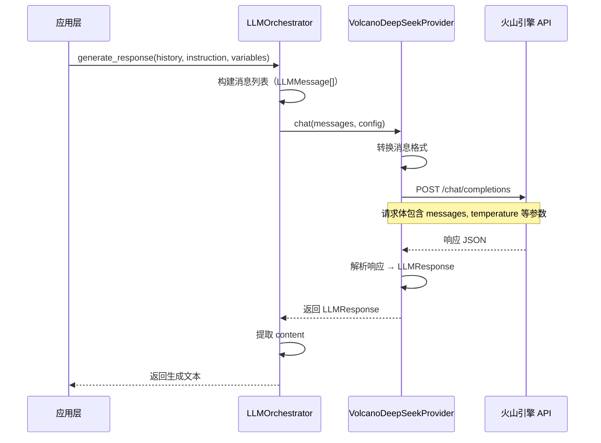
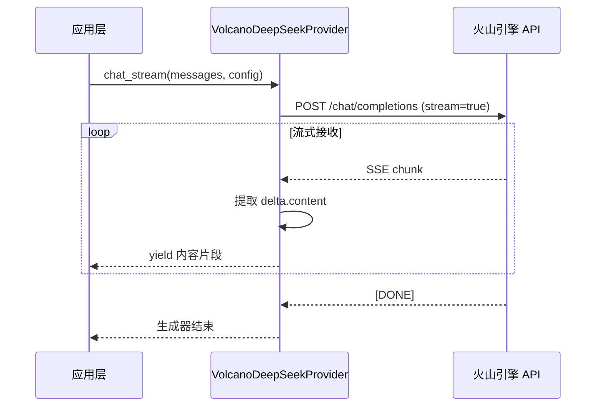
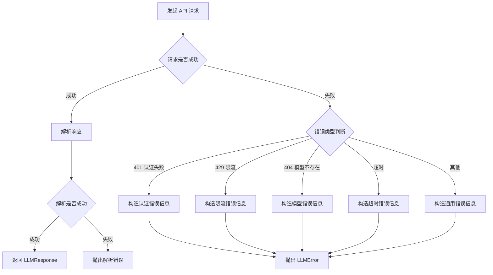

# 火山引擎 DeepSeek 接口集成设计

## 背景与目标

### 当前状态

项目已实现完整的 LLM 抽象层架构，包括：

- BaseLLMProvider 基类定义了标准的 LLM 接口
- OpenAIProvider 实现了 OpenAI 兼容接口
- MockLLMProvider 提供测试用途
- LLMOrchestrator 负责 LLM 调用编排

但目前系统使用的是 MockLLMProvider，真实 LLM 服务尚未对接。

### 目标

集成火山引擎的 DeepSeek 接口，使系统能够：

- 调用火山引擎托管的 DeepSeek 模型进行对话生成
- 支持标准对话和流式对话两种模式
- 与现有架构无缝集成，遵循已有的抽象接口
- 支持配置化管理，便于切换和调试

### 价值

- 启用真实的 AI 对话能力，使心理咨询引擎能够实际运行
- DeepSeek 提供高性价比的国内 LLM 服务
- 火山引擎提供稳定的托管服务和可靠性保障

## 技术方案

### 架构设计

系统采用提供者模式（Provider Pattern）实现 LLM 接口抽象，火山引擎 DeepSeek 作为新的提供者实现：

```
LLMOrchestrator
    ↓
BaseLLMProvider (抽象基类)
    ↓
┌───────────────┬─────────────────┬──────────────────────┐
│               │                 │                      │
MockLLMProvider OpenAIProvider   VolcanoDeepSeekProvider (新增)
```

#### 接口继承关系

VolcanoDeepSeekProvider 继承 BaseLLMProvider，实现以下标准接口：

- `chat()` - 标准对话接口
- `chat_stream()` - 流式对话接口
- `validate_config()` - 配置验证

### API 协议分析

#### 火山引擎 DeepSeek API 特点

火山引擎提供的 DeepSeek 接口采用 OpenAI 兼容协议，主要特征：

- 请求格式与 OpenAI Chat Completions API 一致
- 响应结构与 OpenAI 保持兼容
- 支持 `stream=true` 参数进行流式输出

#### 关键差异点

| 特性     | OpenAI               | 火山引擎 DeepSeek                |
| -------- | -------------------- | -------------------------------- |
| Base URL | api.openai.com/v1    | ark.cn-beijing.volces.com/api/v3 |
| 认证方式 | Bearer Token         | API Key Header                   |
| 模型标识 | gpt-3.5-turbo, gpt-4 | ep-xxxxx (endpoint ID)           |
| 区域部署 | 全球                 | 中国区                           |
| 计费方式 | Token 计费           | 火山引擎计费                     |

#### 请求格式

火山引擎 DeepSeek 请求与 OpenAI 保持一致：

| 字段              | 类型    | 说明                           | 必填 |
| ----------------- | ------- | ------------------------------ | ---- |
| model             | string  | 端点 ID（如 ep-xxxxx）         | 是   |
| messages          | array   | 消息列表，包含 role 和 content | 是   |
| temperature       | float   | 采样温度 (0.0-2.0)             | 否   |
| max_tokens        | integer | 最大生成 token 数              | 否   |
| top_p             | float   | 核采样参数 (0.0-1.0)           | 否   |
| frequency_penalty | float   | 频率惩罚 (-2.0-2.0)            | 否   |
| presence_penalty  | float   | 存在惩罚 (-2.0-2.0)            | 否   |
| stop              | array   | 停止序列                       | 否   |
| stream            | boolean | 是否流式输出                   | 否   |

#### 响应格式

标准响应包含：

- `id` - 请求 ID
- `object` - 对象类型（chat.completion）
- `created` - 创建时间戳
- `model` - 使用的模型
- `choices` - 生成结果数组
  - `index` - 序号
  - `message` - 消息对象（role, content）
  - `finish_reason` - 完成原因（stop, length 等）
- `usage` - Token 使用统计
  - `prompt_tokens` - 输入 token 数
  - `completion_tokens` - 输出 token 数
  - `total_tokens` - 总 token 数

流式响应为 Server-Sent Events (SSE) 格式，每个事件包含：

- `data: {...}` - JSON 数据块
- `delta` 字段包含增量内容
- `data: [DONE]` - 流结束标记

### 实现策略

#### 方案选择

考虑到火山引擎 DeepSeek API 与 OpenAI 协议高度兼容，有两种实现方案：

**方案 A：复用 OpenAIProvider**

- 优势：无需编写新代码，直接修改配置
- 劣势：混淆不同提供者，不利于后续差异化处理

**方案 B：创建独立 VolcanoDeepSeekProvider**

- 优势：职责清晰，便于定制优化
- 劣势：存在少量代码重复

**选择：方案 B** - 创建独立提供者，原因：

1. 保持架构清晰，不同提供者职责分离
2. 便于未来针对火山引擎特性进行优化
3. 避免 OpenAIProvider 职责膨胀
4. 可能的差异化需求（重试策略、错误处理、监控埋点等）

#### 实现组件

**1. VolcanoDeepSeekProvider 类**

核心职责：

- 封装火山引擎 API 调用逻辑
- 处理认证和请求头构造
- 消息格式转换（内部格式 ↔ API 格式）
- 响应解析和错误处理
- 流式响应处理

初始化参数：

- `config: LLMConfig` - LLM 通用配置
- `api_key: str` - 火山引擎 API 密钥
- `endpoint_id: str` - DeepSeek 端点 ID

关键属性：

- `base_url: str` - API 基础地址（固定为火山引擎地址）
- `client: AsyncOpenAI` - 复用 OpenAI SDK 客户端
- `endpoint_id: str` - 端点标识符

**2. 配置管理**

在配置文件 `config/dev.yaml` 中新增火山引擎配置段：

| 配置项                  | 说明       | 示例值                           |
| ----------------------- | ---------- | -------------------------------- |
| llm.provider            | 提供者类型 | volcano_deepseek                 |
| llm.volcano.api_key     | API 密钥   | 从环境变量读取                   |
| llm.volcano.endpoint_id | 端点 ID    | ep-xxxxx                         |
| llm.volcano.base_url    | API 地址   | ark.cn-beijing.volces.com/api/v3 |
| llm.model               | 使用的端点 | 同 endpoint_id                   |

**3. 环境变量**

在 `.env` 文件中添加：

- `VOLCANO_API_KEY` - 火山引擎 API 密钥
- `VOLCANO_ENDPOINT_ID` - DeepSeek 端点 ID

**4. 初始化流程**

应用启动时的提供者选择逻辑：

```
读取配置 llm.provider
    ↓
根据 provider 值分发
    ↓
┌─────────────┬──────────────┬───────────────────┐
│             │              │                   │
"mock"      "openai"   "volcano_deepseek"      "其他"
│             │              │                   │
创建 Mock   创建 OpenAI  创建 Volcano         抛出错误
```

### 关键实现细节

#### 认证机制

火山引擎 API 认证方式：

- 请求头添加 `Authorization: Bearer {api_key}`
- 与 OpenAI 认证方式相同，可直接使用 OpenAI SDK

#### HTTP 客户端

复用 `openai.AsyncOpenAI` 客户端：

- 设置 `api_key` 为火山引擎密钥
- 设置 `base_url` 为火山引擎地址
- SDK 自动处理认证、重试、超时等

#### 消息转换

内部消息格式（LLMMessage）→ API 格式：

- `role: MessageRole` → `"role": "system"|"user"|"assistant"`
- `content: str` → `"content": "..."`
- 忽略 `metadata` 字段

API 响应 → 内部格式（LLMResponse）：

- 提取 `choices[0].message.content` 作为内容
- 提取 `usage` 字段作为 token 统计
- 提取 `finish_reason` 作为完成原因
- 提取 `id` 和 `created` 存入 metadata

#### 流式处理

流式响应处理流程：

1. 发送请求时设置 `stream=True`
2. SDK 返回异步迭代器
3. 逐个读取 chunk 对象
4. 提取 `delta.content` 字段
5. 通过生成器 yield 返回内容片段
6. 收到 `finish_reason` 时结束

#### 错误处理

错误分类与处理策略：

| 错误类型   | HTTP 状态码 | 处理方式                              |
| ---------- | ----------- | ------------------------------------- |
| 认证失败   | 401         | 包装为 LLMError，提示检查 API Key     |
| 配额超限   | 429         | 包装为 LLMError，提示限流             |
| 模型不存在 | 404         | 包装为 LLMError，提示检查 endpoint_id |
| 请求超时   | 408/504     | 包装为 LLMError，建议重试             |
| 服务错误   | 500/503     | 包装为 LLMError，建议稍后重试         |
| 网络错误   | -           | 包装为 LLMError，提示网络异常         |

统一抛出 `LLMError` 异常，携带原始错误信息。

#### 配置验证

`validate_config()` 方法验证项：

- `api_key` 非空
- `endpoint_id` 非空且格式正确（ep- 开头）
- `base_url` 格式有效
- `config.model` 与 `endpoint_id` 一致

### 集成改造

#### 应用入口改造

修改 `src/api/main.py` 中的 LLM 提供者初始化逻辑：

| 改造点     | 改造内容                          |
| ---------- | --------------------------------- |
| 导入依赖   | 添加 VolcanoDeepSeekProvider 导入 |
| 配置加载   | 读取火山引擎相关配置              |
| 提供者创建 | 根据配置类型实例化对应提供者      |
| 编排器创建 | 将提供者注入 LLMOrchestrator      |

#### 配置文件改造

修改 `config/dev.yaml`：

- 新增 `llm.volcano` 配置段
- 修改 `llm.provider` 默认值为 `volcano_deepseek`
- 保留原有 OpenAI 配置以便切换

#### 环境变量改造

更新 `.env.example`：

- 添加 `VOLCANO_API_KEY` 示例
- 添加 `VOLCANO_ENDPOINT_ID` 示例
- 添加火山引擎配置说明注释

## 数据流设计

### 标准对话流程



### 流式对话流程



### 错误处理流程



## 部署与配置

### 配置参数说明

#### 核心配置

| 参数路径                | 类型   | 必填 | 默认值                           | 说明              |
| ----------------------- | ------ | ---- | -------------------------------- | ----------------- |
| llm.provider            | string | 是   | volcano_deepseek                 | 提供者类型标识    |
| llm.volcano.api_key     | string | 是   | ${VOLCANO_API_KEY}               | 火山引擎 API 密钥 |
| llm.volcano.endpoint_id | string | 是   | ${VOLCANO_ENDPOINT_ID}           | DeepSeek 端点 ID  |
| llm.volcano.base_url    | string | 否   | ark.cn-beijing.volces.com/api/v3 | API 基础地址      |

#### 模型参数

| 参数路径              | 类型    | 范围     | 默认值         | 说明                 |
| --------------------- | ------- | -------- | -------------- | -------------------- |
| llm.model             | string  | -        | 同 endpoint_id | 模型标识             |
| llm.temperature       | float   | 0.0-2.0  | 0.7            | 采样温度，越高越随机 |
| llm.max_tokens        | integer | 1-4096   | 2000           | 最大生成 token 数    |
| llm.top_p             | float   | 0.0-1.0  | 1.0            | 核采样概率阈值       |
| llm.frequency_penalty | float   | -2.0-2.0 | 0.0            | 频率惩罚系数         |
| llm.presence_penalty  | float   | -2.0-2.0 | 0.0            | 存在惩罚系数         |

#### 网络参数

| 参数路径        | 类型    | 默认值 | 说明               |
| --------------- | ------- | ------ | ------------------ |
| llm.timeout     | integer | 60     | 请求超时时间（秒） |
| llm.max_retries | integer | 3      | 最大重试次数       |

### 环境变量

#### 必需变量

- `VOLCANO_API_KEY` - 火山引擎 API 密钥
  - 获取方式：火山引擎控制台 → API 管理
  - 格式：字符串，需保密
  - 示例：`sk-xxxxxxxxxxxxxxxx`

- `VOLCANO_ENDPOINT_ID` - DeepSeek 端点 ID
  - 获取方式：火山引擎控制台 → 模型推理 → 端点列表
  - 格式：`ep-` 开头的字符串
  - 示例：`ep-20241106123456-abcde`

#### 可选变量

- `LOG_LEVEL` - 日志级别（DEBUG/INFO/WARNING/ERROR）
- `DEBUG` - 是否启用调试模式（true/false）

### 切换不同提供者

系统支持通过配置灵活切换 LLM 提供者：

| 提供者        | 配置值           | 适用场景                   |
| ------------- | ---------------- | -------------------------- |
| 火山 DeepSeek | volcano_deepseek | 生产环境，需要真实 AI 能力 |
| OpenAI        | openai           | 使用 OpenAI 官方服务       |
| Mock          | mock             | 开发测试，无需真实 API     |

切换方式：修改 `config/dev.yaml` 中 `llm.provider` 值，重启服务即可。

## 测试验证

### 测试场景

#### 功能测试

| 测试项       | 验证内容                          | 预期结果                        |
| ------------ | --------------------------------- | ------------------------------- |
| 配置加载     | 正确读取火山引擎配置              | 参数值与配置文件一致            |
| 提供者初始化 | 创建 VolcanoDeepSeekProvider 实例 | 实例化成功，配置验证通过        |
| 标准对话     | 发送单轮对话请求                  | 返回有效的 LLMResponse          |
| 多轮对话     | 发送包含历史的对话                | 能理解上下文并生成合理回复      |
| 流式对话     | 接收流式响应                      | 逐步返回内容片段，无阻塞        |
| Token 统计   | 检查响应中的 usage 字段           | 准确统计输入、输出、总 token 数 |

#### 异常测试

| 测试项       | 触发条件               | 预期行为                      |
| ------------ | ---------------------- | ----------------------------- |
| API Key 错误 | 使用无效密钥           | 抛出 LLMError，提示认证失败   |
| 端点不存在   | 使用错误的 endpoint_id | 抛出 LLMError，提示模型不存在 |
| 网络超时     | 设置极短 timeout       | 抛出 LLMError，提示超时       |
| 请求限流     | 高频请求触发限流       | 抛出 LLMError，提示限流       |
| 配置缺失     | 缺少必需配置项         | 配置验证失败，启动报错        |

#### 性能测试

| 测试项       | 指标                | 目标值 |
| ------------ | ------------------- | ------ |
| 响应时间     | 平均响应延迟        | < 3 秒 |
| 流式首字延迟 | 首个 token 返回时间 | < 1 秒 |
| 并发能力     | 支持并发请求数      | ≥ 10   |
| 稳定性       | 连续调用成功率      | ≥ 99%  |

### 测试方法

#### 单元测试

针对 VolcanoDeepSeekProvider 编写单元测试，覆盖：

- 消息格式转换逻辑
- 响应解析逻辑
- 错误处理分支
- 配置验证逻辑

使用 Mock 技术模拟 API 响应，避免真实请求。

#### 集成测试

编写端到端测试，验证完整流程：

1. 配置加载
2. 提供者创建
3. 发送真实请求到火山引擎
4. 接收并验证响应
5. 检查日志输出

#### 手动测试

通过 Web 界面或 API 接口发起对话：

1. 启动应用
2. 创建会话
3. 发送用户消息
4. 观察 AI 回复
5. 检查对话连贯性

## 风险与限制

### 技术风险

| 风险项         | 描述                   | 影响         | 应对措施                 |
| -------------- | ---------------------- | ------------ | ------------------------ |
| API 兼容性变化 | 火山引擎调整协议细节   | 接口调用失败 | 版本锁定，关注官方公告   |
| 流式响应差异   | SSE 格式与预期不符     | 流式功能异常 | 充分测试，准备降级方案   |
| Token 计算差异 | 计数方式与 OpenAI 不同 | 统计数据偏差 | 不影响核心功能，记录差异 |
| SDK 依赖冲突   | openai 库版本不兼容    | 初始化失败   | 版本测试，必要时升级     |

### 业务风险

| 风险项       | 描述               | 影响         | 应对措施                   |
| ------------ | ------------------ | ------------ | -------------------------- |
| API 配额耗尽 | 超过购买配额       | 服务不可用   | 配额监控，预警机制         |
| 成本超预期   | 调用量大导致费用高 | 预算压力     | 调用量监控，限流策略       |
| 服务稳定性   | 火山引擎服务中断   | 用户无法使用 | 实现重试，考虑多提供者容灾 |
| 响应质量问题 | 生成内容不符合预期 | 用户体验差   | Prompt 优化，模型参数调优  |

### 限制说明

#### 功能限制

- 暂不支持函数调用（Function Calling）能力
- 暂不支持视觉理解（Vision）功能
- 暂不支持嵌入（Embedding）接口
- 单次对话上下文长度受模型限制

#### 性能限制

- 受火山引擎 API 限流约束
- 网络延迟取决于地理位置和网络质量
- 并发请求数受服务端配额限制

#### 安全限制

- API Key 需妥善保管，避免泄露
- 不应在前端直接调用，必须通过后端代理
- 用户输入需过滤敏感信息

## 后续优化方向

### 短期优化

| 优化项   | 目标                         | 优先级 |
| -------- | ---------------------------- | ------ |
| 重试策略 | 实现指数退避重试，提高容错性 | 高     |
| 日志增强 | 记录请求/响应详情，便于调试  | 高     |
| 监控埋点 | 统计调用次数、延迟、错误率   | 中     |
| 参数校验 | 增强输入参数合法性检查       | 中     |

### 中期优化

| 优化项     | 目标                          | 优先级 |
| ---------- | ----------------------------- | ------ |
| 缓存机制   | 缓存相同请求的响应，降低成本  | 中     |
| 提供者切换 | 支持运行时动态切换提供者      | 中     |
| 流控策略   | 客户端限流，避免超配额        | 中     |
| 成本统计   | 记录 token 消耗，生成费用报表 | 低     |

### 长期优化

| 优化项       | 目标                       | 优先级 |
| ------------ | -------------------------- | ------ |
| 多提供者容灾 | 主提供者失败时自动切换备用 | 低     |
| 智能路由     | 根据场景选择最优提供者     | 低     |
| 模型微调     | 针对 CBT 场景微调 DeepSeek | 低     |
| 本地部署     | 支持本地部署的 LLM         | 低     |

## 附录

### 火山引擎 API 文档

- 官方文档：https://www.volcengine.com/docs/82379
- API 参考：模型推理 - Chat Completions 接口
- 控制台：https://console.volcengine.com/ark

### 相关配置文件

| 文件路径                        | 用途                   |
| ------------------------------- | ---------------------- |
| config/dev.yaml                 | 开发环境配置           |
| .env                            | 环境变量（敏感信息）   |
| .env.example                    | 环境变量模板           |
| src/api/main.py                 | 应用入口，提供者初始化 |
| src/engines/llm/base.py         | LLM 抽象基类           |
| src/engines/llm/orchestrator.py | LLM 编排器             |

### 关键术语

| 术语            | 说明                                             |
| --------------- | ------------------------------------------------ |
| 端点 (Endpoint) | 火山引擎中部署的模型实例，通过 endpoint_id 标识  |
| SSE             | Server-Sent Events，服务器推送事件，用于流式响应 |
| Token           | LLM 的最小文本单元，中文约 1.5-2 字符/token      |
| Temperature     | 采样温度，控制生成随机性，0=确定性，2=高随机性   |
| Top-p           | 核采样参数，控制生成多样性，值越小越聚焦         |
