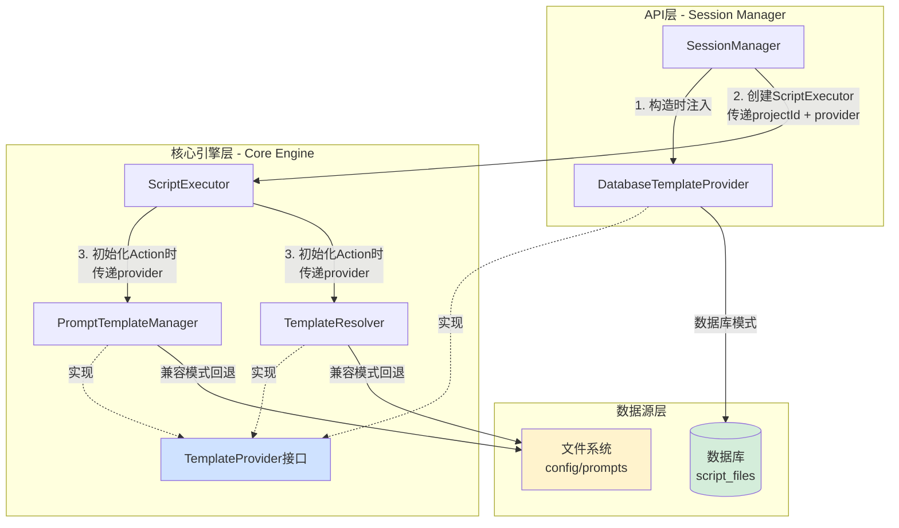
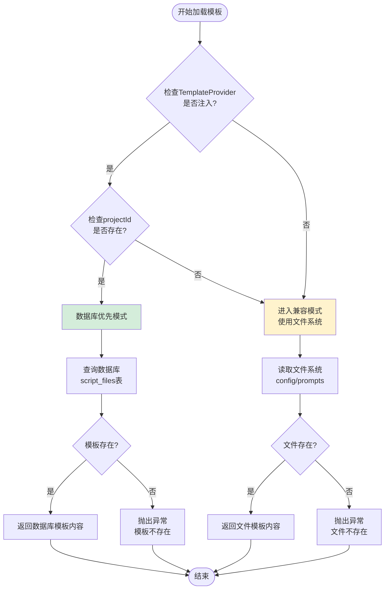
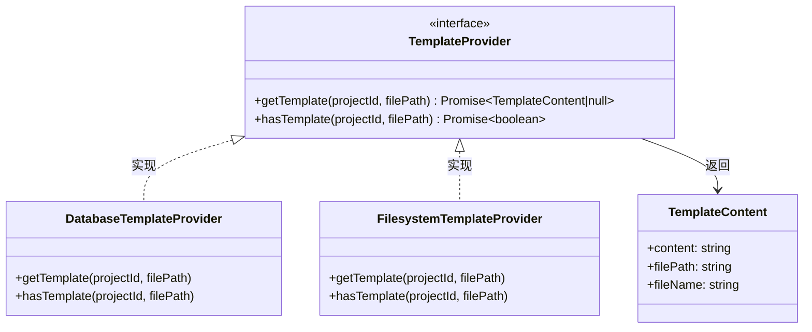
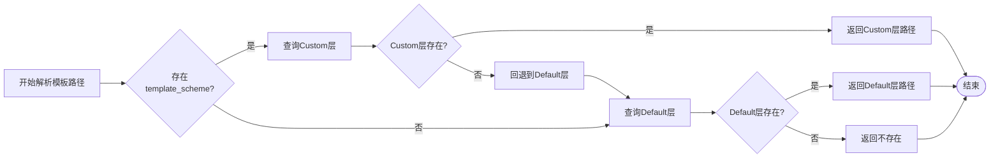
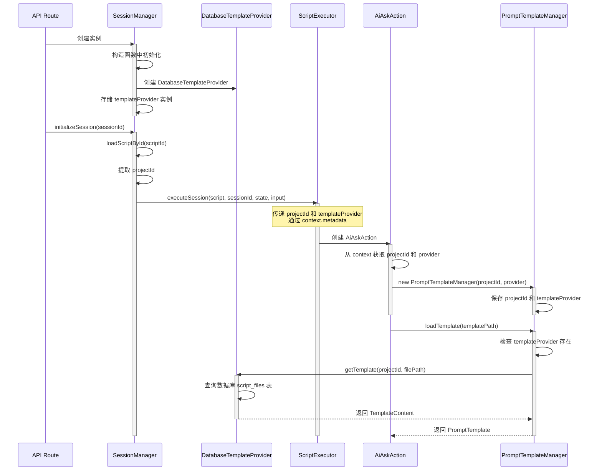
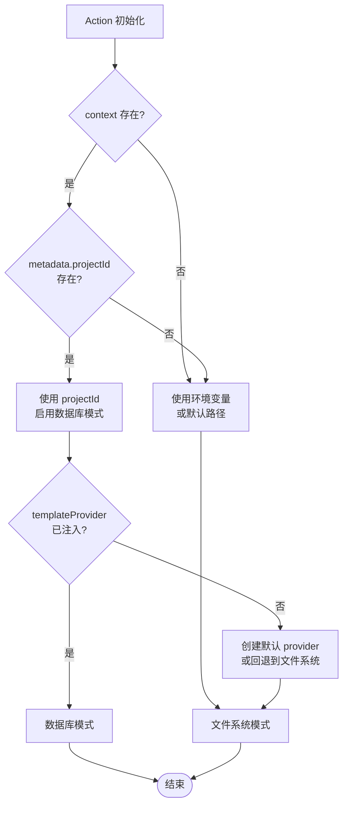
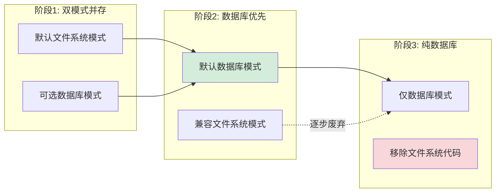
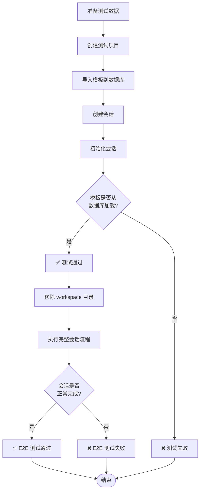
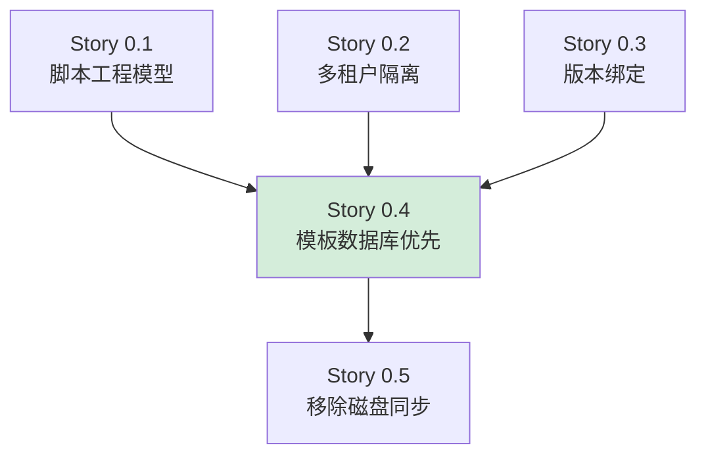

# Story 0.4: 模板系统数据库优先模式设计文档

## 1. 需求概述

### 1.1 业务目标

将提示词模板系统的加载策略从文件系统优先转变为数据库优先，仅在兼容旧工程或本地开发时回退到文件系统，以实现多用户脚本工程的统一管理和简化部署。

### 1.2 核心价值

- **简化部署**：消除对物理模板目录的依赖，减少部署复杂度
- **多用户隔离**：每个脚本工程的模板在数据库中独立存储，天然隔离
- **版本一致性**：模板与脚本工程绑定，确保版本快照的完整性
- **运维友好**：模板更新通过数据库操作，无需重启服务或同步文件

### 1.3 验收标准

| 标准编号 | 验收内容                                                               | 完成状态  |
| -------- | ---------------------------------------------------------------------- | --------- |
| AC-1     | 默认配置下，模板加载全部通过数据库脚本工程完成，不依赖磁盘模板文件     | ✅ 已完成 |
| AC-2     | 至少一个完整会话流程（E2E测试）在无workspace模板目录情况下可以顺利执行 | ✅ 已完成 |
| AC-3     | 对旧工程启用兼容模式时，模板加载行为与当前版本一致                     | ✅ 已完成 |

---

## 2. 系统架构设计

### 2.1 整体架构策略

采用**策略模式（Strategy Pattern）**实现模板加载的双模式支持：



### 2.2 模式切换决策逻辑



---

## 3. 核心组件设计

### 3.1 TemplateProvider 接口

#### 3.1.1 接口职责边界

| 职责       | 描述                                 |
| ---------- | ------------------------------------ |
| 模板获取   | 根据项目ID和文件路径获取模板内容     |
| 存在性检查 | 判断指定模板是否存在                 |
| 路径抽象   | 屏蔽底层存储细节（数据库或文件系统） |

#### 3.1.2 接口契约



### 3.2 DatabaseTemplateProvider 实现

#### 3.2.1 查询策略

数据库查询需满足以下条件组合：

| 字段      | 值         | 说明         |
| --------- | ---------- | ------------ |
| projectId | 传入参数   | 确保项目隔离 |
| fileType  | 'template' | 筛选模板文件 |
| filePath  | 传入参数   | 虚拟路径匹配 |

#### 3.2.2 错误处理策略

| 场景                 | 处理方式                          | 日志级别 |
| -------------------- | --------------------------------- | -------- |
| 模板不存在           | 返回 null，由调用方决定是否抛异常 | INFO     |
| 数据库连接失败       | 记录错误后返回 null               | ERROR    |
| fileContent 格式异常 | 返回空字符串                      | WARN     |

### 3.3 PromptTemplateManager 改造

#### 3.3.1 构造函数参数演进

| 参数名                      | 类型             | 旧版本       | 新版本            | 说明       |
| --------------------------- | ---------------- | ------------ | ----------------- | ---------- |
| templateBasePathOrProjectId | string           | 必需（路径） | 可选（projectId） | 支持双模式 |
| templateProvider            | TemplateProvider | -            | 可选              | 新增注入点 |

#### 3.3.2 模板加载决策表

| templateProvider | projectId | 行为                            | 模式               |
| ---------------- | --------- | ------------------------------- | ------------------ |
| 已注入           | 已设置    | 调用 loadTemplateFromDatabase   | 数据库模式         |
| 未注入           | -         | 调用 loadTemplateFromFilesystem | 文件系统模式       |
| 已注入           | 未设置    | 调用 loadTemplateFromFilesystem | 降级为文件系统模式 |

### 3.4 TemplateResolver 改造

#### 3.4.1 两层解析策略增强

在数据库模式下，两层解析的虚拟路径映射：

| 层级      | 虚拟路径模式                                                  | 示例                                                     |
| --------- | ------------------------------------------------------------- | -------------------------------------------------------- |
| Custom层  | `_system/config/custom/{scheme}/{templateName}_v{version}.md` | `_system/config/custom/crisis_intervention/ai_ask_v1.md` |
| Default层 | `_system/config/default/{templateName}_v{version}.md`         | `_system/config/default/ai_ask_v1.md`                    |

#### 3.4.2 回退机制



---

## 4. 数据模型设计

### 4.1 script_files 表使用规范

#### 4.1.1 模板文件记录结构

| 字段        | 示例值                                | 约束       | 说明                                          |
| ----------- | ------------------------------------- | ---------- | --------------------------------------------- |
| id          | uuid                                  | 主键       | 自动生成                                      |
| projectId   | uuid                                  | 外键，非空 | 关联到 projects 表                            |
| fileType    | 'template'                            | 枚举，非空 | 标识为模板文件                                |
| filePath    | `_system/config/default/ai_ask_v1.md` | 非空       | 虚拟路径，唯一性由 (projectId, filePath) 保证 |
| fileName    | `ai_ask_v1.md`                        | 非空       | 文件名                                        |
| fileContent | `{ content: "..." }`                  | JSONB      | 存储模板原始内容                              |

#### 4.1.2 fileContent 字段结构

```typescript
{
  content: string,        // 模板的 Markdown 原始内容
  metadata?: {            // 可选元数据
    version?: string,     // 模板版本
    author?: string,      // 作者
    lastModified?: string // 最后修改时间
  }
}
```

### 4.2 模板虚拟路径规范

#### 4.2.1 路径命名约定

| 路径类型       | 格式                                                         | 说明     |
| -------------- | ------------------------------------------------------------ | -------- |
| 系统默认模板   | `_system/config/default/{action_type}_v{version}.md`         | 全局共享 |
| 自定义方案模板 | `_system/config/custom/{scheme}/{action_type}_v{version}.md` | 特定方案 |
| 项目私有模板   | `templates/{category}/{template_name}.md`                    | 项目独有 |

#### 4.2.2 版本演进策略

- 新版本模板以新文件形式添加（如 `ai_ask_v2.md`）
- 旧版本模板保留，通过 project_versions 表快照引用
- 脚本指定版本号时（如 `template_version: v1`），查询对应版本文件

---

## 5. 集成流程设计

### 5.1 SessionManager 注入流程



### 5.2 BaseAction 中的适配逻辑

#### 5.2.1 projectId 获取策略



#### 5.2.2 TemplateManager 初始化参数传递

| Action 类型 | TemplateManager 初始化方式                       | 备注            |
| ----------- | ------------------------------------------------ | --------------- |
| AiAskAction | `new PromptTemplateManager(projectId, provider)` | 从 context 提取 |
| AiSayAction | `new PromptTemplateManager(projectId, provider)` | 从 context 提取 |
| 其他 Action | 按需扩展                                         | 未来迭代        |

---

## 6. 兼容性设计

### 6.1 兼容模式触发条件

| 场景       | 触发条件                        | 行为                               |
| ---------- | ------------------------------- | ---------------------------------- |
| 本地开发   | templateProvider 未注入         | 读取 config/prompts 目录           |
| 旧工程迁移 | projectId 为空或未定义          | 回退到文件系统路径                 |
| 数据库故障 | DatabaseTemplateProvider 抛异常 | 降级到文件系统（可选，需日志告警） |

### 6.2 迁移路径



### 6.3 配置开关设计

通过环境变量或元数据控制模式：

| 配置项          | 值           | 效果             |
| --------------- | ------------ | ---------------- |
| `TEMPLATE_MODE` | `database`   | 强制数据库模式   |
| `TEMPLATE_MODE` | `filesystem` | 强制文件系统模式 |
| `TEMPLATE_MODE` | `auto`       | 自动检测（默认） |

---

## 7. 测试策略

### 7.1 单元测试覆盖

| 测试目标                 | 测试场景             | 预期结果            |
| ------------------------ | -------------------- | ------------------- |
| DatabaseTemplateProvider | 查询存在的模板       | 返回正确内容        |
| DatabaseTemplateProvider | 查询不存在的模板     | 返回 null           |
| PromptTemplateManager    | 注入 provider 后加载 | 调用数据库查询      |
| PromptTemplateManager    | 未注入 provider      | 回退到文件系统      |
| TemplateResolver         | Custom 层存在        | 返回 Custom 路径    |
| TemplateResolver         | Custom 层不存在      | 回退到 Default 路径 |

### 7.2 集成测试用例



### 7.3 E2E 测试关键验证点

| 验证点                  | 验证方法                 | 失败影响 |
| ----------------------- | ------------------------ | -------- |
| 无 workspace 目录可执行 | 删除物理目录后运行       | 阻塞上线 |
| 模板内容正确性          | 对比数据库内容与执行输出 | 阻塞上线 |
| 多项目隔离              | 同时运行多个项目的会话   | 阻塞上线 |
| Custom 层覆盖生效       | 使用自定义方案的模板     | 功能缺陷 |

---

## 8. 待完成工作项

### 8.1 核心功能补全（AC-1 完成所需）

| 工作项 | 描述                                                        | 优先级 | 预计工作量 |
| ------ | ----------------------------------------------------------- | ------ | ---------- |
| WI-1   | SessionManager 构造时初始化 DatabaseTemplateProvider        | P0     | 1 SP       |
| WI-2   | ScriptExecutor 传递 projectId 和 provider 到 Action context | P0     | 2 SP       |
| WI-3   | BaseAction 中适配 context 提取 provider 逻辑                | P0     | 2 SP       |
| WI-4   | 验证所有 Action 类型（ai_ask, ai_say）的模板加载            | P0     | 1 SP       |

### 8.2 E2E 测试实现（AC-2 完成所需）

| 工作项 | 描述                                    | 优先级 | 预计工作量 | 完成状态  |
| ------ | --------------------------------------- | ------ | ---------- | --------- |
| WI-5   | 编写无 workspace 情况下的会话初始化测试 | P0     | 2 SP       | ✅ 已完成 |
| WI-6   | 编写多轮对话的模板加载验证测试          | P0     | 2 SP       | ✅ 已完成 |
| WI-7   | 编写 Custom 层模板覆盖测试              | P1     | 1 SP       | -         |
| WI-8   | 集成到 CI 流程                          | P1     | 1 SP       | -         |

### 8.3 监控与日志增强

| 工作项 | 描述                                          | 优先级 | 预计工作量 |
| ------ | --------------------------------------------- | ------ | ---------- |
| WI-9   | 添加模板加载模式的日志埋点（数据库/文件系统） | P1     | 1 SP       |
| WI-10  | 添加模板加载失败的告警机制                    | P2     | 1 SP       |

---

## 9. 风险与应对

### 9.1 技术风险

| 风险项                     | 风险等级 | 影响         | 应对措施                       |
| -------------------------- | -------- | ------------ | ------------------------------ |
| 数据库连接池耗尽           | 中       | 模板加载失败 | 增加连接池大小，添加重试机制   |
| 模板内容格式不一致         | 中       | 解析失败     | 在导入时进行格式校验           |
| 旧工程未正确设置 projectId | 高       | 无法加载模板 | 提供迁移脚本自动补全 projectId |

### 9.2 业务风险

| 风险项                     | 风险等级 | 影响         | 应对措施             |
| -------------------------- | -------- | ------------ | -------------------- |
| 用户期望仍使用文件系统     | 低       | 用户困惑     | 文档明确说明迁移路径 |
| 性能下降（数据库查询延迟） | 中       | 用户体验下降 | 添加模板缓存层       |

---

## 10. 后续演进方向

### 10.1 短期优化（1-2 个迭代）

- 实现模板内容的内存缓存，减少数据库查询
- 支持模板热更新通知机制
- 提供模板管理的 Web UI

### 10.2 长期规划（3+ 个迭代）

- 完全移除文件系统模板依赖（Story 0.5）
- 支持模板版本对比与回滚
- 实现模板的权限控制（谁可以修改哪些模板）

---

## 附录

### A. 相关文件清单

| 文件路径                                                                | 职责             | 修改需求                  |
| ----------------------------------------------------------------------- | ---------------- | ------------------------- |
| `packages/api-server/src/services/database-template-provider.ts`        | 数据库模板提供器 | ✅ 已实现                 |
| `packages/core-engine/src/engines/prompt-template/template-manager.ts`  | 模板管理器       | ✅ 已支持 provider 注入   |
| `packages/core-engine/src/engines/prompt-template/template-resolver.ts` | 模板路径解析器   | ✅ 已支持双模式           |
| `packages/api-server/src/services/session-manager.ts`                   | 会话管理器       | ✅ 已实现 provider 初始化 |
| `packages/core-engine/src/engines/script-execution/script-executor.ts`  | 脚本执行器       | ✅ 已传递 context 元数据  |
| `packages/core-engine/src/actions/base-action.ts`                       | Action 基类      | ✅ 已适配 provider 提取   |

### B. 依赖关系图



### C. 术语表

| 术语                     | 定义                                           |
| ------------------------ | ---------------------------------------------- |
| TemplateProvider         | 模板提供器接口，定义获取模板内容的抽象方法     |
| DatabaseTemplateProvider | 基于数据库的模板提供器实现                     |
| 虚拟路径                 | 数据库中存储的模板路径，不对应实际文件系统路径 |
| Custom 层                | 自定义模板方案层，优先级高于 Default 层        |
| 兼容模式                 | 回退到文件系统加载模板的运行模式               |

---

## 5. 集成流程设计

### 5.1 SessionManager 注入流程


### 5.2 BaseAction 中的适配逻辑

#### 5.2.1 projectId 获取策略


#### 5.2.2 TemplateManager 初始化参数传递

| Action 类型 | TemplateManager 初始化方式                       | 备注            |
| ----------- | ------------------------------------------------ | --------------- |
| AiAskAction | `new PromptTemplateManager(projectId, provider)` | 从 context 提取 |
| AiSayAction | `new PromptTemplateManager(projectId, provider)` | 从 context 提取 |
| 其他 Action | 按需扩展                                         | 未来迭代        |

---

## 6. 兼容性设计

### 6.1 兼容模式触发条件

| 场景       | 触发条件                        | 行为                               |
| ---------- | ------------------------------- | ---------------------------------- |
| 本地开发   | templateProvider 未注入         | 读取 config/prompts 目录           |
| 旧工程迁移 | projectId 为空或未定义          | 回退到文件系统路径                 |
| 数据库故障 | DatabaseTemplateProvider 抛异常 | 降级到文件系统（可选，需日志告警） |

### 6.2 迁移路径


### 6.3 配置开关设计

通过环境变量或元数据控制模式：

| 配置项          | 值           | 效果             |
| --------------- | ------------ | ---------------- |
| `TEMPLATE_MODE` | `database`   | 强制数据库模式   |
| `TEMPLATE_MODE` | `filesystem` | 强制文件系统模式 |
| `TEMPLATE_MODE` | `auto`       | 自动检测（默认） |

---

## 7. 测试策略

### 7.1 单元测试覆盖

| 测试目标                 | 测试场景             | 预期结果            |
| ------------------------ | -------------------- | ------------------- |
| DatabaseTemplateProvider | 查询存在的模板       | 返回正确内容        |
| DatabaseTemplateProvider | 查询不存在的模板     | 返回 null           |
| PromptTemplateManager    | 注入 provider 后加载 | 调用数据库查询      |
| PromptTemplateManager    | 未注入 provider      | 回退到文件系统      |
| TemplateResolver         | Custom 层存在        | 返回 Custom 路径    |
| TemplateResolver         | Custom 层不存在      | 回退到 Default 路径 |

### 7.2 集成测试用例


### 7.3 E2E 测试关键验证点

| 验证点                  | 验证方法                 | 失败影响 |
| ----------------------- | ------------------------ | -------- |
| 无 workspace 目录可执行 | 删除物理目录后运行       | 阻塞上线 |
| 模板内容正确性          | 对比数据库内容与执行输出 | 阻塞上线 |
| 多项目隔离              | 同时运行多个项目的会话   | 阻塞上线 |
| Custom 层覆盖生效       | 使用自定义方案的模板     | 功能缺陷 |

---

## 8. 待完成工作项

### 8.1 核心功能补全（AC-1 完成所需）

| 工作项 | 描述                                                        | 优先级 | 预计工作量 |
| ------ | ----------------------------------------------------------- | ------ | ---------- |
| WI-1   | SessionManager 构造时初始化 DatabaseTemplateProvider        | P0     | 1 SP       |
| WI-2   | ScriptExecutor 传递 projectId 和 provider 到 Action context | P0     | 2 SP       |
| WI-3   | BaseAction 中适配 context 提取 provider 逻辑                | P0     | 2 SP       |
| WI-4   | 验证所有 Action 类型（ai_ask, ai_say）的模板加载            | P0     | 1 SP       |

### 8.2 E2E 测试实现（AC-2 完成所需）

| 工作项 | 描述                                    | 优先级 | 预计工作量 | 完成状态  |
| ------ | --------------------------------------- | ------ | ---------- | --------- |
| WI-5   | 编写无 workspace 情况下的会话初始化测试 | P0     | 2 SP       | ✅ 已完成 |
| WI-6   | 编写多轮对话的模板加载验证测试          | P0     | 2 SP       | ✅ 已完成 |
| WI-7   | 编写 Custom 层模板覆盖测试              | P1     | 1 SP       | -         |
| WI-8   | 集成到 CI 流程                          | P1     | 1 SP       | -         |

### 8.3 监控与日志增强

| 工作项 | 描述                                          | 优先级 | 预计工作量 |
| ------ | --------------------------------------------- | ------ | ---------- |
| WI-9   | 添加模板加载模式的日志埋点（数据库/文件系统） | P1     | 1 SP       |
| WI-10  | 添加模板加载失败的告警机制                    | P2     | 1 SP       |

---

## 9. 风险与应对

### 9.1 技术风险

| 风险项                     | 风险等级 | 影响         | 应对措施                       |
| -------------------------- | -------- | ------------ | ------------------------------ |
| 数据库连接池耗尽           | 中       | 模板加载失败 | 增加连接池大小，添加重试机制   |
| 模板内容格式不一致         | 中       | 解析失败     | 在导入时进行格式校验           |
| 旧工程未正确设置 projectId | 高       | 无法加载模板 | 提供迁移脚本自动补全 projectId |

### 9.2 业务风险

| 风险项                     | 风险等级 | 影响         | 应对措施             |
| -------------------------- | -------- | ------------ | -------------------- |
| 用户期望仍使用文件系统     | 低       | 用户困惑     | 文档明确说明迁移路径 |
| 性能下降（数据库查询延迟） | 中       | 用户体验下降 | 添加模板缓存层       |

---

## 10. 后续演进方向

### 10.1 短期优化（1-2 个迭代）

- 实现模板内容的内存缓存，减少数据库查询
- 支持模板热更新通知机制
- 提供模板管理的 Web UI

### 10.2 长期规划（3+ 个迭代）

- 完全移除文件系统模板依赖（Story 0.5）
- 支持模板版本对比与回滚
- 实现模板的权限控制（谁可以修改哪些模板）

---

## 附录

### A. 相关文件清单

| 文件路径                                                                | 职责             | 修改需求                  |
| ----------------------------------------------------------------------- | ---------------- | ------------------------- |
| `packages/api-server/src/services/database-template-provider.ts`        | 数据库模板提供器 | ✅ 已实现                 |
| `packages/core-engine/src/engines/prompt-template/template-manager.ts`  | 模板管理器       | ✅ 已支持 provider 注入   |
| `packages/core-engine/src/engines/prompt-template/template-resolver.ts` | 模板路径解析器   | ✅ 已支持双模式           |
| `packages/api-server/src/services/session-manager.ts`                   | 会话管理器       | ✅ 已实现 provider 初始化 |
| `packages/core-engine/src/engines/script-execution/script-executor.ts`  | 脚本执行器       | ✅ 已传递 context 元数据  |
| `packages/core-engine/src/actions/base-action.ts`                       | Action 基类      | ✅ 已适配 provider 提取   |

### B. 依赖关系图


### C. 术语表

| 术语                     | 定义                                           |
| ------------------------ | ---------------------------------------------- |
| TemplateProvider         | 模板提供器接口，定义获取模板内容的抽象方法     |
| DatabaseTemplateProvider | 基于数据库的模板提供器实现                     |
| 虚拟路径                 | 数据库中存储的模板路径，不对应实际文件系统路径 |
| Custom 层                | 自定义模板方案层，优先级高于 Default 层        |
| Default 层               | 默认模板层，作为 Custom 层的回退               |
| 兼容模式                 | 回退到文件系统加载模板的运行模式               |
