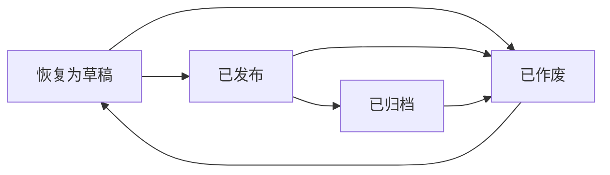

# 工程软删除管理机制 - 详细设计方案

## 一、概述

实现安全的工程删除管理机制，通过引入"作废"（deprecated）状态替代物理删除，确保数据完整性和可恢复性。

## 二、数据库层设计

### 2.1 Schema变更

**修改枚举类型**

```typescript
// packages/api-server/src/db/schema.ts
export const projectStatusEnum = pgEnum('project_status', [
  'draft', // 草稿
  'published', // 已发布
  'archived', // 已归档（正式工程）
  'deprecated', // 已作废（软删除）
]);
```

### 2.2 数据库迁移脚本

**文件：** `packages/api-server/drizzle/0003_add_deprecated_status.sql`

```sql
-- 扩展 project_status 枚举类型，添加 deprecated 状态
ALTER TYPE project_status ADD VALUE 'deprecated';

-- 为已作废状态添加注释
COMMENT ON TYPE project_status IS '项目状态: draft=草稿, published=已发布, archived=已归档, deprecated=已作废';

-- 刷新索引（如果需要）
REINDEX INDEX projects_status_idx;
```

### 2.3 状态转换规则



**状态转换约束：**

- `deprecated` 可以恢复到 `draft` 状态
- 其他状态不可恢复（单向流转）

## 三、API层设计

### 3.1 新增接口

#### 3.1.1 作废工程

```
POST /api/projects/:id/deprecate

请求体：
{
  "reason": "测试工程，不再需要",  // 可选：作废原因
  "operator": "LEO"                 // 操作人
}

响应：
{
  "success": true,
  "data": {
    "id": "uuid",
    "projectName": "测试工程",
    "status": "deprecated",
    "metadata": {
      "deprecatedAt": "2026-01-30T10:00:00Z",
      "deprecatedBy": "LEO",
      "deprecationReason": "测试工程，不再需要"
    }
  }
}
```

#### 3.1.2 恢复工程

```
POST /api/projects/:id/restore

请求体：
{
  "operator": "LEO"  // 操作人
}

响应：
{
  "success": true,
  "data": {
    "id": "uuid",
    "projectName": "测试工程",
    "status": "draft",
    "metadata": {
      "restoredAt": "2026-01-30T11:00:00Z",
      "restoredBy": "LEO"
    }
  }
}
```

### 3.2 修改现有接口

#### GET /api/projects

```
查询参数：
- status: string (draft | published | archived | deprecated | all)
- includeDeprecated: boolean (默认 false，为 true 时包含已作废工程)
- search: string
- author: string

默认行为变更：
- 默认不返回 deprecated 状态的工程
- 需要显式设置 includeDeprecated=true 或 status=deprecated 才能看到
```

## 四、前端实现设计

### 4.1 工程列表界面改造

#### 4.1.1 状态筛选器增强

```tsx
<Select value={statusFilter} onChange={setStatusFilter}>
  <Option value="all">All (Active)</Option>
  <Option value="draft">Draft</Option>
  <Option value="published">Published</Option>
  <Option value="archived">Archived</Option>
  <Option value="deprecated">🗑️ Deprecated</Option>
</Select>

<Checkbox
  checked={includeDeprecated}
  onChange={(e) => setIncludeDeprecated(e.target.checked)}
>
  Show deprecated projects
</Checkbox>
```

#### 4.1.2 状态标签显示

```tsx
const getStatusTag = (status: string) => {
  const statusMap = {
    draft: { color: 'default', text: 'Draft', icon: '📝' },
    published: { color: 'success', text: 'Published', icon: '✅' },
    archived: { color: 'warning', text: 'Archived', icon: '📦' },
    deprecated: { color: 'error', text: 'Deprecated', icon: '🗑️' },
  };
  const config = statusMap[status];
  return (
    <Tag color={config.color}>
      {config.icon} {config.text}
    </Tag>
  );
};
```

#### 4.1.3 操作菜单改造

```tsx
const getProjectMenuItems = (project: Project) => {
  const items = [];

  if (project.status !== 'deprecated') {
    items.push(
      { key: 'edit', icon: <EditOutlined />, label: 'Edit' },
      { key: 'files', icon: <FolderOpenOutlined />, label: 'View Files' },
      { key: 'copy', icon: <CopyOutlined />, label: 'Duplicate' },
      { type: 'divider' },
      {
        key: 'deprecate',
        icon: <DeleteOutlined />,
        label: 'Move to Trash',
        danger: true,
        onClick: () => handleDeprecateProject(project),
      }
    );
  } else {
    items.push(
      {
        key: 'restore',
        icon: <RollbackOutlined />,
        label: 'Restore',
        onClick: () => handleRestoreProject(project),
      },
      { type: 'divider' },
      {
        key: 'view-only',
        icon: <EyeOutlined />,
        label: 'View Only',
        disabled: false,
      }
    );
  }

  return items;
};
```

### 4.2 确认对话框设计

#### 4.2.1 作废确认对话框

```tsx
const handleDeprecateProject = (project: Project) => {
  Modal.confirm({
    title: '⚠️ Confirm Deprecation',
    icon: <ExclamationCircleOutlined />,
    content: (
      <div>
        <p>
          Are you sure you want to move project <strong>"{project.projectName}"</strong> to trash?
        </p>
        <p style={{ color: '#666' }}>
          • The project will be hidden from the normal list
          <br />
          • All files and configurations will be preserved
          <br />• You can restore it anytime from the "Deprecated" filter
        </p>
      </div>
    ),
    okText: 'Move to Trash',
    okButtonProps: { danger: true },
    cancelText: 'Cancel',
    onOk: async () => {
      try {
        await projectsApi.deprecateProject(project.id, {
          operator: 'LEO', // TODO: 从用户信息获取
        });
        message.success('Project moved to trash');
        loadProjects();
      } catch (error) {
        message.error('Failed to deprecate project');
      }
    },
  });
};
```

#### 4.2.2 恢复确认对话框

```tsx
const handleRestoreProject = (project: Project) => {
  Modal.confirm({
    title: '♻️ Confirm Restore',
    icon: <QuestionCircleOutlined />,
    content: (
      <div>
        <p>
          Restore project <strong>"{project.projectName}"</strong> as Draft?
        </p>
        <p style={{ color: '#666' }}>
          The project will be restored to Draft status and appear in the normal list.
        </p>
      </div>
    ),
    okText: 'Restore',
    cancelText: 'Cancel',
    onOk: async () => {
      try {
        await projectsApi.restoreProject(project.id, {
          operator: 'LEO',
        });
        message.success('Project restored successfully');
        loadProjects();
      } catch (error) {
        message.error('Failed to restore project');
      }
    },
  });
};
```

### 4.3 已作废工程视觉设计

```css
/* 已作废工程卡片样式 */
.project-card.deprecated {
  opacity: 0.6;
  border: 2px dashed #ff4d4f;
  background: #fff1f0;
}

.project-card.deprecated .project-header {
  text-decoration: line-through;
  color: #999;
}

.project-card.deprecated::before {
  content: '🗑️ DEPRECATED';
  position: absolute;
  top: 10px;
  right: 10px;
  background: #ff4d4f;
  color: white;
  padding: 2px 8px;
  border-radius: 4px;
  font-size: 12px;
  font-weight: bold;
}
```

## 五、数据完整性保障

### 5.1 级联关系保持

- 作废工程时，不删除任何关联数据
- `script_files`、`project_drafts`、`project_versions` 全部保留
- 外键约束保持不变（CASCADE on DELETE）

### 5.2 元数据记录

在 `projects.metadata` 中记录作废/恢复历史：

```json
{
  "deprecationHistory": [
    {
      "action": "deprecate",
      "timestamp": "2026-01-30T10:00:00Z",
      "operator": "LEO",
      "reason": "测试工程，不再需要"
    },
    {
      "action": "restore",
      "timestamp": "2026-01-30T11:00:00Z",
      "operator": "LEO"
    }
  ]
}
```

## 六、安全防护措施

### 6.1 权限检查（未来扩展）

```typescript
// 检查操作权限
const canDeprecateProject = (project: Project, user: User) => {
  return project.author === user.id || user.role === 'admin';
};
```

### 6.2 操作日志

在 `metadata` 中记录所有状态变更操作，便于审计和回溯。

## 七、实施步骤

### 阶段 1：数据库层（30分钟）

1. ✅ 创建迁移脚本 `0003_add_deprecated_status.sql`
2. ✅ 更新 schema.ts 枚举定义
3. ✅ 运行迁移测试

### 阶段 2：API层（45分钟）

1. ✅ 添加 POST /projects/:id/deprecate 接口
2. ✅ 添加 POST /projects/:id/restore 接口
3. ✅ 修改 GET /projects 接口默认过滤逻辑
4. ✅ 添加请求参数 schema 验证

### 阶段 3：前端API封装（15分钟）

1. ✅ 在 projectsApi 中添加 deprecateProject 方法
2. ✅ 在 projectsApi 中添加 restoreProject 方法
3. ✅ 修改 getProjects 方法支持新参数

### 阶段 4：前端UI实现（60分钟）

1. ✅ 更新状态标签显示
2. ✅ 添加状态筛选器选项
3. ✅ 实现作废确认对话框
4. ✅ 实现恢复确认对话框
5. ✅ 添加已作废工程视觉样式
6. ✅ 更新操作菜单逻辑

### 阶段 5：测试验证（30分钟）

1. ✅ 测试作废功能
2. ✅ 测试恢复功能
3. ✅ 测试过滤器功能
4. ✅ 测试数据完整性
5. ✅ 回归测试现有功能

**总计：约 3 小时**

## 八、测试用例

### 8.1 功能测试

```typescript
describe('项目软删除功能', () => {
  it('应该能作废一个草稿工程', async () => {
    const project = await createTestProject({ status: 'draft' });
    const result = await projectsApi.deprecateProject(project.id);
    expect(result.data.status).toBe('deprecated');
  });

  it('应该能恢复已作废工程', async () => {
    const project = await createDeprecatedProject();
    const result = await projectsApi.restoreProject(project.id);
    expect(result.data.status).toBe('draft');
  });

  it('默认列表不应包含已作废工程', async () => {
    await createDeprecatedProject();
    const result = await projectsApi.getProjects();
    const deprecated = result.data.filter((p) => p.status === 'deprecated');
    expect(deprecated.length).toBe(0);
  });

  it('includeDeprecated=true 应返回已作废工程', async () => {
    await createDeprecatedProject();
    const result = await projectsApi.getProjects({ includeDeprecated: true });
    const deprecated = result.data.filter((p) => p.status === 'deprecated');
    expect(deprecated.length).toBeGreaterThan(0);
  });
});
```

### 8.2 数据完整性测试

```typescript
it('作废工程应保留所有文件', async () => {
  const project = await createProjectWithFiles();
  await projectsApi.deprecateProject(project.id);

  const files = await projectsApi.getProjectFiles(project.id);
  expect(files.length).toBe(3); // global, roles, skills
});

it('恢复工程应保持文件完整', async () => {
  const project = await createDeprecatedProject();
  await projectsApi.restoreProject(project.id);

  const files = await projectsApi.getProjectFiles(project.id);
  expect(files.length).toBeGreaterThan(0);
});
```

## 九、未来增强

### 9.1 自动清理机制

- 作废超过 90 天的工程自动提示永久删除
- 提供批量清理工具

### 9.2 回收站视图

- 专门的"回收站"页面展示已作废工程
- 支持批量恢复/永久删除

### 9.3 权限控制

- 仅作者或管理员可作废工程
- 记录操作日志到审计系统

## 十、总结

本方案通过引入 `deprecated` 状态实现了安全的软删除机制：

- ✅ 防止误删除，数据可恢复
- ✅ 保持数据完整性，不破坏关联关系
- ✅ 清晰的视觉反馈和状态管理
- ✅ 完善的确认流程和操作记录
- ✅ 易于扩展和维护

核心优势：**安全、可控、可追溯**
