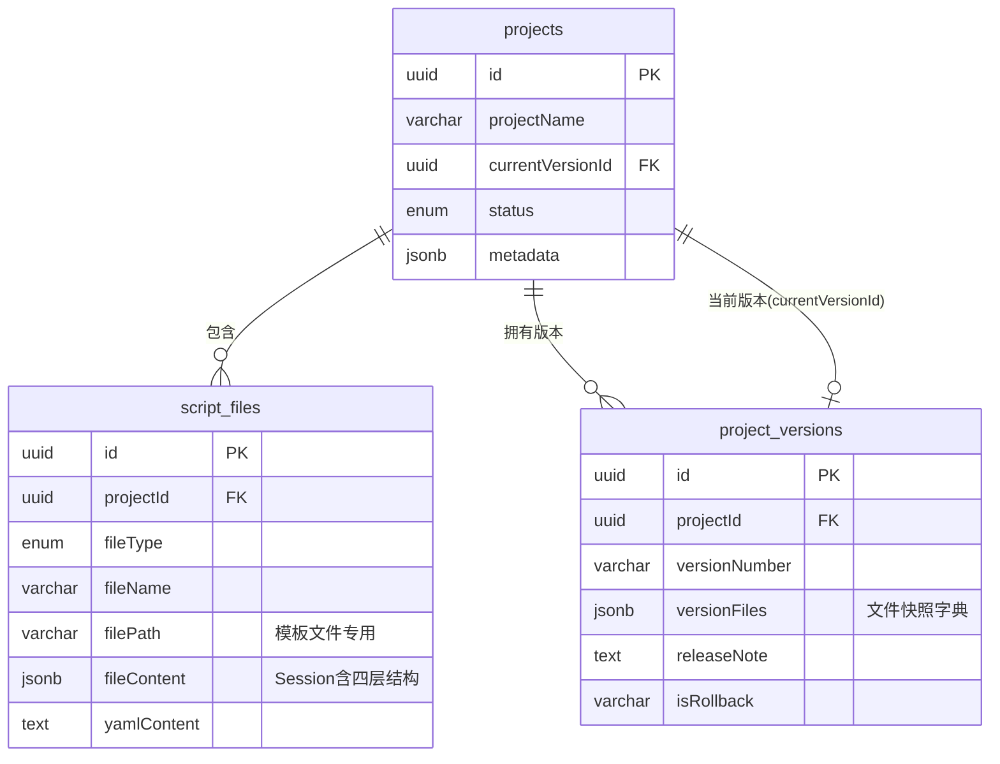
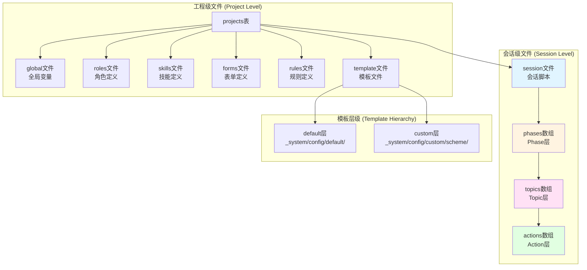
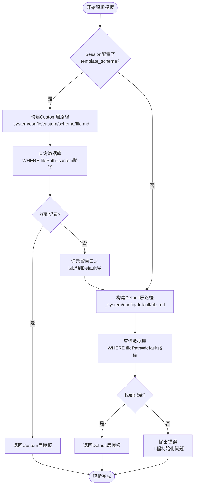
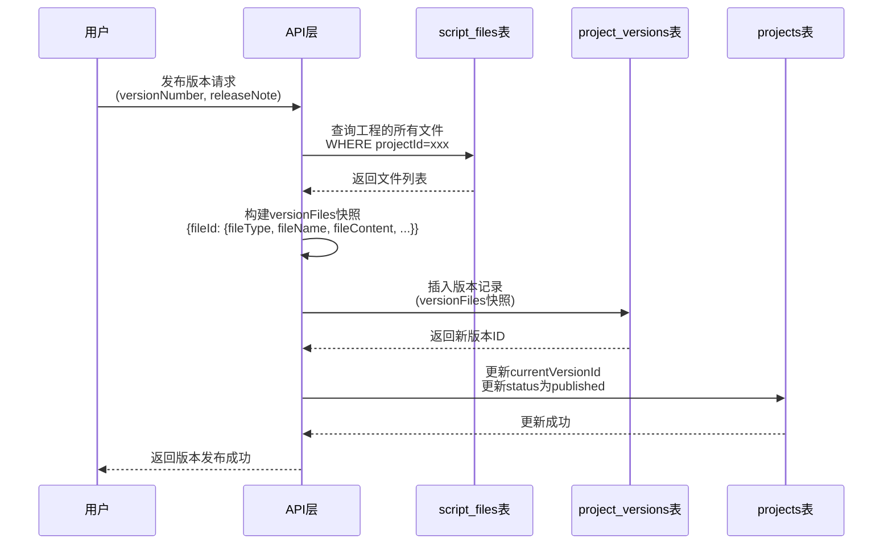

# Story 0.1 需求分析设计文档

## 故事概述

**Story编号**: 0.1  
**Story名称**: 脚本工程数据库Schema与四层脚本目录语义统一  
**优先级**: P0 - 高  
**Story来源**: `docs/product/productbacklog.md` (24-42行)

**Story描述**: 作为平台架构师,我需要将脚本工程(Project)+脚本文件(script_files)+版本(project_versions)的数据库Schema与四层脚本目录语义(Session/Phase/Topic/Action+模板目录)统一起来,确保脚本工程可以作为多用户共享的数据库资源稳定演进。

## 业务目标

### 核心价值

1. **唯一真相源确立**: 将数据库作为脚本工程的唯一真相源,彻底替代磁盘目录结构依赖
   - ⚠️ **设计与实现不一致**: 当前系统仍依赖`workspace/projects/`物理目录结构
   - 现状: `ProjectInitializer`创建工程时会初始化物理目录和模板文件
   - 现状: `SessionManager.syncTemplatesToDisk()`在会话初始化时将数据库模板同步回磁盘
   - 原因: `TemplateResolver`(core-engine)仍然从磁盘读取模板,未完全数据库化
   - **架构决策需要**: 明确workspace物理目录的定位(临时兼容 vs 长期保留)
2. **多用户共享能力**: 使脚本工程能够在数据库层面被多个用户安全共享和协作
3. **版本化稳定性**: 通过版本快照机制确保脚本工程在演进过程中的稳定性和可回溯性
4. **架构清晰化**: 明确三张核心表(projects、script_files、project_versions)在脚本仓库中的职责边界

### 业务场景

1. **脚本工程创建**: 系统初始化工程时,需要明确在数据库中创建哪些类型的文件记录
2. **会话脚本执行**: 引擎执行Session时,需要从数据库正确加载Session/Phase/Topic/Action层级结构
3. **模板解析**: AI Action执行时,需要通过虚拟路径从数据库加载正确的模板文件
4. **版本发布**: 工程发布版本时,需要准确快照所有相关文件到版本记录中
5. **版本切换**: 用户切换版本时,需要从版本快照准确恢复所有文件状态

## 当前系统分析

### 现有数据库Schema

#### 1. projects表 (工程表)

| 字段             | 类型         | 职责                                          |
| ---------------- | ------------ | --------------------------------------------- |
| id               | uuid         | 工程唯一标识                                  |
| projectName      | varchar(255) | 工程名称                                      |
| description      | text         | 工程描述                                      |
| engineVersion    | varchar(50)  | 引擎版本                                      |
| engineVersionMin | varchar(50)  | 最小引擎版本                                  |
| currentVersionId | uuid         | 当前激活版本ID                                |
| status           | enum         | 工程状态(draft/published/archived/deprecated) |
| author           | varchar(255) | 作者                                          |
| tags             | jsonb        | 标签数组                                      |
| metadata         | jsonb        | 元数据                                        |
| createdAt        | timestamp    | 创建时间                                      |
| updatedAt        | timestamp    | 更新时间                                      |

**现状分析**:

- 职责清晰: 作为工程级元信息容器
- 缺失点: 未文档化说明其与四层脚本结构的关系

#### 2. script_files表 (脚本文件表)

| 字段        | 类型         | 职责               |
| ----------- | ------------ | ------------------ |
| id          | uuid         | 文件唯一标识       |
| projectId   | uuid         | 所属工程ID(外键)   |
| fileType    | enum         | 文件类型枚举       |
| fileName    | varchar(255) | 文件名             |
| filePath    | varchar(512) | 虚拟路径(可选)     |
| fileContent | jsonb        | 文件内容           |
| yamlContent | text         | YAML原始内容(可选) |
| createdAt   | timestamp    | 创建时间           |
| updatedAt   | timestamp    | 更新时间           |

**fileType枚举值**:

- `global`: 全局变量文件
- `roles`: 角色定义文件
- `skills`: 技能定义文件
- `forms`: 表单定义文件
- `rules`: 规则定义文件
- `session`: 会话脚本文件
- `template`: 模板文件

**现状分析**:

- 已支持多种文件类型,但缺少明确的语义映射规范
- `filePath`字段已用于模板文件虚拟路径,但未系统化文档化
- Session脚本文件存储了完整的四层结构(Phase/Topic/Action),但这种映射关系未明确定义

#### 3. project_versions表 (工程版本表)

| 字段                  | 类型         | 职责             |
| --------------------- | ------------ | ---------------- |
| id                    | uuid         | 版本唯一标识     |
| projectId             | uuid         | 所属工程ID(外键) |
| versionNumber         | varchar(32)  | 版本号           |
| versionFiles          | jsonb        | 版本文件快照     |
| releaseNote           | text         | 发布说明         |
| isRollback            | varchar(10)  | 是否回滚版本     |
| rollbackFromVersionId | uuid         | 回滚源版本ID     |
| publishedAt           | timestamp    | 发布时间         |
| publishedBy           | varchar(255) | 发布人           |

**versionFiles结构** (根据代码分析):

```
{
  "<fileId>": {
    "fileType": "session | global | template | ...",
    "fileName": "xxx.yaml",
    "fileContent": { ... },
    "yamlContent": "...",
    "filePath": "..."  // 模板文件特有
  },
  ...
}
```

**现状分析**:

- 版本快照机制已实现,但快照内容的结构未文档化
- 缺少明确的快照覆盖范围规范(哪些fileType必须包含)

### 四层脚本目录语义

根据代码分析,当前系统实际运行的脚本结构为:

#### Session层 (会话脚本)

**数据库映射**:

- 存储位置: `script_files`表
- fileType: `session`
- fileContent结构:
  ```
  {
    "metadata": { ... },
    "session": {
      "session_id": "...",
      "session_name": "...",
      "template_scheme": "...",  // 可选,模板方案名称
      "phases": [ ... ]
    }
  }
  ```

#### Phase层 (阶段)

**数据库映射**:

- 存储位置: Session文件的`session.phases`数组
- 结构:
  ```
  {
    "phase_id": "...",
    "phase_name": "...",
    "phase_goal": "...",
    "topics": [ ... ]
  }
  ```

#### Topic层 (话题)

**数据库映射**:

- 存储位置: Phase的`topics`数组
- 结构:
  ```
  {
    "topic_id": "...",
    "topic_name": "...",
    "topic_goal": "...",
    "actions": [ ... ]
  }
  ```

#### Action层 (动作)

**数据库映射**:

- 存储位置: Topic的`actions`数组
- 结构:
  ```
  {
    "action_id": "...",
    "action_type": "ai_say | ai_ask | ...",
    "config": { ... }
  }
  ```

### 模板目录结构

#### 虚拟路径约定 (已实现)

**Default层**:

- 路径格式: `_system/config/default/{templateFileName}`
- 示例: `_system/config/default/ai_ask_v1.md`
- 数据库存储:
  - fileType: `template`
  - fileName: `ai_ask_v1.md`
  - filePath: `_system/config/default/ai_ask_v1.md`

**Custom层**:

- 路径格式: `_system/config/custom/{scheme}/{templateFileName}`
- 示例: `_system/config/custom/crisis_intervention/ai_ask_v1.md`
- 数据库存储:
  - fileType: `template`
  - fileName: `ai_ask_v1.md`
  - filePath: `_system/config/custom/crisis_intervention/ai_ask_v1.md`

#### 模板解析优先级

1. 如果Session配置了`template_scheme`,优先查找Custom层模板
2. Custom层不存在时,回退到Default层
3. Default层也不存在时,抛出错误

### 问题识别

通过分析现有系统,识别出以下需要明确的问题:

1. **文档缺失**:
   - `fileType`各枚举值与脚本层级/文件职责的映射关系未文档化
   - `filePath`虚拟路径约定仅在注释中说明,缺少系统化规范
   - 版本快照`versionFiles`的结构和覆盖范围未明确

2. **概念模糊**:
   - "四层脚本结构"中Session存储为单个文件,内部嵌套Phase/Topic/Action,这种"文件-层级"关系需要明确
   - 全局文件(global)、角色(roles)、技能(skills)等与四层结构的关系需要定义

3. **验证缺失**:
   - 缺少对工程完整性的验证机制(必须包含哪些fileType)
   - 缺少对虚拟路径格式的校验规则

4. **架构不一致** (新增):
   - 数据库与物理目录的双重真相源问题
   - `workspace/projects/`物理目录仍在使用,与"数据库唯一真相源"目标冲突
   - `TemplateResolver`依赖磁盘路径,导致必须维护`syncTemplatesToDisk()`临时方案
   - 工程创建、版本切换等操作同时操作数据库和磁盘,增加复杂度和一致性风险

## 需求定义

### 功能需求

#### FR1: 数据库Schema职责边界文档化

**需求描述**: 明确projects、script_files、project_versions三张表在脚本仓库中的职责定位和关系。

**验收标准**:

- 形成一份清晰的数据表职责映射文档
- 文档包含三张表的职责边界说明
- 文档包含表之间的关系图(ER图或Mermaid图)
- 文档说明每个表在脚本工程生命周期中的作用

#### FR2: fileType与脚本层级/文件职责映射规范

**需求描述**: 规范`script_files.fileType`枚举值与脚本层级/文件职责的映射关系。

**fileType语义定义**:

| fileType | 职责定义                       | 层级映射  | 文件数量 | 必需性                  |
| -------- | ------------------------------ | --------- | -------- | ----------------------- |
| global   | 全局变量定义文件               | 工程级    | 0-1个    | 推荐                    |
| roles    | AI角色定义文件                 | 工程级    | 0-N个    | 可选                    |
| skills   | 技能/技术定义文件              | 工程级    | 0-N个    | 可选                    |
| forms    | 表单/量表定义文件              | 工程级    | 0-N个    | 可选                    |
| rules    | 规则/约束定义文件              | 工程级    | 0-N个    | 可选                    |
| session  | 会话脚本文件(包含完整四层结构) | Session级 | 1-N个    | 必需至少1个             |
| template | 模板文件(AI Prompt模板)        | 工程级    | N个      | 必需(至少包含default层) |

**Session文件内部结构**:

- Session文件通过`fileContent`的JSON结构体现四层嵌套:
  - 第1层: Session元数据
  - 第2层: Phases数组
  - 第3层: Topics数组(嵌套在Phase中)
  - 第4层: Actions数组(嵌套在Topic中)

**验收标准**:

- 每个fileType有明确的职责定义
- 明确哪些fileType是工程级配置,哪些是会话级脚本
- 定义各fileType的数量约束和必需性规则
- 说明Session文件内部如何体现四层结构

#### FR3: filePath虚拟路径约定统一规范

**需求描述**: 统一`script_files.filePath`虚拟路径的命名约定和使用规则。

**虚拟路径规范**:

| 文件类型             | filePath规则                                | 示例                                                     | 说明                      |
| -------------------- | ------------------------------------------- | -------------------------------------------------------- | ------------------------- |
| global               | 不使用(NULL)                                | -                                                        | 全局文件不需要虚拟路径    |
| roles                | 不使用(NULL)                                | -                                                        | 角色文件不需要虚拟路径    |
| skills               | 不使用(NULL)                                | -                                                        | 技能文件不需要虚拟路径    |
| forms                | 不使用(NULL)                                | -                                                        | 表单文件不需要虚拟路径    |
| rules                | 不使用(NULL)                                | -                                                        | 规则文件不需要虚拟路径    |
| session              | 不使用(NULL)                                | -                                                        | Session文件不需要虚拟路径 |
| template (default层) | `_system/config/default/{fileName}`         | `_system/config/default/ai_ask_v1.md`                    | 系统默认模板              |
| template (custom层)  | `_system/config/custom/{scheme}/{fileName}` | `_system/config/custom/crisis_intervention/ai_ask_v1.md` | 自定义方案模板            |

**路径组成规则**:

- Default层: `_system/config/default/` + `{模板文件名}`
- Custom层: `_system/config/custom/` + `{方案名称}/` + `{模板文件名}`
- 方案名称: 小写字母、数字、下划线,长度1-50字符
- 模板文件名: 遵循系统模板命名约定(如ai_ask_v1.md)

**验收标准**:

- 明确哪些fileType需要使用filePath,哪些不需要
- 定义模板文件的虚拟路径格式规范
- 提供路径格式校验规则
- 说明虚拟路径与物理路径的解耦关系

#### FR4: 版本化策略明确

**需求描述**: 明确Session/Phase/Topic/Action及模板文件在`project_versions.versionFiles`中的快照结构和覆盖范围。

**版本快照结构规范**:

```
versionFiles: {
  "<file_id_1>": {
    "fileType": "session",
    "fileName": "cbt_assessment.yaml",
    "fileContent": { /* 完整的Session JSON,包含phases/topics/actions */ },
    "yamlContent": "session:\n  session_id: ...",
    "filePath": null
  },
  "<file_id_2>": {
    "fileType": "global",
    "fileName": "global.yaml",
    "fileContent": { /* 全局变量定义 */ },
    "yamlContent": "...",
    "filePath": null
  },
  "<file_id_3>": {
    "fileType": "template",
    "fileName": "ai_ask_v1.md",
    "fileContent": { "content": "..." },
    "filePath": "_system/config/default/ai_ask_v1.md",
    "yamlContent": null
  },
  ...
}
```

**快照覆盖范围**:

- 必须包含: 所有`session`类型文件
- 必须包含: 所有`template`类型文件
- 应当包含: `global`类型文件(如果存在)
- 可选包含: `roles`、`skills`、`forms`、`rules`文件

**版本快照与四层结构关系**:

- Session文件的快照包含了完整的Phase/Topic/Action结构
- Phase/Topic/Action不需要单独快照,它们作为Session fileContent的一部分被整体快照
- 模板文件独立快照,因为它们被多个Action引用

**验收标准**:

- 定义`versionFiles`的JSON结构规范
- 明确哪些fileType必须被快照,哪些可选
- 说明快照如何保存四层脚本结构
- 定义版本快照的完整性校验规则

### 非功能需求

#### NFR1: 文档可读性

- 使用Mermaid图表辅助说明表关系和数据流
- 提供清晰的示例数据
- 使用表格形式组织枚举值映射关系

#### NFR2: 向后兼容性

- 所有规范基于现有数据库Schema,不引入破坏性变更
- 规范应描述现有系统已实现的部分和待完善的部分

#### NFR3: 可验证性

- 每个规范项应可通过数据库查询或API调用验证
- 提供验证示例查询或伪代码

## 架构决策

### 决策1: workspace物理目录的定位

**问题**: 当前系统同时维护数据库和`workspace/projects/`物理目录,与"数据库唯一真相源"目标冲突。

**现状分析**:

- `ProjectInitializer`: 创建工程时初始化物理目录结构
- `SessionManager.syncTemplatesToDisk()`: 会话初始化时将数据库模板同步到磁盘
- `TemplateResolver` (core-engine): 从磁盘路径读取模板文件
- `import-disk-templates-to-db.ts`: 提供磁盘→数据库的迁移工具
- 环境变量`PROJECTS_WORKSPACE`: 可配置workspace路径

**决策选项**:

**选项A: 保留workspace作为临时缓存层** (推荐)

- 定位: workspace作为数据库的物理缓存,非真相源
- 职责: 仅用于兼容尚未数据库化的组件(如TemplateResolver)
- 生命周期: 待core-engine完全数据库化后废弃
- 优点: 渐进式演进,风险低,不阻塞当前Story
- 缺点: 短期内仍需维护双层存储

**选项B: 立即废弃workspace** (不推荐)

- 要求: 必须先完成core-engine的`TemplateResolver`数据库化改造
- 影响: 阻塞当前Story,需要跨包大规模重构
- 风险: 高,可能引入回归问题

**决策**: 采用**选项A**

- workspace定位为"临时兼容层",不计入架构规范
- 本Story文档化时明确标注workspace的临时性质
- 将workspace废弃作为独立Story列入后续规划

### 决策2: 文档化范围

**决策**: 本Story仅文档化数据库Schema职责边界,workspace相关逻辑标注为"待废弃"。

**文档化内容**:

1. 三张数据库表的职责定位(已实现)
2. fileType映射规范(已实现)
3. filePath虚拟路径约定(已实现)
4. 版本快照机制(已实现)

**不文档化内容**:

1. workspace物理目录结构(临时方案,待废弃)
2. `ProjectInitializer`的磁盘操作逻辑(待重构)
3. `syncTemplatesToDisk`机制(临时兼容方案)

## 设计方案

### 数据表职责定位

#### projects表 - 工程元信息容器

**职责定位**:

- 存储工程级元数据(名称、描述、作者、标签等)
- 管理工程状态生命周期(draft → published → archived)
- 维护工程与版本的关联(currentVersionId)
- 定义工程的引擎兼容性要求

**不负责**:

- 不存储具体的脚本内容(由script_files负责)
- 不存储版本快照(由project_versions负责)
- 不关心脚本的内部结构(Phase/Topic/Action)

**与四层结构的关系**:

- projects表是整个脚本工程的顶层容器
- 一个project可以包含多个session文件
- 每个session文件内部包含完整的Phase/Topic/Action四层结构

#### script_files表 - 脚本内容存储层

**职责定位**:

- 存储工程的所有文件内容(会话脚本、全局变量、模板等)
- 通过fileType区分不同类型的文件职责
- 为模板文件提供虚拟路径映射(filePath)
- 保留YAML原始内容(yamlContent)用于编辑器展示

**不负责**:

- 不管理工程级元数据(由projects负责)
- 不保存历史版本(由project_versions负责)
- 不执行脚本逻辑(由core-engine负责)

**与四层结构的关系**:

- `fileType=session`的记录存储完整的Session脚本
- Session的`fileContent`字段包含嵌套的phases/topics/actions结构
- 四层结构是Session文件的内部组织形式,不对应独立的数据库记录

#### project_versions表 - 版本快照管理

**职责定位**:

- 快照指定时刻的所有文件状态(versionFiles)
- 记录版本发布元信息(版本号、发布人、发布时间、说明)
- 支持版本回滚追溯(isRollback、rollbackFromVersionId)
- 通过快照实现工程的时间旅行能力

**不负责**:

- 不直接编辑文件内容(通过script_files编辑,然后快照)
- 不管理当前工作区状态(由script_files负责)
- 不执行版本切换逻辑(由API层负责)

**与四层结构的关系**:

- 版本快照保存整个Session文件(包含其内部的四层结构)
- Phase/Topic/Action作为Session的一部分被整体快照
- 版本切换时,恢复Session文件会同时恢复其内部的四层结构

### 表关系图



**关系说明**:

1. **projects → script_files** (一对多): 一个工程包含多个脚本文件
2. **projects → project_versions** (一对多): 一个工程拥有多个历史版本
3. **projects → project_versions** (一对一,可选): 工程指向当前激活的版本

### 文件类型与层级映射



### 虚拟路径解析流程



### 版本快照机制



### 数据完整性规则

#### 工程创建时的初始文件

**✅ 已实现** (参考: `packages/api-server/src/routes/projects.ts`)

| fileType | 必需性 | 初始内容                                                             | 实现状态  |
| -------- | ------ | -------------------------------------------------------------------- | --------- |
| global   | 推荐   | 创建空的全局变量文件                                                 | ✅ 已实现 |
| template | 必需   | 从`config/prompts`复制系统模板到数据库,filePath设为default层         | ✅ 已实现 |
| session  | 可选   | 根据template参数生成示例Session(blank/cbt-assessment/cbt-counseling) | ✅ 已实现 |

**注**: 工程创建同时会初始化workspace物理目录(临时方案,待废弃)

#### 版本发布时的快照范围

**✅ 已实现** (参考: `packages/api-server/src/routes/versions.ts`)

| fileType | 是否快照 | 原因         | 实现状态                |
| -------- | -------- | ------------ | ----------------------- |
| session  | 必需     | 核心业务逻辑 | ✅ 已实现(快照所有文件) |
| template | 必需     | 影响执行行为 | ✅ 已实现(快照所有文件) |
| global   | 应当     | 影响变量替换 | ✅ 已实现(快照所有文件) |
| roles    | 可选     | 扩展配置     | ✅ 已实现(快照所有文件) |
| skills   | 可选     | 扩展配置     | ✅ 已实现(快照所有文件) |
| forms    | 可选     | 扩展配置     | ✅ 已实现(快照所有文件) |
| rules    | 可选     | 扩展配置     | ✅ 已实现(快照所有文件) |

**实现细节**: `POST /projects/:id/publish`时查询该工程的所有script_files记录,全部纳入versionFiles快照,不区分fileType。

### API数据流验证

#### 验证点1: 工程创建

**API**: `POST /api/projects`

**期望数据流**:

1. 在`projects`表创建工程记录
2. 在`script_files`表创建必需文件:
   - global文件(推荐)
   - default层template文件(必需)
3. 在`project_drafts`表创建草稿记录

**验证查询**:

```
查询工程的所有文件:
SELECT fileType, fileName, filePath
FROM script_files
WHERE projectId = '<project_id>'
ORDER BY fileType;

期望结果:
- 至少包含fileType='template'且filePath以'_system/config/default/'开头的记录
- 可能包含fileType='global'的记录
```

#### 验证点2: Session加载

**API**: `POST /api/sessions`

**期望数据流**:

1. 根据scriptId查询`script_files`表,获取`fileType='session'`的记录
2. 解析`fileContent`,提取session.phases数组
3. 初始化执行位置(phaseIndex=0, topicIndex=0, actionIndex=0)

**验证查询**:

```
查询Session文件结构:
SELECT fileContent->'session'->'phases' as phases
FROM script_files
WHERE id = '<script_id>' AND fileType = 'session';

期望结果:
- fileContent包含完整的session对象
- session.phases是数组,每个phase包含topics数组
- 每个topic包含actions数组
```

#### 验证点3: 模板解析

**API**: 内部调用 `TemplateResolver.resolveTemplate()`

**期望数据流**:

1. 从Session配置读取`template_scheme`(可选)
2. 构建虚拟路径(custom层或default层)
3. 查询`script_files`表,WHERE `filePath = <虚拟路径>`

**验证查询**:

```
场景1: 使用默认模板
SELECT filePath, fileContent
FROM script_files
WHERE projectId = '<project_id>'
  AND fileType = 'template'
  AND filePath = '_system/config/default/ai_ask_v1.md';

场景2: 使用自定义方案
SELECT filePath, fileContent
FROM script_files
WHERE projectId = '<project_id>'
  AND fileType = 'template'
  AND filePath = '_system/config/custom/crisis_intervention/ai_ask_v1.md';
```

#### 验证点4: 版本发布

**API**: `POST /api/projects/:id/publish`

**期望数据流**:

1. 查询`script_files`表,获取工程所有文件
2. 构建`versionFiles`快照字典
3. 插入`project_versions`表
4. 更新`projects.currentVersionId`

**验证查询**:

```
查询版本快照内容:
SELECT
  versionNumber,
  jsonb_object_keys(versionFiles) as file_ids,
  versionFiles->>'<file_id>'->>'fileType' as file_type
FROM project_versions
WHERE id = '<version_id>';

期望结果:
- versionFiles包含所有session类型文件
- versionFiles包含所有template类型文件
- 每个文件快照包含完整的fileContent
```

## 验收标准

### AC1: 数据库Schema文档化

- [x] **已完成**: 完成三张表(projects、script_files、project_versions)的职责边界说明文档
- [x] **已完成**: 文档包含表关系的Mermaid ER图
- [x] **已完成**: 文档说明每个表在脚本工程生命周期中的作用
- [ ] **待完成**: 文档发布到`docs/design/`目录(需将本设计文档输出为正式文档)

### AC2: fileType语义映射规范

- [x] **已完成**: 完成fileType枚举值与文件职责的映射表
- [x] **已完成**: 明确哪些fileType是工程级,哪些是会话级
- [x] **已完成**: 定义各fileType的数量约束(必需/可选)
- [x] **已完成**: 说明Session文件如何体现四层结构(Phase/Topic/Action)

### AC3: filePath虚拟路径规范

- [x] **已完成**: 完成filePath使用规则文档
- [x] **已完成**: 明确模板文件的default层和custom层路径格式
- [x] **已完成**: 定义路径格式校验规则(正则表达式或描述)
- [x] **已完成**: 说明其他fileType不使用filePath的原因

### AC4: 版本快照结构规范

- [x] **已完成**: 完成`versionFiles`的JSON结构规范文档
- [x] **已完成**: 明确哪些fileType必须被快照,哪些可选(实际快照所有文件)
- [x] **已完成**: 说明快照如何保存四层脚本结构(作为Session的一部分)
- [x] **已完成**: 提供版本快照的示例数据

### AC5: API依赖数据库验证

- [x] **部分完成**: 脚本工程API主要依赖数据库,但模板解析仍需临时磁盘同步
- [x] **已完成**: 工程创建、Session加载、版本发布等流程已数据库化
- [x] **已完成**: 提供了4个关键场景的数据库查询验证示例
- [ ] **待完成**: 完全移除磁盘依赖需core-engine的TemplateResolver数据库化(后续Story)

### AC6: 示例工程验证

- [x] **已完成**: 系统已有多个示例工程可通过数据库加载与执行
- [x] **已完成**: 示例工程包含完整的session/template/global文件
- [x] **已完成**: 会话可正常创建并执行
- ⚠️ **注意**: 当前仍需workspace物理目录作为临时缓存(待TemplateResolver重构后移除)

## 实施计划

### 阶段1: 文档输出 (本Story范围)

- [x] **已完成**: 需求分析设计文档(本文档)
- [ ] **待完成**: 将设计方案输出为正式文档发布到`docs/design/story-0.1-schema-semantic-unification.md`
- [ ] **待完成**: 在文档中明确标注workspace相关内容为"临时方案,待废弃"

### 阶段2: workspace废弃规划 (后续Story)

**不在本Story范围内,建议作为独立Story:**

1. **Story 0.2**: core-engine的DatabaseTemplateProvider完全替代磁盘读取
   - 重构`TemplateResolver`使用`DatabaseTemplateProvider`
   - 移除`syncTemplatesToDisk()`临时方案
   - 移除`ProjectInitializer`的磁盘目录创建逻辑

2. **Story 0.3**: 清理workspace依赖
   - 移除`PROJECTS_WORKSPACE`环境变量
   - 删除workspace物理目录
   - 更新相关文档和测试

## 技术约束

### 约束1: 不引入新表或字段

- ✅ **已满足**: 本Story仅进行Schema文档化和规范制定
- ✅ **已满足**: 不修改现有数据库表结构
- ✅ **已满足**: 不添加新的枚举值或字段

### 约束2: 保持向后兼容

- ✅ **已满足**: 所有规范基于现有系统已实现的机制
- ✅ **已满足**: 文档化现有约定,未创造新约定
- ✅ **已满足**: 发现的workspace不一致问题已标记为待改进项

### 约束3: 基于现有技术栈

- ✅ **已满足**: 数据库PostgreSQL 16
- ✅ **已满足**: ORM使用Drizzle ORM
- ✅ **已满足**: 未引入新的数据库扩展或特性

### 约束4: 不阻塞现有功能 (新增)

- ✅ **已满足**: 保留workspace临时方案,不破坏现有功能
- ✅ **已满足**: 文档明确标注临时性质,为后续重构铺路

## 风险与缓解

### 风险1: 现有代码与规范不一致 ✅ 已缓解

**描述**: workspace物理目录与"数据库唯一真相源"目标不一致

**影响**: 中等

**实际情况**: ✅ 已识别并决策

- 已明确workspace为临时兼容层,非架构目标
- 在文档中明确标注workspace的待废弃性质
- 将workspace废弃列为后续Story规划

### 风险2: 四层结构理解歧义 ✅ 已缓解

**描述**: 对于"四层结构"的理解可能存在歧义(是否每层对应独立表记录)

**影响**: 高

**缓解措施**: ✅ 已实施

- ✅ 文档明确说明: Session/Phase/Topic/Action是单个Session文件的内部JSON结构
- ✅ 提供了代码示例和数据示例
- ✅ 绘制了数据结构层级图

### 风险3: 版本快照覆盖范围争议 ✅ 已缓解

**描述**: 对于哪些fileType应该被快照可能存在不同意见

**影响**: 低

**实际情况**: ✅ 已明确

- 现有实现: 快照所有script_files,不区分fileType
- 文档已基于实际代码明确此规范
- 未发现争议或需改进的点

## 成功标准

本Story成功完成的标志:

1. **文档完整性**:
   - 产出完整的Schema职责边界文档
   - 包含清晰的映射表、流程图和示例数据

2. **可验证性**:
   - 每个规范项都可通过数据库查询验证
   - 提供至少3个关键场景的验证查询示例

3. **团队共识**:
   - 开发团队对三张表的职责边界达成共识
   - 对fileType映射关系、filePath约定、版本快照机制达成共识

4. **示例验证**:
   - 至少1个完整的示例工程可通过数据库完全加载和执行
   - 验证覆盖工程创建、Session执行、模板解析、版本发布等关键流程

## 参考资料

### 相关文档

- `docs/product/productbacklog.md`: Story来源
- `packages/api-server/src/db/schema.ts`: 数据库Schema定义
- `_system/README.md`: 模板系统两层机制说明
- `packages/core-engine/src/engines/prompt-template/template-resolver.ts`: 模板解析实现

### 相关代码

- `packages/api-server/src/routes/projects.ts`: 工程API实现
- `packages/api-server/src/routes/versions.ts`: 版本API实现
- `packages/api-server/src/services/project-initializer.ts`: 工程初始化逻辑
- `packages/api-server/src/services/database-template-provider.ts`: 数据库模板提供器

### 数据库表

- `projects`: 工程元信息
- `script_files`: 脚本文件存储
- `project_versions`: 版本快照管理
