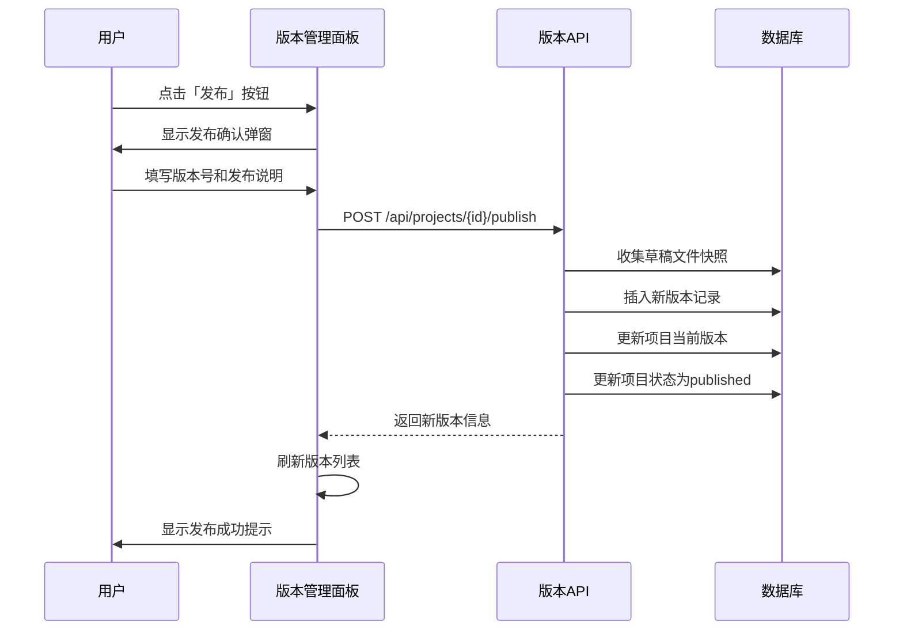
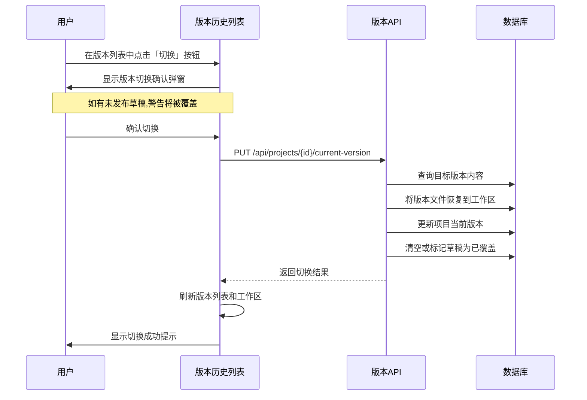
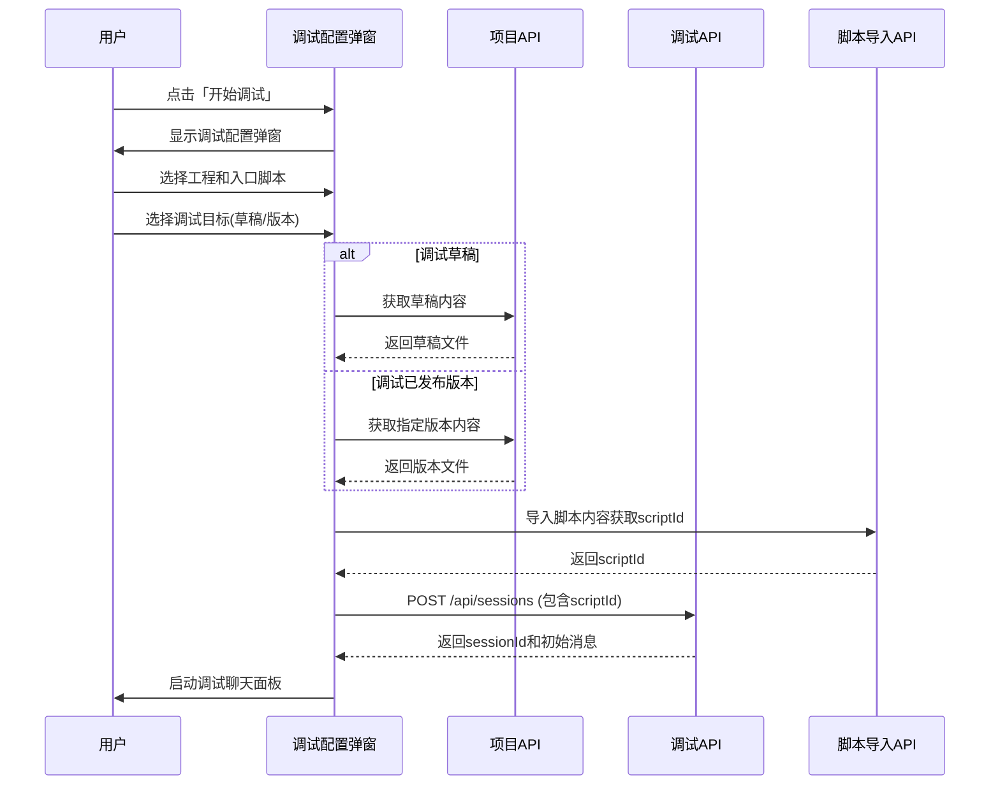
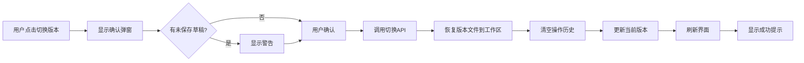
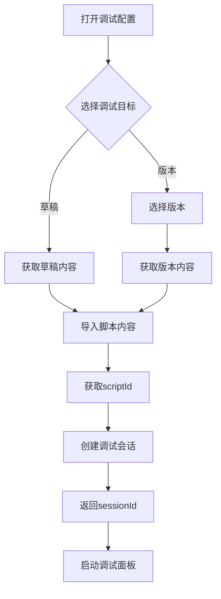

# 脚本编辑器核心能力实现设计

## 设计概述

本设计文档基于 `script_editor_core_plan.md` 中 P1-T3 和 P1-T4 任务目标,定义脚本编辑器版本发布、回滚操作以及调试版本选择功能的实现方案。该设计专注于**工程版本管理与调试流程的集成**,确保用户能够明确地在草稿和已发布版本之间切换,并选择合适的版本进行调试。

**设计范围**:
- 版本发布:从草稿发布新版本
- 版本回滚:从历史版本回滚到指定版本
- 调试版本选择:在调试时选择草稿或已发布版本

**不包含**:
- 版本比对详细差异可视化
- 复杂的发布审批流程
- 版本标签和注释的高级编辑

---

## 业务目标与价值

### 业务目标

1. **版本发布管理**:使用户能够将当前工作区的草稿内容固化为已发布版本,支持版本历史追溯
2. **版本回滚能力**:允许用户回滚到历史任意版本,快速恢复到已知稳定状态
3. **调试版本隔离**:提供调试目标选择机制,支持对草稿和已发布版本分别进行调试测试

### 用户价值

- **开发安全性**:草稿修改不会影响已发布版本,提供安全的开发试验空间
- **问题定位**:可选择特定版本进行调试,快速定位问题引入的版本节点
- **快速回滚**:遇到问题时可立即回滚到稳定版本,减少故障影响时间
- **版本溯源**:完整的版本发布历史,便于团队协作和变更追踪

---

## 功能设计

### 1. 版本发布功能

**✅ 实现状态:已实现**
- 后端API:`POST /api/projects/{id}/publish`(已实现)
- 前端组件:`ProjectEditor`中`handlePublish`方法(已实现)
- 发布弹窗:`Modal`组件(已实现,位于ProjectEditor 2317-2347行)

#### 功能描述

用户在编辑器中完成脚本修改后,可通过「发布」按钮将当前草稿内容发布为新版本。发布操作将:
- 收集工作区所有文件的当前状态作为版本快照
- 自动递增版本号
- 记录发布时间和发布人信息
- 将新版本设置为当前工程的活动版本
- 清空草稿状态标记

#### 交互流程



#### 数据模型

**发布请求参数**:

| 字段 | 类型 | 必填 | 说明 |
|------|------|------|------|
| versionNumber | string | 是 | 版本号,如 v1.0.0 |
| releaseNote | string | 是 | 发布说明 |
| publishedBy | string | 是 | 发布人标识 |

**版本记录结构**:

| 字段 | 类型 | 说明 |
|------|------|------|
| id | UUID | 版本唯一标识 |
| projectId | UUID | 所属工程ID |
| versionNumber | string | 版本号 |
| versionFiles | JSON | 文件快照 |
| releaseNote | text | 发布说明 |
| isRollback | string | 是否为回滚版本 |
| rollbackFromVersionId | UUID | 回滚源版本ID |
| publishedAt | timestamp | 发布时间 |
| publishedBy | string | 发布人 |

#### UI设计要点

**版本管理面板布局**:
- 位于编辑器右侧固定面板,宽度400px
- 顶部显示「版本管理」标题和关闭按钮
- 分为三个区域:当前版本信息、草稿状态、版本历史列表

**发布按钮位置**:
- 出现在「草稿状态」区域,当检测到草稿存在时启用
- 按钮文案:「发布新版本」
- 点击后弹出发布配置对话框

**发布确认弹窗**:
- 包含版本号输入框(默认建议自动递增版本号)
- 发布说明多行文本框(必填)
- 确认和取消按钮

#### 业务规则

1. **发布前置条件**:
   - 工程必须存在草稿内容
   - 草稿验证状态不为严重错误

2. **版本号规则**:
   - 建议遵循语义化版本规范(如 v1.0.0, v1.1.0)
   - 系统不强制版本号格式,由用户自行管理

3. **发布后状态变更**:
   - 项目 currentVersionId 更新为新版本ID
   - 项目状态(status)更新为 published
   - 草稿仍保留在数据库中,但被视为「已发布」状态

4. **发布失败处理**:
   - 网络错误:显示错误提示,允许重试
   - 验证错误:显示具体错误原因,阻止发布
   - 并发冲突:提示有其他用户同时发布,要求重新加载

---

### 2. 版本回滚功能

#### 功能描述

用户可从版本历史列表中选择任意已发布版本,执行回滚操作。回滚操作将:
- 将目标版本的文件快照恢复到工作区
- 创建新的回滚版本记录(携带回滚标记)
- 更新当前版本为新创建的回滚版本
- 删除工作区中不在目标版本中的文件

#### 交互流程



注:当前实现中,「切换」操作实际上等同于「回滚」,即创建新的回滚版本并恢复文件状态。

#### 数据模型

**回滚请求参数**:

| 字段 | 类型 | 必填 | 说明 |
|------|------|------|------|
| versionId | UUID | 是 | 目标版本ID |

**版本切换(回滚)响应**:

| 字段 | 类型 | 说明 |
|------|------|------|
| success | boolean | 操作是否成功 |
| data | object | 更新后的项目信息 |
| data.currentVersionId | UUID | 当前版本ID |
| data.previousVersionId | UUID | 切换前的版本ID |

#### UI设计要点

**版本列表项布局**:
- 每个版本显示:版本号、发布时间、发布人、发布说明
- 当前版本标记绿色「当前」标签
- 回滚版本标记橙色「回滚」标签并显示回滚源版本号
- 非当前版本显示「切换」按钮

**回滚确认弹窗**:
- 标题:「切换版本」或「工作区有未发布的修改」
- 内容:警告切换将覆盖当前工作区所有修改,且无法撤销
- 危险操作使用红色确认按钮

#### 业务规则

1. **回滚前置条件**:
   - 目标版本必须存在
   - 目标版本不能是当前版本

2. **未保存草稿警告**:
   - 如果工作区有未发布的草稿,显示危险警告
   - 用户必须明确确认才能继续

3. **文件恢复策略**:
   - 恢复目标版本的所有文件到工作区
   - 删除工作区中存在但目标版本中不存在的文件
   - 更新项目文件列表以匹配目标版本

4. **版本创建策略**:
   - 当前实现中,回滚操作创建新版本而非直接切换
   - 新版本标记为 isRollback='true'
   - 版本号自动递增,不复用历史版本号

5. **操作历史管理**:
   - 版本切换后立即清空 undo/redo 操作历史栈
   - 防止跨版本的操作历史导致数据不一致

---

### 3. 调试版本选择功能

#### 功能描述

在发起调试会话前,用户可选择调试目标:
- **调试草稿**:使用当前工作区的草稿内容进行调试
- **调试已发布版本**:选择特定已发布版本进行调试(只读)

调试版本选择使开发者能够:
- 在修改过程中测试草稿内容
- 验证已发布版本的行为
- 对比不同版本的执行差异

#### 交互流程



#### 数据模型

**调试配置扩展**:

| 字段 | 类型 | 必填 | 说明 |
|------|------|------|------|
| userId | string | 是 | 用户标识 |
| projectId | UUID | 是 | 工程ID |
| sessionFileId | UUID | 是 | 入口会话脚本ID |
| debugTarget | object | 是 | 调试目标配置 |
| debugTarget.type | enum | 是 | draft(草稿) 或 version(版本) |
| debugTarget.versionId | UUID | 条件必填 | type为version时必填 |

**调试会话创建请求**:

| 字段 | 类型 | 必填 | 说明 |
|------|------|------|------|
| userId | string | 是 | 用户标识 |
| scriptId | UUID | 是 | 导入后的脚本ID |
| initialVariables | object | 否 | 初始变量 |

#### UI设计要点

**调试配置弹窗扩展**:
- 新增「调试目标」选择区域,位于入口脚本选择下方
- 使用单选按钮组:「调试草稿」和「调试已发布版本」
- 默认选中「调试草稿」
- 选择「调试已发布版本」时,显示版本下拉选择器
- 版本选择器展示:版本号、发布时间(标记当前版本)

**版本选择器设计**:
- 下拉列表按发布时间倒序排列
- 当前版本显示绿色「当前」标签
- 每项显示:版本号 + 发布时间
- 支持搜索过滤版本号

**调试面板标识**:
- 调试会话启动后,在标题栏显示调试目标信息
- 草稿调试:「调试草稿 - [工程名称]」
- 版本调试:「调试版本 [版本号] - [工程名称]」(只读标识)

#### 业务规则

1. **调试目标选择规则**:
   - 默认使用草稿进行调试
   - 如果工程没有已发布版本,禁用「调试已发布版本」选项
   - 如果工程没有草稿且有已发布版本,默认选择当前版本调试

2. **脚本导入策略**:
   - 无论选择草稿还是版本,都需通过脚本导入API将内容导入并获取scriptId
   - 脚本导入是临时性的,仅用于当前调试会话
   - 同一脚本内容可能被多次导入,每次生成新的scriptId

3. **版本只读保护**:
   - 调试已发布版本时,前端仅展示调试结果,不允许修改脚本内容
   - 版本调试的会话独立于工作区,不影响草稿状态

4. **会话管理**:
   - 每次「重新开始调试」操作创建新的调试会话
   - 新会话继承原调试目标配置(草稿/版本选择)
   - 会话ID变更,但调试目标保持一致

5. **错误处理**:
   - 版本不存在或已删除:提示错误并禁用该版本选项
   - 草稿为空:提示无可用草稿内容,建议使用已发布版本
   - 导入失败:显示具体错误原因,允许重新选择或重试

---

## 技术实现要点

### 后端API接口

#### 1. 版本发布接口

**接口路径**: `POST /api/projects/{id}/publish`

**请求体**:
```
{
  versionNumber: string,      // 版本号
  releaseNote: string,        // 发布说明
  publishedBy: string         // 发布人
}
```

**实现逻辑**:
- 查询项目和草稿表,获取草稿文件列表
- 将草稿文件转换为版本文件快照格式
- 插入新版本记录到 project_versions 表
- 更新项目表的 currentVersionId 和 status 字段
- 返回新创建的版本信息

**响应结果**:
```
{
  success: boolean,
  data: {
    id: UUID,
    versionNumber: string,
    publishedAt: timestamp,
    ...
  }
}
```

#### 2. 版本切换(回滚)接口

**接口路径**: `PUT /api/projects/{id}/current-version`

**请求体**:
```
{
  versionId: UUID             // 目标版本ID
}
```

**实现逻辑**:
- 查询目标版本的 versionFiles 内容
- 获取工作区当前所有文件
- 对比并删除工作区中不存在于目标版本的文件
- 恢复或更新目标版本的所有文件到工作区
- 创建新的回滚版本记录(可选,根据策略)
- 更新项目表的 currentVersionId
- 更新草稿表标记为已覆盖或清空

**响应结果**:
```
{
  success: boolean,
  data: {
    currentVersionId: UUID,
    previousVersionId: UUID
  }
}
```

#### 3. 版本列表查询接口

**接口路径**: `GET /api/projects/{id}/versions`

**实现逻辑**:
- 查询项目的所有版本记录,按发布时间倒序排列
- 返回版本基本信息(不包含完整文件内容)

**响应结果**:
```
{
  success: boolean,
  data: [
    {
      id: UUID,
      versionNumber: string,
      releaseNote: string,
      publishedAt: timestamp,
      publishedBy: string,
      isRollback: string,
      rollbackFromVersionId: UUID
    },
    ...
  ]
}
```

#### 4. 调试会话创建接口(已存在)

**接口路径**: `POST /api/sessions`

**请求体**:
```
{
  userId: string,
  scriptId: UUID,               // 导入后的脚本ID
  initialVariables: object      // 可选
}
```

**实现逻辑**:
- 验证 scriptId 是否存在
- 创建会话记录
- 初始化执行引擎并获取首条AI消息
- 返回会话信息和初始消息

**响应结果**:
```
{
  sessionId: UUID,
  status: string,
  aiMessage: string,
  executionStatus: string,
  position: object,
  debugInfo: object
}
```

**注意**: 当前接口不直接支持传递版本信息,版本选择逻辑在前端处理,通过导入相应版本内容获取scriptId后传递给该接口。

### 前端组件交互

#### 1. VersionListPanel 组件

**职责**:
- 展示版本列表和当前版本信息
- 处理版本切换操作
- 显示草稿状态
- 触发版本发布流程

**状态管理**:
- versionList: 版本列表数据
- currentVersionId: 当前版本ID
- draftExists: 是否存在草稿
- switchingVersionId: 正在切换的版本ID(用于loading状态)

**关键方法**:
- loadData(): 加载版本列表和草稿状态
- handleVersionSwitch(versionId): 处理版本切换确认和调用API
- handlePublish(): 触发发布弹窗(待实现)

#### 2. DebugConfigModal 组件

**职责**:
- 配置调试会话参数
- 选择调试目标(草稿/版本)
- 导入脚本并创建调试会话

**扩展功能**:
- 新增 debugTarget 状态:存储调试目标类型和版本ID
- 新增版本选择器组件
- 根据选择的调试目标获取相应内容并导入

**关键方法**:
- handleDebugTargetChange(type, versionId): 处理调试目标选择
- getDebugContent(): 根据调试目标类型获取对应内容
- handleSubmit(): 导入脚本并创建调试会话

#### 3. 版本发布弹窗(待新增)

**组件名称**: PublishVersionModal

**输入属性**:
- visible: 弹窗可见性
- projectId: 当前项目ID
- suggestedVersion: 建议的版本号
- onSuccess: 发布成功回调
- onCancel: 取消回调

**功能**:
- 版本号输入框(带建议值)
- 发布说明多行输入框
- 确认和取消按钮
- 调用发布API并处理结果

### 数据流转

#### 发布流程数据流


#### 回滚流程数据流



#### 调试版本选择数据流



---

## 异常处理与边界场景

### 1. 版本发布异常

| 异常场景 | 原因 | 处理策略 |
|---------|------|---------|
| 草稿为空 | 工作区没有任何修改 | 提示「无可发布内容」,禁用发布按钮 |
| 版本号冲突 | 用户输入的版本号已存在 | 提示错误,要求修改版本号 |
| 网络中断 | 请求失败 | 显示错误提示,允许重试 |
| 并发发布 | 多用户同时发布 | 提示冲突,要求重新加载后再次发布 |
| 数据库错误 | 事务失败 | 显示通用错误,建议联系管理员 |

### 2. 版本回滚异常

| 异常场景 | 原因 | 处理策略 |
|---------|------|---------|
| 目标版本不存在 | 版本已被删除 | 提示版本不存在,刷新版本列表 |
| 回滚到当前版本 | 用户选择当前版本 | 禁用当前版本的切换按钮 |
| 文件恢复失败 | 文件内容损坏或缺失 | 回滚事务,提示错误详情 |
| 操作权限不足 | 用户无回滚权限 | 提示权限不足,联系管理员 |

### 3. 调试版本选择异常

| 异常场景 | 原因 | 处理策略 |
|---------|------|---------|
| 草稿不存在 | 工作区无修改且无版本 | 提示无可用内容,禁用调试 |
| 选择的版本被删除 | 版本在选择后被删除 | 导入失败时提示版本不存在 |
| 脚本导入失败 | 内容格式错误或网络问题 | 显示导入错误详情,允许重选 |
| 会话创建失败 | 后端执行引擎错误 | 显示错误详情,支持重新尝试 |

### 4. 边界场景处理

**场景1:工程无版本历史**
- 版本列表显示空状态提示
- 仅允许调试草稿
- 发布后才能启用版本调试功能

**场景2:工程无草稿**
- 草稿状态区域不显示或显示「无草稿」
- 调试目标默认选择当前版本
- 禁用「调试草稿」选项

**场景3:快速连续操作**
- 发布/回滚操作进行时禁用相关按钮
- 使用 loading 状态防止重复提交
- 操作完成后重新启用按钮

**场景4:会话已存在时重新调试**
- 「重新开始调试」按钮创建新会话
- 继承原调试目标配置
- 清空之前的消息记录和状态

---

## 用户体验设计

### 1. 视觉反馈

- **操作进行中**:按钮显示 loading 动画,禁用其他交互
- **操作成功**:显示绿色成功提示消息(3秒自动消失)
- **操作失败**:显示红色错误提示,说明失败原因
- **状态标识**:使用不同颜色的标签区分当前版本、回滚版本、草稿状态

### 2. 确认与警告

- **发布确认**:简单的表单确认,无需额外警告
- **回滚确认**:
  - 无草稿时:普通确认弹窗,提醒切换操作
  - 有草稿时:危险警告弹窗,强调数据将被覆盖且不可恢复
- **调试目标切换**:无需确认,即时切换

### 3. 信息展示

- **版本列表**:
  - 每项显示版本号、发布时间、发布人、发布说明
  - 当前版本高亮显示
  - 回滚版本显示回滚标识和源版本号
- **草稿状态**:
  - 显示「未发布」标签和最后更新时间
  - 有草稿时启用「发布」按钮
- **调试配置**:
  - 清晰的单选按钮组区分草稿和版本调试
  - 版本选择器易于浏览和搜索

### 4. 操作流畅性

- **快速刷新**:版本切换后立即刷新界面,无需手动刷新
- **状态同步**:发布/回滚操作后自动更新所有相关组件状态
- **历史管理**:版本切换后清空操作历史,避免跨版本数据混乱

---

## 依赖与约束

### 技术依赖

- **后端框架**: Fastify + Drizzle ORM
- **数据库**: PostgreSQL(已有 projects、project_versions、project_drafts 表)
- **前端框架**: React + Ant Design
- **状态管理**: React Hooks(useState, useEffect)
- **API调用**: Axios

### 功能依赖

- **P0-T1~T3**: 调试基础能力(调试会话创建、消息发送、对话面板)
- **P1-T1**: 工程版本数据模型和基础API(已实现)
- **P1-T2**: 版本列表展示组件(已实现)
- **脚本导入API**: 用于将脚本内容导入并获取 scriptId

### 约束条件

1. **版本号管理**:系统不强制版本号格式,由用户自行控制,但建议遵循语义化版本规范
2. **回滚策略**:当前实现采用「创建新版本」方式回滚,而非直接切换指针
3. **调试隔离**:调试会话与工作区草稿独立,调试过程不影响草稿状态
4. **权限管理**:当前设计暂不包含权限控制,所有用户均可发布和回滚
5. **并发控制**:暂不支持乐观锁或分布式锁,依赖数据库事务保证一致性

---

## 验收标准

### P1-T3:发布按钮与回滚操作

**验收条件**:

1. 在编辑器中修改脚本内容,版本管理面板显示「有草稿」状态
2. 点击「发布」按钮,弹出发布配置弹窗,填写版本号和说明后提交
3. 发布成功后:
   - 版本列表中出现新版本记录
   - 新版本被标记为「当前版本」
   - 版本号正确递增
   - 草稿状态保持但不影响已发布版本
4. 在版本列表中选择旧版本,点击「切换」按钮
5. 确认回滚后:
   - 工作区文件内容恢复为旧版本内容
   - 当前版本标识更新为回滚版本
   - 草稿被清空或标记为已覆盖
   - 操作历史栈被清空
6. 回滚操作创建新的版本记录,标记为「回滚」,并显示回滚源版本号

### P1-T4:调试与版本的关系约定

**验收条件**:

1. 打开调试配置弹窗,显示「调试目标」选择区域
2. 默认选中「调试草稿」,显示当前工程草稿信息
3. 切换到「调试已发布版本」,显示版本选择器,列出所有已发布版本
4. 选择特定版本后,点击「开始调试」:
   - 系统导入选定版本的脚本内容
   - 创建调试会话并返回 sessionId
   - 调试面板标题显示调试目标(草稿/版本号)
5. 调试过程中发送消息,验证:
   - 使用的脚本内容确实来自选定的草稿或版本
   - 执行结果与选定内容一致
6. 点击「重新开始调试」按钮:
   - 创建新的调试会话
   - 继承原调试目标配置(草稿或版本)
   - 调试目标未改变

### 整体集成验收

1. **完整发布-回滚-调试流程**:
   - 修改脚本 → 调试草稿 → 发布版本 → 调试已发布版本 → 回滚旧版本 → 调试回滚后版本
   - 验证每个环节的数据一致性和状态正确性
2. **并发操作**:
   - 多用户同时发布或回滚,验证冲突处理机制
3. **异常恢复**:
   - 模拟网络中断、数据库错误等场景,验证错误处理和用户提示

---

## 未来扩展方向

1. **版本比对可视化**:提供版本间文件差异的详细比对视图
2. **版本标签管理**:支持为版本添加自定义标签,便于快速筛选
3. **发布审批流程**:引入审批机制,重要版本需经过审批才能发布
4. **权限控制**:细粒度的发布和回滚权限管理
5. **版本分支管理**:支持多分支并行开发和版本合并
6. **自动版本号生成**:根据修改类型自动建议版本号递增策略
7. **调试版本快照**:在调试时自动保存当前版本快照,便于问题复现
8. **版本发布通知**:发布新版本后通知相关团队成员

---

## P1-T4 实现方案

### 核心修改

#### 1. DebugConfigModal 组件

**文件**: `packages/script-editor/src/components/DebugConfigModal/index.tsx`

**新增导入**:
```typescript
import { Radio, Space, Tag, Spin } from 'antd';
import { versionsApi, ProjectVersion } from '../../api/projects';
```

**新增状态**:
```typescript
const [debugTarget, setDebugTarget] = useState<'draft' | 'version'>('draft');
const [selectedVersionId, setSelectedVersionId] = useState<string>();
const [versions, setVersions] = useState<ProjectVersion[]>([]);
const [loadingVersions, setLoadingVersions] = useState(false);
```

**加载版本**:
```typescript
useEffect(() => {
  if (visible && currentProject?.id) {
    setLoadingVersions(true);
    versionsApi.getVersions(currentProject.id)
      .then(res => {
        if (res.success) {
          setVersions(res.data);
          setSelectedVersionId(currentProject.currentVersionId);
        }
      })
      .finally(() => setLoadingVersions(false));
  }
}, [visible, currentProject]);
```

**获取内容逻辑**:
```typescript
let scriptContent: string, scriptFileName: string;

if (debugTarget === 'draft') {
  // 使用草稿
  const file = sessionFiles.find(f => f.id === values.sessionFileId);
  scriptContent = file.yamlContent;
  scriptFileName = file.fileName;
} else {
  // 使用版本
  const versionRes = await versionsApi.getVersion(currentProject.id, selectedVersionId);
  const versionFiles = versionRes.data.versionFiles;
  const fileKey = Object.keys(versionFiles).find(key => 
    versionFiles[key].fileType === 'session' && 
    versionFiles[key].id === values.sessionFileId
  );
  scriptContent = versionFiles[fileKey].yamlContent;
  scriptFileName = versionFiles[fileKey].fileName;
}
```

**UI添加**:
```typescript
<Form.Item label="Debug Target">
  <Radio.Group value={debugTarget} onChange={e => setDebugTarget(e.target.value)}>
    <Space direction="vertical">
      <Radio value="draft">调试草稿</Radio>
      <Radio value="version" disabled={versions.length === 0}>调试版本</Radio>
    </Space>
  </Radio.Group>
</Form.Item>

{debugTarget === 'version' && (
  <Form.Item label="Select Version">
    <Select value={selectedVersionId} onChange={setSelectedVersionId}>
      {versions.map(v => (
        <Option key={v.id} value={v.id}>
          {v.versionNumber}
          {v.id === currentProject?.currentVersionId && <Tag color="green">当前</Tag>}
        </Option>
      ))}
    </Select>
  </Form.Item>
)}
```

#### 2. DebugChatPanel 显示

**新增props**:
```typescript
debugTarget?: {type: 'draft' | 'version'; versionNumber?: string;}
```

**标题显示**:
```typescript
{debugTarget && (
  <Tag color={debugTarget.type === 'draft' ? 'blue' : 'green'}>
    {debugTarget.type === 'draft' ? '调试草稿' : `调试版本: ${debugTarget.versionNumber}`}
  </Tag>
)}
```

### 验证点

- 草稿调试使用当前内容
- 版本调试使用指定版本
- 标题显示调试目标
- 重启继承调试目标

---
| versionNumber | string | 版本号 |
| versionFiles | JSON | 文件快照 |
| releaseNote | text | 发布说明 |
| isRollback | string | 是否为回滚版本 |
| rollbackFromVersionId | UUID | 回滚源版本ID |
| publishedAt | timestamp | 发布时间 |
| publishedBy | string | 发布人 |

#### UI设计要点

**版本管理面板布局**:
- 位于编辑器右侧固定面板,宽度400px
- 顶部显示「版本管理」标题和关闭按钮
- 分为三个区域:当前版本信息、草稿状态、版本历史列表

**发布按钮位置**:
- 出现在「草稿状态」区域,当检测到草稿存在时启用
- 按钮文案:「发布新版本」
- 点击后弹出发布配置对话框

**发布确认弹窗**:
- 包含版本号输入框(默认建议自动递增版本号)
- 发布说明多行文本框(必填)
- 确认和取消按钮

#### 业务规则

1. **发布前置条件**:
   - 工程必须存在草稿内容
   - 草稿验证状态不为严重错误

2. **版本号规则**:
   - 建议遵循语义化版本规范(如 v1.0.0, v1.1.0)
   - 系统不强制版本号格式,由用户自行管理

3. **发布后状态变更**:
   - 项目 currentVersionId 更新为新版本ID
   - 项目状态(status)更新为 published
   - 草稿仍保留在数据库中,但被视为「已发布」状态

4. **发布失败处理**:
   - 网络错误:显示错误提示,允许重试
   - 验证错误:显示具体错误原因,阻止发布
   - 并发冲突:提示有其他用户同时发布,要求重新加载

---

### 2. 版本回滚功能

#### 功能描述

用户可从版本历史列表中选择任意已发布版本,执行回滚操作。回滚操作将:
- 将目标版本的文件快照恢复到工作区
- 创建新的回滚版本记录(携带回滚标记)
- 更新当前版本为新创建的回滚版本
- 删除工作区中不在目标版本中的文件

#### 交互流程


注:当前实现中,「切换」操作实际上等同于「回滚」,即创建新的回滚版本并恢复文件状态。

#### 数据模型

**回滚请求参数**:

| 字段 | 类型 | 必填 | 说明 |
|------|------|------|------|
| versionId | UUID | 是 | 目标版本ID |

**版本切换(回滚)响应**:

| 字段 | 类型 | 说明 |
|------|------|------|
| success | boolean | 操作是否成功 |
| data | object | 更新后的项目信息 |
| data.currentVersionId | UUID | 当前版本ID |
| data.previousVersionId | UUID | 切换前的版本ID |

#### UI设计要点

**版本列表项布局**:
- 每个版本显示:版本号、发布时间、发布人、发布说明
- 当前版本标记绿色「当前」标签
- 回滚版本标记橙色「回滚」标签并显示回滚源版本号
- 非当前版本显示「切换」按钮

**回滚确认弹窗**:
- 标题:「切换版本」或「工作区有未发布的修改」
- 内容:警告切换将覆盖当前工作区所有修改,且无法撤销
- 危险操作使用红色确认按钮

#### 业务规则

1. **回滚前置条件**:
   - 目标版本必须存在
   - 目标版本不能是当前版本

2. **未保存草稿警告**:
   - 如果工作区有未发布的草稿,显示危险警告
   - 用户必须明确确认才能继续

3. **文件恢复策略**:
   - 恢复目标版本的所有文件到工作区
   - 删除工作区中存在但目标版本中不存在的文件
   - 更新项目文件列表以匹配目标版本

4. **版本创建策略**:
   - 当前实现中,回滚操作创建新版本而非直接切换
   - 新版本标记为 isRollback='true'
   - 版本号自动递增,不复用历史版本号

5. **操作历史管理**:
   - 版本切换后立即清空 undo/redo 操作历史栈
   - 防止跨版本的操作历史导致数据不一致

---

### 3. 调试版本选择功能

#### 功能描述

在发起调试会话前,用户可选择调试目标:
- **调试草稿**:使用当前工作区的草稿内容进行调试
- **调试已发布版本**:选择特定已发布版本进行调试(只读)

调试版本选择使开发者能够:
- 在修改过程中测试草稿内容
- 验证已发布版本的行为
- 对比不同版本的执行差异

#### 交互流程


#### 数据模型

**调试配置扩展**:

| 字段 | 类型 | 必填 | 说明 |
|------|------|------|------|
| userId | string | 是 | 用户标识 |
| projectId | UUID | 是 | 工程ID |
| sessionFileId | UUID | 是 | 入口会话脚本ID |
| debugTarget | object | 是 | 调试目标配置 |
| debugTarget.type | enum | 是 | draft(草稿) 或 version(版本) |
| debugTarget.versionId | UUID | 条件必填 | type为version时必填 |

**调试会话创建请求**:

| 字段 | 类型 | 必填 | 说明 |
|------|------|------|------|
| userId | string | 是 | 用户标识 |
| scriptId | UUID | 是 | 导入后的脚本ID |
| initialVariables | object | 否 | 初始变量 |

#### UI设计要点

**调试配置弹窗扩展**:
- 新增「调试目标」选择区域,位于入口脚本选择下方
- 使用单选按钮组:「调试草稿」和「调试已发布版本」
- 默认选中「调试草稿」
- 选择「调试已发布版本」时,显示版本下拉选择器
- 版本选择器展示:版本号、发布时间(标记当前版本)

**版本选择器设计**:
- 下拉列表按发布时间倒序排列
- 当前版本显示绿色「当前」标签
- 每项显示:版本号 + 发布时间
- 支持搜索过滤版本号

**调试面板标识**:
- 调试会话启动后,在标题栏显示调试目标信息
- 草稿调试:「调试草稿 - [工程名称]」
- 版本调试:「调试版本 [版本号] - [工程名称]」(只读标识)

#### 业务规则

1. **调试目标选择规则**:
   - 默认使用草稿进行调试
   - 如果工程没有已发布版本,禁用「调试已发布版本」选项
   - 如果工程没有草稿且有已发布版本,默认选择当前版本调试

2. **脚本导入策略**:
   - 无论选择草稿还是版本,都需通过脚本导入API将内容导入并获取scriptId
   - 脚本导入是临时性的,仅用于当前调试会话
   - 同一脚本内容可能被多次导入,每次生成新的scriptId

3. **版本只读保护**:
   - 调试已发布版本时,前端仅展示调试结果,不允许修改脚本内容
   - 版本调试的会话独立于工作区,不影响草稿状态

4. **会话管理**:
   - 每次「重新开始调试」操作创建新的调试会话
   - 新会话继承原调试目标配置(草稿/版本选择)
   - 会话ID变更,但调试目标保持一致

5. **错误处理**:
   - 版本不存在或已删除:提示错误并禁用该版本选项
   - 草稿为空:提示无可用草稿内容,建议使用已发布版本
   - 导入失败:显示具体错误原因,允许重新选择或重试

---

## 技术实现要点

### 后端API接口

#### 1. 版本发布接口

**接口路径**: `POST /api/projects/{id}/publish`

**请求体**:
```
{
  versionNumber: string,      // 版本号
  releaseNote: string,        // 发布说明
  publishedBy: string         // 发布人
}
```

**实现逻辑**:
- 查询项目和草稿表,获取草稿文件列表
- 将草稿文件转换为版本文件快照格式
- 插入新版本记录到 project_versions 表
- 更新项目表的 currentVersionId 和 status 字段
- 返回新创建的版本信息

**响应结果**:
```
{
  success: boolean,
  data: {
    id: UUID,
    versionNumber: string,
    publishedAt: timestamp,
    ...
  }
}
```

#### 2. 版本切换(回滚)接口

**接口路径**: `PUT /api/projects/{id}/current-version`

**请求体**:
```
{
  versionId: UUID             // 目标版本ID
}
```

**实现逻辑**:
- 查询目标版本的 versionFiles 内容
- 获取工作区当前所有文件
- 对比并删除工作区中不存在于目标版本的文件
- 恢复或更新目标版本的所有文件到工作区
- 创建新的回滚版本记录(可选,根据策略)
- 更新项目表的 currentVersionId
- 更新草稿表标记为已覆盖或清空

**响应结果**:
```
{
  success: boolean,
  data: {
    currentVersionId: UUID,
    previousVersionId: UUID
  }
}
```

#### 3. 版本列表查询接口

**接口路径**: `GET /api/projects/{id}/versions`

**实现逻辑**:
- 查询项目的所有版本记录,按发布时间倒序排列
- 返回版本基本信息(不包含完整文件内容)

**响应结果**:
```
{
  success: boolean,
  data: [
    {
      id: UUID,
      versionNumber: string,
      releaseNote: string,
      publishedAt: timestamp,
      publishedBy: string,
      isRollback: string,
      rollbackFromVersionId: UUID
    },
    ...
  ]
}
```

#### 4. 调试会话创建接口(已存在)

**接口路径**: `POST /api/sessions`

**请求体**:
```
{
  userId: string,
  scriptId: UUID,               // 导入后的脚本ID
  initialVariables: object      // 可选
}
```

**实现逻辑**:
- 验证 scriptId 是否存在
- 创建会话记录
- 初始化执行引擎并获取首条AI消息
- 返回会话信息和初始消息

**响应结果**:
```
{
  sessionId: UUID,
  status: string,
  aiMessage: string,
  executionStatus: string,
  position: object,
  debugInfo: object
}
```

**注意**: 当前接口不直接支持传递版本信息,版本选择逻辑在前端处理,通过导入相应版本内容获取scriptId后传递给该接口。

### 前端组件交互

#### 1. VersionListPanel 组件

**职责**:
- 展示版本列表和当前版本信息
- 处理版本切换操作
- 显示草稿状态
- 触发版本发布流程

**状态管理**:
- versionList: 版本列表数据
- currentVersionId: 当前版本ID
- draftExists: 是否存在草稿
- switchingVersionId: 正在切换的版本ID(用于loading状态)

**关键方法**:
- loadData(): 加载版本列表和草稿状态
- handleVersionSwitch(versionId): 处理版本切换确认和调用API
- handlePublish(): 触发发布弹窗(待实现)

#### 2. DebugConfigModal 组件

**职责**:
- 配置调试会话参数
- 选择调试目标(草稿/版本)
- 导入脚本并创建调试会话

**扩展功能**:
- 新增 debugTarget 状态:存储调试目标类型和版本ID
- 新增版本选择器组件
- 根据选择的调试目标获取相应内容并导入

**关键方法**:
- handleDebugTargetChange(type, versionId): 处理调试目标选择
- getDebugContent(): 根据调试目标类型获取对应内容
- handleSubmit(): 导入脚本并创建调试会话

#### 3. 版本发布弹窗(待新增)

**组件名称**: PublishVersionModal

**输入属性**:
- visible: 弹窗可见性
- projectId: 当前项目ID
- suggestedVersion: 建议的版本号
- onSuccess: 发布成功回调
- onCancel: 取消回调

**功能**:
- 版本号输入框(带建议值)
- 发布说明多行输入框
- 确认和取消按钮
- 调用发布API并处理结果

### 数据流转

#### 发布流程数据流


#### 回滚流程数据流


#### 调试版本选择数据流


---

## 异常处理与边界场景

### 1. 版本发布异常

| 异常场景 | 原因 | 处理策略 |
|---------|------|---------|
| 草稿为空 | 工作区没有任何修改 | 提示「无可发布内容」,禁用发布按钮 |
| 版本号冲突 | 用户输入的版本号已存在 | 提示错误,要求修改版本号 |
| 网络中断 | 请求失败 | 显示错误提示,允许重试 |
| 并发发布 | 多用户同时发布 | 提示冲突,要求重新加载后再次发布 |
| 数据库错误 | 事务失败 | 显示通用错误,建议联系管理员 |

### 2. 版本回滚异常

| 异常场景 | 原因 | 处理策略 |
|---------|------|---------|
| 目标版本不存在 | 版本已被删除 | 提示版本不存在,刷新版本列表 |
| 回滚到当前版本 | 用户选择当前版本 | 禁用当前版本的切换按钮 |
| 文件恢复失败 | 文件内容损坏或缺失 | 回滚事务,提示错误详情 |
| 操作权限不足 | 用户无回滚权限 | 提示权限不足,联系管理员 |

### 3. 调试版本选择异常

| 异常场景 | 原因 | 处理策略 |
|---------|------|---------|
| 草稿不存在 | 工作区无修改且无版本 | 提示无可用内容,禁用调试 |
| 选择的版本被删除 | 版本在选择后被删除 | 导入失败时提示版本不存在 |
| 脚本导入失败 | 内容格式错误或网络问题 | 显示导入错误详情,允许重选 |
| 会话创建失败 | 后端执行引擎错误 | 显示错误详情,支持重新尝试 |

### 4. 边界场景处理

**场景1:工程无版本历史**
- 版本列表显示空状态提示
- 仅允许调试草稿
- 发布后才能启用版本调试功能

**场景2:工程无草稿**
- 草稿状态区域不显示或显示「无草稿」
- 调试目标默认选择当前版本
- 禁用「调试草稿」选项

**场景3:快速连续操作**
- 发布/回滚操作进行时禁用相关按钮
- 使用 loading 状态防止重复提交
- 操作完成后重新启用按钮

**场景4:会话已存在时重新调试**
- 「重新开始调试」按钮创建新会话
- 继承原调试目标配置
- 清空之前的消息记录和状态

---

## 用户体验设计

### 1. 视觉反馈

- **操作进行中**:按钮显示 loading 动画,禁用其他交互
- **操作成功**:显示绿色成功提示消息(3秒自动消失)
- **操作失败**:显示红色错误提示,说明失败原因
- **状态标识**:使用不同颜色的标签区分当前版本、回滚版本、草稿状态

### 2. 确认与警告

- **发布确认**:简单的表单确认,无需额外警告
- **回滚确认**:
  - 无草稿时:普通确认弹窗,提醒切换操作
  - 有草稿时:危险警告弹窗,强调数据将被覆盖且不可恢复
- **调试目标切换**:无需确认,即时切换

### 3. 信息展示

- **版本列表**:
  - 每项显示版本号、发布时间、发布人、发布说明
  - 当前版本高亮显示
  - 回滚版本显示回滚标识和源版本号
- **草稿状态**:
  - 显示「未发布」标签和最后更新时间
  - 有草稿时启用「发布」按钮
- **调试配置**:
  - 清晰的单选按钮组区分草稿和版本调试
  - 版本选择器易于浏览和搜索

### 4. 操作流畅性

- **快速刷新**:版本切换后立即刷新界面,无需手动刷新
- **状态同步**:发布/回滚操作后自动更新所有相关组件状态
- **历史管理**:版本切换后清空操作历史,避免跨版本数据混乱

---

## 依赖与约束

### 技术依赖

- **后端框架**: Fastify + Drizzle ORM
- **数据库**: PostgreSQL(已有 projects、project_versions、project_drafts 表)
- **前端框架**: React + Ant Design
- **状态管理**: React Hooks(useState, useEffect)
- **API调用**: Axios

### 功能依赖

- **P0-T1~T3**: 调试基础能力(调试会话创建、消息发送、对话面板)
- **P1-T1**: 工程版本数据模型和基础API(已实现)
- **P1-T2**: 版本列表展示组件(已实现)
- **脚本导入API**: 用于将脚本内容导入并获取 scriptId

### 约束条件

1. **版本号管理**:系统不强制版本号格式,由用户自行控制,但建议遵循语义化版本规范
2. **回滚策略**:当前实现采用「创建新版本」方式回滚,而非直接切换指针
3. **调试隔离**:调试会话与工作区草稿独立,调试过程不影响草稿状态
4. **权限管理**:当前设计暂不包含权限控制,所有用户均可发布和回滚
5. **并发控制**:暂不支持乐观锁或分布式锁,依赖数据库事务保证一致性

---

## 验收标准

### P1-T3:发布按钮与回滚操作

**验收条件**:

1. 在编辑器中修改脚本内容,版本管理面板显示「有草稿」状态
2. 点击「发布」按钮,弹出发布配置弹窗,填写版本号和说明后提交
3. 发布成功后:
   - 版本列表中出现新版本记录
   - 新版本被标记为「当前版本」
   - 版本号正确递增
   - 草稿状态保持但不影响已发布版本
4. 在版本列表中选择旧版本,点击「切换」按钮
5. 确认回滚后:
   - 工作区文件内容恢复为旧版本内容
   - 当前版本标识更新为回滚版本
   - 草稿被清空或标记为已覆盖
   - 操作历史栈被清空
6. 回滚操作创建新的版本记录,标记为「回滚」,并显示回滚源版本号

### P1-T4:调试与版本的关系约定

**验收条件**:

1. 打开调试配置弹窗,显示「调试目标」选择区域
2. 默认选中「调试草稿」,显示当前工程草稿信息
3. 切换到「调试已发布版本」,显示版本选择器,列出所有已发布版本
4. 选择特定版本后,点击「开始调试」:
   - 系统导入选定版本的脚本内容
   - 创建调试会话并返回 sessionId
   - 调试面板标题显示调试目标(草稿/版本号)
5. 调试过程中发送消息,验证:
   - 使用的脚本内容确实来自选定的草稿或版本
   - 执行结果与选定内容一致
6. 点击「重新开始调试」按钮:
   - 创建新的调试会话
   - 继承原调试目标配置(草稿或版本)
   - 调试目标未改变

### 整体集成验收

1. **完整发布-回滚-调试流程**:
   - 修改脚本 → 调试草稿 → 发布版本 → 调试已发布版本 → 回滚旧版本 → 调试回滚后版本
   - 验证每个环节的数据一致性和状态正确性
2. **并发操作**:
   - 多用户同时发布或回滚,验证冲突处理机制
3. **异常恢复**:
   - 模拟网络中断、数据库错误等场景,验证错误处理和用户提示

---

## 未来扩展方向

1. **版本比对可视化**:提供版本间文件差异的详细比对视图
2. **版本标签管理**:支持为版本添加自定义标签,便于快速筛选
3. **发布审批流程**:引入审批机制,重要版本需经过审批才能发布
4. **权限控制**:细粒度的发布和回滚权限管理
5. **版本分支管理**:支持多分支并行开发和版本合并
6. **自动版本号生成**:根据修改类型自动建议版本号递增策略
7. **调试版本快照**:在调试时自动保存当前版本快照,便于问题复现
8. **版本发布通知**:发布新版本后通知相关团队成员

