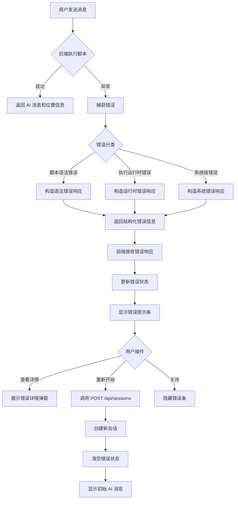
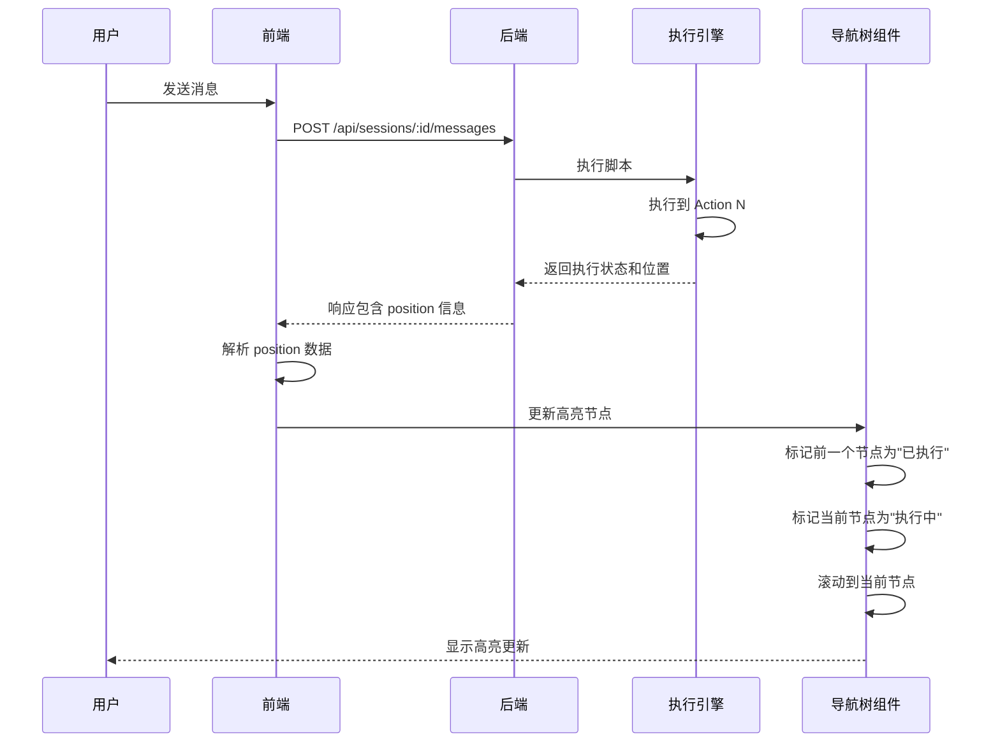
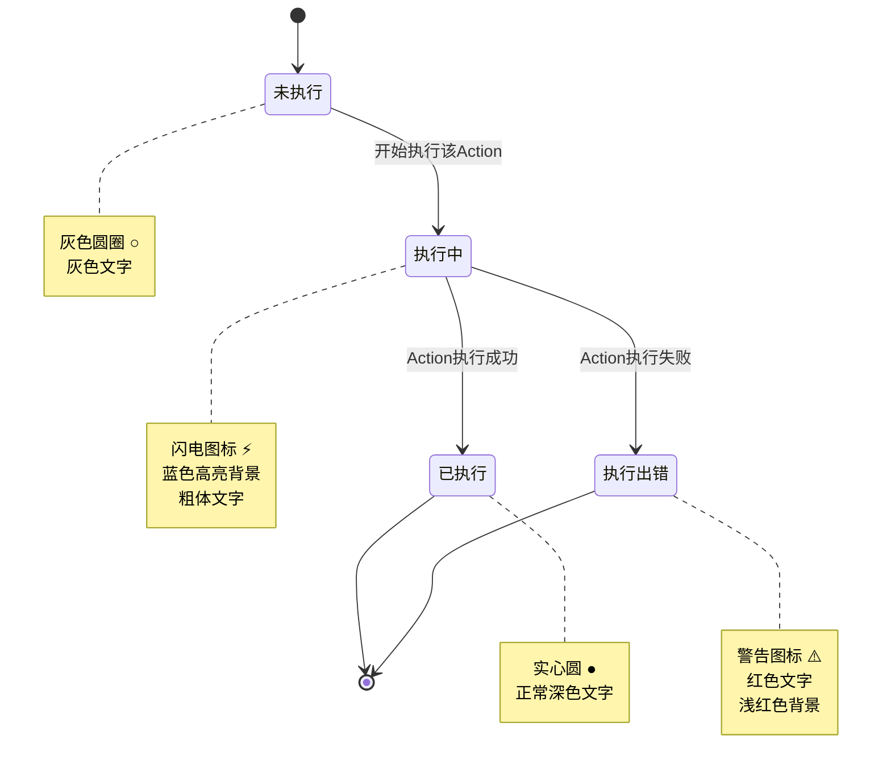
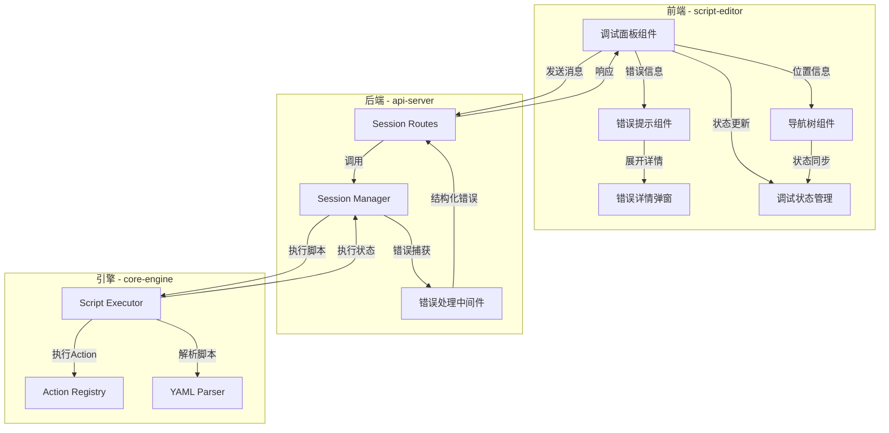

# 脚本编辑器 P0-T4 & P0-T5 详细设计

## 1. 设计概述

本文档针对脚本编辑器核心计划中的 **P0-T4（简单执行状态与错误信息展示）** 和 **P0-T5（与四层结构导航的最小联动）** 进行详细设计，目标是在调试功能基础上增强错误处理能力和执行过程可视化。

### 1.1 设计目标

**P0-T4 目标**：

- 为调试过程提供清晰的错误反馈机制
- 支持快速重启调试会话以恢复错误场景
- 建立结构化的错误信息传递规范

**P0-T5 目标**：

- 在调试过程中实时反映脚本执行位置
- 通过四层结构树（Session → Phase → Topic → Action）展示当前执行路径
- 为后续的断点、步进等高级调试能力奠定基础

### 1.2 依赖关系

- **前置依赖**：P0-T1（调试后端接口）、P0-T2（调试入口配置）、P0-T3（基础调试对话面板）
- **模块依赖**：
  - 后端：`packages/api-server/src/routes/sessions.ts`
  - 引擎：`packages/core-engine/src/engines/script-execution/executor.ts`
  - 前端：`packages/script-editor/src/components/`（调试面板相关组件）

---

## 2. P0-T4：简单执行状态与错误信息展示

### 2.1 错误分类体系

调试过程中可能出现的错误按来源和严重程度分为以下类别：

| 错误类别           | 说明                           | 示例场景                                  |
| ------------------ | ------------------------------ | ----------------------------------------- |
| **脚本语法错误**   | YAML 解析失败、结构不符合规范  | 缺少必填字段 `action_type`、YAML 格式错误 |
| **脚本配置错误**   | 逻辑配置问题、引用不存在的资源 | 引用不存在的 `action_id`、循环依赖        |
| **执行运行时错误** | Action 执行过程中的异常        | LLM 调用失败、变量提取失败、网络超时      |
| **会话状态错误**   | 会话不存在、状态不一致         | 会话已过期、数据库连接失败                |
| **系统级错误**     | 基础设施故障                   | 数据库不可用、服务崩溃                    |

### 2.2 错误信息数据结构

#### 2.2.1 后端错误响应格式

所有调试相关接口在发生错误时应返回统一的错误响应结构：

```
错误响应结构：
- success: false（布尔值）
- error: 错误对象
  - code: 错误代码（字符串，如 "SCRIPT_PARSE_ERROR"）
  - type: 错误类别（枚举值）
  - message: 用户友好的错误描述（字符串）
  - details: 技术细节（字符串，可选）
  - context: 错误上下文信息
    - scriptId: 关联的脚本ID（可选）
    - scriptName: 脚本名称（可选）
    - sessionId: 会话ID（可选）
    - position: 执行位置信息（可选）
      - phaseIndex: Phase 索引
      - topicIndex: Topic 索引
      - actionIndex: Action 索引
      - actionId: Action 标识
    - timestamp: 错误发生时间（ISO 8601 格式）
  - recovery: 恢复建议（可选）
    - canRetry: 是否可重试（布尔值）
    - retryAction: 重试动作描述（字符串）
    - suggestion: 修复建议（字符串）
```

#### 2.2.2 错误代码定义

定义标准化的错误代码便于前端进行差异化处理：

| 错误代码                  | 类别       | HTTP状态码 | 说明               |
| ------------------------- | ---------- | ---------- | ------------------ |
| SCRIPT_NOT_FOUND          | 配置错误   | 404        | 脚本不存在         |
| SCRIPT_PARSE_ERROR        | 语法错误   | 400        | YAML 解析失败      |
| SCRIPT_VALIDATION_ERROR   | 配置错误   | 400        | 脚本结构验证失败   |
| SESSION_NOT_FOUND         | 会话错误   | 404        | 会话不存在或已过期 |
| SESSION_EXECUTION_ERROR   | 运行时错误 | 500        | 脚本执行异常       |
| ACTION_EXECUTION_ERROR    | 运行时错误 | 500        | Action 执行失败    |
| LLM_SERVICE_ERROR         | 运行时错误 | 503        | LLM 服务调用失败   |
| VARIABLE_EXTRACTION_ERROR | 运行时错误 | 500        | 变量提取失败       |
| DATABASE_ERROR            | 系统错误   | 500        | 数据库操作失败     |
| INTERNAL_SERVER_ERROR     | 系统错误   | 500        | 未分类的服务器错误 |

### 2.3 后端接口增强

#### 2.3.1 增强现有接口的错误处理

需要在以下接口中实现统一的错误处理机制：

1. **POST /api/sessions** - 创建调试会话
   - 捕获脚本加载、解析、初始化过程中的错误
   - 返回详细的错误上下文（脚本名、具体位置等）

2. **POST /api/sessions/:id/messages** - 发送消息
   - 捕获执行过程中的 Action 错误
   - 返回当前执行位置信息
   - 区分可恢复错误和致命错误

3. **GET /api/sessions/:id** - 获取会话状态
   - 包含最近一次错误信息（如果有）
   - 返回会话的整体健康状态

#### 2.3.2 错误处理流程

```
错误捕获与处理流程：

1. 接口层捕获异常
   ↓
2. 判断错误类型
   ↓
3. 构造结构化错误响应
   - 设置错误代码和类别
   - 提取上下文信息（脚本、位置等）
   - 生成用户友好的错误描述
   - 添加恢复建议
   ↓
4. 记录错误日志（包含完整技术栈）
   ↓
5. 返回错误响应给前端
```

#### 2.3.3 会话错误状态持久化

在会话数据模型中增加错误状态记录：

```
会话表增强字段：
- lastError: 最近一次错误信息（JSON对象，可为空）
  - code: 错误代码
  - message: 错误描述
  - timestamp: 发生时间
  - position: 执行位置
- errorCount: 错误发生次数（整数，用于监控）
- lastErrorAt: 最后错误时间（时间戳）
```

### 2.4 前端错误展示设计

#### 2.4.1 错误展示区域布局

在调试界面中设计专门的错误展示区域：

**位置选项**：

- 方案A：调试面板顶部横向错误条（推荐）
- 方案B：调试面板内嵌错误消息区
- 方案C：全局浮动错误提示

**推荐方案A的布局结构**：

```
调试界面布局：
┌─────────────────────────────────────┐
│ 调试配置区（工程选择、入口脚本等）    │
├─────────────────────────────────────┤
│ 错误提示条（仅在有错误时显示）        │
│ ┌───────────────────────────────┐  │
│ │ ⚠️ 错误类型：脚本执行错误       │  │
│ │ 描述：Action ai_ask_01 执行失败│  │
│ │ 脚本：cbt_assessment.yaml     │  │
│ │ [查看详情] [重新开始] [关闭]   │  │
│ └───────────────────────────────┘  │
├─────────────────────────────────────┤
│                                     │
│     对话消息区                       │
│                                     │
├─────────────────────────────────────┤
│ 输入框  [发送]                       │
└─────────────────────────────────────┘
```

#### 2.4.2 错误展示内容

错误条应显示以下信息（根据错误类型动态调整）：

| 显示项       | 说明                       | 显示条件         |
| ------------ | -------------------------- | ---------------- |
| 错误图标     | 视觉警示符号               | 始终显示         |
| 错误类型标签 | 简短的错误分类名称         | 始终显示         |
| 错误描述     | 用户友好的错误说明（单行） | 始终显示         |
| 关联脚本名   | 出错的脚本文件名           | 有上下文时显示   |
| 执行位置     | Phase/Topic/Action 路径    | 有位置信息时显示 |
| 详情按钮     | 展开完整错误详情           | 有技术细节时显示 |
| 重新开始按钮 | 快速重启调试会话           | 始终显示         |
| 关闭按钮     | 隐藏错误提示               | 始终显示         |

#### 2.4.3 错误详情弹窗

点击"查看详情"按钮时，展示错误详细信息弹窗：

```
错误详情弹窗内容：
┌─────────────────────────────────┐
│  错误详情                        │
├─────────────────────────────────┤
│ 错误代码: ACTION_EXECUTION_ERROR│
│ 错误类型: 运行时错误             │
│ 发生时间: 2026-01-14 23:30:45   │
│                                 │
│ 执行位置:                        │
│   Phase: assessment_phase       │
│   Topic: initial_greeting       │
│   Action: ai_ask_01            │
│                                 │
│ 技术详情:                        │
│   LLM service timeout after 30s │
│   API endpoint: /v1/chat       │
│                                 │
│ 修复建议:                        │
│   • 检查网络连接                │
│   • 确认 LLM 服务可用           │
│   • 尝试重新开始调试            │
│                                 │
│          [复制详情] [关闭]       │
└─────────────────────────────────┘
```

#### 2.4.4 错误状态管理

前端维护调试错误状态：

```
前端错误状态数据结构：
{
  hasError: boolean,           // 是否存在错误
  currentError: {              // 当前错误信息
    code: string,              // 错误代码
    type: string,              // 错误类别
    message: string,           // 用户友好描述
    details: string,           // 技术细节
    context: {                 // 上下文信息
      scriptId: string,
      scriptName: string,
      sessionId: string,
      position: {
        phaseIndex: number,
        topicIndex: number,
        actionIndex: number,
        actionId: string
      },
      timestamp: string
    },
    recovery: {                // 恢复建议
      canRetry: boolean,
      suggestion: string
    }
  },
  errorHistory: []             // 历史错误记录（可选，用于调试分析）
}
```

### 2.5 重新开始调试功能

#### 2.5.1 功能说明

"重新开始"按钮允许用户快速清除当前错误状态并重新创建调试会话。

#### 2.5.2 执行流程

```
重新开始调试流程：

1. 用户点击"重新开始"按钮
   ↓
2. 前端清除当前错误状态
   ↓
3. 保留当前调试配置（工程ID、入口脚本）
   ↓
4. 调用 POST /api/sessions 创建新会话
   - 使用相同的 scriptId
   - 可选：使用相同的 initialVariables
   ↓
5. 获取新的 sessionId
   ↓
6. 清空对话历史（前端状态）
   ↓
7. 展示新会话的初始 AI 消息
   ↓
8. 将错误提示条隐藏
```

#### 2.5.3 用户确认机制

考虑到用户偏好（关键操作需确认），重新开始操作应：

- **默认行为**：直接执行（因为是低风险操作，不会修改脚本内容）
- **可选增强**：在调试设置中提供"重启前确认"选项，用户可启用二次确认

如果启用确认机制，弹窗内容为：

```
确认对话框：
┌─────────────────────────────┐
│  确认重新开始调试？          │
├─────────────────────────────┤
│  当前会话将被终止，          │
│  对话历史将被清空。          │
│                             │
│  脚本文件不会受影响。        │
│                             │
│     [取消]    [确认重启]     │
└─────────────────────────────┘
```

### 2.6 错误恢复策略

针对不同类型错误提供差异化的恢复建议：

| 错误类型     | 自动恢复 | 用户操作建议                                  |
| ------------ | -------- | --------------------------------------------- |
| 脚本语法错误 | 否       | 修复脚本 YAML 文件，保存后重新开始            |
| 脚本配置错误 | 否       | 检查脚本配置（如 action_id 引用），修复后重启 |
| LLM 服务错误 | 可选重试 | 检查网络连接和服务状态，点击"重新开始"        |
| 变量提取错误 | 否       | 检查 Action 配置中的变量提取规则              |
| 会话过期     | 否       | 点击"重新开始"创建新会话                      |
| 网络超时     | 可选重试 | 检查网络连接，重新发送消息或重启会话          |

### 2.7 验收标准

- ✅ 人为构造脚本语法错误（如删除必填字段），错误提示条正确显示错误类型和描述
- ✅ 错误提示条显示关联的脚本名称
- ✅ 点击"查看详情"按钮能展示完整的错误技术信息
- ✅ 点击"重新开始"按钮能成功创建新会话并清空错误状态
- ✅ 模拟 LLM 服务超时错误，错误信息能正确展示执行位置（Action 路径）
- ✅ 关闭错误提示条后，用户仍可通过会话状态访问错误信息

---

## 3. P0-T5：与四层结构导航的最小联动

### 3.1 四层结构概述

脚本执行遵循四层结构：

```
层级关系：
Session（会谈流程脚本）
  └── Phase（阶段）
       └── Topic（话题）
            └── Action（操作）
```

每一层都有唯一标识符：

- Session: `session.id`（在脚本中定义）
- Phase: `phase_id`（在脚本中定义）
- Topic: `topic_id`（在脚本中定义）
- Action: `action_id`（在脚本中定义）

### 3.2 执行位置信息传递

#### 3.2.1 后端执行位置跟踪

在脚本执行器（`ScriptExecutor`）中已经维护了执行位置状态：

```
ExecutionState 包含位置信息：
- currentPhaseIdx: number      // Phase 索引（从0开始）
- currentTopicIdx: number      // Topic 索引（从0开始）
- currentActionIdx: number     // Action 索引（从0开始）
- currentAction: BaseAction    // 当前正在执行的 Action 实例
```

需要增强以包含完整的层级标识信息：

```
增强的位置信息结构：
{
  position: {
    phaseIndex: number,        // Phase 索引
    phaseId: string,           // Phase 标识符
    topicIndex: number,        // Topic 索引
    topicId: string,           // Topic 标识符
    actionIndex: number,       // Action 索引
    actionId: string,          // Action 标识符
    actionType: string         // Action 类型（如 ai_ask, ai_say）
  }
}
```

#### 3.2.2 API 响应增强

在调试相关接口的响应中包含执行位置信息：

**POST /api/sessions 响应增强**：

```
创建会话响应结构：
{
  sessionId: string,
  status: string,
  createdAt: string,
  aiMessage: string,
  executionStatus: string,
  position: {              // 新增：当前执行位置
    phaseIndex: number,
    phaseId: string,
    topicIndex: number,
    topicId: string,
    actionIndex: number,
    actionId: string,
    actionType: string
  }
}
```

**POST /api/sessions/:id/messages 响应增强**：

```
发送消息响应结构：
{
  aiMessage: string,
  sessionStatus: string,
  executionStatus: string,
  variables: object,
  position: {              // 新增：最新执行位置
    phaseIndex: number,
    phaseId: string,
    topicIndex: number,
    topicId: string,
    actionIndex: number,
    actionId: string,
    actionType: string
  }
}
```

**GET /api/sessions/:id 响应增强**：

```
会话详情响应中已有 position 字段，
需确保其结构与上述定义一致。
```

### 3.3 前端四层导航树实现

#### 3.3.1 导航树数据结构

前端维护脚本的四层结构树：

```
导航树数据结构：
{
  session: {
    id: string,
    name: string,
    phases: [
      {
        phaseId: string,
        phaseName: string,
        phaseIndex: number,
        topics: [
          {
            topicId: string,
            topicName: string,
            topicIndex: number,
            actions: [
              {
                actionId: string,
                actionType: string,
                actionIndex: number,
                displayName: string,    // 用于展示的名称
                isExecuting: boolean,   // 是否正在执行
                isExecuted: boolean,    // 是否已执行
                hasError: boolean       // 是否执行出错
              }
            ]
          }
        ]
      }
    ]
  }
}
```

#### 3.3.2 导航树构建

从脚本内容解析并构建导航树：

```
构建流程：

1. 加载脚本内容（YAML 格式）
   ↓
2. 解析 session 结构
   ↓
3. 遍历 phases 数组
   - 提取 phase_id、phase_name
   - 遍历每个 phase 的 topics 数组
     - 提取 topic_id、topic_name
     - 遍历每个 topic 的 actions 数组
       - 提取 action_id、action_type
       - 生成 displayName（如 "AI询问: action_id"）
   ↓
4. 初始化所有节点状态（未执行）
   ↓
5. 构建树形数据结构
```

#### 3.3.3 导航树 UI 布局

在编辑器界面中增加导航树面板：

```
编辑器布局增强：
┌─────────────────────────────────────┐
│ 顶部工具栏（保存、发布、调试等）     │
├─────────┬───────────────────────────┤
│         │                           │
│  导航   │     主编辑区              │
│  树面   │  （脚本内容编辑）          │
│  板     │                           │
│  (新增) │                           │
│         │                           │
│         │                           │
├─────────┴───────────────────────────┤
│       调试面板（可折叠）              │
│  - 对话区                            │
│  - 输入框                            │
└─────────────────────────────────────┘
```

**导航树面板内容**：

```
导航树展示（树形结构）：
□ Session: CBT评估会话
  □ Phase: 问候阶段 (greeting_phase)
    □ Topic: 初始问候 (initial_greeting)
      ● Action: ai_say_welcome (已执行)
      ⚡ Action: ai_ask_name (执行中)  ← 当前高亮
      ○ Action: ai_think_process (未执行)
  □ Phase: 评估阶段 (assessment_phase)
    □ Topic: 症状评估 (symptom_assessment)
      ○ Action: ai_ask_symptoms (未执行)
      ...

图例：
● 已执行
⚡ 执行中（高亮显示）
○ 未执行
⚠️ 执行出错
```

#### 3.3.4 节点状态视觉设计

不同执行状态的节点使用不同的视觉样式：

| 状态     | 图标 | 文字颜色 | 背景色     | 说明           |
| -------- | ---- | -------- | ---------- | -------------- |
| 未执行   | ○    | 灰色     | 无         | 默认状态       |
| 执行中   | ⚡   | 深色粗体 | 浅蓝色高亮 | 当前正在执行   |
| 已执行   | ●    | 正常深色 | 无         | 已完成执行     |
| 执行出错 | ⚠️   | 红色     | 浅红色     | 执行过程中出错 |

### 3.4 执行位置高亮联动机制

#### 3.4.1 高亮更新时机

在以下时机更新导航树的高亮状态：

1. **会话初始化时**：
   - 触发：`POST /api/sessions` 成功响应
   - 行为：高亮第一个 Action 节点

2. **发送消息后**：
   - 触发：`POST /api/sessions/:id/messages` 成功响应
   - 行为：根据返回的 `position` 更新高亮节点

3. **轮询会话状态时**（如果实现）：
   - 触发：定时调用 `GET /api/sessions/:id`
   - 行为：根据最新 `position` 更新高亮

4. **错误发生时**：
   - 触发：接收到错误响应
   - 行为：将出错节点标记为错误状态（⚠️）

#### 3.4.2 高亮更新逻辑

```
高亮更新流程：

1. 接收后端返回的 position 信息
   ↓
2. 解析位置数据
   {
     phaseIndex: 0,
     phaseId: "greeting_phase",
     topicIndex: 0,
     topicId: "initial_greeting",
     actionIndex: 1,
     actionId: "ai_ask_name"
   }
   ↓
3. 在导航树中定位目标节点
   - 通过 phaseIndex/topicIndex/actionIndex 索引
   - 或通过 phaseId/topicId/actionId 标识符
   ↓
4. 更新节点状态
   - 将之前"执行中"的节点标记为"已执行"
   - 将当前节点标记为"执行中"
   - 展开父级节点（Phase、Topic）
   ↓
5. 滚动视图到当前节点（自动展开并可见）
```

#### 3.4.3 状态管理

前端维护导航树的执行状态：

```
导航树状态数据结构：
{
  currentPosition: {           // 当前执行位置
    phaseIndex: number,
    topicIndex: number,
    actionIndex: number
  },
  executionHistory: [          // 执行历史路径
    {
      phaseIndex: number,
      topicIndex: number,
      actionIndex: number,
      timestamp: string,
      status: "completed" | "error"
    }
  ],
  treeData: {...}              // 树形数据（见 3.3.1）
}
```

### 3.5 交互行为约束

在 P0-T5 阶段，导航树仅提供被动展示功能，不支持主动交互：

**不支持的交互**（留待 Phase 2）：

- ❌ 点击节点跳转到执行位置
- ❌ 在节点上设置断点
- ❌ 手动触发步进执行
- ❌ 修改执行流程

**支持的基础交互**：

- ✅ 展开/折叠 Phase 和 Topic 节点
- ✅ 滚动查看完整树结构
- ✅ 悬停查看节点详细信息（Tooltip）

### 3.6 Tooltip 信息展示

当鼠标悬停在 Action 节点上时，显示详细信息：

```
Tooltip 内容：
┌─────────────────────────┐
│ Action ID: ai_ask_name  │
│ 类型: AI 询问            │
│ 状态: 执行中            │
│ 执行时间: 23:30:42      │
│                         │
│ 配置摘要:               │
│   提示词: "请问您的姓名"│
│   变量提取: user_name   │
└─────────────────────────┘
```

### 3.7 性能优化考虑

对于包含大量 Action 的复杂脚本，需考虑性能优化：

1. **虚拟滚动**：
   - 仅渲染可见区域的节点
   - 使用虚拟列表库（如 react-window）

2. **懒加载**：
   - 初始仅加载 Phase 级别
   - 展开时才加载 Topic 和 Action 子节点

3. **状态更新优化**：
   - 使用不可变数据结构避免不必要的重渲染
   - 仅更新变化的节点路径

### 3.8 验收标准

- ✅ 在编辑器界面中显示四层结构导航树
- ✅ 导航树正确解析并展示脚本的完整结构（Session/Phase/Topic/Action）
- ✅ 开始调试后，第一个 Action 节点被高亮标记为"执行中"
- ✅ 发送消息后，导航树高亮更新到新的执行位置
- ✅ 已执行的 Action 节点显示"已执行"状态
- ✅ 当执行出错时，导航树中对应节点显示错误标记（⚠️）
- ✅ 高亮节点自动滚动到可见区域
- ✅ 悬停 Action 节点时显示详细信息 Tooltip
- ✅ 支持展开/折叠 Phase 和 Topic 节点

---

## 4. 实现顺序建议

为确保功能按依赖关系有序实现，建议按以下顺序进行开发：

### 4.1 第一阶段：P0-T4 基础错误处理

1. **后端错误响应结构定义**
   - 定义统一的错误响应格式
   - 定义错误代码枚举
   - 实现错误工厂函数

2. **后端接口错误处理增强**
   - 在 `POST /api/sessions` 中实现错误捕获和格式化
   - 在 `POST /api/sessions/:id/messages` 中实现错误捕获
   - 测试各类错误场景（脚本语法错误、执行错误等）

3. **前端错误状态管理**
   - 定义错误状态数据结构
   - 实现错误状态的更新逻辑

4. **前端错误展示 UI**
   - 实现错误提示条组件
   - 实现错误详情弹窗组件
   - 集成到调试面板

5. **重新开始调试功能**
   - 实现重新开始按钮逻辑
   - 清理旧会话状态
   - 创建新会话并重置 UI

### 4.2 第二阶段：P0-T5 执行位置可视化

6. **后端执行位置信息增强**
   - 在 `ExecutionState` 中补充完整的层级标识信息
   - 在 API 响应中包含 `position` 字段
   - 测试位置信息的准确性

7. **前端导航树数据结构**
   - 实现脚本解析逻辑（从 YAML 构建树结构）
   - 定义节点状态枚举和数据结构

8. **前端导航树 UI 组件**
   - 实现树形组件的基础渲染
   - 实现展开/折叠功能
   - 实现不同状态的视觉样式

9. **执行位置高亮联动**
   - 实现位置更新逻辑（从 API 响应到树状态）
   - 实现自动滚动到当前节点
   - 实现 Tooltip 信息展示

10. **集成测试**
    - 端到端测试调试流程与导航树联动
    - 验证错误处理与导航树的协同工作

### 4.3 第三阶段：联调与优化

11. **性能优化**
    - 针对大型脚本实现虚拟滚动
    - 优化状态更新性能

12. **用户体验优化**
    - 调整视觉样式和动画效果
    - 完善交互反馈

13. **文档与验收**
    - 编写使用文档
    - 完成验收标准检查

---

## 5. 技术约束与注意事项

### 5.1 技术约束

1. **不改变现有数据模型**：
   - 在现有会话表和执行状态基础上扩展
   - 避免破坏性的数据库结构变更

2. **保持接口向后兼容**：
   - 新增字段应为可选字段
   - 旧版本前端应能继续工作（降级使用）

3. **性能要求**：
   - 错误信息展示延迟 < 100ms
   - 导航树高亮更新延迟 < 200ms
   - 支持至少 100 个 Action 节点的脚本

### 5.2 安全考虑

1. **敏感信息保护**：
   - 错误详情中不应暴露系统内部路径
   - 不应暴露数据库连接字符串等敏感配置
   - 用户变量值应脱敏处理（如部分遮蔽）

2. **错误日志记录**：
   - 完整技术栈仅记录在服务器日志
   - 前端仅展示用户友好的简化信息

### 5.3 边界情况处理

1. **脚本结构异常**：
   - 如果脚本解析失败，导航树显示"解析失败"占位信息
   - 提供错误详情和修复建议

2. **执行位置信息缺失**：
   - 如果后端未返回 `position` 信息，导航树不高亮
   - 记录警告日志但不阻断功能

3. **会话中断**：
   - 如果会话在调试过程中失效，显示明确的错误提示
   - 引导用户重新开始调试

---

## 6. 与后续阶段的衔接

### 6.1 为 Phase 1 准备

P0-T4 和 P0-T5 的设计应为 Phase 1（版本管理）预留扩展性：

- **错误上下文中包含版本信息**：
  - 在错误响应中可包含 `versionId` 字段（可选）
  - 区分草稿调试和版本调试的错误

- **导航树支持只读模式**：
  - 为调试已发布版本做准备（不可编辑）

### 6.2 为 Phase 2 准备

P0-T5 的导航树设计应为 Phase 2（调试增强）预留交互能力：

- **节点事件钩子**：
  - 预留节点点击、右键菜单等事件处理接口

- **断点状态扩展**：
  - 节点状态数据结构中预留 `breakpoint` 字段

- **变量状态关联**：
  - 导航树节点可关联变量快照数据

---

## 7. Mermaid 图示

### 7.1 错误处理流程图



### 7.2 执行位置高亮更新流程图



### 7.3 导航树状态转换图



### 7.4 系统组件交互架构图



---

## 8. 数据结构汇总表

### 8.1 错误响应完整结构

| 字段路径                           | 类型    | 必填 | 说明                                   |
| ---------------------------------- | ------- | ---- | -------------------------------------- |
| success                            | boolean | 是   | 固定为 false                           |
| error                              | object  | 是   | 错误对象                               |
| error.code                         | string  | 是   | 错误代码（如 SCRIPT_PARSE_ERROR）      |
| error.type                         | string  | 是   | 错误类别（语法/配置/运行时/会话/系统） |
| error.message                      | string  | 是   | 用户友好的错误描述                     |
| error.details                      | string  | 否   | 技术细节                               |
| error.context                      | object  | 否   | 错误上下文                             |
| error.context.scriptId             | string  | 否   | 关联脚本 ID                            |
| error.context.scriptName           | string  | 否   | 脚本名称                               |
| error.context.sessionId            | string  | 否   | 会话 ID                                |
| error.context.position             | object  | 否   | 执行位置                               |
| error.context.position.phaseIndex  | number  | 否   | Phase 索引                             |
| error.context.position.topicIndex  | number  | 否   | Topic 索引                             |
| error.context.position.actionIndex | number  | 否   | Action 索引                            |
| error.context.position.actionId    | string  | 否   | Action 标识                            |
| error.context.timestamp            | string  | 是   | 错误发生时间（ISO 8601）               |
| error.recovery                     | object  | 否   | 恢复建议                               |
| error.recovery.canRetry            | boolean | 否   | 是否可重试                             |
| error.recovery.retryAction         | string  | 否   | 重试动作描述                           |
| error.recovery.suggestion          | string  | 否   | 修复建议                               |

### 8.2 执行位置信息结构

| 字段        | 类型   | 必填 | 说明                             |
| ----------- | ------ | ---- | -------------------------------- |
| phaseIndex  | number | 是   | Phase 索引（从0开始）            |
| phaseId     | string | 是   | Phase 标识符                     |
| topicIndex  | number | 是   | Topic 索引（从0开始）            |
| topicId     | string | 是   | Topic 标识符                     |
| actionIndex | number | 是   | Action 索引（从0开始）           |
| actionId    | string | 是   | Action 标识符                    |
| actionType  | string | 是   | Action 类型（如 ai_ask, ai_say） |

### 8.3 导航树节点数据结构

| 字段        | 类型    | 说明                            |
| ----------- | ------- | ------------------------------- |
| actionId    | string  | Action 唯一标识                 |
| actionType  | string  | Action 类型                     |
| actionIndex | number  | 在 Topic 中的索引               |
| displayName | string  | 显示名称                        |
| isExecuting | boolean | 是否正在执行                    |
| isExecuted  | boolean | 是否已执行                      |
| hasError    | boolean | 是否执行出错                    |
| executedAt  | string  | 执行时间戳（可选）              |
| config      | object  | Action 配置摘要（用于 Tooltip） |

---

## 9. 关键决策记录

### 9.1 错误提示条位置选择

**决策**：采用调试面板顶部横向错误条（方案A）

**理由**：

- 位置固定，视觉优先级高，用户不会错过
- 不遮挡对话内容，不影响正常交互
- 便于实现"重新开始"快捷操作

### 9.2 导航树交互限制

**决策**：P0-T5 阶段仅支持被动展示，不支持点击跳转和断点设置

**理由**：

- 降低实现复杂度，聚焦核心功能
- 避免引入执行流程控制的复杂逻辑
- 为 Phase 2 预留增强空间

### 9.3 执行位置信息冗余设计

**决策**：同时传递索引（phaseIndex/topicIndex/actionIndex）和标识符（phaseId/topicId/actionId）

**理由**：

- 索引用于快速定位（O(1) 复杂度）
- 标识符用于跨版本兼容（脚本结构调整时索引可能变化）
- 提供双重保障，增强健壮性

---

## 10. 测试场景清单

### 10.1 P0-T4 错误处理测试

| 测试场景     | 操作步骤                                     | 预期结果                                   |
| ------------ | -------------------------------------------- | ------------------------------------------ |
| 脚本语法错误 | 删除脚本中的必填字段 `action_type`，开始调试 | 显示语法错误提示，包含脚本名和具体字段信息 |
| LLM 服务超时 | 模拟 LLM 服务延迟30秒，发送消息              | 显示运行时错误，包含执行位置和重试建议     |
| 会话不存在   | 使用无效的 sessionId 发送消息                | 显示会话错误，提示重新开始                 |
| 查看错误详情 | 点击错误条的"查看详情"按钮                   | 弹出详情窗口，显示完整技术信息             |
| 重新开始调试 | 出错后点击"重新开始"按钮                     | 创建新会话，清空错误状态，显示初始消息     |
| 关闭错误提示 | 点击错误条的"关闭"按钮                       | 错误条隐藏，但错误状态保留在会话中         |

### 10.2 P0-T5 执行位置可视化测试

| 测试场景     | 操作步骤                       | 预期结果                                     |
| ------------ | ------------------------------ | -------------------------------------------- |
| 初始高亮     | 创建调试会话                   | 导航树高亮第一个 Action 节点                 |
| 高亮更新     | 发送消息触发下一个 Action 执行 | 前一个节点变为"已执行"，新节点高亮为"执行中" |
| 错误节点标记 | 构造执行错误，触发 Action 失败 | 出错节点显示警告图标 ⚠️                      |
| 自动滚动     | 执行到可视区域外的节点         | 导航树自动滚动，当前节点可见                 |
| Tooltip 展示 | 鼠标悬停在 Action 节点上       | 显示包含 Action ID、类型、配置摘要的 Tooltip |
| 展开折叠     | 点击 Phase 节点的展开/折叠图标 | Phase 子节点（Topics）正确展开或折叠         |

### 10.3 集成测试

| 测试场景             | 操作步骤                              | 预期结果                                         |
| -------------------- | ------------------------------------- | ------------------------------------------------ |
| 错误与导航联动       | Action 执行出错，查看导航树           | 导航树中对应节点显示错误标记，错误提示条同时显示 |
| 重新开始后导航树重置 | 出错后重新开始调试                    | 导航树所有节点重置为"未执行"，第一个节点重新高亮 |
| 大型脚本性能         | 加载包含 100+ Action 的脚本，执行调试 | 导航树渲染流畅，高亮更新延迟 < 200ms             |
