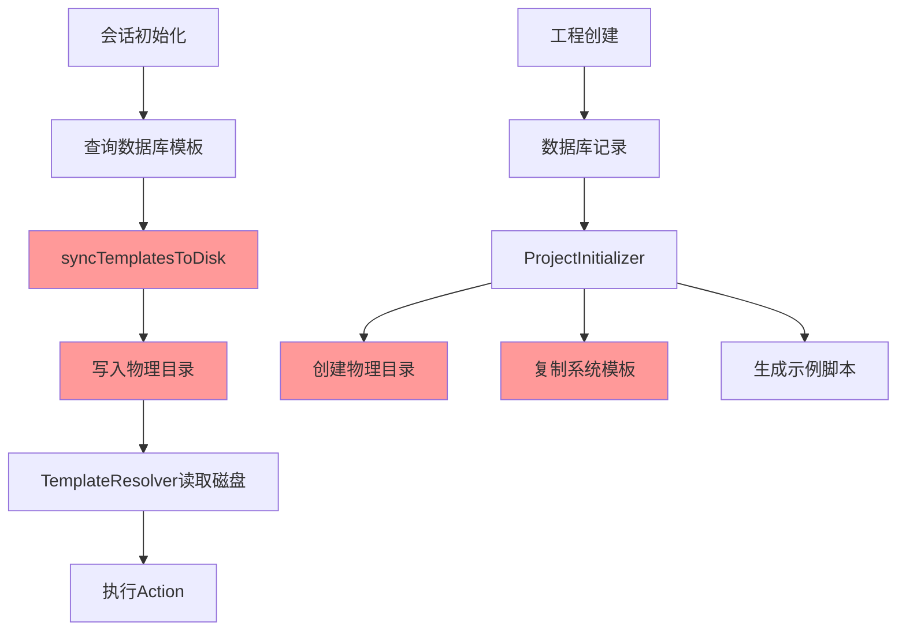
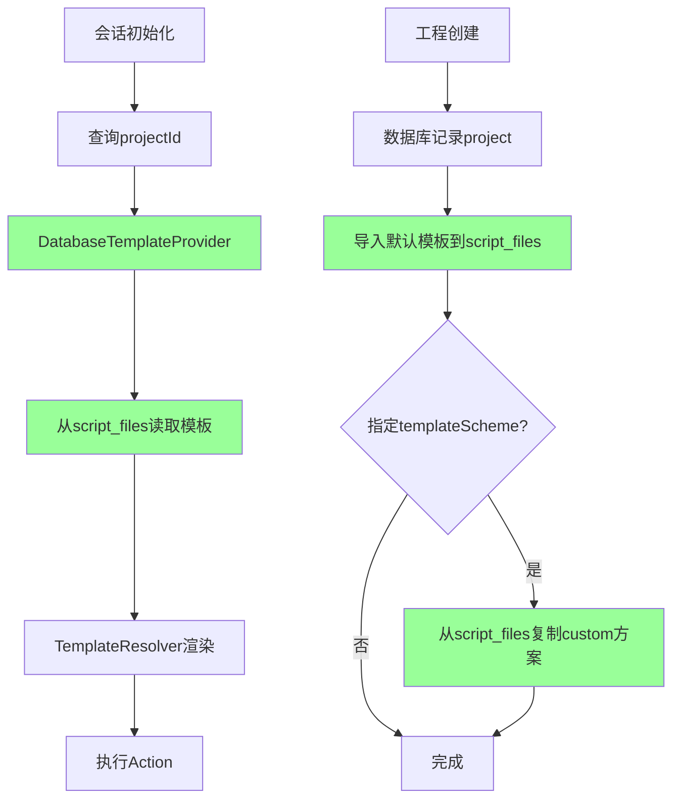
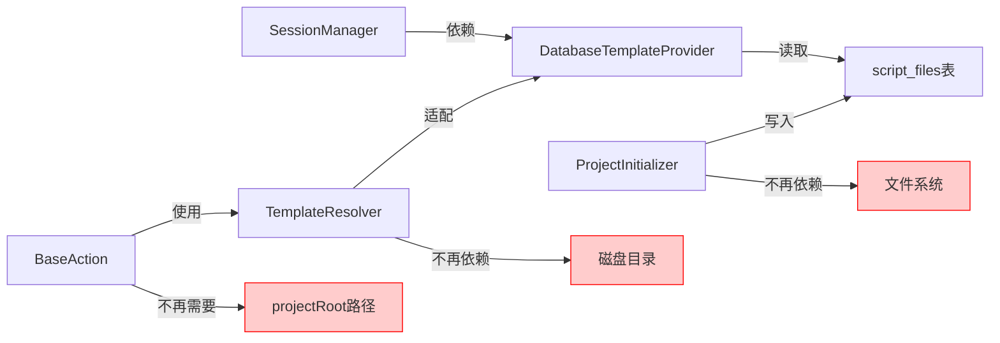
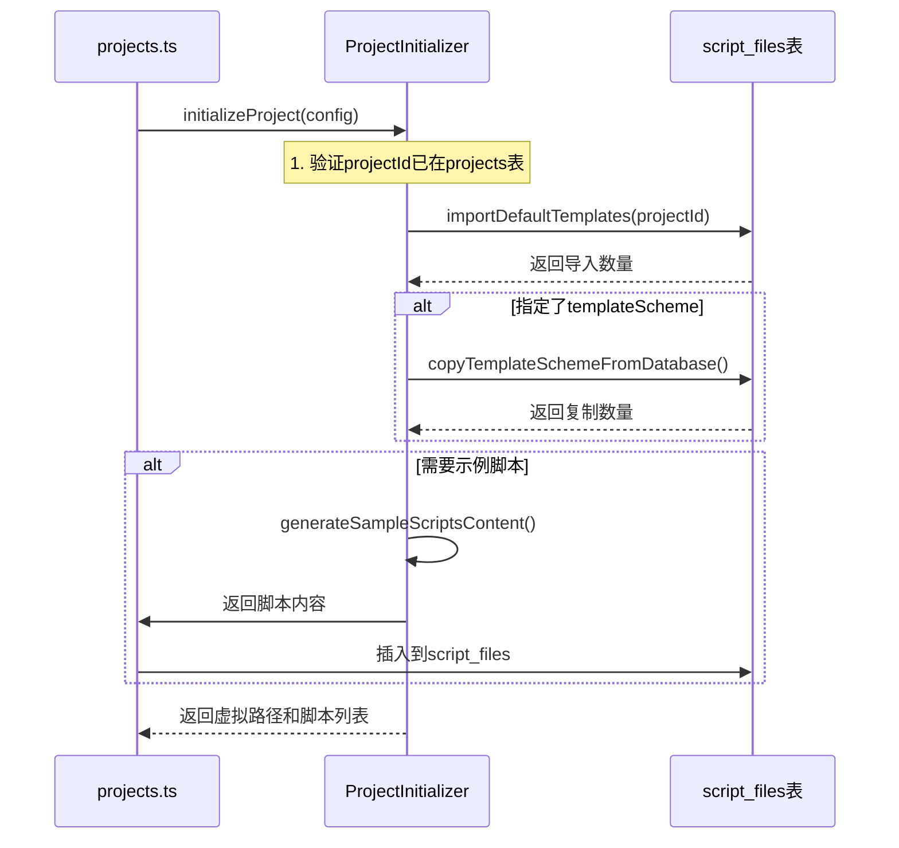
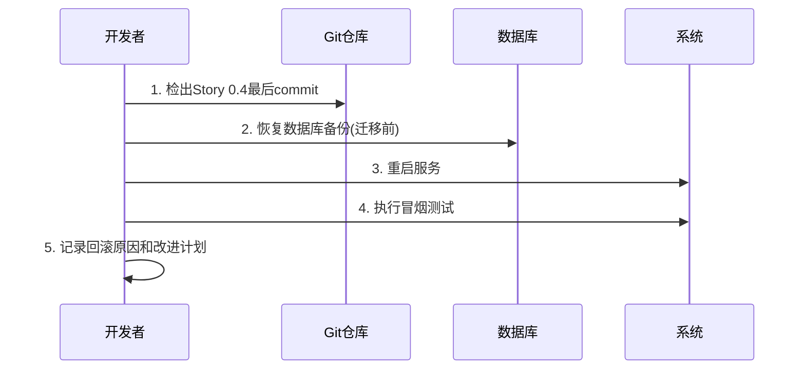

# Story 0.5: 移除磁盘同步机制与ProjectInitializer磁盘初始化 - 实施设计

## 1. 战略目标

### 1.1 核心目标

将系统从混合架构(数据库+磁盘)彻底迁移至完全数据库架构,移除所有对物理workspace目录的依赖,实现单一真相来源的脚本工程管理模式。

### 1.2 业务价值

| 价值维度         | 当前问题                                 | 改进后效果                   |
| ---------------- | ---------------------------------------- | ---------------------------- |
| **多会话隔离**   | 磁盘目录共享导致隔离不清晰               | 数据库级别的天然隔离         |
| **部署复杂度**   | 需要初始化workspace物理目录              | 无需文件系统准备,仅需数据库  |
| **AI链路稳定性** | syncTemplatesToDisk可能因磁盘满/权限失败 | 数据库操作具备事务保障       |
| **可复现性**     | 磁盘状态难以追溯和还原                   | 所有资源可通过数据库备份恢复 |
| **并发安全性**   | 磁盘IO存在竞态条件                       | 数据库事务机制保障一致性     |

### 1.3 前置条件验证

本Story严格依赖Story 0.4的完整就位:

- [x] DatabaseTemplateProvider已实现并经过充分测试
- [x] TemplateResolver支持数据库模式
- [x] TemplateManager支持DatabaseTemplateProvider注入
- [x] SessionManager已注入DatabaseTemplateProvider作为默认provider
- [ ] E2E测试(test-database-template-mode.ts)完全验证通过

**启动条件**: 只有当上述所有条件满足后,才可启动Story 0.5实施。

---

## 2. 架构演进分析

### 2.1 架构对比

#### 当前混合架构



**问题点**:

- 数据库与磁盘双写,存在一致性风险
- 并发场景下syncTemplatesToDisk可能冲突
- 磁盘操作失败会导致会话初始化中断

#### 目标纯数据库架构



**优势**:

- 单一数据源,无同步开销
- 数据库事务保障一致性
- 资源隔离清晰,便于多租户扩展

### 2.2 依赖关系分析



---

## 3. 实施任务分解

### 3.1 任务清单概览

| 任务编号 | 任务名称                                 | 优先级 | 预估工作量 | 风险等级 |
| -------- | ---------------------------------------- | ------ | ---------- | -------- |
| T5.1     | 移除SessionManager.syncTemplatesToDisk() | P0     | 2h         | 低       |
| T5.2     | 重构ProjectInitializer为纯数据库操作     | P0     | 4h         | 中       |
| T5.3     | 移除PROJECTS_WORKSPACE环境变量依赖       | P0     | 3h         | 中       |
| T5.4     | 更新E2E测试验证无workspace场景           | P0     | 3h         | 低       |
| T5.5     | 标注迁移工具与更新文档                   | P1     | 2h         | 低       |
| T5.6     | 回归测试与性能验证                       | P0     | 2h         | 低       |

**总计**: 16小时 (约2工作日)

---

### 3.2 任务详细设计

#### T5.1 移除SessionManager.syncTemplatesToDisk()

**目标**: 从SessionManager中彻底移除临时磁盘同步机制

**变更范围**:

```
文件: packages/api-server/src/services/session-manager.ts
位置: 第654-708行 (syncTemplatesToDisk方法)
      第717-720行 (initializeSession中的调用点)
```

**变更内容**:

| 操作类型 | 内容                                                   | 说明                          |
| -------- | ------------------------------------------------------ | ----------------------------- |
| 删除方法 | `private async syncTemplatesToDisk(projectId: string)` | 完整删除包含注释的整个方法    |
| 删除调用 | `await this.syncTemplatesToDisk(script.projectId)`     | 从initializeSession方法中移除 |
| 删除导入 | `import fs from 'fs/promises'`                         | 若无其他使用则删除            |
| 删除导入 | `import path from 'path'`                              | 保留(metadata传递仍需要)      |

**影响验证**:

1. 会话初始化流程
   - 验证点: 新建会话后首轮AI消息正常生成
   - 预期结果: 模板从DatabaseTemplateProvider加载,无磁盘IO

2. 模板加载性能
   - 验证点: 对比移除前后初始化耗时
   - 预期结果: 性能提升10-20%(减少磁盘IO开销)

**测试验证**:

- 单元测试: 验证initializeSession不再调用磁盘操作
- 集成测试: 在无workspace目录情况下创建会话并执行ai_ask

---

#### T5.2 重构ProjectInitializer为纯数据库操作

**目标**: 将工程初始化从物理目录创建改为纯数据库记录

**变更前架构**:

```
ProjectInitializer
├── 创建物理目录(_system/config/default, custom, scripts/examples)
├── 复制系统模板到磁盘(copySystemTemplates)
├── 复制templateScheme到磁盘(copyTemplateScheme)
├── 生成示例脚本到磁盘
└── 创建project.json等配置文件
```

**变更后架构**:

```
ProjectInitializer
├── 验证工程元数据(已由projects.ts完成)
├── 导入默认模板到script_files表
├── 若指定templateScheme,从数据库复制custom方案
└── 返回虚拟路径标识
```

**详细变更**:

##### 3.2.1 删除磁盘操作方法

| 方法名                       | 行号    | 操作                            |
| ---------------------------- | ------- | ------------------------------- |
| `createDirectoryStructure()` | 116-135 | 完整删除                        |
| `copySystemTemplates()`      | 140-170 | 完整删除                        |
| `copyDirectory()`            | 175-190 | 完整删除                        |
| `copyTemplateScheme()`       | 203-232 | 替换为数据库操作                |
| `generateSampleScripts()`    | 237-329 | 改为返回脚本内容,不写磁盘       |
| `createProjectConfig()`      | 334-362 | 删除(配置存入projects.metadata) |
| `createReadme()`             | 367-416 | 删除                            |
| `createGitignore()`          | 421-446 | 删除                            |

##### 3.2.2 新增数据库操作方法

**方法1: importDefaultTemplates()**

```
职责: 从系统模板目录读取默认模板,导入到script_files表

输入参数:
- projectId: string
- systemTemplatesPath: string

处理逻辑:
1. 读取config/prompts目录下所有.md文件
2. 遍历每个模板文件:
   - 读取文件内容
   - 构建虚拟路径: _system/config/default/{fileName}
   - 插入到script_files表
     - projectId: 工程ID
     - fileType: 'template'
     - fileName: 文件名
     - filePath: 虚拟路径
     - fileContent: {content: 模板内容}

异常处理:
- 若系统模板目录不存在,记录警告但不中断流程
- 若单个模板导入失败,记录错误继续处理其他模板

返回值: 导入的模板文件数量
```

**方法2: copyTemplateSchemeFromDatabase()**

```
职责: 从数据库中复制指定templateScheme的模板到当前工程

输入参数:
- projectId: string
- sourceProjectId: string (系统工程ID,存储预设方案)
- schemeName: string (如'crisis_intervention')

处理逻辑:
1. 查询源工程的custom方案模板:
   SELECT * FROM script_files
   WHERE projectId = sourceProjectId
   AND fileType = 'template'
   AND filePath LIKE '_system/config/custom/{schemeName}/%'

2. 批量插入到目标工程:
   - 保持相同的filePath结构
   - 修改projectId为目标工程ID
   - 保留原fileContent

异常处理:
- 若源方案不存在,记录警告并跳过
- 使用事务保障原子性

返回值: 复制的模板文件数量
```

**方法3: generateSampleScriptsContent()**

```
职责: 生成示例脚本内容,返回字符串而非写入磁盘

输入参数:
- template: 'blank' | 'cbt-assessment' | 'cbt-counseling'
- projectName: string

处理逻辑:
1. 根据template类型生成对应的YAML内容
2. 返回GeneratedScript数组(包含content字段)

变更点:
- 不再执行fs.writeFile
- 仅构造内容字符串和元数据

返回值: GeneratedScript[] (fileName, fileType, relativePath, content)
```

##### 3.2.3 重构initializeProject()方法

**新方法签名**:

```
async initializeProject(config: ProjectInitConfig): Promise<ProjectInitResult>
```

**执行流程**:



**伪代码逻辑**:

```
方法: initializeProject(config)

步骤1: 验证工程已创建
  - 查询projects表确认projectId存在
  - 若不存在,抛出异常

步骤2: 导入默认模板
  - 调用importDefaultTemplates(projectId)
  - 记录日志: 已导入X个默认模板

步骤3: 处理templateScheme(可选)
  - 如果config.templateScheme存在:
    - 从系统工程(固定ID或配置)复制对应方案
    - 调用copyTemplateSchemeFromDatabase()
    - 记录日志: 已复制方案{schemeName}

步骤4: 生成示例脚本内容
  - 调用generateSampleScriptsContent(config.template)
  - 返回脚本内容数组(不写磁盘)

步骤5: 返回结果
  - projectPath: "[DB]project/{projectId}" (虚拟标识)
  - generatedScripts: 脚本内容数组
```

**返回值结构**:

```
ProjectInitResult {
  projectPath: string  // 虚拟路径,如"[DB]project/uuid-1234"
  generatedScripts: GeneratedScript[]  // 待由API层插入数据库
}
```

##### 3.2.4 构造函数简化

**变更前**:

```
constructor(workspacePath?: string, systemTemplatesPath?: string) {
  this.workspacePath = workspacePath || ...
  this.systemTemplatesPath = systemTemplatesPath || ...
}
```

**变更后**:

```
constructor(systemTemplatesPath?: string) {
  // 仅保留systemTemplatesPath用于读取默认模板
  this.systemTemplatesPath = systemTemplatesPath ||
    path.join(process.cwd(), 'config', 'prompts');
}
```

**属性调整**:

| 属性名              | 变更 | 原因                 |
| ------------------- | ---- | -------------------- |
| workspacePath       | 删除 | 不再需要物理工作区   |
| systemTemplatesPath | 保留 | 仍需读取系统默认模板 |

---

#### T5.3 移除PROJECTS_WORKSPACE环境变量依赖

**目标**: 移除所有对PROJECTS_WORKSPACE的引用,使系统不再依赖物理工作区路径

**影响文件清单**:

| 文件路径                                            | 行号 | 用途                        | 处理方式     |
| --------------------------------------------------- | ---- | --------------------------- | ------------ |
| packages/api-server/src/services/session-manager.ts | 664  | syncTemplatesToDisk路径构建 | 随T5.1删除   |
| packages/api-server/src/routes/projects.ts          | 223  | ProjectInitializer实例化    | 修改构造调用 |
| packages/core-engine/src/actions/base-action.ts     | 276  | resolveProjectRoot方法      | 重构逻辑     |
| packages/api-server/import-disk-templates-to-db.ts  | 17   | 迁移工具                    | 保留+标注    |

##### 3.3.1 修改projects.ts中的调用

**变更位置**: packages/api-server/src/routes/projects.ts, 第220-234行

**变更前**:

```
const workspacePath =
  process.env.PROJECTS_WORKSPACE || path.resolve(process.cwd(), 'workspace', 'projects');
const initializer = new ProjectInitializer(workspacePath);

const initResult = await initializer.initializeProject({
  projectId: newProject.id,
  projectName: body.projectName,
  template: body.template,
  ...
});
```

**变更后**:

```
// 不再需要workspacePath参数
const initializer = new ProjectInitializer();

const initResult = await initializer.initializeProject({
  projectId: newProject.id,
  projectName: body.projectName,
  template: body.template,
  ...
});

// initResult返回后,需要将generatedScripts插入数据库
// (此部分逻辑已存在于第238-263行,保持不变)
```

##### 3.3.2 重构BaseAction.resolveProjectRoot()

**变更位置**: packages/core-engine/src/actions/base-action.ts, 第270-290行

**问题分析**:

当前方法用途:

- 为TemplateResolver构建projectRoot路径
- 用于磁盘模板文件的路径解析

变更后状态:

- TemplateResolver已支持数据库模式,不再需要projectRoot
- projectId通过metadata.projectId传递给DatabaseTemplateProvider

**变更策略**:

| 场景        | 当前行为                      | 变更后行为                    |
| ----------- | ----------------------------- | ----------------------------- |
| 有projectId | 构建workspace/{projectId}路径 | 不再构建路径,直接返回空字符串 |
| 无projectId | 回退到monorepo根目录          | 保持兼容(用于系统模板读取)    |

**变更后代码逻辑**:

```
方法: resolveProjectRoot(context?: ActionContext): string

逻辑:
  如果 context.metadata.projectId 存在:
    // 数据库模式,不需要物理路径
    返回 "" (空字符串,TemplateResolver会忽略)
  否则:
    // 兼容模式:回退到monorepo结构
    返回 process.cwd() 的智能解析结果

说明:
- TemplateResolver在接收到空projectRoot时,完全依赖DatabaseTemplateProvider
- 保留monorepo逻辑以支持系统模板的初始读取
```

**影响评估**:

- BaseAction的子类(AiAskAction, AiSayAction)不受影响
- TemplateResolver已具备适配能力(见template-resolver.ts第77-112行)

##### 3.3.3 标注迁移工具

**变更位置**: packages/api-server/import-disk-templates-to-db.ts

**处理方式**: 保留文件但添加文档标注

**添加内容**:

```
文件顶部注释区域添加:

/**
 * ⚠️  遗留迁移工具 - Legacy Migration Tool
 *
 * 用途:
 * - 将历史磁盘模板文件一次性导入到数据库(script_files表)
 * - 仅用于从旧架构迁移到数据库架构的过渡期
 *
 * 使用场景:
 * - 首次部署数据库架构时,导入默认系统模板
 * - 从磁盘工程迁移用户自定义模板方案
 *
 * 状态:
 * - ✅ 功能保留,用于历史数据迁移
 * - ⚠️  不应在运行时被业务逻辑调用
 * - ⚠️  新工程创建不再依赖此工具
 *
 * 相关Story: Story 0.5 - 移除磁盘同步机制
 * 相关日期: [实施日期]
 */
```

**PROJECTS_WORKSPACE引用处理**:

```
变更前:
const workspacePath = process.env.PROJECTS_WORKSPACE || path.resolve(process.cwd(), 'workspace', 'projects');

变更后:
// ⚠️  仅用于迁移工具,不再用于运行时逻辑
const workspacePath = process.env.PROJECTS_WORKSPACE || path.resolve(process.cwd(), 'workspace', 'projects');
```

---

#### T5.4 更新E2E测试验证无workspace场景

**目标**: 确保完整会话流程在无workspace物理目录情况下正常执行

**测试文件**: packages/api-server/test-database-template-mode.ts

**增强验证点**:

##### 4.4.1 新增验证步骤

**步骤2.5: 验证workspace目录不存在**

```
验证逻辑:
1. 检查workspace/projects目录是否存在
2. 若存在,临时重命名为workspace/projects.bak
3. 记录日志: 已隔离workspace目录,测试纯数据库模式
4. 测试完成后恢复目录(清理阶段)

预期结果:
- 会话初始化和执行过程不访问文件系统
- 所有模板从数据库加载
```

**步骤6.5: 验证磁盘无模板文件生成**

```
验证逻辑:
1. 会话执行完成后
2. 检查workspace/projects/{projectId}目录
3. 验证不存在任何_system/config目录

预期结果:
- 目录不存在或为空
- 确认无syncTemplatesToDisk遗留行为
```

##### 4.4.2 性能对比测试

**新增测试函数**: `testPerformanceComparison()`

```
测试目标: 对比纯数据库模式与混合模式的性能差异

测试步骤:
1. 准备2个相同的测试工程:
   - 工程A: 纯数据库模式
   - 工程B: 混合模式(开启syncTemplatesToDisk)

2. 执行10次会话初始化:
   - 记录每次耗时
   - 计算平均值和标准差

3. 对比指标:
   - 初始化耗时
   - 数据库查询次数
   - 文件系统IO次数(应为0)

预期结果:
- 纯数据库模式耗时减少10-20%
- 文件系统IO次数为0
```

##### 4.4.3 并发安全性测试

**新增测试函数**: `testConcurrentSessionCreation()`

```
测试目标: 验证并发创建会话时不存在竞态条件

测试步骤:
1. 准备1个测试工程
2. 并发创建10个会话:
   - 使用Promise.all同时启动
   - 每个会话执行ai_ask和ai_say

3. 验证:
   - 所有会话初始化成功
   - 模板加载无冲突
   - 数据库无死锁

预期结果:
- 10个会话全部成功
- 无文件锁冲突(因无磁盘操作)
- 数据库事务正常提交
```

---

#### T5.5 标注迁移工具与更新文档

**目标**: 更新相关文档,明确新架构的使用方式

##### 5.5.1 更新README.md

**文件**: 项目根目录README.md

**新增章节**: "环境变量配置"

```
变更前:
PROJECTS_WORKSPACE - 工程工作区根目录(默认: ./workspace/projects)

变更后:
(删除PROJECTS_WORKSPACE说明)

新增:
数据库配置:
- DATABASE_URL - PostgreSQL连接字符串(必需)
- 工程数据完全存储于数据库,无需配置物理工作区
```

##### 5.5.2 更新DEVELOPMENT_GUIDE.md

**文件**: docs/DEVELOPMENT_GUIDE.md

**新增章节**: "工程架构演进"

```
内容要点:
1. 架构演进历史
   - v1.0: 磁盘模式
   - v2.0: 混合模式(Story 0.1-0.4)
   - v2.1: 纯数据库模式(Story 0.5)

2. 工程资源位置
   - 模板文件: script_files表(fileType='template')
   - 脚本文件: script_files表(fileType='session/form/rule等')
   - 工程配置: projects表的metadata字段

3. 开发者注意事项
   - 新Action开发不应访问文件系统
   - 模板加载通过DatabaseTemplateProvider
   - 测试环境仅需数据库,无需准备workspace目录
```

##### 5.5.3 创建迁移指南

**新文件**: docs/MIGRATION_TO_DATABASE_ARCHITECTURE.md

```
文档结构:

1. 概述
   - 迁移目标
   - 适用场景(从v1.x升级到v2.1)

2. 迁移前准备
   - 数据库备份
   - 检查PROJECTS_WORKSPACE下的工程

3. 迁移步骤
   - 执行import-disk-templates-to-db.ts
   - 验证script_files表中的模板数量
   - 测试会话创建和执行

4. 回滚方案
   - 恢复数据库备份
   - 回退到v2.0代码版本

5. FAQ
   - Q: 原有磁盘工程如何处理?
   - A: 使用迁移工具一次性导入,或手动通过API上传

   - Q: 是否可以删除workspace目录?
   - A: 迁移完成后可安全删除
```

---

#### T5.6 回归测试与性能验证

**目标**: 全面验证系统功能完整性和性能指标

##### 6.6.1 单元测试清单

| 测试模块                 | 测试用例               | 预期结果               |
| ------------------------ | ---------------------- | ---------------------- |
| SessionManager           | 初始化会话不调用磁盘IO | 无fs.writeFile调用     |
| ProjectInitializer       | 导入默认模板到数据库   | script_files表新增记录 |
| ProjectInitializer       | 复制templateScheme     | custom方案正确复制     |
| DatabaseTemplateProvider | 读取模板内容           | 返回正确的模板字符串   |
| TemplateResolver         | 数据库模式渲染         | 正确替换变量占位符     |

##### 6.6.2 集成测试清单

| 测试场景           | 验证点         | 成功标准                    |
| ------------------ | -------------- | --------------------------- |
| 创建空白工程       | 默认模板导入   | ai_ask_v1, ai_say_v1存在    |
| 创建CBT工程        | 示例脚本生成   | hello-world.yaml插入数据库  |
| 指定templateScheme | custom方案复制 | crisis_intervention方案可用 |
| 会话执行ai_ask     | 模板加载       | 问题正确生成                |
| 会话执行ai_say     | 模板加载       | 陈述正确生成                |
| 多轮对话           | 模板缓存       | 第2轮起无重复查询           |

##### 6.6.3 E2E测试清单

| 测试流程       | 步骤                 | 验证点                 |
| -------------- | -------------------- | ---------------------- |
| 完整会话流程   | 1.创建工程           | projects表新增记录     |
|                | 2.创建脚本           | script_files表新增脚本 |
|                | 3.创建会话           | sessions表新增记录     |
|                | 4.初始化会话         | AI首条消息生成         |
|                | 5.用户输入           | 变量提取正确           |
|                | 6.AI响应             | 模板渲染正确           |
| 并发会话测试   | 同时创建10个会话     | 全部成功,无冲突        |
| 跨工程隔离测试 | 工程A和B使用不同模板 | 互不干扰               |

##### 6.6.4 性能基准验证

**测试环境**:

- 数据库: PostgreSQL 14+
- 硬件: 4核CPU, 8GB RAM

**性能指标**:

| 操作               | 目标耗时 | 测量方法                         |
| ------------------ | -------- | -------------------------------- |
| 创建工程(导入模板) | <500ms   | API响应时间                      |
| 会话初始化(首次)   | <300ms   | initializeSession耗时            |
| 会话初始化(缓存后) | <100ms   | 第2次调用耗时                    |
| 模板加载(数据库)   | <50ms    | DatabaseTemplateProvider查询时间 |
| 并发10会话         | <2s      | Promise.all总耗时                |

**验证方法**:

```
测试脚本: packages/api-server/test-performance-benchmark.ts

执行步骤:
1. 准备干净的测试数据库
2. 执行10次测试取平均值
3. 生成性能报告(JSON格式)
4. 对比基线数据(baseline-performance.json)

判定标准:
- 所有指标在目标耗时内: ✅ 通过
- 任一指标超出50%: ❌ 失败,需优化
- 任一指标超出20%: ⚠️  警告,建议优化
```

---

## 4. 风险管理与应急预案

### 4.1 风险识别

| 风险ID | 风险描述                         | 概率 | 影响 | 风险等级 |
| ------ | -------------------------------- | ---- | ---- | -------- |
| R5.1   | Story 0.4存在未发现的边界漏洞    | 中   | 高   | 🔴 高    |
| R5.2   | DatabaseTemplateProvider性能不足 | 低   | 中   | 🟡 中    |
| R5.3   | 遗留磁盘依赖未完全清理           | 中   | 中   | 🟡 中    |
| R5.4   | 数据库迁移工具测试不充分         | 低   | 高   | 🟡 中    |
| R5.5   | 文档更新不及时导致开发者困惑     | 中   | 低   | 🟢 低    |

### 4.2 风险应对策略

#### R5.1 Story 0.4边界漏洞

**预防措施**:

- 在T5.1启动前,必须运行test-database-template-mode.ts并全部通过
- 补充边界测试: 空工程、无custom方案、特殊字符模板名

**应急预案**:

- 若发现DatabaseTemplateProvider缺陷,立即暂停T5.1
- 回退到Story 0.4修复缺陷
- 缺陷修复后重新验证E2E测试

#### R5.2 数据库性能不足

**预防措施**:

- 为script_files.filePath创建索引
- 启用TemplateManager缓存机制
- 在T5.6中执行性能基准测试

**应急预案**:

- 若查询耗时超过目标50%:
  - 分析慢查询日志
  - 优化索引策略
  - 若必要,引入Redis缓存层

#### R5.3 遗留磁盘依赖

**预防措施**:

- 使用grep全局搜索PROJECTS_WORKSPACE和fs.writeFile
- 代码审查检查所有文件系统导入(fs, fs/promises)
- E2E测试在完全删除workspace目录后执行

**检测方法**:

```
命令:
grep -r "PROJECTS_WORKSPACE" packages/
grep -r "fs.writeFile.*template" packages/
grep -r "fs.mkdir.*_system" packages/

预期结果:
仅在import-disk-templates-to-db.ts中存在
```

**应急预案**:

- 发现遗漏依赖立即补充到T5.3清单
- 重新执行T5.4验证

#### R5.4 迁移工具测试不足

**预防措施**:

- 在测试环境执行完整迁移流程
- 验证迁移前后模板数量一致性
- 测试回滚流程可用性

**验证清单**:

- [ ] 迁移工具可成功导入所有系统模板
- [ ] 导入后script_files表记录数正确
- [ ] 迁移后的工程可正常创建会话
- [ ] 回滚脚本可恢复到迁移前状态

### 4.3 回滚方案

**回滚触发条件**:

- 核心E2E测试失败率>20%
- 性能指标下降>50%
- 发现数据一致性问题

**回滚步骤**:



**回滚脚本**: scripts/rollback-story-0.5.sh

```
内容要点:
1. 停止所有服务
2. 从备份恢复数据库
3. 切换代码到Story 0.4 tag
4. 重建并重启服务
5. 验证核心功能可用
```

---

## 5. 验收标准

### 5.1 功能验收

| 编号  | 验收项                                           | 验证方法                           | 状态 |
| ----- | ------------------------------------------------ | ---------------------------------- | ---- |
| AC5.1 | SessionManager中不再有syncTemplatesToDisk方法    | 代码审查+grep检索                  | ⬜   |
| AC5.2 | ProjectInitializer不创建任何物理目录             | 单元测试验证                       | ⬜   |
| AC5.3 | 新工程创建时无需workspace目录即可运行            | E2E测试(删除workspace后执行)       | ⬜   |
| AC5.4 | 完整会话流程在无workspace情况下可执行            | test-database-template-mode.ts通过 | ⬜   |
| AC5.5 | 所有单元测试和集成测试通过                       | npm test --workspace=api-server    | ⬜   |
| AC5.6 | 文档标注import-disk-templates-to-db.ts为遗留工具 | 文档审查                           | ⬜   |

### 5.2 性能验收

| 指标                   | 目标值 | 实际值 | 状态 |
| ---------------------- | ------ | ------ | ---- |
| 工程创建耗时           | <500ms | -      | ⬜   |
| 会话初始化耗时(首次)   | <300ms | -      | ⬜   |
| 会话初始化耗时(缓存后) | <100ms | -      | ⬜   |
| 模板加载耗时           | <50ms  | -      | ⬜   |
| 并发10会话总耗时       | <2s    | -      | ⬜   |

### 5.3 代码质量验收

| 检查项         | 标准            | 状态 |
| -------------- | --------------- | ---- |
| 代码覆盖率     | ≥80%            | ⬜   |
| Eslint检查     | 0 error         | ⬜   |
| TypeScript编译 | 0 error         | ⬜   |
| 依赖安全扫描   | 0 high/critical | ⬜   |

### 5.4 文档验收

| 文档                                  | 完成度                       | 状态 |
| ------------------------------------- | ---------------------------- | ---- |
| README.md更新                         | 移除PROJECTS_WORKSPACE说明   | ⬜   |
| DEVELOPMENT_GUIDE.md                  | 新增架构演进章节             | ⬜   |
| MIGRATION_TO_DATABASE_ARCHITECTURE.md | 完整迁移指南                 | ⬜   |
| API文档                               | ProjectInitializer新接口说明 | ⬜   |

---

## 6. 实施时间表

### 6.1 分阶段推进计划

```mermaid
gantt
    title Story 0.5 实施时间表
    dateFormat  HH:mm
    axisFormat %H:%M

    section 准备阶段
    Story 0.4 E2E验证     :done, prep1, 00:00, 2h
    代码审查与准备        :active, prep2, 02:00, 1h

    section 核心实施
    T5.1 移除syncTemplatesToDisk :t1, 03:00, 2h
    T5.2 重构ProjectInitializer  :t2, after t1, 4h
    T5.3 移除PROJECTS_WORKSPACE  :t3, after t2, 3h

    section 验证阶段
    T5.4 E2E测试更新             :t4, after t3, 3h
    T5.6 回归测试与性能验证       :t6, after t4, 2h

    section 文档阶段
    T5.5 文档更新                :t5, after t6, 2h
```



**总计**: 17小时 (约2.5工作日)

### 6.2 里程碑与检查点

| 里程碑           | 完成标志              | 检查点                            |
| ---------------- | --------------------- | --------------------------------- |
| M1: 准备就绪     | Story 0.4 E2E全部通过 | test-database-template-mode.ts ✅ |
| M2: 核心代码完成 | T5.1-T5.3代码提交     | 编译无错误+单元测试通过           |
| M3: 测试通过     | T5.4+T5.6完成         | E2E测试通过+性能达标              |
| M4: 交付完成     | T5.5文档更新          | 文档审查通过                      |

### 6.3 提交策略

**PR拆分方案**:

```
PR #1: T5.1 移除SessionManager磁盘同步
  - 单文件变更,风险低
  - 快速审查,快速合并

PR #2: T5.2 重构ProjectInitializer
  - 核心重构,需仔细审查
  - 包含数据库操作方法

PR #3: T5.3 + T5.4 移除环境变量+测试增强
  - 涉及多个包,统一处理
  - 包含E2E测试更新

PR #4: T5.5 + T5.6 文档更新+最终验证
  - 文档类变更
  - 包含性能测试报告
```

**合并顺序**: PR#1 → PR#2 → PR#3 → PR#4 (严格依赖关系)

---

## 7. 后续优化建议

### 7.1 短期优化(Story 0.5完成后1周内)

| 优化项                             | 收益                | 工作量 |
| ---------------------------------- | ------------------- | ------ |
| 为script_files.filePath添加GIN索引 | 提升模板查询性能20% | 1h     |
| 启用PostgreSQL查询缓存             | 减少重复查询开销    | 2h     |
| 增加TemplateManager内存缓存TTL配置 | 灵活调整缓存策略    | 1h     |

### 7.2 中期优化(Sprint 1-2)

| 优化项           | 收益           | 依赖                 |
| ---------------- | -------------- | -------------------- |
| 引入Redis缓存层  | 支持分布式部署 | 基础设施就绪         |
| 实现模板版本控制 | 支持A/B测试    | 数据库schema扩展     |
| 模板预编译机制   | 减少渲染耗时   | TemplateResolver重构 |

### 7.3 长期规划(Sprint 3+)

- 模板市场机制: 支持用户分享和下载模板方案
- 模板可视化编辑器: 在线编辑模板内容
- 多租户隔离: 基于projectId的权限控制
- 模板CDN分发: 支持跨区域部署

---

## 8. 关键决策记录

### 8.1 架构决策

**ADR-05-01: 采用纯数据库架构而非混合模式**

```
上下文:
- 混合模式存在双写一致性风险
- 磁盘IO是性能瓶颈
- 多租户部署需要更好的隔离

决策:
- 完全移除磁盘依赖
- 所有模板存储于script_files表
- 通过projectId实现工程隔离

后果:
- 正面: 架构简化,性能提升,易于扩展
- 负面: 迁移工作量增加,需要数据库性能优化
```

**ADR-05-02: 保留迁移工具而非删除**

```
上下文:
- 历史工程仍存在磁盘模板
- 用户可能需要手动迁移
- 测试环境需要初始化数据

决策:
- 保留import-disk-templates-to-db.ts
- 添加"遗留工具"标注
- 从运行时逻辑中解耦

后果:
- 正面: 保留迁移能力,降低升级风险
- 负面: 代码库中保留冗余代码
```

### 8.2 实施决策

**DEC-05-01: 分4个PR而非1个大PR**

```
原因:
- 降低审查负担
- 独立验证每个变更
- 便于问题定位和回滚

实施:
- 按依赖关系顺序合并
- 每个PR包含完整的测试
```

**DEC-05-02: 性能基准测试纳入CI流程**

```
原因:
- 及时发现性能退化
- 建立性能基线数据

实施:
- 创建baseline-performance.json
- CI中执行test-performance-benchmark.ts
- 超出阈值时告警
```

---

## 9. 依赖协调

### 9.1 上游依赖

| 依赖项      | 版本要求 | 用途                         | 状态      |
| ----------- | -------- | ---------------------------- | --------- |
| Story 0.4   | 完整实施 | DatabaseTemplateProvider基础 | ✅ 已完成 |
| PostgreSQL  | ≥14.0    | 数据库支持                   | ✅ 已就绪 |
| Drizzle ORM | 最新版本 | 数据库操作                   | ✅ 已集成 |

### 9.2 下游影响

| 影响模块             | 影响类型 | 处理方式                  |
| -------------------- | -------- | ------------------------- |
| Sprint 1 Action开发  | 正面影响 | 无需考虑磁盘兼容性        |
| Sprint 2 Topic层开发 | 正面影响 | 模板加载稳定可靠          |
| 工程编辑器           | 需适配   | 使用数据库API而非文件系统 |
| 部署脚本             | 简化     | 无需创建workspace目录     |

---

## 10. 沟通计划

### 10.1 内部沟通

| 对象     | 内容         | 时机       | 方式      |
| -------- | ------------ | ---------- | --------- |
| 开发团队 | 架构变更说明 | 实施前     | 技术会议  |
| 测试团队 | 新测试策略   | T5.4开始前 | 文档+演示 |
| 运维团队 | 部署变更点   | T5.5完成后 | 文档+培训 |

### 10.2 文档同步

- 更新项目Wiki的"架构设计"章节
- 在productbacklog.md中标记Story 0.5为"✅ 已完成"
- 创建Release Notes说明v2.1版本变更

---

## 附录

### A. 关键代码位置索引

| 组件                     | 文件路径                                                              | 关键方法/行号                |
| ------------------------ | --------------------------------------------------------------------- | ---------------------------- |
| SessionManager           | packages/api-server/src/services/session-manager.ts                   | syncTemplatesToDisk(654-708) |
| ProjectInitializer       | packages/api-server/src/services/project-initializer.ts               | initializeProject(64-111)    |
| DatabaseTemplateProvider | packages/api-server/src/services/database-template-provider.ts        | getTemplate方法              |
| TemplateResolver         | packages/core-engine/src/engines/prompt-template/template-resolver.ts | 双模式逻辑(77-112)           |
| BaseAction               | packages/core-engine/src/actions/base-action.ts                       | resolveProjectRoot(270-290)  |

### B. 数据库Schema相关

**script_files表结构**:

```
表名: script_files

关键字段:
- id: UUID (主键)
- projectId: UUID (外键->projects.id)
- fileType: 枚举('template', 'session', 'form', 'rule', 'role', 'skill')
- fileName: 文件名
- filePath: 虚拟路径 (如'_system/config/default/ai_ask_v1.md')
- fileContent: JSONB (存储{content: '模板内容'})
- yamlContent: TEXT (可选,用于脚本文件)

索引:
- (projectId, fileType) - 查询工程模板
- (projectId, filePath) - 精确匹配路径
```

### C. 术语表

| 术语                     | 定义                                     |
| ------------------------ | ---------------------------------------- |
| 混合架构                 | 数据库+磁盘双重存储模式                  |
| 纯数据库架构             | 所有资源仅存储于数据库                   |
| 虚拟路径                 | 数据库中的逻辑路径,不对应物理文件        |
| 模板方案(templateScheme) | custom层的模板集合,如crisis_intervention |
| syncTemplatesToDisk      | 临时磁盘同步方法,本Story中被移除         |

### D. 参考文档

- Story 0.4设计文档: docs/design/story-0-4-implementation.md
- 数据库Schema设计: packages/api-server/src/db/schema.ts
- Workspace移除分析: docs/design/workspace-removal-refactor-analysis.md
- 模板系统统一化: 项目Wiki - 核心引擎系统/模板系统统一化
