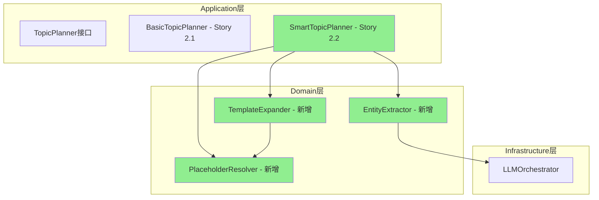
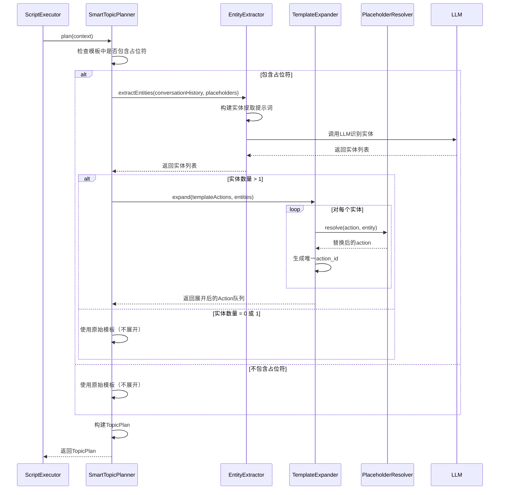
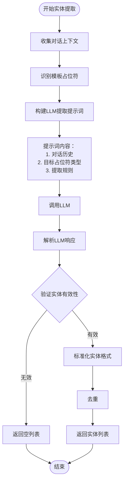
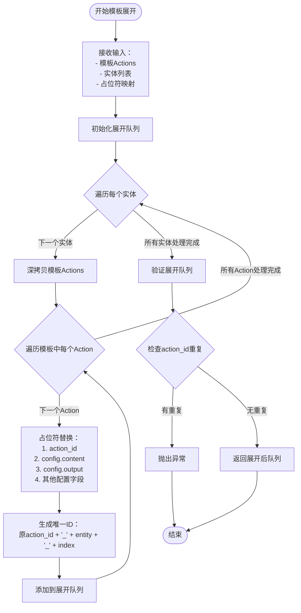
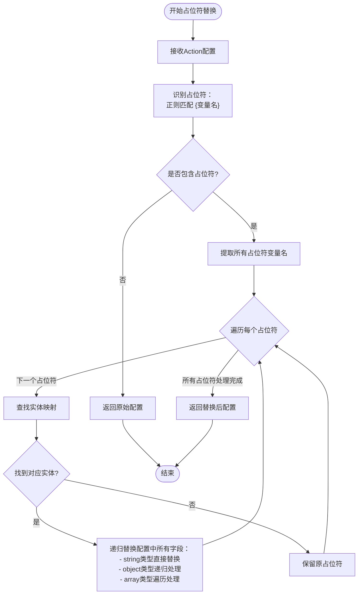

# Story 2.2: Topic根据用户输入动态展开Action队列 - 设计文档

## 需求概述

当用户在对话中提到多个实体（如"父亲、母亲、奶奶"三位抚养者）时，Topic引擎需要将预置的Action模板动态展开为多组实例化的Action序列，每组序列针对一个具体实体，实现"一对多"的子任务流生成。

## 核心价值

将Topic层从"零智能模板复制"升级为"上下文感知的动态编排"，使Topic引擎能够根据实时会话信息智能调整执行计划，实现真正的对话自适应。

## 设计目标

- 实现从用户输入中提取多个实体的能力
- 基于实体列表将Action模板展开为多组实例化序列
- 支持占位符替换，生成针对每个实体的定制化Action
- 确保展开后的Action队列顺序合理（逐个完成，避免交叉执行）
- 提供完整的决策追踪和调试信息

## 功能边界

### 本Story实现范围

- 实体提取：从用户输入和对话历史中识别关键实体
- 模板展开：将单组Action模板复制为多组实例
- 占位符替换：将模板中的占位符替换为具体实体值
- 队列管理：生成展开后的完整Action执行队列
- 决策记录：记录展开决策依据到debugInfo

### 不在本Story范围内

- 阻抗检测与安抚Action插入（Story 2.3）
- 信息充分度决策（Story 2.4）
- Topic时间预算控制（Story 2.5）
- 动作编排与优先级调整（Story 2.6）

## 系统架构调整

### 组件层次定位



### 新增核心组件

#### EntityExtractor（实体提取器）

位于Domain层，负责从对话上下文中提取关键实体。

职责：

- 分析用户输入和对话历史
- 识别与当前Topic相关的多个实体
- 调用LLM进行智能实体识别
- 返回标准化的实体列表

#### TemplateExpander（模板展开器）

位于Domain层，负责基于实体列表展开Action模板。

职责：

- 接收原始Action模板序列
- 基于实体列表生成多组实例化序列
- 调用PlaceholderResolver完成占位符替换
- 生成唯一的action_id避免冲突
- 返回展开后的完整Action队列

#### PlaceholderResolver（占位符解析器）

位于Domain层，负责占位符识别与替换。

职责：

- 识别Action配置中的占位符（如`{抚养者称呼}`）
- 将占位符替换为具体的实体值
- 支持多个位置的占位符（content、action_id、output等）
- 保持非占位符内容不变

#### SmartTopicPlanner（智能规划器）

位于Application层，继承ITopicPlanner接口，替代BasicTopicPlanner。

职责：

- 判断是否需要展开（是否包含多个实体）
- 协调EntityExtractor、TemplateExpander完成规划
- 生成TopicPlan，包含展开后的Action队列
- 记录决策过程到planningContext

## 核心流程设计

### 总体规划流程



### 实体提取流程



### 模板展开流程



### 占位符替换流程



## 数据结构设计

### TopicPlanningContext（规划上下文）

继承Story 2.1定义，新增字段用于实体提取：

```
TopicPlanningContext {
  topicConfig: {
    topic_id: 字符串
    actions: Action配置数组
    strategy: 可选字符串
  }

  variableStore: {
    global: 对象
    session: 对象
    phase: 对象
    topic: 对象
  }

  sessionContext: {
    sessionId: 字符串
    phaseId: 字符串
    conversationHistory: 对话历史数组[{
      role: 字符串（'user'/'assistant'）
      content: 字符串
    }]
  }
}
```

### TopicPlan（规划结果）

扩展Story 2.1定义，新增展开决策信息：

```
TopicPlan {
  topicId: 字符串
  plannedAt: ISO时间戳
  instantiatedActions: Action配置数组（展开后）

  planningContext: {
    variableSnapshot: VariableStore快照
    strategyUsed: 字符串

    // Story 2.2 新增字段
    expansionDecision: {
      triggerReason: 字符串（'multiple_entities' | 'no_expansion'）
      extractedEntities: 字符串数组
      templatePlaceholders: 字符串数组
      originalActionCount: 数字
      expandedActionCount: 数字
      timestamp: ISO时间戳
    }
  }
}
```

### EntityExtractionResult（实体提取结果）

```
EntityExtractionResult {
  entities: 字符串数组        // 提取到的实体列表，如 ['父亲', '母亲', '奶奶']
  confidence: 数字           // 提取置信度 0-100
  sourceText: 字符串         // 来源文本片段
  extractionMethod: 枚举     // 'llm' | 'regex' | 'keyword'
}
```

### TemplateExpansionConfig（展开配置）

```
TemplateExpansionConfig {
  templateActions: Action配置数组
  entities: 字符串数组
  placeholderMappings: 对象 {
    [占位符名称]: 字符串     // 如 {'抚养者称呼': '父亲'}
  }
  preserveOriginalIds: 布尔  // 是否保留原始action_id（默认false）
}
```

## 决策规则设计

### 展开触发条件

SmartTopicPlanner判断是否需要展开的逻辑：

1. **前置条件检查**
   - Topic.actions模板不为空
   - 至少包含一个Action

2. **占位符检查**
   - 遍历所有Action的config字段
   - 使用正则匹配占位符：`/\{([^}]+)\}/g`
   - 提取所有唯一的占位符变量名

3. **实体提取**
   - 如果找到占位符，调用EntityExtractor
   - 提取实体时考虑最近N轮对话（建议N=3）

4. **展开判断**
   ```
   如果 提取到的实体数量 >= 2：
       触发展开
   否则：
       使用原始模板（不展开）
   ```

### 实体提取策略

EntityExtractor采用以下优先级策略：

1. **LLM智能提取（主要方法）**
   - 构建结构化提示词
   - 明确指定目标类型（如"抚养者称呼"）
   - 要求返回JSON格式列表
   - 示例提示词结构：

     ```
     根据以下对话历史，提取用户提到的所有【抚养者称呼】

     对话历史：
     [对话历史内容]

     要求：
     - 仅提取明确提到的称呼（如"父亲"、"母亲"）
     - 不要推测未提及的对象
     - 以JSON数组格式返回：["称呼1", "称呼2", ...]

     提取结果：
     ```

2. **关键词匹配（降级方法）**
   - 当LLM不可用时，使用预定义关键词列表
   - 针对"抚养者"场景的示例关键词：
     - 父母类：父亲、母亲、爸爸、妈妈
     - 祖辈类：爷爷、奶奶、外公、外婆
     - 其他：继父、继母、养父、养母

3. **回退策略**
   - 如果两种方法都未提取到实体，返回空数组
   - 调用方按"不展开"路径处理

### 占位符替换规则

PlaceholderResolver遵循以下规则：

1. **占位符识别**
   - 格式：`{变量名}`
   - 变量名规则：字母、数字、下划线、中文
   - 不区分占位符的位置（可出现在任何字符串字段）

2. **替换范围**
   - action_id字段
   - config对象的所有字符串字段
   - 递归处理嵌套对象和数组

3. **替换逻辑**

   ```
   对于每个占位符 {变量名}：
       如果 变量名 在实体映射中存在：
           替换为对应实体值
       否则：
           保留占位符原样
   ```

4. **特殊处理**
   - output配置中的占位符：
     ```
     原配置：{ get: "{抚养者}_关系", define: "..." }
     实体 = "父亲"
     结果：{ get: "父亲_关系", define: "..." }
     ```

### 队列顺序策略

展开后的Action队列按以下顺序组织：

```
[实体1的Action1, 实体1的Action2, ..., 实体1的ActionN,
 实体2的Action1, 实体2的Action2, ..., 实体2的ActionN,
 ...
 实体M的Action1, 实体M的Action2, ..., 实体M的ActionN]
```

原因：

- 确保每个实体的子任务流完整执行完毕后再进入下一实体
- 避免多个实体的Action交叉执行导致用户混淆
- 符合人类对话习惯（逐个话题深入讨论）

## 错误处理策略

### 实体提取失败

场景：LLM调用失败或返回格式错误

处理：

- 记录警告日志
- 尝试关键词匹配降级方案
- 如果仍失败，返回空数组，使用原始模板

### 占位符无法替换

场景：模板中的占位符未找到对应实体

处理：

- 保留占位符原样
- 记录到debugInfo的warnings字段
- 继续执行（不阻断流程）

### action_id重复

场景：展开后生成的action_id与现有ID冲突

处理：

- 在生成ID时添加时间戳或随机后缀确保唯一性
- 格式：`{原action_id}_{实体}_{实体索引}_{时间戳后6位}`

### 模板为空

场景：Topic.actions为空数组

处理：

- 直接返回空的TopicPlan
- instantiatedActions为空数组
- 记录到planningContext.expansionDecision.triggerReason = 'no_template'

## 调试信息设计

### debugInfo结构

记录到executionState.metadata.debugInfo中：

```
debugInfo: {
  topicPlanning: {
    planningTimestamp: ISO时间戳
    planner: "SmartTopicPlanner"

    expansionDecision: {
      triggered: 布尔
      reason: 字符串（'multiple_entities' | 'single_entity' | 'no_placeholders' | 'no_entities'）

      placeholderAnalysis: {
        foundPlaceholders: 字符串数组    // 如 ['抚养者称呼']
        locations: 对象数组[{           // 占位符出现的位置
          actionId: 字符串
          field: 字符串                 // 如 'config.content'
          placeholder: 字符串
        }]
      }

      entityExtraction: {
        method: 字符串                  // 'llm' | 'keyword' | 'none'
        extractedEntities: 字符串数组
        confidence: 数字
        llmCallDuration: 毫秒数（可选）
        fallbackUsed: 布尔
      }

      templateExpansion: {
        originalActionCount: 数字
        entityCount: 数字
        expandedActionCount: 数字
        generatedActionIds: 字符串数组
      }
    }

    warnings: 字符串数组               // 如 ['占位符 {未知变量} 未找到对应实体']
  }
}
```

### 日志输出规范

SmartTopicPlanner在关键节点输出结构化日志：

```
[SmartTopicPlanner] 🔍 Analyzing template placeholders...
[SmartTopicPlanner] ✅ Found placeholders: 抚养者称呼
[SmartTopicPlanner] 🤖 Calling EntityExtractor...
[EntityExtractor] 📝 Extraction prompt constructed (120 chars)
[EntityExtractor] 🎯 LLM extracted entities: ['父亲', '母亲', '奶奶']
[SmartTopicPlanner] 📦 Expanding template: 2 actions × 3 entities = 6 actions
[TemplateExpander] 🔄 Expanding for entity: 父亲
[TemplateExpander] 🔄 Expanding for entity: 母亲
[TemplateExpander] 🔄 Expanding for entity: 奶奶
[SmartTopicPlanner] ✅ Topic plan generated: 6 actions
```

## 性能考虑

### LLM调用优化

- 实体提取的LLM调用是异步操作，建议超时时间3-5秒
- 如果Topic.actions数量较多（>10个），考虑批量处理占位符识别
- 缓存机制：相同对话上下文和占位符类型的提取结果可缓存5分钟

### 内存管理

- 模板深拷贝使用JSON.parse(JSON.stringify())，适用于配置对象
- 避免在循环中创建大量临时对象
- 展开后的Action队列建议上限：单次展开不超过50个Action

### 复杂度分析

- 占位符识别：O(N × M)，N为Action数量，M为配置字段数量
- 实体提取：O(1)，单次LLM调用
- 模板展开：O(N × E)，N为Action数量，E为实体数量
- 总体复杂度：O(N × E)，线性可控

## 测试策略

### 单元测试用例

#### EntityExtractor测试

1. 测试LLM正常提取多个实体
2. 测试LLM返回空数组
3. 测试LLM调用失败降级到关键词匹配
4. 测试关键词匹配正确识别
5. 测试去重逻辑

#### TemplateExpander测试

1. 测试单个实体不触发展开
2. 测试多个实体正确展开
3. 测试action_id唯一性
4. 测试占位符在不同位置的替换
5. 测试嵌套对象中的占位符替换
6. 测试output配置中的占位符替换

#### PlaceholderResolver测试

1. 测试简单字符串占位符替换
2. 测试多个占位符的替换
3. 测试嵌套对象递归替换
4. 测试数组元素替换
5. 测试未找到映射的占位符保留原样

#### SmartTopicPlanner测试

1. 测试不包含占位符时使用原始模板
2. 测试包含占位符但只提取到1个实体时不展开
3. 测试提取到多个实体时正确展开
4. 测试planningContext记录完整决策信息
5. 测试与Story 2.1的BasicTopicPlanner行为兼容

### 集成测试用例

#### E2E场景测试

1. **多抚养者场景**
   - 用户输入："我的父亲、母亲和奶奶都对我很好"
   - 验证：提取3个实体，展开为3组Action序列
   - 验证：每组序列的占位符正确替换
   - 验证：执行顺序正确

2. **单一实体场景**
   - 用户输入："我的父亲对我很严格"
   - 验证：提取1个实体，不展开，使用原始模板
   - 验证：占位符替换为"父亲"

3. **无实体场景**
   - 用户输入："抚养者关系很复杂"
   - 验证：未提取到具体实体，不展开
   - 验证：保留占位符原样或使用默认值

4. **复杂Action模板**
   - 模板包含3个Action：ai_say, ai_ask, ai_say
   - 验证：每个实体生成3个Action
   - 验证：action_id无重复
   - 验证：config.output正确处理

### 回归测试

确保Story 2.2不破坏Story 2.1的功能：

1. 测试不包含占位符的Topic仍正常执行
2. 测试strategy字段正确传递
3. 测试variableStore快照正确记录
4. 测试currentTopicPlan正确存储到ExecutionState

## 兼容性设计

### 向后兼容

- SmartTopicPlanner实现ITopicPlanner接口，与BasicTopicPlanner可互换
- 依赖注入机制允许在ScriptExecutor中灵活切换规划器
- 不展开场景下，SmartTopicPlanner行为与BasicTopicPlanner完全一致

### 渐进式启用

建议通过配置开关控制规划器选择：

```
配置项：topic_planner_mode
可选值：
  - 'basic'：使用BasicTopicPlanner（Story 2.1）
  - 'smart'：使用SmartTopicPlanner（Story 2.2）

默认值：'smart'
```

实现方式：

- 在ScriptExecutor构造函数中根据配置选择规划器
- 允许Session级别覆盖全局配置

### Schema兼容性

Topic YAML Schema无需变更：

- actions字段保持不变
- strategy字段保持可选
- 占位符语法与现有变量语法一致

## 验收标准映射

| 验收标准                           | 设计实现点                                      | 验证方式                     |
| ---------------------------------- | ----------------------------------------------- | ---------------------------- |
| 提及多抚养者时自动展开为多个子任务 | SmartTopicPlanner.plan()判断实体数量>=2触发展开 | 集成测试：输入包含3个实体    |
| 每个子任务的Action正确替换占位符   | PlaceholderResolver递归替换所有字段             | 单元测试：验证替换结果       |
| 执行顺序合理(逐个完成,而非交叉)    | TemplateExpander按实体顺序展开                  | 集成测试：验证Action队列顺序 |
| debugInfo记录展开决策依据          | TopicPlan.planningContext.expansionDecision     | 单元测试：检查字段完整性     |
| 单元测试覆盖1-5个实体的展开场景    | 测试套件包含0/1/2/3/5个实体的用例               | 单元测试执行报告             |

## 实现优先级

### P0 - 核心功能（必须完成）

1. EntityExtractor基础实现（LLM方法）
2. TemplateExpander展开逻辑
3. PlaceholderResolver占位符替换
4. SmartTopicPlanner集成三个组件
5. TopicPlan数据结构扩展

### P1 - 增强功能（建议完成）

1. EntityExtractor关键词降级方案
2. debugInfo完整记录
3. 结构化日志输出
4. 配置开关支持

### P2 - 优化功能（可选完成）

1. LLM调用结果缓存
2. 复杂嵌套对象的占位符处理优化
3. 性能监控埋点

## 技术债务记录

### 已知限制

1. **占位符语法单一**
   - 当前仅支持`{变量名}`格式
   - 未来可扩展支持`{变量名:默认值}`等复杂语法

2. **实体类型固定**
   - 当前仅通过对话上下文提取实体
   - 未来可支持从VariableStore读取已提取的实体变量

3. **展开策略固定**
   - 当前仅支持"逐个完成"顺序
   - 未来可支持"并行执行"、"优先级排序"等策略

### 后续演进方向

1. **与Story 2.4集成**
   - 展开时考虑信息充分度
   - 动态调整每个实体的Action深度

2. **与Story 2.6集成**
   - 展开后支持动态插入安抚Action
   - 支持基于阻抗跳过部分实体

3. **与变量作用域集成**
   - 为每个实体创建独立的子作用域
   - 避免不同实体的变量相互覆盖

## 风险评估

### 高风险项

1. **LLM提取准确性**
   - 风险：LLM可能识别错误或遗漏实体
   - 缓解：提供关键词降级方案，记录confidence评分

2. **action_id冲突**
   - 风险：展开时生成的ID与现有ID重复
   - 缓解：采用组合ID策略（原ID+实体+索引+时间戳）

### 中风险项

1. **性能开销**
   - 风险：大量Action展开导致内存占用增加
   - 缓解：设置展开上限（单次不超过50个Action）

2. **调试复杂度**
   - 风险：展开后的队列难以追踪
   - 缓解：完善debugInfo记录，提供可视化工具（后续Story）

### 低风险项

1. **配置兼容性**
   - 风险：现有脚本需要调整
   - 缓解：向后兼容，不影响无占位符的脚本

## 依赖关系

### 前置依赖

- ✅ Story 2.1：TopicPlanner接口定义
- ✅ Story 2.1：BasicTopicPlanner基础实现
- ✅ LLM编排引擎：支持异步调用
- ✅ 变量作用域系统：VariableStore和VariableScopeResolver

### 后续依赖本Story

- Story 2.3：阻抗检测与安抚Action插入（基于展开后的队列）
- Story 2.4：信息充分度决策（影响展开策略）
- Story 2.6：动作编排（基于展开后的队列调整）

## 实施建议

### 开发顺序

1. 实现PlaceholderResolver（最独立）
2. 实现EntityExtractor（依赖LLM）
3. 实现TemplateExpander（依赖PlaceholderResolver）
4. 实现SmartTopicPlanner（集成三个组件）
5. 编写单元测试
6. 编写集成测试
7. 更新文档

### 验证脚本

创建验证脚本：`scripts/sessions/story-2.2-verification-test.yaml`

核心验证点：

- Topic包含占位符的actions模板
- 用户输入包含多个实体
- 验证展开后的Action队列
- 验证占位符替换结果
- 验证debugInfo记录

### 代码审查要点

1. EntityExtractor的提示词是否清晰有效
2. TemplateExpander的深拷贝是否完整
3. PlaceholderResolver是否处理了所有字段类型
4. SmartTopicPlanner的决策逻辑是否正确
5. debugInfo是否记录完整
6. 单元测试覆盖率是否达标
7. 错误处理是否健壮

## 文档更新

需要更新的文档：

1. **TOPIC_CONFIGURATION_GUIDE.md**
   - 添加"占位符语法"章节
   - 添加"动态展开示例"
   - 更新"常见问题"

2. **DEVELOPMENT_GUIDE.md**
   - 添加SmartTopicPlanner使用说明
   - 添加自定义EntityExtractor方法

3. **API文档**（如有）
   - 更新TopicPlan数据结构
   - 更新TopicPlanningContext数据结构

4. **productbacklog.md**
   - 更新Story 2.2实现状态
   - 记录完成日期和验证结果
