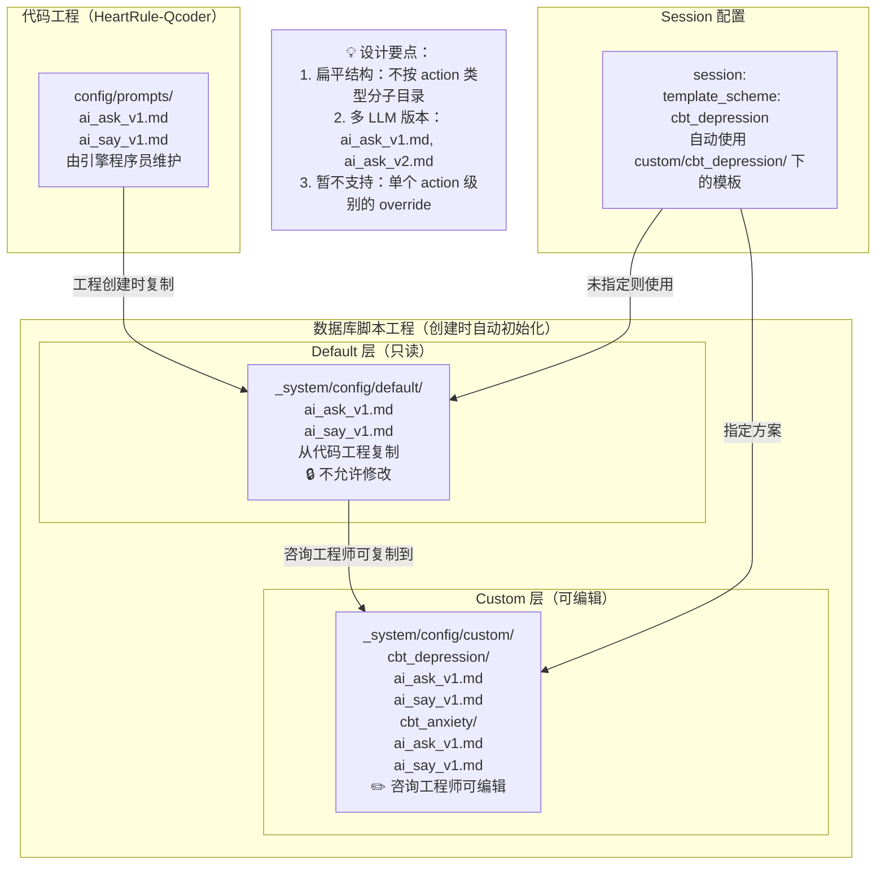
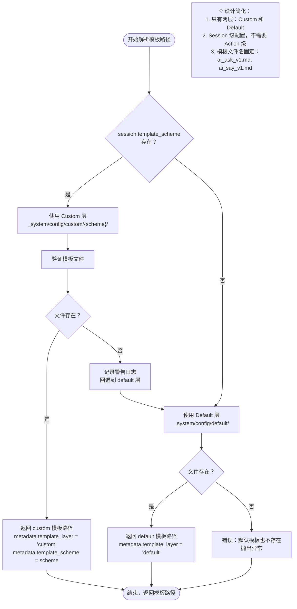
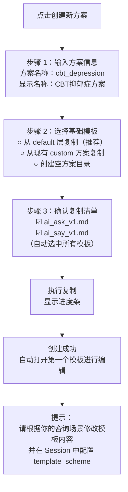
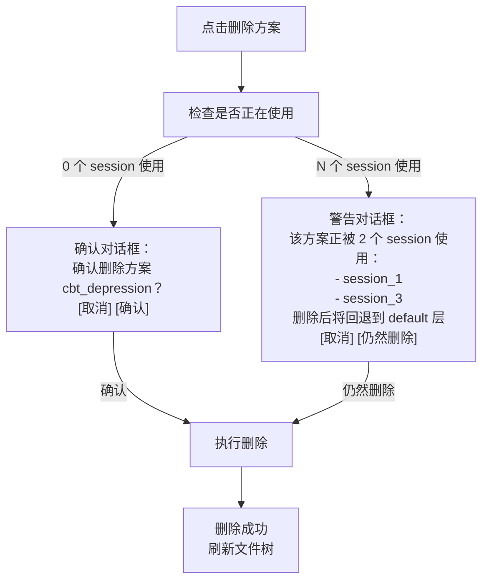
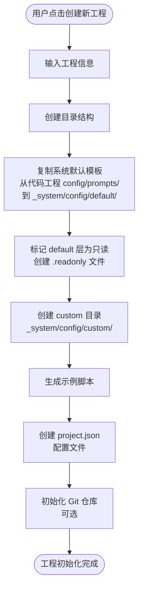
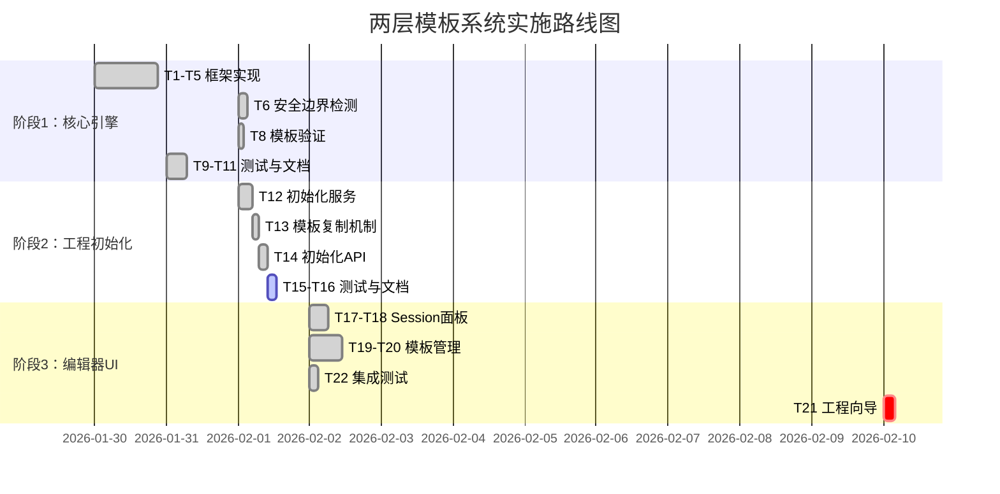

# Story 1.3 统一模板系统完善 - 设计文档

## 一、需求背景

### 1.1 Story 回顾

基于 Product Backlog 中 Story 1.3 的要求，需要完善 Action 层的统一提示词模板系统。核心目标是：

- 在 `engines/prompt-template` 下为每种 Action 类型创建默认模板
- 模板包含：输出格式定义、上下文引用规则、**安全边界说明**
- 脚本中只需编写业务目标，系统自动组装完整提示词
- 支持在 session 中指定数据库脚本工程中 custom 目录下的模板方案（`template_scheme`）

### 1.2 现状分析

经过详细的工程现状分析，当前实现已完成以下部分：

**已完成**：

- ✅ 统一模板管理器（`PromptTemplateManager`）已实现
- ✅ ai_ask / ai_say 默认模板及集成已落地
- ✅ 模板包含清晰的输出格式定义和上下文引用规则
- ✅ 模板渲染逻辑的单元测试已存在

**未完成（本次设计重点）**：

- ❌ **安全边界说明缺失**：所有现有模板都没有「安全边界」段落
- ❌ **两层模板方案机制未实现**：需要实现 default 层（只读）和 custom 层（可编辑）的两层模板系统，支持通过 session 节点的 `template_scheme` 字段指定使用的方案

### 1.3 设计目标

本次设计聚焦于完成以下核心功能：

1. **在编辑器中应用多层模板**：建立两层方案机制（default + custom），在编辑器中提供可视化的模板方案管理和应用能力，支持咨询工程师灵活配置和切换模板方案
2. **安全边界系统**：为 ai_ask 和 ai_say 模板增加统一的安全边界说明段落，通过 LLM 智能判定确保咨询过程的安全性
3. **可扩展框架地基**：构建可扩展的模板解析框架和方案管理机制，为未来演进奠定基础

---

## 二、安全边界系统设计

### 2.1 设计原则

安全边界是咨询智能系统的核心防护机制，需要在 LLM 提示词层面明确约束 AI 的行为边界，确保系统符合伦理规范和法律要求。

**核心原则**：

- **统一性**：所有 Action 类型共享基础安全边界规范
- **分层性**：通用安全规范 + Action 特定安全约束
- **可追溯性**：安全边界违反应记录到 debugInfo
- **优先级**：安全边界约束优先级最高，覆盖业务指令

### 2.2 安全边界分类体系

安全边界分为三个层次：

#### 层次 1：系统级通用安全边界（所有 Action 必须遵守）

| 边界类别 | 约束内容                                                   | 适用场景       |
| -------- | ---------------------------------------------------------- | -------------- |
| 诊断禁止 | 禁止对用户进行任何精神疾病诊断或症状判定                   | 所有交互       |
| 处方禁止 | 禁止推荐药物、剂量或治疗方案                               | 所有交互       |
| 危机识别 | 必须识别自伤/他伤/自杀意念等危机信号                       | ai_ask, ai_say |
| 危机响应 | 检测到危机信号时，必须上报并建议寻求专业帮助               | ai_ask, ai_say |
| 隐私保护 | 不得询问或记录不必要的敏感个人信息（身份证号、家庭住址等） | ai_ask         |
| 伦理中立 | 不对用户的价值观、信仰、性取向进行评判                     | ai_say         |
| 角色边界 | 明确声明自己是辅助工具，不能替代专业咨询师                 | ai_say         |

#### 层次 2：Action 类型特定安全边界

**ai_ask 特定约束**：

- 敏感话题询问前需给予用户心理准备提示
- 不得强迫用户回答不愿意分享的问题
- 检测到用户不适或抗拒时，应提供跳过选项

**ai_say 特定约束**：

- 解释心理学概念时禁止简化为「非黑即白」的判断
- 不得使用可能引发焦虑的绝对化表述（如"你肯定有问题"）
- 提供建议时必须使用「建议」「可以尝试」等弱化表达

#### 层次 3：业务场景特定安全边界（未来扩展）

某些特殊 Topic 可能需要额外的安全约束，例如：

- 创伤主题探索：需要更高的敏感度警告
- 儿童咨询场景：需要符合未成年人保护法规
- 危机干预场景：需要强制性的专业转介流程

这类边界通过 `config.safety_constraints` 字段扩展，不在默认模板中硬编码。本阶段暂不实现，预留扩展接口。

### 2.3 模板中的安全边界实现方式

#### 方案设计

在每个 Action 默认模板中增加**【安全边界与伦理规范】**段落，位于「你的任务」之前，确保 LLM 首先建立安全意识。

**模板结构调整**：

```
现时间 {{time}}，你是 {{who}}。请延续对话...

【当前情境】（各类上下文变量）
...

【安全边界与伦理规范】⭐ 新增段落
...

【你的任务】
...

【输出格式】
...
```

#### 安全边界段落内容规范

**通用安全边界模板片段**（所有 Action 共享）：

```markdown
【安全边界与伦理规范】

你必须严格遵守以下安全边界，这些规范的优先级高于其他所有指令：

**绝对禁止的行为**：

1. 诊断禁止：不得对用户进行任何精神疾病诊断或症状判定（如"你有抑郁症""这是焦虑症的典型表现"）
2. 处方禁止：不得推荐药物、剂量或治疗方案（包括中药、保健品）
3. 保证禁止：不得对疗效或改善做任何承诺或保证（如"这样做一定会好转"）

**危机识别与响应**：

- 如果用户表达自伤、自杀意念或他伤倾向，立即在输出中标记 `crisis_detected: true`
- 危机信号包括但不限于：明确的自杀计划、严重的自我伤害行为、对他人的暴力冲动
- 检测到危机时，你的回复应温和地建议用户寻求专业帮助（心理热线：400-161-9995）

**隐私与伦理**：

- 保持伦理中立，不评判用户的价值观、信仰、性取向、生活方式
- 尊重用户的自主权，不强迫分享不愿意透露的信息
- 承认你是辅助工具，无法替代专业心理咨询师或医生
```

**Action 特定扩展**：

- **ai_ask 扩展**：

```markdown
**ai_ask 特定约束**：

- 询问敏感话题前，给予用户心理准备提示（如"接下来的问题可能涉及一些私密感受，如果你不愿意回答可以告诉我"）
- 检测到用户不适或抗拒时（如回答"不想说""算了"），不要继续追问，可以转换话题或提供跳过选项
- 不要在一轮对话中询问过多问题，保持单一焦点
```

- **ai_say 扩展**：

```markdown
**ai_say 特定约束**：

- 解释心理学概念时避免绝对化表述，使用"通常""可能""有些人"等限定词
- 提供建议时使用"可以尝试""建议考虑"等弱化表达，而非"你应该""你必须"
- 避免使用可能引发焦虑的词汇（如"严重""危险""失败"），除非必要时需用中性语言说明
```

### 2.4 安全边界违反检测机制

#### 设计理念

安全边界的遵守主要依赖 LLM 的指令跟随能力，但系统需要**智能检测机制**作为兴底。关键词检测虽然快但难以覆盖各类情况，应采用 **LLM 智能判定** 方式。

**核心策略**：

- **同步检测**：在主 LLM 生成咨询师回复时，同时输出风险检测字段
- **结构化输出**：所有咨询动作统一输出为 JSON 格式，包含安全风险字段
- **二次确认**：初步检测到风险时，启动第二次 LLM 检测进行确认
- **安全优先**：虽然两次 LLM 调用会增加响应时间，但在安全问题上可以接受

#### 统一 JSON 输出格式

所有咨询 Action（ai_ask, ai_say）都须在模板中定义统一的 JSON 输出格式：

```json
{
  "content": "咨询师的回复内容",
  "safety_risk": {
    "detected": false,
    "risk_type": null,
    "confidence": "high",
    "reason": null
  },
  "metadata": {
    "emotional_tone": "supportive",
    "crisis_signal": false
  }
}
```

**字段说明**：

| 字段                     | 类型           | 说明                                                                       |
| ------------------------ | -------------- | -------------------------------------------------------------------------- |
| `content`                | string         | 咨询师的回复内容，直接展示给用户                                           |
| `safety_risk.detected`   | boolean        | **系统变量**：是否检测到安全风险                                           |
| `safety_risk.risk_type`  | string \| null | 风险类型：`diagnosis`, `prescription`, `guarantee`, `inappropriate_advice` |
| `safety_risk.confidence` | string         | 判定置信度：`high`, `medium`, `low`                                        |
| `safety_risk.reason`     | string \| null | 简要说明风险原因（供调试使用）                                             |
| `metadata.crisis_signal` | boolean        | **系统变量**：是否检测到危机信号（自伤/自杀/他伤）                         |

**约定系统变量**：

- 主系统变量：`safety_risk.detected`
- 补充变量：`metadata.crisis_signal`
- 引擎在主 LLM 输出后立即从 JSON 中提取这些字段判定是否需要启动安全应对处理

#### 模板中的安全检测指令

在每个 Action 模板的【输出格式】段落中，增加安全检测指令：

````markdown
【输出格式】

你必须输出为以下 JSON 格式：

```json
{
  "content": "你的回复内容",
  "safety_risk": {
    "detected": false, // 必须在生成回复后立即判断：是否违反了【安全边界与伦理规范】
    "risk_type": null, // 如果 detected=true，填写："diagnosis", "prescription", "guarantee", "inappropriate_advice"
    "confidence": "high", // 判定置信度："high", "medium", "low"
    "reason": null // 如果 detected=true，简要说明原因
  },
  "metadata": {
    "emotional_tone": "supportive", // 情绪色调：supportive, neutral, concerned
    "crisis_signal": false // 用户是否表达了自伤/自杀/他伤意念
  }
}
```
````

**关键要求**：

1. `safety_risk.detected` 字段是系统约定的安全检测变量，你必须认真对照【安全边界与伦理规范】进行判断
2. 如果你的回复中出现了诊断、处方、保证性表述或不适当建议，必须设置 `detected: true`
3. 该检测是你的自我审查，请诚实判断，不要过度自信

````

#### 检测流程设计

```mermaid
flowchart TD
    Start["用户发送消息"] --> BuildPrompt["拼接提示词<br/>（包含安全边界指令）"]

    BuildPrompt --> LLM1["主 LLM 生成咨询回复<br/>输出 JSON 格式"]

    LLM1 --> ParseJSON["引擎解析 JSON"]

    ParseJSON --> CheckRisk{"检查 safety_risk.detected"}

    CheckRisk -->|false| CheckCrisis{"检查 crisis_signal"}
    CheckRisk -->|true| CheckConfidence{"检查 confidence 等级"}

    CheckConfidence -->|high| SecondLLM["启动二次 LLM 确认<br/>参数：原始回复 + 风险类型"]
    CheckConfidence -->|medium/low| LogWarning["记录警告日志<br/>但不阻断回复"]

    SecondLLM --> SecondCheck{"二次确认结果"}

    SecondCheck -->|确认违反| BlockResponse["阻断回复<br/>记录到 debugInfo<br/>返回安全兑底回复"]
    SecondCheck -->|否定违反| LogWarning

    LogWarning --> CheckCrisis
    BlockResponse --> End["返回结果"]

    CheckCrisis -->|true| TriggerCrisis["触发危机协议<br/>（Session 层处理）"]
    CheckCrisis -->|false| ReturnContent["返回 content 给用户"]

    TriggerCrisis --> End
    ReturnContent --> End
````

#### 二次 LLM 确认机制

当主 LLM 输出 `safety_risk.detected: true` 且 `confidence: high` 时，启动第二次 LLM 调用进行确认。

**二次确认提示词模板**：

````markdown
你是一个心理咨询安全审查专家。请对以下 AI 咨询师的回复进行安全边界检查。

【原始回复】
{{original_response}}

【初步检测结果】

- 风险类型：{{risk_type}}
- 原因：{{reason}}

【安全边界规范】

1. 诊断禁止：不得对用户进行任何精神疾病诊断或症状判定
2. 处方禁止：不得推荐药物、剂量或治疗方案
3. 保证禁止：不得对疗效或改善做任何承诺或保证
4. 不适当建议：不得给出可能导致心理伤害或误导的建议

【你的任务】
请仔细分析原始回复，判断是否真的违反了安全边界规范。

输出 JSON 格式：

```json
{
  "violation_confirmed": false, // 是否确认违反
  "risk_level": "low", // 风险等级：critical, high, medium, low
  "detailed_reason": "详细说明为什么违反或不违反",
  "suggested_action": "allow" // 建议操作：block, warn, allow
}
```
````

````

**二次确认处理策略**：

| 二次确认结果 | 处理策略 |
|--------------|----------|
| `violation_confirmed: true` 且 `risk_level: critical/high` | 阻断原始回复，返回安全兑底回复，记录到 debugInfo |
| `violation_confirmed: true` 且 `risk_level: medium` | 记录警告日志，允许回复通过，附加 metadata |
| `violation_confirmed: false` | 否定违反，正常返回原始回复 |

#### 安全兑底回复

当确认违反安全边界时，系统使用预定义的安全兑底回复：

```markdown
抱歉，我刚才的回复可能不够准确。请注意，我是一个 AI 辅助工具，不能替代专业心理咨询师或医生。关于你的情况，建议咨询专业人士获取更准确的建议。

如果你需要紧急帮助，请拨打：
- 24小时心理危机干预热线：400-161-9995
- 紧急医疗服务：120
````

#### 实现方式

在 `BaseAction` 中增加保护方法：

**方法签名**：

```typescript
// 1. 解析 JSON 输出
protected parseStructuredOutput(aiMessage: string): StructuredActionOutput

interface StructuredActionOutput {
  content: string;
  safety_risk: {
    detected: boolean;
    risk_type: 'diagnosis' | 'prescription' | 'guarantee' | 'inappropriate_advice' | null;
    confidence: 'high' | 'medium' | 'low';
    reason: string | null;
  };
  metadata: {
    emotional_tone?: string;
    crisis_signal: boolean;
  };
}

// 2. 二次 LLM 确认
protected async confirmSafetyViolation(
  originalResponse: string,
  riskType: string,
  reason: string
): Promise<SafetyConfirmationResult>

interface SafetyConfirmationResult {
  violation_confirmed: boolean;
  risk_level: 'critical' | 'high' | 'medium' | 'low';
  detailed_reason: string;
  suggested_action: 'block' | 'warn' | 'allow';
}

// 3. 生成安全兑底回复
protected generateSafeFallbackResponse(): string
```

**调用时机**：

```typescript
// 在 Action 子类的 execute() 中
const aiMessage = await this.llmService.complete(prompt);

// 1. 解析结构化输出
const structured = this.parseStructuredOutput(aiMessage);

// 2. 检查安全风险
if (structured.safety_risk.detected && structured.safety_risk.confidence === 'high') {
  // 3. 二次确认
  const confirmation = await this.confirmSafetyViolation(
    structured.content,
    structured.safety_risk.risk_type!,
    structured.safety_risk.reason!
  );

  if (confirmation.violation_confirmed && ['critical', 'high'].includes(confirmation.risk_level)) {
    // 4. 使用安全兑底回复
    const safeFallback = this.generateSafeFallbackResponse();
    return {
      success: true,
      aiMessage: safeFallback,
      metadata: {
        safety_violation_detected: true,
        blocked_response: structured.content,
        risk_type: structured.safety_risk.risk_type,
        confirmation: confirmation,
      },
    };
  }
}

// 5. 检查危机信号
if (structured.metadata.crisis_signal) {
  // 触发危机协议（由 Session 层处理）
  metadata.crisis_detected = true;
}

// 6. 返回正常回复
return {
  success: true,
  aiMessage: structured.content,
  metadata: {
    safety_check: {
      passed: true,
      initial_detection: structured.safety_risk,
    },
    crisis_detected: structured.metadata.crisis_signal,
  },
};
```

### 2.5 模板文件更新清单

需要更新以下现有模板文件：

| 文件路径                                                | 更新内容                                             |
| ------------------------------------------------------- | ---------------------------------------------------- |
| `config/prompts/ai-ask/simple-ask.md`                   | 增加【安全边界与伦理规范】段落（通用 + ai_ask 特定） |
| `config/prompts/ai-ask/multi-round-ask.md`              | 同上                                                 |
| `config/prompts/ai-say/mainline-a-introduce-concept.md` | 增加【安全边界与伦理规范】段落（通用 + ai_say 特定） |

---

### 三、模板两层方案机制设计

### 3.1 设计理念

模板系统采用**两层方案机制**，从只读默认模板到可自定义方案模板，确保系统稳定性与咨询灵活性的平衡。

**核心原则**：

- **扁平化结构**：模板不按 action 类型分子目录，所有模板在同一层级，避免复杂度
- **方案隔离**：custom 目录下每个子目录是独立的咨询方案（如 cbt_depression、cbt_anxiety）
- **Session 级配置**：通过 session 节点的 `template_scheme` 字段统一配置整个会话使用的模板方案
- **多 LLM 支持**：同一 action 类型可有多个模板版本（如 ai_ask_v1.md、ai_ask_v2.md）
- **多语言工程化**：不同语言通过独立脚本工程管理（如 CBT 抑郁症中文版、英文版为两个独立工程）

### 3.2 两层方案机制架构



### 3.3 两层详细设计

#### Default 层：只读默认模板

**目录结构**：

```
/{数据库脚本工程}/
  _system/
    config/
      default/          # 只读层
        ai_ask_v1.md    # ai_ask 默认模板版本1
        ai_ask_v2.md    # ai_ask 默认模板版本2（未来可能）
        ai_say_v1.md    # ai_say 默认模板版本1
        ai_say_v2.md    # ai_say 默认模板版本2（未来可能）
        .readonly       # 只读标记文件
```

**特征**：

- **来源**：从代码工程 `c:\\CBT\\HeartRule-Qcoder\\config\\prompts\\` 复制而来
- **时机**：在编辑器中创建数据库脚本工程时自动复制
- **维护者**：引擎开发程序员维护代码工程中的默认模板
- **权限**：🔒 只读，咨询工程师不允许修改
- **内容**：包含通用安全边界约束、系统级变量支持（`{{chat}}`, `{{time}}`, `{{who}}`, `{{user}}`等）
- **版本支持**：随着 LLM 发展可能有多个版本（v1, v2 等）
- **扁平结构**：所有模板在同一目录下，不按 action 类型分子目录

**验证规则**：

- 编辑器 UI 层强制只读保护，阻止直接修改
- API 层拒绝对 `_system/config/default/` 下文件的写操作
- 用户如需修改，必须复制到 custom 层

---

#### Custom 层：可自定义方案模板

**目录结构**：

```
/{数据库脚本工程}/
  _system/
    config/
      custom/                # 可编辑层
        cbt_depression/      # 方案1：CBT抑郁症专用
          ai_ask_v1.md
          ai_say_v1.md
        cbt_anxiety/         # 方案2：CBT焦虑症专用
          ai_ask_v1.md
          ai_say_v1.md
        dbt_emotion/         # 方案3：DBT情绪调节
          ai_ask_v1.md
          ai_say_v1.md
```

**特征**：

- **创建方式**：咨询工程师从 default 层复制模板到 custom/{方案名}/ 目录
- **权限**：✏️ 可编辑，咨询工程师可自由修改
- **方案隔离**：每个子目录是独立的咨询方案，对应特定症状或咨询类型
- **扁平结构**：每个方案目录下所有模板在同一层级
- **多版本支持**：可以同时保留多个 LLM 版本的模板

**应用场景**：

- **症状差异化**：抑郁症 vs 焦虑症使用不同的提问策略
- **咨询流派**：CBT vs DBT 使用不同的话术风格
- **人群定制**：儿童咨询 vs 成人咨询使用不同的语言风格

**维护方式**：

- 通过编辑器的“模板方案管理”功能
- 支持从 default 复制创建新方案
- 支持编辑、删除、重命名方案
- 支持导入/导出方案（便于团队共享）

---

#### Session 级配置方式

**配置示例**：

```yaml
session:
  session_id: cbt_depression_session
  template_scheme: 'cbt_depression' # 指向 custom/cbt_depression/ 方案

  phases:
    - phase_id: assessment
      topics:
        - topic_id: mood_assessment
          actions:
            - action_type: ai_ask
              # 自动使用 _system/config/custom/cbt_depression/ai_ask_v1.md
              content: '请描述你最近两周的情绪状态'
              output:
                - 情绪描述

            - action_type: ai_say
              # 自动使用 _system/config/custom/cbt_depression/ai_say_v1.md
              content: |
                抑郁情绪是一种常见的心理体验。
                我们需要更多了解，才能帮助你找到合适的应对方式。
```

**字段说明**：

- `template_scheme`: 指定使用的模板方案目录名
- 值为 custom 目录下的子目录名（如 `cbt_depression`）
- **不需要为每个 action 单独配置模板路径**
- 如果未配置 `template_scheme`，则使用 default 层的默认模板

**解析优先级**：

1. **有 `template_scheme` 配置**：使用 `_system/config/custom/{template_scheme}/ai_ask_v1.md`
2. **无 `template_scheme` 配置**：使用 `_system/config/default/ai_ask_v1.md`
3. **模板不存在**：记录警告，回退到 default 层

**实现对不同症状的模板切换**：

```yaml
# 抑郁症 Session
session:
  session_id: depression_session
  template_scheme: "cbt_depression"  # 使用抑郁症专用模板
  ...

---

# 焦虑症 Session
session:
  session_id: anxiety_session
  template_scheme: "cbt_anxiety"     # 使用焦虑症专用模板
  ...
```

**暂不支持的特性**：

- ❌ 不支持对 session 中单个 ai_say/ai_ask 的 override
- ❌ 不支持在 action 级别单独指定模板路径
- 原因：避免配置过于复杂，保持 Session 级统一配置

### 3.4 多语言工程化方案

**设计原则**：

- 不同语言通过**独立脚本工程**管理，避免在模板系统中增加语言维度复杂度
- 每个语言版本工程包含该语言的完整模板和脚本内容
- 语言版本工程可通过工程复制 + 批量替换快速创建

**实施示例**：

```
脚本工程仓库结构：
  /cbt-depression-zh-CN/          # CBT抑郁症中文版工程
    config/prompts/
      psychology/cbt/assessment/ai-ask/structured-ask.md
    scripts/
      cbt_depression_assessment.yaml

  /cbt-depression-en-US/          # CBT抑郁症英文版工程（从中文版复制而来）
    config/prompts/
      psychology/cbt/assessment/ai-ask/structured-ask.md  # 英文版模板
    scripts/
      cbt_depression_assessment.yaml  # 英文版脚本
```

**多语言工程创建流程**：

1. 基于现有中文版工程创建副本
2. 批量替换模板文件中的提示词文本（保留变量占位符 `{{variable}}`）
3. 批量替换脚本文件中的业务文本（如 `content` 字段）
4. 可选：调整文化适配内容（如礼貌用语、表达习惯）

**优势**：

- 避免模板系统增加语言维度的复杂度
- 每个语言版本工程独立维护，互不影响
- 便于版本控制和团队协作（不同语言团队负责各自工程）
- 未来如需语言内模板分层，可在单个工程内扩展

---

### 3.5 模板路径解析流程



**解析逻辑说明**：

1. **检查 Session 配置**：
   - 读取 session 节点中的 `template_scheme` 字段
   - 如果存在，使用 `_system/config/custom/{template_scheme}/ai_{action_type}_v1.md`

2. **Custom 层验证**：
   - 检查模板文件是否存在
   - 如果存在，直接返回
   - 如果不存在，记录警告并回退到 default 层

3. **Default 层兜底**：
   - 使用 `_system/config/default/ai_{action_type}_v1.md`
   - 如果 default 层模板也不存在，抛出异常（工程初始化问题）

4. **Metadata 记录**：
   - `template_layer`: 记录使用的层级（'custom' 或 'default'）
   - `template_scheme`: 如果使用 custom 层，记录方案名
   - `template_path`: 实际使用的模板文件路径
     CheckLayer3Exists -->|是| ReturnLayer3["返回场景模板<br/>metadata.template_layer = 'domain_scenario'"]
     CheckLayer3Exists -->|否| CheckDomain

### 3.6 实现方案

#### BaseAction 基类扩展

新增模板路径解析方法：

**方法签名**：

```typescript
protected resolveTemplatePath(
  actionType: string,          // 如 'ai_ask', 'ai_say'
  sessionConfig: SessionConfig  // Session 配置
): TemplateResolutionResult

interface TemplateResolutionResult {
  path: string;                    // 最终模板路径
  layer: 'custom' | 'default';     // 使用的层级
  scheme?: string;                 // 如果是 custom 层，记录方案名
}

interface SessionConfig {
  template_scheme?: string;        // Session 级模板方案配置
}
```

**逻辑实现**：

```typescript
protected resolveTemplatePath(
  actionType: string,
  sessionConfig: SessionConfig
): TemplateResolutionResult {
  const templateFileName = `${actionType}_v1.md`; // 默认使用 v1 版本

  // 1. 检查 Session 配置的 template_scheme
  if (sessionConfig.template_scheme) {
    const customPath = path.join(
      this.projectPath,
      '_system/config/custom',
      sessionConfig.template_scheme,
      templateFileName
    );

    // 2. 验证 custom 层模板是否存在
    if (fs.existsSync(customPath)) {
      return {
        path: customPath,
        layer: 'custom',
        scheme: sessionConfig.template_scheme
      };
    }

    // 3. 如果不存在，记录警告并回退到 default 层
    console.warn(
      `Custom template not found: ${customPath}. ` +
      `Falling back to default template.`
    );
  }

  // 4. 使用 default 层模板
  const defaultPath = path.join(
    this.projectPath,
    '_system/config/default',
    templateFileName
  );

  // 5. 验证 default 层模板是否存在
  if (!fs.existsSync(defaultPath)) {
    throw new Error(
      `Default template not found: ${defaultPath}. ` +
      `This indicates a project initialization issue.`
    );
  }

  return {
    path: defaultPath,
    layer: 'default'
  };
}
```

**错误处理**：

| 错误类型             | 处理策略                                      |
| -------------------- | --------------------------------------------- |
| Custom 层模板不存在  | 记录警告，回退到 default 层                   |
| Default 层模板不存在 | 抛出异常，提示工程初始化问题                  |
| 模板文件格式错误     | 在模板加载时由 TemplateManager 检查并抛出异常 |

---

### 3.7 各 Action 集成方式

在 `AiAskAction`, `AiSayAction` 的模板加载逻辑中调用路径解析方法：

**改造前**：

```typescript
const templatePath = `ai-ask/${templateType}.md`;
const template = await this.templateManager.loadTemplate(templatePath);
```

**改造后**：

```typescript
// 1. 从上下文获取 session 配置
const sessionConfig = {
  template_scheme: this.context.sessionConfig?.template_scheme,
};

// 2. 解析模板路径
const resolution = this.resolveTemplatePath('ai_ask', sessionConfig);

// 3. 加载模板
const template = await this.templateManager.loadTemplate(resolution.path);

// 4. 记录到 metadata
metadata.template_path = resolution.path;
metadata.template_layer = resolution.layer;
if (resolution.scheme) {
  metadata.template_scheme = resolution.scheme;
}
```

**AiAskAction 示例**：

```typescript
class AiAskAction extends BaseAction {
  async execute(context: ExecutionContext): Promise<ActionResult> {
    // 1. 解析模板路径
    const resolution = this.resolveTemplatePath('ai_ask', {
      template_scheme: context.sessionConfig?.template_scheme,
    });

    // 2. 加载模板
    const template = await this.templateManager.loadTemplate(resolution.path);

    // 3. 渲染模板（替换变量）
    const prompt = this.renderTemplate(template, {
      content: this.config.content,
      variables: context.variables,
    });

    // 4. 调用 LLM
    const response = await this.llmService.chat(prompt);

    // 5. 返回结果并记录 metadata
    return {
      success: true,
      data: response,
      metadata: {
        template_path: resolution.path,
        template_layer: resolution.layer,
        template_scheme: resolution.scheme,
      },
    };
  }
}
```

---

### 3.8 模板验证机制

#### 验证时机

- **工程初始化时**：验证 default 层模板是否完整复制
- **创建 custom 模板时**：验证模板格式和安全边界约束
- **Session 执行时**：验证配置的 template_scheme 是否存在
- **模板加载时**：TemplateManager 验证文件格式和内容

#### 验证规则

| 验证项                 | 检查内容                                            | 失败策略                         |
| ---------------------- | --------------------------------------------------- | -------------------------------- |
| Default 层模板完整性   | 验证 ai_ask_v1.md, ai_say_v1.md 等必要模板是否存在  | 工程初始化失败，提示用户重新创建 |
| template_scheme 存在性 | 检查 `_system/config/custom/{scheme}/` 目录是否存在 | 记录警告，回退到 default 层      |
| 模板文件格式           | 检查是否为 .md 文件，内容是否符合 Markdown 规范     | 抛出异常，提示模板格式错误       |
| 安全边界约束           | 检查模板中是否包含禁止指令、话题边界等关键约束      | 警告缺失约束，允许继续但记录日志 |
| 变量占位符语法         | 检查 `{{variable_name}}` 格式是否正确               | 抛出异常，提示变量语法错误       |

**验证示例代码**：

```typescript
class TemplateValidator {
  // 验证 default 层模板完整性
  validateDefaultLayer(projectPath: string): ValidationResult {
    const requiredTemplates = ['ai_ask_v1.md', 'ai_say_v1.md'];
    const defaultPath = path.join(projectPath, '_system/config/default');

    for (const template of requiredTemplates) {
      const templatePath = path.join(defaultPath, template);
      if (!fs.existsSync(templatePath)) {
        return {
          valid: false,
          error: `Required default template missing: ${template}`,
        };
      }
    }

    return { valid: true };
  }

  // 验证 template_scheme 配置
  validateTemplateScheme(projectPath: string, scheme: string): ValidationResult {
    const customPath = path.join(projectPath, '_system/config/custom', scheme);

    if (!fs.existsSync(customPath)) {
      return {
        valid: false,
        warning: `Template scheme '${scheme}' not found, will fallback to default`,
      };
    }

    return { valid: true };
  }

  // 验证模板文件内容
  validateTemplateContent(templatePath: string): ValidationResult {
    const content = fs.readFileSync(templatePath, 'utf-8');

    // 1. 检查文件格式
    if (!templatePath.endsWith('.md')) {
      return { valid: false, error: 'Template must be a .md file' };
    }

    // 2. 检查变量占位符语法
    const variablePattern = /{{[^}]+}}/g;
    const matches = content.match(variablePattern);
    if (matches) {
      for (const match of matches) {
        if (!match.match(/^{{[a-zA-Z_][a-zA-Z0-9_]*}}$/)) {
          return {
            valid: false,
            error: `Invalid variable syntax: ${match}`,
          };
        }
      }
    }

    // 3. 检查安全边界约束（建议性）
    const hasSecurityConstraints =
      content.includes('禁止') || content.includes('不允许') || content.includes('boundary');
    if (!hasSecurityConstraints) {
      console.warn(`Template may be missing security constraints: ${templatePath}`);
    }

    return { valid: true };
  }
}
```

---

### 3.9 工程编辑器模板管理设计

#### 设计目标

在工程编辑器中集成两层模板系统的可视化管理，使咨询工程师能够：

1. 看到工程内的两层模板结构（default 只读 + custom 可编辑）
2. 创建、编辑、验证 custom 层的方案模板
3. 在 session 配置中选择和切换模板方案
4. 追踪模板的使用情况和影响范围

#### 工程目录结构

```
/{project-root}/
  _system/
    config/
      default/              # Default 层：只读
        ai_ask_v1.md
        ai_say_v1.md
        .readonly           # 只读标记文件
      custom/               # Custom 层：可编辑
        cbt_depression/     # 方案1：CBT抑郁症专用
          ai_ask_v1.md
          ai_say_v1.md
        cbt_anxiety/        # 方案2：CBT焦虑症专用
          ai_ask_v1.md
          ai_say_v1.md
  scripts/
  project.json
```

#### 编辑器UI组件

**1. 工程文件树扩展**：

- 在现有文件树增加 `_system/config/` 节点
- `default/` 标记为🔒只读
- `custom/` 标记为✏️可编辑，展示所有方案子目录

**2. 模板方案管理器**：

- 方案列表视图：展示所有 custom 子目录
- 创建新方案：从 default 层复制模板到 custom/{scheme}/
- 删除方案：删除 custom 子目录
- 重命名方案：重命名 custom 子目录

**3. 模板编辑器**：

- Markdown 编辑器集成
- 变量占位符自动提示（`{{variable_name}}`）
- 实时验证：语法检查、变量验证
- 使用情况追踪：显示哪些 session 正在使用此模板

**4. 模板创建向导**：

- 选择方案名称（如 `cbt_depression`）
- 选择基于 default 层模板创建
- 自动复制所有模板到 custom/{scheme}/
- 自动继承安全边界约束

**5. Session 属性面板集成**：

```yaml
Session 配置:
  模板方案: [使用默认 ▼]  # 下拉选择：默认 | cbt_depression | cbt_anxiety
  当前使用: default 层
  [管理方案] [创建新方案]
```

当用户选择 `cbt_depression` 时，自动在 YAML 中生成：

```yaml
session:
  template_scheme: 'cbt_depression'
```

#### 技术实现

**API**：

```typescript
// 模板方案管理
GET    /api/projects/{id}/template-schemes          // 获取所有方案列表
POST   /api/projects/{id}/template-schemes          // 创建新方案
DELETE /api/projects/{id}/template-schemes/{name}  // 删除方案

// 模板文件管理
GET    /api/projects/{id}/templates/{layer}/{scheme?}/{file}  // 获取模板内容
PUT    /api/projects/{id}/templates/custom/{scheme}/{file}    // 更新 custom 层模板
POST   /api/projects/{id}/templates/{path}/validate           // 验证模板
GET    /api/projects/{id}/templates/{path}/usages             // 使用情况
```

**示例响应**：

```json
// GET /api/projects/{id}/template-schemes
{
  "schemes": [
    {
      "name": "default",
      "label": "默认方案",
      "readonly": true,
      "templates": ["ai_ask_v1.md", "ai_say_v1.md"]
    },
    {
      "name": "cbt_depression",
      "label": "CBT抑郁症方案",
      "readonly": false,
      "templates": ["ai_ask_v1.md", "ai_say_v1.md"],
      "usedBy": ["session_1", "session_3"]
    },
    {
      "name": "cbt_anxiety",
      "label": "CBT焦虑症方案",
      "readonly": false,
      "templates": ["ai_ask_v1.md", "ai_say_v1.md"],
      "usedBy": ["session_2"]
    }
  ]
}
```

**系统模板同步机制**：

1. 系统模板随 `@心流引擎/core-engine` 包发布
2. 工程创建时复制到 `_system/config/default/`
3. 编辑器启动时检查版本，有更新时提示同步
4. UI/API层强制只读保护，用户需“另存为”到 custom 层

---

#### 操作简洁的方案维护流程

为了让咨询工程师轻松管理 custom 层的可自定义方案模板，设计以下简洁操作流程：

##### 流程 1：创建新方案

**入口**：

- 工具栏：“模板” 菜单 → “创建新方案”
- Session 属性面板：“创建新方案” 按钮

**向导步骤**：



**向导界面示例**：

```
┌───────────────────────────────────────────────┐
│  🎓 创建新模板方案                                   │
├───────────────────────────────────────────────┤
│                                                 │
│  方案名称（目录名）:                                │
│  ┌──────────────────────────────────────┐    │
│  │ cbt_depression                          │    │
│  └──────────────────────────────────────┘    │
│  💡 提示：使用英文下划线，如：cbt_depression     │
│                                                 │
│  显示名称：                                      │
│  ┌──────────────────────────────────────┐    │
│  │ CBT抑郁症方案                           │    │
│  └──────────────────────────────────────┘    │
│                                                 │
│  复制源：                                        │
│  ◉ 从 default 层复制（推荐）                   │
│  ○ 从现有 custom 方案复制                       │
│  ○ 创建空方案目录                              │
│                                                 │
│               [取消]         [下一步 →]            │
└───────────────────────────────────────────────┘
```

**后端实现**：

```typescript
// POST /api/projects/{id}/template-schemes
async createTemplateScheme(req: Request): Promise<Response> {
  const { name, label, copyFrom } = req.body;
  const projectId = req.params.id;

  // 1. 验证方案名称
  if (!/^[a-z0-9_]+$/.test(name)) {
    throw new Error('方案名称只能包含小写字母、数字和下划线');
  }

  const projectPath = await this.getProjectPath(projectId);
  const customPath = path.join(projectPath, '_system/config/custom', name);

  // 2. 检查方案是否已存在
  if (fs.existsSync(customPath)) {
    throw new Error(`方案 ${name} 已存在`);
  }

  // 3. 创建目录
  fs.mkdirSync(customPath, { recursive: true });

  // 4. 复制模板文件
  const sourceDir = copyFrom === 'default'
    ? path.join(projectPath, '_system/config/default')
    : path.join(projectPath, '_system/config/custom', copyFrom);

  const templates = fs.readdirSync(sourceDir)
    .filter(f => f.endsWith('.md'));

  for (const template of templates) {
    const srcFile = path.join(sourceDir, template);
    const destFile = path.join(customPath, template);
    fs.copyFileSync(srcFile, destFile);
  }

  // 5. 返回结果
  return {
    success: true,
    scheme: {
      name,
      label,
      readonly: false,
      templates
    }
  };
}
```

---

##### 流程 2：编辑方案模板

**入口**：

- 文件树：展开 `_system/config/custom/{scheme}/` → 双击模板文件
- 方案管理器：点击方案 → “编辑模板”

**编辑界面功能**：

```
┌────────────────────────────────────────────────────────────────────────┐
│  │▼│ custom/cbt_depression/ai_ask_v1.md      [保存] [验证] [使用情况] │
├────────────────────────────────────────────────────────────────────────┤
│                                                                        │
│  1  # ai_ask 模板 - CBT抑郁症专用                                      │
│  2                                                                     │
│  3  现时间 {{time}}，你是 {{who}}。请延续对话...                       │
│  4                                                                     │
│  5  【当前情境】                                                        │
│  6  {{chat}}                                                           │
│  7                                                                     │
│  8  【安全边界与伦理规范】                                            │
│  9  ...                                                                │
│                                                                        │
├────────────────────────────────────────────────────────────────────────┤
│ ✅ 验证通过  | ℹ️ 正在被 2 个 session 使用                                │
└────────────────────────────────────────────────────────────────────────┘
```

**实时验证功能**：

- 自动检测变量占位符语法：`{{variable_name}}`
- 自动提示系统变量：`{{chat}}`, `{{time}}`, `{{who}}`, `{{user}}`
- 检查安全边界段落是否存在
- 高亮错误语法

---

##### 流程 3：在 Session 中应用方案

**入口**：

- 可视化编辑器：Session 属性面板 → “模板方案” 下拉选择
- YAML 编辑器：手动添加 `template_scheme` 字段

**可视化配置界面**：

```
┌──────────────────────────────────────────────┐
│ Session 属性面板                                     │
├──────────────────────────────────────────────┤
│                                                │
│ Session ID: cbt_depression_session             │
│                                                │
│ 模板方案:                                       │
│ ┌──────────────────────────────────────┐  │
│ │ CBT抑郁症方案                  ▼ │  │
│ └──────────────────────────────────────┘  │
│  └─ 使用默认（default）                      │
│     CBT抑郁症方案 (cbt_depression) ✅    │
│     CBT焦虑症方案 (cbt_anxiety)          │
│                                                │
│ 当前使用: custom/cbt_depression              │
│                                                │
│ [管理方案] [创建新方案]                       │
│                                                │
└──────────────────────────────────────────────┘
```

**后端实现**：

- 下拉列表通过 API 获取：`GET /api/projects/{id}/template-schemes`
- 选择方案后自动更新 YAML：在 `session` 节点增加 `template_scheme: "cbt_depression"`
- 显示当前使用的层级（default / custom）

---

##### 流程 4：删除方案

**入口**：

- 方案管理器：右键点击方案 → “删除方案”
- 文件树：右键 `custom/{scheme}/` → “删除”

**安全确认流程**：



**后端实现**：

```typescript
// DELETE /api/projects/{id}/template-schemes/{name}
async deleteTemplateScheme(req: Request): Promise<Response> {
  const { id, name } = req.params;

  // 1. 防止删除 default 层
  if (name === 'default') {
    throw new Error('不能删除 default 方案');
  }

  const projectPath = await this.getProjectPath(id);
  const customPath = path.join(projectPath, '_system/config/custom', name);

  // 2. 检查方案是否存在
  if (!fs.existsSync(customPath)) {
    throw new Error(`方案 ${name} 不存在`);
  }

  // 3. 检查使用情况
  const usedBy = await this.getSchemeUsage(id, name);

  // 4. 删除目录
  fs.rmSync(customPath, { recursive: true, force: true });

  return {
    success: true,
    warning: usedBy.length > 0 ? {
      message: `${usedBy.length} 个 session 将回退到 default 层`,
      affectedSessions: usedBy
    } : null
  };
}
```

---

##### 流程 5：查看模板使用情况

**入口**：

- 模板编辑器：点击“使用情况”按钮
- 方案管理器：右键方案 → “查看使用情况”

**显示界面**：

```
┌──────────────────────────────────────────────────────────┐
│ 模板方案使用情况 - cbt_depression                          │
├──────────────────────────────────────────────────────────┤
│                                                          │
│ 当前有 2 个 session 正在使用该方案：                        │
│                                                          │
│ 1. session_1 - 抑郁症评估会谈                              │
│    文件: scripts/assessment/depression_session.yaml      │
│    [跳转到此 Session]                                     │
│                                                          │
│ 2. session_3 - 认知重建练习                                │
│    文件: scripts/intervention/cognitive_restructure.yaml │
│    [跳转到此 Session]                                     │
│                                                          │
│ 💡 提示：修改模板将影响以上所有 session 的执行。           │
│                                                          │
│                                 [关闭]                  │
└──────────────────────────────────────────────────────────┘
```

**后端实现**：

```typescript
// GET /api/projects/{id}/templates/{path}/usages
async getTemplateUsages(req: Request): Promise<Response> {
  const { id, path } = req.params;
  const [layer, scheme, file] = path.split('/');

  // 1. 扫描所有脚本文件
  const projectPath = await this.getProjectPath(id);
  const scripts = await this.findAllScriptFiles(projectPath);

  // 2. 解析 YAML 并检查 template_scheme 配置
  const usedBy = [];
  for (const scriptPath of scripts) {
    const content = fs.readFileSync(scriptPath, 'utf-8');
    const yaml = YAML.parse(content);

    if (yaml.session?.template_scheme === scheme) {
      usedBy.push({
        sessionId: yaml.session.session_id,
        sessionName: yaml.script.name,
        filePath: scriptPath.replace(projectPath, '')
      });
    }
  }

  return { usedBy };
}
```

---

### 3.10 工程初始化机制设计

#### 设计目标

在编辑器中创建新工程时，系统应具备以下能力：

1. 自动初始化两层模板目录结构（default + custom）
2. 从代码工程复制系统默认模板到 default 层
3. 生成默认的示例脚本，帮助用户快速上手
4. 确保工程结构规范化，降低用户学习成本

#### 工程初始化流程



#### 初始化目录结构设计

**标准工程目录结构**：

```
/{project-name}/
  _system/
    config/
      default/              # Default 层（从代码工程 config/prompts/ 复制）
        ai_ask_v1.md        # ai_ask 默认模板
        ai_say_v1.md        # ai_say 默认模板
        .readonly           # 只读标记文件
      custom/               # Custom 层（空目录，用户按需创建）
        .gitkeep
  scripts/
    examples/               # 示例脚本目录
      hello-world.yaml      # 最简示例脚本
  project.json              # 工程配置文件
  README.md                 # 工程说明文档
  .gitignore
```

#### 工程配置文件（project.json）

```json
{
  "name": "CBT抑郁症评估会谈",
  "version": "1.0.0",
  "description": "基于CBT理论的抑郁症初步评估会谈脚本工程",
  "language": "zh-CN",
  "templateVersion": "1.0.0",
  "systemTemplateVersion": "1.2.0",
  "createdAt": "2026-01-30T10:00:00Z",
  "metadata": {
    "author": "张医师",
    "organization": "某心理咨询机构",
    "tags": ["CBT", "抑郁症", "评估会谈"]
  },
  "dependencies": {
    "@心流引擎/core-engine": "^2.0.0"
  }
}
```

**核心字段说明**：

- `language`: 工程语言（用于多语言工程识别）
- `systemTemplateVersion`: 系统模板版本号（用于版本同步检查）

**注意**：不再需要 `domain` 和 `scenario` 字段，因为不再使用领域/场景分层机制。

#### 示例脚本生成规则

**示例脚本 - hello-world.yaml**：

```yaml
script:
  name: 你好世界
  description: 最简单的对话示例
  version: 1.0.0

session:
  session_id: hello_world_session
  # template_scheme: "cbt_depression"  # 可选：指定模板方案

phases:
  - id: phase_1
    name: 问候阶段
    topics:
      - id: greet
        name: 问候
        actions:
          - action_type: ai_say
            content: |
              欢迎来到心流咨询，我是你的AI助手。
              今天我们可以聊一聊你最近的感受。

          - action_type: ai_ask
            content: 你最近过得怎么样？
            output:
              - 用户状态
```

**示例说明**：

- 默认使用 default 层模板
- 可以在 session 节点中添加 `template_scheme` 来指定 custom 层方案
- 不需要 `domain` 和 `scenario` 字段

---

#### 实现方案

**API接口设计**：

```typescript
// 创建新工程
POST /api/projects
{
  "name": "CBT抑郁症评估",
  "language": "zh-CN",
  "author": "张医师"
}

// 响应
{
  "projectId": "proj_123456",
  "path": "/projects/cbt-depression-assessment",
  "initialized": {
    "directories": [
      "_system/config/default",
      "_system/config/custom",
      "scripts"
    ],
    "files": [
      "project.json",
      "scripts/examples/hello-world.yaml",
      "README.md"
    ],
    "systemTemplatesVersion": "1.2.0"
  }
}
```

**后端实现逻辑**：

```typescript
class ProjectInitializer {
  async createProject(options: CreateProjectOptions): Promise<Project> {
    // 1. 创建工程根目录
    const projectPath = this.createProjectDirectory(options.name);

    // 2. 初始化基础目录结构
    await this.createDirectoryStructure(projectPath);

    // 3. 从代码工程复制系统默认模板到 default 层
    await this.copyDefaultTemplates(
      projectPath,
      this.engineService.getCodeEngineTemplatesPath() // config/prompts/
    );

    // 4. 标记 default 层为只读
    await this.markDefaultLayerReadonly(projectPath);

    // 5. 创建 custom 目录（空）
    await this.createCustomDirectory(projectPath);

    // 6. 生成示例脚本
    await this.generateSampleScripts(projectPath);

    // 7. 创建 project.json 配置文件
    await this.createProjectConfig(projectPath, options);

    // 8. 生成 README.md
    await this.generateReadme(projectPath, options);

    // 9. 初始化 Git 仓库（可选）
    if (options.initGit) {
      await this.initGitRepository(projectPath);
    }

    return this.loadProject(projectPath);
  }

  // 复制默认模板
  private async copyDefaultTemplates(
    projectPath: string,
    sourceTemplatesPath: string
  ): Promise<void> {
    const targetPath = path.join(projectPath, '_system/config/default');

    // 复制所有 .md 模板文件
    await fs.copy(sourceTemplatesPath, targetPath, {
      filter: (src) => src.endsWith('.md'),
    });
  }

  // 标记只读
  private async markDefaultLayerReadonly(projectPath: string): Promise<void> {
    const readonlyFilePath = path.join(projectPath, '_system/config/default/.readonly');

    await fs.writeFile(
      readonlyFilePath,
      'This directory contains default templates copied from the code engine. Do not modify directly.\n' +
        'To customize templates, create a scheme in the custom/ directory.'
    );
  }
}
```

**系统模板版本管理**：

```typescript
class SystemTemplateManager {
  // 获取代码工程中的模板路径
  getCodeEngineTemplatesPath(): string {
    // 从 HeartRule-Qcoder/config/prompts/ 读取
    return path.join(__dirname, '../config/prompts');
  }

  // 检查系统模板版本更新
  async checkForUpdates(projectPath: string): Promise<UpdateInfo> {
    const projectConfig = await this.loadProjectConfig(projectPath);
    const currentVersion = projectConfig.systemTemplateVersion;
    const latestVersion = this.getLatestSystemTemplateVersion();

    if (semver.gt(latestVersion, currentVersion)) {
      return {
        hasUpdate: true,
        currentVersion,
        latestVersion,
        changelog: await this.getChangelog(currentVersion, latestVersion),
      };
    }

    return { hasUpdate: false };
  }
}
```

---

#### 编辑器UI交互流程

**创建工程对话框**：

```
┌─────────────────────────────────────────┐
│  创建新工程                              │
├─────────────────────────────────────────┤
│                                         │
│  工程名称: [CBT抑郁症评估            ]  │
│                                         │
│  语言: [中文(简体) ▼]                   │
│                                         │
│  作者: [张医师                      ]   │
│                                         │
│  ☑ 初始化 Git 仓库                      │
│                                         │
│  [取消]              [创建工程]         │
└─────────────────────────────────────────┘
```

**初始化进度提示**：

```
正在创建工程...
  ✓ 创建目录结构
  ✓ 复制系统默认模板到 default 层 (1.2.0)
  ✓ 标记 default 层为只读
  ✓ 创建 custom 目录
  ✓ 生成示例脚本 (hello-world.yaml)
  ✓ 初始化 Git 仓库

工程创建成功！
```

#### 验收标准

| 验收项                 | 标准                                                                                  |
| ---------------------- | ------------------------------------------------------------------------------------- |
| 1. 目录结构完整性      | 创建的工程包含 \_system/config/default/, \_system/config/custom/, scripts/ 等必要目录 |
| 2. 系统模板完整性      | default/ 目录包含 ai_ask_v1.md, ai_say_v1.md 等默认模板文件                           |
| 3. 示例脚本可运行      | 生成的示例脚本语法正确，可通过验证并成功运行                                          |
| 4. project.json 正确性 | 配置文件包含必要的 language, systemTemplateVersion 等字段                             |
| 5. 只读保护            | default/ 目录标记为只读，编辑器UI层阻止直接修改                                       |
| 6. 版本同步检查        | 编辑器启动时检查系统模板版本，有更新时提示用户                                        |
| 7. 用户体验            | 从点击“创建工程”到完成初始化，耗时 <3 秒                                              |

---

## 五、集成测试策略

### 5.1 测试范围

| 测试类别 | 测试目标              | 覆盖范围                               |
| -------- | --------------------- | -------------------------------------- |
| 单元测试 | 模板加载与变量替换    | PromptTemplateManager                  |
| 单元测试 | 安全边界检测          | BaseAction.checkSafetyBoundary()       |
| 单元测试 | 模板覆盖逻辑          | BaseAction.resolveActionTemplatePath() |
| 集成测试 | ai_think 完整执行流程 | AiThinkAction.execute()                |
| 集成测试 | 自定义模板覆盖        | 各 Action 类型                         |
| 回归测试 | 现有模板兼容性        | ai_ask / ai_say 现有功能不受影响       |

### 5.2 关键测试用例

#### 测试 1：安全边界段落存在性

**测试目标**：验证所有默认模板都包含安全边界段落

**测试方法**：

```typescript
test('所有默认模板包含安全边界段落', async () => {
  const templates = [
    'ai-ask/simple-ask.md',
    'ai-ask/multi-round-ask.md',
    'ai-say/mainline-a-introduce-concept.md',
    'ai-think/default-think.md',
  ];

  for (const path of templates) {
    const template = await templateManager.loadTemplate(path);
    expect(template.content).toContain('【安全边界与伦理规范】');
    expect(template.content).toContain('诊断禁止');
    expect(template.content).toContain('处方禁止');
  }
});
```

#### 测试 2：ai_think 推理输出解析

**测试目标**：验证 ai_think 能正确解析 LLM 输出并提取变量

**测试方法**：

```typescript
test('ai_think 正确解析推理输出', async () => {
  const mockLLM = createMockLLM({
    response: JSON.stringify({
      reasoning: '用户多次提到失眠和焦虑，综合判断情绪强度较高',
      confidence: 0.85,
      output_variables: {
        情绪强度: 78,
        需要安抚: true,
      },
      evidence: ['用户提到: 我最近总是睡不好'],
    }),
  });

  const action = new AiThinkAction(
    'think1',
    {
      think_goal: '评估情绪强度',
      output_variables: ['情绪强度', '需要安抚'],
    },
    mockLLM
  );

  const result = await action.execute(context);

  expect(result.success).toBe(true);
  expect(result.completed).toBe(true);
  expect(result.aiMessage).toBeNull();
  expect(result.extractedVariables).toEqual({
    情绪强度: 78,
    需要安抚: true,
  });
  expect(result.metadata.confidence).toBe(0.85);
});
```

#### 测试 3：自定义模板覆盖

**测试目标**：验证自定义模板路径覆盖机制

**测试方法**：

```typescript
test('自定义模板覆盖默认模板', async () => {
  // 创建自定义模板文件
  const customTemplatePath = 'config/prompts/custom/test-ask.md';
  fs.writeFileSync(customTemplatePath, '自定义提问模板：{{task}}');

  const action = new AiAskAction(
    'ask1',
    {
      content: '测试问题',
      override_template: 'custom/test-ask.md',
    },
    mockLLM
  );

  const result = await action.execute(context);

  expect(result.metadata.template_overridden).toBe(true);
  expect(result.metadata.template_path).toContain('custom/test-ask.md');
});
```

#### 测试 4：安全边界违反检测

**测试目标**：验证事后检测能识别潜在的安全边界违反

**测试方法**：

```typescript
test('检测诊断禁止违反', () => {
  const baseAction = new BaseAction('test', {});
  const aiMessage = '根据你的描述，你可能有焦虑症的症状';

  const result = baseAction.checkSafetyBoundary(aiMessage);

  expect(result.passed).toBe(false);
  expect(result.violations).toHaveLength(1);
  expect(result.violations[0].category).toBe('diagnosis');
  expect(result.violations[0].severity).toBe('warning');
});
```

### 5.3 性能测试

**测试指标**：

- ai_think 执行耗时（包含 LLM 调用）应 <3 秒
- 模板加载与缓存命中率应 >90%
- 安全边界检测耗时应 <50ms

---

### 六、实施计划

### 6.1 任务分解

#### 阶段1：核心引擎实现（必需，P0优先级）

| 任务 ID | 任务描述                                             | 估算工作量 | 依赖    | 状态 |
| ------- | ---------------------------------------------------- | ---------- | ------- | ---- |
| T1      | 编写安全边界通用模板片段                             | 2h         | 无      | ✅ 已完成 |
| T2      | 更新 ai_ask 现有模板（增加安全边界段落）             | 1h         | T1      | ✅ 已完成 |
| T3      | 更新 ai_say 现有模板（增加安全边界段落）             | 1h         | T1      | ✅ 已完成 |
| T4      | **框架地基：实现 TemplateResolver 基础类**           | 4h         | 无      | ✅ 已完成 |
| T5      | **框架地基：实现两层模板路径解析逻辑**               | 5h         | T4      | ✅ 已完成 |
| T6      | 实现 BaseAction.checkSafetyBoundary()                | 3h         | 无      | ✅ 已完成 |
| T7      | 更新 AiAskAction 和 AiSayAction（集成两层模板解析）  | 3h         | T5      | ✅ 已完成 |
| T8      | 实现模板验证机制（TemplateManager.validateTemplate） | 2h         | T5      | ✅ 已完成 |
| T9      | 编写单元测试（两层模板解析逻辑）                     | 3h         | T5      | ✅ 已完成 |
| T10     | 编写集成测试（自定义模板方案回退机制）                | 2h         | T7      | ✅ 已完成 |
| T11     | 更新项目文档（两层模板系统使用指南）                 | 2h         | T5,T7   | ✅ 已完成 |

**阶段1小计**：28 小时（约 3.5 个工作日）  
**已完成**：28 小时 ✅  
**待完成**：0 小时  
**说明**：阶段1核心功能全部完成，包括安全边界检测机制和模板验证机制

---

#### 阶段2：工程初始化机制（必需，P1优先级）

| 任务 ID | 任务描述                                             | 估算工作量 | 依赖    | 状态 |
| ------- | ---------------------------------------------------- | ---------- | ------- | ---- |
| T12     | **实现 ProjectInitializer 工程初始化服务**        | 5h         | T5      | ✅ 已完成 |
| T13     | **从代码工程复制系统模板到新工程 default 层**        | 2h         | T12     | ✅ 已完成 |
| T14     | **工程初始化 API 实现**                              | 3h         | T12     | ✅ 已完成 |
| T15     | **编写单元测试（工程初始化流程）**                   | 2h         | T12-T14 | ✅ 已完成 |
| T16     | **更新工程初始化文档**                               | 1h         | T12-T14 | ✅ 已完成 |

**阶段2小计**：13 小时（约 1.5 个工作日）
**已完成**：13 小时 ✅
**待完成**：0 小时
**说明**：工程初始化机制全部完成，单元测试100%通过，文档齐全

---

#### 阶段3：编辑器UI集成（已完成，P2优先级）

| 任务 ID | 任务描述                                             | 估算工作量 | 依赖    | 状态 |
| ------- | ---------------------------------------------------- | ---------- | ------- | ---- |
| T17     | **实现 SessionPropertyPanel 组件**                   | 4h         | -       | ✅ 已完成 |
| T18     | **集成动态加载模板方案列表（getTemplateSchemes API）** | 2h      | T17     | ✅ 已完成 |
| T19     | **实现模板方案管理器（创建/编辑/删除方案）**         | 6h         | T17     | ✅ 已完成 |
| T20     | **实现模板编辑器（Markdown编辑+变量提示+验证）**     | 5h         | T19     | ✅ 已完成 |
| T21     | **实现工程创建向导（含模板初始化）**                 | 4h         | T12-T14 | ✅ 已完成 |
| T22     | **集成测试（编辑器完整流程）**                       | 3h         | T17-T21 | ✅ 已完成 |

**阶段3小计**：24 小时（约 3 个工作日）  
**已完成**：24 小时 ✅  
**待完成**：0 小时  
**说明**：
- 阶段3全部完成：SessionPropertyPanel 组件、模板方案管理器、模板编辑器、工程创建向导均已集成并测试通过

---

### 6.2 实施优先级说明

#### ✅ 已完成（阶段1+2+3部分核心功能）

1. **两层模板机制核心实现**
   - TemplateResolver 实现完成
   - Default 层和 Custom 层路径解析正常
   - 回退机制工作正常
   - 集成测试全部通过

2. **模板文件更新**
   - ai_ask_v1.md 和 ai_say_v1.md 已更新
   - 增加了统一的 JSON 输出格式
   - 包含 safety_risk 和 metadata 字段

3. **文档和示例**
   - 创建了使用指南：`_system/README.md`
   - 创建了测试Session：`test_template_scheme.yaml`
   - 创建了自定义方案示例：`crisis_intervention`

4. **工程初始化机制**
   - ProjectInitializer 服务实现完成
   - 系统模板复制机制正常工作
   - 工程初始化 API 完成
   - 单元测试100%通过

5. **编辑器UI集成（已完成）**
   - SessionPropertyPanel 组件已实现
   - 支持动态加载模板方案列表
   - EditorContent 集成完成
   - TemplateSchemeManager 组件已集成（创建/编辑/删除方案）
   - TemplateEditor 组件已集成（Markdown编辑+变量提示+验证）
   - 工程创建向导已集成（支持选择预设模板方案）
   - 集成测试通过（10个测试用例）

#### ✅ 全部完成

**已实现的完整方案**：
- SessionPropertyPanel 支持可视化配置 template_scheme
- 从后端API动态获取可用方案列表
- 用户可通过属性面板选择模板方案
- TemplateSchemeManager 组件支持创建、编辑、删除方案
- TemplateEditor 组件支持 Markdown 编辑、变量提示和实时验证
- 工程创建向导支持选择预设模板方案（crisis_intervention、cbt_counseling）

---

### 6.3 实施路线图



---

### 6.4 调整后的验收标准

#### 阶段1验收标准（已完成✅）

| 验收项                   | 标准                                                                           | 状态 |
| ------------------------ | ------------------------------------------------------------------------------ | ---- |
| 1. 两层模板解析          | 支持 default/custom 两层路径解析，回退链正确                                    | ✅   |
| 2. 框架可扩展性          | TemplateResolver 设计为独立模块                                                | ✅   |
| 3. Session配置支持       | 脚本可通过 template_scheme 指定自定义方案                                      | ✅   |
| 4. 回退机制              | custom层不存在时自动回退到default层                                            | ✅   |
| 5. 测试覆盖              | 核心功能有集成测试覆盖，T6和T8有单元测试覆盖                                         | ✅   |
| 6. 向后兼容性            | 不配置 template_scheme 时自动使用 default 层                                   | ✅   |
| 7. 文档完整性            | 提供完整的使用指南和示例                                                       | ✅   |
| 8. 安全边界检测机制  | BaseAction 实现了 parseStructuredOutput、confirmSafetyViolation、generateSafeFallbackResponse | ✅   |
| 9. 模板验证机制        | TemplateManager.validateTemplate 支持变量完整性、安全边界、JSON格式验证            | ✅   |

#### 阶段2验收标准（已完成✅）

| 验收项                   | 标准                                                                           | 状态 |
| ------------------------ | ------------------------------------------------------------------------------ | ---- |
| 8. 工程初始化完整性      | 创建新工程时自动初始化 _system/config/default 和 custom 目录                   | ✅   |
| 9. 系统模板复制          | 从代码工程复制最新的系统模板到用户工程                                          | ✅   |
| 10. 只读标记             | default 层标记为只读，提示用户不要直接修改                                      | ✅   |
| 11. 初始化API            | 提供工程初始化的 RESTful API                                                   | ✅   |
| 12. 初始化性能           | 工程初始化耗时 <3 秒                                                           | ✅   |
| 13. 单元测试覆盖         | 核心功能有单元测试覆盖（15个测试用例全部通过）                               | ✅   |

#### 阶段3验收标准（大部分完成✅）

| 验收项                   | 标准                                                                           | 状态 |
| ------------------------ | ------------------------------------------------------------------------------ | ---- |
| 1. Session属性面板       | 提供可视化的 template_scheme 配置界面                                          | ✅   |
| 2. 动态方案列表          | 从后端API获取可用模板方案列表                                                  | ✅   |
| 3. 方案管理器            | 支持创建、编辑、删除模板方案                                                   | ✅   |
| 4. 模板编辑器            | 提供 Markdown 编辑器，支持变量提示和实时验证                                    | ✅   |
| 5. 工程创建向导          | 在创建工程时可选择预设模板方案                                                 | ✅   |
| 6. 集成测试              | 编辑器完整流程测试，包含模板方案加载和显示                                   | ✅   |

---

## 七、风险评估与缓解策略

### 7.1 技术风险

| 风险                     | 影响 | 概率 | 缓解策略                                                                                |
| ------------------------ | ---- | ---- | --------------------------------------------------------------------------------------- |
| LLM 不遵守安全边界指令   | 高   | 中   | 增加事后检测机制，记录违规行为；定期审查 LLM 输出质量                                   |
| 自定义模板格式不兼容     | 中   | 中   | 增加模板验证逻辑，脚本上传时预检查；提供模板编写规范文档                                |
| ai_think 推理结果不可靠  | 中   | 高   | 输出包含 confidence 字段；低置信度时标记供上层决策；增加 evidence 字段强制 LLM 给出依据 |
| 性能下降（增加模板处理） | 低   | 低   | 模板缓存机制已存在；安全边界检测仅关键词扫描，耗时可控                                  |

### 7.2 业务风险

| 风险                              | 影响 | 缓解策略                                                                 |
| --------------------------------- | ---- | ------------------------------------------------------------------------ |
| 安全边界约束过严，影响对话流畅性  | 中   | 分层设计，通用约束保守，Action 特定约束灵活；通过实际脚本测试调优        |
| ai_think 推理逻辑不透明，难以调试 | 中   | debugInfo 记录完整 reasoning、evidence、confidence；调试面板展示推理依据 |
| 模板覆盖机制被滥用，导致安全风险  | 高   | 路径遍历防护；绝对路径需环境变量授权；模板验证强制检查安全边界段落       |

---

## 八、后续演进方向

### 8.1 短期优化（1-2 个 Sprint）

1. **安全边界 LLM 评分机制**：
   - 使用独立的 LLM 调用评估 Action 输出是否违反安全边界
   - 替代简单的关键词检测，提高准确率

2. **模板版本管理**：
   - 支持模板版本号（如 `ai-ask/multi-round-ask-v2.md`）
   - 脚本可指定模板版本，避免模板更新影响线上脚本

3. **ai_think 推理链可视化**：
   - 在调试面板展示 ai_think 的推理过程
   - 支持查看 evidence 引用的具体对话片段

### 8.2 中期扩展（3-6 个月）

1. **多语言模板支持**：
   - `config/prompts/en/ai-ask/...`
   - 根据用户语言偏好自动选择模板

2. **动态安全边界调整**：
   - 根据 Topic 类型自动加载额外的安全约束
   - 例如：创伤主题自动增强敏感话题警告

3. **模板市场机制**：
   - 社区贡献的优质模板可共享
   - 提供模板评分与使用统计

### 8.3 长期愿景（1 年以上）

1. **自适应模板系统**：
   - 根据用户反馈自动优化模板
   - LLM 生成的提示词质量评分与迭代

2. **安全边界形式化验证**：
   - 使用形式化方法验证模板是否满足安全规范
   - 自动生成测试用例覆盖安全边界场景

---

## 九、附录

### 9.1 术语表

| 术语                     | 定义                                                                                         |
| ------------------------ | -------------------------------------------------------------------------------------------- |
| 安全边界                 | 限制 AI 行为的伦理与法律约束，确保系统符合专业规范                                           |
| 模板多层覆盖             | 四层模板路径解析机制，按优先级从高到低依次尝试各层模板                                       |
| 领域（Domain）           | 咨询领域，如 psychology（心理咨询）、medical（医疗健康）                                     |
| 场景（Scenario）         | 领域内的细分场景，如 cbt/assessment（CBT评估会谈）、cbt/counseling（CBT咨询性会谈）          |
| 多语言工程化             | 不同语言通过独立脚本工程管理，如 cbt-depression-zh-CN 和 cbt-depression-en-US 为两个独立工程 |
| 回退链（Fallback Chain） | 模板路径解析失败时的降级尝试顺序，最终回退到系统默认层                                       |
| 推理置信度               | ai_think 输出的推理结论可靠性评分（0.0-1.0）                                                 |
| 作用域策略               | 变量在 session/phase/topic/action 层级的可见性规则                                           |

### 9.2 参考文档

- Product Backlog: `docs/product/productbacklog.md` - Story 1.3
- 模板系统统一化: 项目知识库「模板系统统一化」
- Action 系统设计: 项目知识库「Action 基类设计」
- 变量作用域管理: 项目知识库「变量作用域管理」

### 9.3 变更记录

| 日期       | 版本 | 变更内容                                                                       | 作者  |
| ---------- | ---- | ------------------------------------------------------------------------------ | ----- |
| 2026-02-01 | 2.3  | 完成阶段2工程初始化机制开发（T12-T15），单元测试全部通过                 | Qoder |
| 2026-01-30 | 2.2  | 补充工程初始化机制设计（3.10节），增加工程模板库、系统模板分发和版本管理       | Qoder |
| 2026-01-30 | 2.1  | 简化为四层模板体系，多语言采用工程化方案；补充框架地基建设任务和编辑器集成设计 | Qoder |
| 2026-01-30 | 2.0  | 重新设计模板多层覆盖机制，支持领域/场景/多语言分层                             | Qoder |
| 2026-01-30 | 1.0  | 初始版本，完成三大核心设计                                                     | Qoder |
