# 变量闭环实现设计文档

## 1. 背景与目标

### 1.1 核心目标

在现有 HeartRule-Qcoder 架构中，以 ai_ask 为入口，落地"变量定义 → 变量输出 → 变量作用域 → ai_say 使用"闭环，使系统能够真正"记住并使用"来访者信息，构建完整的上下文状态管理能力。

### 1.2 要解决的问题

| 当前问题 | 影响 | 期望状态 |
|---------|------|---------|
| ai_say 已集成 LLM 与变量替换，但变量来源单一 | 无法系统化收集来访者信息 | ai_ask 可从对话中提取结构化变量 |
| 缺乏规范的变量作用域机制 | 变量覆盖规则不清晰 | 实现 global/session/phase/topic 四级作用域 |
| 没有变量输出链路 | ai_ask 收集的信息无法流转 | 变量可在 ai_say/ai_think 中直接使用 |
| ExecutionState.variables 结构简单 | 无法支持复杂变量管理 | 支持作用域、元数据、历史追踪 |

### 1.3 优先级定义

**P0（当前 Quest）**：变量体系核心能力，后续 ai_say 智能化高度依赖此基础设施

## 2. 整体架构设计

### 2.1 概念模型

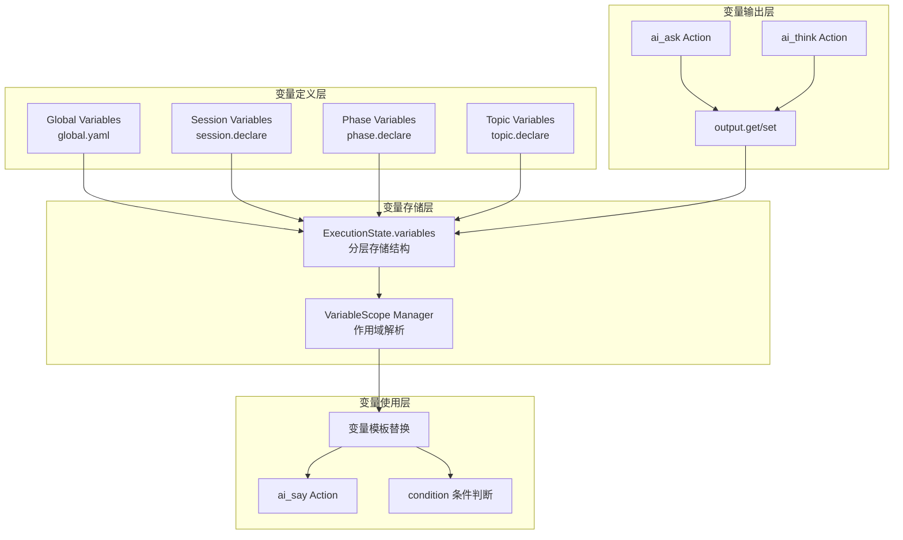

### 2.2 变量作用域层级

参照 HeartRule 构思文档，建立四级作用域体系：

| 作用域 | HeartRule 术语 | 当前架构映射 | 生命周期 | 覆盖优先级 |
|--------|--------------|-------------|---------|----------|
| Global | global | global.yaml 定义 | 跨会谈持久化 | 最低（1） |
| Session | session | Session.variables | 单次会谈 | 较低（2） |
| Phase | stage | Phase 内有效 | 当前 Phase | 较高（3） |
| Topic | goal | Topic 内有效 | 当前 Topic | 最高（4） |

**覆盖规则**：`Topic > Phase > Session > Global`

当存在同名变量时，优先取作用域更小（优先级更高）的值。

### 2.3 数据结构设计

#### 2.3.1 变量值存储结构

```typescript
// ExecutionState.variables 的扩展结构
interface VariableStore {
  // 全局变量（从 global.yaml 加载）
  global: Record<string, VariableValue>;
  
  // 会话级变量（当前 session 生命周期）
  session: Record<string, VariableValue>;
  
  // Phase 级变量（当前 phase 内有效）
  phase: Record<string, Record<string, VariableValue>>;  // { phaseId: { varName: value } }
  
  // Topic 级变量（当前 topic 内有效）
  topic: Record<string, Record<string, VariableValue>>;  // { topicId: { varName: value } }
}

// 变量值封装
interface VariableValue {
  value: any;                    // 实际值
  type?: string;                 // 数据类型：string/number/boolean/object/array
  lastUpdated?: string;          // ISO 时间戳
  source?: string;               // 来源：action_id 或 'global'/'initial'
}
```

#### 2.3.2 变量定义元数据

```typescript
// 变量定义信息（用于验证和提示）
interface VariableDefinition {
  name: string;                  // 变量名
  scope: 'global' | 'session' | 'phase' | 'topic';  // 作用域
  define?: string;               // 变量说明（用于 LLM 提取提示）
  value?: any;                   // 默认值
  auto?: boolean;                // 是否自动更新（P2 实现）
}
```

### 2.4 核心流程设计

#### 2.4.1 变量写入流程

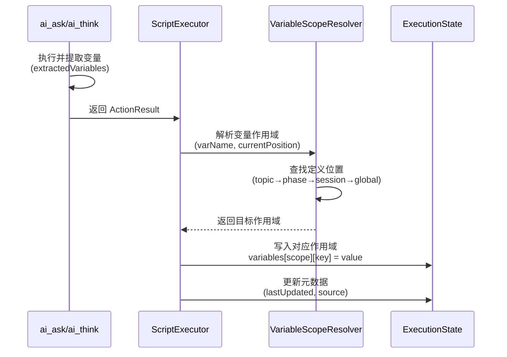

#### 2.4.2 变量读取流程

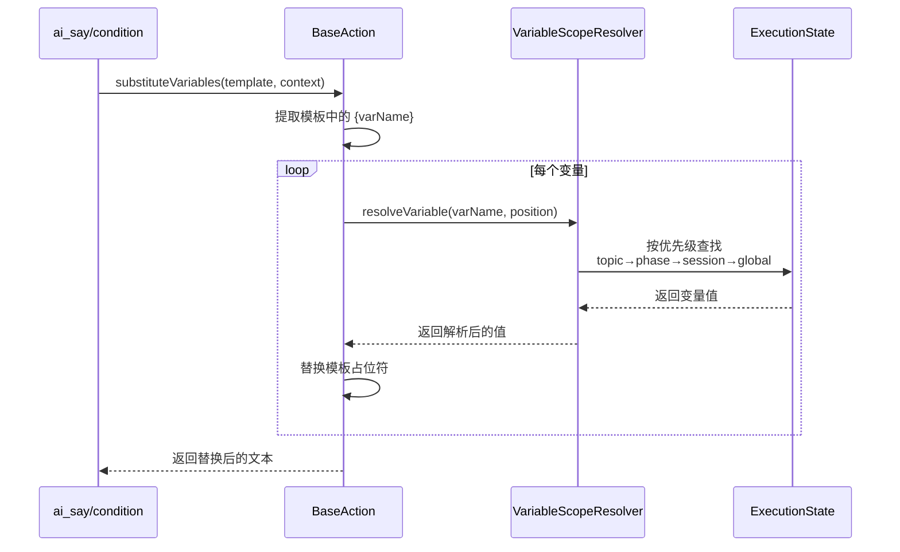

## 3. 详细设计

### 3.1 P0：引擎变量体系核心

#### 3.1.1 ExecutionState 扩展

**目标**：将当前扁平的 `variables: Record<string, any>` 改造为分层结构

**方案一：渐进式扩展（推荐）**

保持向后兼容，逐步迁移：

| 阶段 | 实现内容 | 兼容性 |
|-----|---------|-------|
| 阶段 1 | 新增 `variableStore: VariableStore` 字段<br/>保留旧 `variables` 字段用于兼容 | 完全兼容 |
| 阶段 2 | 在 ScriptExecutor 中同时写入两个字段 | 完全兼容 |
| 阶段 3 | 修改 BaseAction 优先从 `variableStore` 读取 | 完全兼容 |
| 阶段 4 | 废弃旧 `variables` 字段（文档标注） | 兼容 |

**数据迁移策略**：

初始化会话时，将 `variables` 中的数据迁移到 `variableStore.session`：

```typescript
// 在 ScriptExecutor.executeSession 开始时
if (!executionState.variableStore && executionState.variables) {
  executionState.variableStore = {
    global: {},
    session: {},
    phase: {},
    topic: {}
  };
  
  // 将旧数据迁移到 session 作用域
  for (const [key, value] of Object.entries(executionState.variables)) {
    executionState.variableStore.session[key] = {
      value,
      type: inferType(value),
      source: 'migrated'
    };
  }
}
```

#### 3.1.2 VariableScopeResolver 实现

**职责**：负责变量的作用域解析与优先级查找

**核心方法**：

| 方法 | 输入 | 输出 | 说明 |
|-----|------|-----|------|
| resolveVariable | varName, position | VariableValue 或 null | 按优先级查找变量值 |
| determineScope | varName, position | VariableScope | 确定变量应写入的作用域 |
| getVariableDefinition | varName | VariableDefinition 或 null | 获取变量定义元数据 |

**查找顺序实现逻辑**：

```
1. 查找 topic 作用域：variableStore.topic[currentTopicId][varName]
   → 找到则返回

2. 查找 phase 作用域：variableStore.phase[currentPhaseId][varName]
   → 找到则返回

3. 查找 session 作用域：variableStore.session[varName]
   → 找到则返回

4. 查找 global 作用域：variableStore.global[varName]
   → 找到则返回

5. 都未找到：返回 null
```

**边界情况处理**：

| 场景 | 处理策略 |
|-----|---------|
| Phase/Topic 切换后访问旧变量 | Phase/Topic 切换时不清空历史变量，通过 ID 隔离 |
| 未定义变量的 get 操作 | 自动在当前 topic 作用域创建变量 |
| 跨 Phase 访问 Phase 变量 | 无法访问（作用域已失效），返回 null |
| global 变量与 session 变量同名 | session 变量优先（覆盖规则） |

#### 3.1.3 ai_ask 输出链路改造

**当前状态**：

ai_ask 已支持 `extractedVariables` 输出，但写入逻辑简单：

```typescript
// 当前 ScriptExecutor 实现
if (result.extractedVariables) {
  executionState.variables = {
    ...executionState.variables,
    ...result.extractedVariables,
  };
}
```

**改造方案**：

引入作用域写入逻辑：

```typescript
// 改造后的写入逻辑
if (result.extractedVariables) {
  for (const [varName, varValue] of Object.entries(result.extractedVariables)) {
    // 1. 确定目标作用域
    const targetScope = this.scopeResolver.determineScope(
      varName,
      {
        phaseId: executionState.currentPhaseId,
        topicId: executionState.currentTopicId
      }
    );
    
    // 2. 写入对应作用域
    const scopeKey = this.getScopeKey(targetScope, executionState);
    executionState.variableStore[targetScope.level][scopeKey][varName] = {
      value: varValue,
      type: inferType(varValue),
      lastUpdated: new Date().toISOString(),
      source: action.actionId
    };
    
    // 3. 兼容性：同时写入旧 variables
    executionState.variables[varName] = varValue;
  }
}
```

**作用域确定规则**：

```
IF 变量在 topic.declare 中定义
  THEN 写入 topic 作用域
ELSE IF 变量在 phase.declare 中定义
  THEN 写入 phase 作用域
ELSE IF 变量在 session.declare 中定义
  THEN 写入 session 作用域
ELSE IF 变量在 global.yaml 中定义
  THEN 写入 global 作用域
ELSE
  // 未预先定义的变量，默认写入 topic 作用域（最小生命周期）
  THEN 写入 topic 作用域
END
```

### 3.2 P1：变量作用域与覆盖规则

#### 3.2.1 global.yaml 加载机制

**目标**：在会话初始化时，从 `global.yaml` 加载全局变量定义

**实现位置**：`SessionManager.initializeSession`

**加载流程**：

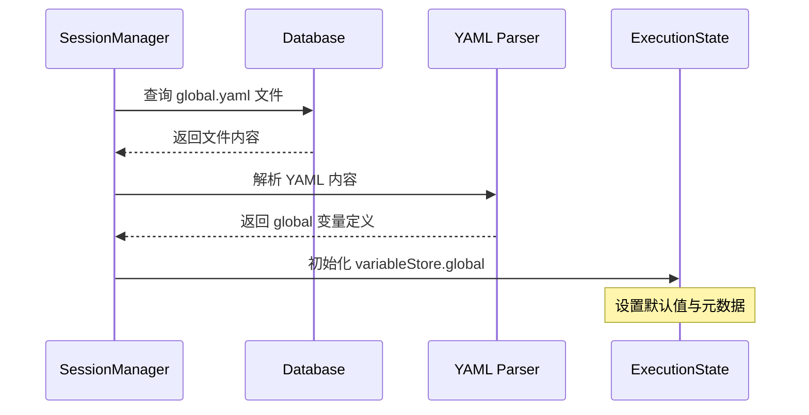

**数据结构示例**：

```yaml
# global.yaml 示例
global:
  - var: 心旅者名
    define: 心旅者允许心谷向导在对话中的称呼
    value: "心旅者"
  - var: 咨询师名
    define: 咨询师希望心旅者对自己的称呼
    value: "小爱"
```

转换为 VariableStore：

```typescript
variableStore.global = {
  "心旅者名": {
    value: "心旅者",
    type: "string",
    source: "global"
  },
  "咨询师名": {
    value: "小爱",
    type: "string",
    source: "global"
  }
}
```

#### 3.2.2 Session/Phase/Topic 变量声明解析

**目标**：从脚本 YAML 的 `declare` 字段解析变量定义

**脚本示例**：

```yaml
phases:
  - phase_id: "assessment"
    declare:
      - var: 主诉问题
        define: 来访者主要心理困扰
        value: ""
    
    topics:
      - topic_id: "basic_info"
        declare:
          - var: 用户年龄
            define: 来访者实际年龄
        
        actions:
          - action_type: ai_ask
            output:
              - get: 用户年龄
                define: 从回答中提取年龄数字
```

**解析时机**：

| 时机 | 操作 | 目的 |
|-----|------|-----|
| ScriptExecutor 初始化时 | 解析整个脚本的 declare 定义 | 构建变量定义索引 |
| Phase 执行前 | 初始化 phase 作用域变量 | 设置默认值 |
| Topic 执行前 | 初始化 topic 作用域变量 | 设置默认值 |
| Topic 结束时 | 清理 topic 作用域（可选） | 释放内存 |

**变量定义索引结构**：

```typescript
// 在 ScriptExecutor 中维护
private variableDefinitions: Map<string, VariableDefinition> = new Map();

// 解析脚本时构建索引
private parseVariableDefinitions(scriptContent: any) {
  // 解析 global
  // 解析 session.declare
  // 解析 phases[].declare
  // 解析 phases[].topics[].declare
  
  // 记录每个变量的定义位置（作用域）
}
```

#### 3.2.3 作用域切换策略

**Phase 切换行为**：

| 切换场景 | Phase 变量处理 | Session 变量处理 |
|---------|--------------|----------------|
| Phase A → Phase B | Phase A 变量保留但不可访问 | 继续可访问 |
| Phase 结束 | 变量数据持久化到 DB | 继续可访问 |
| Phase 重新进入 | 从 DB 恢复上次状态 | 继续可访问 |

**Topic 切换行为**：

| 切换场景 | Topic 变量处理 | Phase 变量处理 |
|---------|--------------|---------------|
| Topic A → Topic B | Topic A 变量不可访问 | 继续可访问 |
| Topic 结束 | 变量持久化（可选） | 继续可访问 |

**实现建议**：

为避免过早优化，MVP 阶段采用简化策略：

- **Phase/Topic 变量不自动清理**，通过 ID 隔离访问权限
- **Phase 切换时不持久化 Phase 变量**，只在会话结束时统一持久化
- **Topic 变量随会话一起持久化**，不单独处理

### 3.3 P2：ai_ask 连续追问与 output 增强

#### 3.3.1 多变量提取支持

**当前限制**：ai_ask 仅支持单变量 `target_variable`

**改造目标**：支持 `output` 配置，可提取多个变量

**配置格式参照 HeartRule**：

```yaml
- action_type: ai_ask
  prompt_template: |
    询问用户的基本信息：姓名、年龄、职业
  output:
    - get: 用户姓名
      define: 用户自报的姓名
    - get: 用户年龄
      define: 用户年龄，提取数字
    - get: 用户职业
      define: 用户当前从事的职业
```

**实现改造点**：

| 组件 | 改造内容 |
|-----|---------|
| AiAskAction.execute | 解析 `config.output` 数组，调用 LLM 批量提取 |
| ActionResult | `extractedVariables` 支持返回多个变量 |
| 变量提取提示词 | 构造支持多变量的 LLM 提示 |

**变量提取提示词模板**：

```
从以下对话中提取指定信息：

对话历史：
{conversationHistory}

需要提取的变量：
1. 用户姓名：用户自报的姓名
2. 用户年龄：用户年龄，提取数字
3. 用户职业：用户当前从事的职业

请以 JSON 格式返回：
{
  "用户姓名": "提取到的值",
  "用户年龄": 数字,
  "用户职业": "提取到的值"
}

如果某个信息未提及，请设为 null。
```

#### 3.3.2 exit 条件支持

**目标**：支持自然语言描述的退出条件，由 LLM 判断是否满足

**配置示例**：

```yaml
- action_type: ai_ask
  prompt_template: |
    详细了解用户的人际关系情况
  exit: 当用户讲述完主要的人际关系问题后退出
  max_rounds: 10
  output:
    - get: 人际关系问题
      define: 用户提到的人际关系困扰
```

**判断流程**：

```
每轮对话后：
1. 构造判断提示词：
   "根据以下对话，判断是否满足退出条件：{exit_condition}"
   
2. 调用 LLM 返回 JSON：
   { "should_exit": true/false, "reason": "判断理由" }
   
3. 根据 should_exit 决定是否结束追问
```

**边界条件**：

| 条件 | 处理 |
|-----|------|
| 达到 max_rounds 但未满足 exit | 强制退出，标记为 incomplete |
| 满足 exit 但未达 max_rounds | 正常退出，提取变量 |
| exit 未配置 | 默认第一轮问答后退出（兼容当前行为） |

#### 3.3.3 output.set 支持

**目标**：支持在 output 中直接设置常量值或引用其他变量

**使用场景**：

```yaml
- action_type: ai_ask
  prompt_template: "询问用户是否有配偶"
  output:
    - get: 婚姻状况
      define: 已婚/未婚/离异等
    - set: 需要询问配偶关系
      value: "true"
      condition: "{婚姻状况} === '已婚'"
```

**实现要点**：

- `set` 操作在 `get` 操作之后执行
- `value` 支持字面量和变量引用 `{varName}`
- 支持可选的 `condition` 字段（条件为真才设置）

### 3.4 P3：API 与编辑器集成

#### 3.4.1 API 返回变量状态

**目标**：在 `/api/sessions/:id/chat` 响应中返回分层变量

**响应结构扩展**：

```typescript
interface ChatResponse {
  message: string;
  status: ExecutionStatus;
  position: ExecutionPosition;
  
  // 新增字段
  variables?: {
    global: Record<string, any>;
    session: Record<string, any>;
    phase: Record<string, any>;      // 当前 phase 的变量
    topic: Record<string, any>;      // 当前 topic 的变量
  };
  
  // 可选：变量变更增量
  variableChanges?: {
    added: string[];        // 新增的变量名
    updated: string[];      // 更新的变量名
    scope: VariableScope;   // 变更发生的作用域
  };
}
```

**性能优化建议**：

- **默认不返回所有变量**，仅在调试模式或显式请求时返回
- **仅返回当前可访问的作用域**（当前 topic + phase + session + global）
- **变更增量通知**：只返回本次执行新增/修改的变量

#### 3.4.2 编辑器属性面板支持

**目标**：在脚本编辑器中可视化配置 ai_ask 的 output/exit

**UI 设计需求**：

| 功能 | 组件 | 交互 |
|-----|------|------|
| output 配置 | 动态表单列表 | 添加/删除变量行，填写 get/define |
| exit 条件 | 多行文本框 | 输入自然语言退出条件 |
| max_rounds | 数字输入框 | 设置最大追问轮数 |
| 变量预览 | 下拉列表 | 显示当前作用域可用变量 |

**数据流**：

```
编辑器表单 → YAML 序列化 → 保存到 script_files 表
                                ↓
                          调试执行时加载
```

#### 3.4.3 调试界面变量展示

**目标**：在调试气泡中展示变量的作用域层级

**展示结构设计**：

```
┌─ 变量状态 ────────────────────┐
│                                │
│ 🌐 Global                      │
│   ├─ 咨询师名: "小爱"          │
│   └─ 系统版本: "v1.0"          │
│                                │
│ 📝 Session                     │
│   ├─ 用户ID: "user_123"       │
│   └─ 会谈开始时间: "14:30"    │
│                                │
│ 📊 Phase (assessment)          │
│   └─ 主诉问题: "焦虑"         │
│                                │
│ 💬 Topic (basic_info)          │
│   ├─ 用户姓名: "李永"         │
│   ├─ 用户年龄: 28             │
│   └─ 用户职业: "程序员"       │
│                                │
│ 本次变更：                     │
│   + 用户年龄 (topic)           │
│                                │
└────────────────────────────────┘
```

**实现方式**：

- 扩展 `LLMDebugInfo` 结构，新增 `variableSnapshot` 字段
- 前端根据 scope 层级渲染折叠面板
- 高亮显示本次新增/修改的变量

## 4. 数据持久化

### 4.1 数据库 Schema 变更

**sessions 表扩展**：

| 字段 | 类型 | 说明 |
|-----|------|-----|
| execution_state | JSONB | 现有字段，存储完整 ExecutionState |

**无需新增表**，在 `execution_state.variableStore` 中存储分层结构

### 4.2 序列化与反序列化

**序列化时机**：

- 每次 `processUserInput` 完成后
- Phase/Topic 切换时
- 会话暂停/结束时

**序列化格式**：

```json
{
  "variableStore": {
    "global": {
      "咨询师名": { "value": "小爱", "type": "string", "source": "global" }
    },
    "session": {
      "用户ID": { "value": "user_123", "type": "string", "source": "initial" }
    },
    "phase": {
      "assessment": {
        "主诉问题": { "value": "焦虑", "type": "string", "source": "action_05" }
      }
    },
    "topic": {
      "basic_info": {
        "用户姓名": { "value": "李永", "type": "string", "source": "action_10" }
      }
    }
  }
}
```

**反序列化策略**：

恢复会话时，完整加载 `variableStore`，无需额外处理

## 5. 扩展点设计

### 5.1 为高级功能预留的扩展点

| 功能 | 当前设计预留 | 后续扩展方式 |
|-----|------------|------------|
| 自动更新变量（auto=true） | VariableDefinition.auto 字段 | 在后台任务中定期调用 LLM 更新 |
| 变量历史追踪 | VariableValue.lastUpdated/source | 扩展为数组存储历史记录 |
| 变量类型验证 | VariableValue.type | 引入 Zod Schema 验证 |
| 跨会话变量持久化 | global 作用域 | 新增 user_variables 表 |
| 变量依赖分析 | - | 引入变量依赖图，分析引用关系 |

### 5.2 兼容性保证

**向后兼容原则**：

- 保留 `ExecutionState.variables` 字段至少 2 个版本周期
- 新旧字段双写，读取优先新字段
- API 响应同时包含新旧格式

**废弃路径**：

```
v1.0: 引入 variableStore，双写
v1.1: 标记 variables 为 deprecated
v1.2: 移除 variables 字段
```

## 6. 实施计划

### 6.1 任务拆解与优先级

| 阶段 | 任务 | 工作量估算 | 依赖 |
|-----|------|----------|------|
| **P0-1** | ExecutionState 扩展与迁移逻辑 | 2 天 | 无 |
| **P0-2** | VariableScopeResolver 实现 | 3 天 | P0-1 |
| **P0-3** | BaseAction.substituteVariables 改造 | 1 天 | P0-2 |
| **P0-4** | ai_ask 输出链路改造 | 2 天 | P0-2 |
| **P0-5** | 集成测试与调试 | 2 天 | P0-1~4 |
| **P1-1** | global.yaml 加载机制 | 1 天 | P0-1 |
| **P1-2** | declare 解析与作用域初始化 | 2 天 | P0-2 |
| **P1-3** | 作用域切换策略实现 | 1 天 | P1-2 |
| **P2-1** | ai_ask 多变量 output 支持 | 2 天 | P0-4 |
| **P2-2** | exit 条件判断实现 | 2 天 | P2-1 |
| **P2-3** | output.set 支持 | 1 天 | P2-1 |
| **P3-1** | API 变量状态返回 | 1 天 | P0-5 |
| **P3-2** | 编辑器属性面板 UI | 3 天 | P2-3 |
| **P3-3** | 调试界面变量展示 | 2 天 | P3-1 |

**关键路径**：P0-1 → P0-2 → P0-4 → P0-5

**总计工作量**：约 27 天（单人）

### 6.2 里程碑定义

| 里程碑 | 交付标准 | 验收方式 |
|-------|---------|---------|
| **M1: 核心能力可用** | P0 全部完成，ai_ask 变量可在 ai_say 中使用 | 端到端测试用例通过 |
| **M2: 作用域体系完整** | P1 完成，支持四级作用域与覆盖规则 | 作用域测试套件通过 |
| **M3: ai_ask 增强** | P2 完成，支持多变量、exit 条件 | HeartRule 示例脚本运行正常 |
| **M4: 工具链完备** | P3 完成，编辑器与调试界面支持变量 | 用户验收测试 |

### 6.3 ai_ask 脚本编辑器设计

#### 6.3.1 编辑面板布局设计

**目标**：在脚本编辑器中为 ai_ask Action 提供友好的可视化配置界面

**UI 组件结构**：

```
┌─ ai_ask Action 属性面板 ──────────────────────┐
│                                                │
│ 📝 基础配置                                    │
│ ├─ 问题模板 (TextArea, 6行)                   │
│ │  提示：向用户提问的问题模板，支持变量        │
│ └─ 语气风格 (Input)                            │
│    示例：温和、鼓励性                          │
│                                                │
│ 🎯 变量提取配置                                │
│ ├─ 目标变量 (Input)                            │
│ │  示例：user_name                             │
│ ├─ 提取提示词 (TextArea, 2行)                 │
│ │  说明如何从回答中提取信息                    │
│ └─ 必填 (Checkbox)                             │
│                                                │
│ ⚙️ 交互控制                                    │
│ ├─ 最大轮数 (InputNumber, 1-10)               │
│ ├─ 退出条件 (TextArea, 2行)                   │
│ │  自然语言描述何时退出                        │
│ └─ 追加到列表 (Input, 可选)                   │
│    列表变量名                                  │
│                                                │
│ 📤 高级输出配置 (可折叠)                       │
│ └─ 多变量输出配置                              │
│    ┌─ 变量 #1 ─────────────────────┐         │
│    │ • get: 变量名                   │         │
│    │ • define: 变量定义              │         │
│    │ • set: 直接赋值 (可选)          │         │
│    │ • value: 赋值内容 (可选)        │         │
│    │ • condition: 条件表达式 (可选)  │         │
│    └──────────────────────────────┘         │
│    [+ 添加输出变量]                             │
│                                                │
│ 🔧 高级选项 (可折叠)                           │
│ └─ 执行条件 (TextArea, 3行)                   │
│    JavaScript 条件表达式                       │
│                                                │
└────────────────────────────────────────────┘
```

#### 6.3.2 组件交互设计

**自动保存机制**：

| 触发条件 | 防抖延迟 | 保存范围 |
|---------|---------|----------|
| 输入框失焦 | 600ms | 当前字段 |
| 下拉选择 | 立即 | 当前字段 |
| 添加/删除变量 | 立即 | 整个 output 数组 |
| 切换 Action | 立即 | 当前 Action 全部配置 |

**实时校验规则**：

| 字段 | 校验规则 | 错误提示 |
|-----|---------|----------|
| 问题模板 | 必填，最少10字符 | 请输入完整的问题模板 |
| 目标变量 | 非空时需符合变量命名规则 | 变量名只能包含字母、数字、下划线 |
| 最大轮数 | 1-10 整数 | 最大轮数必须在1-10之间 |
| output.get | 与 output.set 至少填一个 | 请指定 get 或 set 操作 |

#### 6.3.3 数据流与同步

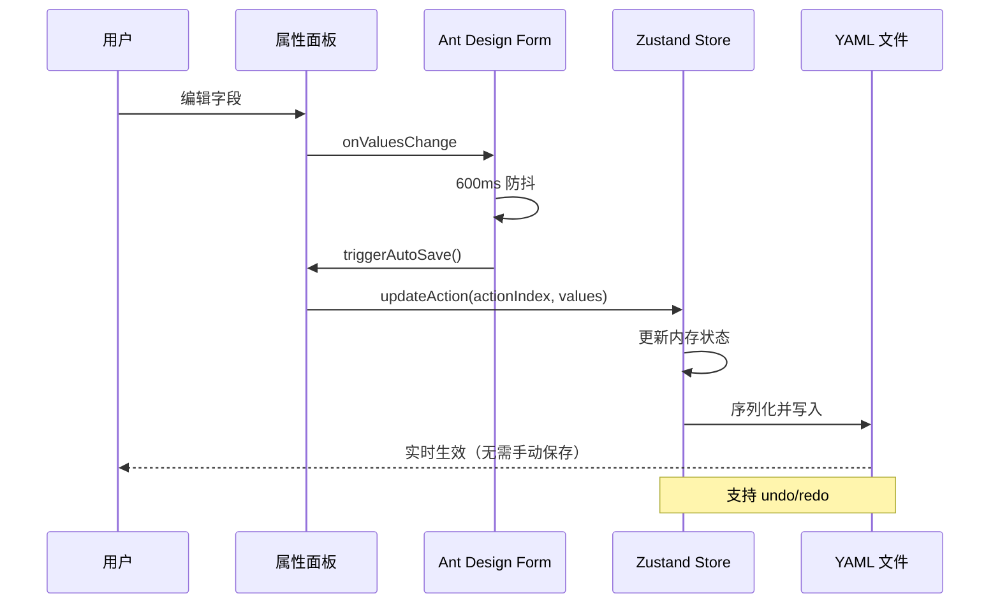

**向后兼容处理**：

```typescript
// 读取时兼容旧字段
formValues.target_variable = 
  action.target_variable || 
  action.output?.[0]?.get || 
  '';

formValues.extraction_prompt = 
  action.extraction_prompt || 
  action.output?.[0]?.define || 
  '';

// 保存时双写
updatedAction.target_variable = values.target_variable;
updatedAction.output = [
  {
    get: values.target_variable,
    define: values.extraction_prompt
  },
  ...values.output
];
```

#### 6.3.4 高级输出配置 UI

**动态表单设计**：

使用 Ant Design `Form.List` 实现动态增删：

```
┌─ 输出变量配置列表 ─────────────────────┐
│                                         │
│ ┌─ 变量 #1 ───────────────────────┐   │
│ │ 操作类型：                        │   │
│ │ ○ get (提取)  ○ set (赋值)       │   │
│ │                                   │   │
│ │ 变量名：[用户姓名        ]        │   │
│ │ 变量定义：[用户自报的姓名  ]      │   │
│ │                                   │   │
│ │ 【高级选项 ▼】                    │   │
│ │   条件表达式：[{婚姻状况}==='已婚']│   │
│ │   默认值：[未知           ]       │   │
│ │                                   │   │
│ │ [删除]                            │   │
│ └───────────────────────────────┘   │
│                                         │
│ ┌─ 变量 #2 ───────────────────────┐   │
│ │ ...                               │   │
│ └───────────────────────────────┘   │
│                                         │
│ [+ 添加输出变量]                       │
│                                         │
└─────────────────────────────────────┘
```

**字段关联逻辑**：

| 场景 | UI 行为 |
|-----|--------|
| 选择 get 操作 | 显示"变量定义"字段，隐藏"默认值"字段 |
| 选择 set 操作 | 显示"默认值"字段，隐藏"变量定义"字段 |
| 同时填写 get 和 set | 校验错误，提示只能选一个 |
| 添加条件表达式 | 展开"高级选项"折叠面板 |

#### 6.3.5 用户体验优化

**智能提示**：

| 位置 | 提示内容 | 触发方式 |
|-----|---------|----------|
| 问题模板 | 可用变量列表悬浮提示 | 输入 `{` 时自动弹出 |
| 目标变量 | 已定义变量建议 | 聚焦时显示下拉列表 |
| 退出条件 | 示例模板 | 字段为空时显示占位文本 |
| 条件表达式 | JavaScript 语法高亮 | 实时渲染 |

**错误提示优化**：

```typescript
// 友好的错误提示
const validateOutput = (output: any[]) => {
  if (!output || output.length === 0) {
    return { valid: true };
  }
  
  for (const [index, item] of output.entries()) {
    if (!item.get && !item.set) {
      return {
        valid: false,
        message: `第 ${index + 1} 个输出变量：必须指定 get 或 set 操作`
      };
    }
    
    if (item.get && item.set) {
      return {
        valid: false,
        message: `第 ${index + 1} 个输出变量：get 和 set 不能同时使用`
      };
    }
  }
  
  return { valid: true };
};
```

### 6.4 风险与缓解措施

| 风险 | 影响 | 概率 | 缓解措施 |
|-----|------|------|---------|
| ExecutionState 结构变更导致会话恢复失败 | 高 | 中 | 双写策略 + 迁移脚本 + 充分测试 |
| 作用域解析性能问题 | 中 | 低 | 引入缓存机制，索引优化 |
| LLM 变量提取准确率不足 | 高 | 中 | 提供 fallback 机制，人工修正接口 |
| 前端编辑器改造工作量超预期 | 中 | 中 | 先实现核心功能，UI 优化后置 |
| global.yaml 格式与 HeartRule 差异 | 中 | 高 | 建立格式映射层，保持 MVP 简化 |

## 7. 测试策略

### 7.1 单元测试

**测试覆盖范围**：

| 模块 | 测试用例数 | 关键场景 |
|-----|----------|---------|
| VariableScopeResolver | 15+ | 作用域优先级、未定义变量、跨作用域访问 |
| ExecutionState 迁移逻辑 | 10+ | 旧数据迁移、空数据、异常格式 |
| ai_ask 输出链路 | 12+ | 单变量、多变量、嵌套对象、类型转换 |
| BaseAction.substituteVariables | 8+ | 变量替换、未定义变量、递归引用 |

**测试工具**：vitest

### 7.2 集成测试

**端到端场景**：

```
场景 1：变量定义 → 提取 → 使用闭环
  1. 加载包含 declare 的脚本
  2. 执行 ai_ask 提取用户姓名
  3. 执行 ai_say 使用 {用户姓名}
  4. 验证消息中包含实际姓名

场景 2：作用域覆盖规则
  1. global 定义 "用户情绪" = "正常"
  2. topic 定义 "用户情绪" = "焦虑"
  3. ai_say 使用 {用户情绪}
  4. 验证使用 topic 值 "焦虑"

场景 3：会话恢复
  1. 执行到一半暂停会话
  2. 持久化 ExecutionState
  3. 恢复会话
  4. 验证变量完整恢复
```

### 7.3 回归测试

**参照现有经验**：Bug 修复后补充回归测试用例

**回归测试范围**：

- 现有 ai_say / ai_ask 测试用例需全部通过
- 变量替换相关的 test-variable-*.ts 测试
- 会话恢复与状态持久化测试

## 8. 文档交付

### 8.1 技术文档

| 文档 | 受众 | 内容 |
|-----|------|-----|
| 变量系统架构设计 | 开发者 | 本文档 |
| 变量作用域 API 文档 | 开发者 | VariableScopeResolver 接口说明 |
| 脚本编写指南 | 脚本作者 | declare/output/exit 语法与示例 |

### 8.2 用户指南

| 文档 | 受众 | 内容 |
|-----|------|-----|
| 变量使用教程 | 咨询师/脚本编写者 | 如何定义与使用变量 |
| 调试指南 | 咨询师/脚本编写者 | 如何在编辑器中查看变量状态 |

## 9. 成功指标

| 指标 | 目标值 | 测量方式 |
|-----|-------|---------|
| 单元测试覆盖率 | ≥85% | vitest coverage |
| 集成测试通过率 | 100% | E2E 测试套件 |
| 变量作用域正确率 | 100% | 专项测试用例 |
| API 响应时间增量 | <50ms | 性能基准测试 |
| 会话恢复成功率 | 100% | 状态持久化测试 |
| HeartRule 示例脚本兼容 | 100% | 参考脚本执行验证 |

## 10. 参考资料

### 10.1 现有实现

| 组件 | 文件路径 | 关键逻辑 |
|-----|---------|---------|
| ExecutionState | packages/core-engine/src/engines/script-execution/script-executor.ts | 行 39-61 |
| 变量写入逻辑 | script-executor.ts | 行 224-229, 483-488 |
| BaseAction 变量替换 | packages/core-engine/src/actions/base-action.ts | 行 85-103 |
| ai_ask 变量提取 | packages/core-engine/src/actions/ai-ask-action.ts | 行 174-177 |
| 变量分析工具 | packages/script-editor/src/utils/variableAnalyzer.ts | 完整文件 |

### 10.2 设计参考

- HeartRule 脚本系统构思文档：`docs/design/thinking/HeartRule脚本系统构思.md` 第 99-600 行
- 变量提取引擎知识库：已有实现可参考其设计思路
- 会话模型文档：`packages/shared-types/src/domain/session.ts`

## 11. DDD 战略与战术设计

### 11.1 战略设计：子域与限界上下文

#### 11.1.1 子域划分

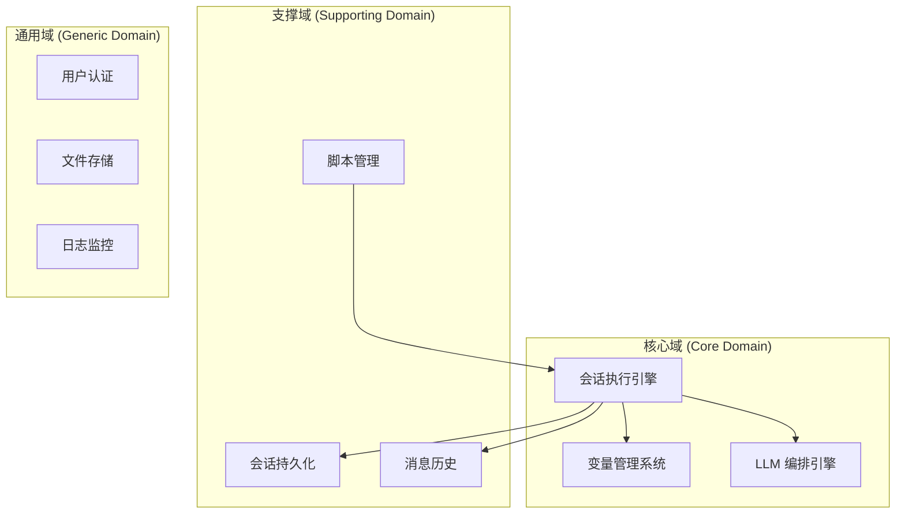

**子域职责**：

| 子域类型 | 子域名称 | 核心价值 | 复杂度 |
|---------|---------|---------|-------|
| **核心域** | 会话执行引擎 | 驱动脚本执行，编排 Action 流程 | 高 |
| **核心域** | 变量管理系统 | 实现作用域解析、变量写入/读取 | 高 |
| **核心域** | LLM 编排引擎 | 统一管理 LLM 调用，提供提示词模板 | 中 |
| 支撑域 | 脚本管理 | 加载、解析、版本管理脚本文件 | 中 |
| 支撑域 | 会话持久化 | 保存执行状态到数据库 | 低 |
| 支撑域 | 消息历史 | 记录对话消息 | 低 |
| 通用域 | 用户认证 | 用户登录、权限验证 | 低 |
| 通用域 | 文件存储 | YAML 文件存储 | 低 |

#### 11.1.2 限界上下文映射

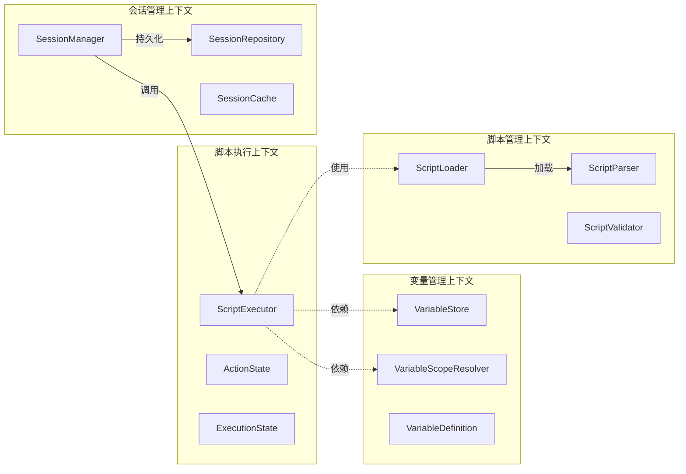

**上下文关系**：

| 上游上下文 | 下游上下文 | 关系类型 | 集成方式 |
|-----------|-----------|---------|----------|
| 会话管理 | 脚本执行 | Customer-Supplier | 直接调用 |
| 脚本执行 | 变量管理 | Shared Kernel | 共享 VariableStore 结构 |
| 脚本执行 | LLM 编排 | Customer-Supplier | 依赖注入 LLMOrchestrator |
| 会话管理 | 会话持久化 | Conformist | 遵循数据库 Schema |
| 脚本管理 | 脚本执行 | Open Host Service | 提供脚本加载接口 |

#### 11.1.3 防腐层设计

**外部系统隔离**：

```
┌─ HeartRule 构思文档格式 ─┐
│ session / stage / goal   │
└──────────────────────────┘
           ↓
    【格式适配层】
           ↓
┌─ 当前系统内部格式 ──────┐
│ session / phase / topic  │
└──────────────────────────┘
```

**实现位置**：`ScriptParser` 中实现格式转换逻辑

### 11.2 战术设计：关键模式

#### 11.2.1 聚合与实体

**变量管理聚合（核心）**：

```typescript
// 聚合根：ExecutionState
class ExecutionState {
  // 值对象：VariableStore
  private variableStore: VariableStore;
  
  // 实体：当前执行位置
  private position: ExecutionPosition;
  
  // 值对象：执行状态
  private status: ExecutionStatus;
  
  // 领域服务：作用域解析器（注入）
  private scopeResolver: VariableScopeResolver;
  
  // 聚合内方法：保证一致性
  public setVariable(name: string, value: any): void {
    const scope = this.scopeResolver.determineScope(name, this.position);
    // 原子操作：写入变量 + 更新元数据
    this.variableStore[scope][this.getScopeKey(scope)][name] = {
      value,
      lastUpdated: new Date().toISOString(),
      source: this.position.actionId
    };
  }
  
  public getVariable(name: string): VariableValue | null {
    return this.scopeResolver.resolveVariable(name, this.position);
  }
}
```

**聚合边界**：

| 聚合 | 聚合根 | 内部实体 | 值对象 | 不变性约束 |
|-----|-------|---------|--------|----------|
| 会话执行聚合 | ExecutionState | ActionState | VariableStore, Position | 变量只能通过 setVariable 写入 |
| 脚本定义聚合 | Script | Phase, Topic, Action | ActionConfig | 脚本结构不可变 |
| 会话聚合 | Session | - | SessionMetadata | sessionId 不可变 |

#### 11.2.2 领域服务

**VariableScopeResolver（领域服务）**：

```typescript
// 无状态领域服务
class VariableScopeResolver {
  constructor(
    private variableDefinitions: Map<string, VariableDefinition>
  ) {}
  
  // 领域逻辑：解析变量优先级
  public resolveVariable(
    varName: string,
    position: Position
  ): VariableValue | null {
    // 按优先级查找：topic > phase > session > global
    const searchOrder = [
      { scope: 'topic', key: position.topicId },
      { scope: 'phase', key: position.phaseId },
      { scope: 'session', key: null },
      { scope: 'global', key: null }
    ];
    
    for (const { scope, key } of searchOrder) {
      const value = this.lookupVariable(scope, key, varName);
      if (value !== null) {
        return value;
      }
    }
    
    return null;
  }
  
  // 领域逻辑：确定写入作用域
  public determineScope(
    varName: string,
    position: Position
  ): VariableScope {
    const definition = this.variableDefinitions.get(varName);
    
    if (definition) {
      return definition.scope;
    }
    
    // 默认策略：未定义变量写入 topic 作用域
    return 'topic';
  }
}
```

#### 11.2.3 仓储模式

**SessionRepository 接口**：

```typescript
// 仓储接口（领域层定义）
interface SessionRepository {
  findById(sessionId: string): Promise<Session | null>;
  save(session: Session): Promise<void>;
  updateExecutionState(sessionId: string, state: ExecutionState): Promise<void>;
}

// 实现（基础设施层）
class DrizzleSessionRepository implements SessionRepository {
  async findById(sessionId: string): Promise<Session | null> {
    const row = await db.query.sessions.findFirst({
      where: eq(sessions.sessionId, sessionId)
    });
    
    if (!row) return null;
    
    // 反序列化：数据库 → 领域对象
    return Session.fromPersistence(row);
  }
  
  async save(session: Session): Promise<void> {
    // 序列化：领域对象 → 数据库
    const data = session.toPersistence();
    await db.insert(sessions).values(data);
  }
}
```

#### 11.2.4 工厂模式

**ActionFactory**：

```typescript
// 工厂：负责创建 Action 实例
class ActionFactory {
  constructor(
    private llmOrchestrator: LLMOrchestrator
  ) {}
  
  createAction(config: ActionConfig): BaseAction {
    switch (config.action_type) {
      case 'ai_ask':
        return new AiAskAction(
          config.action_id,
          config,
          this.llmOrchestrator
        );
      
      case 'ai_say':
        return new AiSayAction(
          config.action_id,
          config,
          this.llmOrchestrator
        );
      
      case 'ai_think':
        return new AiThinkAction(
          config.action_id,
          config,
          this.llmOrchestrator
        );
      
      default:
        throw new DomainError(
          `Unknown action type: ${config.action_type}`
        );
    }
  }
}
```

### 11.3 关键时序图

#### 11.3.1 变量写入完整流程

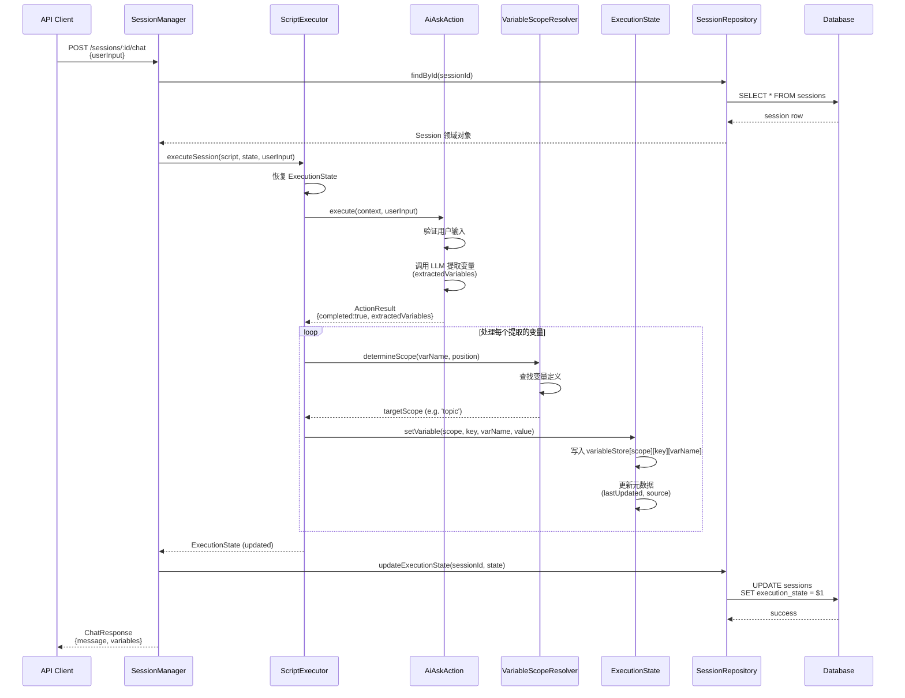

#### 11.3.2 变量读取与替换流程

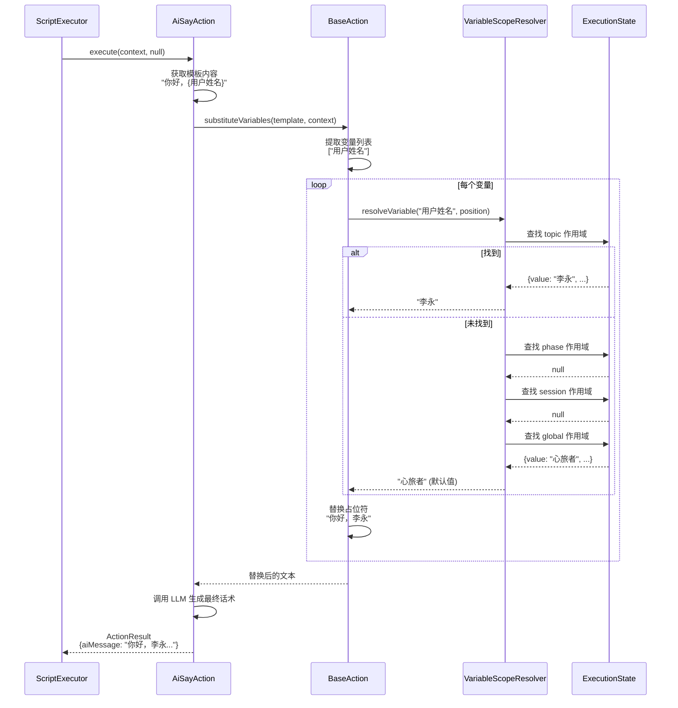

#### 11.3.3 作用域切换与变量可见性

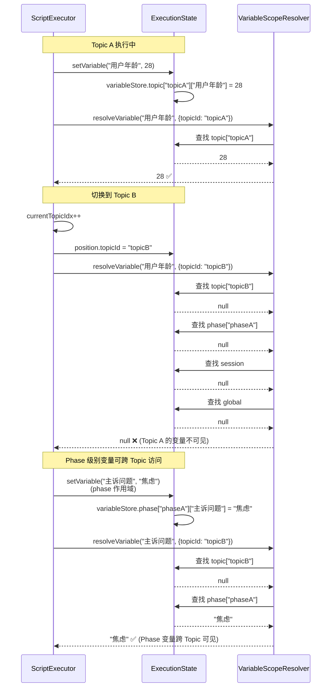

#### 11.3.4 多变量提取与条件赋值

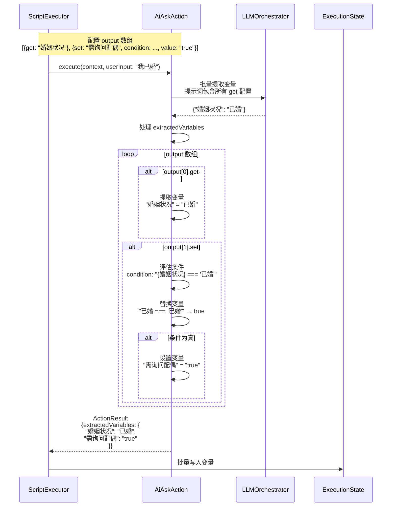

## 12. 附录

### 12.1 HeartRule 与当前架构映射表

| HeartRule 术语 | 当前架构 | 说明 |
|---------------|---------|------|
| session | Session | 一次会谈 |
| stage | Phase | 会谈阶段 |
| goal | Topic | 话题/目标 |
| action | Action | 动作（ai_say/ai_ask等） |
| global.yaml | global.yaml | 全局变量定义 |
| declare | declare | 变量声明 |
| output.get | output.get | 变量提取 |
| output.set | output.set | 变量赋值 |
| exit | exit | 退出条件 |

### 12.2 类型定义清单

```typescript
// 核心类型定义汇总
type VariableScope = 'global' | 'session' | 'phase' | 'topic';

interface VariableStore {
  global: Record<string, VariableValue>;
  session: Record<string, VariableValue>;
  phase: Record<string, Record<string, VariableValue>>;
  topic: Record<string, Record<string, VariableValue>>;
}

interface VariableValue {
  value: any;
  type?: string;
  lastUpdated?: string;
  source?: string;
}

interface VariableDefinition {
  name: string;
  scope: VariableScope;
  define?: string;
  value?: any;
  auto?: boolean;
}

interface VariableScopeResolver {
  resolveVariable(varName: string, position: Position): VariableValue | null;
  determineScope(varName: string, position: Position): VariableScope;
  getVariableDefinition(varName: string): VariableDefinition | null;
}

interface Position {
  phaseId?: string;
  topicId?: string;
}
```

### 12.3 配置示例

**完整的 ai_ask 配置示例**：

```yaml
- action_type: ai_ask
  action_id: ask_family_info
  prompt_template: |
    详细了解用户的家庭成员情况，包括：
    1. 家庭成员构成
    2. 与各成员的关系
    3. 是否存在家庭矛盾
  
  exit: 当用户讲述完主要家庭成员关系后退出
  max_rounds: 8
  
  output:
    - get: 家庭成员列表
      define: 用户提到的家庭成员及称呼，以数组形式存储
    - get: 家庭关系评价
      define: 用户对家庭关系的整体评价（和睦/紧张/冷淡等）
    - get: 主要家庭矛盾
      define: 用户提到的主要家庭矛盾或冲突
    - set: 需要深入探讨家庭关系
      value: "true"
```
