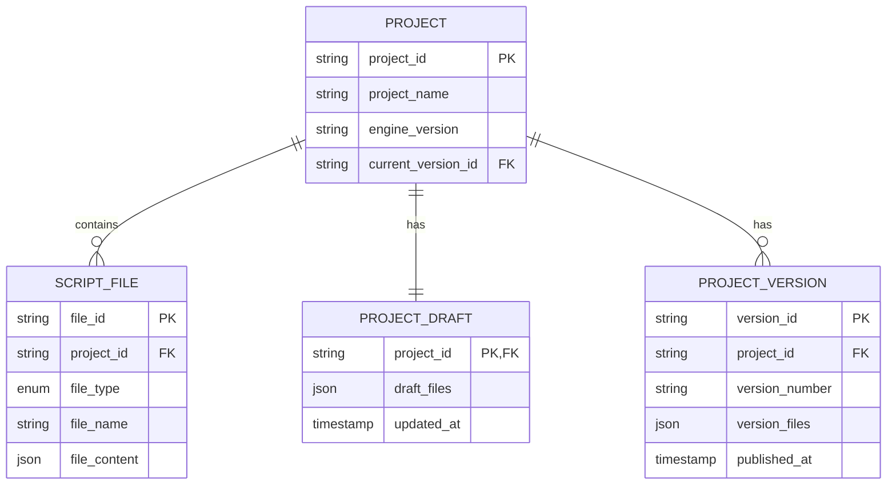
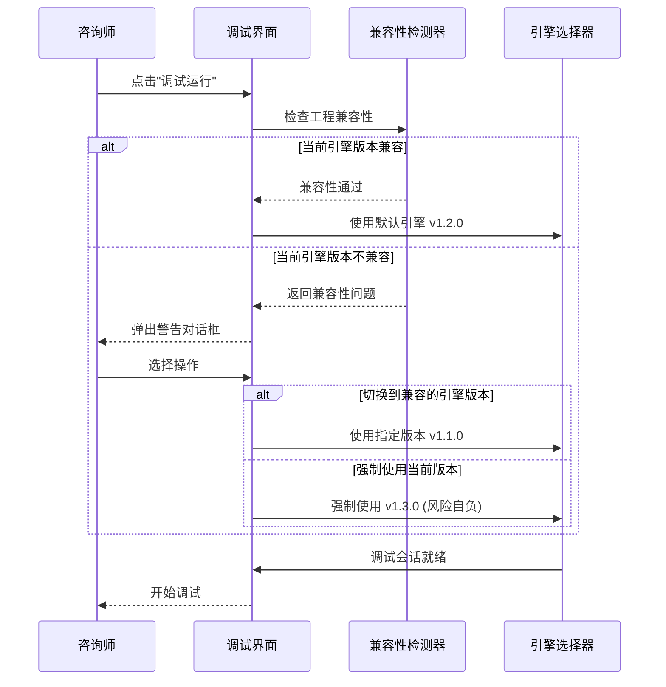
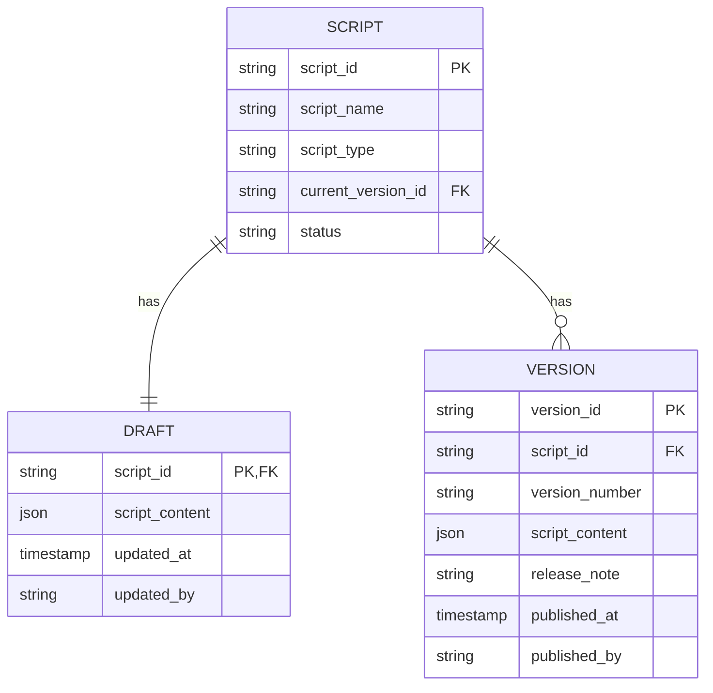
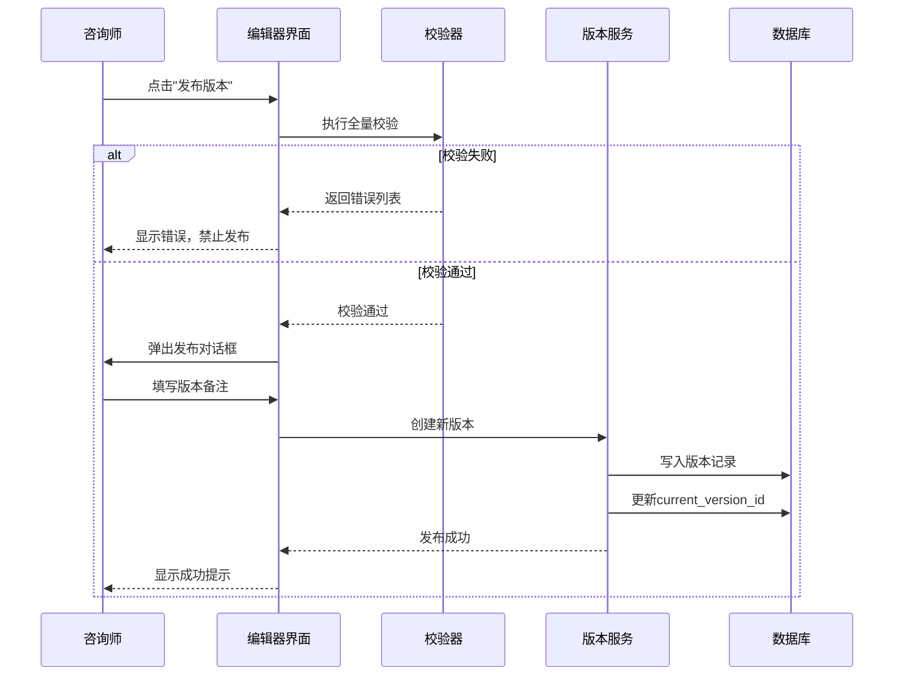
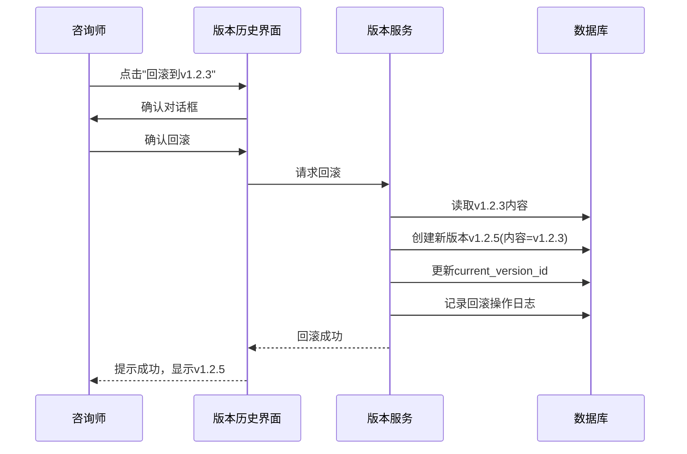
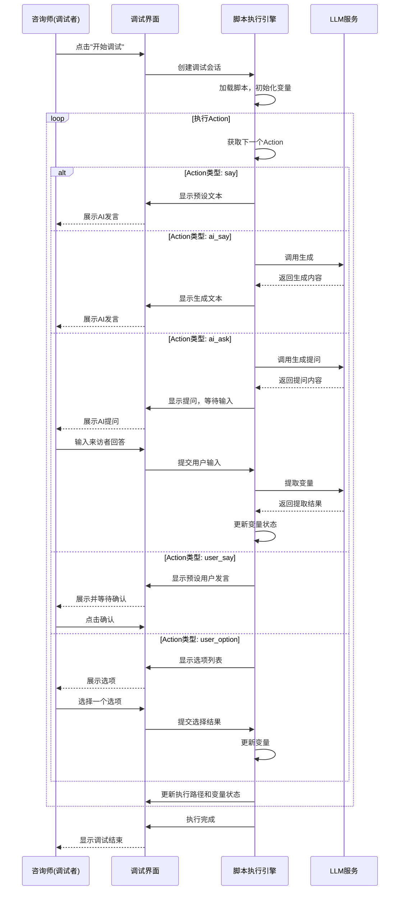
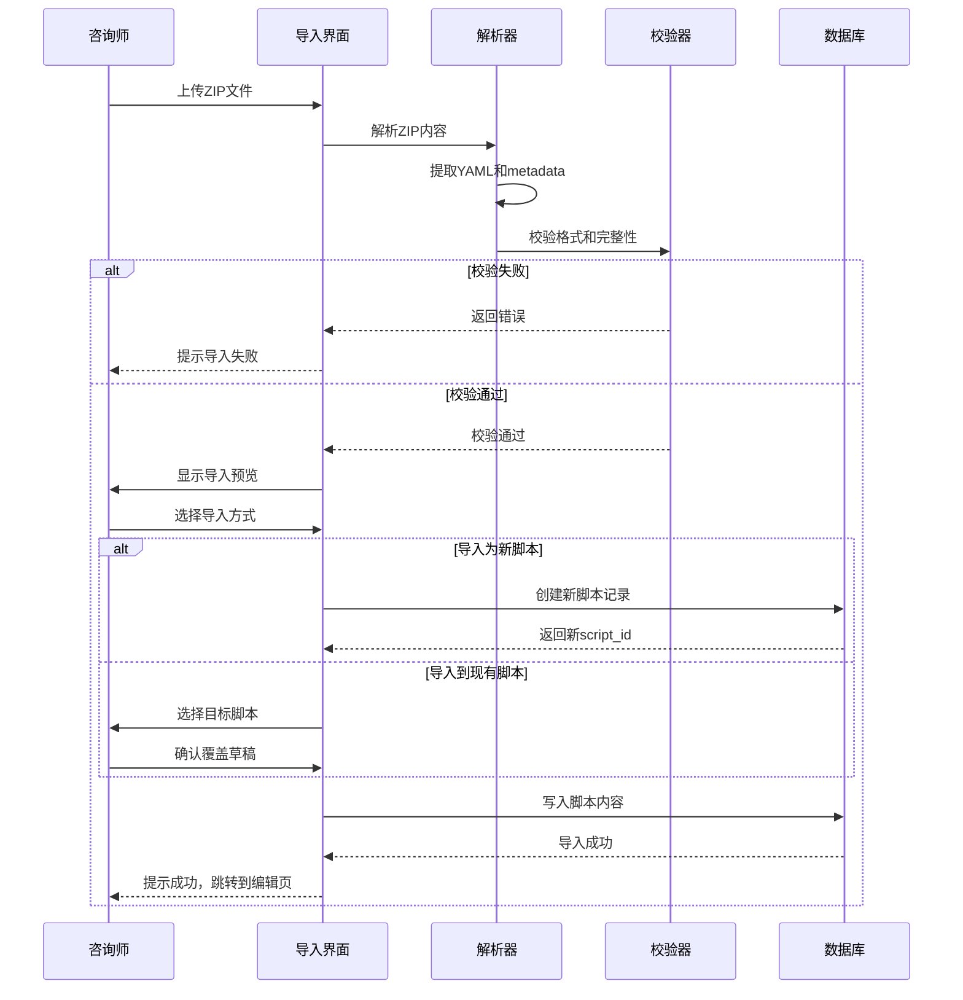
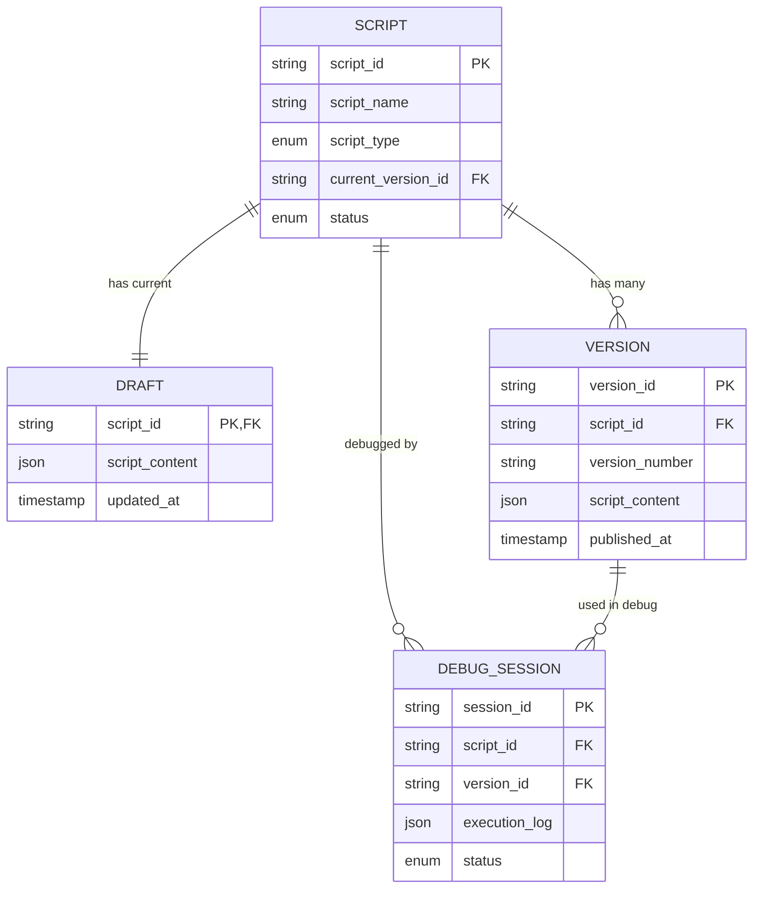
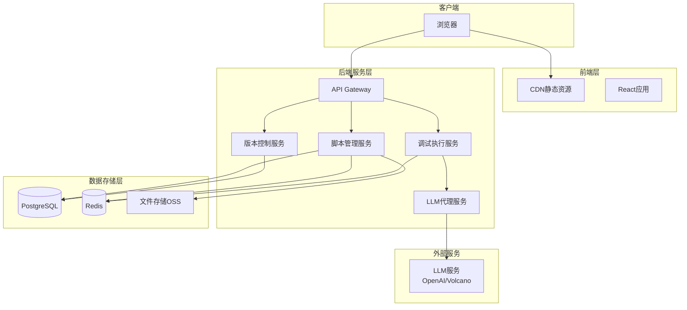

# 咨询脚本云端可视化编辑与调试工具设计

## 文档信息

- **设计目标**: 为咨询师提供PC Web端的云端脚本编辑、版本管理、在线调试一体化工具
- **用户角色**: 咨询师（主要使用者）、平台运营/脚本管理员（高级功能）
- **技术定位**: 浏览器Web应用，无需本地安装，云端存储脚本

---

## 一、业务目标与价值

### 1.1 脚本工程与引擎版本管理概述

**脚本工程的定义**：
脚本工程是一个完整的咨询脚本项目，包含多个相互关联的脚本文件，共同构成一个可执行的咨询方案。一个脚本工程通常包括：
- **全局变量脚本** (global.yaml)：定义跨会谈共享的变量
- **角色配置脚本** (roles.yaml)：定义AI和人类角色的属性
- **会谈流程脚本** (sessions/*.yaml)：定义完整的会谈流程
- **技能库脚本** (skills.yaml)：定义可复用的咨询技术
- **表单定义脚本** (forms.yaml)：定义数据采集表单
- **意识规则脚本** (rules.yaml)：定义意识触发规则

**引擎版本与脚本工程的关系**：
- **脚本引擎版本**：定义了支持哪些Action类型、变量作用域规则、执行机制等
- **脚本工程版本**：咨询师编写的具体脚本内容的版本
- **兼容性问题**：引擎升级可能引入新Action或修改现有Action配置，导致旧脚本不兼容

**管理挑战**：
当引擎持续迭代时（如新增show_pic、use_skill等Action类型），已有的脚本工程可能：
- 无法使用新特性（向前兼容）
- 现有脚本因配置变更而失效（向后兼容）
- 调试时需要匹配正确的引擎版本

### 1.2 核心价值主张

为咨询师提供**零技术门槛**的脚本创作环境，让专业咨询经验能够通过可视化界面转化为可执行的YAML脚本，同时提供调试能力确保脚本质量。

### 1.2 目标用户

**主要用户：咨询师**
- 具备心理咨询专业知识和实践经验
- 希望将咨询经验沉淀为AI咨询脚本
- 不熟悉编程或YAML语法
- 需要快速迭代和验证脚本效果

**次要用户：平台运营/脚本管理员**
- 管理脚本库和版本
- 配置权限和审核流程
- 监控脚本质量和使用情况

### 1.3 核心使用场景

**场景一：创建新的会谈脚本**
咨询师基于某个CBT评估会谈流程，通过可视化界面逐步构建 session → phase → topic → action 结构，配置各类action节点（ai_say、ai_ask、ai_think），定义变量和分支逻辑，最终发布为可用脚本。

**场景二：修改现有脚本并调试**
咨询师发现某个会谈脚本在某个话题的提问不够细致，进入编辑模式修改对应的ai_ask节点，添加更多引导策略，然后在Web内发起调试运行，模拟来访者回答，观察执行路径和变量提取是否符合预期，验证通过后发布新版本。

**场景三：版本回滚与对比**
发现新发布的脚本版本在实际使用中存在问题，咨询师查看历史版本列表，对比差异，选择回滚到上一个稳定版本，恢复正常服务。

---

## 二、功能架构设计

### 2.1 系统功能模块

```mermaid
graph TB
    A[咨询脚本云端编辑器] --> B[脚本工程管理模块]
    A --> C[可视化编辑模块]
    A --> D[版本控制模块]
    A --> E[在线调试模块]
    A --> F[导入导出模块]
    A --> G[引擎版本管理模块]
    
    B --> B1[工程列表]
    B --> B2[工程创建与CRUD]
    B --> B3[工程结构管理]
    B --> B4[多脚本文件管理]
    
    C --> C1[四层结构导航]
    C --> C2[Action节点编辑]
    C --> C3[变量管理面板]
    C --> C4[流程图可视化]
    
    D --> D1[草稿保存]
    D --> D2[工程版本发布]
    D --> D3[版本历史]
    D --> D4[版本对比]
    D --> D5[版本回滚]
    
    E --> E1[调试会话创建]
    E --> E2[对话模拟]
    E --> E3[执行路径追踪]
    E --> E4[变量状态监控]
    E --> E5[调试日志]
    
    F --> F1[工程导出]
    F --> F2[工程导入]
    
    G --> G1[引擎版本注册]
    G --> G2[兼容性检测]
    G --> G3[版本锁定]
    G --> G4[迁移工具]
```



### 2.2 界面布局设计

系统采用**三栏自适应布局**，适配不同屏幕尺寸的PC显示器：

```
┌────────────────────────────────────────────────────────────┐
│  顶部导航栏（Logo、脚本列表入口、用户信息、发布按钮）       │
├──────────┬──────────────────────────────┬──────────────────┤
│          │                              │                  │
│  左侧栏  │        中间主画布             │    右侧面板      │
│  (导航)  │     (可视化编辑区)            │   (属性编辑)     │
│          │                              │                  │
│  - 四层  │  ┌────────────────────┐      │  节点属性表单    │
│    树形  │  │  Session 视图       │      │  或              │
│    导航  │  │  ├─ Phase          │      │  变量列表        │
│          │  │  │  ├─ Topic       │      │  或              │
│  - 变量  │  │  │  │  ├─ Action1  │      │  调试面板        │
│    列表  │  │  │  │  ├─ Action2  │      │                  │
│          │  │  │  │  └─ ...      │      │                  │
│  - 版本  │  └────────────────────┘      │                  │
│    历史  │                              │                  │
│          │  或：Flow Graph 节点图        │                  │
│  可折叠  │                              │   可切换多Tab    │
│          │                              │                  │
└──────────┴──────────────────────────────┴──────────────────┘
```

### 2.3 模块职责

| 模块 | 核心职责 | 关键能力 |
|---------|---------|----------|
| 脚本工程管理模块 | 管理脚本工程的生命周期 | 工程列表、创建、复制、归档、多文件管理 |
| 可视化编辑模块 | 提供图形化编辑能力 | 结构导航、节点编辑、变量管理、实时验证 |
| 版本控制模块 | 管理工程版本和发布流程 | 草稿保存、版本发布、历史查询、差异对比、回滚 |
| 在线调试模块 | 提供脚本执行验证能力 | 会话创建、对话模拟、路径追踪、状态监控 |
| 导入导出模块 | 提供工程可携带性 | ZIP打包、元信息管理、导入解析 |
| 引擎版本管理模块 | 管理引擎与工程的兼容性 | 版本注册、兼容性检测、版本锁定、迁移工具 |

---

## 三、脚本工程管理设计

### 3.1 脚本工程结构

#### 3.1.1 工程文件组织

一个完整的脚本工程包含以下文件：

```
脚本工程名称/
├── project.json          # 工程元信息
├── global.yaml          # 全局变量定义
├── roles.yaml           # 角色配置
├── skills.yaml          # 技能库脚本
├── forms.yaml           # 表单定义脚本
├── rules.yaml           # 意识规则脚本
└── sessions/            # 会谈流程脚本目录
    ├── 首次评估会谈.yaml
    ├── 咨询性会谈.yaml
    └── 巩固性会谈.yaml
```

**project.json 结构**：

```json
{
  "project_id": "proj_001",
  "project_name": "CBT抑郁症评估工程",
  "description": "用于抑郁症患者的CBT评估和咨询流程",
  "engine_version": "1.2.0",
  "engine_version_min": "1.0.0",
  "created_at": "2026-01-09T10:00:00Z",
  "author": "萌加加",
  "version": "2.1.0",
  "files": {
    "global": "global.yaml",
    "roles": "roles.yaml",
    "skills": "skills.yaml",
    "forms": "forms.yaml",
    "rules": "rules.yaml",
    "sessions": [
      "sessions/首次评估会谈.yaml",
      "sessions/咨询性会谈.yaml",
      "sessions/巩固性会谈.yaml"
    ]
  },
  "tags": ["CBT", "抑郁症", "评估"]
}
```

**关键字段说明**：

| 字段 | 说明 | 作用 |
|------|------|------|
| engine_version | 当前工程适配的引擎版本 | 调试时选择匹配的引擎 |
| engine_version_min | 最低兼容的引擎版本 | 防止在低版本引擎上运行 |
| files | 工程包含的所有脚本文件 | 管理多文件关系 |

#### 3.1.2 工程与单文件的关系

**设计原则**：
- 在数据库中，**工程**是一级实体，**脚本文件**是二级实体
- 每个工程包含多个脚本文件，共享同一个版本号
- 发布时打包为一个整体，不支持单独发布某个文件



---

## 四、引擎版本与兼容性管理

### 4.1 引擎版本管理机制

#### 4.1.1 引擎版本定义

**引擎版本包含的关键信息**：

```json
{
  "engine_version": "1.2.0",
  "release_date": "2026-01-09",
  "supported_actions": [
    "say", "user_say", "user_option",
    "ai_say", "ai_ask", "ai_think",
    "call", "fill", "foreach", "loop_until", "if"
  ],
  "action_schemas": {
    "ai_ask": {
      "version": "1.2",
      "required_fields": ["ai_ask", "output"],
      "optional_fields": ["tolist", "condition", "save", "exit", "who", "tone"],
      "changes": [
        {
          "from_version": "1.1",
          "type": "field_added",
          "field": "tone",
          "description": "新增语气风格配置"
        }
      ]
    }
  },
  "deprecated_actions": [],
  "breaking_changes": [],
  "migration_notes": "兼容 1.0.0 以上所有版本"
}
```

#### 4.1.2 版本兼容性策略

**语义化版本号规则** (vMAJOR.MINOR.PATCH)：

| 版本类型 | 变更场景 | 兼容性影响 | 示例 |
|----------|----------|--------------|------|
| MAJOR更新 | 移除Action类型、修改核心机制 | 不兼容旧版本脚本 | 1.x.x → 2.0.0 |
| MINOR更新 | 新增Action类型、新增可选字段 | 向下兼容，旧脚本可用 | 1.1.x → 1.2.0 |
| PATCH更新 | 问题修复、性能优化 | 完全兼容 | 1.2.0 → 1.2.1 |

**兼容性检测规则**：

```
当工程engine_version_min <= 当前引擎版本 <= 工程engine_version 时，认为兼容

例：
工程：engine_version=1.2.0, engine_version_min=1.0.0
可运行于：1.0.0 ~ 1.2.x 的所有引擎版本
不可运行于：0.9.x 或 1.3.x 或 2.x.x
```

#### 4.1.3 版本锁定机制

**问题**：咨询师编写的脚本工程在引擎 v1.2.0 上调试通过，但线上引擎已升级到 v1.3.0，可能导致行为不一致。

**解决方案：版本锁定**

1. **编辑阶段**：
   - 咨询师创建工程时选择目标引擎版本（默认为最新稳定版）
   - 编辑器根据选择的引擎版本显示可用的Action类型

2. **调试阶段**：
   - 调试会话创建时，默认使用工程声明的 `engine_version`
   - 允许手动切换引擎版本进行测试

3. **发布阶段**：
   - 发布时锁定 `engine_version` 到 `project.json`
   - 线上运行时优先使用锁定的引擎版本

4. **升级阶段**：
   - 咨询师可以主动升级工程的 `engine_version`
   - 系统提供兼容性检测和迁移建议

### 4.2 兼容性检测与提示

#### 4.2.1 编辑时检测

**场景一：使用了不支持的Action**

```
用户添加了 show_pic Action，但当前工程锁定的引擎版本 1.1.0 不支持

提示：
⚠️ Action类型 'show_pic' 在引擎 v1.1.0 中不支持
该Action在引擎 v1.3.0 中引入

建议操作：
1. 升级工程引擎版本到 v1.3.0
2. 或移除此Action节点
```

**场景二：使用了废弃的配置字段**

```
ai_ask 中使用了 'save' 字段，但在引擎 v2.0.0 中已被 'output' 替代

提示：
⚠️ 字段 'save' 已在引擎 v2.0.0 中废弃
请使用 'output' 字段替代

自动修复：[点击迁移]
```

#### 4.2.2 调试时检测

**调试启动流程**：



### 4.3 引擎版本迁移工具

#### 4.3.1 迁移场景

**场景：引擎从 v1.2.0 升级到 v2.0.0**

破坏性变更：
- `ai_ask` 的 `save` 字段改为 `output`
- 新增 `ai_think` Action
- 移除 `fill` Action（用 `user_input` 替代）

#### 4.3.2 迁移工具界面

```
╭───────────────────────────────────────╮
│  引擎版本迁移工具                       │
├───────────────────────────────────────┤
│  当前工程：CBT抑郁症评估工程              │
│  当前引擎版本：v1.2.0                     │
│  目标引擎版本：v2.0.0                     │
├───────────────────────────────────────┤
│  检测到的问题：                           │
│                                       │
│  ⚠️ 严重 (2个)：                          │
│  • ai_ask 使用了废弃字段 'save' (3处)  │
│  • 使用了已移除的 'fill' Action (1处) │
│                                       │
│  ℹ️ 提示 (1个)：                          │
│  • 可使用新Action 'ai_think' 优化逻辑  │
├───────────────────────────────────────┤
│  迁移方案：                             │
│                                       │
│  [ ] 自动修复所有可修复问题           │
│      - 将 'save' 替换为 'output'          │
│      - 将 'fill' 转换为 'user_input'       │
│                                       │
│  [ ] 手动修复，生成修复建议文档         │
│                                       │
│  [取消]          [开始迁移]           │
╰───────────────────────────────────────╯
```

#### 4.3.3 自动迁移规则

**规则表示例**：

```json
{
  "migration_rules": [
    {
      "from_version": "1.x.x",
      "to_version": "2.0.0",
      "rules": [
        {
          "type": "field_rename",
          "action_type": "ai_ask",
          "old_field": "save",
          "new_field": "output",
          "transformation": "rename_only"
        },
        {
          "type": "action_replace",
          "old_action": "fill",
          "new_action": "user_input",
          "field_mapping": {
            "form_id": "input_schema"
          }
        }
      ]
    }
  ]
}
```

### 4.4 在线运行时的版本管理

#### 4.4.1 多版本引擎并存

**部署架构**：

```
线上环境
├── engine-v1.0.0/    # 旧版本引擎，仅维护
├── engine-v1.2.0/    # 稳定版引擎，主流使用
├── engine-v1.3.0/    # 最新版引擎，灰度测试
└── gateway/          # 路由网关，根据工程engine_version路由
```

**路由规则**：
```
IF project.engine_version == "1.0.0" THEN route_to engine-v1.0.0
IF project.engine_version == "1.2.0" THEN route_to engine-v1.2.0
IF project.engine_version == "1.3.0" THEN route_to engine-v1.3.0
ELSE 返回错误"不支持的引擎版本"
```

#### 4.4.2 版本退役机制

**退役策略**：
- 当某个引擎版本的使用量 < 1% 且距发布 > 12个月时，标记为"待退役"
- 提前3个月通知咨询师进行工程升级
- 退役后的工程无法调试和运行，必须迁移

---

## 五、详细功能设计

### 5.1 脚本工程管理模块

#### 5.1.1 工程列表视图

**展示内容**：

| 字段 | 说明 | 数据来源 |
|------|------|----------|
| 工程名称 | 工程标题 | project_name |
| 工程描述 | 简要说明 | description |
| 引擎版本 | 适配的引擎版本 | engine_version |
| 状态标签 | 草稿/已发布/已归档 | status + draft_version |
| 当前版本号 | 最新发布版本 | current_version |
| 最近修改时间 | 草稿或版本更新时间 | updated_at |
| 创建人 | 工程创建者 | author |
| 包含文件 | 工程包含的脚本文件数 | files.count |
| 操作按钮 | 编辑/调试/发布/归档 | - |

**交互能力**：
- 支持按引擎版本、状态、创建人筛选
- 支持按名称模糊搜索
- 支持按更新时间、创建时间排序
- 列表项点击进入编辑视图
- 快速操作：复制工程、归档、进入调试、查看文件列表

**工程卡片展示**：

```
╭──────────────────────────────────────╮
│ 📁 CBT抑郁症评估工程      [草稿] v2.1.0 │
├──────────────────────────────────────┤
│ 用于抑郁症患者的CBT评估和咨询流程      │
├──────────────────────────────────────┤
│ 🔧 引擎 v1.2.0  •  萌加加  •  2小时前      │
│ 📄 7个文件  •  CBT, 抑郁症, 评估            │
├──────────────────────────────────────┤
│ [编辑] [调试] [发布] [文件] [...]      │
╰──────────────────────────────────────╯
```

#### 5.1.2 工程创建与CRUD操作

**新建工程**：
1. 弹出创建对话框，填写基本信息：
   - 工程名称（必填）
   - 工程描述（可选）
   - 选择目标引擎版本（默认最新稳定版）
   - 选择模板（可选：空白工程/从模板创建）
2. 确认后生成草稿状态的新工程，跳转到编辑视图
3. 自动初始化基本文件结构：
   - global.yaml（空变量列表）
   - roles.yaml（预设常用角色）
   - skills.yaml（空技能库）
   - sessions/目录

**复制工程**：
- 复制整个工程及其所有文件
- 生成新的project_id
- 工程名称添加"（副本）"后缀
- 版本历史不复制，从 v0.0.1 草稿开始

**归档工程**：
- 归档后工程不出现在常规列表中
- 支持通过"已归档"筛选查看
- 归档工程不可编辑和发布
- 支持取消归档恢复到已发布状态

#### 5.1.3 工程文件管理视图

**工程文件列表页面**：

```
╭────────────────────────────────────────────────╮
│ ← 返回 | CBT抑郁症评估工程 - 文件管理      [保存] [发布] │
├────────────────────────────────────────────────┤
│  工程文件列表                       [+ 新增会谈脚本]  │
│  ┏━━━━━━━━━━━━━━━━━━━━━━━━━━━━━━━━━━┓  │
│  ┃ 🌍 global.yaml                      ┃  │
│  ┃ 全局变量定义                       ┃  │
│  ┃ 最后修改: 2小时前          [编辑] [...]  ┃  │
│  ┗━━━━━━━━━━━━━━━━━━━━━━━━━━━━━━━━━━┛  │
│  ┏━━━━━━━━━━━━━━━━━━━━━━━━━━━━━━━━━━┓  │
│  ┃ 🎭 roles.yaml                       ┃  │
│  ┃ 角色配置                            ┃  │
│  ┃ 最后修改: 1天前            [编辑] [...]  ┃  │
│  ┗━━━━━━━━━━━━━━━━━━━━━━━━━━━━━━━━━━┛  │
│  ┏━━━━━━━━━━━━━━━━━━━━━━━━━━━━━━━━━━┓  │
│  ┃ 💡 skills.yaml                      ┃  │
│  ┃ 技能库脚本                          ┃  │
│  ┃ 最后修改: 3天前            [编辑] [...]  ┃  │
│  ┗━━━━━━━━━━━━━━━━━━━━━━━━━━━━━━━━━━┛  │
│  📂 会谈流程脚本 (3个)                          │
│  ┏━━━━━━━━━━━━━━━━━━━━━━━━━━━━━━━━━━┓  │
│  ┃ 📝 首次评估会谈.yaml              ┃  │
│  ┃ 用于首次评估的会谈流程             ┃  │
│  ┃ 最后修改: 1小时前          [编辑] [...]  ┃  │
│  ┗━━━━━━━━━━━━━━━━━━━━━━━━━━━━━━━━━━┛  │
│  ... (其他会谈脚本)                              │
╰────────────────────────────────────────────────╯
```

**文件操作**：
- 点击"编辑"进入单文件编辑视图
- 支持复制、重命名、删除文件
- 新增会谈脚本时自动添加到 sessions/ 目录
- 所有文件修改共享同一个草稿，发布时打包为一个版本

### 3.2 可视化编辑模块

#### 3.2.1 四层结构导航

**左侧树形导航结构**：

```
📁 脚本名称
  📁 Session: 首次评估会谈
    📁 Phase: 开场白
      📄 Topic: 初遇精灵
        ⚡ action_01: say (欢迎语)
        ⚡ action_02: user_say (用户回应)
        ⚡ action_03: ai_ask (询问名称)
      📄 Topic: 填写基本资料
        ⚡ action_04: ai_ask (询问年龄性别)
        ⚡ action_05: ai_ask (询问文化程度)
    📁 Phase: 主诉收集
      📄 Topic: 当前困扰
      📄 Topic: 情绪识别
  🎯 变量定义 (12个)
  📚 版本历史 (5个版本)
```

**交互规则**：
- 节点支持展开/折叠
- 点击任意层级节点，中间画布定位到对应内容
- 当前选中节点高亮显示
- 支持拖拽调整Topic和Action的顺序（重排序）
- 右键菜单：添加、复制、删除、重命名

**节点图标约定**：

| 图标 | 层级/类型 | 说明 |
|------|----------|------|
| 📁 | Session/Phase | 容器节点 |
| 📄 | Topic | 话题节点 |
| ⚡ | Action | 动作节点 |
| 💬 | ai_say/say | 发言动作 |
| ❓ | ai_ask | 询问动作 |
| 🧠 | ai_think | 思考动作 |
| 👤 | user_say/user_option | 用户动作 |

#### 3.2.2 Action节点可视化编辑

**中间画布展示模式**：

提供两种视图模式可切换：

**模式一：层级列表视图**（默认）
- 垂直排列所有Action卡片
- 每个卡片显示：动作类型、ID、核心内容预览
- 卡片间用箭头连接表示执行顺序
- 支持折叠显示详细属性

**模式二：流程图视图**（高级）
- 以节点连线方式展示Action流程
- 节点形状区分不同Action类型
- 连线表示执行顺序和条件分支
- 支持自动布局和手动调整位置

**Action节点编辑界面**（右侧面板）：

以 `ai_ask` 为例的编辑表单：

```
╔═══════════════════════════════════════╗
║  Action 属性编辑                       ║
╠═══════════════════════════════════════╣
║  动作类型: ai_ask          [类型图标]  ║
║  ─────────────────────────────────    ║
║  Action ID: action_03                 ║
║  ─────────────────────────────────    ║
║  询问提示词: [富文本编辑器]            ║
║  ┌───────────────────────────────┐   ║
║  │ 请询问心旅者的称呼，可以是...   │   ║
║  │                               │   ║
║  └───────────────────────────────┘   ║
║  [插入变量] [AI辅助生成]              ║
║  ─────────────────────────────────    ║
║  语气风格: [温和、同理心]             ║
║  ─────────────────────────────────    ║
║  退出条件: [文本框]                   ║
║  如果心旅者已经提供称呼               ║
║  ─────────────────────────────────    ║
║  输出变量配置:                        ║
║  [+ 添加变量]                         ║
║  ┌─ 变量1 ────────────────────┐      ║
║  │ ☑ 提取变量                  │      ║
║  │ 变量名: 心旅者名  [🔍查看定义]│      ║
║  │ 提取说明: 提取心旅者允许...  │      ║
║  │ [删除]                      │      ║
║  └─────────────────────────────┘      ║
║  ─────────────────────────────────    ║
║  执行条件: [可选]                     ║
║  {在读状态} == 'true'                 ║
║  ─────────────────────────────────    ║
║  [保存修改]  [取消]  [删除Action]     ║
╚═══════════════════════════════════════╝
```

**各类Action的编辑配置项**：

| Action类型 | 核心配置项 | 输入变量 | 输出变量 |
|-----------|-----------|---------|---------|
| ai_say | 生成提示词、语气风格 | 支持引用 | 无 |
| ai_ask | 询问提示词、语气风格、退出条件 | 支持引用 | 支持提取 |
| ai_think | 思考提示词、上下文配置 | 支持引用 | 支持提取 |
| say | 预设文本 | 支持引用 | 无 |
| user_say | 预设文本 | 无 | 无 |
| user_option | 选项列表 | 无 | 用户选择结果 |

#### 3.2.3 变量管理面板

**变量列表视图**：

左侧导航展开"变量定义"节点，显示所有变量：

```
🎯 变量定义 (12个)
  📊 全局变量 (3个)
    - 心旅者名 [String] (已引用5次)
    - 精灵名 [String] (已引用2次)
    - 向导名 [String] (已引用8次)
  📊 Session变量 (2个)
    - 今日任务 [Text] (未引用)
    - 心旅者简介 [Text] (已引用4次)
  📊 Phase变量 (1个)
    - dfad [未定义类型] ⚠️
  📊 Topic变量 (6个)
    - 心旅者年龄 [Number]
    - 心旅者性别 [String]
    - 文化程度 [String]
    - ...
```

**变量详情面板**：

点击变量名，右侧显示详细信息：

```
╔═══════════════════════════════════════╗
║  变量详情                              ║
╠═══════════════════════════════════════╣
║  变量名: 心旅者名                      ║
║  作用域: global                       ║
║  数据类型: String                     ║
║  ─────────────────────────────────    ║
║  定义说明:                            ║
║  心旅者允许心谷向导和助理在对话中      ║
║  对他本人的称呼                        ║
║  ─────────────────────────────────    ║
║  初始值: "心旅者"                     ║
║  ─────────────────────────────────    ║
║  被读取位置: (5处)                     ║
║  • action_07: ai_say                  ║
║  • action_15: say                     ║
║  • action_22: ai_ask                  ║
║  ...                                  ║
║  ─────────────────────────────────    ║
║  被写入位置: (1处)                     ║
║  • action_03: ai_ask -> output        ║
║  ─────────────────────────────────    ║
║  [编辑变量] [删除变量]                 ║
╚═══════════════════════════════════════╝
```

**变量智能提示**：

编辑Action内容时，输入`{`触发变量选择器：

```
┌─ 可用变量 ───────────────┐
│ 🔍 搜索变量...           │
├──────────────────────────┤
│ 📌 当前Topic可用:         │
│   心旅者名               │
│   心旅者年龄             │
│   心旅者性别             │
├──────────────────────────┤
│ 📂 上层可用:              │
│   今日任务 (Session)     │
│   精灵名 (Global)        │
│   向导名 (Global)        │
└──────────────────────────┘
```

**变量问题检测**：

实时验证变量使用，标注问题：

| 问题类型 | 图标 | 说明 | 示例 |
|---------|------|------|------|
| 未定义变量 | ⚠️ | 引用了不存在的变量 | `{用户年龄}` 但未定义 |
| 未使用变量 | 💤 | 定义但从未读取的变量 | `dfad` 定义但无引用 |
| 作用域冲突 | ⚡ | 多层级同名变量 | Topic和Global都定义了`心旅者名` |
| 类型不匹配 | ❌ | 变量用于不兼容的上下文 | 数值变量用于文本拼接 |
| 未赋值使用 | ⚠️ | 变量在赋值前被引用 | action_02读取但action_05才写入 |

#### 3.2.4 实时校验与提示

**校验时机**：
- 节点内容修改时（防抖500ms）
- 切换节点时
- 保存草稿时
- 发布前强制全量校验

**校验规则**：

| 校验项 | 级别 | 描述 |
|-------|------|------|
| YAML语法 | 错误 | 必须是合法的YAML格式 |
| 必填字段 | 错误 | Action的核心字段不能为空 |
| 变量引用 | 警告 | 检查未定义或未使用的变量 |
| ID唯一性 | 错误 | Action ID不能重复 |
| 逻辑完整性 | 警告 | ai_ask必须配置output |
| 执行路径 | 警告 | 检查是否存在无法到达的Action |

**错误提示方式**：
- 节点卡片上显示错误徽章
- 左侧导航相应节点标红
- 右侧面板错误字段下方显示具体提示
- 底部状态栏汇总错误和警告数量

### 3.3 版本控制模块

#### 3.3.1 草稿与版本机制

**设计原则**：
- 每个脚本同时维护一个"草稿"和多个"已发布版本"
- 草稿是可编辑的工作区，不影响线上运行
- 发布操作将草稿内容转为新版本并标记为当前生效版本

**数据模型关系**：



#### 3.3.2 草稿保存

**保存时机**：
- 自动保存：编辑后10秒无操作自动保存
- 手动保存：点击"保存草稿"按钮
- 离开页面前：提示未保存变更

**保存内容**：
- 完整的脚本结构（YAML格式）
- 最后修改时间和修改人
- 不生成版本号

**冲突处理**：
- 多人同时编辑检测：通过updated_at判断
- 检测到冲突时提示用户选择：保留自己修改/覆盖/查看差异后合并

#### 3.3.3 版本发布

**发布流程**：



**发布对话框配置**：

```
╔═══════════════════════════════════════╗
║  发布新版本                            ║
╠═══════════════════════════════════════╣
║  当前版本: v1.2.3                     ║
║  新版本号: v1.2.4  [自动递增]          ║
║  ─────────────────────────────────    ║
║  版本说明: [必填]                      ║
║  ┌───────────────────────────────┐   ║
║  │ 修复了情绪识别环节的变量提取问题│   ║
║  │ 优化了ai_ask的退出条件判断     │   ║
║  └───────────────────────────────┘   ║
║  ─────────────────────────────────    ║
║  ☑ 发布后设为当前生效版本              ║
║  ─────────────────────────────────    ║
║  [取消]          [确认发布]           ║
╚═══════════════════════════════════════╝
```

**版本号规则**：
- 采用语义化版本号：`v主版本.次版本.修订号`
- 主版本：重大结构变更（手动指定）
- 次版本：新增功能或话题（自动递增）
- 修订号：问题修复或微调（自动递增）

#### 3.3.4 版本历史与对比

**版本历史列表**：

```
╔═══════════════════════════════════════╗
║  版本历史                              ║
╠═══════════════════════════════════════╣
║  v1.2.4  [当前生效]                   ║
║  2026-01-09 15:30                    ║
║  发布人: 萌加加                        ║
║  说明: 修复了情绪识别环节的变量提取... ║
║  [查看详情] [对比差异]                 ║
║  ─────────────────────────────────    ║
║  v1.2.3                              ║
║  2026-01-08 10:15                    ║
║  发布人: 萌加加                        ║
║  说明: 新增家庭教养话题                ║
║  [查看详情] [对比差异] [回滚到此版本]  ║
║  ─────────────────────────────────    ║
║  v1.2.2                              ║
║  2026-01-05 18:45                    ║
║  ...                                 ║
╚═══════════════════════════════════════╝
```

**版本详情（只读视图）**：
- 以只读模式打开编辑器，展示该版本的完整脚本结构
- 左上角标注"历史版本 v1.2.3 (只读)"
- 提供"对比当前草稿"和"回滚到此版本"按钮

**版本差异对比**：

提供两种对比方式：

**方式一：文本Diff对比**（默认）
```
╔═════════════════════════════════════════╗
║  版本对比: v1.2.3 vs v1.2.4             ║
╠═════════════════════════════════════════╣
║  左侧: v1.2.3    │  右侧: v1.2.4        ║
║  ────────────────┼─────────────────     ║
║  actions:        │  actions:            ║
║ - ai_ask: |      │ - ai_ask: |          ║
║     询问心旅者... │     询问心旅者...     ║
║     output:      │     output:          ║
║ -   - get: 情绪  │ +   - get: 问题的情绪 ║ (修改)
║       define: .. │       define: 提取... ║
║                  │ +   - get: 情绪强度   ║ (新增)
║                  │ +     define: ...     ║
╚═════════════════════════════════════════╝
```

**方式二：结构化对比**（高级）
- 以树形结构展示差异
- 用颜色标识：绿色=新增、红色=删除、黄色=修改
- 仅显示有变更的节点及其父路径

#### 3.3.5 版本回滚

**回滚原则**：
- 回滚不是直接恢复，而是基于历史版本创建新版本
- 保留所有历史记录，可追溯

**回滚流程**：



**回滚记录**：
- 版本说明自动填充："回滚到 v1.2.3"
- 版本号继续递增（v1.2.5）
- 操作日志记录回滚动作和目标版本

### 3.4 在线调试模块

#### 3.4.1 调试会话创建

**调试入口**：
- 编辑器顶部"调试运行"按钮
- 快捷键：Ctrl+F5

**调试配置对话框**：

```
╔═══════════════════════════════════════╗
║  启动调试会话                          ║
╠═══════════════════════════════════════╣
║  调试版本:                             ║
║  ⚪ 当前草稿                           ║
║  ⚪ 已发布版本: v1.2.4                 ║
║  ─────────────────────────────────    ║
║  调试模式:                             ║
║  ⚪ 正常执行（自动往下）                ║
║  ⚪ 单步调试（需手动确认每步）          ║
║  ─────────────────────────────────    ║
║  初始变量: [可选]                      ║
║  ┌───────────────────────────────┐   ║
║  │ 预设心旅者信息用于测试...       │   ║
║  └───────────────────────────────┘   ║
║  ─────────────────────────────────    ║
║  [取消]          [开始调试]           ║
╚═══════════════════════════════════════╝
```

#### 3.4.2 调试界面布局

**三栏调试视图**：

```
┌────────────────────────────────────────────────────────────┐
│  调试工具栏: [▶继续] [⏸暂停] [⏭下一步] [⏹停止] [⏮重新开始] │
├──────────┬──────────────────────────────┬──────────────────┤
│          │                              │                  │
│  左栏    │        中间对话区             │    右栏          │
│ 执行路径 │     (对话模拟)                │  变量状态        │
│          │                              │                  │
│ 当前执行 │  ┌────────────────────┐      │ 📊 当前变量值    │
│ 位置:    │  │ 守望精灵:           │      │                  │
│          │  │ 你好，欢迎来到...   │      │ 心旅者名:        │
│ ✅ 开场白│  │                    │      │   "小明"         │
│ ✅ 初遇  │  │ [心旅者输入框]      │      │   📝 action_03   │
│   精灵   │  │ ┌──────────────┐  │      │                  │
│ ▶ 填写  │  │ │              │  │      │ 精灵名:          │
│   基本   │  │ │              │  │      │   "喵喵"         │
│   资料   │  │ └──────────────┘  │      │   📝 global初始  │
│          │  │ [发送] 或回车       │      │                  │
│ ⏸ 主诉  │  └────────────────────┘      │ 心旅者年龄:      │
│   收集   │                              │   null(未赋值)   │
│   (未执行)                              │                  │
│          │  💡 当前Action说明:           │ [刷新] [导出快照]│
│ 🌲 折叠  │  ai_ask - 询问年龄性别        │                  │
│   全部   │  等待用户输入...              │                  │
│          │                              │                  │
└──────────┴──────────────────────────────┴──────────────────┘
│  📋 执行日志: [action_01] 执行say -> 输出"你好，欢迎..."    │
│             [action_02] 执行user_say -> 等待用户点击       │
│             [action_03] 执行ai_ask -> 生成提问"请问你的..." │
└────────────────────────────────────────────────────────────┘
```

#### 3.4.3 对话模拟交互

**对话流程**：



**交互要素**：

| 元素 | 说明 | 交互方式 |
|------|------|---------|
| AI发言气泡 | 展示say/ai_say内容 | 只读，自动出现 |
| 用户输入框 | 模拟来访者回答 | 文本输入+发送 |
| 用户选项按钮 | user_option的选项 | 点击选择 |
| 确认按钮 | user_say需要确认 | 点击继续 |
| 执行步进按钮 | 单步调试控制 | 点击执行下一Action |

#### 3.4.4 执行路径可视化

**左栏执行路径显示**：

- 以树形结构展示脚本层级
- 用图标标识执行状态：
  - ✅ 已执行完成
  - ▶️ 正在执行
  - ⏸️ 待执行
  - ⏭️ 已跳过（条件不满足）
- 高亮当前执行位置
- 支持点击已执行节点回看历史状态

**执行轨迹记录**：

每个Action执行时记录：
- 执行时间戳
- 执行结果（成功/跳过/错误）
- 输入内容（用户输入或变量值）
- 输出内容（生成文本或提取变量）
- 执行耗时

#### 3.4.5 变量状态监控

**右栏变量面板**：

实时展示所有变量的当前值：

```
╔═══════════════════════════════════════╗
║  变量状态监控                          ║
╠═══════════════════════════════════════╣
║  📊 全局变量                           ║
║  ┌─────────────────────────────┐     ║
║  │ 心旅者名: "小明"  ✅         │     ║
║  │ 来源: action_03 (ai_ask)     │     ║
║  │ 赋值时间: 14:25:33           │     ║
║  └─────────────────────────────┘     ║
║  ┌─────────────────────────────┐     ║
║  │ 精灵名: "喵喵"  ✅           │     ║
║  │ 来源: global初始值           │     ║
║  └─────────────────────────────┘     ║
║  ─────────────────────────────────    ║
║  📊 Session变量                        ║
║  ┌─────────────────────────────┐     ║
║  │ 心旅者年龄: null  ⏸️         │     ║
║  │ 状态: 未赋值                 │     ║
║  │ 预计赋值: action_04          │     ║
║  └─────────────────────────────┘     ║
║  ─────────────────────────────────    ║
║  [导出快照]  [复制变量表]             ║
╚═══════════════════════════════════════╝
```

**变量状态标识**：
- ✅ 已赋值
- ⏸️ 未赋值
- ⚠️ 读取时未赋值（执行错误）
- 🔄 值已更新（闪烁提示）

**变量追踪能力**：
- 点击变量名，高亮所有读写位置
- 显示变量的完整变更历史
- 支持导出当前变量快照（JSON格式）

#### 3.4.6 调试日志

**底部日志面板**：

```
📋 执行日志 (共执行15个Action，耗时8.3秒)
──────────────────────────────────────
14:25:20 [action_01] 类型:say 结果:成功
         输出: "欢迎来到游心谷，我是心谷的守望精灵。"
14:25:22 [action_02] 类型:user_say 结果:成功
         用户确认: "你终于醒啦！..."
14:25:25 [action_03] 类型:ai_ask 结果:成功
         LLM调用耗时: 1.2s
         生成提问: "请问我该怎么称呼你？"
14:25:33 [action_03] 用户输入: "叫我小明吧"
         变量提取: 心旅者名 = "小明"
         退出条件: 已满足
14:25:33 [action_04] 类型:say 结果:成功
         输出: "小明，很高兴认识你。"
...
──────────────────────────────────────
[导出完整日志] [清空] [筛选错误]
```

**日志级别**：
- 🔵 INFO: 正常执行
- 🟡 WARN: 警告（如变量未赋值但继续执行）
- 🔴 ERROR: 执行错误
- 🟣 DEBUG: 调试信息（LLM请求详情等）

### 3.5 导入导出模块

#### 3.5.1 脚本导出

**导出触发**：
- 脚本列表操作菜单："导出脚本"
- 版本历史："导出此版本"

**导出内容**：

生成ZIP压缩包，包含：

```
脚本名称_v1.2.4_20260109.zip
├── script.yaml              # 脚本内容(YAML格式)
├── metadata.json            # 元信息
└── readme.txt               # 说明文档
```

**metadata.json 结构**：

```json
{
  "script_id": "script_001",
  "script_name": "首次评估会谈",
  "script_type": "session",
  "version": "v1.2.4",
  "author": "萌加加",
  "exported_at": "2026-01-09T14:30:00Z",
  "release_note": "修复了情绪识别环节的变量提取问题",
  "export_source": "published_version"
}
```

#### 3.5.2 脚本导入

**导入流程**：



**导入选项**：

```
╔═══════════════════════════════════════╗
║  导入脚本                              ║
╠═══════════════════════════════════════╣
║  已解析脚本信息:                       ║
║  名称: 首次评估会谈                    ║
║  版本: v1.2.4                         ║
║  作者: 萌加加                          ║
║  导出时间: 2026-01-09                 ║
║  ─────────────────────────────────    ║
║  导入方式:                             ║
║  ⚪ 作为新脚本导入                     ║
║  ⚪ 导入到现有脚本的草稿                ║
║     └─ 选择目标: [下拉选择脚本]        ║
║  ─────────────────────────────────    ║
║  ⚠️ 导入到现有脚本将覆盖当前草稿       ║
║  ─────────────────────────────────    ║
║  [取消]          [确认导入]           ║
╚═══════════════════════════════════════╝
```

---

## 四、数据模型设计

### 4.1 核心数据实体

#### 脚本表 (scripts)

| 字段 | 类型 | 说明 | 约束 |
|------|------|------|------|
| script_id | VARCHAR(64) | 脚本唯一标识 | PK |
| script_name | VARCHAR(255) | 脚本名称 | NOT NULL |
| script_type | ENUM | 脚本类型 | session/technique/skill |
| description | TEXT | 脚本描述 | - |
| author | VARCHAR(128) | 创建人 | - |
| current_version_id | VARCHAR(64) | 当前生效版本ID | FK |
| status | ENUM | 状态 | draft/published/archived |
| created_at | TIMESTAMP | 创建时间 | DEFAULT NOW() |
| updated_at | TIMESTAMP | 更新时间 | ON UPDATE NOW() |

#### 草稿表 (script_drafts)

| 字段 | 类型 | 说明 | 约束 |
|------|------|------|------|
| script_id | VARCHAR(64) | 脚本ID | PK, FK |
| script_content | JSON | 脚本内容(结构化) | NOT NULL |
| yaml_content | TEXT | YAML格式内容 | - |
| updated_at | TIMESTAMP | 最后修改时间 | ON UPDATE NOW() |
| updated_by | VARCHAR(128) | 最后修改人 | - |
| validation_status | ENUM | 校验状态 | valid/invalid/unknown |
| validation_errors | JSON | 校验错误列表 | - |

#### 版本表 (script_versions)

| 字段 | 类型 | 说明 | 约束 |
|------|------|------|------|
| version_id | VARCHAR(64) | 版本唯一标识 | PK |
| script_id | VARCHAR(64) | 脚本ID | FK |
| version_number | VARCHAR(32) | 版本号 | v1.2.3 |
| script_content | JSON | 脚本内容(结构化) | NOT NULL |
| yaml_content | TEXT | YAML格式内容 | - |
| release_note | TEXT | 版本说明 | - |
| published_at | TIMESTAMP | 发布时间 | DEFAULT NOW() |
| published_by | VARCHAR(128) | 发布人 | - |
| is_rollback | BOOLEAN | 是否回滚版本 | DEFAULT FALSE |
| rollback_from_version_id | VARCHAR(64) | 回滚源版本 | FK |

#### 调试会话表 (debug_sessions)

| 字段 | 类型 | 说明 | 约束 |
|------|------|------|------|
| session_id | VARCHAR(64) | 会话唯一标识 | PK |
| script_id | VARCHAR(64) | 脚本ID | FK |
| version_id | VARCHAR(64) | 调试版本ID | FK(可NULL=草稿) |
| debug_mode | ENUM | 调试模式 | normal/step |
| initial_variables | JSON | 初始变量配置 | - |
| execution_log | JSON | 执行日志 | - |
| final_variables | JSON | 最终变量状态 | - |
| started_at | TIMESTAMP | 开始时间 | DEFAULT NOW() |
| ended_at | TIMESTAMP | 结束时间 | - |
| started_by | VARCHAR(128) | 调试人 | - |
| status | ENUM | 会话状态 | running/completed/stopped |

### 4.2 脚本内容结构（JSON Schema）

**script_content字段的JSON结构**：

```json
{
  "script_meta": {
    "script_id": "script_001",
    "script_name": "首次评估会谈",
    "script_type": "session",
    "description": "用于首次评估的会谈流程"
  },
  "variables": {
    "global": [
      {
        "var_name": "心旅者名",
        "var_type": "string",
        "scope": "global",
        "define": "心旅者允许心谷向导和助理在对话中对他本人的称呼",
        "default_value": "心旅者"
      }
    ],
    "session": [],
    "phase": [],
    "topic": []
  },
  "sessions": [
    {
      "session_id": "session_01",
      "session_name": "首次评估会谈",
      "phases": [
        {
          "phase_id": "phase_01",
          "phase_name": "开场白",
          "topics": [
            {
              "topic_id": "topic_01",
              "topic_name": "初遇精灵",
              "description": "引导心旅者认识守望精灵",
              "actions": [
                {
                  "action_id": "action_01",
                  "action_type": "say",
                  "content": "欢迎来到游心谷，我是心谷的守望精灵。",
                  "condition": null
                },
                {
                  "action_id": "action_02",
                  "action_type": "ai_ask",
                  "prompt": "请询问心旅者的称呼...",
                  "tone": "温和、同理心",
                  "exit_condition": "如果心旅者已经提供称呼",
                  "output": [
                    {
                      "type": "get",
                      "var_name": "心旅者名",
                      "define": "提取心旅者允许心谷向导和助理在对话中对他本人的称呼"
                    }
                  ],
                  "condition": null
                }
              ]
            }
          ]
        }
      ]
    }
  ]
}
```

### 4.3 数据关系图



---

## 五、技术方案建议

### 5.1 前端技术栈

**推荐方案**：React + TypeScript + Ant Design

**理由**：
- React：组件化开发，适合复杂交互界面
- TypeScript：类型安全，降低维护成本
- Ant Design：成熟的企业级UI组件库，提供丰富的表单、树形、图表组件

**关键技术选型**：

| 功能模块 | 技术方案 | 说明 |
|---------|---------|------|
| 流程图可视化 | ReactFlow | 专业的流程图库，支持节点拖拽和连线 |
| 代码编辑器 | Monaco Editor | VS Code同款编辑器，支持YAML语法高亮 |
| 富文本编辑 | Slate.js | 灵活的富文本框架，支持变量插入 |
| 状态管理 | Zustand | 轻量级状态管理库 |
| 版本对比 | react-diff-viewer | 支持文本差异对比展示 |
| 路由管理 | React Router | 单页应用路由 |

### 5.2 后端技术架构

**推荐架构**：Node.js + Express / Fastify

**核心能力**：

| 服务 | 职责 | 接口示例 |
|------|------|---------|
| 脚本管理服务 | 脚本CRUD、权限控制 | POST /api/scripts<br>GET /api/scripts/:id |
| 版本控制服务 | 版本发布、历史查询、对比 | POST /api/scripts/:id/versions<br>GET /api/scripts/:id/versions<br>POST /api/scripts/:id/rollback |
| 调试执行服务 | 创建调试会话、执行脚本 | POST /api/debug/sessions<br>POST /api/debug/sessions/:id/execute |
| 导入导出服务 | ZIP打包、解析 | POST /api/scripts/:id/export<br>POST /api/scripts/import |
| LLM代理服务 | 转发LLM请求、缓存结果 | POST /api/llm/generate |

### 5.3 存储方案

**数据库选择**：PostgreSQL

**理由**：
- 支持JSON字段存储结构化脚本内容
- 事务支持确保版本发布原子性
- 成熟的权限管理能力

**缓存方案**：Redis

**用途**：
- 缓存草稿编辑状态（减少数据库写压力）
- 缓存LLM调用结果（降低调试成本）
- 分布式锁（防止并发编辑冲突）

### 5.4 部署架构



---

## 六、非功能性设计

### 6.1 权限与安全

#### 6.1.1 用户角色

| 角色 | 权限范围 | 典型操作 |
|------|---------|---------|
| 咨询师 | 自己创建的脚本 | 编辑、调试、发布、导出 |
| 团队管理员 | 团队内所有脚本 | 审核、归档、权限配置 |
| 平台运营 | 全平台脚本 | 监控、审计、模板管理 |

#### 6.1.2 权限控制策略

**脚本级权限**：
- 脚本创建人默认拥有完全权限
- 支持将脚本共享给团队成员（只读/可编辑）
- 支持设置脚本为"团队公共脚本"

**操作级权限**：

| 操作 | 所需权限 | 控制点 |
|------|---------|-------|
| 查看脚本列表 | 登录用户 | 过滤非授权脚本 |
| 查看脚本详情 | 脚本读权限 | API鉴权 |
| 编辑草稿 | 脚本写权限 | API鉴权 |
| 发布版本 | 脚本发布权限 | API鉴权+审核流程 |
| 回滚版本 | 脚本发布权限 | API鉴权+操作日志 |
| 归档脚本 | 脚本管理权限 | API鉴权 |
| 调试运行 | 脚本读权限 | 会话隔离 |

#### 6.1.3 数据安全

**传输安全**：
- 全站HTTPS加密传输
- API接口JWT Token认证

**存储安全**：
- 敏感信息脱敏存储（如用户隐私变量）
- 脚本内容加密存储（可选）
- 定期数据库备份

**审计日志**：
- 记录所有脚本变更操作（时间、人员、内容）
- 记录版本发布和回滚操作
- 敏感操作二次确认

### 6.2 性能设计

#### 6.2.1 响应时间目标

| 操作 | 目标响应时间 | 说明 |
|------|-------------|------|
| 脚本列表加载 | < 500ms | 支持分页和缓存 |
| 脚本详情打开 | < 1s | 结构化数据快速渲染 |
| 草稿自动保存 | < 200ms | 后台异步保存 |
| 版本发布 | < 2s | 包含校验和写入 |
| 调试启动 | < 1s | 会话创建和脚本加载 |
| 调试执行单步 | < 3s | 包含LLM调用 |

#### 6.2.2 性能优化策略

**前端优化**：
- 大脚本虚拟滚动（仅渲染可见节点）
- 编辑防抖（500ms内避免重复保存）
- 懒加载历史版本列表
- 组件级别缓存（React.memo）

**后端优化**：
- Redis缓存热点脚本
- 数据库索引优化（script_id, version_id）
- LLM调用结果缓存（相同prompt复用）
- 批量操作优化（批量变量提取）

**调试优化**：
- 调试会话状态存入Redis（快速读写）
- 执行日志流式写入（避免阻塞）
- 单步执行异步处理（前端轮询状态）

### 6.3 可扩展性设计

#### 6.3.1 插件化Action类型

**设计目标**：支持未来扩展新的Action类型（如show_pic、use_skill等）

**实现方案**：
- 前端：Action编辑器采用策略模式，根据action_type动态加载编辑组件
- 后端：Action执行器采用注册机制，新类型无需改核心流程

**扩展示例**：

```typescript
// 前端Action编辑组件注册
const actionEditors = {
  'ai_say': AiSayEditor,
  'ai_ask': AiAskEditor,
  'ai_think': AiThinkEditor,
  'show_pic': ShowPicEditor,  // 新增
  'use_skill': UseSkillEditor  // 新增
}

// 后端Action执行器注册
const actionExecutors = {
  'ai_say': new AiSayExecutor(),
  'ai_ask': new AiAskExecutor(),
  'ai_think': new AiThinkExecutor(),
  'show_pic': new ShowPicExecutor(),  // 新增
  'use_skill': new UseSkillExecutor()  // 新增
}
```

#### 6.3.2 多租户支持

**设计考虑**：
- 数据隔离：脚本、版本、调试会话按租户ID分区
- 配置隔离：不同租户可配置不同的LLM服务
- 资源隔离：调试并发数、存储配额按租户限制

### 6.4 可用性设计

#### 6.4.1 错误处理

**用户友好的错误提示**：

| 错误场景 | 错误提示 | 操作建议 |
|---------|---------|---------|
| 网络请求失败 | "网络连接异常，请检查网络后重试" | 提供"重试"按钮 |
| 脚本校验失败 | "脚本存在X个错误，无法发布" | 定位到错误位置并高亮 |
| 并发编辑冲突 | "草稿已被其他用户修改" | 提供"查看差异"和"覆盖/合并"选项 |
| LLM调用超时 | "AI服务响应超时，请稍后重试" | 提供"重新执行"按钮 |
| 调试会话异常 | "调试执行出错：变量未定义" | 在日志中显示错误堆栈 |

#### 6.4.2 数据恢复

**草稿自动保存**：
- 每10秒自动保存草稿到服务端
- 本地浏览器存储临时副本（离线编辑支持）

**版本历史保留**：
- 所有已发布版本永久保留
- 支持导出任意历史版本

**调试会话保留**：
- 调试会话保留7天（可配置）
- 支持查看历史调试记录

---

## 七、实施路线图

### 7.1 MVP阶段（2-3周）

**目标**：实现基础编辑和版本管理能力

**功能范围**：
- ✅ 脚本列表管理（CRUD）
- ✅ 基础编辑界面（四层结构导航+YAML编辑器）
- ✅ 支持ai_say、ai_ask、ai_think三种Action编辑
- ✅ 变量列表展示和编辑
- ✅ 草稿保存和版本发布
- ✅ 版本历史查看

**验收标准**：
- 咨询师可创建新脚本并编辑基本结构
- 可发布版本并查看历史记录
- 草稿自动保存不丢失

### 7.2 调试阶段（2周）

**目标**：实现在线调试能力

**功能范围**：
- ✅ 调试会话创建
- ✅ 对话模拟界面
- ✅ 执行路径可视化
- ✅ 变量状态监控
- ✅ 执行日志记录

**验收标准**：
- 可在浏览器内模拟完整会谈流程
- 变量提取和更新正确展示
- 执行路径可追踪

### 7.3 优化阶段（2周）

**目标**：提升用户体验

**功能范围**：
- ✅ 流程图可视化视图
- ✅ 版本差异对比
- ✅ 版本回滚能力
- ✅ 导入导出功能
- ✅ 变量引用智能提示
- ✅ 实时校验和错误定位

**验收标准**：
- 流程图清晰展示脚本结构
- 版本对比准确，回滚无误
- 编辑体验流畅，错误提示明确

### 7.4 扩展阶段（持续迭代）

**后续规划**：
- 支持更多Action类型（show_pic、use_skill、loop、condition等）
- AI辅助生成：根据自然语言描述生成Action配置
- 脚本模板库：提供常见会谈场景模板
- 团队协作：多人实时协同编辑
- 权限审核流程：脚本发布审批机制
- 移动端适配：支持平板设备查看和轻量编辑

---

## 八、交互原型（关键页面）

### 8.1 脚本列表页

**页面布局**：

```
┌────────────────────────────────────────────────────────┐
│ [Logo] 咨询脚本编辑器    [新建脚本] [导入] [@用户名▼]   │
├────────────────────────────────────────────────────────┤
│ 🔍 搜索脚本...  [类型▼] [状态▼] [创建人▼]              │
├────────────────────────────────────────────────────────┤
│  脚本列表                            [列表] [卡片]       │
│  ┌────────────────────────────────────────────────┐   │
│  │ 📄 首次评估会谈              [草稿] v1.2.4      │   │
│  │    会谈流程  •  萌加加  •  1小时前               │   │
│  │    [编辑] [调试] [发布] [...]                   │   │
│  ├────────────────────────────────────────────────┤   │
│  │ 📄 情绪识别技术              [已发布] v2.1.0    │   │
│  │    咨询技术  •  萌加加  •  2天前                 │   │
│  │    [查看] [复制] [调试] [...]                   │   │
│  ├────────────────────────────────────────────────┤   │
│  │ ...                                            │   │
│  └────────────────────────────────────────────────┘   │
│  [1] 2 3 ... 10 >                                     │
└────────────────────────────────────────────────────────┘
```

### 8.2 脚本编辑页

**页面布局**：

```
┌────────────────────────────────────────────────────────┐
│ 🔙 返回列表 | 首次评估会谈 [草稿]  [保存] [调试] [发布]  │
├──────┬────────────────────────────────┬────────────────┤
│      │                                │  Action 属性   │
│ 📁结构│   Flow Graph 视图              │ ┌────────────┐│
│  ▼ S │  ┌───┐    ┌───┐    ┌───┐    │ │ 类型: ai_ask││
│   ess│  │say│───▶│usr│───▶│ask│    │ │             ││
│  ▼ P │  └───┘    └───┘    └───┘    │ │ 提示词:     ││
│   hase│    │        │        │       │ │ [编辑框]    ││
│   ▶ T│    ▼        ▼        ▼       │ │             ││
│    opic│  ...      ...      ...      │ │ 输出变量:   ││
│     A│                                │ │ + 添加      ││
│    ction│                              │ └────────────┘│
│      │                                │                │
│ 🎯变量│                                │  或显示:       │
│  • 心│                                │  变量详情面板  │
│    旅者│                                │                │
│  • 精│                                │                │
│    灵名│                                │                │
│      │                                │                │
│ 📚版本│                                │                │
│  v1.2│                                │                │
│      │                                │                │
└──────┴────────────────────────────────┴────────────────┘
```

### 8.3 调试运行页

**页面布局**：

```
┌────────────────────────────────────────────────────────┐
│ 🔙 退出调试 | 首次评估会谈 [调试中] ▶️ ⏸ ⏭ ⏹ ⏮        │
├──────┬────────────────────────────────┬────────────────┤
│      │                                │  变量监控      │
│ 执行 │   对话区                        │ ┌────────────┐│
│ 路径 │  ┌──────────────────────┐      │ │ 📊全局变量 ││
│      │  │ 🤖 守望精灵:          │      │ │ 心旅者名:  ││
│ ✅开场│  │ 欢迎来到游心谷...     │      │ │  "小明"    ││
│ ✅初遇│  │                      │      │ │  ✅已赋值  ││
│  精灵│  │ 👤 [心旅者输入]       │      │ │            ││
│ ▶填写│  │ ┌──────────────────┐│      │ │ 精灵名:    ││
│  基本│  │ │ 叫我小明吧         ││      │ │  "喵喵"    ││
│  资料│  │ └──────────────────┘│      │ │  ✅初始值  ││
│      │  │ [发送]  或  [回车]    │      │ │            ││
│ ⏸主诉│  └──────────────────────┘      │ │ 📊Session  ││
│  收集│                                │ │ 心旅者年龄:││
│      │  💡 当前: ai_ask - 询问称呼    │ │  null      ││
│      │     等待用户输入...            │ │  ⏸未赋值   ││
│      │                                │ └────────────┘│
└──────┴────────────────────────────────┴────────────────┘
│  📋 执行日志: [14:25:33] action_03 用户输入 -> 提取变量...│
└────────────────────────────────────────────────────────┘
```

---

## 九、风险与应对

### 9.1 技术风险

| 风险项 | 影响 | 概率 | 应对措施 |
|-------|------|------|---------|
| LLM调用不稳定 | 调试体验差 | 中 | 设置超时重试机制，提供Mock模式跳过LLM调用 |
| 大脚本性能问题 | 编辑卡顿 | 中 | 虚拟滚动、分页加载、懒加载 |
| 并发编辑冲突 | 数据覆盖 | 低 | 乐观锁+冲突检测+差异合并 |
| 浏览器兼容性 | 部分功能不可用 | 低 | 明确支持浏览器范围（Chrome/Edge最新版）|

### 9.2 业务风险

| 风险项 | 影响 | 概率 | 应对措施 |
|-------|------|------|---------|
| 咨询师学习成本高 | 使用率低 | 中 | 提供详细教程、模板库、新手引导 |
| 脚本质量参差不齐 | 实际使用效果差 | 高 | 加强校验规则、提供最佳实践文档、引入审核机制 |
| 版本管理混乱 | 回滚困难 | 中 | 强制填写版本说明、差异对比、操作审计 |

### 9.3 数据风险

| 风险项 | 影响 | 概率 | 应对措施 |
|-------|------|------|---------|
| 草稿丢失 | 工作成果损失 | 低 | 自动保存+本地缓存+定期备份 |
| 版本误删除 | 无法恢复 | 低 | 软删除+回收站机制+权限控制 |
| 敏感信息泄露 | 隐私问题 | 低 | 权限严格控制+审计日志+数据脱敏 |

---

## 十、总结与建议

### 10.1 设计核心要点

**以咨询师为中心的设计理念**：
- 零技术门槛：无需了解YAML语法，通过可视化界面完成所有操作
- 即时反馈：编辑过程实时校验，调试过程可视化执行路径
- 容错机制：自动保存、版本历史、冲突检测保障数据安全

**云端优先架构**：
- 无需本地安装，浏览器即可使用
- 脚本云端存储，跨设备访问
- 版本管理与协作能力内置

**调试能力集成**：
- Web内模拟完整会谈流程
- 执行路径和变量状态实时可视化
- 快速定位脚本问题，缩短迭代周期

### 10.2 与现有系统集成建议

**与脚本执行引擎集成**：
- 编辑器生成的JSON格式脚本可直接被core-engine执行
- 调试模块复用core-engine的ScriptExecutor
- 变量定义与引擎层VariableExtractor保持一致

**与API Server集成**：
- 编辑器作为独立Web应用部署
- 通过api-server提供的脚本管理API进行增删改查
- 调试会话通过api-server的sessions接口创建

**数据库扩展**：
- 在现有scripts表基础上新增drafts和versions表
- sessions表扩展debug_mode字段支持调试会话

### 10.3 实施优先级建议

**阶段一：MVP核心能力**（必须）
- 脚本CRUD和列表管理
- 四层结构编辑和Action节点配置
- 变量管理和引用提示
- 草稿保存和版本发布

**阶段二：调试验证能力**（高优先级）
- 调试会话创建和对话模拟
- 执行路径可视化
- 变量状态监控

**阶段三：体验优化**（中优先级）
- 流程图可视化视图
- 版本对比和回滚
- 实时校验和智能提示

**阶段四：扩展功能**（低优先级）
- 更多Action类型支持
- AI辅助生成
- 团队协作和权限管理

### 10.4 成功标准

**用户接受度**：
- 咨询师能在30分钟内学会基础编辑操作
- 创建一个标准会谈脚本平均耗时 < 2小时
- 调试发现并修复问题的效率提升50%以上

**系统稳定性**：
- 草稿自动保存成功率 > 99.9%
- 版本发布成功率 > 99%
- 调试会话执行成功率 > 95%

**性能指标**：
- 页面首屏加载时间 < 2s
- 编辑操作响应时间 < 500ms
- 调试单步执行时间 < 3s (含LLM调用)

---

## 附录

### A. 术语表

| 术语 | 英文 | 说明 |
|------|------|------|
| 会谈脚本 | Session Script | 完整的咨询会谈流程脚本 |
| 咨询技术脚本 | Technique Script | 可复用的咨询技术片段 |
| 草稿 | Draft | 可编辑的脚本工作版本 |
| 版本 | Version | 已发布的不可变脚本版本 |
| Action | Action | 脚本中的最小执行单元 |
| 变量 | Variable | 存储会谈过程中信息的容器 |
| 调试会话 | Debug Session | 模拟脚本执行的测试会话 |
| 执行路径 | Execution Path | 脚本实际执行的Action序列 |

### B. 接口清单（示例）

**脚本管理接口**：

```
GET    /api/scripts              # 获取脚本列表
POST   /api/scripts              # 创建新脚本
GET    /api/scripts/:id          # 获取脚本详情
PUT    /api/scripts/:id          # 更新脚本信息
DELETE /api/scripts/:id          # 删除脚本（归档）

GET    /api/scripts/:id/draft    # 获取草稿内容
PUT    /api/scripts/:id/draft    # 保存草稿

POST   /api/scripts/:id/publish  # 发布版本
GET    /api/scripts/:id/versions # 获取版本历史
GET    /api/scripts/:id/versions/:vid  # 获取特定版本
POST   /api/scripts/:id/rollback # 回滚到指定版本
GET    /api/scripts/:id/diff     # 对比两个版本
```

**调试接口**：

```
POST   /api/debug/sessions       # 创建调试会话
GET    /api/debug/sessions/:sid  # 获取会话状态
POST   /api/debug/sessions/:sid/execute  # 执行下一步
POST   /api/debug/sessions/:sid/input    # 提交用户输入
DELETE /api/debug/sessions/:sid  # 停止调试会话
```

**导入导出接口**：

```
GET    /api/scripts/:id/export   # 导出脚本
POST   /api/scripts/import       # 导入脚本
```

### C. 参考资料

**相关文档**：
- 《CBT咨询脚本YAML格式规范》：docs/temp/script samples/script_readme.md
- 《脚本执行引擎设计》：packages/core-engine/README.md
- 《API接口文档》：packages/api-server/README.md

**技术参考**：
- ReactFlow: https://reactflow.dev/
- Monaco Editor: https://microsoft.github.io/monaco-editor/
- Ant Design: https://ant.design/

---

## 变更记录

| 版本 | 日期 | 变更内容 | 作者 |
|------|------|---------|------|
| v1.0 | 2026-01-09 | 初始版本，完成核心功能设计 | AI设计助手 |