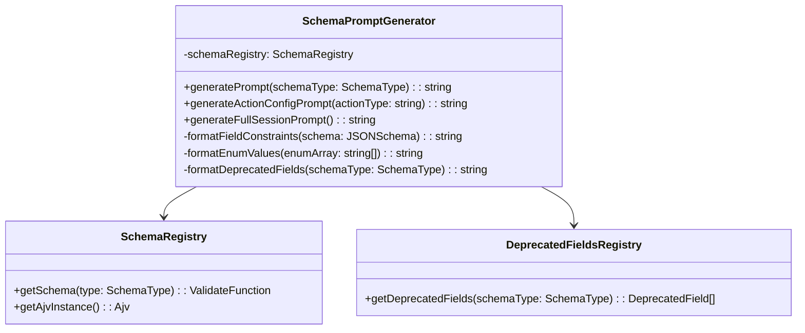

# Story 7.5: YAML脚本Schema验证体系（补完LLM Prompt导出与单测）

## 任务概述

在已实现的JSON Schema验证体系基础上，补完两项核心功能：

1. **Schema约束导出为LLM Prompt格式**：将JSON Schema转换为结构化的自然语言约束，供AI生成YAML脚本时使用
2. **Schema验证单元测试覆盖**：为SchemaValidator、SchemaRegistry、ErrorFormatter等核心组件补充完整的单元测试

## 背景说明

### 已完成的工作

根据产品需求文档（productbacklog.md Story 7.5）和代码库分析，当前Schema验证体系已实现：

| 组件            | 状态      | 说明                                                     |
| --------------- | --------- | -------------------------------------------------------- |
| JSON Schema定义 | ✅ 已完成 | session/phase/topic/action-base及各Action Config的Schema |
| SchemaValidator | ✅ 已完成 | 核心验证服务，支持validateYAML、validateSession等方法    |
| SchemaRegistry  | ✅ 已完成 | 基于AJV的Schema注册表，预编译常用Schema                  |
| ErrorFormatter  | ✅ 已完成 | 友好错误信息格式化，识别废弃字段并提供迁移建议           |
| 编辑器集成      | ✅ 已完成 | script-editor中的ValidationService支持实时验证           |
| API验证         | ✅ 已完成 | 上传路由集成Schema验证                                   |
| YAMLParser验证  | ✅ 已完成 | 加载时自动验证脚本                                       |

### 待补完的功能

| 功能                    | 状态      | 优先级 |
| ----------------------- | --------- | ------ |
| Schema导出为LLM Prompt  | ❌ 未实现 | P0     |
| SchemaValidator单元测试 | ❌ 未实现 | P0     |
| SchemaRegistry单元测试  | ❌ 未实现 | P1     |
| ErrorFormatter单元测试  | ❌ 未实现 | P1     |

## 需求分析

### 功能需求1：Schema约束导出为LLM Prompt格式

#### 使用场景

当系统需要调用LLM生成YAML脚本时（如Topic层动态生成Action、Phase层生成安抚话术等），需要将JSON Schema约束嵌入到Prompt中，确保LLM输出符合规范。

#### 导出目标

将JSON Schema转换为结构化的自然语言描述，包含：

- 必填字段列表
- 字段类型约束（string/number/boolean/array/object）
- 枚举值范围（如action_type只能是ai_say、ai_ask等）
- 数值范围约束（如max_rounds: 1-10）
- 嵌套结构说明
- 废弃字段警告

#### 预期输出格式示例

针对ai_ask Action Config的Schema，导出的Prompt约束应类似：

```
YAML脚本格式约束（ai_ask动作配置）：

必填字段：
- content (string): 提问内容模板，不能为空

可选字段：
- tone (string): 语气风格
- exit (string): 退出条件
- output (array): 输出变量配置，数组元素需包含get、define等字段
- max_rounds (number): 最大轮数，范围1-10

禁止使用的废弃字段：
- question_template（已废弃，请使用content字段）
- target_variable（已废弃，请使用output数组）
- extraction_prompt（已废弃，请使用output[].instruction）
- required（已废弃，直接移除）

示例：
config:
  content: "请问您的名字是？"
  tone: "温暖"
  output:
    - get: "user_name"
      define: "用户姓名"
  max_rounds: 3
```

### 功能需求2：Schema验证单元测试覆盖

#### 测试覆盖目标

| 测试类别     | 测试范围                                       | 覆盖率目标 |
| ------------ | ---------------------------------------------- | ---------- |
| 正向测试     | 合法的Session/Phase/Topic/Action结构           | 100%       |
| 负向测试     | 缺少必填字段、类型错误、枚举值错误、范围超限等 | 100%       |
| 边界测试     | 空数组、最小/最大值、空字符串等边界情况        | 80%        |
| 废弃字段测试 | 识别旧字段并提供迁移建议                       | 100%       |

#### 待测试的核心组件

**SchemaValidator（优先级P0）**

- validateYAML：解析并验证YAML字符串
- validateSession：验证Session脚本结构
- validateTechnique：验证Technique脚本结构
- validateAction：验证单个Action（含action_type条件验证）
- validatePartial：部分验证（用于编辑器增量验证）
- 异常处理：YAML语法错误、无法识别的脚本类型

**SchemaRegistry（优先级P1）**

- Schema注册与预编译
- Schema ID映射
- Schema查询
- Schema重新加载

**ErrorFormatter（优先级P1）**

- 格式化AJV错误为友好信息
- 废弃字段识别与迁移建议
- 错误路径定位
- 错误分类（DEPRECATED_FIELD/TYPE_ERROR等）

## 技术设计

### 设计1：Schema到Prompt的转换器

#### 组件架构



#### 核心接口定义

**SchemaPromptGenerator类接口**

| 方法                       | 输入                   | 输出   | 说明                              |
| -------------------------- | ---------------------- | ------ | --------------------------------- |
| generatePrompt             | schemaType: SchemaType | string | 生成指定Schema类型的约束Prompt    |
| generateActionConfigPrompt | actionType: string     | string | 生成特定Action Config的约束Prompt |
| generateFullSessionPrompt  | 无                     | string | 生成完整Session脚本的约束Prompt   |

**DeprecatedField数据结构**

| 字段           | 类型   | 说明         |
| -------------- | ------ | ------------ |
| fieldName      | string | 废弃字段名称 |
| reason         | string | 废弃原因     |
| replacement    | string | 替代方案     |
| migrationGuide | string | 迁移指南     |

#### 转换规则表

| JSON Schema类型             | Prompt表述             |
| --------------------------- | ---------------------- |
| type: "string"              | 字符串类型             |
| type: "number"              | 数字类型               |
| type: "boolean"             | 布尔类型（true/false） |
| type: "array"               | 数组类型               |
| required: ["field"]         | 必填字段               |
| enum: ["a", "b"]            | 可选值：a、b           |
| minimum: 1, maximum: 10     | 范围：1-10             |
| minLength: 1                | 不能为空               |
| additionalProperties: false | 不允许额外字段         |

#### 废弃字段映射表

基于ErrorFormatter中已实现的废弃字段识别逻辑，需要维护统一的废弃字段注册表：

| 废弃字段          | 所属Schema      | 替代方案             | 迁移说明                             |
| ----------------- | --------------- | -------------------- | ------------------------------------ |
| content_template  | ai-say-config   | content              | 将content_template重命名为content    |
| question_template | ai-ask-config   | content              | 使用content字段代替question_template |
| target_variable   | ai-ask-config   | output               | 使用output数组配置变量提取           |
| extraction_prompt | ai-ask-config   | output[].instruction | 在output数组中使用instruction字段    |
| required          | ai-ask-config   | 无（直接移除）       | 直接移除该字段                       |
| prompt_template   | ai-think-config | content              | 使用content字段代替prompt_template   |

#### 文件组织结构

```
packages/core-engine/src/adapters/inbound/script-schema/
├── validators/
│   ├── schema-validator.ts           (已存在)
│   ├── schema-registry.ts            (已存在)
│   ├── error-formatter.ts            (已存在)
│   ├── schema-validation-error.ts    (已存在)
│   ├── schema-prompt-generator.ts    (新增)
│   └── deprecated-fields-registry.ts (新增)
├── __tests__/                        (新增测试目录)
│   ├── schema-validator.test.ts      (新增)
│   ├── schema-registry.test.ts       (新增)
│   ├── error-formatter.test.ts       (新增)
│   └── schema-prompt-generator.test.ts (新增)
└── index.ts                          (更新导出)
```

### 设计2：单元测试套件

#### 测试框架选择

基于项目已有配置，使用：

- 测试框架：Vitest（根据vitest.config.ts）
- 断言库：Vitest内置断言
- 测试文件命名：`*.test.ts`

#### SchemaValidator测试套件设计

**测试用例分类表**

| 测试类别      | 测试方法          | 测试场景数 | 优先级 |
| ------------- | ----------------- | ---------- | ------ |
| YAML解析      | validateYAML      | 5          | P0     |
| Session验证   | validateSession   | 8          | P0     |
| Technique验证 | validateTechnique | 6          | P0     |
| Action验证    | validateAction    | 12         | P0     |
| 部分验证      | validatePartial   | 4          | P1     |
| 异常处理      | 各方法            | 6          | P0     |

**核心测试场景矩阵**

| 测试场景           | 输入数据                                    | 预期结果                | 验证点                               |
| ------------------ | ------------------------------------------- | ----------------------- | ------------------------------------ |
| 合法Session脚本    | 包含完整session/phases/topics/actions的YAML | valid: true, errors: [] | 基础验证通过                         |
| 缺少必填字段       | Session脚本缺少session_id                   | valid: false            | 错误信息包含"缺少必填字段session_id" |
| 错误的action_type  | action_type为非法值"invalid_type"           | valid: false            | 错误信息包含枚举值限制               |
| max_rounds超出范围 | max_rounds设为15（超过10）                  | valid: false            | 错误信息包含范围约束                 |
| 包含废弃字段       | ai_ask config包含target_variable            | valid: false            | 错误类型为DEPRECATED_FIELD           |
| YAML语法错误       | 无效的YAML字符串                            | valid: false            | 错误类型为SYNTAX_ERROR               |
| 无法识别的脚本类型 | 既不包含session也不包含topic                | valid: false            | 错误信息为"无法识别的脚本类型"       |

#### ErrorFormatter测试套件设计

**废弃字段识别测试矩阵**

| 废弃字段          | 测试输入      | 预期errorType    | 预期replacement      |
| ----------------- | ------------- | ---------------- | -------------------- |
| content_template  | ai_say config | DEPRECATED_FIELD | content              |
| question_template | ai_ask config | DEPRECATED_FIELD | content              |
| target_variable   | ai_ask config | DEPRECATED_FIELD | output               |
| extraction_prompt | ai_ask config | DEPRECATED_FIELD | output[].instruction |
| required          | ai_ask config | DEPRECATED_FIELD | null（直接移除）     |

#### 测试数据准备策略

使用测试数据工厂模式，创建可复用的测试脚本模板：

**测试数据工厂函数表**

| 工厂函数                        | 返回类型 | 说明                        |
| ------------------------------- | -------- | --------------------------- |
| createValidSession              | object   | 创建合法的Session脚本对象   |
| createValidTechnique            | object   | 创建合法的Technique脚本对象 |
| createValidAction               | object   | 创建合法的Action对象        |
| createSessionWithMissingField   | object   | 创建缺少指定字段的Session   |
| createActionWithDeprecatedField | object   | 创建包含废弃字段的Action    |
| createInvalidYAML               | string   | 创建无效的YAML字符串        |

## 实施策略

### 分阶段实施计划

#### 阶段1：Schema Prompt Generator实现（优先级P0）

**工作内容**

1. 创建SchemaPromptGenerator类
2. 实现核心转换逻辑
3. 创建DeprecatedFieldsRegistry
4. 补充Prompt生成的单元测试
5. 集成到现有SchemaValidator导出接口

**验收标准**

- SchemaPromptGenerator可导出ai_ask/ai_say/ai_think Config的Prompt约束
- 导出的Prompt包含必填字段、类型约束、枚举值、废弃字段警告
- 单元测试覆盖率达到90%以上
- 通过集成测试验证导出的Prompt可被LLM正确理解

#### 阶段2：SchemaValidator核心测试（优先级P0）

**工作内容**

1. 创建测试数据工厂
2. 编写validateYAML测试用例
3. 编写validateSession测试用例
4. 编写validateAction测试用例
5. 编写异常处理测试用例

**验收标准**

- 测试用例覆盖所有核心验证方法
- 正向测试覆盖率100%
- 负向测试覆盖所有常见错误场景
- 所有测试通过且执行时间<5秒

#### 阶段3：ErrorFormatter与SchemaRegistry测试（优先级P1）

**工作内容**

1. 编写ErrorFormatter测试用例（废弃字段识别、错误格式化）
2. 编写SchemaRegistry测试用例（Schema注册、查询、重载）
3. 补充边界情况测试
4. 性能测试（验证大型脚本的处理性能）

**验收标准**

- ErrorFormatter测试覆盖所有废弃字段
- SchemaRegistry测试覆盖Schema生命周期管理
- 所有测试通过
- 大型脚本（>1000行）验证耗时<100ms

### 风险评估与应对

| 风险项                                    | 影响 | 概率 | 应对策略                                             |
| ----------------------------------------- | ---- | ---- | ---------------------------------------------------- |
| JSON Schema复杂嵌套结构难以转换为自然语言 | 高   | 中   | 先实现核心字段转换，复杂结构采用示例说明             |
| 废弃字段注册表与ErrorFormatter逻辑重复    | 中   | 高   | 重构ErrorFormatter，统一使用DeprecatedFieldsRegistry |
| 测试数据维护成本高                        | 中   | 中   | 使用工厂模式生成测试数据，减少硬编码                 |
| LLM对Prompt约束的理解能力不稳定           | 高   | 中   | 提供多种格式的Prompt模板，通过实验选择最佳格式       |

## 技术约束与限制

### 技术栈约束

- 必须使用项目现有的AJV库（已在SchemaRegistry中使用）
- 测试框架必须使用Vitest（项目已配置）
- 不能引入新的第三方库（保持依赖轻量）

### 性能约束

- Schema Prompt生成耗时：单次<50ms
- 单个脚本验证耗时：<100ms
- 测试套件总执行时间：<30秒

### 兼容性约束

- 必须与现有ErrorFormatter的废弃字段识别逻辑保持一致
- 不能破坏已集成的编辑器验证功能
- 必须向后兼容现有的API验证逻辑

## 验收标准

### 功能验收

| 验收项       | 验收标准                                      | 验证方式            |
| ------------ | --------------------------------------------- | ------------------- |
| Prompt生成   | 可导出ai_ask/ai_say/ai_think Config的完整约束 | 单元测试 + 人工审查 |
| Prompt可用性 | LLM根据Prompt生成的YAML脚本通过Schema验证     | 集成测试            |
| 单元测试覆盖 | SchemaValidator核心方法测试覆盖率>90%         | 测试报告            |
| 测试稳定性   | 所有测试在CI环境可重复通过                    | CI流水线            |

### 质量验收

- 代码审查通过（无重大架构问题）
- 文档完整（包含API文档和使用示例）
- 无遗留TODO或FIXME注释
- 测试数据易于理解和维护

### 性能验收

- Prompt生成性能达标（<50ms）
- 测试套件执行时间达标（<30秒）
- 无内存泄漏

## 后续扩展建议

### 短期扩展（Sprint 1-2）

1. 为Phase和Topic层级的Schema生成Prompt约束
2. 支持自定义Prompt模板（允许不同场景使用不同的约束表述风格）
3. 增加Schema版本管理（支持多版本Schema共存）

### 长期扩展（Sprint 3+）

1. Schema可视化编辑器（可视化定义和修改JSON Schema）
2. Schema约束学习机制（根据LLM实际生成结果优化Prompt约束）
3. Schema差异对比工具（用于版本升级时的迁移指导）

## 参考资料

### 项目内部资料

- 产品需求文档：`docs/product/productbacklog.md` Story 7.5
- Schema定义目录：`packages/core-engine/src/adapters/inbound/script-schema/`
- 编辑器验证集成：`packages/script-editor/src/services/validation-service.ts`
- 错误格式化文档：`docs/design/editor-validation-integration-complete.md`

### 外部技术资料

- JSON Schema Draft 7规范：https://json-schema.org/draft-07/json-schema-release-notes.html
- AJV文档：https://ajv.js.org/
- Vitest文档：https://vitest.dev/
