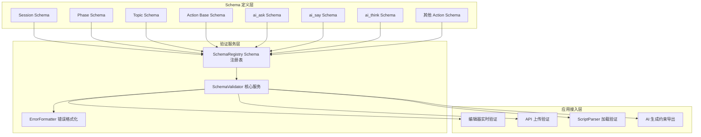
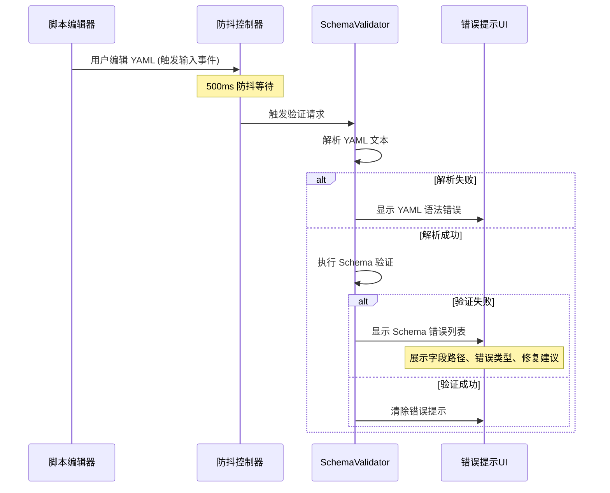
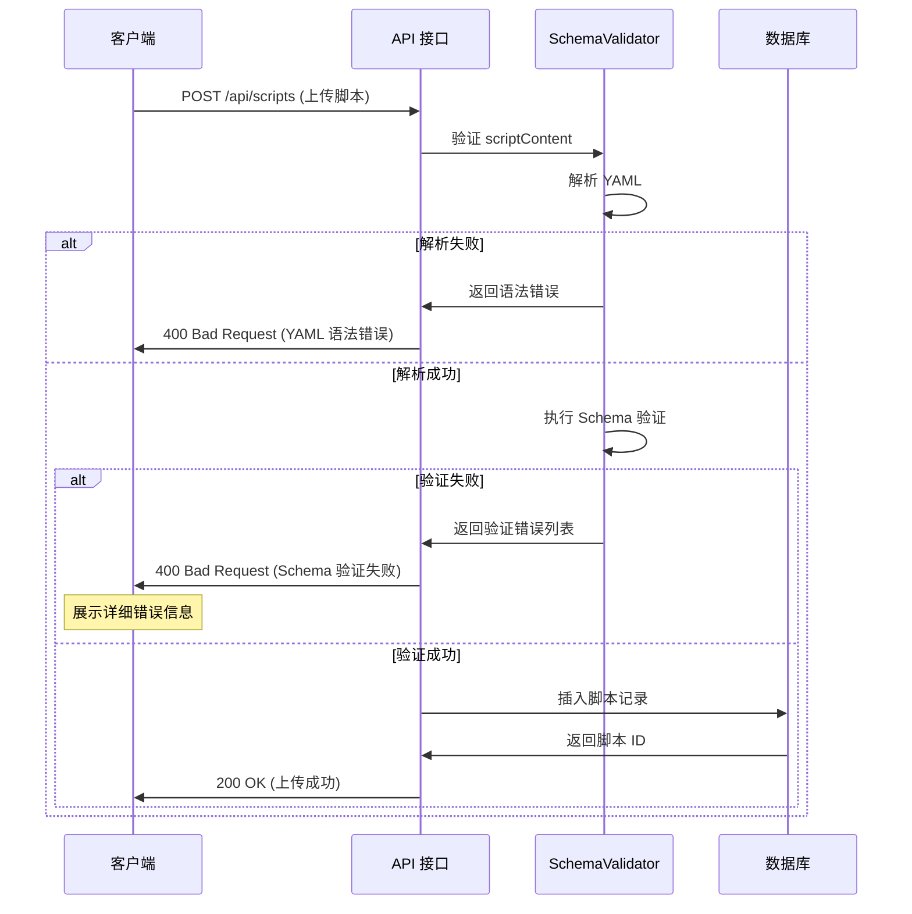
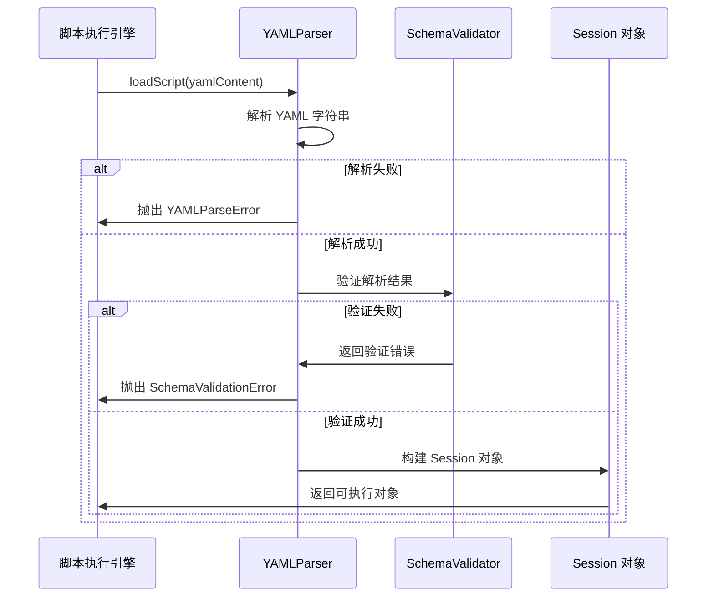
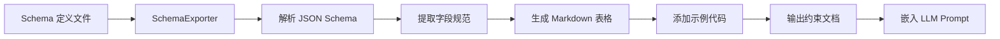

# YAML 脚本 Schema 验证体系设计

## 一、设计目标

建立完整的 YAML Schema 验证体系，覆盖开发、上传、加载和 AI 生成等各个环节，确保脚本格式符合规范，提高系统稳定性和用户体验。

### 核心价值

- **质量保障**：在多个环节拦截格式错误，避免运行时异常
- **开发体验**：实时反馈错误，提供精准修复建议
- **AI 生成约束**：为 LLM 提供结构化规范，提高生成质量
- **向后兼容**：支持现有脚本的平滑迁移

## 二、设计原则

### 2.1 验证层次化

采用四层验证机制，形成纵深防御：

1. **开发阶段验证**：编辑器实时检查，早发现早修复
2. **上传前验证**：API 接口强制校验，拒绝不合规脚本
3. **加载时验证**：运行前最后一道防线
4. **AI 生成约束**：生成阶段的格式引导

### 2.2 错误信息友好化

错误提示应包含三要素：

- **位置定位**：精确到字段路径（如 `session.phases[0].topics[1].actions[2].config.question_template`）
- **错误说明**：清晰描述错误类型和原因
- **修复建议**：提供具体的修复方案和示例

### 2.3 Schema 模块化

按照脚本层级结构拆分 Schema 定义：

- Session Schema
- Phase Schema
- Topic Schema
- Action Schema（按 action_type 细分）

### 2.4 性能优化策略

- **编辑器验证**：500ms 防抖延迟，平衡性能与体验
- **AI 生成验证**：100ms 快速响应，及时纠正
- **Schema 缓存**：编译后的 Schema 对象复用
- **增量验证**：仅验证变更部分（编辑器场景）

## 三、架构设计

### 3.1 整体架构



### 3.2 模块职责划分

| 模块                  | 职责                               | 输入                        | 输出                 |
| --------------------- | ---------------------------------- | --------------------------- | -------------------- |
| Schema 定义层         | 定义各层级的 JSON Schema 规范      | -                           | JSON Schema 文件     |
| SchemaValidator       | 执行验证逻辑，调用 ajv 引擎        | YAML 数据对象 + Schema 类型 | 验证结果 + 错误列表  |
| ErrorFormatter        | 格式化错误信息，提供修复建议       | ajv 错误对象                | 结构化错误信息       |
| SchemaRegistry        | 管理所有 Schema 定义，提供查询接口 | Schema 类型标识             | 编译后的 Schema 对象 |
| 编辑器实时验证        | 监听编辑事件，触发防抖验证         | YAML 文本                   | 错误提示 UI          |
| API 上传验证          | 接口层拦截，验证通过才入库         | 上传请求                    | 成功/失败响应        |
| ScriptParser 加载验证 | 解析时验证，确保数据完整性         | YAML 字符串                 | 解析对象/异常        |
| AI 生成约束导出       | 将 Schema 转换为 LLM 可理解的格式  | Schema 类型                 | Markdown 文档        |

## 四、Schema 定义规范

### 4.1 Session Schema 定义

Session 是脚本的顶层结构，包含元数据和阶段列表。

| 字段路径               | 类型   | 必填 | 约束                      | 说明         |
| ---------------------- | ------ | ---- | ------------------------- | ------------ |
| `session.session_id`   | string | 是   | 1-100字符，字母数字下划线 | 会话唯一标识 |
| `session.session_name` | string | 否   | 最大200字符               | 会话显示名称 |
| `session.phases`       | array  | 是   | 至少1个元素               | 阶段列表     |

### 4.2 Phase Schema 定义

Phase 表示会话的一个阶段，包含多个话题。

| 字段路径          | 类型   | 必填 | 约束        | 说明         |
| ----------------- | ------ | ---- | ----------- | ------------ |
| `phase_id`        | string | 是   | 1-100字符   | 阶段唯一标识 |
| `phase_name`      | string | 否   | 最大200字符 | 阶段显示名称 |
| `phase_goal`      | string | 否   | 最大500字符 | 阶段目标描述 |
| `entry_condition` | object | 否   | -           | 进入条件配置 |
| `topics`          | array  | 是   | 至少1个元素 | 话题列表     |

### 4.3 Topic Schema 定义

Topic 是具体的对话话题，包含多个动作。

| 字段路径     | 类型   | 必填 | 约束        | 说明         |
| ------------ | ------ | ---- | ----------- | ------------ |
| `topic_id`   | string | 是   | 1-100字符   | 话题唯一标识 |
| `topic_name` | string | 否   | 最大200字符 | 话题显示名称 |
| `topic_goal` | string | 否   | 最大500字符 | 话题目标描述 |
| `actions`    | array  | 是   | 至少1个元素 | 动作列表     |

### 4.4 Action Base Schema 定义

所有 Action 的公共字段。

| 字段路径      | 类型   | 必填 | 约束                  | 说明           |
| ------------- | ------ | ---- | --------------------- | -------------- |
| `action_type` | string | 是   | 枚举值见下表          | 动作类型       |
| `action_id`   | string | 是   | 1-100字符             | 动作唯一标识   |
| `condition`   | string | 否   | -                     | 执行条件表达式 |
| `config`      | object | 否   | 依据 action_type 验证 | 动作配置       |

**action_type 枚举值**：

| 值          | 说明        |
| ----------- | ----------- |
| `ai_say`    | AI 说话动作 |
| `ai_ask`    | AI 提问动作 |
| `ai_think`  | AI 思考动作 |
| `use_skill` | 使用技能    |

### 4.5 ai_ask Action Config Schema

| 字段路径     | 类型   | 必填 | 约束             | 说明         |
| ------------ | ------ | ---- | ---------------- | ------------ |
| `content`    | string | 是   | 非空字符串       | 提问内容模板 |
| `tone`       | string | 否   | -                | 语气风格     |
| `exit`       | string | 否   | -                | 退出条件     |
| `output`     | array  | 否   | OutputField 数组 | 输出变量配置 |
| `max_rounds` | number | 否   | 1-10             | 最大轮数     |

**OutputField 结构**：

| 字段     | 类型   | 必填 | 说明         |
| -------- | ------ | ---- | ------------ |
| `get`    | string | 否   | 提取变量名   |
| `set`    | string | 否   | 设置变量名   |
| `define` | string | 否   | 变量定义说明 |
| `value`  | string | 否   | 直接设置的值 |

### 4.6 ai_say Action Config Schema

| 字段路径     | 类型   | 必填 | 约束       | 说明     |
| ------------ | ------ | ---- | ---------- | -------- |
| `content`    | string | 是   | 非空字符串 | 内容模板 |
| `tone`       | string | 否   | -          | 语气风格 |
| `exit`       | string | 否   | -          | 退出条件 |
| `max_rounds` | number | 否   | 1-10       | 最大轮数 |

### 4.7 ai_think Action Config Schema

| 字段路径  | 类型   | 必填 | 约束             | 说明           |
| --------- | ------ | ---- | ---------------- | -------------- |
| `content` | string | 是   | 非空字符串       | 思考提示词模板 |
| `output`  | array  | 否   | OutputField 数组 | 输出变量配置   |

### 4.8 use_skill Action Config Schema

| 字段路径 | 类型   | 必填 | 约束             | 说明         |
| -------- | ------ | ---- | ---------------- | ------------ |
| `skill`  | string | 是   | 非空字符串       | 技能名称     |
| `input`  | array  | 否   | OutputField 数组 | 输入参数     |
| `output` | array  | 否   | OutputField 数组 | 输出变量配置 |

## 五、验证流程设计

### 5.1 开发阶段验证流程

编辑器实时验证，提供即时反馈。



**验证触发时机**：

- 用户停止输入 500ms 后自动触发
- 用户点击"验证"按钮时立即触发
- 保存文件前强制触发

**错误展示方式**：

- 错误列表面板：展示所有错误的汇总
- 行内标记：在编辑器中高亮错误位置
- 悬停提示：鼠标悬停显示详细错误信息

### 5.2 API 上传验证流程

在脚本上传到服务器时进行强制验证。



**验证策略**：

- 所有上传和更新操作必须通过验证
- 验证失败返回 HTTP 400 状态码
- 错误响应包含结构化的错误列表

**错误响应格式**：

| 字段                  | 类型    | 说明                                      |
| --------------------- | ------- | ----------------------------------------- |
| `success`             | boolean | 固定为 false                              |
| `error`               | string  | 错误类型（如 "SCHEMA_VALIDATION_FAILED"） |
| `errors`              | array   | 详细错误列表                              |
| `errors[].path`       | string  | 错误字段路径                              |
| `errors[].message`    | string  | 错误描述                                  |
| `errors[].suggestion` | string  | 修复建议                                  |
| `errors[].example`    | string  | 正确示例                                  |

### 5.3 ScriptParser 加载验证流程

在脚本加载到引擎执行前进行验证。



**验证时机**：

- Session 初始化时
- 版本切换加载新脚本时
- 热更新脚本配置时

**异常处理**：

- 验证失败抛出 `SchemaValidationError` 异常
- 异常包含详细的错误列表
- 上层捕获后记录日志并返回友好提示

### 5.4 AI 生成约束导出流程

将 Schema 转换为 LLM 可理解的 Markdown 格式，用于约束生成。



**导出内容结构**：

1. **字段规范表格**：清晰展示必填字段、类型、约束
2. **枚举值列表**：列出所有可选值
3. **示例代码块**：提供完整的正确示例
4. **常见错误说明**：列举常见错误和正确写法对比

**使用场景**：

- AI 生成 YAML 脚本时，将约束文档嵌入 System Prompt
- AI 修复错误脚本时，提供规范引导
- 文档生成工具自动生成开发手册

## 六、错误信息设计

### 6.1 错误分类

| 错误类别 | 说明                   | 示例                            |
| -------- | ---------------------- | ------------------------------- |
| 语法错误 | YAML 格式不正确        | 缩进错误、引号不匹配            |
| 类型错误 | 字段类型不符合预期     | 期望 number 但提供了 string     |
| 必填错误 | 缺少必填字段           | action_type 字段缺失            |
| 枚举错误 | 值不在允许的枚举范围内 | action_type 为 "invalid_type"   |
| 约束错误 | 值不满足约束条件       | max_rounds 为 15（超过上限 10） |
| 结构错误 | 嵌套结构不正确         | phases 不是数组                 |

### 6.2 错误信息格式

每条错误信息包含以下字段：

| 字段         | 类型   | 说明               |
| ------------ | ------ | ------------------ |
| `path`       | string | 错误字段的完整路径 |
| `errorType`  | string | 错误类别（见 6.1） |
| `message`    | string | 错误描述           |
| `expected`   | string | 期望的值或格式     |
| `actual`     | string | 实际提供的值       |
| `suggestion` | string | 修复建议           |
| `example`    | string | 正确示例（可选）   |

### 6.3 错误信息示例

**示例 1：缺少必填字段**

- **path**: `session.phases[0].topics[1].actions[2]`
- **errorType**: `REQUIRED_FIELD_MISSING`
- **message**: `缺少必填字段 'action_type'`
- **expected**: `string 类型，枚举值：ai_say, ai_ask, ai_think, use_skill`
- **actual**: `字段不存在`
- **suggestion**: `请添加 action_type 字段，并设置为有效的 Action 类型`
- **example**:
  ```yaml
  - action_type: 'ai_ask'
    action_id: 'ask_name'
    config:
      content: '请问您的名字是？'
  ```

**示例 2：枚举值错误**

- **path**: `session.phases[0].topics[0].actions[0].action_type`
- **errorType**: `ENUM_VALUE_INVALID`
- **message**: `action_type 的值 'ai_chat' 不在允许的枚举范围内`
- **expected**: `ai_say | ai_ask | ai_think | say | user_say | use_skill | show_form | show_pic`
- **actual**: `"ai_chat"`
- **suggestion**: `请检查拼写，使用正确的 Action 类型。如果是 AI 对话，应使用 'ai_ask' 或 'ai_say'`
- **example**:
  ```yaml
  action_type: 'ai_ask' # 正确
  # 而非: action_type: "ai_chat"
  ```

**示例 3：数值范围错误**

- **path**: `session.phases[1].topics[0].actions[0].config.max_rounds`
- **errorType**: `CONSTRAINT_VIOLATION`
- **message**: `max_rounds 的值超出允许范围`
- **expected**: `1-10 之间的整数`
- **actual**: `15`
- **suggestion**: `max_rounds 应设置在 1-10 之间。如果需要更多轮次，请考虑拆分为多个 Action`
- **example**:
  ```yaml
  max_rounds: 5 # 正确
  # 而非: max_rounds: 15
  ```

**示例 4：缺少 ai_ask 必填配置**

- **path**: `session.phases[0].topics[1].actions[2].config`
- **errorType**: `REQUIRED_FIELD_MISSING`
- **message**: `ai_ask 类型的 Action 缺少必填字段 'content'`
- **expected**: `非空字符串`
- **actual**: `字段不存在`
- **suggestion**: `ai_ask 必须包含 content 字段，用于定义提问内容`
- **example**:
  ```yaml
  - action_type: 'ai_ask'
    action_id: 'ask_age'
    config:
      content: '请问您今年多大了？'
      max_rounds: 3
  ```

## 七、技术实现要点

### 7.1 技术选型

| 组件            | 技术选型                            | 说明                                         |
| --------------- | ----------------------------------- | -------------------------------------------- |
| Schema 验证引擎 | ajv (Another JSON Schema Validator) | 性能优秀，支持 JSON Schema Draft 7/2019/2020 |
| Schema 定义格式 | JSON Schema                         | 行业标准，工具链成熟                         |
| 错误格式化      | 自定义 ErrorFormatter               | 提供友好的中文错误提示                       |
| 防抖控制        | lodash.debounce                     | 成熟稳定的防抖实现                           |
| YAML 解析       | js-yaml                             | 项目已使用，保持一致                         |

### 7.2 核心服务接口设计

**SchemaValidator 服务**

| 方法                                | 参数                     | 返回值           | 说明                   |
| ----------------------------------- | ------------------------ | ---------------- | ---------------------- |
| `validateSession(data)`             | YAML 解析对象            | ValidationResult | 验证 Session 脚本      |
| `validateTechnique(data)`           | YAML 解析对象            | ValidationResult | 验证 Technique 脚本    |
| `validateAction(action, type)`      | Action 对象, action_type | ValidationResult | 验证单个 Action        |
| `validatePartial(data, schemaPath)` | 部分数据, Schema 路径    | ValidationResult | 增量验证（编辑器优化） |

**ValidationResult 结构**：

| 字段     | 类型    | 说明               |
| -------- | ------- | ------------------ |
| `valid`  | boolean | 是否验证通过       |
| `errors` | array   | 错误列表（见 6.2） |

**SchemaRegistry 服务**

| 方法                           | 参数                     | 返回值               | 说明                |
| ------------------------------ | ------------------------ | -------------------- | ------------------- |
| `getSchema(type)`              | Schema 类型              | 编译后的 Schema 对象 | 获取指定 Schema     |
| `registerSchema(type, schema)` | Schema 类型, JSON Schema | void                 | 注册自定义 Schema   |
| `reloadSchemas()`              | -                        | void                 | 重新加载所有 Schema |

**ErrorFormatter 服务**

| 方法                        | 参数         | 返回值             | 说明           |
| --------------------------- | ------------ | ------------------ | -------------- |
| `format(ajvErrors)`         | ajv 错误数组 | 格式化后的错误列表 | 转换为友好格式 |
| `generateSuggestion(error)` | 单个错误对象 | 修复建议字符串     | 生成修复建议   |
| `generateExample(error)`    | 单个错误对象 | 示例代码字符串     | 生成正确示例   |

### 7.3 Schema 文件组织结构

```
packages/
└── core-engine/
    └── src/
        └── schemas/
            ├── index.ts                 # 统一导出
            ├── session.schema.json      # Session Schema
            ├── phase.schema.json        # Phase Schema
            ├── topic.schema.json        # Topic Schema
            ├── actions/
            │   ├── base.schema.json     # Action 基础 Schema
            │   ├── ai-ask.schema.json   # ai_ask Schema
            │   ├── ai-say.schema.json   # ai_say Schema
            │   ├── ai-think.schema.json # ai_think Schema
            │   └── use-skill.schema.json # use_skill Schema
            ├── common/
            │   └── output-field.schema.json # OutputField 公共 Schema
            └── validators/
                ├── schema-validator.ts   # SchemaValidator 实现
                ├── schema-registry.ts    # SchemaRegistry 实现
                ├── error-formatter.ts    # ErrorFormatter 实现
                └── schema-exporter.ts    # AI 约束导出工具
```

### 7.4 性能优化策略

**Schema 编译缓存**

- ajv 在首次加载时编译 Schema，编译结果缓存复用
- 避免每次验证都重新编译

**增量验证**

- 编辑器场景下，仅验证变更的节点
- 通过 `validatePartial` 方法实现

**异步验证**

- 编辑器验证在 Web Worker 中执行（可选优化）
- 避免阻塞 UI 主线程

**防抖控制**

- 编辑器输入事件使用 500ms 防抖
- 避免频繁触发验证

### 7.5 向后兼容处理

**弃用字段处理**

由于历史设计问题，以下字段不再支持，Schema 验证时将直接报错：

- `ai_ask.target_variable`
- `ai_ask.extraction_prompt`
- `ai_ask.tolist`
- `ai_ask.required`
- `ai_say.require_acknowledgment`
- `ai_say.exit_criteria`（改用 `exit`）

如遇到这些字段，错误信息将指导用户使用正确的配置方式。

**字段标准化**

所有 Action 的内容字段统一使用 `content`：

- `ai_ask.content`：提问内容模板
- `ai_say.content`：说话内容模板
- `ai_think.content`：思考提示词模板

## 八、集成方案

### 8.1 脚本编辑器集成

**集成位置**：`packages/script-editor/src/services/validation-service.ts`

**集成步骤**：

1. 引入 SchemaValidator 服务
2. 监听编辑器内容变更事件
3. 应用 500ms 防抖延迟
4. 调用验证服务并展示错误

**错误展示组件设计**：

- **ErrorListPanel**：错误列表面板，展示所有错误汇总
- **InlineErrorMarker**：行内错误标记，高亮错误位置
- **ErrorTooltip**：悬停提示，显示详细错误信息

### 8.2 API 接口集成

**集成位置**：`packages/api-server/src/routes/scripts.ts`

**集成点**：

1. `POST /api/scripts`（创建脚本）
2. `PUT /api/scripts/:id`（更新脚本）
3. `POST /api/scripts/import`（导入脚本）

**集成逻辑**：

在解析 YAML 之后、入库之前，调用 SchemaValidator 验证。验证失败返回 400 错误。

### 8.3 ScriptParser 集成

**集成位置**：`packages/core-engine/src/engines/script-execution/yaml-parser.ts`

**集成方式**：

在 `YAMLParser` 的 `validateSessionScript` 和 `validateTechniqueScript` 方法中，使用 SchemaValidator 替代现有的简单 zod 验证。

**错误处理**：

验证失败时抛出 `SchemaValidationError` 异常，包含详细的错误列表。

### 8.4 AI 生成约束集成

**使用场景**：

当 LLM 需要生成或修复 YAML 脚本时，将导出的 Markdown 约束文档嵌入 System Prompt。

**导出命令**：

提供 CLI 工具或 API 接口，按需导出指定 Action 类型的约束文档。

**约束文档结构**：

````markdown
## ai_ask 动作配置规范

### 必填字段

| 字段名      | 类型   | 说明               | 示例                 |
| ----------- | ------ | ------------------ | -------------------- |
| action_type | string | 固定值 "ai_ask"    | "ai_ask"             |
| content     | string | 提问内容模板，非空 | "请问您今年多大了？" |

### 可选字段

| 字段名     | 类型   | 默认值 | 说明                |
| ---------- | ------ | ------ | ------------------- |
| tone       | string | -      | 语气风格            |
| exit       | string | -      | 退出条件            |
| max_rounds | number | 3      | 最大轮数，范围 1-10 |
| output     | array  | -      | 输出变量配置        |

### 完整示例

​```yaml

- action_type: "ai_ask"
  action_id: "ask_age"
  config:
  content: "请问您今年多大了？"
  output: - get: "user_age"
  define: "提取用户年龄"
  max_rounds: 3
  ​```

### 常见错误

1. ❌ 缺少 content
2. ❌ max_rounds 超出范围
3. ❌ output 数组元素缺少 get 字段
4. ❌ 使用已废弃字段 target_variable 或 extraction_prompt
````

## 九、测试策略

### 9.1 单元测试

**测试覆盖**：

| 测试对象        | 测试内容               |
| --------------- | ---------------------- |
| SchemaValidator | 各层级 Schema 验证逻辑 |
| ErrorFormatter  | 错误信息格式化正确性   |
| SchemaRegistry  | Schema 注册和查询功能  |
| SchemaExporter  | 约束文档导出格式       |

**测试用例示例**：

- 验证完整正确的 Session 脚本
- 验证缺少必填字段的脚本（应返回错误）
- 验证枚举值错误的脚本（应返回错误）
- 验证数值超出范围的脚本（应返回错误）
- 验证嵌套结构错误的脚本（应返回错误）
- 验证弃用字段的脚本（应返回警告）

### 9.2 集成测试

**测试场景**：

| 场景              | 测试内容                               |
| ----------------- | -------------------------------------- |
| 编辑器实时验证    | 模拟用户输入，验证错误提示是否正确展示 |
| API 上传拦截      | 提交无效脚本，验证是否返回 400 错误    |
| ScriptParser 加载 | 加载无效脚本，验证是否抛出异常         |
| AI 约束导出       | 验证导出的 Markdown 文档格式正确       |

### 9.3 回归测试

**测试数据**：

使用项目中现有的示例脚本作为测试数据：

- `scripts/sessions/cbt_depression_assessment.yaml`
- `scripts/sessions/test_ai_say_basic.yaml`
- `scripts/sessions/test_llm_debug.yaml`
- `scripts/sessions/test_multi_output.yaml`
- `scripts/techniques/socratic_questioning.yaml`

**验证目标**：

- 所有现有脚本应能通过 Schema 验证
- 如有弃用字段，应产生警告而非错误
- 验证性能在可接受范围内（每个脚本验证时间 < 100ms）

## 十、文档与培训

### 10.1 开发文档

**Schema 规范文档**

- 每个层级 Schema 的详细说明
- 字段定义、类型、约束、示例
- 常见错误和解决方案

**集成指南**

- 如何在编辑器中集成验证
- 如何在 API 中使用验证
- 如何自定义 Schema

**最佳实践**

- 如何设计易于验证的脚本结构
- 如何处理向后兼容问题
- 性能优化建议

### 10.2 用户文档

**错误排查指南**

- 常见错误类型及解决方法
- 错误信息解读
- 如何利用修复建议快速定位问题

**脚本编写规范**

- 基于 Schema 的脚本编写指南
- 推荐的字段配置方式
- 避免常见错误的技巧

## 十一、实施路线图

### Phase 1：Schema 定义与核心服务（3 Story Points）

**任务清单**：

- 定义 Session/Phase/Topic/Action Base 的 JSON Schema
- 定义所有 Action 类型的 Config Schema
- 实现 SchemaValidator 核心服务
- 实现 ErrorFormatter 服务
- 实现 SchemaRegistry 服务
- 编写单元测试

**验收标准**：

- 所有 Schema 定义完成并通过语法检查
- SchemaValidator 能够正确验证示例脚本
- 错误信息包含路径、类型、建议
- 单元测试覆盖率 > 80%

### Phase 2：API 与 ScriptParser 集成（3 Story Points）

**任务清单**：

- 在 `scripts.ts` 路由中集成验证
- 在 `yaml-parser.ts` 中集成验证
- 定义错误响应格式
- 实现异常处理逻辑
- 编写集成测试

**验收标准**：

- API 上传无效脚本返回 400 错误
- 错误响应包含详细错误列表
- ScriptParser 加载无效脚本抛出异常
- 集成测试覆盖主要场景

### Phase 3：编辑器实时验证（4 Story Points）

**任务清单**：

- 实现 ValidationService
- 实现防抖控制逻辑
- 设计并实现错误展示组件（ErrorListPanel, InlineErrorMarker, ErrorTooltip）
- 集成到编辑器 UI
- 优化性能（增量验证、异步执行）
- 编写 E2E 测试

**验收标准**：

- 编辑器停止输入 500ms 后自动触发验证
- 错误在编辑器中正确展示（列表 + 行内标记 + 悬停提示）
- 验证性能满足要求（大型脚本验证 < 200ms）
- E2E 测试覆盖编辑、验证、修复流程

### Phase 4：AI 生成约束导出（2 Story Points）

**任务清单**：

- 实现 SchemaExporter 服务
- 设计 Markdown 约束文档模板
- 实现 CLI 工具或 API 接口
- 生成所有 Action 类型的约束文档
- 编写使用文档

**验收标准**：

- 能够导出所有 Action 类型的约束文档
- Markdown 格式清晰，包含字段表格、示例、常见错误
- 约束文档可直接嵌入 LLM Prompt
- 提供使用示例和文档

### Phase 5：文档与回归测试（1 Story Point）

**任务清单**：

- 编写 Schema 规范文档
- 编写集成指南
- 编写用户错误排查指南
- 运行回归测试，确保现有脚本兼容
- 性能测试与优化

**验收标准**：

- 文档完整，覆盖开发和用户场景
- 所有现有示例脚本通过验证
- 验证性能达标
- 文档说明 Schema 规范和验证机制

**总计**：13 Story Points

## 十二、风险与应对

### 12.1 风险识别

| 风险                       | 影响 | 概率 | 应对策略                           |
| -------------------------- | ---- | ---- | ---------------------------------- |
| 现有脚本不符合 Schema 规范 | 高   | 中   | 设计向后兼容机制，支持弃用字段     |
| Schema 定义过于严格        | 中   | 中   | 提供足够的可选字段，避免过度约束   |
| 验证性能影响编辑体验       | 中   | 低   | 防抖控制、异步执行、增量验证       |
| ajv 错误信息不够友好       | 中   | 高   | 实现 ErrorFormatter 转换为中文提示 |
| AI 生成仍不符合规范        | 中   | 中   | 持续优化约束文档，提供更多示例     |

### 12.2 应对措施

**向后兼容**：

- 弃用字段仍允许使用，但产生警告
- 提供迁移工具或脚本，自动转换旧格式

**性能保障**：

- 编译后的 Schema 对象缓存
- 大型脚本使用增量验证
- Web Worker 异步执行（可选）

**错误信息优化**：

- 基于 ajv 错误对象，生成中文友好提示
- 提供具体的修复建议和示例
- 错误分级（error / warning）

**AI 生成质量**：

- 约束文档包含丰富示例
- 常见错误对照表
- 持续收集 AI 生成错误，优化约束

## 十三、成功指标

### 13.1 质量指标

| 指标              | 目标值                                 |
| ----------------- | -------------------------------------- |
| Schema 验证覆盖率 | 100%（所有必填字段、枚举值、约束条件） |
| 单元测试覆盖率    | > 80%                                  |
| 错误信息准确率    | 100%（路径、类型、建议一致）           |
| 现有脚本兼容率    | 100%（通过验证或仅产生警告）           |

### 13.2 性能指标

| 指标             | 目标值            |
| ---------------- | ----------------- |
| 小型脚本验证时间 | < 50ms            |
| 中型脚本验证时间 | < 100ms           |
| 大型脚本验证时间 | < 200ms           |
| 编辑器响应延迟   | < 500ms（含防抖） |

### 13.3 用户体验指标

| 指标              | 目标值                    |
| ----------------- | ------------------------- |
| 错误定位准确率    | 100%（精确到字段）        |
| 修复建议采纳率    | > 70%（通过用户反馈统计） |
| AI 生成一次通过率 | > 80%（基于约束文档生成） |

## 十四、后续演进方向

### 14.1 Schema 版本管理

随着系统演进，Schema 可能需要升级。设计 Schema 版本管理机制：

- Schema 文件包含版本号
- 支持多版本 Schema 共存
- 自动识别脚本对应的 Schema 版本
- 提供版本迁移工具

### 14.2 自定义 Action Schema

支持用户自定义 Action 类型：

- 提供 Schema 注册 API
- 用户定义的 Action 自动加入验证体系
- 约束文档自动生成

### 14.3 可视化 Schema 编辑器

提供图形化界面编辑 Schema：

- 拖拽式字段定义
- 约束条件可视化配置
- 实时预览生成的 JSON Schema

### 14.4 智能修复建议

基于错误模式，提供自动修复功能：

- 常见错误一键修复
- AI 辅助生成缺失字段
- 批量修复工具
  |------|---------|
  | 编辑器实时验证 | 模拟用户输入，验证错误提示是否正确展示 |
  | API 上传拦截 | 提交无效脚本，验证是否返回 400 错误 |
  | ScriptParser 加载 | 加载无效脚本，验证是否抛出异常 |
  | AI 约束导出 | 验证导出的 Markdown 文档格式正确 |

### 9.3 回归测试

**测试数据**：

使用项目中现有的示例脚本作为测试数据：

- `scripts/sessions/cbt_depression_assessment.yaml`
- `scripts/sessions/test_ai_say_basic.yaml`
- `scripts/sessions/test_llm_debug.yaml`
- `scripts/sessions/test_multi_output.yaml`
- `scripts/techniques/socratic_questioning.yaml`

**验证目标**：

- 所有现有脚本应能通过 Schema 验证
- 如有弃用字段，应产生警告而非错误
- 验证性能在可接受范围内（每个脚本验证时间 < 100ms）

## 十、文档与培训

### 10.1 开发文档

**Schema 规范文档**

- 每个层级 Schema 的详细说明
- 字段定义、类型、约束、示例
- 常见错误和解决方案

**集成指南**

- 如何在编辑器中集成验证
- 如何在 API 中使用验证
- 如何自定义 Schema

**最佳实践**

- 如何设计易于验证的脚本结构
- 如何处理向后兼容问题
- 性能优化建议

### 10.2 用户文档

**错误排查指南**

- 常见错误类型及解决方法
- 错误信息解读
- 如何利用修复建议快速定位问题

**脚本编写规范**

- 基于 Schema 的脚本编写指南
- 推荐的字段配置方式
- 避免常见错误的技巧

## 十一、实施路线图

### Phase 1：Schema 定义与核心服务（3 Story Points）

**任务清单**：

- 定义 Session/Phase/Topic/Action Base 的 JSON Schema
- 定义所有 Action 类型的 Config Schema
- 实现 SchemaValidator 核心服务
- 实现 ErrorFormatter 服务
- 实现 SchemaRegistry 服务
- 编写单元测试

**验收标准**：

- 所有 Schema 定义完成并通过语法检查
- SchemaValidator 能够正确验证示例脚本
- 错误信息包含路径、类型、建议
- 单元测试覆盖率 > 80%

### Phase 2：API 与 ScriptParser 集成（3 Story Points）

**任务清单**：

- 在 `scripts.ts` 路由中集成验证
- 在 `yaml-parser.ts` 中集成验证
- 定义错误响应格式
- 实现异常处理逻辑
- 编写集成测试

**验收标准**：

- API 上传无效脚本返回 400 错误
- 错误响应包含详细错误列表
- ScriptParser 加载无效脚本抛出异常
- 集成测试覆盖主要场景

### Phase 3：编辑器实时验证（4 Story Points）

**任务清单**：

- 实现 ValidationService
- 实现防抖控制逻辑
- 设计并实现错误展示组件（ErrorListPanel, InlineErrorMarker, ErrorTooltip）
- 集成到编辑器 UI
- 优化性能（增量验证、异步执行）
- 编写 E2E 测试

**验收标准**：

- 编辑器停止输入 500ms 后自动触发验证
- 错误在编辑器中正确展示（列表 + 行内标记 + 悬停提示）
- 验证性能满足要求（大型脚本验证 < 200ms）
- E2E 测试覆盖编辑、验证、修复流程

### Phase 4：AI 生成约束导出（2 Story Points）

**任务清单**：

- 实现 SchemaExporter 服务
- 设计 Markdown 约束文档模板
- 实现 CLI 工具或 API 接口
- 生成所有 Action 类型的约束文档
- 编写使用文档

**验收标准**：

- 能够导出所有 Action 类型的约束文档
- Markdown 格式清晰，包含字段表格、示例、常见错误
- 约束文档可直接嵌入 LLM Prompt
- 提供使用示例和文档

### Phase 5：文档与回归测试（1 Story Point）

**任务清单**：

- 编写 Schema 规范文档
- 编写集成指南
- 编写用户错误排查指南
- 运行回归测试，确保现有脚本兼容
- 性能测试与优化

**验收标准**：

- 文档完整，覆盖开发和用户场景
- 所有现有示例脚本通过验证
- 验证性能达标
- 文档说明 Schema 规范和验证机制

**总计**：13 Story Points

## 十二、风险与应对

### 12.1 风险识别

| 风险                       | 影响 | 概率 | 应对策略                           |
| -------------------------- | ---- | ---- | ---------------------------------- |
| 现有脚本不符合 Schema 规范 | 高   | 中   | 设计向后兼容机制，支持弃用字段     |
| Schema 定义过于严格        | 中   | 中   | 提供足够的可选字段，避免过度约束   |
| 验证性能影响编辑体验       | 中   | 低   | 防抖控制、异步执行、增量验证       |
| ajv 错误信息不够友好       | 中   | 高   | 实现 ErrorFormatter 转换为中文提示 |
| AI 生成仍不符合规范        | 中   | 中   | 持续优化约束文档，提供更多示例     |

### 12.2 应对措施

**向后兼容**：

- 弃用字段仍允许使用，但产生警告
- 提供迁移工具或脚本，自动转换旧格式

**性能保障**：

- 编译后的 Schema 对象缓存
- 大型脚本使用增量验证
- Web Worker 异步执行（可选）

**错误信息优化**：

- 基于 ajv 错误对象，生成中文友好提示
- 提供具体的修复建议和示例
- 错误分级（error / warning）

**AI 生成质量**：

- 约束文档包含丰富示例
- 常见错误对照表
- 持续收集 AI 生成错误，优化约束

## 十三、成功指标

### 13.1 质量指标

| 指标              | 目标值                                 |
| ----------------- | -------------------------------------- |
| Schema 验证覆盖率 | 100%（所有必填字段、枚举值、约束条件） |
| 单元测试覆盖率    | > 80%                                  |
| 错误信息准确率    | 100%（路径、类型、建议一致）           |
| 现有脚本兼容率    | 100%（通过验证或仅产生警告）           |

### 13.2 性能指标

| 指标             | 目标值            |
| ---------------- | ----------------- |
| 小型脚本验证时间 | < 50ms            |
| 中型脚本验证时间 | < 100ms           |
| 大型脚本验证时间 | < 200ms           |
| 编辑器响应延迟   | < 500ms（含防抖） |

### 13.3 用户体验指标

| 指标              | 目标值                    |
| ----------------- | ------------------------- |
| 错误定位准确率    | 100%（精确到字段）        |
| 修复建议采纳率    | > 70%（通过用户反馈统计） |
| AI 生成一次通过率 | > 80%（基于约束文档生成） |

## 十四、后续演进方向

### 14.1 Schema 版本管理

随着系统演进，Schema 可能需要升级。设计 Schema 版本管理机制：

- Schema 文件包含版本号
- 支持多版本 Schema 共存
- 自动识别脚本对应的 Schema 版本
- 提供版本迁移工具

### 14.2 自定义 Action Schema

支持用户自定义 Action 类型：

- 提供 Schema 注册 API
- 用户定义的 Action 自动加入验证体系
- 约束文档自动生成

### 14.3 可视化 Schema 编辑器

提供图形化界面编辑 Schema：

- 拖拽式字段定义
- 约束条件可视化配置
- 实时预览生成的 JSON Schema

### 14.4 智能修复建议

基于错误模式，提供自动修复功能：

- 常见错误一键修复
- AI 辅助生成缺失字段
- 批量修复工具
  | 场景 | 测试内容 |
  |------|---------|
  | 编辑器实时验证 | 模拟用户输入，验证错误提示是否正确展示 |
  | API 上传拦截 | 提交无效脚本，验证是否返回 400 错误 |
  | ScriptParser 加载 | 加载无效脚本，验证是否抛出异常 |
  | AI 约束导出 | 验证导出的 Markdown 文档格式正确 |

### 9.3 回归测试

**测试数据**：

使用项目中现有的示例脚本作为测试数据：

- `scripts/sessions/cbt_depression_assessment.yaml`
- `scripts/sessions/test_ai_say_basic.yaml`
- `scripts/sessions/test_llm_debug.yaml`
- `scripts/sessions/test_multi_output.yaml`
- `scripts/techniques/socratic_questioning.yaml`

**验证目标**：

- 所有现有脚本应能通过 Schema 验证
- 如有弃用字段，应产生警告而非错误
- 验证性能在可接受范围内（每个脚本验证时间 < 100ms）

## 十、文档与培训

### 10.1 开发文档

**Schema 规范文档**

- 每个层级 Schema 的详细说明
- 字段定义、类型、约束、示例
- 常见错误和解决方案

**集成指南**

- 如何在编辑器中集成验证
- 如何在 API 中使用验证
- 如何自定义 Schema

**最佳实践**

- 如何设计易于验证的脚本结构
- 如何处理向后兼容问题
- 性能优化建议

### 10.2 用户文档

**错误排查指南**

- 常见错误类型及解决方法
- 错误信息解读
- 如何利用修复建议快速定位问题

**脚本编写规范**

- 基于 Schema 的脚本编写指南
- 推荐的字段配置方式
- 避免常见错误的技巧

## 十一、实施路线图

### Phase 1：Schema 定义与核心服务（3 Story Points）

**任务清单**：

- 定义 Session/Phase/Topic/Action Base 的 JSON Schema
- 定义所有 Action 类型的 Config Schema
- 实现 SchemaValidator 核心服务
- 实现 ErrorFormatter 服务
- 实现 SchemaRegistry 服务
- 编写单元测试

**验收标准**：

- 所有 Schema 定义完成并通过语法检查
- SchemaValidator 能够正确验证示例脚本
- 错误信息包含路径、类型、建议
- 单元测试覆盖率 > 80%

### Phase 2：API 与 ScriptParser 集成（3 Story Points）

**任务清单**：

- 在 `scripts.ts` 路由中集成验证
- 在 `yaml-parser.ts` 中集成验证
- 定义错误响应格式
- 实现异常处理逻辑
- 编写集成测试

**验收标准**：

- API 上传无效脚本返回 400 错误
- 错误响应包含详细错误列表
- ScriptParser 加载无效脚本抛出异常
- 集成测试覆盖主要场景

### Phase 3：编辑器实时验证（4 Story Points）

**任务清单**：

- 实现 ValidationService
- 实现防抖控制逻辑
- 设计并实现错误展示组件（ErrorListPanel, InlineErrorMarker, ErrorTooltip）
- 集成到编辑器 UI
- 优化性能（增量验证、异步执行）
- 编写 E2E 测试

**验收标准**：

- 编辑器停止输入 500ms 后自动触发验证
- 错误在编辑器中正确展示（列表 + 行内标记 + 悬停提示）
- 验证性能满足要求（大型脚本验证 < 200ms）
- E2E 测试覆盖编辑、验证、修复流程

### Phase 4：AI 生成约束导出（2 Story Points）

**任务清单**：

- 实现 SchemaExporter 服务
- 设计 Markdown 约束文档模板
- 实现 CLI 工具或 API 接口
- 生成所有 Action 类型的约束文档
- 编写使用文档

**验收标准**：

- 能够导出所有 Action 类型的约束文档
- Markdown 格式清晰，包含字段表格、示例、常见错误
- 约束文档可直接嵌入 LLM Prompt
- 提供使用示例和文档

### Phase 5：文档与回归测试（1 Story Point）

**任务清单**：

- 编写 Schema 规范文档
- 编写集成指南
- 编写用户错误排查指南
- 运行回归测试，确保现有脚本兼容
- 性能测试与优化

**验收标准**：

- 文档完整，覆盖开发和用户场景
- 所有现有示例脚本通过验证
- 验证性能达标
- 文档说明 Schema 规范和验证机制

**总计**：13 Story Points

## 十二、风险与应对

### 12.1 风险识别

| 风险                       | 影响 | 概率 | 应对策略                           |
| -------------------------- | ---- | ---- | ---------------------------------- |
| 现有脚本不符合 Schema 规范 | 高   | 中   | 设计向后兼容机制，支持弃用字段     |
| Schema 定义过于严格        | 中   | 中   | 提供足够的可选字段，避免过度约束   |
| 验证性能影响编辑体验       | 中   | 低   | 防抖控制、异步执行、增量验证       |
| ajv 错误信息不够友好       | 中   | 高   | 实现 ErrorFormatter 转换为中文提示 |
| AI 生成仍不符合规范        | 中   | 中   | 持续优化约束文档，提供更多示例     |

### 12.2 应对措施

**向后兼容**：

- 弃用字段仍允许使用，但产生警告
- 提供迁移工具或脚本，自动转换旧格式

**性能保障**：

- 编译后的 Schema 对象缓存
- 大型脚本使用增量验证
- Web Worker 异步执行（可选）

**错误信息优化**：

- 基于 ajv 错误对象，生成中文友好提示
- 提供具体的修复建议和示例
- 错误分级（error / warning）

**AI 生成质量**：

- 约束文档包含丰富示例
- 常见错误对照表
- 持续收集 AI 生成错误，优化约束

## 十三、成功指标

### 13.1 质量指标

| 指标              | 目标值                                 |
| ----------------- | -------------------------------------- |
| Schema 验证覆盖率 | 100%（所有必填字段、枚举值、约束条件） |
| 单元测试覆盖率    | > 80%                                  |
| 错误信息准确率    | 100%（路径、类型、建议一致）           |
| 现有脚本兼容率    | 100%（通过验证或仅产生警告）           |

### 13.2 性能指标

| 指标             | 目标值            |
| ---------------- | ----------------- |
| 小型脚本验证时间 | < 50ms            |
| 中型脚本验证时间 | < 100ms           |
| 大型脚本验证时间 | < 200ms           |
| 编辑器响应延迟   | < 500ms（含防抖） |

### 13.3 用户体验指标

| 指标              | 目标值                    |
| ----------------- | ------------------------- |
| 错误定位准确率    | 100%（精确到字段）        |
| 修复建议采纳率    | > 70%（通过用户反馈统计） |
| AI 生成一次通过率 | > 80%（基于约束文档生成） |

## 十四、后续演进方向

### 14.1 Schema 版本管理

随着系统演进，Schema 可能需要升级。设计 Schema 版本管理机制：

- Schema 文件包含版本号
- 支持多版本 Schema 共存
- 自动识别脚本对应的 Schema 版本
- 提供版本迁移工具

### 14.2 自定义 Action Schema

支持用户自定义 Action 类型：

- 提供 Schema 注册 API
- 用户定义的 Action 自动加入验证体系
- 约束文档自动生成

### 14.3 可视化 Schema 编辑器

提供图形化界面编辑 Schema：

- 拖拽式字段定义
- 约束条件可视化配置
- 实时预览生成的 JSON Schema

### 14.4 智能修复建议

基于错误模式，提供自动修复功能：

- 常见错误一键修复
- AI 辅助生成缺失字段
- 批量修复工具
