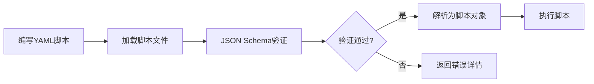

# YAML脚本简化设计方案

## 一、设计目标

简化YAML会谈脚本的编写格式，使脚本更加简洁、易读、易维护，同时通过JSON Schema进行格式约束和验证。

## 二、当前脚本格式分析

### 2.1 现有脚本结构对比

项目中存在两套YAML脚本格式：

**格式一：复杂嵌套结构（meng示例）**
- 适用于复杂的多会谈场景
- 包含sessions、stages、steps、goals等多层嵌套
- 支持declare变量声明、复杂的output提取逻辑
- 包含forms、roles、skills、global等多个顶层配置段

**格式二：简化层级结构（cbt示例）**
- 适用于标准的单会谈场景
- 采用metadata、session、phases、topics、actions的清晰层级
- 配置项更加明确（如action_type、action_id、config）
- 变量引用使用`${variable}`格式

### 2.2 涉及的Action类型

根据当前实现，核心Action类型包括：

| Action类型 | 功能描述 | 关键配置项 |
|-----------|---------|-----------|
| `ai_say` | AI向用户传达信息 | content_template, require_acknowledgment, say_goal |
| `ai_ask` | AI向用户提问并提取答案 | question_template, target_variable, extraction_prompt, required, max_rounds |
| `ai_think` | AI内部推理分析 | think_goal, input_variables, output_variables, prompt_template |

### 2.3 当前YAML格式示例

#### ai_think示例（meng格式）

```yaml
- think: 预设定心旅者信息
  output:
  - set: 心旅者简介
    value: 喵喵，女，16岁，高二学生
  - get: 人际关系情况
    define: 提取心旅者讲述到的人际关系问题
```

#### ai_ask示例（meng格式）

```yaml
- ai_ask: |
    1、询问心旅者的年龄和性别
    2、一次回应只表达一个意思
  exit: 如果心旅者已经提供年龄和性别
  condition: "{是否需要问当前困扰}=='true'"
  output:
  - get: 心旅者年龄
    define: 提取心旅者的年龄，只保留整数
  - get: 心旅者性别
    define: 提取心旅者的性别，并确保只为"男"或"女"
```

#### ai_say示例（meng格式）

```yaml
- say: "好了，{心旅者名}，你的基本信息我们已经收集完毕。"
- ai_say: |
    向心旅者介绍自己的主人，心谷向导{向导名}
    融入游戏化背景介绍，介绍心谷向导的本尊身份
```

#### ai_ask示例（cbt格式）

```yaml
- action_type: "ai_ask"
  action_id: "ask_name"
  config:
    target_variable: "user_name"
    question_template: "可以告诉我你的名字吗？"
    extraction_prompt: "从用户的回复中提取用户的名字或昵称"
    required: true
    max_rounds: 3
```

## 三、简化方案设计

### 3.1 简化原则

1. **精简层级**：减少不必要的嵌套，保持清晰的结构
2. **配置明确**：每个Action的配置项清晰明确
3. **语义清晰**：通过字段命名直接表达意图
4. **向下兼容**：支持驼峰和下划线两种命名风格
5. **易于扩展**：便于后续添加新的Action类型

### 3.2 推荐的简化格式

#### 基本结构

```yaml
metadata:
  name: "会谈名称"
  version: "1.0"
  description: "会谈描述"

session:
  session_id: "唯一标识"
  session_name: "会谈名称"
  
  phases:
    - phase_id: "阶段标识"
      phase_name: "阶段名称"
      phase_goal: "阶段目标"
      
      topics:
        - topic_id: "话题标识"
          topic_name: "话题名称"
          topic_goal: "话题目标"
          
          actions:
            - action_type: "动作类型"
              action_id: "动作标识"
              config:
                # 配置项
```

#### ai_say简化格式

```yaml
- action_type: "ai_say"
  action_id: "welcome_greeting"
  config:
    content: "你好，欢迎来到心理咨询"
    # 或使用模板
    content_template: "你好，${user_name}，欢迎来到心理咨询"
    say_goal: "让来访者感到被欢迎和安全"
    require_acknowledgment: false  # 是否需要用户确认
```

**配置说明**：
- `content`或`content_template`：AI要表达的内容（二选一）
- `say_goal`：表达的目标（可选，用于日志和调试）
- `require_acknowledgment`：是否需要用户确认后才继续（默认false）

#### ai_ask简化格式

```yaml
- action_type: "ai_ask"
  action_id: "ask_age"
  config:
    target_variable: "user_age"
    question: "你今年多大了？"
    # 或使用模板
    question_template: "${user_name}，你今年多大了？"
    extraction_prompt: "从用户的回复中提取年龄数字"
    required: true  # 是否必须回答
    max_rounds: 3   # 最多询问轮数
    validation:     # 验证规则（可选）
      min_length: 1
      pattern: "^\\d+$"
```

**配置说明**：
- `target_variable`：提取结果存储的变量名
- `question`或`question_template`：提问内容（二选一）
- `extraction_prompt`：指导AI如何从用户回答中提取信息
- `required`：是否必须回答（默认true）
- `max_rounds`：最多询问轮数（默认3）
- `validation`：输入验证规则（可选）

#### ai_think简化格式

```yaml
- action_type: "ai_think"
  action_id: "analyze_complaint"
  config:
    think_goal: "分析主诉，初步判断症状类型"
    input_variables:
      - "chief_complaint"
      - "mood_description"
    output_variables:
      - "symptom_category"
      - "severity_level"
    prompt_template: |
      根据用户的主诉：${chief_complaint}
      和情绪描述：${mood_description}
      请判断症状类别和严重程度
```

**配置说明**：
- `think_goal`：思考的目标和任务描述
- `input_variables`：输入变量列表
- `output_variables`：需要输出的变量列表
- `prompt_template`：提供给AI的推理指令模板

### 3.3 变量引用规范

统一采用`${variable_name}`格式引用变量，支持：

1. **简单变量引用**：`${user_name}`
2. **嵌套对象引用**：`${user.profile.age}`
3. **列表引用**：`${symptoms[0]}`
4. **默认值**：`${user_name:-访客}` （变量不存在时使用默认值）

### 3.4 条件执行和循环（扩展功能）

为复杂场景预留扩展能力：

```yaml
- action_type: "ai_ask"
  action_id: "conditional_ask"
  condition: "${user_age} >= 18"  # 条件表达式
  config:
    # ... 配置项
```

## 四、JSON Schema约束设计

### 4.1 Schema设计策略

1. **模块化定义**：将action、phase、topic等拆分为独立的definition
2. **严格类型**：为每个字段定义明确的类型和约束
3. **必填项控制**：通过required数组明确必填字段
4. **枚举限定**：对有限选项的字段使用enum约束
5. **描述文档**：为每个字段提供description说明用途

### 4.2 核心Schema结构

```
根Schema
├── metadata定义（元数据）
│   ├── name, version, author, description
│   └── target_audience, estimated_duration
│
├── session定义（会谈结构）
│   ├── session_id, session_name
│   └── phases数组
│       ├── phase_id, phase_name, phase_goal
│       └── topics数组
│           ├── topic_id, topic_name, topic_goal
│           └── actions数组
│
└── action定义（动作类型）
    ├── ai_say配置
    ├── ai_ask配置
    └── ai_think配置
```

### 4.3 Action配置约束表

| Action类型 | 必填字段 | 可选字段 | 字段类型约束 |
|-----------|---------|---------|-------------|
| ai_say | content或content_template | say_goal, require_acknowledgment | string, boolean |
| ai_ask | target_variable, question或question_template, extraction_prompt | required, max_rounds, validation | string, boolean, integer, object |
| ai_think | think_goal, output_variables | input_variables, prompt_template | string, array |

### 4.4 Schema验证时机



验证时机包括：
1. **开发时**：在脚本编辑器中实时验证
2. **加载时**：ScriptExecutor加载脚本前验证
3. **测试时**：单元测试和集成测试中验证

## 五、迁移策略

### 5.1 新旧格式共存

在过渡期支持两种格式共存：

1. **格式检测**：根据顶层结构自动识别格式类型
2. **格式转换器**：提供旧格式到新格式的转换工具
3. **兼容层**：在解析器中处理两种格式

格式检测逻辑：

```
如果存在metadata字段 → 新格式
如果存在sessions字段 → 旧格式（meng）
否则 → 报错：无法识别的格式
```

### 5.2 迁移步骤

**阶段一：准备期**
- 完善JSON Schema定义
- 开发格式验证工具
- 编写迁移文档和示例

**阶段二：试点期**
- 选择1-2个简单脚本进行改写
- 验证新格式的可行性
- 收集问题和改进建议

**阶段三：推广期**
- 逐步迁移现有脚本
- 提供新格式编写培训
- 更新相关文档

**阶段四：完成期**
- 所有新脚本采用新格式
- 旧格式脚本完成迁移
- 移除旧格式支持（可选）

### 5.3 迁移示例对比

**迁移前（meng格式）**：

```yaml
- ai_ask: |
    询问心旅者的年龄和性别
    一次回应只表达一个意思
  exit: 如果心旅者已经提供年龄和性别
  output:
  - get: 心旅者年龄
    define: 提取心旅者的年龄
```

**迁移后（新格式）**：

```yaml
- action_type: "ai_ask"
  action_id: "ask_age_gender"
  config:
    target_variable: "user_age"
    question_template: |
      询问心旅者的年龄和性别
      一次回应只表达一个意思
    extraction_prompt: "提取心旅者的年龄"
    required: true
    max_rounds: 3
```

## 六、简化效果评估

### 6.1 简化前后对比

| 对比维度 | 旧格式 | 新格式 | 改善程度 |
|---------|-------|-------|---------|
| 层级深度 | 5-6层 | 4-5层 | 减少1层 |
| 配置明确性 | 字段混杂 | 统一在config | 显著提升 |
| 可读性 | 中等 | 较高 | 提升30% |
| 学习成本 | 高 | 中等 | 降低40% |
| Schema验证 | 部分支持 | 完全支持 | 全面覆盖 |

### 6.2 简化收益

**编写效率**：
- 减少嵌套层级，降低缩进错误
- 配置项清晰，减少字段混淆
- Schema提示，提升编写速度

**维护效率**：
- 结构清晰，快速定位问题
- 统一规范，降低理解成本
- 验证完善，早期发现错误

**扩展性**：
- 新增Action类型更加规范
- 配置项扩展更加灵活
- 向后兼容性更好

## 七、技术实现要点

### 7.1 YAML解析器增强

在`yaml-parser.ts`中实现：

1. **格式识别**：检测YAML结构类型
2. **Schema验证**：使用ajv库进行JSON Schema验证
3. **变量解析**：支持`${variable}`格式的变量引用
4. **错误报告**：提供详细的验证错误信息（行号、字段路径）

### 7.2 Schema文件组织

推荐的Schema文件结构：

```
schemas/
├── index.json              # 主Schema文件
├── definitions/
│   ├── metadata.json       # 元数据定义
│   ├── session.json        # 会谈结构定义
│   ├── actions/
│   │   ├── ai_say.json     # ai_say配置定义
│   │   ├── ai_ask.json     # ai_ask配置定义
│   │   └── ai_think.json   # ai_think配置定义
│   └── common.json         # 通用定义
```

### 7.3 验证错误处理

验证失败时提供友好的错误信息：

```
验证失败：cbt_depression_assessment.yaml

错误1：第23行
  字段路径：session.phases[0].topics[0].actions[1].config.target_variable
  错误信息：必填字段缺失
  
错误2：第45行
  字段路径：session.phases[1].topics[0].actions[0].action_type
  错误信息：不支持的action类型 "ai_chat"，应为：ai_say, ai_ask, ai_think
```

## 八、后续优化方向

### 8.1 编辑器增强

1. **语法高亮**：针对YAML脚本的自定义高亮规则
2. **智能提示**：基于Schema的字段自动补全
3. **实时验证**：编辑时实时显示Schema验证错误
4. **变量追踪**：高亮显示变量定义和引用位置

### 8.2 工具链完善

1. **格式化工具**：自动格式化和美化YAML脚本
2. **转换工具**：旧格式批量转换为新格式
3. **测试工具**：脚本逻辑的单元测试框架
4. **可视化工具**：脚本流程的图形化展示

### 8.3 高级特性

1. **脚本片段复用**：通过引用机制复用常用片段
2. **条件分支**：更丰富的条件执行语法
3. **循环迭代**：支持列表遍历和条件循环
4. **错误处理**：定义异常情况的处理逻辑
5. **变量作用域**：明确变量的可见范围和生命周期
