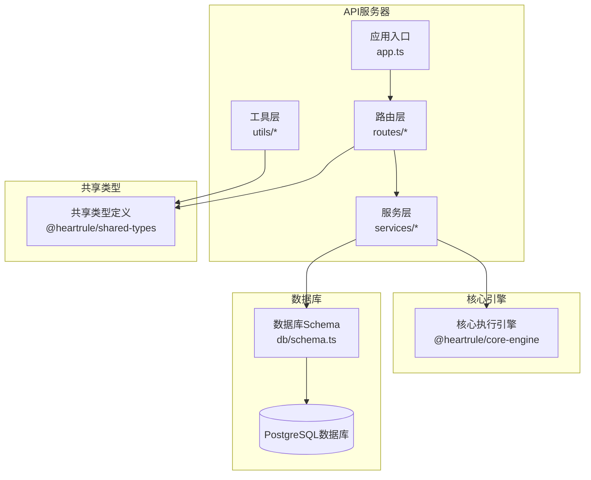
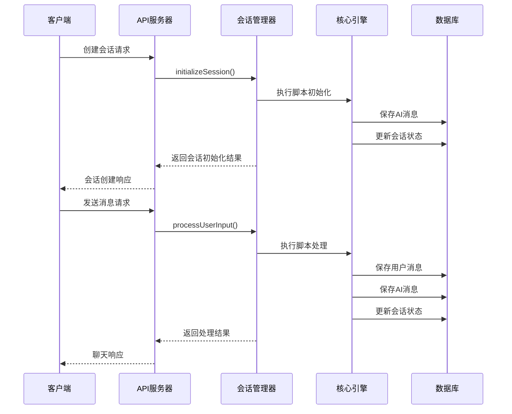
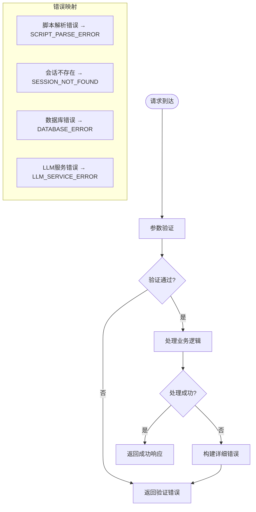

# API接口文档

<cite>
**本文档引用的文件**
- [packages/api-server/src/app.ts](file://packages/api-server/src/app.ts)
- [packages/api-server/src/routes/sessions.ts](file://packages/api-server/src/routes/sessions.ts)
- [packages/api-server/src/routes/chat.ts](file://packages/api-server/src/routes/chat.ts)
- [packages/api-server/src/routes/scripts.ts](file://packages/api-server/src/routes/scripts.ts)
- [packages/api-server/src/routes/projects.ts](file://packages/api-server/src/routes/projects.ts)
- [packages/api-server/src/routes/versions.ts](file://packages/api-server/src/routes/versions.ts)
- [packages/api-server/src/services/session-manager.ts](file://packages/api-server/src/services/session-manager.ts)
- [packages/api-server/src/utils/error-handler.ts](file://packages/api-server/src/utils/error-handler.ts)
- [packages/api-server/src/db/schema.ts](file://packages/api-server/src/db/schema.ts)
- [packages/shared-types/src/api/requests.ts](file://packages/shared-types/src/api/requests.ts)
- [packages/shared-types/src/api/responses.ts](file://packages/shared-types/src/api/responses.ts)
- [packages/api-server/test-api.ps1](file://packages/api-server/test-api.ps1)
- [config/dev.yaml](file://config/dev.yaml)
- [packages/api-server/package.json](file://packages/api-server/package.json)
</cite>

## 目录
1. [简介](#简介)
2. [项目结构](#项目结构)
3. [核心组件](#核心组件)
4. [架构概览](#架构概览)
5. [详细组件分析](#详细组件分析)
6. [依赖关系分析](#依赖关系分析)
7. [性能考虑](#性能考虑)
8. [故障排除指南](#故障排除指南)
9. [结论](#结论)
10. [附录](#附录)

## 简介

HeartRule AI咨询引擎是一个基于认知行为疗法(CBT)的AI咨询系统，通过YAML脚本驱动智能对话流程。该系统提供了完整的RESTful API接口，支持会话管理、聊天交互、脚本管理和项目管理等功能。

系统采用Fastify框架构建，集成了多种AI服务提供商，支持实时流式响应和WebSocket连接。通过模块化的架构设计，实现了高可扩展性和易维护性。

## 项目结构



**图表来源**
- [packages/api-server/src/app.ts](file://packages/api-server/src/app.ts#L21-L105)
- [packages/api-server/src/db/schema.ts](file://packages/api-server/src/db/schema.ts#L1-L219)

**章节来源**
- [packages/api-server/src/app.ts](file://packages/api-server/src/app.ts#L1-L135)
- [packages/api-server/package.json](file://packages/api-server/package.json#L1-L44)

## 核心组件

### 会话管理服务
会话管理服务是系统的核心组件，负责协调脚本执行引擎与数据库操作。它提供了会话初始化、用户输入处理、变量快照管理等关键功能。

### 错误处理工具
统一的错误处理机制，提供详细的错误映射、上下文信息和恢复建议。支持多种错误类型的分类和处理策略。

### 数据库Schema
基于PostgreSQL的完整数据模型，包括会话、消息、脚本、项目等相关表结构，支持复杂的关系查询和索引优化。

**章节来源**
- [packages/api-server/src/services/session-manager.ts](file://packages/api-server/src/services/session-manager.ts#L1-L462)
- [packages/api-server/src/utils/error-handler.ts](file://packages/api-server/src/utils/error-handler.ts#L1-L233)
- [packages/api-server/src/db/schema.ts](file://packages/api-server/src/db/schema.ts#L1-L219)

## 架构概览



**图表来源**
- [packages/api-server/src/routes/sessions.ts](file://packages/api-server/src/routes/sessions.ts#L55-L133)
- [packages/api-server/src/routes/chat.ts](file://packages/api-server/src/routes/chat.ts#L44-L79)
- [packages/api-server/src/services/session-manager.ts](file://packages/api-server/src/services/session-manager.ts#L73-L253)

## 详细组件分析

### 会话管理API

#### 创建会话
**端点**: `POST /api/sessions`

**请求参数**:
- `userId` (string, 必填): 用户标识符
- `scriptId` (string, 必填): 脚本唯一标识符(UUID格式)
- `initialVariables` (object, 可选): 初始变量对象

**响应格式**:
- `sessionId` (string): 会话唯一标识符
- `status` (string): 会话状态
- `createdAt` (string): 创建时间
- `aiMessage` (string): 初始AI消息
- `executionStatus` (string): 执行状态
- `error` (object): 错误信息(可选)

**使用示例**:
```bash
curl -X POST http://localhost:8000/api/sessions \
  -H "Content-Type: application/json" \
  -d '{
    "userId": "user_123",
    "scriptId": "550e8400-e29b-41d4-a716-446655440000",
    "initialVariables": {"name": "张三"}
  }'
```

**章节来源**
- [packages/api-server/src/routes/sessions.ts](file://packages/api-server/src/routes/sessions.ts#L15-L133)
- [packages/shared-types/src/api/requests.ts](file://packages/shared-types/src/api/requests.ts#L6-L16)

#### 获取会话详情
**端点**: `GET /api/sessions/{id}`

**路径参数**:
- `id` (string, 必填): 会话ID(UUID格式)

**响应格式**:
包含完整的会话信息，包括脚本解析内容和增强的位置信息。

**章节来源**
- [packages/api-server/src/routes/sessions.ts](file://packages/api-server/src/routes/sessions.ts#L136-L246)

#### 获取消息历史
**端点**: `GET /api/sessions/{id}/messages`

**路径参数**:
- `id` (string, 必填): 会话ID(UUID格式)

**响应格式**:
- `success` (boolean): 请求是否成功
- `data` (array): 消息数组，每条消息包含:
  - `messageId` (string): 消息ID
  - `role` (string): 角色(user/ai)
  - `content` (string): 消息内容
  - `timestamp` (string): 时间戳
  - `actionId` (string): 动作ID
  - `metadata` (object): 元数据

**章节来源**
- [packages/api-server/src/routes/sessions.ts](file://packages/api-server/src/routes/sessions.ts#L249-L317)

#### 发送消息
**端点**: `POST /api/sessions/{id}/messages`

**路径参数**:
- `id` (string, 必填): 会话ID(UUID格式)

**请求参数**:
- `content` (string, 必填): 用户消息内容

**响应格式**:
- `aiMessage` (string): AI回复消息
- `sessionStatus` (string): 会话状态
- `executionStatus` (string): 执行状态
- `variables` (object): 当前变量集合
- `position` (object): 详细执行位置信息
- `error` (object): 错误信息(可选)

**章节来源**
- [packages/api-server/src/routes/sessions.ts](file://packages/api-server/src/routes/sessions.ts#L320-L471)

#### 获取会话变量
**端点**: `GET /api/sessions/{id}/variables`

**路径参数**:
- `id` (string, 必填): 会话ID(UUID格式)

**响应格式**:
返回当前会话的所有变量对象。

**章节来源**
- [packages/api-server/src/routes/sessions.ts](file://packages/api-server/src/routes/sessions.ts#L474-L511)

#### 列出用户会话
**端点**: `GET /api/users/{userId}/sessions`

**路径参数**:
- `userId` (string, 必填): 用户ID

**响应格式**:
返回该用户的所有会话列表，按创建时间降序排列。

**章节来源**
- [packages/api-server/src/routes/sessions.ts](file://packages/api-server/src/routes/sessions.ts#L514-L547)

### 聊天交互API

#### 非流式聊天
**端点**: `POST /api/chat`

**请求参数**:
- `sessionId` (string, 必填): 会话ID(UUID格式)
- `message` (string, 必填): 用户消息内容

**响应格式**:
- `aiMessage` (string): AI回复消息
- `sessionStatus` (string): 会话状态
- `executionStatus` (string): 执行状态
- `extractedVariables` (object): 从回复中提取的变量

**使用示例**:
```bash
curl -X POST http://localhost:8000/api/chat \
  -H "Content-Type: application/json" \
  -d '{
    "sessionId": "550e8400-e29b-41d4-a716-446655440000",
    "message": "你好，我想咨询..."
  }'
```

**章节来源**
- [packages/api-server/src/routes/chat.ts](file://packages/api-server/src/routes/chat.ts#L17-L79)

#### 流式聊天(SSE)
**端点**: `POST /api/chat/stream`

**请求参数**:
- `sessionId` (string, 必填): 会话ID(UUID格式)
- `message` (string, 必填): 用户消息内容

**响应格式**:
SSE流式响应，包含多个数据块：
- `chunk` (string): 响应的字符片段
- `done` (boolean): 是否完成
- `error` (string): 错误信息(当发生错误时)

**实现说明**:
当前实现为模拟流式响应，实际部署时需要替换为真实的流式AI服务集成。

**章节来源**
- [packages/api-server/src/routes/chat.ts](file://packages/api-server/src/routes/chat.ts#L82-L150)

### 脚本管理API

#### 创建脚本
**端点**: `POST /api/scripts`

**请求参数**:
- `scriptName` (string, 必填): 脚本名称
- `scriptType` (string, 必填): 脚本类型(session/technique/awareness)
- `scriptContent` (string, 必填): YAML脚本内容
- `author` (string, 必填): 作者
- `description` (string, 可选): 描述
- `tags` (array, 可选): 标签数组

**响应格式**:
返回创建的脚本对象，包含解析后的脚本内容。

**章节来源**
- [packages/api-server/src/routes/scripts.ts](file://packages/api-server/src/routes/scripts.ts#L14-L85)

#### 获取脚本详情
**端点**: `GET /api/scripts/{id}`

**路径参数**:
- `id` (string, 必填): 脚本ID(UUID格式)

**响应格式**:
返回指定ID的脚本详细信息。

**章节来源**
- [packages/api-server/src/routes/scripts.ts](file://packages/api-server/src/routes/scripts.ts#L88-L125)

#### 列出脚本
**端点**: `GET /api/scripts`

**查询参数**:
- `type` (string, 可选): 脚本类型(session/technique/awareness)
- `status` (string, 可选): 脚本状态(draft/published/archived)

**响应格式**:
- `scripts` (array): 脚本列表
- `total` (number): 总数

**章节来源**
- [packages/api-server/src/routes/scripts.ts](file://packages/api-server/src/routes/scripts.ts#L128-L169)

#### 导入脚本
**端点**: `POST /api/scripts/import`

**请求参数**:
- `yamlContent` (string, 必填): YAML脚本内容
- `scriptName` (string, 必填): 脚本名称
- `description` (string, 可选): 描述

**响应格式**:
- `success` (boolean): 导入是否成功
- `data` (object): 包含`scriptId`

**章节来源**
- [packages/api-server/src/routes/scripts.ts](file://packages/api-server/src/routes/scripts.ts#L172-L278)

#### 验证脚本
**端点**: `POST /api/scripts/{id}/validate`

**路径参数**:
- `id` (string, 必填): 脚本ID(UUID格式)

**响应格式**:
- `valid` (boolean): 验证结果
- `message` (string): 验证消息

**注意**: 当前实现为模拟验证，实际需要集成YAML解析器进行结构验证。

**章节来源**
- [packages/api-server/src/routes/scripts.ts](file://packages/api-server/src/routes/scripts.ts#L281-L323)

### 项目管理API

#### 获取项目列表
**端点**: `GET /projects`

**查询参数**:
- `status` (string, 可选): 项目状态(draft/published/archived/all)
- `search` (string, 可选): 搜索关键词
- `author` (string, 可选): 作者

**响应格式**:
- `success` (boolean): 请求是否成功
- `data` (array): 项目列表，每个项目包含文件数量统计

**章节来源**
- [packages/api-server/src/routes/projects.ts](file://packages/api-server/src/routes/projects.ts#L28-L85)

#### 获取项目详情
**端点**: `GET /projects/{id}`

**路径参数**:
- `id` (string, 必填): 项目ID(UUID格式)

**响应格式**:
- `success` (boolean): 请求是否成功
- `data` (object): 包含项目基本信息、文件列表、草稿和版本历史

**章节来源**
- [packages/api-server/src/routes/projects.ts](file://packages/api-server/src/routes/projects.ts#L88-L130)

#### 创建新项目
**端点**: `POST /projects`

**请求参数**:
- `projectName` (string, 必填): 项目名称(1-255字符)
- `description` (string, 可选): 描述，默认为空
- `engineVersion` (string, 可选): 引擎版本，默认"1.2.0"
- `engineVersionMin` (string, 可选): 最低兼容版本，默认"1.0.0"
- `author` (string, 必填): 作者
- `tags` (array, 可选): 标签数组，默认为空

**响应格式**:
- `success` (boolean): 请求是否成功
- `data` (object): 新创建的项目信息

**章节来源**
- [packages/api-server/src/routes/projects.ts](file://packages/api-server/src/routes/projects.ts#L133-L193)

#### 更新项目信息
**端点**: `PUT /projects/{id}`

**路径参数**:
- `id` (string, 必填): 项目ID(UUID格式)

**请求参数**:
支持更新以下字段(可选):
- `projectName` (string): 项目名称
- `description` (string): 描述
- `engineVersion` (string): 引擎版本
- `engineVersionMin` (string): 最低兼容版本
- `tags` (array): 标签数组

**响应格式**:
- `success` (boolean): 请求是否成功
- `data` (object): 更新后的项目信息

**章节来源**
- [packages/api-server/src/routes/projects.ts](file://packages/api-server/src/routes/projects.ts#L196-L235)

#### 归档项目
**端点**: `DELETE /projects/{id}`

**路径参数**:
- `id` (string, 必填): 项目ID(UUID格式)

**响应格式**:
- `success` (boolean): 请求是否成功
- `data` (object): 归档后的项目信息

**章节来源**
- [packages/api-server/src/routes/projects.ts](file://packages/api-server/src/routes/projects.ts#L238-L269)

#### 复制项目
**端点**: `POST /projects/{id}/copy`

**路径参数**:
- `id` (string, 必填): 原项目ID(UUID格式)
- `author` (string, 可选): 新作者

**响应格式**:
- `success` (boolean): 请求是否成功
- `data` (object): 新复制的项目信息

**章节来源**
- [packages/api-server/src/routes/projects.ts](file://packages/api-server/src/routes/projects.ts#L272-L338)

#### 获取项目文件列表
**端点**: `GET /projects/{id}/files`

**路径参数**:
- `id` (string, 必填): 项目ID(UUID格式)

**响应格式**:
- `success` (boolean): 请求是否成功
- `data` (array): 文件列表，按文件类型排序

**章节来源**
- [packages/api-server/src/routes/projects.ts](file://packages/api-server/src/routes/projects.ts#L340-L362)

#### 获取单个文件
**端点**: `GET /projects/{id}/files/{fileId}`

**路径参数**:
- `id` (string, 必填): 项目ID(UUID格式)
- `fileId` (string, 必填): 文件ID(UUID格式)

**响应格式**:
- `success` (boolean): 请求是否成功
- `data` (object): 文件详细信息

**章节来源**
- [packages/api-server/src/routes/projects.ts](file://packages/api-server/src/routes/projects.ts#L365-L392)

#### 创建新文件
**端点**: `POST /projects/{id}/files`

**路径参数**:
- `id` (string, 必填): 项目ID(UUID格式)

**请求参数**:
- `fileType` (string, 必填): 文件类型
- `fileName` (string, 必填): 文件名
- `fileContent` (any, 必填): 文件内容(JSON格式)

**响应格式**:
- `success` (boolean): 请求是否成功
- `data` (object): 新创建的文件信息

**章节来源**
- [packages/api-server/src/routes/projects.ts](file://packages/api-server/src/routes/projects.ts#L395-L425)

#### 更新文件
**端点**: `PUT /projects/{id}/files/{fileId}`

**路径参数**:
- `id` (string, 必填): 项目ID(UUID格式)
- `fileId` (string, 必填): 文件ID(UUID格式)

**请求参数**:
支持更新以下字段(可选):
- `fileName` (string): 文件名
- `fileContent` (any): 文件内容
- `yamlContent` (string): YAML内容

**响应格式**:
- `success` (boolean): 请求是否成功
- `data` (object): 更新后的文件信息

**章节来源**
- [packages/api-server/src/routes/projects.ts](file://packages/api-server/src/routes/projects.ts#L428-L466)

#### 删除文件
**端点**: `DELETE /projects/{id}/files/{fileId}`

**路径参数**:
- `id` (string, 必填): 项目ID(UUID格式)
- `fileId` (string, 必填): 文件ID(UUID格式)

**响应格式**:
- `success` (boolean): 请求是否成功
- `data` (object): 删除的文件信息

**章节来源**
- [packages/api-server/src/routes/projects.ts](file://packages/api-server/src/routes/projects.ts#L469-L496)

### 版本控制API

#### 获取草稿
**端点**: `GET /api/projects/{id}/draft`

**路径参数**:
- `id` (string, 必填): 项目ID(UUID格式)

**响应格式**:
- `success` (boolean): 请求是否成功
- `data` (object): 草稿信息

**章节来源**
- [packages/api-server/src/routes/versions.ts](file://packages/api-server/src/routes/versions.ts#L22-L46)

#### 保存草稿
**端点**: `PUT /api/projects/{id}/draft`

**路径参数**:
- `id` (string, 必填): 项目ID(UUID格式)

**请求参数**:
- `draftFiles` (object, 必填): 草稿文件内容
- `updatedBy` (string, 必填): 更新者

**响应格式**:
- `success` (boolean): 请求是否成功
- `data` (object): 保存的草稿信息

**章节来源**
- [packages/api-server/src/routes/versions.ts](file://packages/api-server/src/routes/versions.ts#L49-L115)

#### 发布版本
**端点**: `POST /api/projects/{id}/publish`

**路径参数**:
- `id` (string, 必填): 项目ID(UUID格式)

**请求参数**:
- `versionNumber` (string, 必填): 版本号
- `releaseNote` (string, 可选): 发布说明，默认为空
- `publishedBy` (string, 必填): 发布者

**响应格式**:
- `success` (boolean): 请求是否成功
- `data` (object): 新发布的版本信息

**章节来源**
- [packages/api-server/src/routes/versions.ts](file://packages/api-server/src/routes/versions.ts#L118-L199)

#### 获取版本历史
**端点**: `GET /api/projects/{id}/versions`

**路径参数**:
- `id` (string, 必填): 项目ID(UUID格式)

**响应格式**:
- `success` (boolean): 请求是否成功
- `data` (array): 版本历史列表，按发布时间降序排列

**章节来源**
- [packages/api-server/src/routes/versions.ts](file://packages/api-server/src/routes/versions.ts#L202-L223)

#### 获取单个版本详情
**端点**: `GET /api/projects/{id}/versions/{versionId}`

**路径参数**:
- `id` (string, 必填): 项目ID(UUID格式)
- `versionId` (string, 必填): 版本ID(UUID格式)

**响应格式**:
- `success` (boolean): 请求是否成功
- `data` (object): 版本详细信息

**章节来源**
- [packages/api-server/src/routes/versions.ts](file://packages/api-server/src/routes/versions.ts#L226-L253)

#### 回滚到指定版本
**端点**: `POST /api/projects/{id}/rollback`

**路径参数**:
- `id` (string, 必填): 项目ID(UUID格式)

**请求参数**:
- `targetVersionId` (string, 必填): 目标版本ID
- `publishedBy` (string, 必填): 发布者

**响应格式**:
- `success` (boolean): 请求是否成功
- `data` (object): 新创建的回滚版本信息

**章节来源**
- [packages/api-server/src/routes/versions.ts](file://packages/api-server/src/routes/versions.ts#L256-L334)

#### 对比两个版本
**端点**: `GET /api/projects/{id}/versions/{versionId}/diff`

**路径参数**:
- `id` (string, 必填): 项目ID(UUID格式)
- `versionId` (string, 必填): 版本ID(UUID格式)
- `compareWith` (string, 可选): 对比版本ID(不提供时默认与前一个版本对比)

**响应格式**:
- `success` (boolean): 请求是否成功
- `data` (object): 包含版本信息、对比版本和差异信息

**注意**: 当前实现为简化版本对比，实际应该使用专业的diff库进行精确对比。

**章节来源**
- [packages/api-server/src/routes/versions.ts](file://packages/api-server/src/routes/versions.ts#L337-L403)

## 依赖关系分析

```mermaid
graph TB
subgraph "外部依赖"
FASTIFY[Fastify框架]
DRIZZLE[Drizzle ORM]
ZOD[Zod验证库]
YAML[YAML解析器]
UUID[UUID生成器]
end
subgraph "内部包"
API_SERVER[@heartrule/api-server]
CORE_ENGINE[@heartrule/core-engine]
SHARED_TYPES[@heartrule/shared-types]
end
subgraph "数据库"
POSTGRES[PostgreSQL]
PGVECTOR[pgvector扩展]
end
API_SERVER --> FASTIFY
API_SERVER --> DRIZZLE
API_SERVER --> ZOD
API_SERVER --> YAML
API_SERVER --> UUID
API_SERVER --> CORE_ENGINE
API_SERVER --> SHARED_TYPES
API_SERVER --> POSTGRES
POSTGRES --> PGVECTOR
SHARED_TYPES --> ZOD
```

**图表来源**
- [packages/api-server/package.json](file://packages/api-server/package.json#L20-L35)
- [packages/api-server/src/app.ts](file://packages/api-server/src/app.ts#L1-L135)

**章节来源**
- [packages/api-server/package.json](file://packages/api-server/package.json#L1-L44)

## 性能考虑

### 数据库优化
- **索引策略**: 为常用查询字段建立复合索引，如会话状态、用户ID、创建时间等
- **查询优化**: 使用批量操作减少数据库往返次数
- **连接池**: 配置合适的连接池大小以平衡性能和资源消耗

### 缓存策略
- **脚本缓存**: 启用脚本内容缓存减少YAML解析开销
- **会话状态缓存**: 对频繁访问的会话状态使用Redis缓存
- **响应缓存**: 对静态内容和重复查询结果进行缓存

### 并发处理
- **会话并发**: 限制单用户最大并发会话数，避免资源耗尽
- **队列处理**: 对长时间运行的操作使用异步队列处理
- **超时设置**: 合理设置请求超时和数据库连接超时

### 监控指标
- **性能监控**: 监控API响应时间、数据库查询时间、内存使用率
- **错误监控**: 跟踪错误率和错误类型分布
- **容量规划**: 基于监控数据进行容量规划和资源调整

## 故障排除指南

### 常见错误类型

**会话相关错误**:
- `SESSION_NOT_FOUND`: 会话不存在或已过期
- `SCRIPT_NOT_FOUND`: 关联的脚本不存在
- `ACTION_EXECUTION_ERROR`: 脚本动作执行失败

**脚本相关错误**:
- `SCRIPT_PARSE_ERROR`: YAML脚本解析失败
- `SCRIPT_VALIDATION_ERROR`: 脚本结构验证失败

**系统相关错误**:
- `DATABASE_ERROR`: 数据库操作失败
- `LLM_SERVICE_ERROR`: LLM服务不可用

### 错误处理流程



**图表来源**
- [packages/api-server/src/utils/error-handler.ts](file://packages/api-server/src/utils/error-handler.ts#L22-L71)

### 调试技巧

**开发环境配置**:
- 启用详细日志记录
- 使用Swagger UI测试API
- 配置适当的CORS设置

**API测试工具**:
- 使用PowerShell脚本进行自动化测试
- 利用curl命令进行手动测试
- 集成Postman进行接口测试

**性能测试**:
- 使用ab或wrk进行压力测试
- 监控数据库查询性能
- 分析内存使用情况

**章节来源**
- [packages/api-server/src/utils/error-handler.ts](file://packages/api-server/src/utils/error-handler.ts#L1-L233)
- [packages/api-server/test-api.ps1](file://packages/api-server/test-api.ps1#L1-L99)

## 结论

HeartRule AI咨询引擎提供了完整的企业级API解决方案，具有以下特点：

**技术优势**:
- 基于模块化架构，易于扩展和维护
- 完善的错误处理和监控机制
- 支持多种AI服务提供商
- 丰富的版本控制和项目管理功能

**应用场景**:
- 在线心理咨询平台
- CBT训练系统
- 心理健康教育工具
- 企业员工心理支持

**未来发展**:
- 集成更多AI服务提供商
- 增强实时通信功能
- 优化性能和可扩展性
- 扩展移动端支持

## 附录

### 认证机制
系统目前采用简单的会话ID机制进行身份验证。在生产环境中建议集成：
- JWT令牌认证
- OAuth2.0授权
- API密钥管理

### 请求限制
- 单用户最大并发会话数: 100
- 单个请求体大小限制: 1MB
- 连接超时时间: 60秒
- 会话空闲超时: 30分钟

### API版本管理
- 版本号: 2.0.0
- 兼容性: 向后兼容
- 升级策略: 渐进式迁移

### 开发工具链
- TypeScript开发环境
- Drizzle ORM数据库管理
- Swagger API文档生成
- Docker容器化部署

**章节来源**
- [config/dev.yaml](file://config/dev.yaml#L1-L63)
- [packages/api-server/src/app.ts](file://packages/api-server/src/app.ts#L110-L135)