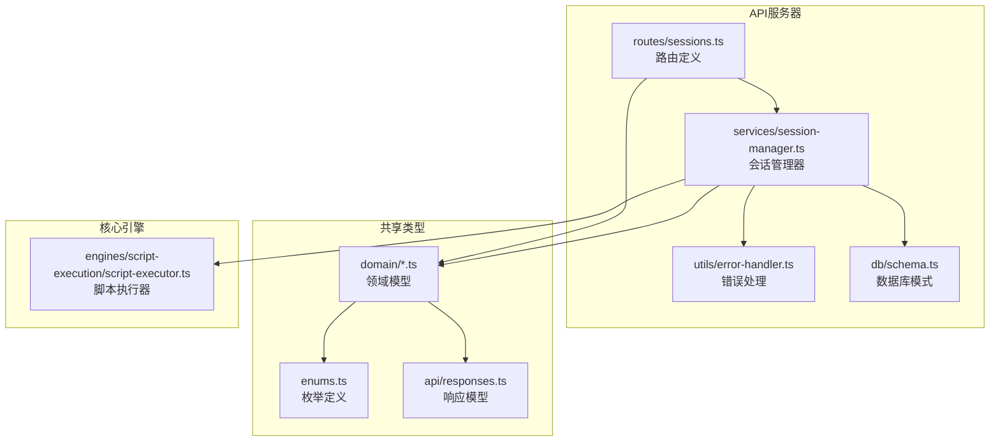
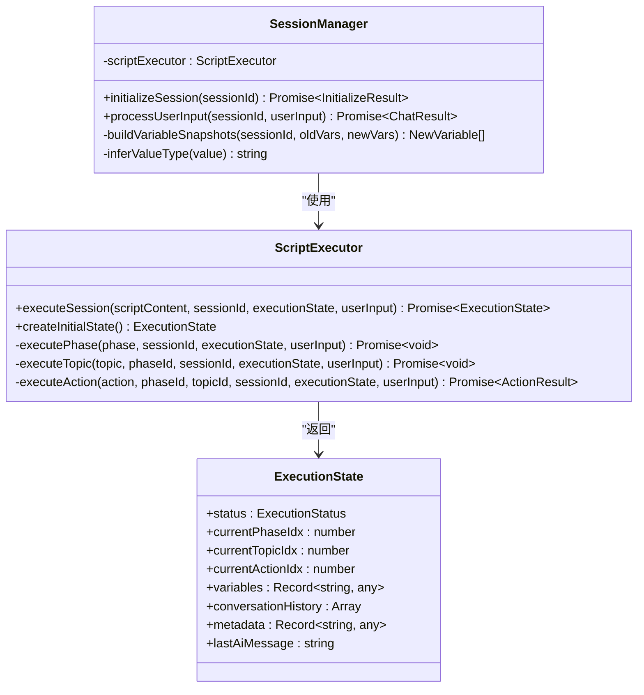
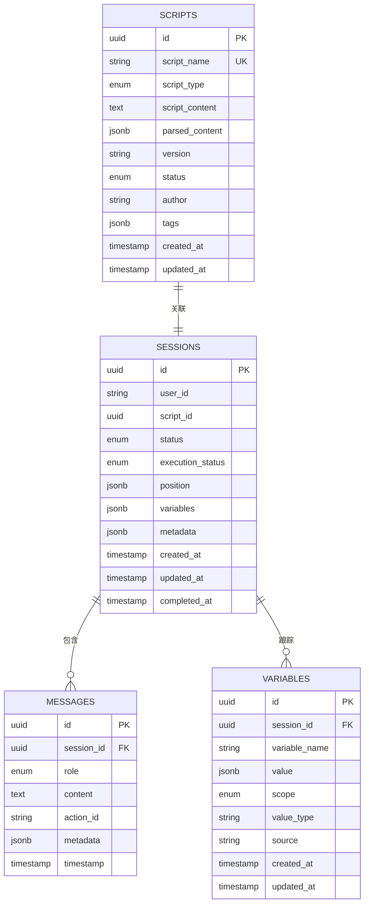
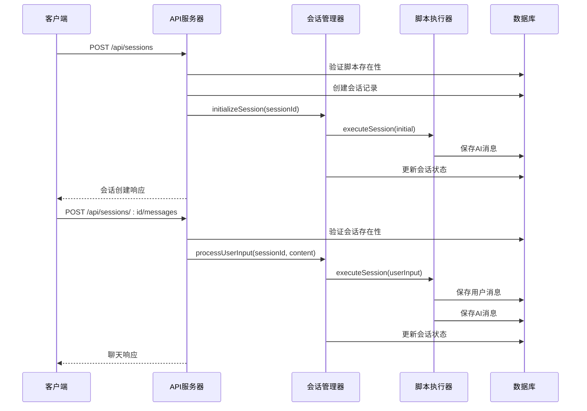
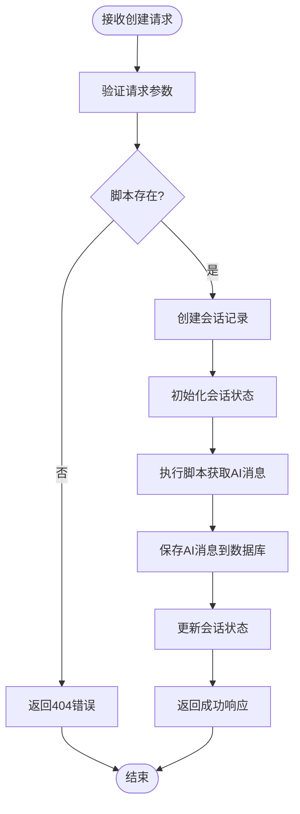
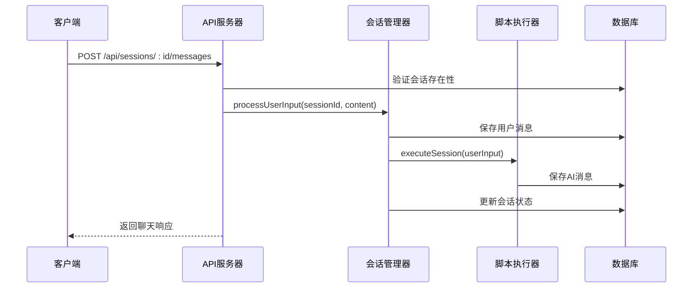
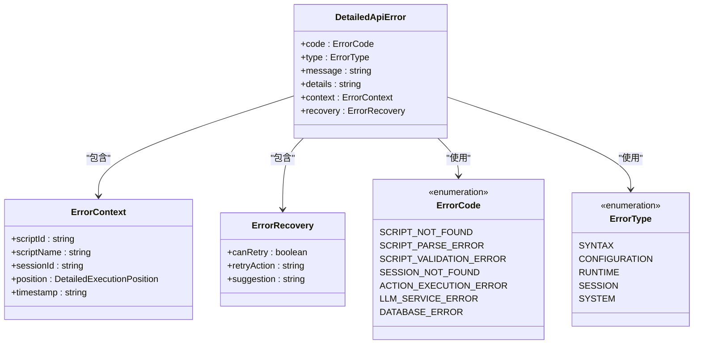
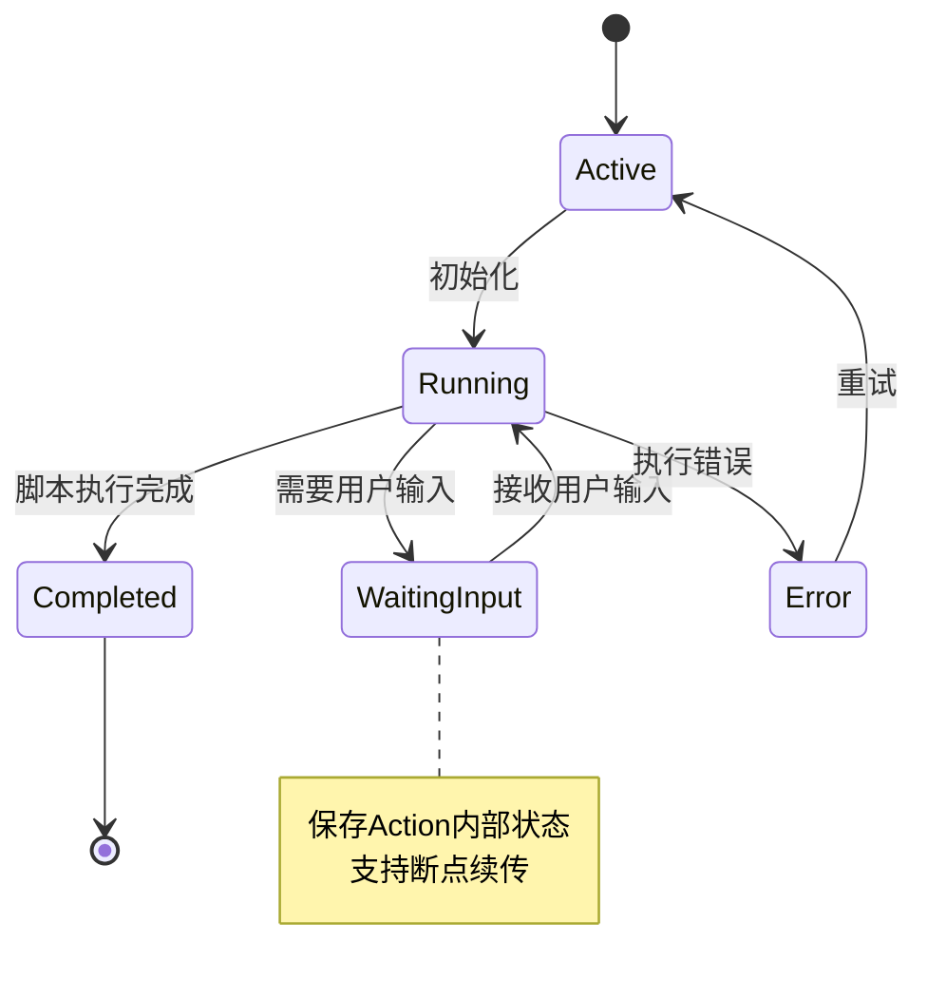

# 会话管理API

<cite>
**本文档引用的文件**
- [packages/api-server/src/routes/sessions.ts](file://packages/api-server/src/routes/sessions.ts)
- [packages/api-server/src/services/session-manager.ts](file://packages/api-server/src/services/session-manager.ts)
- [packages/api-server/src/db/schema.ts](file://packages/api-server/src/db/schema.ts)
- [packages/api-server/src/utils/error-handler.ts](file://packages/api-server/src/utils/error-handler.ts)
- [packages/shared-types/src/domain/session.ts](file://packages/shared-types/src/domain/session.ts)
- [packages/shared-types/src/domain/message.ts](file://packages/shared-types/src/domain/message.ts)
- [packages/shared-types/src/domain/variable.ts](file://packages/shared-types/src/domain/variable.ts)
- [packages/shared-types/src/api/responses.ts](file://packages/shared-types/src/api/responses.ts)
- [packages/shared-types/src/enums.ts](file://packages/shared-types/src/enums.ts)
- [packages/core-engine/src/engines/script-execution/script-executor.ts](file://packages/core-engine/src/engines/script-execution/script-executor.ts)
</cite>

## 目录
1. [简介](#简介)
2. [项目结构](#项目结构)
3. [核心组件](#核心组件)
4. [架构概览](#架构概览)
5. [详细组件分析](#详细组件分析)
6. [依赖关系分析](#依赖关系分析)
7. [性能考虑](#性能考虑)
8. [故障排除指南](#故障排除指南)
9. [结论](#结论)

## 简介

会话管理API是HeartRule心理咨询系统的核心组件，负责管理基于YAML脚本的咨询会话生命周期。该API提供了完整的会话管理功能，包括会话创建、状态跟踪、消息交互和变量管理。

系统采用分层架构设计：
- **路由层**：Fastify路由定义和请求验证
- **服务层**：会话管理器封装业务逻辑
- **数据层**：Drizzle ORM数据库操作
- **共享层**：类型定义和错误处理规范

## 项目结构

会话管理API位于`packages/api-server`包中，主要包含以下关键文件：



**图表来源**
- [packages/api-server/src/routes/sessions.ts](file://packages/api-server/src/routes/sessions.ts#L1-L548)
- [packages/api-server/src/services/session-manager.ts](file://packages/api-server/src/services/session-manager.ts#L1-L462)
- [packages/api-server/src/db/schema.ts](file://packages/api-server/src/db/schema.ts#L1-L219)

**章节来源**
- [packages/api-server/src/routes/sessions.ts](file://packages/api-server/src/routes/sessions.ts#L1-L548)
- [packages/api-server/src/services/session-manager.ts](file://packages/api-server/src/services/session-manager.ts#L1-L462)

## 核心组件

### 会话管理器 (SessionManager)

会话管理器是API的核心业务逻辑组件，负责：
- 会话初始化和状态管理
- 用户输入处理和脚本执行
- 消息持久化和变量跟踪
- 错误处理和状态恢复



**图表来源**
- [packages/api-server/src/services/session-manager.ts](file://packages/api-server/src/services/session-manager.ts#L21-L462)
- [packages/core-engine/src/engines/script-execution/script-executor.ts](file://packages/core-engine/src/engines/script-execution/script-executor.ts#L59-L511)

### 数据库架构

系统使用PostgreSQL作为数据存储，采用JSONB字段存储复杂数据结构：



**图表来源**
- [packages/api-server/src/db/schema.ts](file://packages/api-server/src/db/schema.ts#L22-L176)

**章节来源**
- [packages/api-server/src/db/schema.ts](file://packages/api-server/src/db/schema.ts#L1-L219)

## 架构概览

会话管理API采用RESTful架构设计，遵循HTTP标准和JSON响应格式：



**图表来源**
- [packages/api-server/src/routes/sessions.ts](file://packages/api-server/src/routes/sessions.ts#L55-L133)
- [packages/api-server/src/services/session-manager.ts](file://packages/api-server/src/services/session-manager.ts#L73-L253)

## 详细组件分析

### 1. 创建会话 (POST /api/sessions)

#### 请求规范
- **方法**: POST
- **路径**: `/api/sessions`
- **请求头**: `Content-Type: application/json`
- **请求体**:
  ```json
  {
    "userId": "string",
    "scriptId": "uuid",
    "initialVariables": {}
  }
  ```

#### 响应规范
- **成功响应** (200):
  ```json
  {
    "sessionId": "uuid",
    "status": "string",
    "createdAt": "string",
    "aiMessage": "string",
    "executionStatus": "string",
    "position": {
      "phaseIndex": 0,
      "phaseId": "string",
      "topicIndex": 0,
      "topicId": "string",
      "actionIndex": 0,
      "actionId": "string",
      "actionType": "string"
    }
  }
  ```

- **错误响应** (404/500):
  ```json
  {
    "success": false,
    "error": {
      "code": "SCRIPT_NOT_FOUND",
      "type": "configuration",
      "message": "Script not found",
      "details": "错误详情",
      "context": {
        "scriptId": "uuid",
        "scriptName": "string",
        "timestamp": "string"
      },
      "recovery": {
        "canRetry": false,
        "retryAction": "string",
        "suggestion": "string"
      }
    }
  }
  ```

#### 处理流程


**图表来源**
- [packages/api-server/src/routes/sessions.ts](file://packages/api-server/src/routes/sessions.ts#L55-L133)
- [packages/api-server/src/services/session-manager.ts](file://packages/api-server/src/services/session-manager.ts#L73-L253)

**章节来源**
- [packages/api-server/src/routes/sessions.ts](file://packages/api-server/src/routes/sessions.ts#L14-L133)
- [packages/shared-types/src/api/responses.ts](file://packages/shared-types/src/api/responses.ts#L113-L129)

### 2. 获取会话详情 (GET /api/sessions/:id)

#### 请求规范
- **方法**: GET
- **路径**: `/api/sessions/:id`
- **路径参数**: `id` (UUID)
- **响应**: 完整会话信息，包含脚本解析内容

#### 响应结构
```json
{
  "sessionId": "uuid",
  "userId": "string",
  "scriptId": "uuid",
  "status": "active",
  "executionStatus": "running",
  "position": {
    "phaseIndex": 0,
    "phaseId": "phase_0",
    "topicIndex": 0,
    "topicId": "topic_0",
    "actionIndex": 0,
    "actionId": "action_0",
    "actionType": "string"
  },
  "variables": {},
  "metadata": {
    "script": {
      "session": {
        "session_id": "string",
        "session_name": "string",
        "phases": []
      }
    }
  },
  "createdAt": "string",
  "updatedAt": "string"
}
```

#### 处理逻辑
会话详情接口会将数据库中的位置索引转换为包含ID字段的完整位置信息，便于前端导航树构建。

**章节来源**
- [packages/api-server/src/routes/sessions.ts](file://packages/api-server/src/routes/sessions.ts#L135-L246)
- [packages/shared-types/src/domain/session.ts](file://packages/shared-types/src/domain/session.ts#L13-L52)

### 3. 获取消息历史 (GET /api/sessions/:id/messages)

#### 请求规范
- **方法**: GET
- **路径**: `/api/sessions/:id/messages`
- **路径参数**: `id` (UUID)

#### 响应结构
```json
{
  "success": true,
  "data": [
    {
      "messageId": "uuid",
      "role": "ai",  // assistant -> ai
      "content": "string",
      "timestamp": "string",
      "actionId": "string",
      "metadata": {}
    }
  ]
}
```

#### 数据转换
系统会将数据库中的`assistant`角色转换为前端期望的`ai`角色，并标准化时间戳格式。

**章节来源**
- [packages/api-server/src/routes/sessions.ts](file://packages/api-server/src/routes/sessions.ts#L248-L317)
- [packages/shared-types/src/domain/message.ts](file://packages/shared-types/src/domain/message.ts#L8-L29)

### 4. 发送消息 (POST /api/sessions/:id/messages)

#### 请求规范
- **方法**: POST
- **路径**: `/api/sessions/:id/messages`
- **请求体**:
  ```json
  {
    "content": "string"
  }
  ```

#### 响应结构
```json
{
  "aiMessage": "string",
  "sessionStatus": "string",
  "executionStatus": "string",
  "variables": {},
  "position": {
    "phaseIndex": 0,
    "phaseId": "string",
    "topicIndex": 0,
    "topicId": "string",
    "actionIndex": 0,
    "actionId": "string",
    "actionType": "string"
  },
  "error": {
    "code": "string",
    "type": "string",
    "message": "string",
    "details": "string",
    "context": {
      "scriptId": "uuid",
      "scriptName": "string",
      "sessionId": "uuid",
      "position": {
        "phaseIndex": 0,
        "phaseId": "string",
        "topicIndex": 0,
        "topicId": "string",
        "actionIndex": 0,
        "actionId": "string",
        "actionType": "string"
      },
      "timestamp": "string"
    },
    "recovery": {
      "canRetry": true,
      "retryAction": "string",
      "suggestion": "string"
    }
  }
}
```

#### 执行流程


**图表来源**
- [packages/api-server/src/routes/sessions.ts](file://packages/api-server/src/routes/sessions.ts#L403-L471)
- [packages/api-server/src/services/session-manager.ts](file://packages/api-server/src/services/session-manager.ts#L258-L460)

**章节来源**
- [packages/api-server/src/routes/sessions.ts](file://packages/api-server/src/routes/sessions.ts#L319-L471)
- [packages/api-server/src/services/session-manager.ts](file://packages/api-server/src/services/session-manager.ts#L258-L460)

### 5. 获取会话变量 (GET /api/sessions/:id/variables)

#### 请求规范
- **方法**: GET
- **路径**: `/api/sessions/:id/variables`

#### 响应结构
直接返回会话的变量对象，包含所有已定义的变量及其值。

**章节来源**
- [packages/api-server/src/routes/sessions.ts](file://packages/api-server/src/routes/sessions.ts#L473-L511)

### 6. 列出用户会话 (GET /api/users/:userId/sessions)

#### 请求规范
- **方法**: GET
- **路径**: `/api/users/:userId/sessions`
- **路径参数**: `userId` (字符串)

#### 响应结构
返回按创建时间降序排列的用户会话数组。

**章节来源**
- [packages/api-server/src/routes/sessions.ts](file://packages/api-server/src/routes/sessions.ts#L513-L546)

## 依赖关系分析

### 错误处理机制

系统实现了统一的错误处理机制，支持多种错误类型的分类和恢复策略：



**图表来源**
- [packages/shared-types/src/api/responses.ts](file://packages/shared-types/src/api/responses.ts#L68-L84)
- [packages/shared-types/src/enums.ts](file://packages/shared-types/src/enums.ts#L94-L105)

### 会话状态管理

会话状态管理采用位置追踪机制，通过三元组索引跟踪执行进度：



**图表来源**
- [packages/core-engine/src/engines/script-execution/script-executor.ts](file://packages/core-engine/src/engines/script-execution/script-executor.ts#L14-L20)
- [packages/api-server/src/services/session-manager.ts](file://packages/api-server/src/services/session-manager.ts#L324-L460)

**章节来源**
- [packages/shared-types/src/enums.ts](file://packages/shared-types/src/enums.ts#L6-L22)
- [packages/core-engine/src/engines/script-execution/script-executor.ts](file://packages/core-engine/src/engines/script-execution/script-executor.ts#L63-L208)

## 性能考虑

### 数据库优化
- **索引策略**：为会话表的用户ID、状态和创建时间建立复合索引
- **查询优化**：使用分页查询避免大量数据传输
- **连接池**：合理配置数据库连接池大小

### 缓存策略
- **会话状态缓存**：对活跃会话进行内存缓存
- **脚本内容缓存**：缓存已解析的脚本内容
- **消息历史缓存**：缓存最近的消息历史

### 并发控制
- **事务管理**：确保会话状态更新的原子性
- **锁机制**：防止并发修改导致的数据不一致
- **超时处理**：设置合理的操作超时时间

## 故障排除指南

### 常见错误及解决方案

| 错误类型 | 错误代码 | 描述 | 解决方案 |
|---------|---------|------|----------|
| 脚本不存在 | SCRIPT_NOT_FOUND | 指定的脚本ID不存在 | 确认脚本已正确导入并验证ID格式 |
| 会话不存在 | SESSION_NOT_FOUND | 会话ID无效或已过期 | 检查会话ID有效性，重新创建会话 |
| 脚本解析错误 | SCRIPT_PARSE_ERROR | YAML语法错误 | 修复YAML语法，验证脚本结构 |
| 数据库错误 | DATABASE_ERROR | 数据库操作失败 | 检查数据库连接，重试操作 |
| LLM服务错误 | LLM_SERVICE_ERROR | 大语言模型服务不可用 | 检查网络连接和服务状态 |

### 调试技巧
1. **启用详细日志**：在开发环境中启用详细的执行日志
2. **状态检查**：定期检查会话状态和执行进度
3. **变量监控**：监控变量变化和提取结果
4. **错误上下文**：利用错误上下文信息定位问题

**章节来源**
- [packages/api-server/src/utils/error-handler.ts](file://packages/api-server/src/utils/error-handler.ts#L22-L71)
- [packages/api-server/src/utils/error-handler.ts](file://packages/api-server/src/utils/error-handler.ts#L186-L233)

## 结论

会话管理API提供了完整的心理咨询会话生命周期管理功能。通过清晰的分层架构、完善的错误处理机制和灵活的脚本执行引擎，系统能够支持复杂的咨询流程和多轮对话交互。

关键特性包括：
- **完整的会话生命周期管理**：从创建到完成的全链路支持
- **灵活的位置追踪机制**：支持断点续传和状态恢复
- **强大的错误处理能力**：提供详细的错误信息和恢复建议
- **可扩展的架构设计**：支持自定义脚本和Action扩展

该API为心理咨询系统的智能化发展奠定了坚实的技术基础，能够有效提升咨询效率和质量。