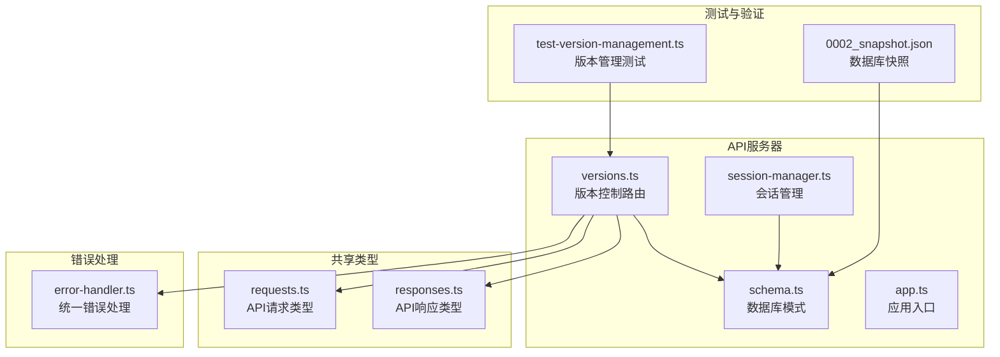
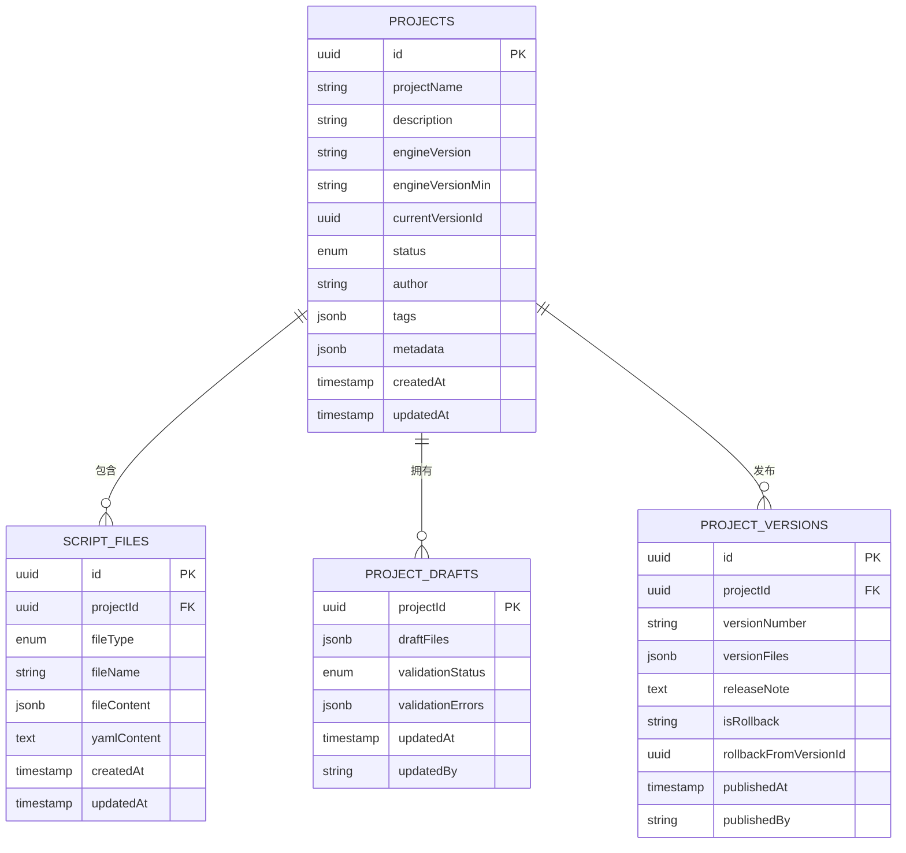
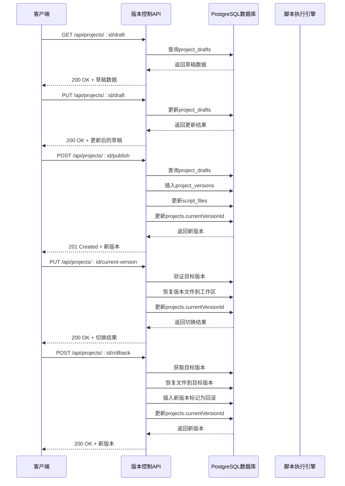
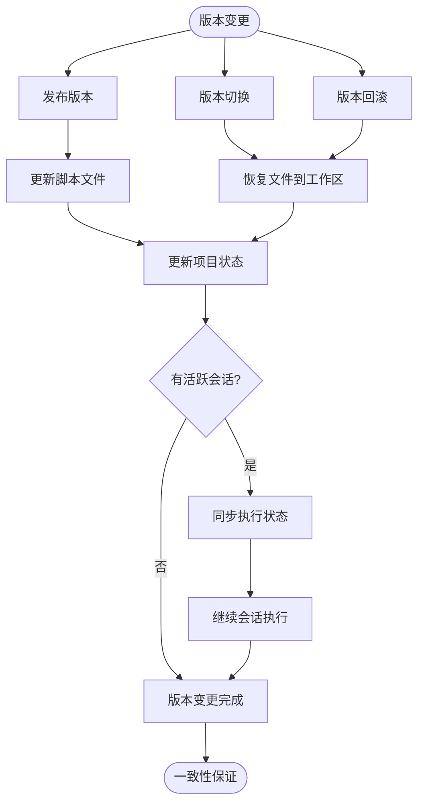
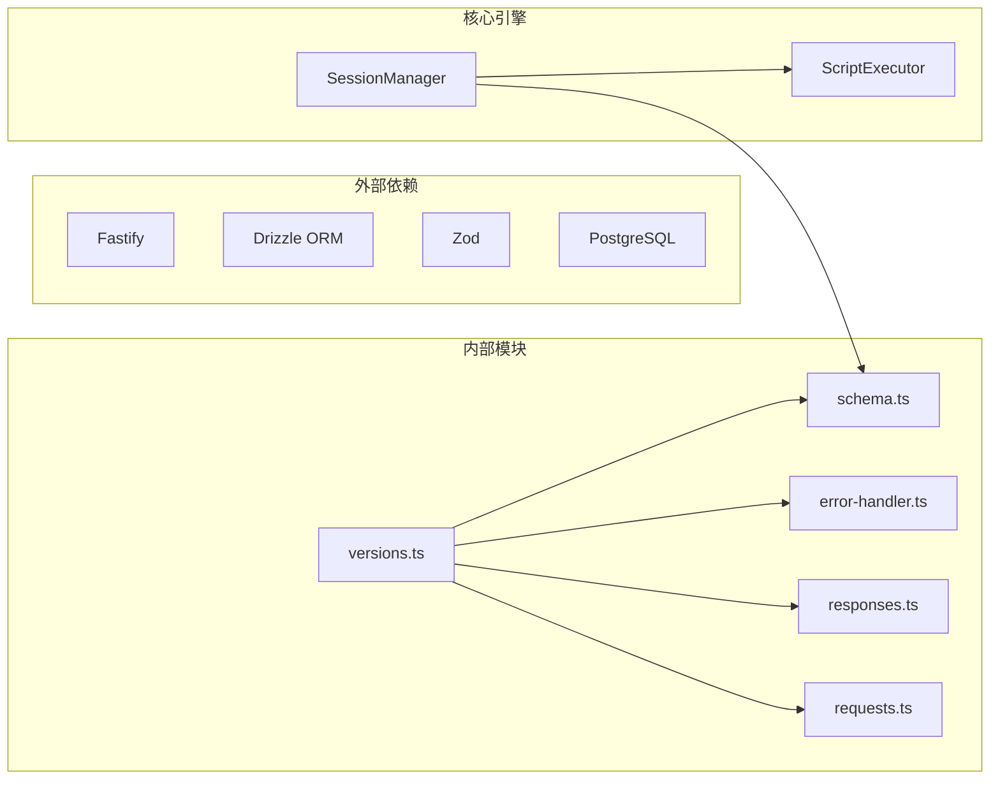
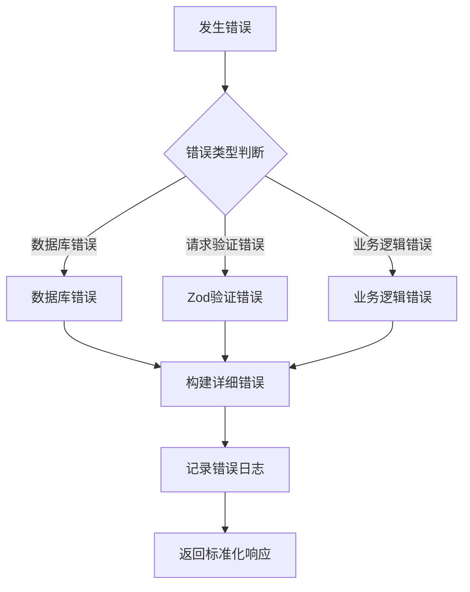

# 版本控制API

<cite>
**本文档引用的文件**
- [versions.ts](file://packages/api-server/src/routes/versions.ts)
- [schema.ts](file://packages/api-server/src/db/schema.ts)
- [app.ts](file://packages/api-server/src/app.ts)
- [session-manager.ts](file://packages/api-server/src/services/session-manager.ts)
- [responses.ts](file://packages/shared-types/src/api/responses.ts)
- [requests.ts](file://packages/shared-types/src/api/requests.ts)
- [error-handler.ts](file://packages/api-server/src/utils/error-handler.ts)
- [test-version-management.ts](file://packages/api-server/test-version-management.ts)
- [0002_snapshot.json](file://packages/api-server/drizzle/meta/0002_snapshot.json)
</cite>

## 目录
1. [简介](#简介)
2. [项目结构](#项目结构)
3. [核心组件](#核心组件)
4. [架构概览](#架构概览)
5. [详细组件分析](#详细组件分析)
6. [依赖关系分析](#依赖关系分析)
7. [性能考虑](#性能考虑)
8. [故障排除指南](#故障排除指南)
9. [结论](#结论)

## 简介

版本控制API是HeartRule AI咨询引擎的核心功能模块，负责管理脚本项目的版本生命周期。该系统提供了完整的版本创建、查询、比较、合并、回滚等核心功能，支持版本标签管理、分支管理、冲突解决等机制。

系统采用基于PostgreSQL的版本控制系统，通过草稿-发布-版本化的三层架构，确保脚本内容的一致性和可追溯性。版本控制与脚本执行紧密集成，通过一致性保证机制确保版本变更不会影响正在进行的会话执行。

**更新** 新增版本切换功能，支持在不创建回滚版本的情况下切换当前版本；增强回滚功能，支持创建标记为回滚的新版本；改进版本比较功能，支持指定目标版本进行对比。

## 项目结构

版本控制API位于`packages/api-server`包中，主要包含以下核心文件：

**图表来源**
- [versions.ts](file://packages/api-server/src/routes/versions.ts#L1-L554)
- [schema.ts](file://packages/api-server/src/db/schema.ts#L1-L223)
- [app.ts](file://packages/api-server/src/app.ts#L1-L135)

**章节来源**
- [versions.ts](file://packages/api-server/src/routes/versions.ts#L1-L554)
- [schema.ts](file://packages/api-server/src/db/schema.ts#L1-L223)
- [app.ts](file://packages/api-server/src/app.ts#L1-L135)

## 核心组件

### 数据库架构

版本控制系统基于以下核心表结构：

**图表来源**
- [schema.ts](file://packages/api-server/src/db/schema.ts#L145-L160)

**更新** 数据库schema已更新，新增`isRollback`和`rollbackFromVersionId`字段，用于标识回滚版本及其源版本。

### 版本控制流程

系统采用草稿-发布-版本化的三层架构：

1. **草稿阶段**：编辑器保存临时修改到`project_drafts`表
2. **发布阶段**：将草稿内容复制到`project_versions`表创建正式版本
3. **版本阶段**：版本内容同步到`script_files`表供执行引擎使用
4. **版本切换**：支持在不创建回滚版本的情况下切换当前版本
5. **回滚阶段**：创建标记为回滚的新版本，指向源版本

**章节来源**
- [schema.ts](file://packages/api-server/src/db/schema.ts#L145-L160)
- [versions.ts](file://packages/api-server/src/routes/versions.ts#L122-L203)

## 架构概览

版本控制API采用RESTful架构设计，通过Fastify框架提供HTTP接口：

**图表来源**
- [versions.ts](file://packages/api-server/src/routes/versions.ts#L26-L370)

**章节来源**
- [versions.ts](file://packages/api-server/src/routes/versions.ts#L26-L554)
- [app.ts](file://packages/api-server/src/app.ts#L96-L102)

## 详细组件分析

### 草稿管理接口

草稿管理提供临时存储和编辑功能，支持版本控制的前置步骤。

#### 获取草稿
- **方法**：GET `/api/projects/:id/draft`
- **功能**：获取指定项目的当前草稿
- **响应**：返回草稿文件集合和元数据
- **状态码**：200成功，404项目不存在，500服务器错误

#### 保存草稿
- **方法**：PUT `/api/projects/:id/draft`
- **请求体**：包含`draftFiles`和`updatedBy`字段
- **功能**：更新或创建项目草稿
- **响应**：返回更新后的草稿记录
- **状态码**：200成功，400请求数据无效，500服务器错误

**章节来源**
- [versions.ts](file://packages/api-server/src/routes/versions.ts#L26-L119)

### 版本发布接口

版本发布是版本控制的核心功能，将草稿转换为正式版本。

#### 发布版本
- **方法**：POST `/api/projects/:id/publish`
- **请求体**：包含`versionNumber`、`releaseNote`和`publishedBy`
- **功能**：创建新版本并更新项目状态
- **响应**：返回新创建的版本记录
- **状态码**：201成功，404项目或草稿不存在，500服务器错误

发布流程的关键步骤：
1. 验证项目存在性
2. 获取当前草稿内容
3. 从`script_files`复制文件到版本快照
4. 插入`project_versions`记录
5. 更新`projects.currentVersionId`
6. 返回新版本信息

**章节来源**
- [versions.ts](file://packages/api-server/src/routes/versions.ts#L122-L203)

### 版本查询接口

版本查询提供历史版本管理和版本信息访问功能。

#### 获取版本历史
- **方法**：GET `/api/projects/:id/versions`
- **功能**：返回项目的所有版本记录
- **响应**：按发布时间降序排列的版本数组
- **状态码**：200成功，500服务器错误

#### 获取单个版本详情
- **方法**：GET `/api/projects/:id/versions/:versionId`
- **功能**：返回指定版本的完整信息
- **响应**：版本对象包含文件快照和元数据
- **状态码**：200成功，404版本不存在，500服务器错误

**章节来源**
- [versions.ts](file://packages/api-server/src/routes/versions.ts#L206-L257)

### 版本切换接口

**新增** 版本切换功能允许在不创建回滚版本的情况下切换当前版本。

#### 切换当前版本
- **方法**：PUT `/api/projects/:id/current-version`
- **请求体**：包含`versionId`字段
- **功能**：将目标版本的文件快照恢复到工作区并更新项目状态
- **响应**：返回切换结果，包含旧版本ID、新版本ID和更新时间
- **状态码**：200成功，400请求数据无效，404目标版本不存在，500服务器错误

版本切换流程的关键步骤：
1. 验证项目存在性
2. 验证目标版本存在且属于该项目
3. 获取目标版本的文件快照
4. 恢复文件到工作区（删除不存在的文件，更新现有文件，恢复删除的文件）
5. 更新`projects.currentVersionId`
6. 返回切换结果

**章节来源**
- [versions.ts](file://packages/api-server/src/routes/versions.ts#L373-L481)

### 版本回滚接口

回滚功能允许将项目恢复到之前的版本状态。

#### 回滚到指定版本
- **方法**：POST `/api/projects/:id/rollback`
- **请求体**：包含`targetVersionId`和`publishedBy`
- **功能**：将项目文件恢复到目标版本状态
- **响应**：返回创建的新版本记录（标记为回滚）
- **状态码**：200成功，404目标版本不存在，500服务器错误

回滚流程的关键步骤：
1. 验证目标版本存在性
2. 将版本文件内容恢复到`script_files`
3. 创建新的版本记录（标记为回滚）
4. 更新`projects.currentVersionId`

**章节来源**
- [versions.ts](file://packages/api-server/src/routes/versions.ts#L259-L370)

### 版本比较接口

版本比较功能提供差异分析和变更追踪。

#### 对比两个版本
- **方法**：GET `/api/projects/:id/versions/:versionId/diff`
- **查询参数**：`compareWith`（可选，目标版本ID）
- **功能**：比较两个版本之间的差异
- **响应**：包含版本信息和差异对象
- **状态码**：200成功，404版本不存在，500服务器错误

默认行为：如果没有指定`compareWith`参数，则与前一个版本进行比较。

**更新** 版本比较接口现已支持指定目标版本进行对比，增强了版本管理的灵活性。

**章节来源**
- [versions.ts](file://packages/api-server/src/routes/versions.ts#L483-L550)

### 与脚本执行的关系

版本控制与脚本执行引擎通过以下机制保持一致性：

**图表来源**
- [session-manager.ts](file://packages/api-server/src/services/session-manager.ts#L124-L255)

**章节来源**
- [session-manager.ts](file://packages/api-server/src/services/session-manager.ts#L1-L479)

## 依赖关系分析

版本控制API的依赖关系如下：

**图表来源**
- [versions.ts](file://packages/api-server/src/routes/versions.ts#L1-L6)
- [session-manager.ts](file://packages/api-server/src/services/session-manager.ts#L7-L16)

**章节来源**
- [versions.ts](file://packages/api-server/src/routes/versions.ts#L1-L6)
- [session-manager.ts](file://packages/api-server/src/services/session-manager.ts#L7-L16)

## 性能考虑

### 数据库优化

1. **索引策略**：
   - `project_versions.published_at`：按发布时间排序查询
   - `project_versions.project_id`：按项目过滤查询
   - `script_files.project_id`：按项目关联查询
   - **新增** `project_versions.is_rollback`：按回滚标记过滤查询

2. **查询优化**：
   - 使用`LIMIT`限制版本历史数量
   - 批量操作减少数据库往返
   - 合理使用事务保证数据一致性
   - **新增** 使用`inArray`优化批量删除操作

### 缓存策略

1. **版本缓存**：最近使用的版本可以缓存到内存
2. **草稿缓存**：活跃编辑器的草稿可以缓存
3. **元数据缓存**：版本统计和项目状态可以缓存

### 并发控制

1. **乐观锁**：使用版本号防止并发更新冲突
2. **事务隔离**：关键操作使用数据库事务
3. **队列处理**：高并发场景下使用消息队列

## 故障排除指南

### 常见错误类型

系统使用统一的错误处理机制，支持多种错误类型：

| 错误类型 | 状态码 | 描述 | 建议解决方案 |
|---------|--------|------|-------------|
| 400 | 请求数据无效 | Zod验证失败 | 检查请求格式和必填字段 |
| 404 | 资源不存在 | 项目、版本、草稿不存在 | 确认ID正确性和资源存在性 |
| 500 | 服务器内部错误 | 数据库操作失败 | 检查数据库连接和权限 |
| 503 | 服务不可用 | 依赖服务暂时不可用 | 重试请求或检查服务状态 |

### 错误处理机制

**图表来源**
- [error-handler.ts](file://packages/api-server/src/utils/error-handler.ts#L76-L181)

**章节来源**
- [error-handler.ts](file://packages/api-server/src/utils/error-handler.ts#L1-L233)

### 调试建议

1. **启用详细日志**：设置`LOG_LEVEL=debug`
2. **检查数据库连接**：确认PostgreSQL服务正常运行
3. **验证权限配置**：确保数据库用户具有必要权限
4. **监控资源使用**：关注内存和CPU使用情况
5. **使用测试脚本**：参考`test-version-management.ts`进行功能验证

**章节来源**
- [test-version-management.ts](file://packages/api-server/test-version-management.ts#L1-L156)

## 结论

版本控制API为HeartRule AI咨询引擎提供了完整的脚本版本管理解决方案。通过草稿-发布-版本化的三层架构，系统实现了版本的完整生命周期管理，包括版本创建、查询、比较、合并、回滚等核心功能。

**更新** 新版本功能显著增强了版本管理能力：
- **版本切换**：支持在不创建回滚版本的情况下切换当前版本
- **增强回滚**：创建标记为回滚的新版本，保留源版本信息
- **改进比较**：支持指定目标版本进行对比分析
- **数据库增强**：新增回滚标记和源版本跟踪字段

系统的主要优势包括：

1. **一致性保证**：版本变更与脚本执行引擎无缝集成
2. **可追溯性**：完整的版本历史和变更记录，包括回滚版本
3. **性能优化**：合理的数据库设计和查询优化
4. **错误处理**：统一的错误处理和恢复机制
5. **扩展性**：模块化的架构设计支持功能扩展
6. **灵活性**：支持多种版本管理策略（发布、切换、回滚）

未来可以考虑的功能增强包括：
- 自动合并算法的实现
- 冲突检测和解决机制
- 版本锁定和权限控制
- 备份和恢复策略
- 更丰富的版本比较功能
- 分支管理功能

**章节来源**
- [versions.ts](file://packages/api-server/src/routes/versions.ts#L1-L554)
- [schema.ts](file://packages/api-server/src/db/schema.ts#L1-L223)
- [test-version-management.ts](file://packages/api-server/test-version-management.ts#L1-L156)