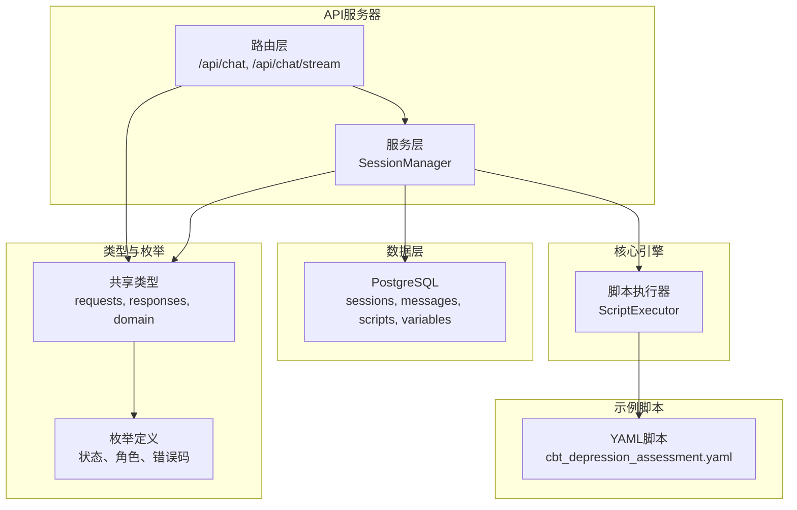
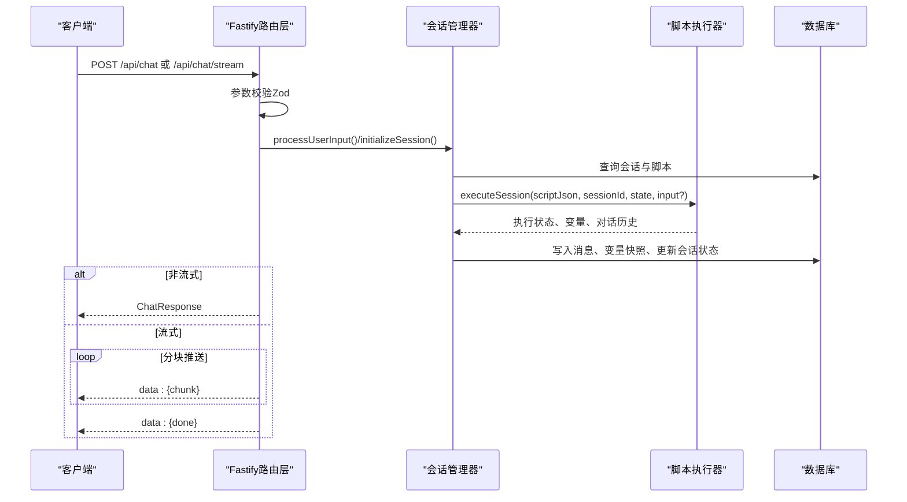
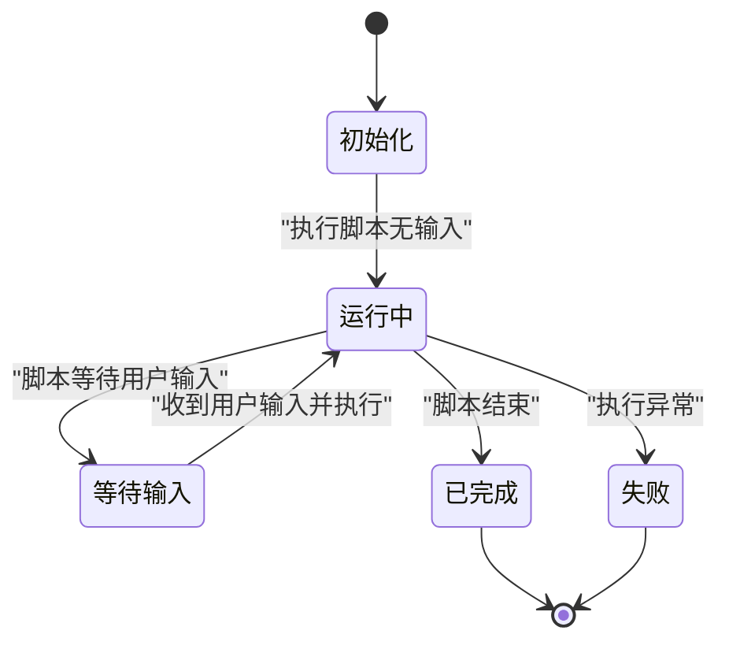
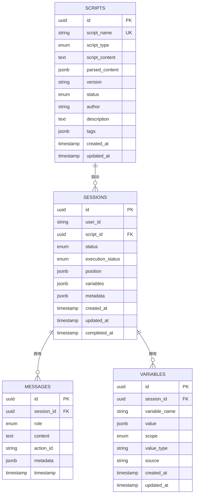
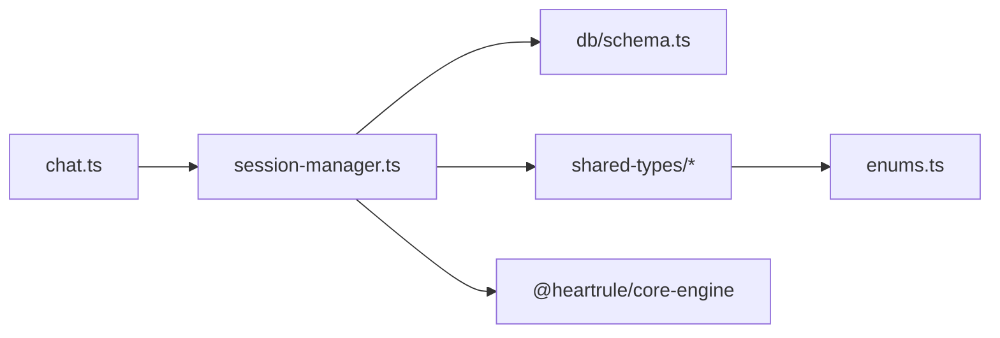

# 聊天交互API

<cite>
**本文档引用的文件**
- [packages/api-server/src/routes/chat.ts](file://packages/api-server/src/routes/chat.ts)
- [packages/api-server/src/services/session-manager.ts](file://packages/api-server/src/services/session-manager.ts)
- [packages/api-server/src/db/schema.ts](file://packages/api-server/src/db/schema.ts)
- [packages/shared-types/src/api/requests.ts](file://packages/shared-types/src/api/requests.ts)
- [packages/shared-types/src/api/responses.ts](file://packages/shared-types/src/api/responses.ts)
- [packages/shared-types/src/domain/message.ts](file://packages/shared-types/src/domain/message.ts)
- [packages/shared-types/src/domain/session.ts](file://packages/shared-types/src/domain/session.ts)
- [packages/shared-types/src/enums.ts](file://packages/shared-types/src/enums.ts)
- [packages/core-engine/src/domain/message.ts](file://packages/core-engine/src/domain/message.ts)
- [packages/core-engine/src/domain/session.ts](file://packages/core-engine/src/domain/session.ts)
- [scripts/sessions/cbt_depression_assessment.yaml](file://scripts/sessions/cbt_depression_assessment.yaml)
- [packages/api-server/test-api.ps1](file://packages/api-server/test-api.ps1)
</cite>

## 目录
1. [简介](#简介)
2. [项目结构](#项目结构)
3. [核心组件](#核心组件)
4. [架构总览](#架构总览)
5. [详细组件分析](#详细组件分析)
6. [依赖关系分析](#依赖关系分析)
7. [性能考虑](#性能考虑)
8. [故障排除指南](#故障排除指南)
9. [结论](#结论)
10. [附录](#附录)

## 简介
本文件为聊天交互API的完整接口文档，覆盖以下能力：
- 非流式消息发送与响应
- 流式消息（Server-Sent Events）发送与响应
- 聊天会话生命周期管理（创建、初始化、执行、状态更新）
- 消息历史持久化与查询
- AI响应生成与变量抽取
- 错误码与错误上下文
- 实际使用示例与最佳实践

该系统以Fastify为基础构建，结合会话管理器与脚本执行引擎，通过YAML脚本驱动对话流程，支持“AI说”“AI问”“AI思考”等动作类型，并将会话状态、变量与消息持久化至PostgreSQL数据库。

## 项目结构
聊天相关模块主要分布在以下位置：
- API路由层：负责HTTP端点、请求校验与响应封装
- 服务层：会话管理器负责脚本执行、状态恢复与持久化
- 数据层：Drizzle ORM定义的数据库Schema
- 类型层：共享类型定义与Zod校验
- 示例脚本：演示会话流程与动作配置

图表来源
- [packages/api-server/src/routes/chat.ts](file://packages/api-server/src/routes/chat.ts#L15-L151)
- [packages/api-server/src/services/session-manager.ts](file://packages/api-server/src/services/session-manager.ts#L21-L461)
- [packages/api-server/src/db/schema.ts](file://packages/api-server/src/db/schema.ts#L22-L58)
- [packages/shared-types/src/api/requests.ts](file://packages/shared-types/src/api/requests.ts#L1-L51)
- [packages/shared-types/src/api/responses.ts](file://packages/shared-types/src/api/responses.ts#L1-L166)
- [packages/shared-types/src/enums.ts](file://packages/shared-types/src/enums.ts#L1-L118)
- [scripts/sessions/cbt_depression_assessment.yaml](file://scripts/sessions/cbt_depression_assessment.yaml#L1-L166)

章节来源
- [packages/api-server/src/routes/chat.ts](file://packages/api-server/src/routes/chat.ts#L15-L151)
- [packages/api-server/src/services/session-manager.ts](file://packages/api-server/src/services/session-manager.ts#L21-L461)
- [packages/api-server/src/db/schema.ts](file://packages/api-server/src/db/schema.ts#L22-L58)
- [packages/shared-types/src/api/requests.ts](file://packages/shared-types/src/api/requests.ts#L1-L51)
- [packages/shared-types/src/api/responses.ts](file://packages/shared-types/src/api/responses.ts#L1-L166)
- [packages/shared-types/src/enums.ts](file://packages/shared-types/src/enums.ts#L1-L118)
- [scripts/sessions/cbt_depression_assessment.yaml](file://scripts/sessions/cbt_depression_assessment.yaml#L1-L166)

## 核心组件
- 路由层（Fastify）
  - 非流式聊天：POST /api/chat
  - 流式聊天：POST /api/chat/stream
- 会话管理器（SessionManager）
  - 初始化会话与首次AI消息生成
  - 处理用户输入并驱动脚本执行
  - 持久化消息、变量与会话状态
- 数据层（Drizzle ORM）
  - 会话表、消息表、脚本表、变量表
- 类型与校验（共享类型）
  - 请求/响应结构、枚举、Zod Schema
- 脚本引擎（核心引擎）
  - 基于YAML脚本的动作执行与状态推进

章节来源
- [packages/api-server/src/routes/chat.ts](file://packages/api-server/src/routes/chat.ts#L15-L151)
- [packages/api-server/src/services/session-manager.ts](file://packages/api-server/src/services/session-manager.ts#L21-L461)
- [packages/api-server/src/db/schema.ts](file://packages/api-server/src/db/schema.ts#L22-L58)
- [packages/shared-types/src/api/requests.ts](file://packages/shared-types/src/api/requests.ts#L1-L51)
- [packages/shared-types/src/api/responses.ts](file://packages/shared-types/src/api/responses.ts#L1-L166)

## 架构总览
下图展示从客户端到数据库的完整调用链路，以及会话管理器与脚本执行器的协作关系。

图表来源
- [packages/api-server/src/routes/chat.ts](file://packages/api-server/src/routes/chat.ts#L17-L150)
- [packages/api-server/src/services/session-manager.ts](file://packages/api-server/src/services/session-manager.ts#L258-L460)
- [packages/api-server/src/db/schema.ts](file://packages/api-server/src/db/schema.ts#L22-L58)

## 详细组件分析

### 非流式聊天接口（POST /api/chat）
- 功能概述
  - 将用户消息提交至指定会话，返回一次性AI回复与会话状态
- 请求参数
  - sessionId: UUID，目标会话标识
  - message: 非空字符串，用户输入内容
- 成功响应
  - aiMessage: 字符串，AI生成的回复
  - sessionStatus: 字符串，会话状态
  - executionStatus: 字符串，执行状态
  - extractedVariables: 可选对象，从用户输入中抽取的变量
  - variables: 可选对象，当前会话变量快照
  - position: 可选对象，当前执行位置（含索引与ID）
- 错误处理
  - 会话不存在：404，返回错误信息
  - 服务器内部错误：500，返回错误详情
- 实际使用示例
  - 参考PowerShell测试脚本中的调用方式

章节来源
- [packages/api-server/src/routes/chat.ts](file://packages/api-server/src/routes/chat.ts#L17-L79)
- [packages/shared-types/src/api/responses.ts](file://packages/shared-types/src/api/responses.ts#L134-L150)
- [packages/shared-types/src/api/requests.ts](file://packages/shared-types/src/api/requests.ts#L21-L29)
- [packages/api-server/test-api.ps1](file://packages/api-server/test-api.ps1#L39-L57)

### 流式聊天接口（POST /api/chat/stream）
- 功能概述
  - 以Server-Sent Events形式分块推送AI回复，适合实时交互体验
- 请求参数
  - sessionId: UUID，目标会话标识
  - message: 非空字符串，用户输入内容
- 响应格式
  - Content-Type: text/event-stream
  - 分块数据：每块包含一个JSON对象，例如 { "chunk": "字符" }
  - 结束标记：{ "done": true }
  - 错误时：{ "error": "错误信息" }
- 实现要点
  - 保存用户消息后，逐字符或分片推送
  - 当前实现为模拟流式输出，后续可替换为真实LLM流式输出
- 错误处理
  - 会话不存在：404
  - 异常时向客户端发送错误事件并结束连接

章节来源
- [packages/api-server/src/routes/chat.ts](file://packages/api-server/src/routes/chat.ts#L82-L150)

### 会话生命周期管理
- 初始化会话
  - 触发时机：会话创建后首次进入
  - 行为：解析脚本、执行初始化、生成并持久化初始AI消息、记录变量快照、更新会话状态
- 处理用户输入
  - 行为：保存用户消息、恢复执行状态、执行脚本、持久化新增AI消息、记录变量快照、更新会话状态
- 会话状态与位置
  - 状态：active/paused/completed/failed
  - 执行状态：running/waiting_input/paused/completed/error
  - 位置：包含phase/topic/action索引与ID，便于前端导航

图表来源
- [packages/api-server/src/services/session-manager.ts](file://packages/api-server/src/services/session-manager.ts#L73-L253)
- [packages/api-server/src/services/session-manager.ts](file://packages/api-server/src/services/session-manager.ts#L258-L460)
- [packages/shared-types/src/enums.ts](file://packages/shared-types/src/enums.ts#L6-L22)

章节来源
- [packages/api-server/src/services/session-manager.ts](file://packages/api-server/src/services/session-manager.ts#L73-L253)
- [packages/api-server/src/services/session-manager.ts](file://packages/api-server/src/services/session-manager.ts#L258-L460)
- [packages/shared-types/src/enums.ts](file://packages/shared-types/src/enums.ts#L6-L22)

### 消息历史与变量管理
- 消息持久化
  - 用户消息与AI消息均保存至messages表，包含角色、内容、时间戳与关联动作ID
- 变量快照
  - 仅在变量发生变化时写入variables表，包含变量名、值、类型、作用域与来源
- 会话状态更新
  - 每次执行后更新position、variables、executionStatus、metadata与updatedAt

章节来源
- [packages/api-server/src/services/session-manager.ts](file://packages/api-server/src/services/session-manager.ts#L163-L199)
- [packages/api-server/src/services/session-manager.ts](file://packages/api-server/src/services/session-manager.ts#L365-L418)
- [packages/api-server/src/db/schema.ts](file://packages/api-server/src/db/schema.ts#L45-L58)
- [packages/api-server/src/db/schema.ts](file://packages/api-server/src/db/schema.ts#L161-L176)

### 数据模型与关系

图表来源
- [packages/api-server/src/db/schema.ts](file://packages/api-server/src/db/schema.ts#L22-L58)
- [packages/api-server/src/db/schema.ts](file://packages/api-server/src/db/schema.ts#L63-L81)
- [packages/api-server/src/db/schema.ts](file://packages/api-server/src/db/schema.ts#L161-L176)

## 依赖关系分析
- 组件耦合
  - 路由层依赖会话管理器；会话管理器依赖脚本执行器与数据库
  - 共享类型提供统一的请求/响应与枚举定义，降低耦合
- 外部依赖
  - Drizzle ORM用于PostgreSQL访问
  - YAML解析用于脚本内容转换
  - Fastify用于HTTP路由与SSE

图表来源
- [packages/api-server/src/routes/chat.ts](file://packages/api-server/src/routes/chat.ts#L1-L10)
- [packages/api-server/src/services/session-manager.ts](file://packages/api-server/src/services/session-manager.ts#L1-L26)
- [packages/api-server/src/db/schema.ts](file://packages/api-server/src/db/schema.ts#L1-L219)
- [packages/shared-types/src/enums.ts](file://packages/shared-types/src/enums.ts#L1-L118)

章节来源
- [packages/api-server/src/routes/chat.ts](file://packages/api-server/src/routes/chat.ts#L1-L10)
- [packages/api-server/src/services/session-manager.ts](file://packages/api-server/src/services/session-manager.ts#L1-L26)
- [packages/api-server/src/db/schema.ts](file://packages/api-server/src/db/schema.ts#L1-L219)
- [packages/shared-types/src/enums.ts](file://packages/shared-types/src/enums.ts#L1-L118)

## 性能考虑
- 数据库写入批量化
  - 会话初始化与每次处理用户输入时，批量插入AI消息与变量快照，减少事务开销
- 索引优化
  - 会话与消息表的关键字段已建立索引，提升查询效率
- SSE流式输出
  - 当前为模拟实现，建议替换为真实LLM流式输出，避免阻塞主线程
- 缓存与去重
  - 变量快照仅在值变化时写入，避免冗余存储

章节来源
- [packages/api-server/src/services/session-manager.ts](file://packages/api-server/src/services/session-manager.ts#L163-L199)
- [packages/api-server/src/services/session-manager.ts](file://packages/api-server/src/services/session-manager.ts#L365-L418)
- [packages/api-server/src/db/schema.ts](file://packages/api-server/src/db/schema.ts#L34-L58)

## 故障排除指南
- 常见错误码
  - SCRIPT_NOT_FOUND：脚本未找到
  - SESSION_NOT_FOUND：会话未找到
  - SESSION_EXECUTION_ERROR：会话执行错误
  - ACTION_EXECUTION_ERROR：动作执行错误
  - LLM_SERVICE_ERROR：大模型服务错误
  - VARIABLE_EXTRACTION_ERROR：变量抽取错误
  - DATABASE_ERROR：数据库错误
  - INTERNAL_SERVER_ERROR：内部服务器错误
- 错误上下文
  - 包含脚本ID/名称、会话ID、执行位置与时间戳，便于定位问题
- 建议排查步骤
  - 确认会话ID有效且存在
  - 检查脚本是否正确导入且可解析
  - 查看会话执行状态与位置，确认是否处于等待输入状态
  - 检查网络与SSE连接状态（流式接口）

章节来源
- [packages/shared-types/src/enums.ts](file://packages/shared-types/src/enums.ts#L94-L105)
- [packages/shared-types/src/api/responses.ts](file://packages/shared-types/src/api/responses.ts#L68-L84)

## 结论
本聊天交互API通过清晰的路由层、健壮的会话管理器与完善的类型体系，实现了从消息收发到脚本驱动的完整闭环。非流式接口适用于简单集成，流式接口提供更好的用户体验。配合脚本化的动作编排与变量抽取，系统具备良好的可扩展性与可维护性。

## 附录

### 接口清单与规范

- 非流式聊天
  - 方法与路径：POST /api/chat
  - 请求体
    - sessionId: UUID
    - message: 非空字符串
  - 成功响应
    - aiMessage: 字符串
    - sessionStatus: 字符串
    - executionStatus: 字符串
    - extractedVariables: 对象（可选）
    - variables: 对象（可选）
    - position: 对象（可选）
  - 错误
    - 404：会话不存在
    - 500：服务器内部错误

- 流式聊天（SSE）
  - 方法与路径：POST /api/chat/stream
  - 请求体
    - sessionId: UUID
    - message: 非空字符串
  - 响应
    - Content-Type: text/event-stream
    - 分块：data: {"chunk":"字符"}
    - 结束：data: {"done":true}
    - 错误：data: {"error":"错误信息"}

章节来源
- [packages/api-server/src/routes/chat.ts](file://packages/api-server/src/routes/chat.ts#L17-L150)
- [packages/shared-types/src/api/responses.ts](file://packages/shared-types/src/api/responses.ts#L134-L150)
- [packages/shared-types/src/api/requests.ts](file://packages/shared-types/src/api/requests.ts#L21-L29)

### WebSocket与实时交互协议说明
- 当前实现
  - 使用Server-Sent Events（SSE）进行流式推送
  - 未提供WebSocket端点
- 建议
  - 若需双向实时交互，可在现有路由层基础上增加WebSocket端点，复用会话管理器逻辑
  - 保持消息格式与事件类型一致，确保前后端兼容

章节来源
- [packages/api-server/src/routes/chat.ts](file://packages/api-server/src/routes/chat.ts#L82-L150)

### 聊天状态同步机制
- 会话状态
  - 通过枚举定义：active/paused/completed/failed
  - 执行状态：running/waiting_input/paused/completed/error
- 位置同步
  - position包含phaseIndex/topicIndex/actionIndex与对应ID，便于前端定位与导航
- 变量同步
  - 变量变更时写入快照，保证状态可追溯

章节来源
- [packages/shared-types/src/enums.ts](file://packages/shared-types/src/enums.ts#L6-L22)
- [packages/shared-types/src/api/responses.ts](file://packages/shared-types/src/api/responses.ts#L11-L29)
- [packages/api-server/src/services/session-manager.ts](file://packages/api-server/src/services/session-manager.ts#L420-L434)

### 示例脚本与动作类型
- 示例脚本
  - cbt_depression_assessment.yaml：演示“建立关系—问题评估—总结与计划”的三阶段流程
- 动作类型
  - ai_say：AI主动发言
  - ai_ask：向用户提问并抽取变量
  - ai_think：内部思考与变量生成
- 配置要点
  - target_variable：变量名
  - question_template/content_template：提示词模板
  - extraction_prompt：抽取提示
  - max_rounds：最大轮数
  - require_acknowledgment：是否需要确认

章节来源
- [scripts/sessions/cbt_depression_assessment.yaml](file://scripts/sessions/cbt_depression_assessment.yaml#L1-L166)

### 实际使用示例
- PowerShell测试脚本
  - 创建会话
  - 发送消息（姓名）
  - 发送消息（年龄）
  - 输出AI回复与变量

章节来源
- [packages/api-server/test-api.ps1](file://packages/api-server/test-api.ps1#L13-L82)