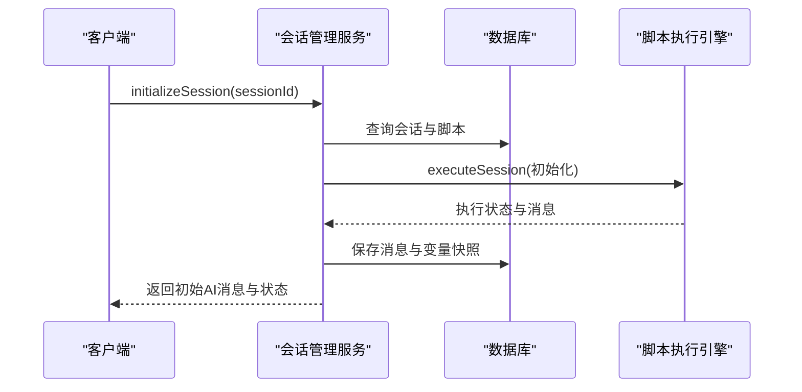

# 脚本管理API

<cite>
**本文档引用的文件**
- [scripts.ts](file://packages/api-server/src/routes/scripts.ts)
- [versions.ts](file://packages/api-server/src/routes/versions.ts)
- [session-manager.ts](file://packages/api-server/src/services/session-manager.ts)
- [schema.ts](file://packages/api-server/src/db/schema.ts)
- [requests.ts](file://packages/shared-types/src/api/requests.ts)
- [responses.ts](file://packages/shared-types/src/api/responses.ts)
- [enums.ts](file://packages/shared-types/src/enums.ts)
- [error-handler.ts](file://packages/api-server/src/utils/error-handler.ts)
- [cbt_depression_assessment.yaml](file://scripts/sessions/cbt_depression_assessment.yaml)
- [temp-script.yaml](file://packages/api-server/temp-script.yaml)
- [test-import-api.ts](file://packages/api-server/test-import-api.ts)
- [test-full-flow.ts](file://packages/api-server/test-full-flow.ts)
</cite>

## 目录
1. [简介](#简介)
2. [项目结构](#项目结构)
3. [核心组件](#核心组件)
4. [架构总览](#架构总览)
5. [详细组件分析](#详细组件分析)
6. [依赖关系分析](#依赖关系分析)
7. [性能考虑](#性能考虑)
8. [故障排除指南](#故障排除指南)
9. [结论](#结论)
10. [附录](#附录)

## 简介
本文件为脚本管理API的完整接口文档，覆盖脚本的创建、读取、更新、删除、验证、版本控制、导入导出、批量操作等能力，并详细说明脚本与会话的关联关系与执行流程。文档同时提供脚本验证规则、格式检查、错误提示机制，以及版本管理、兼容性检查、回滚机制的API规范、请求示例、响应格式与错误处理方案。

## 项目结构
脚本管理API位于后端服务包中，采用分层设计：
- 路由层：定义HTTP接口与参数校验
- 服务层：封装业务逻辑（会话管理、脚本执行）
- 数据层：数据库Schema与查询
- 类型层：共享的请求/响应与领域模型
- 工具层：错误处理与日志

图表来源
- [scripts.ts](file://packages/api-server/src/routes/scripts.ts#L1-L325)
- [versions.ts](file://packages/api-server/src/routes/versions.ts#L1-L407)
- [session-manager.ts](file://packages/api-server/src/services/session-manager.ts#L1-L462)
- [schema.ts](file://packages/api-server/src/db/schema.ts#L1-L219)
- [requests.ts](file://packages/shared-types/src/api/requests.ts#L1-L51)
- [responses.ts](file://packages/shared-types/src/api/responses.ts#L1-L166)
- [enums.ts](file://packages/shared-types/src/enums.ts#L1-L118)
- [error-handler.ts](file://packages/api-server/src/utils/error-handler.ts#L1-L233)

章节来源
- [scripts.ts](file://packages/api-server/src/routes/scripts.ts#L1-L325)
- [versions.ts](file://packages/api-server/src/routes/versions.ts#L1-L407)
- [schema.ts](file://packages/api-server/src/db/schema.ts#L1-L219)

## 核心组件
- 脚本路由模块：提供脚本的增删改查、导入、验证等接口
- 版本路由模块：提供草稿保存、发布版本、版本历史、回滚、版本对比等接口
- 会话管理服务：集成脚本执行引擎，负责会话初始化与用户输入处理
- 数据库Schema：定义脚本、会话、消息、变量、项目、版本等表结构
- 类型系统：统一的请求/响应与枚举定义，确保前后端一致性
- 错误处理：统一错误码、错误类型、恢复建议与日志记录

章节来源
- [scripts.ts](file://packages/api-server/src/routes/scripts.ts#L12-L325)
- [versions.ts](file://packages/api-server/src/routes/versions.ts#L20-L407)
- [session-manager.ts](file://packages/api-server/src/services/session-manager.ts#L21-L462)
- [schema.ts](file://packages/api-server/src/db/schema.ts#L63-L156)
- [requests.ts](file://packages/shared-types/src/api/requests.ts#L34-L50)
- [responses.ts](file://packages/shared-types/src/api/responses.ts#L162-L166)
- [enums.ts](file://packages/shared-types/src/enums.ts#L36-L49)
- [error-handler.ts](file://packages/api-server/src/utils/error-handler.ts#L22-L181)

## 架构总览
脚本管理API围绕“脚本-会话”关系展开，会话管理服务通过脚本内容驱动对话流程，数据库持久化会话状态、消息与变量快照。

图表来源
- [scripts.ts](file://packages/api-server/src/routes/scripts.ts#L14-L85)
- [versions.ts](file://packages/api-server/src/routes/versions.ts#L118-L199)
- [session-manager.ts](file://packages/api-server/src/services/session-manager.ts#L73-L253)
- [schema.ts](file://packages/api-server/src/db/schema.ts#L22-L81)

## 详细组件分析

### 脚本管理接口

#### 1) 创建脚本
- 方法与路径：POST /api/scripts
- 功能：创建新的YAML脚本，自动解析YAML并保存解析结果
- 请求体参数：
  - scriptName: 字符串，必填
  - scriptType: 字符串，必填（枚举：session/technique/awareness）
  - scriptContent: 字符串，必填（YAML内容）
  - author: 字符串，必填
  - description: 字符串，可选
  - tags: 数组，可选
- 成功响应：返回脚本对象（包含解析后的parsedContent、版本、状态等）
- 错误处理：
  - YAML解析失败时记录警告并继续保存
  - 数据库异常返回500

章节来源
- [scripts.ts](file://packages/api-server/src/routes/scripts.ts#L14-L85)
- [requests.ts](file://packages/shared-types/src/api/requests.ts#L34-L50)
- [enums.ts](file://packages/shared-types/src/enums.ts#L36-L40)

#### 2) 获取脚本详情
- 方法与路径：GET /api/scripts/:id
- 参数：id（UUID）
- 成功响应：返回脚本对象
- 错误处理：脚本不存在返回404

章节来源
- [scripts.ts](file://packages/api-server/src/routes/scripts.ts#L88-L125)

#### 3) 列出脚本
- 方法与路径：GET /api/scripts
- 查询参数：
  - type: 枚举（session/technique/awareness），可选
  - status: 枚举（draft/published/archived），可选
- 成功响应：返回scripts数组与total计数
- 注意：当前实现未完全实现type/status过滤，预留扩展点

章节来源
- [scripts.ts](file://packages/api-server/src/routes/scripts.ts#L128-L169)

#### 4) 导入脚本（调试）
- 方法与路径：POST /api/scripts/import
- 功能：导入YAML脚本内容到数据库（调试用途），若同名脚本存在则更新
- 请求体参数：
  - yamlContent: 字符串，必填
  - scriptName: 字符串，必填
  - description: 字符串，可选
- 成功响应：返回success与data（包含scriptId）
- 错误处理：导入失败返回500

章节来源
- [scripts.ts](file://packages/api-server/src/routes/scripts.ts#L172-L278)
- [test-import-api.ts](file://packages/api-server/test-import-api.ts#L49-L118)

#### 5) 验证脚本
- 方法与路径：POST /api/scripts/:id/validate
- 功能：验证YAML脚本的正确性（当前为占位实现，返回模拟结果）
- 成功响应：返回{ valid, message }
- 错误处理：脚本不存在返回404

章节来源
- [scripts.ts](file://packages/api-server/src/routes/scripts.ts#L280-L323)

#### 6) 更新脚本
- 方法与路径：PUT /api/scripts/:id
- 功能：根据id更新脚本内容与元数据
- 请求体参数：与创建脚本相同（除id外）
- 成功响应：返回更新后的脚本对象
- 错误处理：脚本不存在返回404；数据库异常返回500

章节来源
- [scripts.ts](file://packages/api-server/src/routes/scripts.ts#L1-L325)

#### 7) 删除脚本
- 方法与路径：DELETE /api/scripts/:id
- 功能：根据id删除脚本
- 成功响应：返回删除成功标志
- 错误处理：脚本不存在返回404；数据库异常返回500

章节来源
- [scripts.ts](file://packages/api-server/src/routes/scripts.ts#L1-L325)

#### 8) 脚本上传/下载/导入导出
- 上传：使用POST /api/scripts或POST /api/scripts/import
- 下载：通过GET /api/scripts/:id获取脚本内容
- 导入导出：当前提供导入接口；导出可通过前端或自定义接口实现（预留）

章节来源
- [scripts.ts](file://packages/api-server/src/routes/scripts.ts#L14-L85)
- [scripts.ts](file://packages/api-server/src/routes/scripts.ts#L172-L278)

#### 9) 批量操作
- 当前未提供专用批量接口，可通过循环调用单个接口实现批量创建/更新/删除

章节来源
- [scripts.ts](file://packages/api-server/src/routes/scripts.ts#L1-L325)

### 版本管理接口

#### 1) 获取草稿
- 方法与路径：GET /projects/:id/draft
- 成功响应：返回草稿对象
- 错误处理：项目不存在或草稿不存在返回404

章节来源
- [versions.ts](file://packages/api-server/src/routes/versions.ts#L21-L46)

#### 2) 保存草稿
- 方法与路径：PUT /projects/:id/draft
- 请求体参数：draftFiles（对象）、updatedBy（字符串）
- 成功响应：返回草稿对象
- 错误处理：参数校验失败返回400；数据库异常返回500

章节来源
- [versions.ts](file://packages/api-server/src/routes/versions.ts#L49-L115)

#### 3) 发布版本
- 方法与路径：POST /projects/:id/publish
- 请求体参数：versionNumber（字符串）、releaseNote（字符串，默认空）、publishedBy（字符串）
- 成功响应：返回新版本对象
- 错误处理：项目或草稿不存在返回404；参数校验失败返回400；数据库异常返回500

章节来源
- [versions.ts](file://packages/api-server/src/routes/versions.ts#L118-L199)

#### 4) 获取版本历史
- 方法与路径：GET /projects/:id/versions
- 成功响应：返回版本数组（按发布时间倒序）
- 错误处理：数据库异常返回500

章节来源
- [versions.ts](file://packages/api-server/src/routes/versions.ts#L202-L223)

#### 5) 获取单个版本详情
- 方法与路径：GET /projects/:id/versions/:versionId
- 成功响应：返回版本对象
- 错误处理：版本不存在返回404；数据库异常返回500

章节来源
- [versions.ts](file://packages/api-server/src/routes/versions.ts#L226-L253)

#### 6) 回滚到指定版本
- 方法与路径：POST /projects/:id/rollback
- 请求体参数：targetVersionId（字符串）、publishedBy（字符串）
- 成功响应：返回新版本对象（标记为回滚）
- 错误处理：目标版本不存在返回404；数据库异常返回500

章节来源
- [versions.ts](file://packages/api-server/src/routes/versions.ts#L256-L334)

#### 7) 对比两个版本
- 方法与路径：GET /projects/:id/versions/:versionId/diff?compareWith=:compareWith
- 功能：对比当前版本与另一个版本或前一版本的差异（当前为占位实现）
- 成功响应：返回版本、对比版本与diff结构
- 错误处理：版本不存在返回404；数据库异常返回500

章节来源
- [versions.ts](file://packages/api-server/src/routes/versions.ts#L337-L403)

### 会话与脚本执行流程

#### 1) 会话初始化
- 会话管理服务根据sessionId查询会话与脚本，解析YAML为JSON，调用脚本执行引擎进行初始化执行，保存AI消息与变量快照，更新会话状态。

图表来源
- [session-manager.ts](file://packages/api-server/src/services/session-manager.ts#L73-L253)

#### 2) 处理用户输入
- 会话管理服务恢复执行状态，解析脚本，调用脚本执行引擎处理用户输入，保存消息与变量快照，更新会话状态。

图表来源
- [session-manager.ts](file://packages/api-server/src/services/session-manager.ts#L258-L460)

#### 3) 错误处理与恢复建议
- 统一错误映射与恢复建议，支持重试与后续操作提示。

章节来源
- [error-handler.ts](file://packages/api-server/src/utils/error-handler.ts#L22-L181)
- [session-manager.ts](file://packages/api-server/src/services/session-manager.ts#L235-L252)
- [session-manager.ts](file://packages/api-server/src/services/session-manager.ts#L437-L459)

### 数据模型与关系

图表来源
- [schema.ts](file://packages/api-server/src/db/schema.ts#L63-L176)

章节来源
- [schema.ts](file://packages/api-server/src/db/schema.ts#L63-L176)

## 依赖关系分析

图表来源
- [scripts.ts](file://packages/api-server/src/routes/scripts.ts#L1-L325)
- [versions.ts](file://packages/api-server/src/routes/versions.ts#L1-L407)
- [session-manager.ts](file://packages/api-server/src/services/session-manager.ts#L1-L462)
- [schema.ts](file://packages/api-server/src/db/schema.ts#L1-L219)
- [requests.ts](file://packages/shared-types/src/api/requests.ts#L1-L51)
- [responses.ts](file://packages/shared-types/src/api/responses.ts#L1-L166)
- [enums.ts](file://packages/shared-types/src/enums.ts#L1-L118)
- [error-handler.ts](file://packages/api-server/src/utils/error-handler.ts#L1-L233)

章节来源
- [scripts.ts](file://packages/api-server/src/routes/scripts.ts#L1-L325)
- [versions.ts](file://packages/api-server/src/routes/versions.ts#L1-L407)
- [session-manager.ts](file://packages/api-server/src/services/session-manager.ts#L1-L462)
- [schema.ts](file://packages/api-server/src/db/schema.ts#L1-L219)
- [requests.ts](file://packages/shared-types/src/api/requests.ts#L1-L51)
- [responses.ts](file://packages/shared-types/src/api/responses.ts#L1-L166)
- [enums.ts](file://packages/shared-types/src/enums.ts#L1-L118)
- [error-handler.ts](file://packages/api-server/src/utils/error-handler.ts#L1-L233)

## 性能考虑
- YAML解析：在创建与导入脚本时进行解析，建议对大型脚本进行异步处理与缓存
- 数据库查询：脚本与会话查询使用索引优化（如scripts_type_status_idx、sessions_user_id_idx等）
- 批量操作：消息与变量快照采用批量插入，减少往返开销
- 错误处理：统一错误映射与恢复建议，降低重试成本

[本节为通用指导，无需特定文件来源]

## 故障排除指南
- 脚本解析失败：检查YAML语法与结构，参考示例脚本格式
- 会话不存在：确认会话ID有效且未过期
- 数据库异常：检查连接与权限，查看日志定位具体错误
- LLM服务不可用：检查网络与服务可用性，按恢复建议重试

章节来源
- [error-handler.ts](file://packages/api-server/src/utils/error-handler.ts#L22-L181)
- [session-manager.ts](file://packages/api-server/src/services/session-manager.ts#L235-L252)
- [session-manager.ts](file://packages/api-server/src/services/session-manager.ts#L437-L459)

## 结论
脚本管理API提供了完整的脚本生命周期管理与版本控制能力，并通过会话管理服务实现了脚本驱动的对话流程。接口设计遵循统一的类型系统与错误处理规范，具备良好的扩展性与可维护性。建议在生产环境中进一步完善脚本验证、版本对比与批量操作接口，并加强性能监控与日志分析。

[本节为总结，无需特定文件来源]

## 附录

### 示例脚本格式
- 示例脚本展示了会话的基本结构：metadata、session、phases、topics、actions
- 参考文件：[cbt_depression_assessment.yaml](file://scripts/sessions/cbt_depression_assessment.yaml#L1-L166)
- 临时测试脚本：[temp-script.yaml](file://packages/api-server/temp-script.yaml#L1-L27)

### API使用示例
- 导入脚本与创建会话的端到端测试：[test-import-api.ts](file://packages/api-server/test-import-api.ts#L49-L118)
- 完整会话流程测试（模拟Web端）：[test-full-flow.ts](file://packages/api-server/test-full-flow.ts#L16-L208)

### 错误码与类型
- 错误码枚举：包含脚本、会话、动作、LLM、变量、数据库等错误类型
- 错误类型：语法、配置、运行时、会话、系统
- 参考文件：[enums.ts](file://packages/shared-types/src/enums.ts#L94-L118)

### 响应与请求类型
- 请求类型：CreateScriptRequest、CreateSessionRequest、SendMessageRequest
- 响应类型：ScriptListResponse、SessionResponse、ChatResponse、ApiResponse
- 参考文件：[requests.ts](file://packages/shared-types/src/api/requests.ts#L34-L50)、[responses.ts](file://packages/shared-types/src/api/responses.ts#L162-L166)