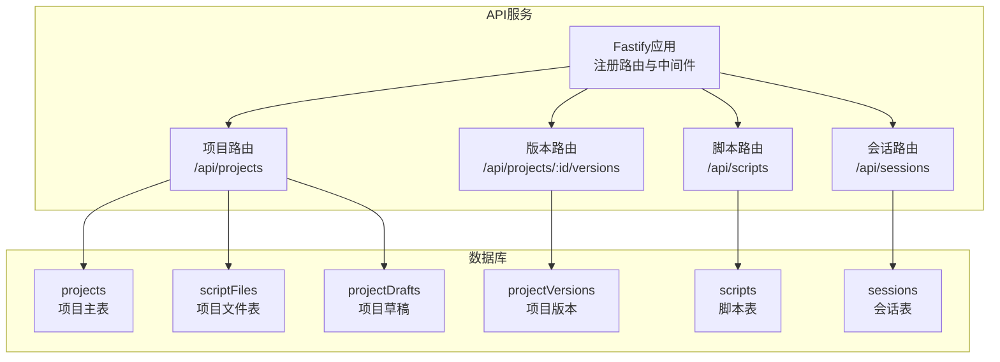
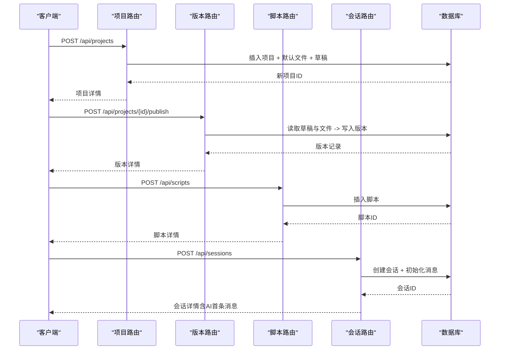
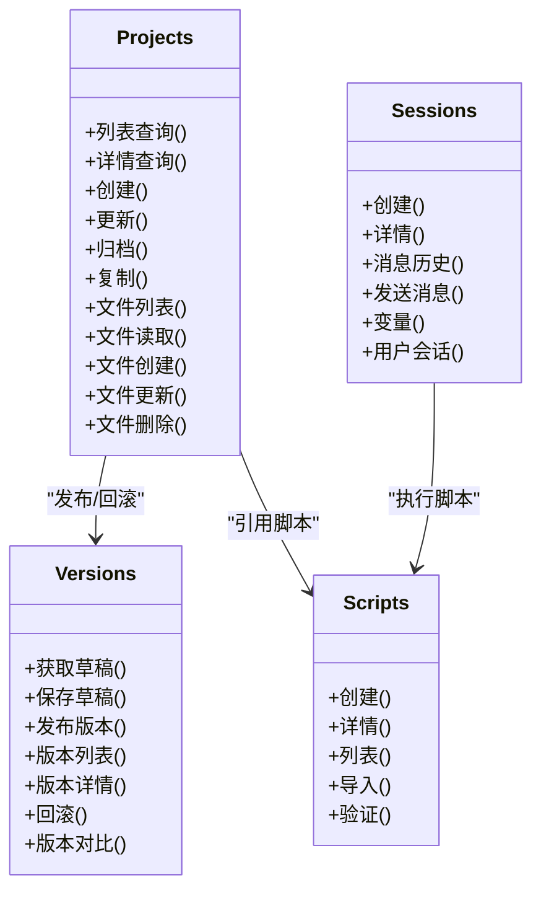
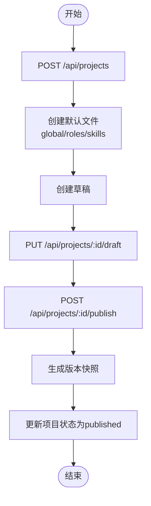
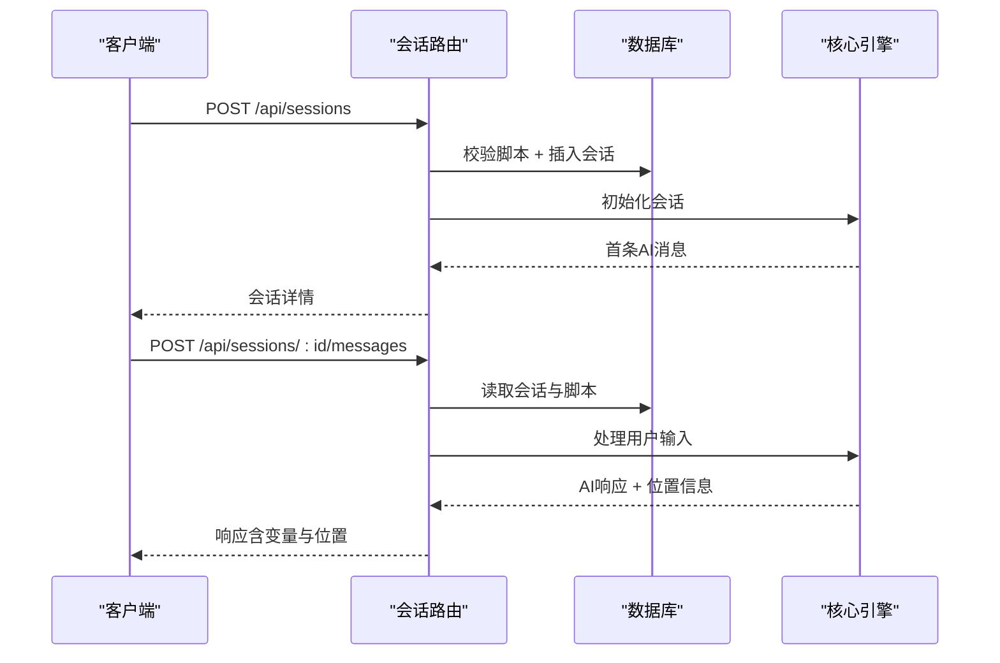

# 项目管理API

<cite>
**本文引用的文件**
- [packages/api-server/src/routes/projects.ts](file://packages/api-server/src/routes/projects.ts)
- [packages/api-server/src/routes/versions.ts](file://packages/api-server/src/routes/versions.ts)
- [packages/api-server/src/routes/scripts.ts](file://packages/api-server/src/routes/scripts.ts)
- [packages/api-server/src/routes/sessions.ts](file://packages/api-server/src/routes/sessions.ts)
- [packages/api-server/src/db/schema.ts](file://packages/api-server/src/db/schema.ts)
- [packages/api-server/src/app.ts](file://packages/api-server/src/app.ts)
- [packages/shared-types/src/api/requests.ts](file://packages/shared-types/src/api/requests.ts)
- [packages/shared-types/src/api/responses.ts](file://packages/shared-types/src/api/responses.ts)
- [packages/shared-types/src/enums.ts](file://packages/shared-types/src/enums.ts)
- [README.md](file://README.md)
- [QUICK_START_GUIDE.md](file://QUICK_START_GUIDE.md)
- [packages/api-server/test-api.ps1](file://packages/api-server/test-api.ps1)
- [packages/api-server/test-import-api.ts](file://packages/api-server/test-import-api.ts)
</cite>

## 目录
1. [简介](#简介)
2. [项目结构](#项目结构)
3. [核心组件](#核心组件)
4. [架构总览](#架构总览)
5. [详细组件分析](#详细组件分析)
6. [依赖分析](#依赖分析)
7. [性能考虑](#性能考虑)
8. [故障排查指南](#故障排查指南)
9. [结论](#结论)
10. [附录](#附录)

## 简介
本文件为“项目管理API”的完整接口文档，涵盖项目创建、编辑、归档、复制、查询、文件管理、版本控制、草稿管理、导入导出等核心能力，并解释项目与脚本、会话之间的关系与数据流转。文档同时提供请求参数、响应格式、错误码及实际使用示例，帮助开发者快速集成与调试。

## 项目结构
后端采用Fastify + Drizzle ORM + PostgreSQL，API服务位于 packages/api-server，共享类型定义位于 packages/shared-types。项目管理API主要由以下模块组成：
- 项目路由：/api/projects 及其子资源（文件、版本、草稿）
- 版本路由：/api/projects/:id/publish、/api/projects/:id/versions 等
- 脚本路由：/api/scripts（导入、校验、查询）
- 会话路由：/api/sessions（创建、消息、变量、用户会话列表）

图表来源
- [packages/api-server/src/app.ts](file://packages/api-server/src/app.ts#L91-L105)
- [packages/api-server/src/routes/projects.ts](file://packages/api-server/src/routes/projects.ts#L26-L499)
- [packages/api-server/src/routes/versions.ts](file://packages/api-server/src/routes/versions.ts#L20-L407)
- [packages/api-server/src/routes/scripts.ts](file://packages/api-server/src/routes/scripts.ts#L12-L325)
- [packages/api-server/src/routes/sessions.ts](file://packages/api-server/src/routes/sessions.ts#L13-L548)
- [packages/api-server/src/db/schema.ts](file://packages/api-server/src/db/schema.ts#L86-L156)

章节来源
- [packages/api-server/src/app.ts](file://packages/api-server/src/app.ts#L91-L105)
- [packages/api-server/src/db/schema.ts](file://packages/api-server/src/db/schema.ts#L86-L156)

## 核心组件
- 项目管理（Projects）
  - 列表查询、详情查询、创建、更新、归档、复制
  - 文件管理：文件列表、单文件读取、创建、更新、删除
  - 草稿管理：获取草稿、保存草稿
  - 版本管理：发布版本、版本列表、版本详情、回滚、版本对比
- 脚本管理（Scripts）
  - 创建脚本、获取脚本详情、列出脚本、导入脚本、验证脚本
- 会话管理（Sessions）
  - 创建会话、获取会话详情、获取消息历史、发送消息、获取会话变量、列出用户会话

章节来源
- [packages/api-server/src/routes/projects.ts](file://packages/api-server/src/routes/projects.ts#L26-L499)
- [packages/api-server/src/routes/versions.ts](file://packages/api-server/src/routes/versions.ts#L20-L407)
- [packages/api-server/src/routes/scripts.ts](file://packages/api-server/src/routes/scripts.ts#L12-L325)
- [packages/api-server/src/routes/sessions.ts](file://packages/api-server/src/routes/sessions.ts#L13-L548)

## 架构总览
项目管理API围绕“项目”为中心，通过“文件”承载脚本内容，“版本”记录变更历史，“草稿”提供临时编辑空间；与“脚本”和“会话”形成闭环：脚本定义流程，会话执行流程并产生变量与消息，项目则作为脚本与会话的容器与版本化管理单元。

图表来源
- [packages/api-server/src/routes/projects.ts](file://packages/api-server/src/routes/projects.ts#L133-L193)
- [packages/api-server/src/routes/versions.ts](file://packages/api-server/src/routes/versions.ts#L118-L199)
- [packages/api-server/src/routes/scripts.ts](file://packages/api-server/src/routes/scripts.ts#L14-L85)
- [packages/api-server/src/routes/sessions.ts](file://packages/api-server/src/routes/sessions.ts#L15-L133)

## 详细组件分析

### 项目管理（Projects）
- 列表查询
  - 方法与路径：GET /api/projects
  - 查询参数：status（draft/published/archived/all）、search（项目名或描述模糊匹配）、author（作者）
  - 响应：数组，每项包含项目信息与文件数量
  - 错误：500（数据库异常）
- 详情查询
  - 方法与路径：GET /api/projects/:id
  - 响应：项目 + 文件列表 + 草稿 + 版本历史
  - 错误：404（项目不存在）、500（数据库异常）
- 创建项目
  - 方法与路径：POST /api/projects
  - 请求体：projectName、description、engineVersion、engineVersionMin、author、tags
  - 响应：新建项目（状态默认 draft），同时创建默认文件与草稿
  - 错误：400（参数校验失败）、500（数据库异常）
- 更新项目
  - 方法与路径：PUT /api/projects/:id
  - 请求体：可选字段（projectName、description、engineVersion、engineVersionMin、tags）
  - 响应：更新后的项目
  - 错误：404（项目不存在）、400/500
- 归档项目
  - 方法与路径：DELETE /api/projects/:id
  - 响应：状态改为 archived 的项目
  - 错误：404/500
- 复制项目
  - 方法与路径：POST /api/projects/:id/copy
  - 请求体：author（可选）
  - 响应：复制的新项目（状态 draft），复制文件与草稿
  - 错误：404/500
- 文件管理
  - 列表：GET /api/projects/:id/files
  - 单文件：GET /api/projects/:id/files/:fileId
  - 创建：POST /api/projects/:id/files（fileType、fileName、fileContent）
  - 更新：PUT /api/projects/:id/files/:fileId（fileName、fileContent、yamlContent）
  - 删除：DELETE /api/projects/:id/files/:fileId

章节来源
- [packages/api-server/src/routes/projects.ts](file://packages/api-server/src/routes/projects.ts#L26-L499)

### 版本管理（Versions）
- 获取草稿：GET /api/projects/:id/draft
- 保存草稿：PUT /api/projects/:id/draft（draftFiles、updatedBy）
- 发布版本：POST /api/projects/:id/publish（versionNumber、releaseNote、publishedBy）
- 版本列表：GET /api/projects/:id/versions
- 版本详情：GET /api/projects/:id/versions/:versionId
- 回滚版本：POST /api/projects/:id/rollback（targetVersionId、publishedBy）
- 版本对比：GET /api/projects/:id/versions/:versionId/diff?compareWith=...

章节来源
- [packages/api-server/src/routes/versions.ts](file://packages/api-server/src/routes/versions.ts#L20-L407)

### 脚本管理（Scripts）
- 创建脚本：POST /api/scripts（scriptName、scriptType、scriptContent、author、description、tags）
- 获取脚本：GET /api/scripts/:id
- 列出脚本：GET /api/scripts
- 导入脚本：POST /api/scripts/import（yamlContent、scriptName、description）
- 验证脚本：POST /api/scripts/:id/validate

章节来源
- [packages/api-server/src/routes/scripts.ts](file://packages/api-server/src/routes/scripts.ts#L12-L325)

### 会话管理（Sessions）
- 创建会话：POST /api/sessions（userId、scriptId、initialVariables）
- 获取会话：GET /api/sessions/:id（包含增强的位置信息：phaseId/topicId/actionId）
- 获取消息历史：GET /api/sessions/:id/messages
- 发送消息：POST /api/sessions/:id/messages（content）
- 获取会话变量：GET /api/sessions/:id/variables
- 列出用户会话：GET /api/users/:userId/sessions

章节来源
- [packages/api-server/src/routes/sessions.ts](file://packages/api-server/src/routes/sessions.ts#L13-L548)

### 数据模型与枚举
- 项目表（projects）：包含项目元数据、状态、作者、标签、版本号等
- 项目文件表（scriptFiles）：按文件类型组织，支持JSON内容与YAML文本
- 项目草稿表（projectDrafts）：草稿文件、验证状态、更新人
- 项目版本表（projectVersions）：版本号、文件快照、发布信息、回滚标记
- 脚本表（scripts）：脚本名称唯一、类型、内容、解析结果、状态、作者、标签
- 会话表（sessions）：会话状态、执行状态、位置、变量、元数据
- 枚举：会话状态、执行状态、消息角色、脚本类型/状态、变量作用域、错误类型/代码等

章节来源
- [packages/api-server/src/db/schema.ts](file://packages/api-server/src/db/schema.ts#L86-L156)
- [packages/shared-types/src/enums.ts](file://packages/shared-types/src/enums.ts#L1-L118)

### API响应与错误规范
- 统一响应结构：success、data、error
- 详细错误结构：code、type、message、details、context、recovery
- 错误类型与代码枚举：语法、配置、运行时、会话、系统等

章节来源
- [packages/shared-types/src/api/responses.ts](file://packages/shared-types/src/api/responses.ts#L89-L166)
- [packages/shared-types/src/enums.ts](file://packages/shared-types/src/enums.ts#L83-L105)

## 依赖分析
- 项目路由依赖数据库表：projects、scriptFiles、projectDrafts、projectVersions
- 版本路由依赖项目与文件快照，发布后更新项目当前版本与状态
- 脚本路由与会话路由相互独立，但会话在创建时需要脚本存在
- 共享类型与枚举为前后端一致性的保障

图表来源
- [packages/api-server/src/routes/projects.ts](file://packages/api-server/src/routes/projects.ts#L26-L499)
- [packages/api-server/src/routes/versions.ts](file://packages/api-server/src/routes/versions.ts#L20-L407)
- [packages/api-server/src/routes/scripts.ts](file://packages/api-server/src/routes/scripts.ts#L12-L325)
- [packages/api-server/src/routes/sessions.ts](file://packages/api-server/src/routes/sessions.ts#L13-L548)

## 性能考虑
- 查询排序与索引：项目按 updatedAt 降序；会话按 createdAt 降序；各表均建立常用查询索引
- 批量操作：复制项目时一次性插入文件与草稿，减少往返
- 草稿与版本：以JSON快照存储文件内容，避免复杂JOIN
- 建议：在高并发场景下，对高频查询（如项目列表、会话列表）增加缓存层

## 故障排查指南
- 常见错误码
  - 400：请求参数校验失败（Zod校验）
  - 404：资源不存在（项目/文件/版本/会话）
  - 500：服务器内部错误（数据库异常）
- 常见问题
  - CORS：开发环境允许所有来源，生产需配置白名单
  - 数据库未连接：确认Docker服务与迁移执行
  - 端口占用：修改API_PORT或释放端口
- 调试建议
  - 使用 Swagger UI 查看接口文档与示例
  - 使用提供的测试脚本验证端到端流程

章节来源
- [packages/api-server/src/app.ts](file://packages/api-server/src/app.ts#L28-L33)
- [QUICK_START_GUIDE.md](file://QUICK_START_GUIDE.md#L225-L283)

## 结论
项目管理API提供了从项目生命周期管理到文件与版本控制的完整能力，并与脚本与会话形成闭环。通过清晰的路由划分、统一的响应与错误规范、完善的数据库模型与枚举，开发者可快速集成并扩展业务功能。

## 附录

### 接口清单与示例

- 项目管理
  - GET /api/projects?status=draft&search=CBT&author=admin
  - GET /api/projects/:id
  - POST /api/projects（请求体：projectName、description、engineVersion、engineVersionMin、author、tags）
  - PUT /api/projects/:id（可选字段：projectName、description、engineVersion、engineVersionMin、tags）
  - DELETE /api/projects/:id
  - POST /api/projects/:id/copy（请求体：author）
  - GET /api/projects/:id/files
  - GET /api/projects/:id/files/:fileId
  - POST /api/projects/:id/files（fileType、fileName、fileContent）
  - PUT /api/projects/:id/files/:fileId（fileName、fileContent、yamlContent）
  - DELETE /api/projects/:id/files/:fileId

- 版本管理
  - GET /api/projects/:id/draft
  - PUT /api/projects/:id/draft（draftFiles、updatedBy）
  - POST /api/projects/:id/publish（versionNumber、releaseNote、publishedBy）
  - GET /api/projects/:id/versions
  - GET /api/projects/:id/versions/:versionId
  - POST /api/projects/:id/rollback（targetVersionId、publishedBy）
  - GET /api/projects/:id/versions/:versionId/diff?compareWith=...

- 脚本管理
  - POST /api/scripts（scriptName、scriptType、scriptContent、author、description、tags）
  - GET /api/scripts/:id
  - GET /api/scripts
  - POST /api/scripts/import（yamlContent、scriptName、description）
  - POST /api/scripts/:id/validate

- 会话管理
  - POST /api/sessions（userId、scriptId、initialVariables）
  - GET /api/sessions/:id
  - GET /api/sessions/:id/messages
  - POST /api/sessions/:id/messages（content）
  - GET /api/sessions/:id/variables
  - GET /api/users/:userId/sessions

章节来源
- [packages/api-server/src/routes/projects.ts](file://packages/api-server/src/routes/projects.ts#L26-L499)
- [packages/api-server/src/routes/versions.ts](file://packages/api-server/src/routes/versions.ts#L20-L407)
- [packages/api-server/src/routes/scripts.ts](file://packages/api-server/src/routes/scripts.ts#L12-L325)
- [packages/api-server/src/routes/sessions.ts](file://packages/api-server/src/routes/sessions.ts#L13-L548)

### 关键流程图：创建项目与发布版本

图表来源
- [packages/api-server/src/routes/projects.ts](file://packages/api-server/src/routes/projects.ts#L133-L193)
- [packages/api-server/src/routes/versions.ts](file://packages/api-server/src/routes/versions.ts#L118-L199)

### 关键流程图：会话创建与消息交互

图表来源
- [packages/api-server/src/routes/sessions.ts](file://packages/api-server/src/routes/sessions.ts#L15-L133)
- [packages/api-server/src/routes/sessions.ts](file://packages/api-server/src/routes/sessions.ts#L403-L471)

### 实际使用示例（来自测试脚本）
- PowerShell测试脚本：创建会话、发送消息、验证响应
- TypeScript测试脚本：导入脚本、创建会话、断言结果

章节来源
- [packages/api-server/test-api.ps1](file://packages/api-server/test-api.ps1#L1-L99)
- [packages/api-server/test-import-api.ts](file://packages/api-server/test-import-api.ts#L1-L119)