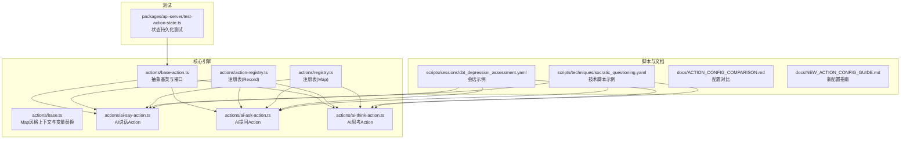
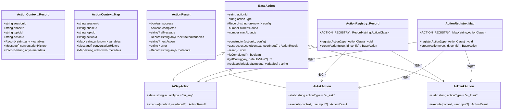
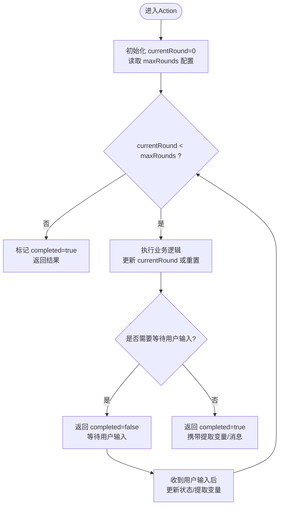
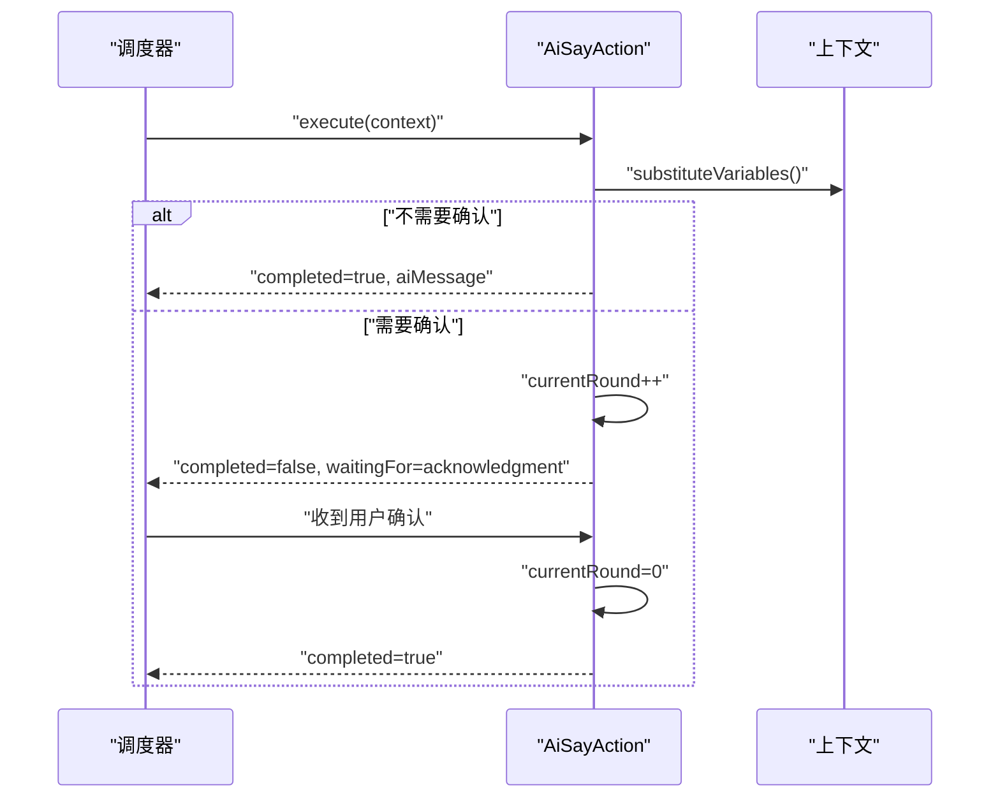
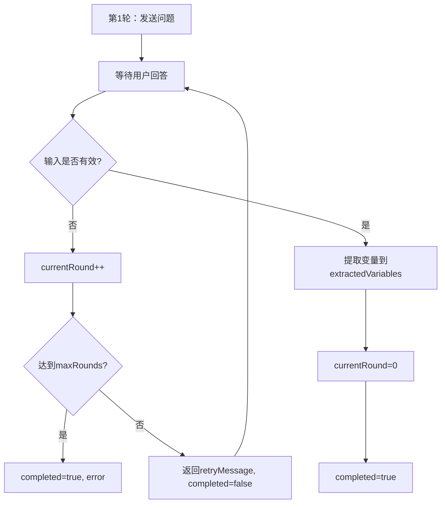
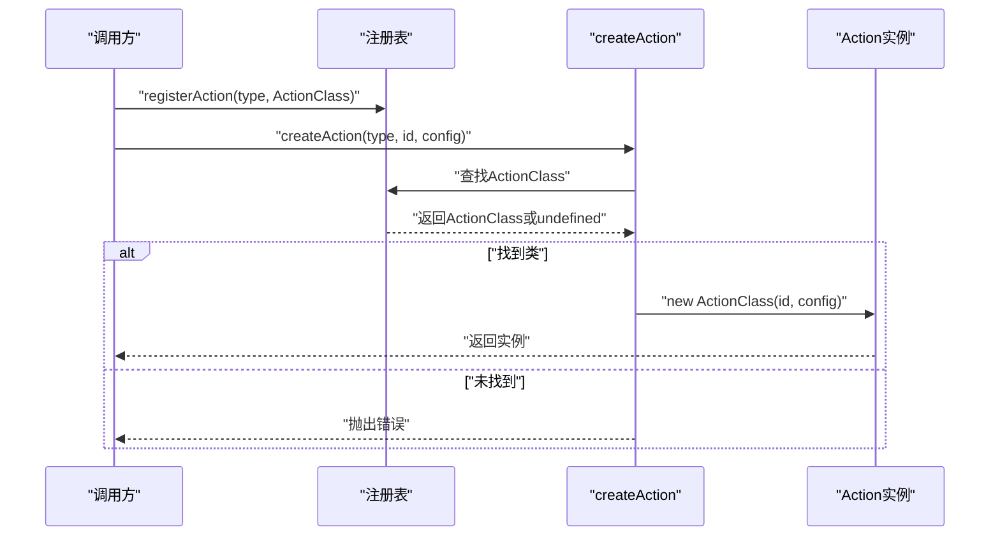
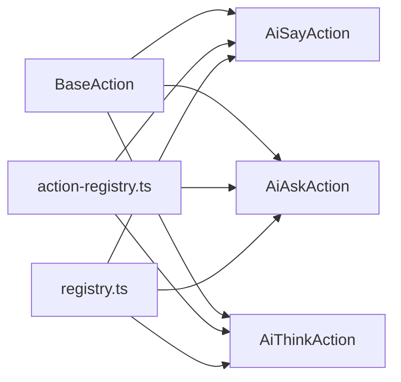

# Action基类设计

<cite>
**本文档引用的文件**
- [base-action.ts](file://packages/core-engine/src/actions/base-action.ts)
- [base.ts](file://packages/core-engine/src/actions/base.ts)
- [action-registry.ts](file://packages/core-engine/src/actions/action-registry.ts)
- [registry.ts](file://packages/core-engine/src/actions/registry.ts)
- [ai-say-action.ts](file://packages/core-engine/src/actions/ai-say-action.ts)
- [ai-ask-action.ts](file://packages/core-engine/src/actions/ai-ask-action.ts)
- [ai-think-action.ts](file://packages/core-engine/src/actions/ai-think-action.ts)
- [test-action-state.ts](file://packages/api-server/test-action-state.ts)
- [ACTION_CONFIG_COMPARISON.md](file://docs/ACTION_CONFIG_COMPARISON.md)
- [NEW_ACTION_CONFIG_GUIDE.md](file://docs/NEW_ACTION_CONFIG_GUIDE.md)
- [cbt_depression_assessment.yaml](file://scripts/sessions/cbt_depression_assessment.yaml)
- [socratic_questioning.yaml](file://scripts/techniques/socratic_questioning.yaml)
</cite>

## 目录
1. [简介](#简介)
2. [项目结构](#项目结构)
3. [核心组件](#核心组件)
4. [架构总览](#架构总览)
5. [详细组件分析](#详细组件分析)
6. [依赖分析](#依赖分析)
7. [性能考虑](#性能考虑)
8. [故障排除指南](#故障排除指南)
9. [结论](#结论)
10. [附录](#附录)

## 简介
本文件围绕Action基类设计进行系统化技术文档编写，重点阐述BaseAction抽象类的设计理念与架构原则，涵盖ActionContext上下文接口、ActionResult结果接口的设计思路；深入分析Action的生命周期管理机制（构造函数参数、状态属性currentRound与maxRounds的作用）、execute抽象方法的设计模式与实现要求；介绍Action重置机制、完成状态判断、变量获取与模板替换等核心功能，并提供正确的继承示例路径与最佳实践建议。

## 项目结构
Action体系位于核心引擎包中，采用按职责分层的组织方式：
- actions目录下包含基类、具体Action实现与注册表
- domain与engines目录提供脚本执行、变量抽取等支撑能力
- docs与scripts提供配置对比、使用指南与示例脚本

**图表来源**
- [base-action.ts](file://packages/core-engine/src/actions/base-action.ts#L1-L96)
- [base.ts](file://packages/core-engine/src/actions/base.ts#L1-L75)
- [ai-say-action.ts](file://packages/core-engine/src/actions/ai-say-action.ts#L1-L105)
- [ai-ask-action.ts](file://packages/core-engine/src/actions/ai-ask-action.ts#L1-L207)
- [ai-think-action.ts](file://packages/core-engine/src/actions/ai-think-action.ts#L1-L57)
- [action-registry.ts](file://packages/core-engine/src/actions/action-registry.ts#L1-L46)
- [registry.ts](file://packages/core-engine/src/actions/registry.ts#L1-L46)
- [cbt_depression_assessment.yaml](file://scripts/sessions/cbt_depression_assessment.yaml#L1-L166)
- [socratic_questioning.yaml](file://scripts/techniques/socratic_questioning.yaml#L1-L110)
- [test-action-state.ts](file://packages/api-server/test-action-state.ts#L1-L173)

**章节来源**
- [base-action.ts](file://packages/core-engine/src/actions/base-action.ts#L1-L96)
- [base.ts](file://packages/core-engine/src/actions/base.ts#L1-L75)
- [action-registry.ts](file://packages/core-engine/src/actions/action-registry.ts#L1-L46)
- [registry.ts](file://packages/core-engine/src/actions/registry.ts#L1-L46)

## 核心组件
本节聚焦Action基类与相关接口的设计要点与职责边界。

- ActionContext上下文接口
  - 作用：承载一次Action执行所需的会话标识、阶段/话题/动作标识、变量、历史消息与元数据
  - 设计差异：存在两种风格
    - Record风格（base-action.ts）：variables为Record<string, any>，conversationHistory为数组，metadata为Record
    - Map风格（base.ts）：variables与metadata为Map，Message类型作为conversationHistory元素
  - 选择依据：不同Action实现采用不同上下文风格，需在继承时保持一致

- ActionResult结果接口
  - 作用：统一Action执行结果的数据结构，包含成功标志、完成状态、AI消息、提取变量、下一动作、错误信息与元数据
  - 设计差异：同样存在Record与Map风格的上下文对应

- BaseAction抽象类
  - 作用：定义Action的通用生命周期与工具方法，子类必须实现execute方法
  - 关键状态与配置
    - actionId：动作唯一标识
    - config：配置对象
    - currentRound：当前轮次（从0开始）
    - maxRounds：最大轮次（默认值策略见实现）
  - 关键方法
    - execute(context, userInput?): Promise<ActionResult>：抽象方法，子类实现具体逻辑
    - reset(): void：重置currentRound为0
    - isCompleted(): boolean：判断是否达到maxRounds
    - getVariable(context, varName, defaultValue): any：从上下文变量中取值
    - substituteVariables(template, context): string：模板变量替换（Record风格）

- 注册表
  - 作用：维护actionType到Action类的映射，支持动态创建实例
  - 两种实现
    - action-registry.ts：使用Record映射
    - registry.ts：使用Map映射
  - 工厂方法：createAction(actionType, actionId, config)用于实例化

**章节来源**
- [base-action.ts](file://packages/core-engine/src/actions/base-action.ts#L7-L30)
- [base-action.ts](file://packages/core-engine/src/actions/base-action.ts#L37-L95)
- [base.ts](file://packages/core-engine/src/actions/base.ts#L6-L27)
- [base.ts](file://packages/core-engine/src/actions/base.ts#L32-L74)
- [action-registry.ts](file://packages/core-engine/src/actions/action-registry.ts#L17-L45)
- [registry.ts](file://packages/core-engine/src/actions/registry.ts#L11-L45)

## 架构总览
Action体系遵循“抽象基类 + 具体实现 + 注册表”的分层架构，通过工厂方法实现解耦与可扩展性。

**图表来源**
- [base-action.ts](file://packages/core-engine/src/actions/base-action.ts#L7-L30)
- [base.ts](file://packages/core-engine/src/actions/base.ts#L6-L27)
- [base.ts](file://packages/core-engine/src/actions/base.ts#L32-L74)
- [ai-say-action.ts](file://packages/core-engine/src/actions/ai-say-action.ts#L16-L104)
- [ai-ask-action.ts](file://packages/core-engine/src/actions/ai-ask-action.ts#L19-L206)
- [ai-think-action.ts](file://packages/core-engine/src/actions/ai-think-action.ts#L11-L56)
- [action-registry.ts](file://packages/core-engine/src/actions/action-registry.ts#L17-L45)
- [registry.ts](file://packages/core-engine/src/actions/registry.ts#L11-L45)

## 详细组件分析

### BaseAction抽象类与生命周期
- 构造函数参数
  - actionId：唯一标识
  - config：配置对象，用于初始化maxRounds等属性
- 状态属性
  - currentRound：当前轮次，从0开始
  - maxRounds：最大轮次，默认值策略由具体实现决定
- 生命周期管理
  - reset()：将currentRound重置为0
  - isCompleted()：当currentRound >= maxRounds时视为完成
- 工具方法
  - getVariable(context, varName, defaultValue)：从上下文中取值
  - substituteVariables(template, context)：替换模板中的变量占位符（Record风格）
  - getConfig(key, defaultValue)、replaceVariables(template, variables)：Map风格基类的工具方法

**图表来源**
- [base-action.ts](file://packages/core-engine/src/actions/base-action.ts#L45-L71)
- [base.ts](file://packages/core-engine/src/actions/base.ts#L37-L41)

**章节来源**
- [base-action.ts](file://packages/core-engine/src/actions/base-action.ts#L37-L95)
- [base.ts](file://packages/core-engine/src/actions/base.ts#L32-L74)

### ActionContext与ActionResult设计思路
- ActionContext
  - Record风格：便于JSON序列化与简单访问，适合脚本驱动的场景
  - Map风格：类型更安全，适合强类型语言环境
- ActionResult
  - 统一返回结构，便于上层调度器处理
  - 支持错误信息与元数据，便于调试与扩展

**章节来源**
- [base-action.ts](file://packages/core-engine/src/actions/base-action.ts#L7-L30)
- [base.ts](file://packages/core-engine/src/actions/base.ts#L6-L27)

### execute抽象方法设计模式与实现要求
- 设计模式
  - 状态机模式：通过currentRound与maxRounds控制多轮交互
  - 模板方法模式：子类实现execute，框架负责状态管理与工具方法
- 实现要求
  - 必须返回Promise<ActionResult>
  - 需要处理异常并返回completed=true与error字段
  - 需要根据是否需要等待用户输入设置completed标志
  - 需要在合适时机调用reset()重置状态

**章节来源**
- [base-action.ts](file://packages/core-engine/src/actions/base-action.ts#L54-L57)
- [base.ts](file://packages/core-engine/src/actions/base.ts#L50)

### 具体Action实现示例

#### AiSayAction（AI说话）
- 行为特征
  - 支持require_acknowledgment控制是否等待确认
  - 支持max_rounds限制交互轮数
  - 多轮交互：发送消息→等待确认→记录确认→完成
- 关键点
  - 使用substituteVariables进行模板替换
  - 根据require_acknowledgment决定completed标志
  - 使用currentRound与isCompleted控制轮次

**图表来源**
- [ai-say-action.ts](file://packages/core-engine/src/actions/ai-say-action.ts#L19-L103)
- [base-action.ts](file://packages/core-engine/src/actions/base-action.ts#L85-L94)

**章节来源**
- [ai-say-action.ts](file://packages/core-engine/src/actions/ai-say-action.ts#L16-L104)

#### AiAskAction（AI提问）
- 行为特征
  - 支持question_template、target_variable、extraction_prompt等配置
  - 支持required、max_rounds、validation规则
  - 多轮交互：发送问题→等待回答→校验→提取变量→完成
- 关键点
  - validateInput实现多种校验规则
  - 使用isCompleted()控制最大尝试次数
  - 提取变量到extractedVariables

**图表来源**
- [ai-ask-action.ts](file://packages/core-engine/src/actions/ai-ask-action.ts#L27-L167)

**章节来源**
- [ai-ask-action.ts](file://packages/core-engine/src/actions/ai-ask-action.ts#L19-L206)

#### AiThinkAction（AI思考）
- 行为特征
  - MVP版本：直接返回成功，生成占位符变量
  - 未来可扩展为真实LLM推理
- 关键点
  - 使用output_variables定义输出变量
  - 返回completed=true且无aiMessage

**章节来源**
- [ai-think-action.ts](file://packages/core-engine/src/actions/ai-think-action.ts#L11-L56)

### 注册表与工厂模式
- 注册表
  - action-registry.ts：使用Record映射actionType到Action类
  - registry.ts：使用Map映射，提供getActionClass查询
- 工厂方法
  - createAction：根据actionType创建实例，若不存在抛出错误

**图表来源**
- [action-registry.ts](file://packages/core-engine/src/actions/action-registry.ts#L28-L45)
- [registry.ts](file://packages/core-engine/src/actions/registry.ts#L16-L45)

**章节来源**
- [action-registry.ts](file://packages/core-engine/src/actions/action-registry.ts#L17-L45)
- [registry.ts](file://packages/core-engine/src/actions/registry.ts#L11-L45)

## 依赖分析
- 组件耦合
  - 具体Action实现依赖BaseAction抽象类
  - 注册表与具体Action实现通过静态actionType关联
- 外部依赖
  - 脚本解析与执行依赖engines与domain模块
  - 测试依赖脚本示例与API服务器测试工具

**图表来源**
- [base-action.ts](file://packages/core-engine/src/actions/base-action.ts#L37-L38)
- [ai-say-action.ts](file://packages/core-engine/src/actions/ai-say-action.ts#L16-L17)
- [ai-ask-action.ts](file://packages/core-engine/src/actions/ai-ask-action.ts#L19-L20)
- [ai-think-action.ts](file://packages/core-engine/src/actions/ai-think-action.ts#L11-L12)
- [action-registry.ts](file://packages/core-engine/src/actions/action-registry.ts#L17-L23)
- [registry.ts](file://packages/core-engine/src/actions/registry.ts#L11-L21)

**章节来源**
- [base-action.ts](file://packages/core-engine/src/actions/base-action.ts#L37-L38)
- [ai-say-action.ts](file://packages/core-engine/src/actions/ai-say-action.ts#L16-L17)
- [ai-ask-action.ts](file://packages/core-engine/src/actions/ai-ask-action.ts#L19-L20)
- [ai-think-action.ts](file://packages/core-engine/src/actions/ai-think-action.ts#L11-L12)
- [action-registry.ts](file://packages/core-engine/src/actions/action-registry.ts#L17-L23)
- [registry.ts](file://packages/core-engine/src/actions/registry.ts#L11-L21)

## 性能考虑
- 模板替换
  - Record风格：遍历上下文变量进行字符串替换，注意避免重复替换
  - Map风格：使用正则替换，注意转义与性能
- 多轮交互
  - 合理设置maxRounds，避免无限循环
  - 在每轮交互中尽量减少不必要的计算
- 注册表查询
  - Map风格注册表查询为O(1)，优于Record的键匹配

[本节为通用指导，无需特定文件引用]

## 故障排除指南
- 常见问题
  - 未设置maxRounds导致无限轮次：在构造函数中正确初始化或在子类中覆盖
  - 上下文类型不匹配：确保Action实现与上下文风格一致（Record或Map）
  - 未调用reset导致状态残留：在完成或失败后重置状态
  - 模板变量未替换：检查变量名与占位符格式
- 调试建议
  - 使用测试脚本验证Action状态持久化与多轮交互
  - 在Action内部打印关键状态（currentRound、maxRounds、变量提取结果）

**章节来源**
- [test-action-state.ts](file://packages/api-server/test-action-state.ts#L12-L172)

## 结论
Action基类设计通过抽象接口与工具方法统一了多轮交互的生命周期管理，结合注册表实现了解耦与可扩展性。具体Action实现遵循状态机模式，利用execute方法完成业务逻辑，配合模板替换与变量提取实现灵活的对话流程。通过合理的配置与最佳实践，可以构建稳定、可维护的Action体系。

[本节为总结，无需特定文件引用]

## 附录

### 如何正确继承BaseAction
- 必备步骤
  - 设置静态actionType
  - 实现execute(context, userInput?)方法
  - 在构造函数中初始化maxRounds（如需覆盖默认值）
  - 在适当位置调用reset()重置状态
- 可选扩展
  - 使用getVariable从上下文取值
  - 使用substituteVariables或replaceVariables进行模板替换
  - 使用getConfig读取配置项

**章节来源**
- [ai-say-action.ts](file://packages/core-engine/src/actions/ai-say-action.ts#L16-L25)
- [ai-ask-action.ts](file://packages/core-engine/src/actions/ai-ask-action.ts#L19-L25)
- [base-action.ts](file://packages/core-engine/src/actions/base-action.ts#L54-L94)
- [base.ts](file://packages/core-engine/src/actions/base.ts#L50-L73)

### 配置项与示例参考
- 配置项对比与新增功能说明
  - ai_say：新增require_acknowledgment与max_rounds
  - ai_ask：新增question_template、target_variable、extraction_prompt、required、max_rounds、exit、output
- 示例脚本
  - cbt_depression_assessment.yaml：包含ai_say与ai_ask的典型用法
  - socratic_questioning.yaml：展示多轮交互与变量提取

**章节来源**
- [ACTION_CONFIG_COMPARISON.md](file://docs/ACTION_CONFIG_COMPARISON.md#L1-L253)
- [NEW_ACTION_CONFIG_GUIDE.md](file://docs/NEW_ACTION_CONFIG_GUIDE.md#L1-L310)
- [cbt_depression_assessment.yaml](file://scripts/sessions/cbt_depression_assessment.yaml#L30-L166)
- [socratic_questioning.yaml](file://scripts/techniques/socratic_questioning.yaml#L36-L110)