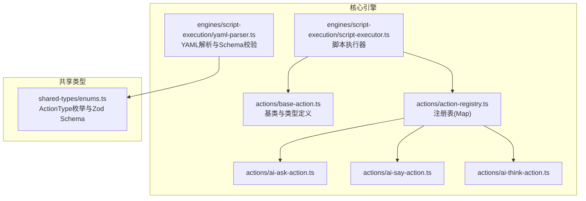
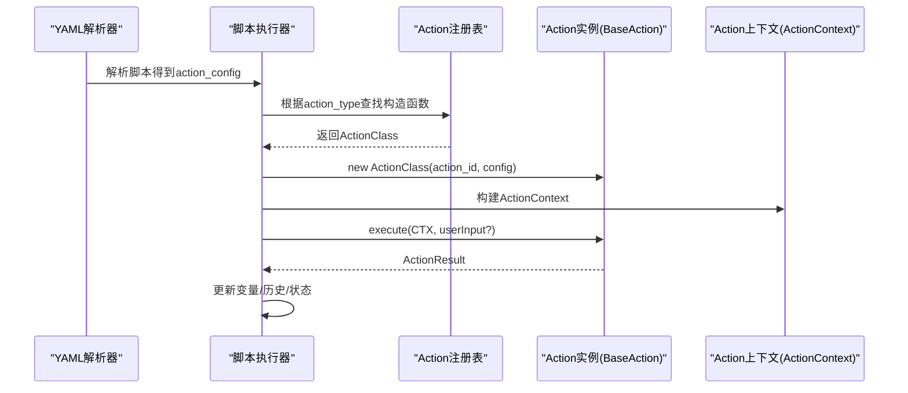
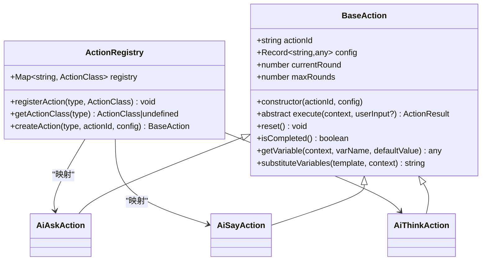
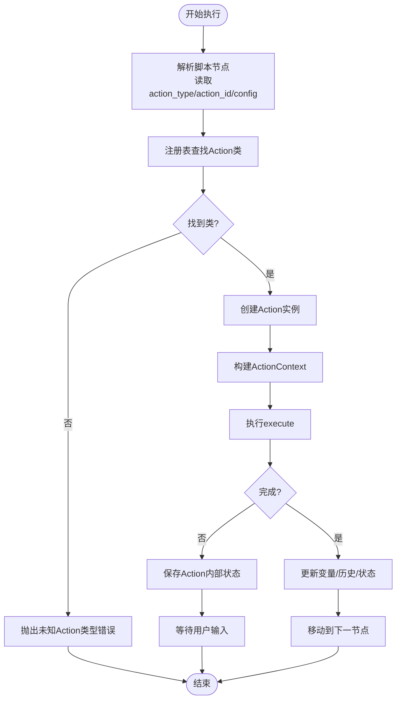
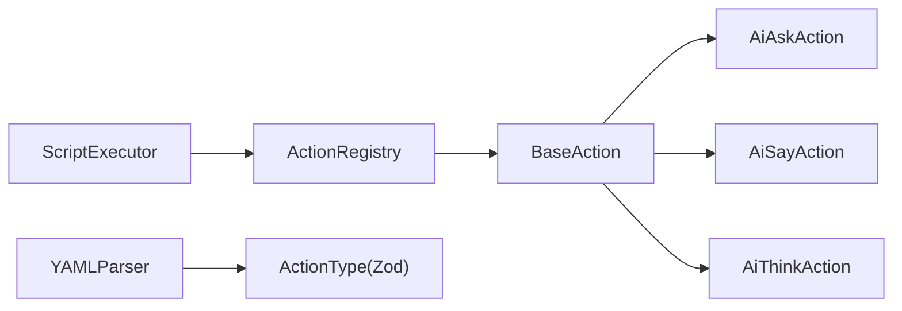

# Action注册表

<cite>
**本文引用的文件**
- [action-registry.ts](file://packages/core-engine/src/actions/action-registry.ts)
- [registry.ts](file://packages/core-engine/src/actions/registry.ts)
- [base-action.ts](file://packages/core-engine/src/actions/base-action.ts)
- [base.ts](file://packages/core-engine/src/actions/base.ts)
- [ai-ask-action.ts](file://packages/core-engine/src/actions/ai-ask-action.ts)
- [ai-say-action.ts](file://packages/core-engine/src/actions/ai-say-action.ts)
- [ai-think-action.ts](file://packages/core-engine/src/actions/ai-think-action.ts)
- [script-executor.ts](file://packages/core-engine/src/engines/script-execution/script-executor.ts)
- [yaml-parser.ts](file://packages/core-engine/src/engines/script-execution/yaml-parser.ts)
- [enums.ts](file://packages/shared-types/src/enums.ts)
- [index.ts](file://packages/core-engine/src/index.ts)
- [ACTION_CONFIG_COMPARISON.md](file://docs/ACTION_CONFIG_COMPARISON.md)
- [NEW_ACTION_CONFIG_GUIDE.md](file://docs/NEW_ACTION_CONFIG_GUIDE.md)
</cite>

## 目录
1. [简介](#简介)
2. [项目结构](#项目结构)
3. [核心组件](#核心组件)
4. [架构总览](#架构总览)
5. [详细组件分析](#详细组件分析)
6. [依赖分析](#依赖分析)
7. [性能考虑](#性能考虑)
8. [故障排查指南](#故障排查指南)
9. [结论](#结论)
10. [附录](#附录)

## 简介
本文件为Action注册表系统的全面技术文档，聚焦于：
- 设计目的与实现机制：类型安全的注册过程、动态加载与查找机制
- 数据结构设计：Action类型到构造函数的映射关系
- API接口说明：registerAction、createAction等方法的使用方式
- 在脚本执行过程中的作用：如何根据Action类型名称查找对应实现类
- 自定义Action的完整流程：类型声明、类实现、注册步骤
- 错误处理机制与调试技巧

本系统采用“注册表+基类”的架构，通过统一的注册中心管理Action类型与其构造函数的映射，并在脚本执行阶段按需动态创建实例，从而实现高扩展性与类型安全。

## 项目结构
Action注册表位于核心引擎包中，围绕以下模块组织：
- actions目录：Action基类、具体Action实现、注册表
- engines/script-execution：脚本执行器，负责解析脚本并驱动Action执行
- shared-types：类型约束（如ActionType枚举），用于Schema校验
- docs：Action配置变更与使用指南

图表来源
- [script-executor.ts](file://packages/core-engine/src/engines/script-execution/script-executor.ts#L8-L9)
- [action-registry.ts](file://packages/core-engine/src/actions/action-registry.ts#L1-L46)
- [base-action.ts](file://packages/core-engine/src/actions/base-action.ts#L1-L96)
- [ai-ask-action.ts](file://packages/core-engine/src/actions/ai-ask-action.ts#L1-L207)
- [ai-say-action.ts](file://packages/core-engine/src/actions/ai-say-action.ts#L1-L105)
- [ai-think-action.ts](file://packages/core-engine/src/actions/ai-think-action.ts#L1-L57)
- [yaml-parser.ts](file://packages/core-engine/src/engines/script-execution/yaml-parser.ts#L1-L96)
- [enums.ts](file://packages/shared-types/src/enums.ts#L70-L78)

章节来源
- [index.ts](file://packages/core-engine/src/index.ts#L19-L27)

## 核心组件
- Action基类与类型定义：定义Action上下文、结果、抽象执行接口以及通用工具方法
- 注册表：维护Action类型到构造函数的映射，提供注册与创建实例的能力
- 具体Action实现：如AiAskAction、AiSayAction、AiThinkAction
- 脚本执行器：解析脚本、构建执行上下文、按顺序驱动Action执行
- YAML解析器与类型约束：对脚本进行Schema校验，保证action_type合法

章节来源
- [base-action.ts](file://packages/core-engine/src/actions/base-action.ts#L37-L95)
- [action-registry.ts](file://packages/core-engine/src/actions/action-registry.ts#L12-L45)
- [ai-ask-action.ts](file://packages/core-engine/src/actions/ai-ask-action.ts#L19-L206)
- [ai-say-action.ts](file://packages/core-engine/src/actions/ai-say-action.ts#L16-L104)
- [ai-think-action.ts](file://packages/core-engine/src/actions/ai-think-action.ts#L11-L56)
- [script-executor.ts](file://packages/core-engine/src/engines/script-execution/script-executor.ts#L59-L511)
- [yaml-parser.ts](file://packages/core-engine/src/engines/script-execution/yaml-parser.ts#L34-L95)
- [enums.ts](file://packages/shared-types/src/enums.ts#L70-L78)

## 架构总览
Action注册表在系统中的职责是“类型到实现”的映射与实例化。脚本执行器在遍历脚本节点时，依据action_type从注册表中获取对应构造函数并创建实例，随后传入ActionContext执行execute方法。

图表来源
- [script-executor.ts](file://packages/core-engine/src/engines/script-execution/script-executor.ts#L453-L468)
- [action-registry.ts](file://packages/core-engine/src/actions/action-registry.ts#L35-L45)
- [base-action.ts](file://packages/core-engine/src/actions/base-action.ts#L37-L57)

## 详细组件分析

### 注册表与类型安全
- 注册表数据结构
  - 采用Map存储，键为字符串类型的action_type，值为构造函数签名与BaseAction一致的类
  - 提供registerAction、getActionClass、createAction三个核心API
- 类型安全
  - 构造函数签名与BaseAction保持一致，确保所有Action实现遵循统一接口
  - 通过共享类型约束（ActionType枚举与Zod Schema）在脚本层保证action_type合法

图表来源
- [registry.ts](file://packages/core-engine/src/actions/registry.ts#L6-L45)
- [base-action.ts](file://packages/core-engine/src/actions/base-action.ts#L37-L95)
- [ai-ask-action.ts](file://packages/core-engine/src/actions/ai-ask-action.ts#L19-L206)
- [ai-say-action.ts](file://packages/core-engine/src/actions/ai-say-action.ts#L16-L104)
- [ai-think-action.ts](file://packages/core-engine/src/actions/ai-think-action.ts#L11-L56)

章节来源
- [registry.ts](file://packages/core-engine/src/actions/registry.ts#L6-L45)
- [enums.ts](file://packages/shared-types/src/enums.ts#L70-L78)

### API接口说明
- registerAction(actionType: string, actionClass: ActionClass): void
  - 将指定actionType与Action类注册到注册表
- getActionClass(actionType: string): ActionClass | undefined
  - 从注册表中查询对应Action类（用于调试或二次封装）
- createAction(actionType: string, actionId: string, config: Record<string, any>): BaseAction
  - 根据actionType创建Action实例；若未找到对应类型，抛出错误

章节来源
- [registry.ts](file://packages/core-engine/src/actions/registry.ts#L16-L45)

### 脚本执行中的注册表使用
- 脚本执行器在遍历脚本节点时，从action_config中读取action_type、action_id、config
- 调用createAction创建实例，构建ActionContext并执行execute
- 若Action未完成，执行器保存Action内部状态（如currentRound），等待下一轮输入

图表来源
- [script-executor.ts](file://packages/core-engine/src/engines/script-execution/script-executor.ts#L453-L468)
- [action-registry.ts](file://packages/core-engine/src/actions/action-registry.ts#L35-L45)

章节来源
- [script-executor.ts](file://packages/core-engine/src/engines/script-execution/script-executor.ts#L283-L313)
- [script-executor.ts](file://packages/core-engine/src/engines/script-execution/script-executor.ts#L453-L509)

### 具体Action实现与注册
- AiAskAction：支持问题模板、目标变量、提取提示、必填校验、最大轮数等配置
- AiSayAction：支持消息模板、是否需要确认、最大轮数等配置
- AiThinkAction：占位实现，演示输出变量提取流程
- 注册：通过registerAction将action_type与类绑定；也可在初始化时批量导入

章节来源
- [ai-ask-action.ts](file://packages/core-engine/src/actions/ai-ask-action.ts#L19-L206)
- [ai-say-action.ts](file://packages/core-engine/src/actions/ai-say-action.ts#L16-L104)
- [ai-think-action.ts](file://packages/core-engine/src/actions/ai-think-action.ts#L11-L56)
- [registry.ts](file://packages/core-engine/src/actions/registry.ts#L16-L21)

### 类型约束与Schema校验
- ActionType枚举与Zod Schema确保action_type合法
- YAMLParser对会话脚本与技术脚本进行Schema校验，防止非法字段进入执行阶段

章节来源
- [enums.ts](file://packages/shared-types/src/enums.ts#L70-L78)
- [yaml-parser.ts](file://packages/core-engine/src/engines/script-execution/yaml-parser.ts#L34-L95)

## 依赖分析
- 脚本执行器依赖注册表：通过createAction获取Action实例
- 注册表依赖Action基类：确保所有Action实现遵循统一接口
- YAML解析器依赖共享类型：通过Zod Schema约束action_type
- 具体Action实现依赖基类：继承BaseAction并实现execute

图表来源
- [script-executor.ts](file://packages/core-engine/src/engines/script-execution/script-executor.ts#L8-L9)
- [action-registry.ts](file://packages/core-engine/src/actions/action-registry.ts#L10-L12)
- [yaml-parser.ts](file://packages/core-engine/src/engines/script-execution/yaml-parser.ts#L1-L3)
- [enums.ts](file://packages/shared-types/src/enums.ts#L115)

章节来源
- [index.ts](file://packages/core-engine/src/index.ts#L19-L27)

## 性能考虑
- 注册表采用Map结构，查找与插入的时间复杂度为O(1)，满足高频实例化场景
- Action内部状态（如currentRound）仅在Action实例上维护，避免全局状态膨胀
- 脚本执行器按序推进，避免重复解析与实例化，提高执行效率
- 建议：在大型脚本中合理拆分Phase/Topic，减少单次执行的Action数量

## 故障排查指南
- 未知Action类型
  - 现象：createAction抛出“未知action类型”错误
  - 排查：确认action_type是否拼写正确；是否已通过registerAction注册
  - 参考：[action-registry.ts](file://packages/core-engine/src/actions/action-registry.ts#L40-L43)
- Action执行异常
  - 现象：Action返回success=false且包含error字段
  - 排查：查看Action内部try/catch捕获的日志与错误信息
  - 参考：[ai-ask-action.ts](file://packages/core-engine/src/actions/ai-ask-action.ts#L160-L166)、[ai-say-action.ts](file://packages/core-engine/src/actions/ai-say-action.ts#L96-L102)、[ai-think-action.ts](file://packages/core-engine/src/actions/ai-think-action.ts#L48-L54)
- 脚本Schema校验失败
  - 现象：YAMLParser抛出校验错误
  - 排查：核对action_type是否在ActionType枚举中；config字段是否符合预期
  - 参考：[yaml-parser.ts](file://packages/core-engine/src/engines/script-execution/yaml-parser.ts#L59-L66)、[enums.ts](file://packages/shared-types/src/enums.ts#L115)
- 调试技巧
  - 在Action内部打印关键上下文（如actionId、require_acknowledgment、currentRound）
  - 在脚本执行器中观察WAITING_INPUT状态与actionState序列化
  - 参考：[ai-say-action.ts](file://packages/core-engine/src/actions/ai-say-action.ts#L40-L49)、[script-executor.ts](file://packages/core-engine/src/engines/script-execution/script-executor.ts#L489-L509)

章节来源
- [action-registry.ts](file://packages/core-engine/src/actions/action-registry.ts#L40-L43)
- [ai-ask-action.ts](file://packages/core-engine/src/actions/ai-ask-action.ts#L160-L166)
- [ai-say-action.ts](file://packages/core-engine/src/actions/ai-say-action.ts#L96-L102)
- [ai-think-action.ts](file://packages/core-engine/src/actions/ai-think-action.ts#L48-L54)
- [yaml-parser.ts](file://packages/core-engine/src/engines/script-execution/yaml-parser.ts#L59-L66)
- [script-executor.ts](file://packages/core-engine/src/engines/script-execution/script-executor.ts#L489-L509)

## 结论
Action注册表系统通过“类型到构造函数”的映射，结合统一的Action基类与严格的类型约束，实现了类型安全、可扩展、易维护的Action体系。脚本执行器基于注册表动态创建实例，配合上下文与状态管理，完成复杂的多轮交互流程。通过完善的错误处理与调试手段，开发者可以快速定位问题并扩展新的Action类型。

## 附录

### 注册自定义Action的完整流程
- 定义Action类
  - 继承BaseAction并实现execute方法
  - 设置静态actionType属性
  - 参考：[base-action.ts](file://packages/core-engine/src/actions/base-action.ts#L37-L57)、[ai-ask-action.ts](file://packages/core-engine/src/actions/ai-ask-action.ts#L19-L25)
- 注册Action
  - 使用registerAction将action_type与类绑定
  - 参考：[registry.ts](file://packages/core-engine/src/actions/registry.ts#L16-L21)
- 在脚本中使用
  - 在YAML中设置action_type为自定义类型
  - 通过YAMLParser与Schema校验
  - 参考：[yaml-parser.ts](file://packages/core-engine/src/engines/script-execution/yaml-parser.ts#L34-L67)、[enums.ts](file://packages/shared-types/src/enums.ts#L115)
- 调试与验证
  - 在Action内部打印关键信息
  - 在脚本执行器中观察状态变化
  - 参考：[script-executor.ts](file://packages/core-engine/src/engines/script-execution/script-executor.ts#L283-L313)

章节来源
- [base-action.ts](file://packages/core-engine/src/actions/base-action.ts#L37-L57)
- [registry.ts](file://packages/core-engine/src/actions/registry.ts#L16-L21)
- [yaml-parser.ts](file://packages/core-engine/src/engines/script-execution/yaml-parser.ts#L34-L67)
- [enums.ts](file://packages/shared-types/src/enums.ts#L115)
- [script-executor.ts](file://packages/core-engine/src/engines/script-execution/script-executor.ts#L283-L313)

### Action配置项参考（来自文档）
- ai_say：新增require_acknowledgment、max_rounds等配置项
- ai_ask：新增question_template、target_variable、extraction_prompt、required、max_rounds、exit、output等配置项
- 参考文档：[ACTION_CONFIG_COMPARISON.md](file://docs/ACTION_CONFIG_COMPARISON.md#L1-L253)、[NEW_ACTION_CONFIG_GUIDE.md](file://docs/NEW_ACTION_CONFIG_GUIDE.md#L1-L310)

章节来源
- [ACTION_CONFIG_COMPARISON.md](file://docs/ACTION_CONFIG_COMPARISON.md#L1-L253)
- [NEW_ACTION_CONFIG_GUIDE.md](file://docs/NEW_ACTION_CONFIG_GUIDE.md#L1-L310)