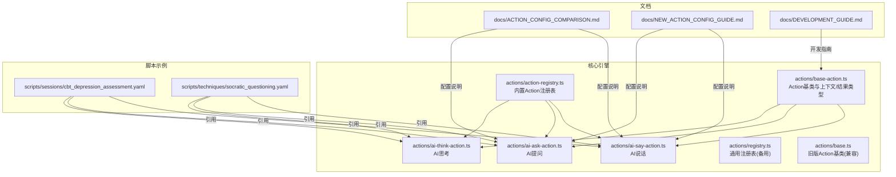
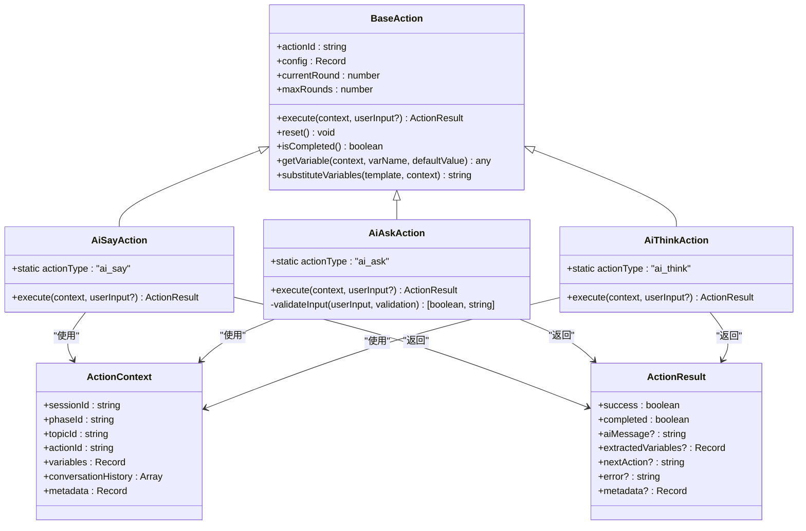
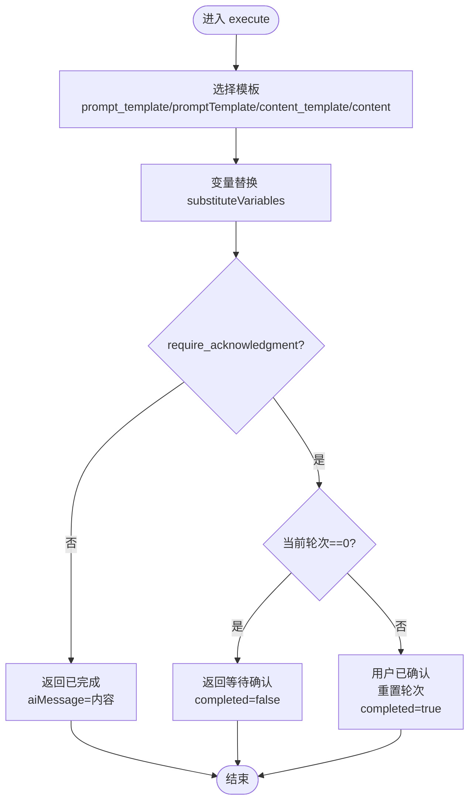
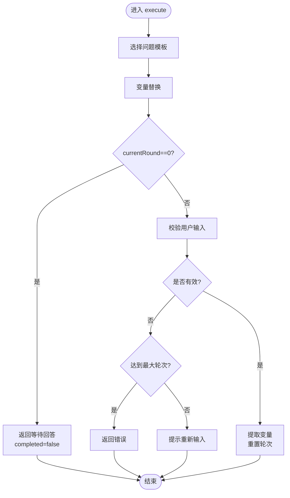
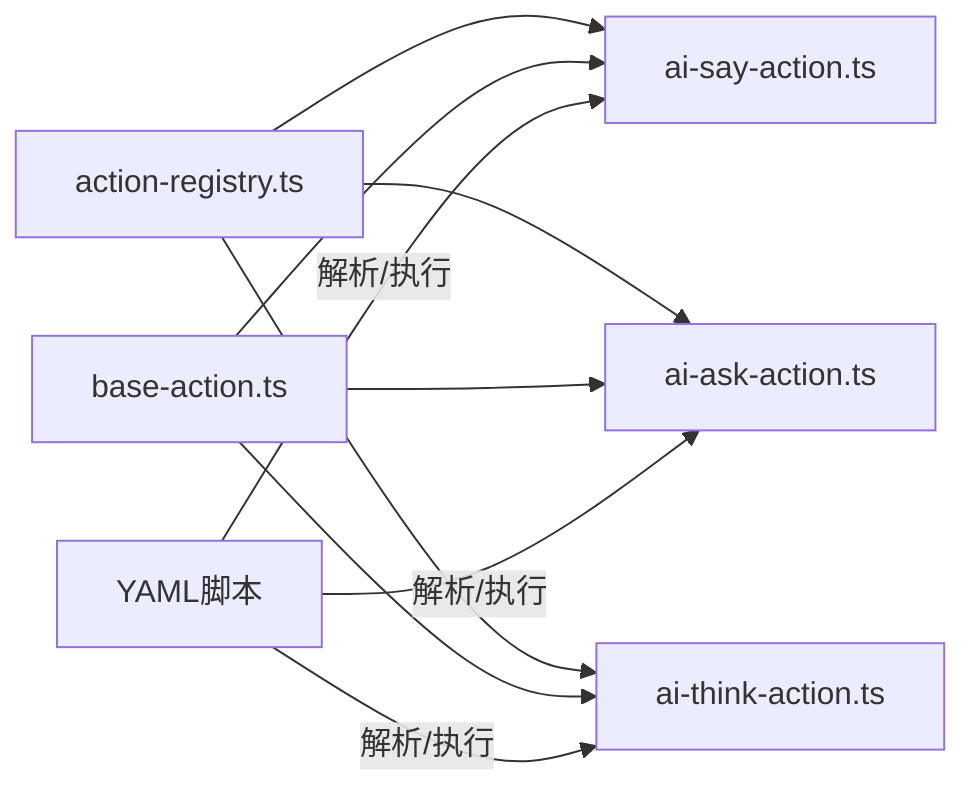

# Action系统

<cite>
**本文引用的文件**
- [packages/core-engine/src/actions/base-action.ts](file://packages/core-engine/src/actions/base-action.ts)
- [packages/core-engine/src/actions/action-registry.ts](file://packages/core-engine/src/actions/action-registry.ts)
- [packages/core-engine/src/actions/ai-say-action.ts](file://packages/core-engine/src/actions/ai-say-action.ts)
- [packages/core-engine/src/actions/ai-ask-action.ts](file://packages/core-engine/src/actions/ai-ask-action.ts)
- [packages/core-engine/src/actions/ai-think-action.ts](file://packages/core-engine/src/actions/ai-think-action.ts)
- [packages/core-engine/src/actions/registry.ts](file://packages/core-engine/src/actions/registry.ts)
- [packages/core-engine/src/actions/base.ts](file://packages/core-engine/src/actions/base.ts)
- [docs/ACTION_CONFIG_COMPARISON.md](file://docs/ACTION_CONFIG_COMPARISON.md)
- [docs/NEW_ACTION_CONFIG_GUIDE.md](file://docs/NEW_ACTION_CONFIG_GUIDE.md)
- [docs/DEVELOPMENT_GUIDE.md](file://docs/DEVELOPMENT_GUIDE.md)
- [scripts/sessions/cbt_depression_assessment.yaml](file://scripts/sessions/cbt_depression_assessment.yaml)
- [scripts/techniques/socratic_questioning.yaml](file://scripts/techniques/socratic_questioning.yaml)
</cite>

## 目录
1. [简介](#简介)
2. [项目结构](#项目结构)
3. [核心组件](#核心组件)
4. [架构总览](#架构总览)
5. [详细组件分析](#详细组件分析)
6. [依赖分析](#依赖分析)
7. [性能考虑](#性能考虑)
8. [故障排查指南](#故障排查指南)
9. [结论](#结论)
10. [附录](#附录)

## 简介
本文件为 HeartRule AI咨询引擎的 Action 系统提供全面技术文档。Action 是脚本执行的基本单元，负责在不同阶段与用户进行交互、收集信息、生成内部思考以及驱动后续流程。本文将系统阐述 Action 的概念、设计模式、生命周期管理、执行上下文、注册表机制、内置 Action 类型实现，并给出自定义 Action 的开发指南与最佳实践。

## 项目结构
Action 系统位于核心引擎包中，采用按职责分层的组织方式：
- actions 目录包含 Action 基类、注册表、以及内置 Action 实现
- scripts 目录包含示例脚本，展示 Action 在真实场景中的组合使用
- docs 目录包含配置对比与开发指南，便于理解 Action 的配置项演进与扩展方式

图表来源
- [packages/core-engine/src/actions/base-action.ts](file://packages/core-engine/src/actions/base-action.ts#L1-L96)
- [packages/core-engine/src/actions/action-registry.ts](file://packages/core-engine/src/actions/action-registry.ts#L1-L46)
- [packages/core-engine/src/actions/ai-say-action.ts](file://packages/core-engine/src/actions/ai-say-action.ts#L1-L105)
- [packages/core-engine/src/actions/ai-ask-action.ts](file://packages/core-engine/src/actions/ai-ask-action.ts#L1-L207)
- [packages/core-engine/src/actions/ai-think-action.ts](file://packages/core-engine/src/actions/ai-think-action.ts#L1-L57)
- [scripts/sessions/cbt_depression_assessment.yaml](file://scripts/sessions/cbt_depression_assessment.yaml#L1-L166)
- [scripts/techniques/socratic_questioning.yaml](file://scripts/techniques/socratic_questioning.yaml#L1-L110)

章节来源
- [packages/core-engine/src/actions/base-action.ts](file://packages/core-engine/src/actions/base-action.ts#L1-L96)
- [packages/core-engine/src/actions/action-registry.ts](file://packages/core-engine/src/actions/action-registry.ts#L1-L46)
- [scripts/sessions/cbt_depression_assessment.yaml](file://scripts/sessions/cbt_depression_assessment.yaml#L1-L166)
- [scripts/techniques/socratic_questioning.yaml](file://scripts/techniques/socratic_questioning.yaml#L1-L110)

## 核心组件
- Action 基类与上下文/结果类型：定义 Action 的统一接口、执行上下文 ActionContext、执行结果 ActionResult，以及通用的变量替换与状态管理能力。
- Action 注册表：集中管理 Action 类型与构造函数映射，提供创建实例的能力，并支持扩展注册新的 Action 类型。
- 内置 Action 类型：ai_say（AI说话）、ai_ask（AI提问）、ai_think（AI思考），分别实现不同的交互模式与数据流转。
- 脚本示例：通过 YAML 脚本展示 Action 的组合使用，体现 Session → Phase → Topic → Action 的层次结构。

章节来源
- [packages/core-engine/src/actions/base-action.ts](file://packages/core-engine/src/actions/base-action.ts#L7-L30)
- [packages/core-engine/src/actions/action-registry.ts](file://packages/core-engine/src/actions/action-registry.ts#L12-L45)
- [packages/core-engine/src/actions/ai-say-action.ts](file://packages/core-engine/src/actions/ai-say-action.ts#L16-L105)
- [packages/core-engine/src/actions/ai-ask-action.ts](file://packages/core-engine/src/actions/ai-ask-action.ts#L19-L207)
- [packages/core-engine/src/actions/ai-think-action.ts](file://packages/core-engine/src/actions/ai-think-action.ts#L11-L57)

## 架构总览
Action 系统围绕“类型安全 + 生命周期 + 上下文驱动”的设计展开。注册表负责类型到类的映射，执行时通过注册表创建具体 Action 实例；每个 Action 维护自身状态（轮次、最大轮次），并在每次执行中根据上下文决定下一步动作或完成状态。

图表来源
- [packages/core-engine/src/actions/base-action.ts](file://packages/core-engine/src/actions/base-action.ts#L37-L95)
- [packages/core-engine/src/actions/ai-say-action.ts](file://packages/core-engine/src/actions/ai-say-action.ts#L16-L105)
- [packages/core-engine/src/actions/ai-ask-action.ts](file://packages/core-engine/src/actions/ai-ask-action.ts#L19-L207)
- [packages/core-engine/src/actions/ai-think-action.ts](file://packages/core-engine/src/actions/ai-think-action.ts#L11-L57)

## 详细组件分析

### Action 基类与生命周期
- 设计理念
  - 统一抽象：所有 Action 必须实现 execute 方法，返回标准化的 ActionResult。
  - 生命周期：Action 维护 currentRound 与 maxRounds，支持多轮交互；可通过 reset 重置状态；通过 isCompleted 判断是否完成。
  - 上下文访问：提供 getVariable 与 substituteVariables，简化模板变量替换与变量读取。
- 执行上下文 ActionContext
  - 包含会话、阶段、话题、Action 的标识，以及变量、历史消息、元数据等。
- 执行结果 ActionResult
  - 标准化返回：success、completed、aiMessage、extractedVariables、nextAction、error、metadata。
- 最佳实践
  - 在 execute 中区分“等待用户输入”和“立即完成”，通过 metadata 传递状态信息。
  - 对异常进行捕获并返回错误结果，避免中断脚本执行。

章节来源
- [packages/core-engine/src/actions/base-action.ts](file://packages/core-engine/src/actions/base-action.ts#L37-L95)

### Action 注册表与类型安全
- 注册表机制
  - ACTION_REGISTRY 将 actionType 映射到 Action 类构造函数，提供 createAction 工厂方法。
  - registerAction 支持动态扩展新的 Action 类型。
- 类型安全保证
  - 通过 Record<string, ActionClass> 与静态 actionType 字段，确保类型一致性。
  - 未知类型抛出错误，防止运行时类型错误。
- 扩展方式
  - 新增 Action 类：实现静态 actionType 与 execute。
  - 在注册表中注册：registerAction('your_action', YourAction)。
  - 在脚本中使用：action_type: "your_action"。

章节来源
- [packages/core-engine/src/actions/action-registry.ts](file://packages/core-engine/src/actions/action-registry.ts#L17-L45)

### 内置 Action 类型详解

#### ai_say（AI说话）
- 行为特征
  - 支持 require_acknowledgment 控制是否等待用户确认。
  - 支持 content_template/prompt_template/content 等多种模板来源。
  - 多轮交互：第一轮发送消息并等待确认，第二轮确认后完成。
- 关键实现点
  - 模板选择顺序与变量替换。
  - 根据 require_acknowledgment 返回不同的 completed 与 metadata。
  - 异常捕获与错误返回。

图表来源
- [packages/core-engine/src/actions/ai-say-action.ts](file://packages/core-engine/src/actions/ai-say-action.ts#L19-L96)

章节来源
- [packages/core-engine/src/actions/ai-say-action.ts](file://packages/core-engine/src/actions/ai-say-action.ts#L16-L105)

#### ai_ask（AI提问）
- 行为特征
  - 支持 question_template/target_variable/extraction_prompt/validation 等配置。
  - 多轮交互：发送问题 → 等待回答 → 校验输入 → 提取变量 → 完成。
  - 支持 required/min_length/max_length/pattern 等校验规则。
- 关键实现点
  - 模板选择与变量替换。
  - validateInput 实现必填、长度、正则校验。
  - 提取变量到 extractedVariables，支持多次尝试与最大轮次控制。

图表来源
- [packages/core-engine/src/actions/ai-ask-action.ts](file://packages/core-engine/src/actions/ai-ask-action.ts#L27-L167)

章节来源
- [packages/core-engine/src/actions/ai-ask-action.ts](file://packages/core-engine/src/actions/ai-ask-action.ts#L19-L207)

#### ai_think（AI思考）
- 行为特征
  - MVP 版本：直接返回成功，生成占位符变量值，不实际调用 LLM。
  - 支持 think_goal 与 output_variables 配置。
- 关键实现点
  - 为每个输出变量生成占位符值，便于后续集成真实推理。

章节来源
- [packages/core-engine/src/actions/ai-think-action.ts](file://packages/core-engine/src/actions/ai-think-action.ts#L11-L57)

### 脚本执行中的 Action 协作
- 层次结构
  - Session → Phase → Topic → Action，Action 作为最小执行单元参与流程编排。
- 示例脚本
  - CBT 初次评估脚本展示了 ai_say、ai_ask、ai_think 的组合使用，体现信息收集、认知加工与总结反馈的完整闭环。
  - 苏格拉底式提问技术脚本展示了可复用技术脚本中 Action 的典型流程。

章节来源
- [scripts/sessions/cbt_depression_assessment.yaml](file://scripts/sessions/cbt_depression_assessment.yaml#L1-L166)
- [scripts/techniques/socratic_questioning.yaml](file://scripts/techniques/socratic_questioning.yaml#L1-L110)

## 依赖分析
- 组件耦合
  - BaseAction 为所有 Action 的抽象基类，提供通用能力，降低各 Action 的重复实现。
  - ActionRegistry 与具体 Action 类解耦，通过静态 actionType 与工厂方法创建实例。
- 外部依赖
  - 脚本解析与执行引擎负责将 YAML 脚本转换为 Action 执行序列。
  - 可视化编辑器负责 Action 配置的双向绑定与持久化。
- 循环依赖
  - 注册表与 Action 类之间无循环依赖，通过模块导入实现单向依赖。

图表来源
- [packages/core-engine/src/actions/action-registry.ts](file://packages/core-engine/src/actions/action-registry.ts#L17-L45)
- [packages/core-engine/src/actions/ai-say-action.ts](file://packages/core-engine/src/actions/ai-say-action.ts#L16-L105)
- [packages/core-engine/src/actions/ai-ask-action.ts](file://packages/core-engine/src/actions/ai-ask-action.ts#L19-L207)
- [packages/core-engine/src/actions/ai-think-action.ts](file://packages/core-engine/src/actions/ai-think-action.ts#L11-L57)

章节来源
- [packages/core-engine/src/actions/action-registry.ts](file://packages/core-engine/src/actions/action-registry.ts#L1-L46)
- [packages/core-engine/src/actions/base-action.ts](file://packages/core-engine/src/actions/base-action.ts#L1-L96)

## 性能考虑
- 模板替换
  - substituteVariables 采用逐变量扫描替换，复杂度 O(N*M)，其中 N 为变量数量，M 为模板长度。建议在模板中控制变量数量，避免过长模板。
- 校验逻辑
  - validateInput 依次检查必填、长度、正则，复杂度 O(K)，K 为校验规则数量。建议合理配置校验规则，避免冗余。
- 多轮交互
  - maxRounds 控制最大轮次，避免无限等待。建议结合业务场景设置合理上限。
- 日志与调试
  - Action 内部使用 console.log 输出调试信息，建议在生产环境中关闭或降级日志级别。

## 故障排查指南
- 未知 Action 类型
  - 现象：创建 Action 时抛出 Unknown action type 错误。
  - 排查：确认 action_type 是否拼写正确，是否已在注册表中注册。
- 模板变量缺失
  - 现象：ai_say/ai_ask 的模板变量未被替换。
  - 排查：确认上下文中 variables 是否包含对应键，或检查模板语法是否正确。
- 输入校验失败
  - 现象：ai_ask 返回 validationFailed 或达到最大轮次。
  - 排查：检查 required/min_length/max_length/pattern 配置，调整用户输入或放宽规则。
- 执行异常
  - 现象：Action 返回 error 字段。
  - 排查：查看错误信息，定位具体实现中的异常点并修复。

章节来源
- [packages/core-engine/src/actions/action-registry.ts](file://packages/core-engine/src/actions/action-registry.ts#L40-L44)
- [packages/core-engine/src/actions/ai-say-action.ts](file://packages/core-engine/src/actions/ai-say-action.ts#L96-L103)
- [packages/core-engine/src/actions/ai-ask-action.ts](file://packages/core-engine/src/actions/ai-ask-action.ts#L160-L167)
- [packages/core-engine/src/actions/ai-think-action.ts](file://packages/core-engine/src/actions/ai-think-action.ts#L48-L55)

## 结论
Action 系统通过统一的基类、注册表与标准的上下文/结果模型，实现了类型安全、可扩展且易于维护的脚本执行框架。内置的 ai_say、ai_ask、ai_think 覆盖了常见的交互模式，配合脚本示例展示了从信息收集到认知加工再到总结反馈的完整流程。开发者可遵循本文档的开发指南与最佳实践，快速扩展新的 Action 类型并集成到现有脚本中。

## 附录

### 自定义 Action 开发指南
- 继承 BaseAction
  - 实现静态 actionType 与 execute(context, userInput?) 方法。
  - 如需多轮交互，维护 currentRound 与 maxRounds，并在合适时机返回 completed=false。
- 注册 Action 类型
  - 在注册表中注册 actionType 与类构造函数。
  - 在脚本中通过 action_type 指定使用该类型。
- 配置项设计
  - 参考 ai_say/ai_ask 的配置项设计，提供清晰的字段命名与默认值。
  - 支持 require_acknowledgment、max_rounds、target_variable、extraction_prompt 等常见模式。
- 测试与验证
  - 编写单元测试覆盖正常与异常路径。
  - 使用示例脚本进行端到端验证。

章节来源
- [docs/DEVELOPMENT_GUIDE.md](file://docs/DEVELOPMENT_GUIDE.md#L113-L139)
- [docs/NEW_ACTION_CONFIG_GUIDE.md](file://docs/NEW_ACTION_CONFIG_GUIDE.md#L263-L310)

### 配置项参考与演进
- 配置项对比
  - 新增 require_acknowledgment、max_rounds、question_template、target_variable、extraction_prompt 等字段。
  - 保持向后兼容，未设置时使用默认值。
- 示例脚本
  - CBT 初次评估与苏格拉底式提问技术脚本展示了配置项的实际使用场景。

章节来源
- [docs/ACTION_CONFIG_COMPARISON.md](file://docs/ACTION_CONFIG_COMPARISON.md#L1-L253)
- [docs/NEW_ACTION_CONFIG_GUIDE.md](file://docs/NEW_ACTION_CONFIG_GUIDE.md#L1-L310)
- [scripts/sessions/cbt_depression_assessment.yaml](file://scripts/sessions/cbt_depression_assessment.yaml#L1-L166)
- [scripts/techniques/socratic_questioning.yaml](file://scripts/techniques/socratic_questioning.yaml#L1-L110)