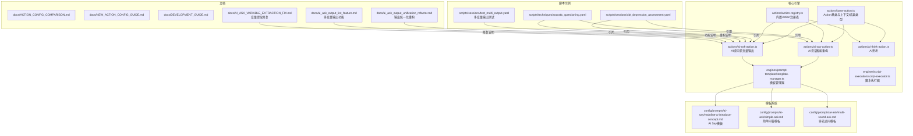
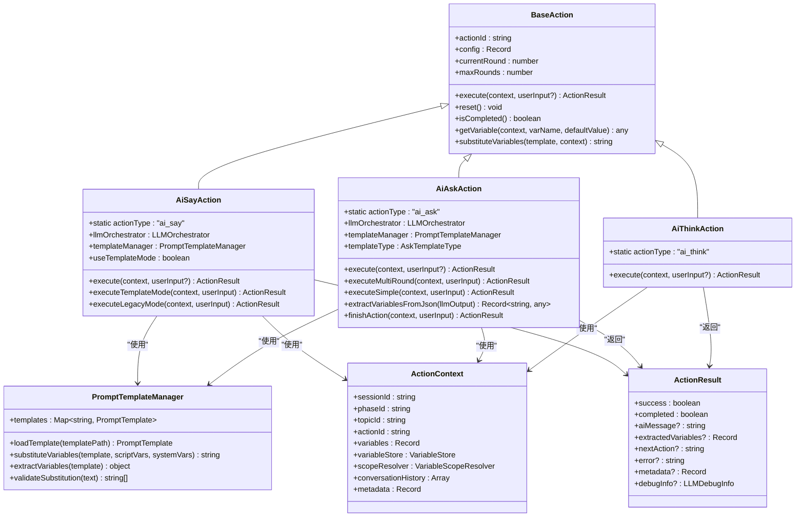
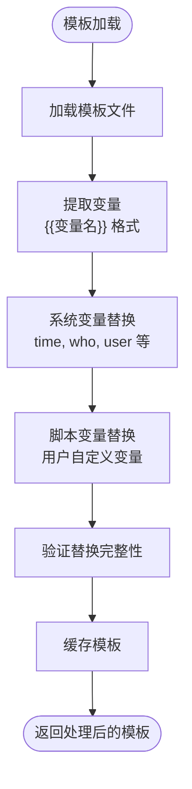
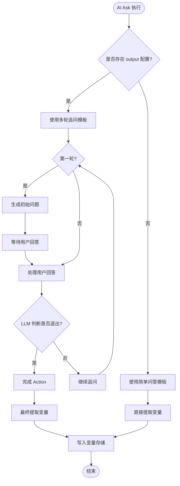
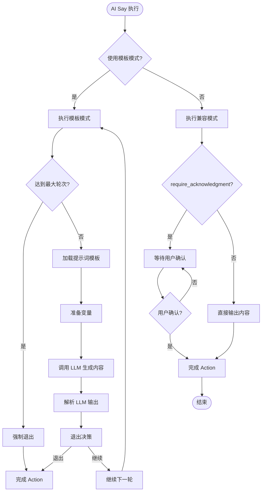
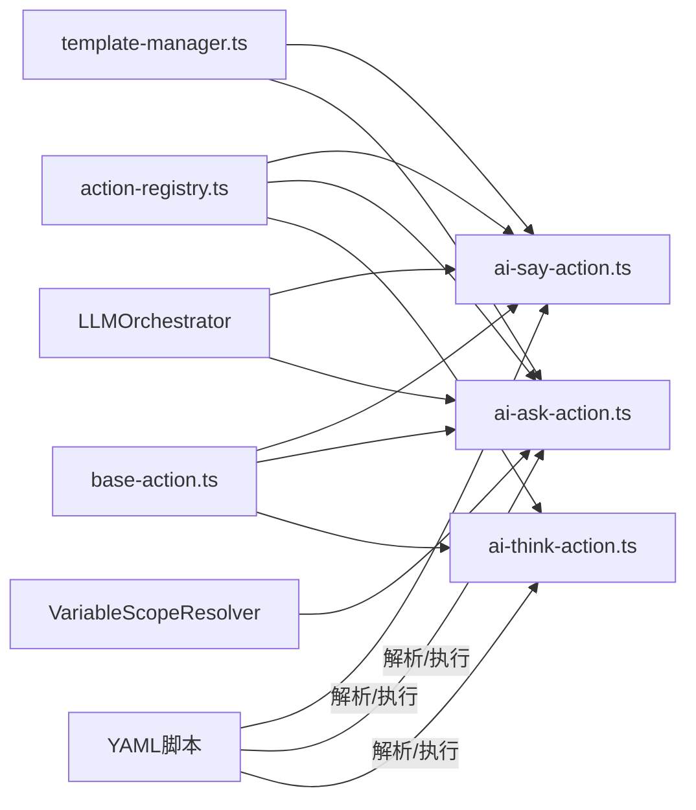

# Action系统

<cite>
**本文引用的文件**
- [packages/core-engine/src/actions/base-action.ts](file://packages/core-engine/src/actions/base-action.ts)
- [packages/core-engine/src/actions/action-registry.ts](file://packages/core-engine/src/actions/action-registry.ts)
- [packages/core-engine/src/actions/ai-say-action.ts](file://packages/core-engine/src/actions/ai-say-action.ts)
- [packages/core-engine/src/actions/ai-ask-action.ts](file://packages/core-engine/src/actions/ai-ask-action.ts)
- [packages/core-engine/src/actions/ai-think-action.ts](file://packages/core-engine/src/actions/ai-think-action.ts)
- [packages/core-engine/src/actions/registry.ts](file://packages/core-engine/src/actions/registry.ts)
- [packages/core-engine/src/actions/base.ts](file://packages/core-engine/src/actions/base.ts)
- [packages/core-engine/src/engines/prompt-template/template-manager.ts](file://packages/core-engine/src/engines/prompt-template/template-manager.ts)
- [packages/core-engine/src/engines/script-execution/script-executor.ts](file://packages/core-engine/src/engines/script-execution/script-executor.ts)
- [docs/ACTION_CONFIG_COMPARISON.md](file://docs/ACTION_CONFIG_COMPARISON.md)
- [docs/NEW_ACTION_CONFIG_GUIDE.md](file://docs/NEW_ACTION_CONFIG_GUIDE.md)
- [docs/DEVELOPMENT_GUIDE.md](file://docs/DEVELOPMENT_GUIDE.md)
- [docs/ai_ask_output_unification_refactor.md](file://docs/ai_ask_output_unification_refactor.md)
- [docs/ai_ask_output_list_feature.md](file://docs/ai_ask_output_list_feature.md)
- [docs/AI_ASK_VARIABLE_EXTRACTION_FIX.md](file://docs/AI_ASK_VARIABLE_EXTRACTION_FIX.md)
- [config/prompts/ai-say/mainline-a-introduce-concept.md](file://config/prompts/ai-say/mainline-a-introduce-concept.md)
- [config/prompts/ai-ask/simple-ask.md](file://config/prompts/ai-ask/simple-ask.md)
- [config/prompts/ai-ask/multi-round-ask.md](file://config/prompts/ai-ask/multi-round-ask.md)
- [scripts/sessions/cbt_depression_assessment.yaml](file://scripts/sessions/cbt_depression_assessment.yaml)
- [scripts/techniques/socratic_questioning.yaml](file://scripts/techniques/socratic_questioning.yaml)
- [scripts/sessions/test_multi_output.yaml](file://scripts/sessions/test_multi_output.yaml)
</cite>

## 更新摘要
**所做更改**
- 更新模板系统统一化说明，从混合格式${变量名}和{}统一为{{变量名}}格式
- 重构AI Ask和AI Say Action的实现机制和配置方式
- 新增多变量输出功能和变量提取统一化重构说明
- 更新模板管理器的变量提取和替换机制
- 增强Action执行器的调试信息和状态管理

## 目录
1. [简介](#简介)
2. [项目结构](#项目结构)
3. [核心组件](#核心组件)
4. [架构总览](#架构总览)
5. [详细组件分析](#详细组件分析)
6. [模板系统统一化](#模板系统统一化)
7. [AI Ask Action重大重构](#ai-ask-action重大重构)
8. [AI Say Action智能重构](#ai-say-action智能重构)
9. [多变量输出功能](#多变量输出功能)
10. [依赖分析](#依赖分析)
11. [性能考虑](#性能考虑)
12. [故障排查指南](#故障排查指南)
13. [结论](#结论)
14. [附录](#附录)

## 简介
本文件为 HeartRule AI咨询引擎的 Action 系统提供全面技术文档。Action 是脚本执行的基本单元，负责在不同阶段与用户进行交互、收集信息、生成内部思考以及驱动后续流程。本文将系统阐述 Action 的概念、设计模式、生命周期管理、执行上下文、注册表机制、内置 Action 类型实现，并给出自定义 Action 的开发指南与最佳实践。

**更新重点**：本次更新重点关注模板系统的统一化改造，从混合格式${变量名}和{}统一为{{变量名}}格式，以及AI Ask和AI Say Action的重大重构，包括多变量输出功能、智能变量提取机制和增强的调试信息支持。

## 项目结构
Action 系统位于核心引擎包中，采用按职责分层的组织方式：
- actions 目录包含 Action 基类、注册表、以及内置 Action 实现
- engines 目录包含模板管理、LLM编排、变量作用域等核心引擎
- scripts 目录包含示例脚本，展示 Action 在真实场景中的组合使用
- config/prompts 目录包含统一格式的提示词模板
- docs 目录包含配置对比与开发指南，便于理解 Action 的配置项演进与扩展方式



**图表来源**
- [packages/core-engine/src/actions/base-action.ts](file://packages/core-engine/src/actions/base-action.ts#L1-L96)
- [packages/core-engine/src/actions/action-registry.ts](file://packages/core-engine/src/actions/action-registry.ts#L1-L46)
- [packages/core-engine/src/actions/ai-say-action.ts](file://packages/core-engine/src/actions/ai-say-action.ts#L1-L399)
- [packages/core-engine/src/actions/ai-ask-action.ts](file://packages/core-engine/src/actions/ai-ask-action.ts#L1-L586)
- [packages/core-engine/src/engines/prompt-template/template-manager.ts](file://packages/core-engine/src/engines/prompt-template/template-manager.ts#L1-L193)
- [config/prompts/ai-say/mainline-a-introduce-concept.md](file://config/prompts/ai-say/mainline-a-introduce-concept.md#L1-L52)
- [config/prompts/ai-ask/simple-ask.md](file://config/prompts/ai-ask/simple-ask.md#L1-L26)
- [config/prompts/ai-ask/multi-round-ask.md](file://config/prompts/ai-ask/multi-round-ask.md#L1-L54)

**章节来源**
- [packages/core-engine/src/actions/base-action.ts](file://packages/core-engine/src/actions/base-action.ts#L1-L96)
- [packages/core-engine/src/actions/action-registry.ts](file://packages/core-engine/src/actions/action-registry.ts#L1-L46)
- [packages/core-engine/src/engines/prompt-template/template-manager.ts](file://packages/core-engine/src/engines/prompt-template/template-manager.ts#L1-L193)
- [scripts/sessions/cbt_depression_assessment.yaml](file://scripts/sessions/cbt_depression_assessment.yaml#L1-L166)
- [scripts/techniques/socratic_questioning.yaml](file://scripts/techniques/socratic_questioning.yaml#L1-L110)

## 核心组件
- Action 基类与上下文/结果类型：定义 Action 的统一接口、执行上下文 ActionContext、执行结果 ActionResult，以及通用的变量替换与状态管理能力。
- Action 注册表：集中管理 Action 类型与构造函数映射，提供创建实例的能力，并支持扩展注册新的 Action 类型。
- 模板管理器：提供统一的模板加载、变量提取和替换功能，支持两层变量替换（系统变量和脚本变量）。
- 脚本执行器：负责Action的序列化执行、状态管理和变量作用域解析。
- 内置 Action 类型：ai_say（AI说话）、ai_ask（AI提问）、ai_think（AI思考），分别实现不同的交互模式与数据流转。

**章节来源**
- [packages/core-engine/src/actions/base-action.ts](file://packages/core-engine/src/actions/base-action.ts#L7-L30)
- [packages/core-engine/src/actions/action-registry.ts](file://packages/core-engine/src/actions/action-registry.ts#L12-L45)
- [packages/core-engine/src/engines/prompt-template/template-manager.ts](file://packages/core-engine/src/engines/prompt-template/template-manager.ts#L20-L193)
- [packages/core-engine/src/engines/script-execution/script-executor.ts](file://packages/core-engine/src/engines/script-execution/script-executor.ts#L803-L853)

## 架构总览
Action 系统围绕"类型安全 + 生命周期 + 上下文驱动 + 模板统一化"的设计展开。注册表负责类型到类的映射，执行时通过注册表创建具体 Action 实例；每个 Action 维护自身状态（轮次、最大轮次），并通过模板管理器进行统一的变量替换。新的架构支持多变量输出、智能变量提取和增强的调试信息。



**图表来源**
- [packages/core-engine/src/actions/base-action.ts](file://packages/core-engine/src/actions/base-action.ts#L37-L95)
- [packages/core-engine/src/actions/ai-say-action.ts](file://packages/core-engine/src/actions/ai-say-action.ts#L65-L399)
- [packages/core-engine/src/actions/ai-ask-action.ts](file://packages/core-engine/src/actions/ai-ask-action.ts#L44-L586)
- [packages/core-engine/src/engines/prompt-template/template-manager.ts](file://packages/core-engine/src/engines/prompt-template/template-manager.ts#L20-L193)

## 详细组件分析

### Action 基类与生命周期
- 设计理念
  - 统一抽象：所有 Action 必须实现 execute 方法，返回标准化的 ActionResult。
  - 生命周期：Action 维护 currentRound 与 maxRounds，支持多轮交互；可通过 reset 重置状态；通过 isCompleted 判断是否完成。
  - 上下文访问：提供 getVariable 与 substituteVariables，简化模板变量替换与变量读取。
  - 状态管理：支持新的 variableStore 和 scopeResolver，实现分层变量管理。
- 执行上下文 ActionContext
  - 包含会话、阶段、话题、Action 的标识，以及变量、历史消息、元数据等。
  - 新增 variableStore 和 scopeResolver 支持分层变量存储和作用域解析。
- 执行结果 ActionResult
  - 标准化返回：success、completed、aiMessage、extractedVariables、nextAction、error、metadata、debugInfo。
  - 新增 debugInfo 字段支持 LLM 调试信息追踪。
- 最佳实践
  - 在 execute 中区分"等待用户输入"和"立即完成"，通过 metadata 传递状态信息。
  - 对异常进行捕获并返回错误结果，避免中断脚本执行。
  - 利用 cleanJsonOutput 方法清理 LLM 输出的 JSON 文本。

**章节来源**
- [packages/core-engine/src/actions/base-action.ts](file://packages/core-engine/src/actions/base-action.ts#L37-L95)
- [packages/core-engine/src/actions/base-action.ts](file://packages/core-engine/src/actions/base-action.ts#L141-L189)
- [packages/core-engine/src/actions/base-action.ts](file://packages/core-engine/src/actions/base-action.ts#L250-L258)

### Action 注册表与类型安全
- 注册表机制
  - ACTION_REGISTRY 将 actionType 映射到 Action 类构造函数，提供 createAction 工厂方法。
  - registerAction 支持动态扩展新的 Action 类型。
  - 脚本执行器中针对特定 Action 类型（ai_say、ai_ask）注入 LLMOrchestrator。
- 类型安全保证
  - 通过 Record<string, ActionClass> 与静态 actionType 字段，确保类型一致性。
  - 未知类型抛出错误，防止运行时类型错误。
- 扩展方式
  - 新增 Action 类：实现静态 actionType 与 execute。
  - 在注册表中注册：registerAction('your_action', YourAction)。
  - 在脚本中使用：action_type: "your_action"。

**章节来源**
- [packages/core-engine/src/actions/action-registry.ts](file://packages/core-engine/src/actions/action-registry.ts#L17-L45)
- [packages/core-engine/src/engines/script-execution/script-executor.ts](file://packages/core-engine/src/engines/script-execution/script-executor.ts#L810-L821)

## 模板系统统一化

### 变量格式统一
新的模板系统将所有变量格式统一为 {{变量名}} 格式，移除了对 ${变量名} 和 {} 的支持：

- **统一格式**：所有变量必须使用 {{变量名}} 语法
- **向后兼容**：模板管理器仍支持识别和替换多种格式，但推荐使用统一格式
- **模板验证**：validateSubstitution 方法专门检查 {{变量名}} 格式的完整性

### 模板管理器增强
- **两层变量替换**：先替换系统变量，再替换脚本变量
- **变量提取**：统一提取 {{变量名}} 格式的变量
- **模板缓存**：支持模板内容缓存，提高性能
- **格式验证**：验证变量替换的完整性



**图表来源**
- [packages/core-engine/src/engines/prompt-template/template-manager.ts](file://packages/core-engine/src/engines/prompt-template/template-manager.ts#L75-L108)
- [packages/core-engine/src/engines/prompt-template/template-manager.ts](file://packages/core-engine/src/engines/prompt-template/template-manager.ts#L115-L140)

**章节来源**
- [packages/core-engine/src/engines/prompt-template/template-manager.ts](file://packages/core-engine/src/engines/prompt-template/template-manager.ts#L115-L140)
- [packages/core-engine/src/engines/prompt-template/template-manager.ts](file://packages/core-engine/src/engines/prompt-template/template-manager.ts#L166-L177)

## AI Ask Action重大重构

### 多变量输出功能
AI Ask Action 现已支持统一的多变量输出配置方式：

- **统一配置**：所有变量提取都使用 output 数组配置
- **自动格式化**：自动生成符合 JSON 规范的变量列表
- **灵活配置**：支持有或无 define 说明的变量
- **实时提取**：在 LLM 返回后立即提取变量，无需等待 Action 完成

### 模板类型选择
- **简单问答**：使用 simple-ask 模板，适用于单轮交互
- **多轮追问**：使用 multi-round-ask 模板，支持智能追问和退出条件判断
- **自动选择**：根据是否存在 output 配置自动选择模板类型

### 变量提取机制
- **三级回退**：JSON 提取 → LLM 重新提取 → 用户输入兜底
- **作用域自动注册**：未定义的变量自动注册到 topic 作用域
- **实时写入**：变量提取后立即写入 variableStore



**图表来源**
- [packages/core-engine/src/actions/ai-ask-action.ts](file://packages/core-engine/src/actions/ai-ask-action.ts#L130-L190)
- [packages/core-engine/src/actions/ai-ask-action.ts](file://packages/core-engine/src/actions/ai-ask-action.ts#L195-L256)

**章节来源**
- [packages/core-engine/src/actions/ai-ask-action.ts](file://packages/core-engine/src/actions/ai-ask-action.ts#L44-L71)
- [packages/core-engine/src/actions/ai-ask-action.ts](file://packages/core-engine/src/actions/ai-ask-action.ts#L130-L190)
- [packages/core-engine/src/actions/ai-ask-action.ts](file://packages/core-engine/src/actions/ai-ask-action.ts#L195-L256)

## AI Say Action智能重构

### 智能理解度评估
AI Say Action 现已具备智能理解度评估能力：

- **多轮对话**：基于 max_rounds 控制，支持与用户多轮交互直到理解
- **理解度评估**：LLM 智能判断用户是否已理解内容
- **退出决策**：基于 exit_criteria 自动决策是否结束对话
- **自然表达生成**：使用 LLM 将内容改写为更自然、更温暖的表达

### 模式切换机制
- **模板模式**：当配置 max_rounds 或 exit_criteria 时启用
- **兼容模式**：简单单轮对话，仅输出静态内容
- **智能切换**：根据配置自动选择合适的执行模式

### 退出决策逻辑
- **最大轮次限制**：达到 max_rounds 时强制退出
- **理解度阈值**：understanding_level >= threshold 且无疑问
- **明确表达理解**：understanding_level >= 70 且 expressed_understanding = true
- **LLM 建议退出**：用户明确表示理解或达到退出条件



**图表来源**
- [packages/core-engine/src/actions/ai-say-action.ts](file://packages/core-engine/src/actions/ai-say-action.ts#L89-L112)
- [packages/core-engine/src/actions/ai-say-action.ts](file://packages/core-engine/src/actions/ai-say-action.ts#L117-L206)
- [packages/core-engine/src/actions/ai-say-action.ts](file://packages/core-engine/src/actions/ai-say-action.ts#L211-L299)

**章节来源**
- [packages/core-engine/src/actions/ai-say-action.ts](file://packages/core-engine/src/actions/ai-say-action.ts#L65-L87)
- [packages/core-engine/src/actions/ai-say-action.ts](file://packages/core-engine/src/actions/ai-say-action.ts#L117-L206)
- [packages/core-engine/src/actions/ai-say-action.ts](file://packages/core-engine/src/actions/ai-say-action.ts#L211-L299)

## 多变量输出功能

### 配置统一化
所有变量提取都使用统一的 output 数组配置方式：

```yaml
- action_type: "ai_ask"
  action_id: "ask_symptoms"
  config:
    question_template: "请详细描述你的症状"
    output:
      - get: "症状描述"
        define: "用户描述的主要症状表现"
      - get: "持续时间"
        define: "症状持续的时间长度"
      - get: "严重程度"
        define: "症状严重程度的评估（轻度/中度/重度）"
```

### 自动格式化生成
系统自动生成符合 JSON 规范的 output_list：

```json
{
  "EXIT": "false",
  "咨询师": "你生成的提问内容...",
  "BRIEF": "提问摘要(10字以内)",
  "症状描述": "提取的症状描述", // 用户描述的主要症状表现
  "持续时间": "提取的持续时间", // 症状持续的时间长度
  "严重程度": "提取的严重程度" // 症状严重程度的评估（轻度/中度/重度）
}
```

### 实时变量提取
变量提取不再等待 Action 完成，而是在每次 LLM 调用后立即处理：

- **立即提取**：在 LLM 返回 JSON 后，立即从 JSON 中提取 output 配置的变量
- **返回 extractedVariables**：在 ActionResult 中返回提取的变量，让 ScriptExecutor 立即写入 variableStore
- **保存原始 JSON**：在 metadata 中保存 `llmRawOutput`，供 finishAction 时使用

**章节来源**
- [docs/ai_ask_output_unification_refactor.md](file://docs/ai_ask_output_unification_refactor.md#L1-L305)
- [docs/ai_ask_output_list_feature.md](file://docs/ai_ask_output_list_feature.md#L1-L259)
- [packages/core-engine/src/actions/ai-ask-action.ts](file://packages/core-engine/src/actions/ai-ask-action.ts#L300-L340)

## 依赖分析
- 组件耦合
  - BaseAction 为所有 Action 的抽象基类，提供通用能力，降低各 Action 的重复实现。
  - ActionRegistry 与具体 Action 类解耦，通过静态 actionType 与工厂方法创建实例。
  - 模板管理器独立于 Action 实现，提供统一的模板处理能力。
- 外部依赖
  - LLMOrchestrator 提供大语言模型调用能力。
  - VariableScopeResolver 负责变量作用域解析和管理。
  - 脚本解析与执行引擎负责将 YAML 脚本转换为 Action 执行序列。
- 循环依赖
  - 注册表与 Action 类之间无循环依赖，通过模块导入实现单向依赖。
  - 模板管理器与 Action 类之间通过接口解耦。



**图表来源**
- [packages/core-engine/src/actions/action-registry.ts](file://packages/core-engine/src/actions/action-registry.ts#L17-L45)
- [packages/core-engine/src/engines/prompt-template/template-manager.ts](file://packages/core-engine/src/engines/prompt-template/template-manager.ts#L20-L27)
- [packages/core-engine/src/engines/script-execution/script-executor.ts](file://packages/core-engine/src/engines/script-execution/script-executor.ts#L810-L821)

**章节来源**
- [packages/core-engine/src/actions/action-registry.ts](file://packages/core-engine/src/actions/action-registry.ts#L1-L46)
- [packages/core-engine/src/actions/base-action.ts](file://packages/core-engine/src/actions/base-action.ts#L1-L96)

## 性能考虑
- 模板替换
  - substituteVariables 采用逐变量扫描替换，复杂度 O(N*M)，其中 N 为变量数量，M 为模板长度。
  - 模板管理器提供缓存机制，避免重复加载相同模板。
  - 支持三种占位符格式 {{var}}, {var}, ${var} 的统一处理。
- 校验逻辑
  - validateInput 依次检查必填、长度、正则，复杂度 O(K)，K 为校验规则数量。
  - 模板管理器的 validateSubstitution 方法专门检查 {{变量名}} 格式的完整性。
- 多轮交互
  - maxRounds 控制最大轮次，避免无限等待。
  - 智能退出决策减少不必要的轮次。
- 日志与调试
  - Action 内部使用 console.log 输出调试信息，支持 debugInfo 字段。
  - 增强的日志记录便于问题排查和性能监控。

## 故障排查指南
- 未知 Action 类型
  - 现象：创建 Action 时抛出 Unknown action type 错误。
  - 排查：确认 action_type 是否拼写正确，是否已在注册表中注册。
- 模板变量缺失
  - 现象：ai_say/ai_ask 的模板变量未被替换。
  - 排查：确认上下文中 variables 是否包含对应键，或检查模板语法是否正确。
  - **新问题**：检查变量格式是否使用统一的 {{变量名}} 格式。
- 输入校验失败
  - 现象：ai_ask 返回 validationFailed 或达到最大轮次。
  - 排查：检查 required/min_length/max_length/pattern 配置，调整用户输入或放宽规则。
- 执行异常
  - 现象：Action 返回 error 字段。
  - 排查：查看错误信息，定位具体实现中的异常点并修复。
- 变量提取失败
  - 现象：变量没有被写入到变量系统中。
  - 排查：检查 output 配置是否正确，确认变量作用域解析器正常工作。
- 模板加载失败
  - 现象：提示词模板无法加载。
  - 排查：确认模板路径配置正确，检查模板文件是否存在且格式正确。

**章节来源**
- [packages/core-engine/src/actions/action-registry.ts](file://packages/core-engine/src/actions/action-registry.ts#L40-L44)
- [packages/core-engine/src/actions/ai-say-action.ts](file://packages/core-engine/src/actions/ai-say-action.ts#L104-L112)
- [packages/core-engine/src/actions/ai-ask-action.ts](file://packages/core-engine/src/actions/ai-ask-action.ts#L118-L125)
- [packages/core-engine/src/engines/prompt-template/template-manager.ts](file://packages/core-engine/src/engines/prompt-template/template-manager.ts#L56-L58)

## 结论
Action 系统通过统一的基类、注册表与标准的上下文/结果模型，实现了类型安全、可扩展且易于维护的脚本执行框架。最新的模板系统统一化改造将变量格式统一为 {{变量名}}，简化了配置和使用体验。AI Ask 和 AI Say Action 的重大重构引入了多变量输出、智能变量提取和理解度评估等高级功能，显著提升了系统的智能化水平。配合脚本示例展示了从信息收集到认知加工再到总结反馈的完整流程。开发者可遵循本文档的开发指南与最佳实践，快速扩展新的 Action 类型并集成到现有脚本中。

## 附录

### 自定义 Action 开发指南
- 继承 BaseAction
  - 实现静态 actionType 与 execute(context, userInput?) 方法。
  - 如需多轮交互，维护 currentRound 与 maxRounds，并在合适时机返回 completed=false。
  - 利用 cleanJsonOutput 方法处理 LLM 输出的 JSON 文本。
- 注册 Action 类型
  - 在注册表中注册 actionType 与类构造函数。
  - 在脚本中通过 action_type 指定使用该类型。
- 配置项设计
  - 参考 ai_say/ai_ask 的配置项设计，提供清晰的字段命名与默认值。
  - 支持 require_acknowledgment、max_rounds、target_variable、extraction_prompt 等常见模式。
  - **新要求**：使用统一的 {{变量名}} 格式进行模板变量定义。
- 模板集成
  - 使用 PromptTemplateManager 进行模板加载和变量替换。
  - 支持两层变量替换：系统变量和脚本变量。
  - 利用 extractVariables 方法提取模板中的变量。
- 测试与验证
  - 编写单元测试覆盖正常与异常路径。
  - 使用示例脚本进行端到端验证。
  - 利用 debugInfo 字段进行调试信息追踪。

**章节来源**
- [docs/DEVELOPMENT_GUIDE.md](file://docs/DEVELOPMENT_GUIDE.md#L113-L139)
- [docs/NEW_ACTION_CONFIG_GUIDE.md](file://docs/NEW_ACTION_CONFIG_GUIDE.md#L263-L310)
- [packages/core-engine/src/engines/prompt-template/template-manager.ts](file://packages/core-engine/src/engines/prompt-template/template-manager.ts#L75-L108)

### 配置项参考与演进
- 配置项对比
  - 新增 require_acknowledgment、max_rounds、question_template、target_variable、extraction_prompt 等字段。
  - **重大变更**：统一使用 output 数组配置多变量输出，移除 target_variable 和 extraction_prompt 的二元性。
  - 保持向后兼容，未设置时使用默认值。
- 模板系统演进
  - **统一格式**：从混合格式${变量名}和{}统一为{{变量名}}格式。
  - **增强功能**：支持两层变量替换、模板缓存和格式验证。
  - **智能处理**：自动识别和处理多种变量格式。
- 示例脚本
  - CBT 初次评估与苏格拉底式提问技术脚本展示了配置项的实际使用场景。
  - **新增**：test_multi_output.yaml 展示了多变量输出功能的完整示例。

**章节来源**
- [docs/ACTION_CONFIG_COMPARISON.md](file://docs/ACTION_CONFIG_COMPARISON.md#L1-L253)
- [docs/NEW_ACTION_CONFIG_GUIDE.md](file://docs/NEW_ACTION_CONFIG_GUIDE.md#L1-L310)
- [docs/ai_ask_output_unification_refactor.md](file://docs/ai_ask_output_unification_refactor.md#L1-L305)
- [docs/ai_ask_output_list_feature.md](file://docs/ai_ask_output_list_feature.md#L1-L259)
- [scripts/sessions/cbt_depression_assessment.yaml](file://scripts/sessions/cbt_depression_assessment.yaml#L1-L166)
- [scripts/techniques/socratic_questioning.yaml](file://scripts/techniques/socratic_questioning.yaml#L1-L110)
- [scripts/sessions/test_multi_output.yaml](file://scripts/sessions/test_multi_output.yaml#L1-L89)

### 模板系统使用指南
- **变量格式**：统一使用 {{变量名}} 格式，支持中文变量名。
- **模板加载**：使用 PromptTemplateManager.loadTemplate() 方法加载模板。
- **变量替换**：使用 two-layer substitution 机制进行变量替换。
- **格式验证**：使用 validateSubstitution() 方法检查变量替换完整性。
- **缓存机制**：模板内容自动缓存，提高性能。

**章节来源**
- [packages/core-engine/src/engines/prompt-template/template-manager.ts](file://packages/core-engine/src/engines/prompt-template/template-manager.ts#L33-L59)
- [packages/core-engine/src/engines/prompt-template/template-manager.ts](file://packages/core-engine/src/engines/prompt-template/template-manager.ts#L75-L108)
- [packages/core-engine/src/engines/prompt-template/template-manager.ts](file://packages/core-engine/src/engines/prompt-template/template-manager.ts#L166-L177)