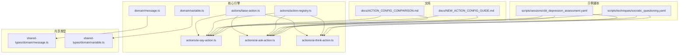
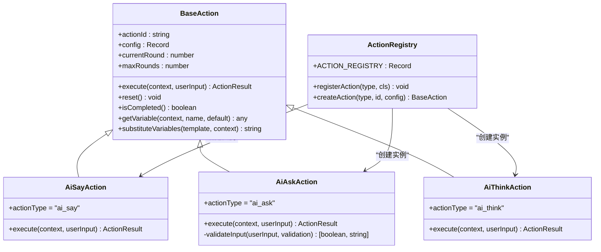
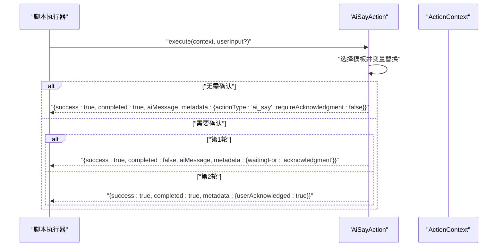
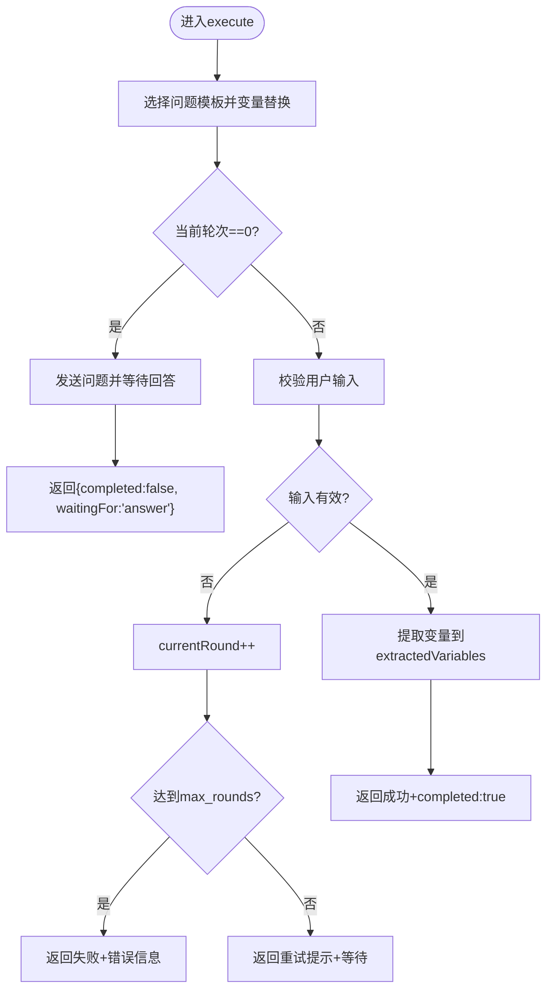
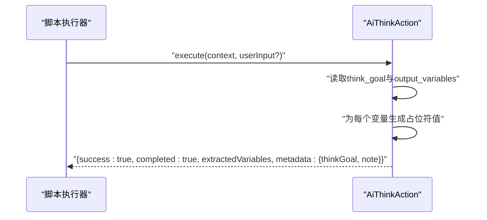
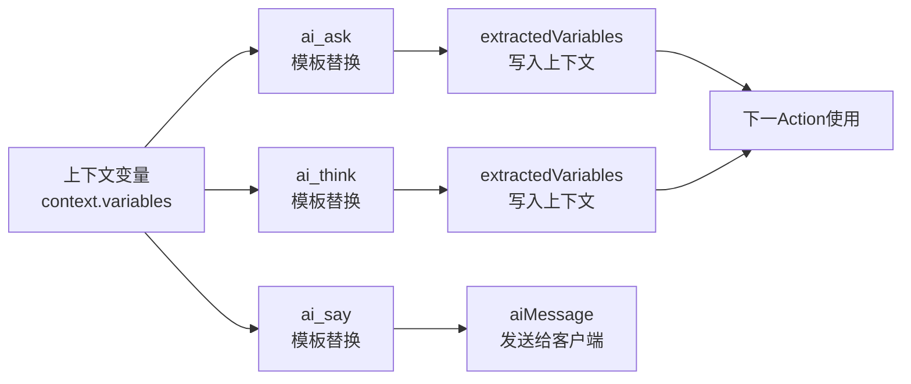
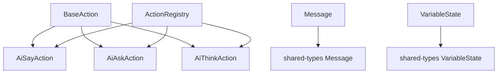

# 内置Action实现

<cite>
**本文引用的文件**
- [packages/core-engine/src/actions/base-action.ts](file://packages/core-engine/src/actions/base-action.ts)
- [packages/core-engine/src/actions/ai-say-action.ts](file://packages/core-engine/src/actions/ai-say-action.ts)
- [packages/core-engine/src/actions/ai-ask-action.ts](file://packages/core-engine/src/actions/ai-ask-action.ts)
- [packages/core-engine/src/actions/ai-think-action.ts](file://packages/core-engine/src/actions/ai-think-action.ts)
- [packages/core-engine/src/actions/action-registry.ts](file://packages/core-engine/src/actions/action-registry.ts)
- [packages/core-engine/src/domain/message.ts](file://packages/core-engine/src/domain/message.ts)
- [packages/core-engine/src/domain/variable.ts](file://packages/core-engine/src/domain/variable.ts)
- [packages/shared-types/src/domain/message.ts](file://packages/shared-types/src/domain/message.ts)
- [packages/shared-types/src/domain/variable.ts](file://packages/shared-types/src/domain/variable.ts)
- [scripts/sessions/cbt_depression_assessment.yaml](file://scripts/sessions/cbt_depression_assessment.yaml)
- [scripts/techniques/socratic_questioning.yaml](file://scripts/techniques/socratic_questioning.yaml)
- [docs/ACTION_CONFIG_COMPARISON.md](file://docs/ACTION_CONFIG_COMPARISON.md)
- [docs/NEW_ACTION_CONFIG_GUIDE.md](file://docs/NEW_ACTION_CONFIG_GUIDE.md)
</cite>

## 目录
1. [简介](#简介)
2. [项目结构](#项目结构)
3. [核心组件](#核心组件)
4. [架构总览](#架构总览)
5. [详细组件分析](#详细组件分析)
6. [依赖分析](#依赖分析)
7. [性能考虑](#性能考虑)
8. [故障排查指南](#故障排查指南)
9. [结论](#结论)
10. [附录](#附录)

## 简介
本文件为内置Action实现的权威参考文档，围绕三个核心Action展开：ai_say（AI说话）、ai_ask（AI提问）、ai_think（AI思考）。文档从代码结构、执行流程、配置项、数据流转、错误处理、性能优化与最佳实践等方面进行系统化梳理，并结合真实脚本示例与配置模板，帮助开发者与产品人员准确理解与高效使用。

## 项目结构
本项目采用多包工作区组织，与Action实现直接相关的核心目录如下：
- packages/core-engine：核心引擎与Action实现
- packages/shared-types：共享类型定义（消息、变量等）
- scripts：示例脚本（会话与技术脚本）
- docs：配置对比与新增功能说明文档

图表来源
- [packages/core-engine/src/actions/base-action.ts](file://packages/core-engine/src/actions/base-action.ts#L1-L98)
- [packages/core-engine/src/actions/ai-say-action.ts](file://packages/core-engine/src/actions/ai-say-action.ts#L1-L105)
- [packages/core-engine/src/actions/ai-ask-action.ts](file://packages/core-engine/src/actions/ai-ask-action.ts#L1-L207)
- [packages/core-engine/src/actions/ai-think-action.ts](file://packages/core-engine/src/actions/ai-think-action.ts#L1-L57)
- [packages/core-engine/src/actions/action-registry.ts](file://packages/core-engine/src/actions/action-registry.ts#L1-L46)
- [packages/core-engine/src/domain/message.ts](file://packages/core-engine/src/domain/message.ts#L1-L49)
- [packages/core-engine/src/domain/variable.ts](file://packages/core-engine/src/domain/variable.ts#L1-L120)
- [packages/shared-types/src/domain/message.ts](file://packages/shared-types/src/domain/message.ts#L1-L52)
- [packages/shared-types/src/domain/variable.ts](file://packages/shared-types/src/domain/variable.ts#L1-L59)
- [scripts/sessions/cbt_depression_assessment.yaml](file://scripts/sessions/cbt_depression_assessment.yaml#L1-L166)
- [scripts/techniques/socratic_questioning.yaml](file://scripts/techniques/socratic_questioning.yaml#L1-L110)
- [docs/ACTION_CONFIG_COMPARISON.md](file://docs/ACTION_CONFIG_COMPARISON.md#L1-L253)
- [docs/NEW_ACTION_CONFIG_GUIDE.md](file://docs/NEW_ACTION_CONFIG_GUIDE.md#L1-L310)

章节来源
- [packages/core-engine/src/actions/base-action.ts](file://packages/core-engine/src/actions/base-action.ts#L1-L98)
- [packages/core-engine/src/actions/action-registry.ts](file://packages/core-engine/src/actions/action-registry.ts#L1-L46)

## 核心组件
- Action基类与通用类型：定义Action上下文、返回结果、变量替换、轮次控制等通用能力。
- Action注册表：集中管理Action类型与实例创建。
- 三大内置Action：ai_say、ai_ask、ai_think，分别负责消息发送、用户输入收集与校验、内部思考与变量产出。
- 领域模型：消息与变量的状态模型，支撑Action的数据流转与持久化。

章节来源
- [packages/core-engine/src/actions/base-action.ts](file://packages/core-engine/src/actions/base-action.ts#L9-L32)
- [packages/core-engine/src/actions/action-registry.ts](file://packages/core-engine/src/actions/action-registry.ts#L17-L45)
- [packages/core-engine/src/domain/message.ts](file://packages/core-engine/src/domain/message.ts#L7-L32)
- [packages/core-engine/src/domain/variable.ts](file://packages/core-engine/src/domain/variable.ts#L15-L49)

## 架构总览
Action体系遵循“基类抽象 + 注册表分发 + 具体实现”的分层设计。执行时由注册表按action_type创建实例，再调用其execute方法；execute根据当前轮次与配置决定是否等待用户输入、是否提取变量、是否完成等。

图表来源
- [packages/core-engine/src/actions/base-action.ts](file://packages/core-engine/src/actions/base-action.ts#L39-L96)
- [packages/core-engine/src/actions/ai-say-action.ts](file://packages/core-engine/src/actions/ai-say-action.ts#L16-L104)
- [packages/core-engine/src/actions/ai-ask-action.ts](file://packages/core-engine/src/actions/ai-ask-action.ts#L19-L206)
- [packages/core-engine/src/actions/ai-think-action.ts](file://packages/core-engine/src/actions/ai-think-action.ts#L11-L56)
- [packages/core-engine/src/actions/action-registry.ts](file://packages/core-engine/src/actions/action-registry.ts#L17-L45)

## 详细组件分析

### ai_say（AI说话）Action
- 作用：向用户发送消息，支持是否需要确认以及最大轮次控制。
- 关键配置项
  - content_template/prompt_template/content_template：消息模板选择优先级
  - require_acknowledgment：是否等待用户确认（默认true）
  - max_rounds：最大轮次（默认1）
- 执行逻辑
  - 选择模板并进行变量替换
  - 若无需确认：立即返回完成，消息发送给客户端
  - 若需确认：第一轮发送消息并等待；第二轮视为确认完成并清理状态
- 返回结果
  - success、completed、aiMessage、metadata（含actionType、requireAcknowledgment/waitingFor/userAcknowledged等）

图表来源
- [packages/core-engine/src/actions/ai-say-action.ts](file://packages/core-engine/src/actions/ai-say-action.ts#L19-L95)
- [packages/core-engine/src/actions/base-action.ts](file://packages/core-engine/src/actions/base-action.ts#L87-L96)

章节来源
- [packages/core-engine/src/actions/ai-say-action.ts](file://packages/core-engine/src/actions/ai-say-action.ts#L16-L104)
- [docs/NEW_ACTION_CONFIG_GUIDE.md](file://docs/NEW_ACTION_CONFIG_GUIDE.md#L9-L34)
- [docs/ACTION_CONFIG_COMPARISON.md](file://docs/ACTION_CONFIG_COMPARISON.md#L3-L23)

### ai_ask（AI提问）Action
- 作用：向用户提问并提取变量，支持必填、长度、正则校验与最大轮次。
- 关键配置项
  - question_template/prompt_template/question：问题模板优先级
  - target_variable/extraction_prompt：目标变量与提取提示
  - validation：必填(required)、最小/最大长度(min_length/minLength、max_length/maxLength)、正则(pattern)
  - retry_message：重试提示
  - max_rounds：最大轮次（默认3）
- 执行逻辑
  - 第1轮：发送问题并等待回答
  - 后续轮次：校验输入，必要时提示重试；达到最大轮次则失败；成功则提取变量并完成
- 返回结果
  - success、completed、aiMessage、extractedVariables、metadata（含waitingFor、answerReceived、validationFailed、extractTo等）

图表来源
- [packages/core-engine/src/actions/ai-ask-action.ts](file://packages/core-engine/src/actions/ai-ask-action.ts#L27-L167)
- [packages/core-engine/src/actions/ai-ask-action.ts](file://packages/core-engine/src/actions/ai-ask-action.ts#L169-L205)

章节来源
- [packages/core-engine/src/actions/ai-ask-action.ts](file://packages/core-engine/src/actions/ai-ask-action.ts#L19-L206)
- [docs/NEW_ACTION_CONFIG_GUIDE.md](file://docs/NEW_ACTION_CONFIG_GUIDE.md#L36-L103)
- [docs/ACTION_CONFIG_COMPARISON.md](file://docs/ACTION_CONFIG_COMPARISON.md#L70-L148)

### ai_think（AI思考）Action
- 作用：内部思考并生成变量，当前为MVP占位实现，后续将接入LLM。
- 关键配置项
  - think_goal/thinkGoal：思考目标
  - output_variables/outputVariables：输出变量列表
- 执行逻辑
  - 读取think_goal与output_variables
  - 为每个输出变量生成占位符值并返回
- 返回结果
  - success、completed、aiMessage=null、extractedVariables、metadata（含thinkGoal、note）

图表来源
- [packages/core-engine/src/actions/ai-think-action.ts](file://packages/core-engine/src/actions/ai-think-action.ts#L18-L55)

章节来源
- [packages/core-engine/src/actions/ai-think-action.ts](file://packages/core-engine/src/actions/ai-think-action.ts#L11-L56)

### Action之间的协作与数据流转
- 变量传递：ai_ask将用户回答提取到目标变量；ai_say与ai_think可在模板中引用上下文变量；ai_think产出变量供后续Action使用。
- 轮次与状态：各Action通过currentRound/maxRounds控制多轮交互；AiAskAction在验证失败时递增轮次并提示重试。
- 元数据：各Action在metadata中携带actionType、waitingFor、answerReceived、userAcknowledged等状态，便于上层流程控制。

图表来源
- [packages/core-engine/src/actions/base-action.ts](file://packages/core-engine/src/actions/base-action.ts#L87-L96)
- [packages/core-engine/src/actions/ai-ask-action.ts](file://packages/core-engine/src/actions/ai-ask-action.ts#L140-L159)
- [packages/core-engine/src/actions/ai-think-action.ts](file://packages/core-engine/src/actions/ai-think-action.ts#L30-L47)
- [packages/core-engine/src/actions/ai-say-action.ts](file://packages/core-engine/src/actions/ai-say-action.ts#L52-L95)

章节来源
- [packages/core-engine/src/actions/base-action.ts](file://packages/core-engine/src/actions/base-action.ts#L87-L96)
- [packages/core-engine/src/actions/ai-ask-action.ts](file://packages/core-engine/src/actions/ai-ask-action.ts#L140-L159)
- [packages/core-engine/src/actions/ai-think-action.ts](file://packages/core-engine/src/actions/ai-think-action.ts#L30-L47)
- [packages/core-engine/src/actions/ai-say-action.ts](file://packages/core-engine/src/actions/ai-say-action.ts#L52-L95)

## 依赖分析
- 组件耦合
  - AiAskAction依赖BaseAction的变量替换与轮次控制，内部自定义校验逻辑
  - AiSayAction与AiThinkAction均依赖BaseAction的通用能力
  - ActionRegistry集中管理Action类型，解耦上层调用与具体实现
- 外部依赖
  - 领域模型：Message与VariableState作为数据载体，支持序列化与历史记录
  - 共享类型：约束消息与变量的结构，保证跨包一致性

图表来源
- [packages/core-engine/src/actions/base-action.ts](file://packages/core-engine/src/actions/base-action.ts#L39-L96)
- [packages/core-engine/src/actions/action-registry.ts](file://packages/core-engine/src/actions/action-registry.ts#L17-L45)
- [packages/core-engine/src/domain/message.ts](file://packages/core-engine/src/domain/message.ts#L7-L32)
- [packages/core-engine/src/domain/variable.ts](file://packages/core-engine/src/domain/variable.ts#L15-L49)
- [packages/shared-types/src/domain/message.ts](file://packages/shared-types/src/domain/message.ts#L8-L16)
- [packages/shared-types/src/domain/variable.ts](file://packages/shared-types/src/domain/variable.ts#L13-L24)

章节来源
- [packages/core-engine/src/actions/action-registry.ts](file://packages/core-engine/src/actions/action-registry.ts#L17-L45)
- [packages/core-engine/src/domain/message.ts](file://packages/core-engine/src/domain/message.ts#L7-L32)
- [packages/core-engine/src/domain/variable.ts](file://packages/core-engine/src/domain/variable.ts#L15-L49)
- [packages/shared-types/src/domain/message.ts](file://packages/shared-types/src/domain/message.ts#L8-L16)
- [packages/shared-types/src/domain/variable.ts](file://packages/shared-types/src/domain/variable.ts#L13-L24)

## 性能考虑
- 模板替换复杂度：变量替换为线性扫描，建议避免过多重复变量名与超长模板
- 轮次控制：合理设置max_rounds，防止无休止等待；对ai_ask的validation应简洁高效
- 元数据开销：metadata仅用于流程控制，避免存储冗余信息
- 日志与调试：开发阶段保留必要日志，生产环境建议降低日志级别

## 故障排查指南
- ai_say执行错误
  - 现象：返回error字段
  - 排查：检查模板字段、变量替换是否缺失、require_acknowledgment配置
- ai_ask输入无效
  - 现象：多次提示重试，最终失败
  - 排查：确认validation规则、retry_message、max_rounds；检查用户输入是否为空或格式不符
- ai_think占位结果
  - 现象：返回占位符值
  - 说明：当前为MVP实现，后续接入LLM后将返回真实推理结果

章节来源
- [packages/core-engine/src/actions/ai-say-action.ts](file://packages/core-engine/src/actions/ai-say-action.ts#L96-L102)
- [packages/core-engine/src/actions/ai-ask-action.ts](file://packages/core-engine/src/actions/ai-ask-action.ts#L160-L166)
- [packages/core-engine/src/actions/ai-think-action.ts](file://packages/core-engine/src/actions/ai-think-action.ts#L48-L54)

## 结论
内置Action通过统一的基类与注册表实现，具备清晰的执行模型与可扩展的配置体系。ai_say负责消息传达与确认，ai_ask负责交互式信息收集与校验，ai_think负责内部推理与变量产出。配合示例脚本与配置文档，可快速构建高质量的会话流程。

## 附录

### 配置项与返回结果一览
- ai_say
  - 配置项：content_template/prompt_template、require_acknowledgment、max_rounds、say_goal等
  - 返回：success、completed、aiMessage、metadata（actionType、requireAcknowledgment、waitingFor/userAcknowledged）
- ai_ask
  - 配置项：question_template/prompt_template、target_variable、extraction_prompt、validation、retry_message、max_rounds
  - 返回：success、completed、aiMessage、extractedVariables、metadata（waitingFor、answerReceived、validationFailed、extractTo）
- ai_think
  - 配置项：think_goal、output_variables
  - 返回：success、completed、aiMessage=null、extractedVariables、metadata（thinkGoal、note）

章节来源
- [packages/core-engine/src/actions/ai-say-action.ts](file://packages/core-engine/src/actions/ai-say-action.ts#L19-L95)
- [packages/core-engine/src/actions/ai-ask-action.ts](file://packages/core-engine/src/actions/ai-ask-action.ts#L27-L159)
- [packages/core-engine/src/actions/ai-think-action.ts](file://packages/core-engine/src/actions/ai-think-action.ts#L18-L47)
- [docs/NEW_ACTION_CONFIG_GUIDE.md](file://docs/NEW_ACTION_CONFIG_GUIDE.md#L9-L103)

### 实际使用示例与配置模板
- CBT抑郁症初次评估脚本
  - ai_say：欢迎与信息告知
  - ai_ask：姓名、年龄、主诉、情绪状态、兴趣丧失等
  - ai_think：症状类别与严重程度初判、会谈总结
- 苏格拉底式提问技术脚本
  - ai_say/ai_ask/ai_think串联，逐步引导来访者重构认知

章节来源
- [scripts/sessions/cbt_depression_assessment.yaml](file://scripts/sessions/cbt_depression_assessment.yaml#L30-L165)
- [scripts/techniques/socratic_questioning.yaml](file://scripts/techniques/socratic_questioning.yaml#L38-L109)

### 最佳实践
- ai_say
  - 关键信息告知：require_acknowledgment=true，max_rounds=1
  - 普通说明：require_acknowledgment=false，max_rounds=1
- ai_ask
  - 必填信息：required=true，max_rounds=3
  - 可选信息：required=false，max_rounds=2
  - 复杂提取：使用extraction_prompt指导提取，必要时拆分为多轮
- ai_think
  - 明确定义output_variables，便于后续Action使用
  - think_goal应简洁明确，利于后续LLM实现

章节来源
- [docs/NEW_ACTION_CONFIG_GUIDE.md](file://docs/NEW_ACTION_CONFIG_GUIDE.md#L218-L261)
- [docs/ACTION_CONFIG_COMPARISON.md](file://docs/ACTION_CONFIG_COMPARISON.md#L152-L168)