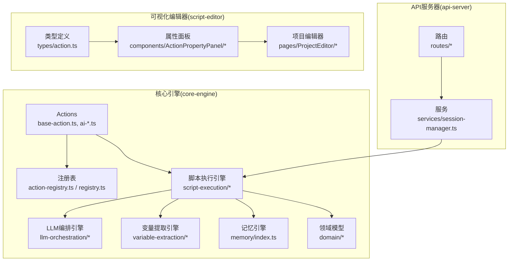
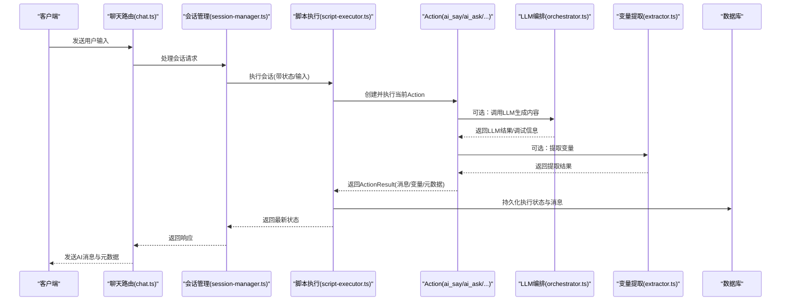
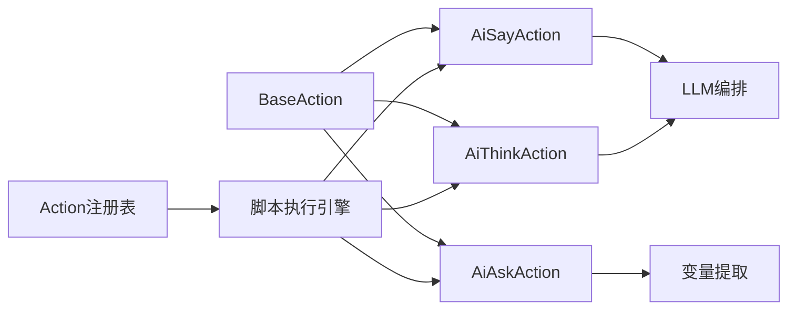

# 自定义Action开发

<cite>
**本文引用的文件**
- [packages/core-engine/src/actions/base-action.ts](file://packages/core-engine/src/actions/base-action.ts)
- [packages/core-engine/src/actions/ai-ask-action.ts](file://packages/core-engine/src/actions/ai-ask-action.ts)
- [packages/core-engine/src/actions/ai-say-action.ts](file://packages/core-engine/src/actions/ai-say-action.ts)
- [packages/core-engine/src/actions/ai-think-action.ts](file://packages/core-engine/src/actions/ai-think-action.ts)
- [packages/core-engine/src/actions/action-registry.ts](file://packages/core-engine/src/actions/action-registry.ts)
- [packages/core-engine/src/actions/registry.ts](file://packages/core-engine/src/actions/registry.ts)
- [packages/core-engine/src/domain/message.ts](file://packages/core-engine/src/domain/message.ts)
- [packages/core-engine/src/domain/script.ts](file://packages/core-engine/src/domain/script.ts)
- [packages/core-engine/src/domain/session.ts](file://packages/core-engine/src/domain/session.ts)
- [packages/core-engine/src/domain/variable.ts](file://packages/core-engine/src/domain/variable.ts)
- [packages/core-engine/src/engines/script-execution/executor.ts](file://packages/core-engine/src/engines/script-execution/executor.ts)
- [packages/core-engine/src/engines/script-execution/script-executor.ts](file://packages/core-engine/src/engines/script-execution/script-executor.ts)
- [packages/core-engine/src/engines/script-execution/yaml-parser.ts](file://packages/core-engine/src/engines/script-execution/yaml-parser.ts)
- [packages/core-engine/src/engines/llm-orchestration/orchestrator.ts](file://packages/core-engine/src/engines/llm-orchestration/orchestrator.ts)
- [packages/core-engine/src/engines/llm-orchestration/providers.ts](file://packages/core-engine/src/engines/llm-orchestration/providers.ts)
- [packages/core-engine/src/engines/variable-extraction/extractor.ts](file://packages/core-engine/src/engines/variable-extraction/extractor.ts)
- [packages/core-engine/src/engines/memory/index.ts](file://packages/core-engine/src/engines/memory/index.ts)
- [packages/api-server/src/routes/chat.ts](file://packages/api-server/src/routes/chat.ts)
- [packages/api-server/src/routes/scripts.ts](file://packages/api-server/src/routes/scripts.ts)
- [packages/api-server/src/services/session-manager.ts](file://packages/api-server/src/services/session-manager.ts)
- [packages/api-server/src/utils/error-handler.ts](file://packages/api-server/src/utils/error-handler.ts)
- [packages/api-server/test-action-state.ts](file://packages/api-server/test-action-state.ts)
- [packages/api-server/test-full-flow.ts](file://packages/api-server/test-full-flow.ts)
- [packages/api-server/test-session-flow.ts](file://packages/api-server/test-session-flow.ts)
- [packages/script-editor/src/types/action.ts](file://packages/script-editor/src/types/action.ts)
- [packages/script-editor/src/components/ActionPropertyPanel/index.tsx](file://packages/script-editor/src/components/ActionPropertyPanel/index.tsx)
- [packages/script-editor/src/pages/ProjectEditor/index.tsx](file://packages/script-editor/src/pages/ProjectEditor/index.tsx)
- [scripts/sessions/cbt_depression_assessment.yaml](file://scripts/sessions/cbt_depression_assessment.yaml)
- [scripts/techniques/socratic_questioning.yaml](file://scripts/techniques/socratic_questioning.yaml)
- [docs/DEVELOPMENT_GUIDE.md](file://docs/DEVELOPMENT_GUIDE.md)
- [docs/NEW_ACTION_CONFIG_GUIDE.md](file://docs/NEW_ACTION_CONFIG_GUIDE.md)
- [docs/ACTION_CONFIG_COMPARISON.md](file://docs/ACTION_CONFIG_COMPARISON.md)
</cite>

## 目录
1. [简介](#简介)
2. [项目结构](#项目结构)
3. [核心组件](#核心组件)
4. [架构总览](#架构总览)
5. [详细组件分析](#详细组件分析)
6. [依赖分析](#依赖分析)
7. [性能考量](#性能考量)
8. [故障排查指南](#故障排查指南)
9. [结论](#结论)
10. [附录](#附录)

## 简介
本指南面向希望为 HeartRule AI 咨询引擎开发“自定义 Action”的工程师，系统讲解如何继承 BaseAction 类创建自定义 Action，涵盖必需实现方法、可选扩展功能、开发流程、配置参数设计原则与最佳实践、调试与测试方法、注册与集成步骤、版本管理与向后兼容、以及性能优化与错误处理建议。文档以仓库内现有 Action（ai_say、ai_ask、ai_think）为范例，结合脚本执行引擎、LLM 编排引擎、变量提取引擎与可视化编辑器的实现，帮助读者快速上手并高质量交付。

## 项目结构
- 核心引擎（packages/core-engine）：包含 Action 抽象基类、内置 Action 实现、脚本执行引擎、LLM 编排引擎、变量提取引擎、内存引擎与领域模型。
- API 服务器（packages/api-server）：提供会话管理、聊天路由、脚本导入与测试脚本。
- 可视化脚本编辑器（packages/script-editor）：提供 Action 配置的可视化编辑、YAML 双向映射与类型定义。
- 示例脚本（scripts/）：包含会话脚本与咨询技术脚本，展示 Action 的典型组合与配置。

图表来源
- [packages/core-engine/src/actions/base-action.ts](file://packages/core-engine/src/actions/base-action.ts#L1-L99)
- [packages/core-engine/src/actions/action-registry.ts](file://packages/core-engine/src/actions/action-registry.ts#L1-L46)
- [packages/core-engine/src/actions/registry.ts](file://packages/core-engine/src/actions/registry.ts#L1-L46)
- [packages/core-engine/src/engines/script-execution/script-executor.ts](file://packages/core-engine/src/engines/script-execution/script-executor.ts)
- [packages/core-engine/src/engines/llm-orchestration/orchestrator.ts](file://packages/core-engine/src/engines/llm-orchestration/orchestrator.ts)
- [packages/core-engine/src/engines/variable-extraction/extractor.ts](file://packages/core-engine/src/engines/variable-extraction/extractor.ts)
- [packages/api-server/src/routes/chat.ts](file://packages/api-server/src/routes/chat.ts)
- [packages/api-server/src/services/session-manager.ts](file://packages/api-server/src/services/session-manager.ts)
- [packages/script-editor/src/types/action.ts](file://packages/script-editor/src/types/action.ts#L1-L126)

章节来源
- [packages/core-engine/src/actions/base-action.ts](file://packages/core-engine/src/actions/base-action.ts#L1-L99)
- [packages/core-engine/src/actions/action-registry.ts](file://packages/core-engine/src/actions/action-registry.ts#L1-L46)
- [packages/core-engine/src/actions/registry.ts](file://packages/core-engine/src/actions/registry.ts#L1-L46)
- [packages/core-engine/src/engines/script-execution/script-executor.ts](file://packages/core-engine/src/engines/script-execution/script-executor.ts)
- [packages/core-engine/src/engines/llm-orchestration/orchestrator.ts](file://packages/core-engine/src/engines/llm-orchestration/orchestrator.ts)
- [packages/core-engine/src/engines/variable-extraction/extractor.ts](file://packages/core-engine/src/engines/variable-extraction/extractor.ts)
- [packages/api-server/src/routes/chat.ts](file://packages/api-server/src/routes/chat.ts)
- [packages/api-server/src/services/session-manager.ts](file://packages/api-server/src/services/session-manager.ts)
- [packages/script-editor/src/types/action.ts](file://packages/script-editor/src/types/action.ts#L1-L126)

## 核心组件
- Action 抽象基类与类型定义：定义 ActionContext、ActionResult、BaseAction 的公共接口与通用能力（变量替换、轮次控制、重置等）。
- 内置 Action 实现：ai_say、ai_ask、ai_think 分别覆盖“传达信息”“引导式提问”“内部思考”的典型交互模式。
- Action 注册表：集中管理 Action 类型与实例创建，支持扩展注册。
- 脚本执行引擎：解析 YAML 脚本、驱动 Action 执行、维护会话状态与变量。
- LLM 编排引擎：统一调度不同 LLM 提供商，注入调试信息。
- 变量提取引擎：从用户输入中抽取结构化变量。
- 可视化编辑器：提供 Action 配置的 UI，实现 YAML 与前端数据结构的双向映射。

章节来源
- [packages/core-engine/src/actions/base-action.ts](file://packages/core-engine/src/actions/base-action.ts#L1-L99)
- [packages/core-engine/src/actions/ai-say-action.ts](file://packages/core-engine/src/actions/ai-say-action.ts#L1-L105)
- [packages/core-engine/src/actions/ai-ask-action.ts](file://packages/core-engine/src/actions/ai-ask-action.ts#L1-L207)
- [packages/core-engine/src/actions/ai-think-action.ts](file://packages/core-engine/src/actions/ai-think-action.ts#L1-L57)
- [packages/core-engine/src/actions/action-registry.ts](file://packages/core-engine/src/actions/action-registry.ts#L1-L46)
- [packages/core-engine/src/actions/registry.ts](file://packages/core-engine/src/actions/registry.ts#L1-L46)
- [packages/core-engine/src/engines/script-execution/script-executor.ts](file://packages/core-engine/src/engines/script-execution/script-executor.ts)
- [packages/core-engine/src/engines/llm-orchestration/orchestrator.ts](file://packages/core-engine/src/engines/llm-orchestration/orchestrator.ts)
- [packages/core-engine/src/engines/variable-extraction/extractor.ts](file://packages/core-engine/src/engines/variable-extraction/extractor.ts)
- [packages/script-editor/src/types/action.ts](file://packages/script-editor/src/types/action.ts#L1-L126)

## 架构总览
Action 的生命周期贯穿“脚本解析—会话管理—Action 执行—状态持久化—消息生成—变量提取—LLM 调用—结果返回”。下图展示了 Action 与各子系统的交互关系。

图表来源
- [packages/api-server/src/routes/chat.ts](file://packages/api-server/src/routes/chat.ts)
- [packages/api-server/src/services/session-manager.ts](file://packages/api-server/src/services/session-manager.ts)
- [packages/core-engine/src/engines/script-execution/script-executor.ts](file://packages/core-engine/src/engines/script-execution/script-executor.ts)
- [packages/core-engine/src/actions/ai-say-action.ts](file://packages/core-engine/src/actions/ai-say-action.ts#L1-L105)
- [packages/core-engine/src/actions/ai-ask-action.ts](file://packages/core-engine/src/actions/ai-ask-action.ts#L1-L207)
- [packages/core-engine/src/engines/llm-orchestration/orchestrator.ts](file://packages/core-engine/src/engines/llm-orchestration/orchestrator.ts)
- [packages/core-engine/src/engines/variable-extraction/extractor.ts](file://packages/core-engine/src/engines/variable-extraction/extractor.ts)

## 详细组件分析

### BaseAction 抽象基类与接口契约
- 必需实现
  - execute(context, userInput?): Promise<ActionResult>：Action 的核心执行逻辑，返回标准化的结果对象。
- 可选扩展
  - reset()：重置 Action 状态（轮次、中间变量等）。
  - isCompleted()：判断 Action 是否完成（多轮交互时常用）。
  - getVariable(context, varName, defaultValue)：便捷读取上下文变量。
  - substituteVariables(template, context)：模板变量替换（支持 ${var}）。
- 关键字段
  - actionId、config、currentRound、maxRounds：标识、配置、轮次控制。
- 设计要点
  - ActionResult.success/completed/aiMessage/extractedVariables/nextAction/error/metadata/debugInfo：统一输出结构，便于上层消费与持久化。
  - ActionContext.sessionId/phaseId/topicId/actionId/variables/conversationHistory/metadata：标准化上下文，保证 Action 可观测与可追踪。

章节来源
- [packages/core-engine/src/actions/base-action.ts](file://packages/core-engine/src/actions/base-action.ts#L1-L99)

### AiSayAction：传达信息与确认机制
- 行为特征
  - require_acknowledgment 默认 true：需要用户确认后继续；false 时立即完成。
  - 多轮交互：第一轮发送消息并等待确认，第二轮收到确认后完成。
  - 模板变量替换：支持 content_template/prompt_template/content 的优先级。
- 典型配置
  - require_acknowledgment、max_rounds、tone 等。
- 测试与验证
  - 通过会话流程测试验证“无需确认”与“需要确认”的两种模式。

章节来源
- [packages/core-engine/src/actions/ai-say-action.ts](file://packages/core-engine/src/actions/ai-say-action.ts#L1-L105)
- [docs/NEW_ACTION_CONFIG_GUIDE.md](file://docs/NEW_ACTION_CONFIG_GUIDE.md#L1-L310)

### AiAskAction：引导式提问与变量提取
- 行为特征
  - 多轮交互：第一轮发送问题模板，后续轮次处理用户输入与校验。
  - 输入校验：支持 required/min_length/max_length/pattern 等规则。
  - 变量提取：支持单变量 target_variable 与多变量 output 结构。
  - 重试与错误：达到 max_rounds 后返回失败，否则提示重试。
- 典型配置
  - question_template/target_variable/extraction_prompt/validation/required/max_rounds/output 等。
- 测试与验证
  - 通过 Action 状态持久化测试验证轮次推进与变量提取。

章节来源
- [packages/core-engine/src/actions/ai-ask-action.ts](file://packages/core-engine/src/actions/ai-ask-action.ts#L1-L207)
- [docs/NEW_ACTION_CONFIG_GUIDE.md](file://docs/NEW_ACTION_CONFIG_GUIDE.md#L1-L310)

### AiThinkAction：内部思考与占位实现
- 行为特征
  - MVP 占位：直接生成占位变量值，不实际调用 LLM。
  - 支持 think_goal 与 output_variables，便于后续接入真实推理。
- 扩展建议
  - 集成 LLM 编排引擎，按 think_goal 生成推理结果并写入 extractedVariables。

章节来源
- [packages/core-engine/src/actions/ai-think-action.ts](file://packages/core-engine/src/actions/ai-think-action.ts#L1-L57)

### Action 注册与创建
- 方式一：action-registry.ts（集中注册）
  - ACTION_REGISTRY 映射 actionType 到 ActionClass。
  - registerAction(actionType, actionClass)：动态注册。
  - createAction(actionType, actionId, config)：工厂创建实例。
- 方式二：registry.ts（Map 形式注册）
  - ACTION_REGISTRY 为 Map，提供 registerAction/getActionClass/createAction。
- 集成要点
  - 在应用启动时注册自定义 Action 类型。
  - 脚本执行时通过 action_type 字段定位 Action 类型。

章节来源
- [packages/core-engine/src/actions/action-registry.ts](file://packages/core-engine/src/actions/action-registry.ts#L1-L46)
- [packages/core-engine/src/actions/registry.ts](file://packages/core-engine/src/actions/registry.ts#L1-L46)

### 脚本执行与状态管理
- 脚本解析
  - yaml-parser.ts：将 YAML 脚本解析为执行模型。
- 执行引擎
  - script-executor.ts：驱动 Action 执行，维护执行状态、位置索引与变量。
  - executor.ts：封装执行流程，处理 Action 的 completed 与 nextAction。
- 会话管理
  - session-manager.ts：对外提供会话接口，协调执行与持久化。
- 消息与变量
  - message.ts：消息实体，携带 actionId 与 metadata。
  - variable.ts：变量模型，支持会话内传递与持久化。

章节来源
- [packages/core-engine/src/engines/script-execution/yaml-parser.ts](file://packages/core-engine/src/engines/script-execution/yaml-parser.ts)
- [packages/core-engine/src/engines/script-execution/script-executor.ts](file://packages/core-engine/src/engines/script-execution/script-executor.ts)
- [packages/core-engine/src/engines/script-execution/executor.ts](file://packages/core-engine/src/engines/script-execution/executor.ts)
- [packages/api-server/src/services/session-manager.ts](file://packages/api-server/src/services/session-manager.ts)
- [packages/core-engine/src/domain/message.ts](file://packages/core-engine/src/domain/message.ts#L1-L49)
- [packages/core-engine/src/domain/variable.ts](file://packages/core-engine/src/domain/variable.ts)

### LLM 编排与变量提取
- LLM 编排
  - orchestrator.ts：统一调度，注入 LLM 调用与调试信息（如 LLMDebugInfo），供 Action.Result.debugInfo 使用。
  - providers.ts：提供不同提供商适配。
- 变量提取
  - extractor.ts：从用户输入中提取结构化变量，配合 Action 的 extraction_prompt 使用。

章节来源
- [packages/core-engine/src/engines/llm-orchestration/orchestrator.ts](file://packages/core-engine/src/engines/llm-orchestration/orchestrator.ts)
- [packages/core-engine/src/engines/llm-orchestration/providers.ts](file://packages/core-engine/src/engines/llm-orchestration/providers.ts)
- [packages/core-engine/src/engines/variable-extraction/extractor.ts](file://packages/core-engine/src/engines/variable-extraction/extractor.ts)

### 可视化编辑器与配置映射
- 类型定义
  - types/action.ts：定义 AiSayAction/AiAskAction/AiThinkAction 等接口，包含新增字段（如 require_acknowledgment、question_template、target_variable、extraction_prompt、output 等）。
- 属性面板
  - components/ActionPropertyPanel/index.tsx：渲染 UI 控件，绑定配置项。
- 项目编辑器
  - pages/ProjectEditor/index.tsx：实现 YAML 与前端数据结构的双向映射（parseYamlToScript 与 syncPhasesToYaml）。
- 兼容性
  - 新字段均为可选，保持向后兼容；默认值策略确保安全与可用性。

章节来源
- [packages/script-editor/src/types/action.ts](file://packages/script-editor/src/types/action.ts#L1-L126)
- [packages/script-editor/src/components/ActionPropertyPanel/index.tsx](file://packages/script-editor/src/components/ActionPropertyPanel/index.tsx)
- [packages/script-editor/src/pages/ProjectEditor/index.tsx](file://packages/script-editor/src/pages/ProjectEditor/index.tsx)
- [docs/NEW_ACTION_CONFIG_GUIDE.md](file://docs/NEW_ACTION_CONFIG_GUIDE.md#L1-L310)
- [docs/ACTION_CONFIG_COMPARISON.md](file://docs/ACTION_CONFIG_COMPARISON.md#L1-L253)

## 依赖分析
- 组件耦合
  - Action 仅依赖 BaseAction 与上下文接口，低耦合高内聚。
  - 脚本执行引擎依赖注册表与 Action 类型，通过工厂创建实例。
  - LLM 编排与变量提取作为可插拔引擎，由 Action 或执行器按需调用。
- 外部依赖
  - YAML 解析、数据库（Drizzle ORM）、消息队列/缓存（可选）。
- 循环依赖
  - 通过模块化拆分避免循环依赖；注册表与 Action 类解耦。

图表来源
- [packages/core-engine/src/actions/base-action.ts](file://packages/core-engine/src/actions/base-action.ts#L1-L99)
- [packages/core-engine/src/actions/ai-say-action.ts](file://packages/core-engine/src/actions/ai-say-action.ts#L1-L105)
- [packages/core-engine/src/actions/ai-ask-action.ts](file://packages/core-engine/src/actions/ai-ask-action.ts#L1-L207)
- [packages/core-engine/src/actions/ai-think-action.ts](file://packages/core-engine/src/actions/ai-think-action.ts#L1-L57)
- [packages/core-engine/src/actions/action-registry.ts](file://packages/core-engine/src/actions/action-registry.ts#L1-L46)
- [packages/core-engine/src/engines/script-execution/script-executor.ts](file://packages/core-engine/src/engines/script-execution/script-executor.ts)
- [packages/core-engine/src/engines/llm-orchestration/orchestrator.ts](file://packages/core-engine/src/engines/llm-orchestration/orchestrator.ts)
- [packages/core-engine/src/engines/variable-extraction/extractor.ts](file://packages/core-engine/src/engines/variable-extraction/extractor.ts)

## 性能考量
- 执行效率
  - 将长耗时操作（如 LLM 调用）异步化，避免阻塞事件循环。
  - 合理设置 max_rounds，防止无限轮次导致性能下降。
- 内存占用
  - 控制 conversationHistory 的大小，定期清理无关历史。
  - 使用 Map/Set 存储临时状态，及时释放不再使用的对象。
- 网络与并发
  - LLM Provider 并发限制与限流策略，避免触发风控。
  - 批量写入数据库，减少事务开销。
- 缓存与预热
  - 对热点模板与常见变量进行缓存，降低重复计算成本。

## 故障排查指南
- 常见问题
  - Action 未注册：检查注册表是否包含自定义 actionType。
  - 状态未持久化：确认 metadata.actionState 是否保存，以及会话恢复逻辑是否正确。
  - 变量未提取：核对 extraction_prompt 与 target_variable/output 配置。
  - LLM 调用失败：检查 API Key、网络连通性与 Provider 配置。
- 调试技巧
  - 在 Action.execute 中打印上下文与配置，定位输入输出。
  - 使用测试脚本（test-action-state.ts、test-session-flow.ts、test-full-flow.ts）模拟多轮对话与状态恢复。
  - 通过 API 路由与会话管理器查看执行状态与消息历史。
- 错误处理
  - 统一捕获异常并返回 ActionResult.error，避免抛出未处理异常。
  - 使用 errorHandler.ts 统一处理错误码与日志记录。

章节来源
- [packages/api-server/test-action-state.ts](file://packages/api-server/test-action-state.ts#L1-L173)
- [packages/api-server/test-session-flow.ts](file://packages/api-server/test-session-flow.ts#L1-L140)
- [packages/api-server/test-full-flow.ts](file://packages/api-server/test-full-flow.ts#L1-L208)
- [packages/api-server/src/utils/error-handler.ts](file://packages/api-server/src/utils/error-handler.ts)
- [packages/api-server/src/routes/chat.ts](file://packages/api-server/src/routes/chat.ts)
- [packages/api-server/src/services/session-manager.ts](file://packages/api-server/src/services/session-manager.ts)

## 结论
通过遵循 BaseAction 的接口契约、合理设计 Action 配置、利用注册表与脚本执行引擎、结合可视化编辑器与测试体系，开发者可以高效地创建高质量的自定义 Action，并确保其在真实会话中的稳定性与可维护性。建议在开发过程中始终关注向后兼容、可观测性与性能优化，逐步将 Action 与 LLM 编排与变量提取引擎深度集成，提升整体交互质量。

## 附录

### 开发流程（从需求到上线）
- 需求分析
  - 明确 Action 的目标、交互轮次、变量提取需求与错误处理策略。
- 类设计
  - 继承 BaseAction，定义 config 字段与 execute 逻辑。
  - 如需多轮交互，合理设置 max_rounds 并在 ActionResult 中返回 metadata。
- 实现编码
  - 在 packages/core-engine/src/actions/ 下创建文件，实现 execute 并调用 substituteVariables 等工具。
  - 在 action-registry.ts 或 registry.ts 中注册自定义 Action 类型。
- 配置设计
  - 在 types/action.ts 中扩展接口，确保可视化编辑器支持新字段。
  - 在 ProjectEditor 与 ActionPropertyPanel 中完成 YAML 与 UI 的双向映射。
- 测试验证
  - 使用 test-action-state.ts、test-session-flow.ts、test-full-flow.ts 验证状态持久化与多轮交互。
  - 在 API 服务器中编写集成测试，模拟真实会话流程。
- 集成发布
  - 在 API 服务器路由与会话管理器中集成新 Action。
  - 更新文档与示例脚本（如 scripts/sessions/cbt_depression_assessment.yaml）。

章节来源
- [docs/DEVELOPMENT_GUIDE.md](file://docs/DEVELOPMENT_GUIDE.md#L111-L139)
- [packages/core-engine/src/actions/action-registry.ts](file://packages/core-engine/src/actions/action-registry.ts#L1-L46)
- [packages/core-engine/src/actions/registry.ts](file://packages/core-engine/src/actions/registry.ts#L1-L46)
- [packages/script-editor/src/types/action.ts](file://packages/script-editor/src/types/action.ts#L1-L126)
- [packages/script-editor/src/pages/ProjectEditor/index.tsx](file://packages/script-editor/src/pages/ProjectEditor/index.tsx)
- [packages/script-editor/src/components/ActionPropertyPanel/index.tsx](file://packages/script-editor/src/components/ActionPropertyPanel/index.tsx)
- [packages/api-server/test-action-state.ts](file://packages/api-server/test-action-state.ts#L1-L173)
- [packages/api-server/test-session-flow.ts](file://packages/api-server/test-session-flow.ts#L1-L140)
- [packages/api-server/test-full-flow.ts](file://packages/api-server/test-full-flow.ts#L1-L208)

### Action 配置参数设计原则与最佳实践
- 一致性
  - 字段命名采用语义化（如 question_template、target_variable），避免同义字段重复。
- 可选性与默认值
  - 新增字段保持可选，提供合理默认值，确保向后兼容。
- 可观测性
  - 在 ActionResult.metadata 中记录关键元数据（如 waitingFor、validationFailed、actionType 等）。
- 可测试性
  - 将业务逻辑与模板/LLM 调用解耦，便于单元测试与集成测试。
- 可维护性
  - 将配置项与 UI 控件一一对应，保持 YAML 与前端数据结构的稳定映射。

章节来源
- [docs/NEW_ACTION_CONFIG_GUIDE.md](file://docs/NEW_ACTION_CONFIG_GUIDE.md#L1-L310)
- [docs/ACTION_CONFIG_COMPARISON.md](file://docs/ACTION_CONFIG_COMPARISON.md#L1-L253)
- [packages/script-editor/src/types/action.ts](file://packages/script-editor/src/types/action.ts#L1-L126)

### 注册与集成步骤
- 注册自定义 Action
  - 在 action-registry.ts 或 registry.ts 中注册 actionType 与类。
- 脚本中使用
  - 在 YAML 脚本中设置 action_type 与 config。
- 前端可视化
  - 在 types/action.ts 中扩展接口，在 ActionPropertyPanel 与 ProjectEditor 中完成映射。
- 后端路由与会话管理
  - 确保会话管理器与脚本执行引擎可识别并创建新 Action 实例。

章节来源
- [packages/core-engine/src/actions/action-registry.ts](file://packages/core-engine/src/actions/action-registry.ts#L1-L46)
- [packages/core-engine/src/actions/registry.ts](file://packages/core-engine/src/actions/registry.ts#L1-L46)
- [packages/script-editor/src/types/action.ts](file://packages/script-editor/src/types/action.ts#L1-L126)
- [packages/script-editor/src/components/ActionPropertyPanel/index.tsx](file://packages/script-editor/src/components/ActionPropertyPanel/index.tsx)
- [packages/script-editor/src/pages/ProjectEditor/index.tsx](file://packages/script-editor/src/pages/ProjectEditor/index.tsx)
- [packages/api-server/src/services/session-manager.ts](file://packages/api-server/src/services/session-manager.ts)

### 版本管理与向后兼容
- 向后兼容
  - 新增字段为可选，未设置时使用默认值；旧版 YAML 可正常加载。
- 版本演进
  - 通过默认值策略与类型定义扩展，平滑引入新能力（如 require_acknowledgment、question_template 等）。
- 测试保障
  - 使用 test-new-config-import.ts 与相关测试脚本验证兼容性与映射正确性。

章节来源
- [docs/NEW_ACTION_CONFIG_GUIDE.md](file://docs/NEW_ACTION_CONFIG_GUIDE.md#L201-L217)
- [packages/api-server/test-new-config-import.ts](file://packages/api-server/test-new-config-import.ts)

### 实战案例
- 案例一：特定咨询技术的 Action 实现
  - 参考苏格拉底式提问技术脚本（techniques/socratic_questioning.yaml），通过一系列 ai_say/ai_ask/ai_think 组合，引导来访者检验与重构认知。
- 案例二：特殊交互逻辑的 Action
  - 在 cbt_depression_assessment.yaml 中，演示“无需确认”的 ai_say 与“必填信息收集”的 ai_ask 的组合使用，体现不同交互策略的落地。

章节来源
- [scripts/techniques/socratic_questioning.yaml](file://scripts/techniques/socratic_questioning.yaml#L1-L110)
- [scripts/sessions/cbt_depression_assessment.yaml](file://scripts/sessions/cbt_depression_assessment.yaml#L1-L166)