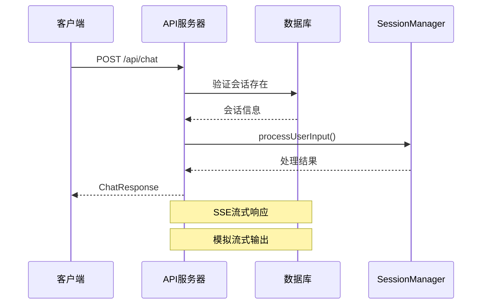

# API请求响应类型

<cite>
**本文档引用的文件**
- [requests.ts](file://packages/shared-types/src/api/requests.ts)
- [responses.ts](file://packages/shared-types/src/api/responses.ts)
- [enums.ts](file://packages/shared-types/src/enums.ts)
- [chat.ts](file://packages/api-server/src/routes/chat.ts)
- [sessions.ts](file://packages/api-server/src/routes/sessions.ts)
- [scripts.ts](file://packages/api-server/src/routes/scripts.ts)
- [projects.ts](file://packages/api-server/src/routes/projects.ts)
- [versions.ts](file://packages/api-server/src/routes/versions.ts)
- [error-handler.ts](file://packages/api-server/src/utils/error-handler.ts)
- [app.ts](file://packages/api-server/src/app.ts)
- [message.ts](file://packages/shared-types/src/domain/message.ts)
- [script.ts](file://packages/shared-types/src/domain/script.ts)
- [session.ts](file://packages/shared-types/src/domain/session.ts)
</cite>

## 目录
1. [简介](#简介)
2. [项目结构概览](#项目结构概览)
3. [核心类型系统](#核心类型系统)
4. [会话管理API](#会话管理api)
5. [聊天交互API](#聊天交互api)
6. [脚本管理API](#脚本管理api)
7. [项目管理API](#项目管理api)
8. [版本管理API](#版本管理api)
9. [错误处理机制](#错误处理机制)
10. [Zod Schema验证](#zod-schema验证)
11. [API调用示例](#api调用示例)
12. [扩展新API端点](#扩展新api端点)
13. [总结](#总结)

## 简介

HeartRule AI咨询引擎是一个基于LLM和YAML脚本的认知行为疗法AI咨询系统。本文档详细说明了所有REST API的请求参数类型、响应数据类型和错误处理类型的设计，深入解释了Zod Schema的验证机制和类型安全保证，阐述了HTTP方法、URL模式、请求头和响应头的类型定义，并提供了具体的API调用示例。

## 项目结构概览

系统采用分层架构设计，主要分为以下层次：


**图表来源**
- [app.ts](file://packages/api-server/src/app.ts#L21-L105)
- [sessions.ts](file://packages/api-server/src/routes/sessions.ts#L13-L133)
- [chat.ts](file://packages/api-server/src/routes/chat.ts#L15-L152)

**章节来源**
- [app.ts](file://packages/api-server/src/app.ts#L1-L135)

## 核心类型系统

### 类型安全架构

系统实现了完整的类型安全架构，通过Zod Schema确保运行时数据验证和编译时类型推断的双重保障。


**图表来源**
- [requests.ts](file://packages/shared-types/src/api/requests.ts#L6-L16)
- [responses.ts](file://packages/shared-types/src/api/responses.ts#L89-L93)
- [responses.ts](file://packages/shared-types/src/api/responses.ts#L68-L84)

### 枚举类型系统

系统定义了完整的枚举类型体系，确保状态值的一致性和类型安全：


**图表来源**
- [enums.ts](file://packages/shared-types/src/enums.ts#L6-L22)
- [enums.ts](file://packages/shared-types/src/enums.ts#L36-L49)
- [enums.ts](file://packages/shared-types/src/enums.ts#L83-L105)

**章节来源**
- [enums.ts](file://packages/shared-types/src/enums.ts#L1-L118)

## 会话管理API

### 创建会话

**HTTP方法**: POST  
**URL模式**: `/api/sessions`  
**请求体类型**: CreateSessionRequest  
**响应类型**: SessionResponse 或 DetailedApiError


**图表来源**
- [sessions.ts](file://packages/api-server/src/routes/sessions.ts#L15-L133)
- [requests.ts](file://packages/shared-types/src/api/requests.ts#L12-L16)
- [responses.ts](file://packages/shared-types/src/api/responses.ts#L113-L129)

**请求参数定义**:
- `userId`: string (必填，最小长度1)
- `scriptId`: string (必填，UUID格式)
- `initialVariables`: Record<string, unknown> (可选)

**响应数据定义**:
- `sessionId`: string (UUID格式)
- `status`: string (会话状态)
- `createdAt`: string (ISO 8601日期字符串)
- `aiMessage`: string (可选)
- `executionStatus`: string (可选)
- `position`: DetailedExecutionPosition (可选)

**状态码映射**:
- 201: 创建成功
- 400: 请求参数验证失败
- 404: 脚本不存在
- 500: 服务器内部错误

**章节来源**
- [sessions.ts](file://packages/api-server/src/routes/sessions.ts#L15-L133)
- [requests.ts](file://packages/shared-types/src/api/requests.ts#L6-L16)
- [responses.ts](file://packages/shared-types/src/api/responses.ts#L113-L129)

### 获取会话详情

**HTTP方法**: GET  
**URL模式**: `/api/sessions/:id`  
**路径参数**: id (string, UUID格式)


**图表来源**
- [sessions.ts](file://packages/api-server/src/routes/sessions.ts#L136-L246)

**响应数据增强**:
会话详情响应包含扩展的位置信息，包含ID字段用于前端导航树定位。

**章节来源**
- [sessions.ts](file://packages/api-server/src/routes/sessions.ts#L136-L246)

### 会话消息管理

**获取消息历史**:
- **方法**: GET `/api/sessions/:id/messages`
- **响应**: 包含消息数组的结构化响应

**发送消息**:
- **方法**: POST `/api/sessions/:id/messages`
- **请求体**: 包含 `content` 字段
- **响应**: 包含AI回复、状态信息和可选错误

**章节来源**
- [sessions.ts](file://packages/api-server/src/routes/sessions.ts#L249-L471)

## 聊天交互API

### 非流式聊天

**HTTP方法**: POST  
**URL模式**: `/api/chat`



**图表来源**
- [chat.ts](file://packages/api-server/src/routes/chat.ts#L17-L79)

**请求参数**:
- `sessionId`: string (UUID格式)
- `message`: string (最小长度1)

**响应数据**:
- `aiMessage`: string
- `sessionStatus`: string
- `executionStatus`: string
- `extractedVariables`: Record<string, unknown> (可选)
- `variables`: Record<string, unknown> (可选)
- `position`: DetailedExecutionPosition (可选)

**章节来源**
- [chat.ts](file://packages/api-server/src/routes/chat.ts#L17-L79)

### 流式聊天 (Server-Sent Events)

**HTTP方法**: POST  
**URL模式**: `/api/chat/stream`

该端点支持SSE流式响应，设置特定的响应头：
- `Content-Type: text/event-stream`
- `Cache-Control: no-cache`
- `Connection: keep-alive`

**章节来源**
- [chat.ts](file://packages/api-server/src/routes/chat.ts#L82-L151)

## 脚本管理API

### 创建脚本

**HTTP方法**: POST  
**URL模式**: `/api/scripts`


**图表来源**
- [scripts.ts](file://packages/api-server/src/routes/scripts.ts#L14-L85)

**请求参数**:
- `scriptName`: string (必填，最小长度1)
- `scriptType`: string (必填)
- `scriptContent`: string (必填)
- `author`: string (必填)
- `description`: string (可选)
- `tags`: string[] (可选)

**响应数据**:
- 脚本的完整信息，包括解析后的YAML内容

**章节来源**
- [scripts.ts](file://packages/api-server/src/routes/scripts.ts#L14-L85)

### 脚本列表和详情

**获取脚本列表**: GET `/api/scripts`  
**获取脚本详情**: GET `/api/scripts/:id`

**章节来源**
- [scripts.ts](file://packages/api-server/src/routes/scripts.ts#L87-L169)

### 脚本导入和验证

**导入脚本**: POST `/api/scripts/import`  
**验证脚本**: POST `/api/scripts/:id/validate`

**章节来源**
- [scripts.ts](file://packages/api-server/src/routes/scripts.ts#L171-L324)

## 项目管理API

### 工程管理

**获取工程列表**: GET `/api/projects`  
**获取工程详情**: GET `/api/projects/:id`  
**创建工程**: POST `/api/projects`  
**更新工程**: PUT `/api/projects/:id`  
**归档工程**: DELETE `/api/projects/:id`  
**复制工程**: POST `/api/projects/:id/copy`


**图表来源**
- [projects.ts](file://packages/api-server/src/routes/projects.ts#L9-L24)

**章节来源**
- [projects.ts](file://packages/api-server/src/routes/projects.ts#L26-L497)

### 文件管理

**获取文件列表**: GET `/api/projects/:id/files`  
**获取单个文件**: GET `/api/projects/:id/files/:fileId`  
**创建文件**: POST `/api/projects/:id/files`  
**更新文件**: PUT `/api/projects/:id/files/:fileId`  
**删除文件**: DELETE `/api/projects/:id/files/:fileId`

**章节来源**
- [projects.ts](file://packages/api-server/src/routes/projects.ts#L340-L496)

## 版本管理API

### 草稿管理

**获取草稿**: GET `/api/projects/:id/draft`  
**保存草稿**: PUT `/api/projects/:id/draft`

**章节来源**
- [versions.ts](file://packages/api-server/src/routes/versions.ts#L21-L115)

### 版本发布和回滚

**发布版本**: POST `/api/projects/:id/publish`  
**获取版本历史**: GET `/api/projects/:id/versions`  
**获取单个版本**: GET `/api/projects/:id/versions/:versionId`  
**回滚到版本**: POST `/api/projects/:id/rollback`  
**版本对比**: GET `/api/projects/:id/versions/:versionId/diff`


**图表来源**
- [versions.ts](file://packages/api-server/src/routes/versions.ts#L118-L334)

**章节来源**
- [versions.ts](file://packages/api-server/src/routes/versions.ts#L20-L407)

## 错误处理机制

### 统一错误响应格式

系统实现了统一的错误处理机制，确保所有API错误响应具有一致的结构：


**图表来源**
- [responses.ts](file://packages/shared-types/src/api/responses.ts#L98-L108)
- [responses.ts](file://packages/shared-types/src/api/responses.ts#L68-L84)
- [responses.ts](file://packages/shared-types/src/api/responses.ts#L34-L48)
- [responses.ts](file://packages/shared-types/src/api/responses.ts#L53-L63)

### 错误映射和恢复策略

系统内置了错误映射表，根据错误消息自动匹配相应的错误类型和恢复建议：

| 错误消息关键词 | 错误代码 | 错误类型 | HTTP状态码 | 恢复建议 |
|---------------|----------|----------|------------|----------|
| Script not found | SCRIPT_NOT_FOUND | CONFIGURATION | 404 | 创建新脚本或检查脚本ID |
| Session not found | SESSION_NOT_FOUND | SESSION | 404 | 创建新会话或检查会话ID |
| YAML parse error | SCRIPT_PARSE_ERROR | SYNTAX | 400 | 修复YAML语法错误 |
| LLM service | LLM_SERVICE_ERROR | RUNTIME | 503 | 检查网络连接和LLM服务 |

**章节来源**
- [error-handler.ts](file://packages/api-server/src/utils/error-handler.ts#L22-L71)
- [error-handler.ts](file://packages/api-server/src/utils/error-handler.ts#L95-L181)

## Zod Schema验证

### 验证机制概述

系统使用Zod进行运行时数据验证，确保API请求和响应的数据完整性：

```mermaid
flowchart TD
Request[原始请求数据] --> ZodParse[Zod.parse()]
ZodParse --> Validation{验证通过?}
Validation --> |是| TypedData[类型化数据]
Validation --> |否| ZodError[ZodError]
ZodError --> ErrorHandler[错误处理器]
ErrorHandler --> ErrorResponse[错误响应]
TypedData --> BusinessLogic[业务逻辑]
BusinessLogic --> Response[响应数据]
Response --> ZodSerialize[Zod.serialize()]
ZodSerialize --> FinalResponse[最终响应]
```

**图表来源**
- [sessions.ts](file://packages/api-server/src/routes/sessions.ts#L135-L246)
- [projects.ts](file://packages/api-server/src/routes/projects.ts#L133-L193)

### Schema设计原则

1. **严格类型约束**: 使用精确的类型定义确保数据完整性
2. **可选字段处理**: 明确区分必需和可选字段
3. **枚举验证**: 使用nativeEnum确保枚举值的有效性
4. **复合类型**: 支持嵌套对象和数组的复杂结构验证

**章节来源**
- [requests.ts](file://packages/shared-types/src/api/requests.ts#L12-L50)
- [responses.ts](file://packages/shared-types/src/api/responses.ts#L21-L150)
- [enums.ts](file://packages/shared-types/src/enums.ts#L108-L118)

## API调用示例

### 客户端使用示例

以下示例展示了如何在客户端正确使用这些API类型：

**创建会话 (TypeScript)**:
```typescript
// 定义请求类型
interface CreateSessionRequest {
  userId: string;
  scriptId: string;
  initialVariables?: Record<string, unknown>;
}

// 发送请求
const response = await fetch('/api/sessions', {
  method: 'POST',
  headers: {
    'Content-Type': 'application/json',
  },
  body: JSON.stringify({
    userId: 'user-123',
    scriptId: 'script-uuid',
    initialVariables: {
      mood: 'good',
      stressLevel: 3
    }
  })
});

// 类型安全的响应处理
const sessionData: SessionResponse = await response.json();
console.log(`会话ID: ${sessionData.sessionId}`);
console.log(`AI消息: ${sessionData.aiMessage}`);
```

**处理错误响应**:
```typescript
try {
  const response = await fetch('/api/sessions', {
    method: 'POST',
    headers: {'Content-Type': 'application/json'},
    body: JSON.stringify(requestData)
  });

  if (!response.ok) {
    // 类型安全的错误处理
    const errorData: DetailedApiError = await response.json();
    handleError(errorData);
    return;
  }

  const sessionData: SessionResponse = await response.json();
  handleSuccess(sessionData);
} catch (error) {
  // 运行时错误处理
  console.error('网络错误:', error);
}
```

**服务端类型安全实现**:
```typescript
// 使用Zod Schema进行验证
const createProjectSchema = z.object({
  projectName: z.string().min(1).max(255),
  description: z.string().default(''),
  author: z.string(),
  tags: z.array(z.string()).default([])
});

// 在路由中使用
fastify.post('/projects', async (request, reply) => {
  try {
    const body = createProjectSchema.parse(request.body);
    // 类型安全的业务逻辑
    const project = await createProject(body);
    return reply.status(201).send({
      success: true,
      data: project
    });
  } catch (error) {
    if (error instanceof z.ZodError) {
      return reply.status(400).send({
        success: false,
        error: 'Invalid request data',
        details: error.errors
      });
    }
    // 其他错误处理
  }
});
```

**章节来源**
- [sessions.ts](file://packages/api-server/src/routes/sessions.ts#L55-L133)
- [projects.ts](file://packages/api-server/src/routes/projects.ts#L133-L193)

## 扩展新API端点

### 新增API端点的步骤

要扩展新的API端点，需要遵循以下步骤：

1. **定义请求和响应类型**:
   - 在 `packages/shared-types/src/api/` 下添加新的类型定义
   - 创建对应的Zod Schema

2. **实现路由处理**:
   - 在 `packages/api-server/src/routes/` 下创建新的路由文件
   - 使用Fastify注册路由

3. **集成错误处理**:
   - 使用统一的错误处理工具
   - 确保错误响应符合标准格式

4. **添加单元测试**:
   - 为新API编写测试用例
   - 验证类型安全和数据验证

### 示例：新增用户管理API

**1. 定义类型**:
```typescript
// packages/shared-types/src/api/requests.ts
export interface CreateUserRequest {
  username: string;
  email: string;
  profile: {
    firstName: string;
    lastName: string;
  };
}

export const CreateUserRequestSchema = z.object({
  username: z.string().min(3),
  email: z.string().email(),
  profile: z.object({
    firstName: z.string().min(1),
    lastName: z.string().min(1)
  })
});
```

**2. 实现路由**:
```typescript
// packages/api-server/src/routes/users.ts
export async function registerUserRoutes(app: FastifyInstance) {
  app.post(
    '/api/users',
    {
      schema: {
        body: CreateUserRequestSchema,
        response: {
          201: UserResponseSchema
        }
      }
    },
    async (request, reply) => {
      const { username, email, profile } = request.body;
      
      try {
        const user = await createUser({ username, email, profile });
        return reply.status(201).send(user);
      } catch (error) {
        return sendErrorResponse(reply, error);
      }
    }
  );
}
```

**3. 集成到主应用**:
```typescript
// packages/api-server/src/app.ts
const { registerUserRoutes } = await import('./routes/users.js');
await registerUserRoutes(app);
```

**章节来源**
- [app.ts](file://packages/api-server/src/app.ts#L92-L102)

## 总结

HeartRule AI咨询引擎的API系统通过以下关键特性确保了类型安全和可靠性：

### 核心优势

1. **完整的类型系统**: 使用TypeScript和Zod实现编译时和运行时双重验证
2. **统一的错误处理**: 标准化的错误响应格式和智能错误映射
3. **灵活的扩展机制**: 清晰的架构设计支持快速添加新API端点
4. **丰富的验证规则**: 从基本类型验证到复杂业务逻辑验证

### 最佳实践

1. **始终使用Schema验证**: 在所有API端点都应包含Zod Schema验证
2. **保持错误响应一致性**: 使用统一的错误处理工具和响应格式
3. **类型安全的客户端集成**: 在客户端也实现相应的类型定义
4. **完善的测试覆盖**: 为所有API端点编写单元测试和集成测试

### 未来改进方向

1. **API文档自动化**: 基于Schema自动生成OpenAPI文档
2. **性能监控**: 集成API性能指标监控
3. **版本管理**: 实现API版本控制和向后兼容性
4. **安全增强**: 添加更细粒度的权限控制和审计日志

通过这些设计和实现，HeartRule AI咨询引擎提供了一个健壮、可扩展且类型安全的API平台，为AI咨询应用的开发奠定了坚实的基础。