# 共享类型定义

<cite>
**本文引用的文件**
- [packages/shared-types/src/index.ts](file://packages/shared-types/src/index.ts)
- [packages/shared-types/src/enums.ts](file://packages/shared-types/src/enums.ts)
- [packages/shared-types/src/domain/session.ts](file://packages/shared-types/src/domain/session.ts)
- [packages/shared-types/src/domain/message.ts](file://packages/shared-types/src/domain/message.ts)
- [packages/shared-types/src/domain/script.ts](file://packages/shared-types/src/domain/script.ts)
- [packages/shared-types/src/domain/variable.ts](file://packages/shared-types/src/domain/variable.ts)
- [packages/shared-types/src/api/requests.ts](file://packages/shared-types/src/api/requests.ts)
- [packages/shared-types/src/api/responses.ts](file://packages/shared-types/src/api/responses.ts)
- [packages/shared-types/package.json](file://packages/shared-types/package.json)
- [packages/core-engine/src/domain/session.ts](file://packages/core-engine/src/domain/session.ts)
- [packages/core-engine/src/domain/message.ts](file://packages/core-engine/src/domain/message.ts)
- [packages/core-engine/src/domain/script.ts](file://packages/core-engine/src/domain/script.ts)
- [packages/core-engine/src/domain/variable.ts](file://packages/core-engine/src/domain/variable.ts)
- [packages/core-engine/src/actions/base.ts](file://packages/core-engine/src/actions/base.ts)
- [packages/api-server/src/routes/chat.ts](file://packages/api-server/src/routes/chat.ts)
</cite>

## 目录
1. [简介](#简介)
2. [项目结构](#项目结构)
3. [核心组件](#核心组件)
4. [架构总览](#架构总览)
5. [详细组件分析](#详细组件分析)
6. [依赖关系分析](#依赖关系分析)
7. [性能考虑](#性能考虑)
8. [故障排除指南](#故障排除指南)
9. [结论](#结论)
10. [附录](#附录)

## 简介
本文件系统化梳理 HeartRule AI 咨询引擎的共享类型定义体系，涵盖 TypeScript 类型与 Zod Schema 的组织结构、设计原则、API 请求/响应类型设计、领域模型类型（Session、Message、Script、Variable）的定义与使用场景、枚举类型定义规范与扩展方法，以及跨包共享类型的最佳实践与扩展指南。目标是帮助开发者在不直接阅读源码的情况下，也能快速理解并正确使用共享类型。

## 项目结构
共享类型包采用“按职责分层”的组织方式：
- domain：领域模型类型与对应 Zod Schema
- api：API 请求/响应类型与 Schema
- enums：统一的枚举与对应的 Zod Schema
- index：集中导出，便于跨包统一导入

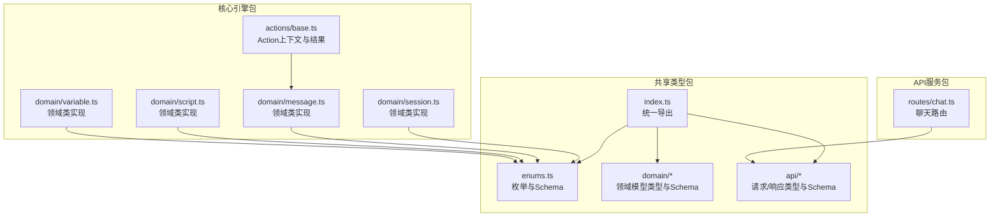

图表来源
- [packages/shared-types/src/index.ts](file://packages/shared-types/src/index.ts#L1-L19)
- [packages/shared-types/src/enums.ts](file://packages/shared-types/src/enums.ts#L1-L118)
- [packages/shared-types/src/domain/session.ts](file://packages/shared-types/src/domain/session.ts#L1-L88)
- [packages/shared-types/src/domain/message.ts](file://packages/shared-types/src/domain/message.ts#L1-L52)
- [packages/shared-types/src/domain/script.ts](file://packages/shared-types/src/domain/script.ts#L1-L64)
- [packages/shared-types/src/domain/variable.ts](file://packages/shared-types/src/domain/variable.ts#L1-L59)
- [packages/shared-types/src/api/requests.ts](file://packages/shared-types/src/api/requests.ts#L1-L51)
- [packages/shared-types/src/api/responses.ts](file://packages/shared-types/src/api/responses.ts#L1-L166)
- [packages/core-engine/src/domain/session.ts](file://packages/core-engine/src/domain/session.ts#L1-L137)
- [packages/core-engine/src/domain/message.ts](file://packages/core-engine/src/domain/message.ts#L1-L49)
- [packages/core-engine/src/domain/script.ts](file://packages/core-engine/src/domain/script.ts#L1-L95)
- [packages/core-engine/src/domain/variable.ts](file://packages/core-engine/src/domain/variable.ts#L1-L120)
- [packages/core-engine/src/actions/base.ts](file://packages/core-engine/src/actions/base.ts#L1-L75)
- [packages/api-server/src/routes/chat.ts](file://packages/api-server/src/routes/chat.ts#L1-L152)

章节来源
- [packages/shared-types/src/index.ts](file://packages/shared-types/src/index.ts#L1-L19)
- [packages/shared-types/package.json](file://packages/shared-types/package.json#L1-L27)

## 核心组件
- 统一导出入口：通过 index.ts 将领域模型、API 类型与枚举集中导出，便于跨包统一导入与维护。
- 枚举与 Schema：所有枚举均配套生成对应的 Zod nativeEnum Schema，确保运行时校验与编译期类型一致。
- 领域模型：每个领域模型同时提供接口定义与 Zod Schema，支持前端/后端双向校验。
- API 类型：请求/响应类型与 Schema 分离，便于在不同层（Fastify schema、Zod 校验、业务逻辑）灵活使用。

章节来源
- [packages/shared-types/src/index.ts](file://packages/shared-types/src/index.ts#L7-L18)
- [packages/shared-types/src/enums.ts](file://packages/shared-types/src/enums.ts#L107-L118)
- [packages/shared-types/src/domain/session.ts](file://packages/shared-types/src/domain/session.ts#L57-L69)
- [packages/shared-types/src/api/requests.ts](file://packages/shared-types/src/api/requests.ts#L12-L16)
- [packages/shared-types/src/api/responses.ts](file://packages/shared-types/src/api/responses.ts#L104-L108)

## 架构总览
共享类型系统在工程中的作用：
- 提供跨包一致的类型契约，避免重复定义与类型漂移
- 通过 Zod Schema 在运行时保障数据结构与约束
- 以枚举为中心的强类型设计，减少魔法字符串与隐式约定
- 为 API 层（Fastify schema）、业务层（核心引擎）、持久层（数据库）提供统一的数据模型

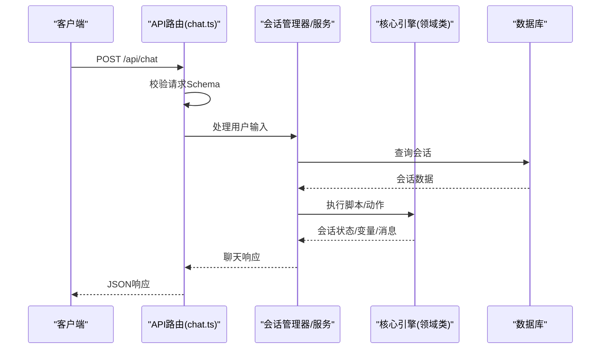

图表来源
- [packages/api-server/src/routes/chat.ts](file://packages/api-server/src/routes/chat.ts#L16-L79)
- [packages/shared-types/src/api/responses.ts](file://packages/shared-types/src/api/responses.ts#L134-L150)
- [packages/shared-types/src/api/requests.ts](file://packages/shared-types/src/api/requests.ts#L26-L29)

## 详细组件分析

### 枚举与类型安全
- 设计原则：所有枚举均提供对应的 Zod nativeEnum Schema，确保运行时与编译时一致性；错误码与错误类型分离，便于前端展示与后端日志分级。
- 扩展方法：新增枚举项时，需同步更新对应 Schema；如需更严格的取值范围，可在 Schema 中进一步细化。

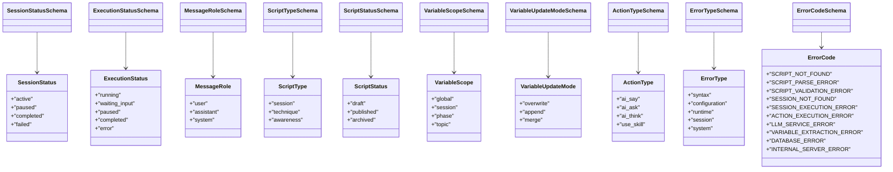

图表来源
- [packages/shared-types/src/enums.ts](file://packages/shared-types/src/enums.ts#L6-L118)

章节来源
- [packages/shared-types/src/enums.ts](file://packages/shared-types/src/enums.ts#L1-L118)

### 会话类型（Session）
- 设计要点：包含会话标识、用户标识、脚本标识、状态、执行状态、执行位置、变量与元数据、时间戳等；执行位置支持索引与可选 ID 字段，便于导航树定位。
- 使用场景：API 层用于请求/响应校验与传输；核心引擎用于会话生命周期管理与状态转换；持久层用于存储与查询。

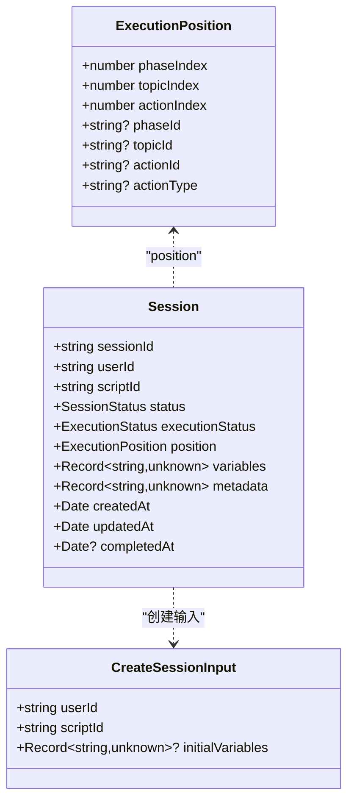

图表来源
- [packages/shared-types/src/domain/session.ts](file://packages/shared-types/src/domain/session.ts#L13-L69)

章节来源
- [packages/shared-types/src/domain/session.ts](file://packages/shared-types/src/domain/session.ts#L1-L88)

### 消息类型（Message）
- 设计要点：消息标识、所属会话、角色（用户/助手/系统）、内容、可选动作标识、元数据、时间戳；支持创建输入与 Schema 校验。
- 使用场景：API 层用于接收用户消息；核心引擎用于对话历史管理；持久层用于消息存储。

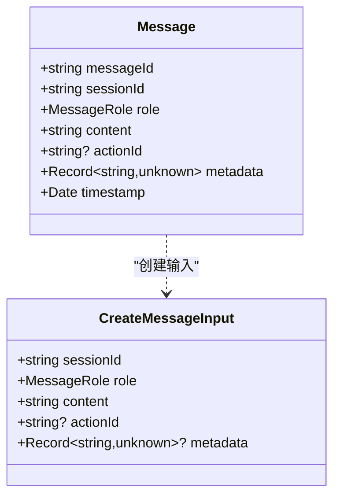

图表来源
- [packages/shared-types/src/domain/message.ts](file://packages/shared-types/src/domain/message.ts#L8-L51)

章节来源
- [packages/shared-types/src/domain/message.ts](file://packages/shared-types/src/domain/message.ts#L1-L52)

### 脚本类型（Script）
- 设计要点：脚本标识、名称、类型（会话/技巧/觉察）、内容、解析后内容（可选）、版本、状态、作者、描述、标签、时间戳；支持创建输入与 Schema 校验。
- 使用场景：API 层用于脚本创建与查询；核心引擎用于脚本解析与执行；持久层用于脚本存储。

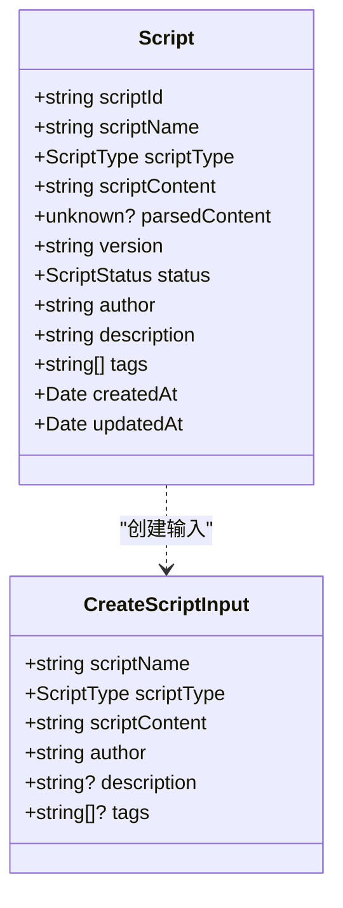

图表来源
- [packages/shared-types/src/domain/script.ts](file://packages/shared-types/src/domain/script.ts#L8-L63)

章节来源
- [packages/shared-types/src/domain/script.ts](file://packages/shared-types/src/domain/script.ts#L1-L64)

### 变量类型（Variable）
- 设计要点：变量标识、名称、作用域、值（未知类型）、值类型字符串、更新模式（覆盖/追加/合并）、来源、历史记录、时间戳；支持历史条目与 Schema 校验。
- 使用场景：核心引擎用于变量管理与更新；持久层用于变量存储；Action 执行时根据更新模式处理值变更。

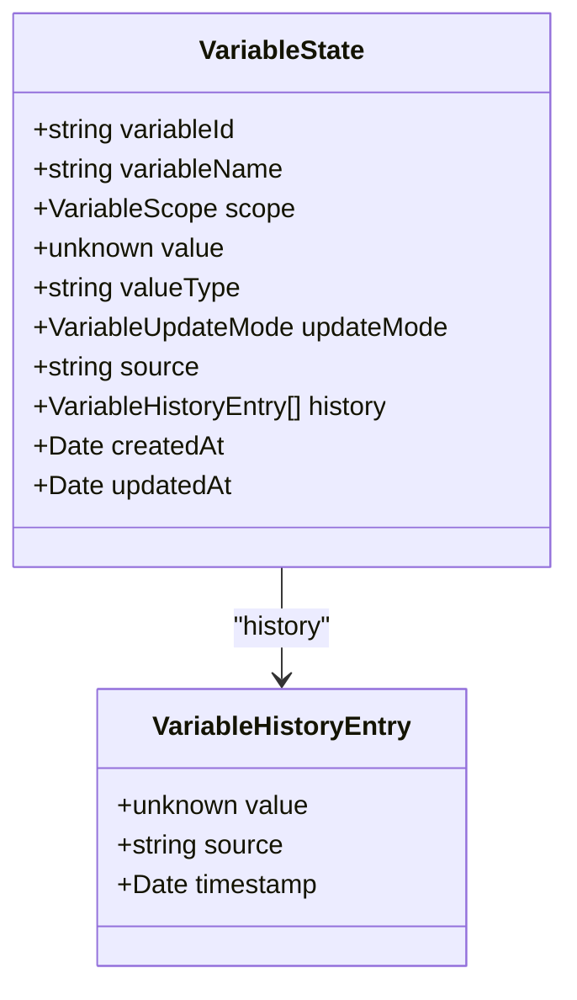

图表来源
- [packages/shared-types/src/domain/variable.ts](file://packages/shared-types/src/domain/variable.ts#L13-L58)

章节来源
- [packages/shared-types/src/domain/variable.ts](file://packages/shared-types/src/domain/variable.ts#L1-L59)

### API 请求/响应类型
- 请求类型：CreateSessionRequest、SendMessageRequest、CreateScriptRequest；均配套 Zod Schema，确保入参约束。
- 响应类型：包含基础响应、详细错误、聊天响应、会话详情响应、脚本列表响应等；错误上下文与恢复建议增强可观测性与可诊断性。

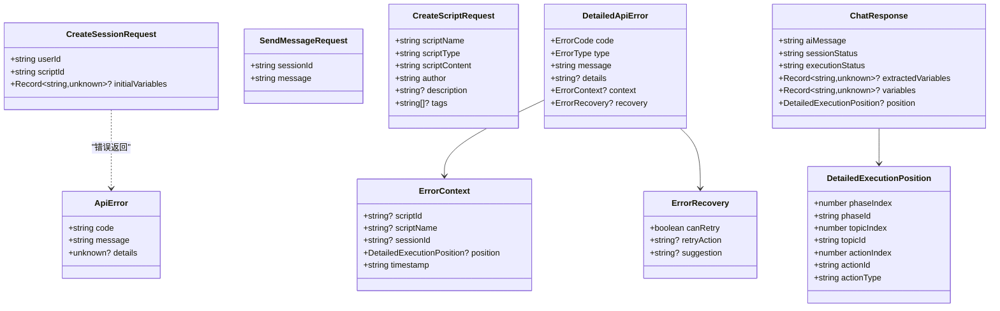

图表来源
- [packages/shared-types/src/api/requests.ts](file://packages/shared-types/src/api/requests.ts#L6-L50)
- [packages/shared-types/src/api/responses.ts](file://packages/shared-types/src/api/responses.ts#L89-L166)

章节来源
- [packages/shared-types/src/api/requests.ts](file://packages/shared-types/src/api/requests.ts#L1-L51)
- [packages/shared-types/src/api/responses.ts](file://packages/shared-types/src/api/responses.ts#L1-L166)

### 核心引擎中的领域类实现
- 领域类与共享类型接口保持一致，但内部使用 Map 存储变量与元数据，提供丰富的业务方法（启动、暂停、恢复、完成、失败、更新位置、设置/获取变量、序列化等）。
- 通过继承共享枚举，确保状态与角色的一致性。

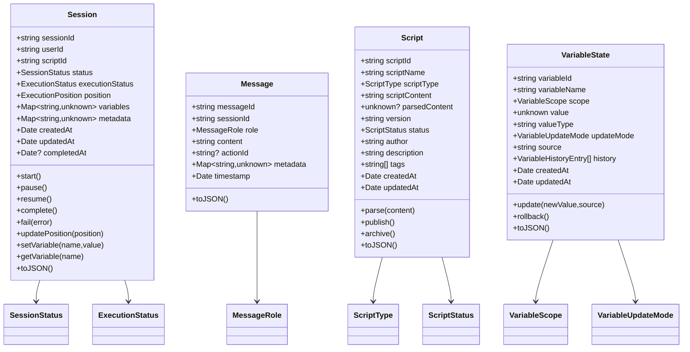

图表来源
- [packages/core-engine/src/domain/session.ts](file://packages/core-engine/src/domain/session.ts#L7-L136)
- [packages/core-engine/src/domain/message.ts](file://packages/core-engine/src/domain/message.ts#L7-L48)
- [packages/core-engine/src/domain/script.ts](file://packages/core-engine/src/domain/script.ts#L7-L94)
- [packages/core-engine/src/domain/variable.ts](file://packages/core-engine/src/domain/variable.ts#L15-L119)

章节来源
- [packages/core-engine/src/domain/session.ts](file://packages/core-engine/src/domain/session.ts#L1-L137)
- [packages/core-engine/src/domain/message.ts](file://packages/core-engine/src/domain/message.ts#L1-L49)
- [packages/core-engine/src/domain/script.ts](file://packages/core-engine/src/domain/script.ts#L1-L95)
- [packages/core-engine/src/domain/variable.ts](file://packages/core-engine/src/domain/variable.ts#L1-L120)

### Action 执行上下文与结果
- ActionContext：包含会话与当前阶段/话题/动作标识、变量映射、对话历史、元数据。
- ActionResult：抽象 Action 的执行结果，统一 success/completed/aiMessage/extractedVariables/nextAction/error/metadata 等字段，便于上层统一处理。

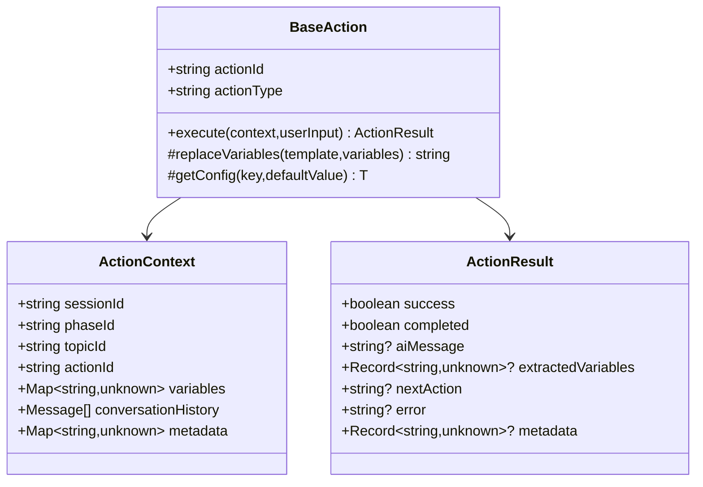

图表来源
- [packages/core-engine/src/actions/base.ts](file://packages/core-engine/src/actions/base.ts#L6-L74)

章节来源
- [packages/core-engine/src/actions/base.ts](file://packages/core-engine/src/actions/base.ts#L1-L75)

## 依赖关系分析
- 共享类型包依赖 zod，提供强类型与运行时校验能力。
- 核心引擎包以外部依赖形式引入共享类型，避免循环依赖与重复定义。
- API 服务包通过 Fastify schema 与共享类型 Schema 协同，确保请求/响应的类型安全与运行时校验。

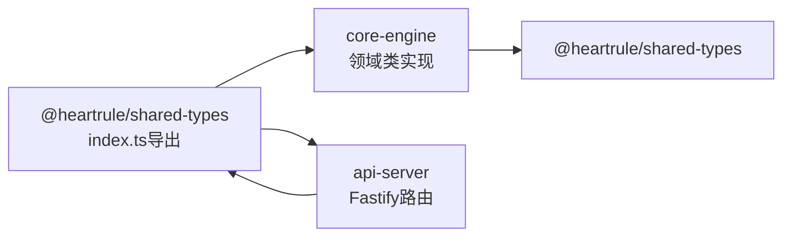

图表来源
- [packages/shared-types/package.json](file://packages/shared-types/package.json#L19-L21)
- [packages/core-engine/tsup.config.ts](file://packages/core-engine/tsup.config.ts#L10-L10)
- [packages/api-server/src/routes/chat.ts](file://packages/api-server/src/routes/chat.ts#L1-L152)

章节来源
- [packages/shared-types/package.json](file://packages/shared-types/package.json#L1-L27)
- [packages/core-engine/tsup.config.ts](file://packages/core-engine/tsup.config.ts#L1-L11)

## 性能考虑
- 类型与 Schema 分离：编译期类型检查与运行时校验解耦，避免重复校验开销。
- Map 存储变量：在核心引擎中使用 Map 提升变量访问性能，同时保持类型安全。
- 选择性 Schema 校验：API 层优先使用 Fastify schema 快速过滤无效请求，再在业务层使用 Zod 进行细粒度校验，平衡性能与安全性。

## 故障排除指南
- 枚举取值异常：若出现未知枚举值导致的运行时错误，检查对应 Schema 是否为 nativeEnum，确保入参与存储值一致。
- 时间戳格式：统一使用 Date 对象或 ISO 字符串，避免跨包时格式不一致引发的问题。
- 错误上下文缺失：当 DetailedApiError 的 context 缺少 position 或时间戳时，检查调用方是否正确填充 DetailedExecutionPosition 与 timestamp。
- 变量更新模式：当变量更新不符合预期时，核对 VariableUpdateMode 的取值与 update 行为分支。

章节来源
- [packages/shared-types/src/enums.ts](file://packages/shared-types/src/enums.ts#L107-L118)
- [packages/shared-types/src/api/responses.ts](file://packages/shared-types/src/api/responses.ts#L42-L84)
- [packages/shared-types/src/domain/variable.ts](file://packages/shared-types/src/domain/variable.ts#L47-L58)

## 结论
共享类型系统通过“类型 + Schema + 枚举”的三位一体设计，实现了跨包一致的契约与强健的运行时校验。领域模型与 API 类型清晰分离，既满足编译期类型安全，又兼顾运行时数据验证。遵循本文的最佳实践与扩展指南，可有效避免类型冲突与版本兼容问题，提升系统的可维护性与可演进性。

## 附录

### 最佳实践清单
- 统一从 index.ts 导入共享类型，避免分散导入导致的版本漂移。
- 新增/修改枚举时，同步更新对应 Zod nativeEnum Schema。
- 领域模型与 API 类型分别维护接口与 Schema，确保两端校验一致。
- 在 API 层使用 Fastify schema 快速拦截无效请求，在业务层使用 Zod 进行深度校验。
- 对于复杂对象（如 variables、metadata），使用 Record<string, unknown> 并配合 Schema 精细化校验字段。

### 版本兼容与冲突处理
- 语义化版本：共享类型包采用独立版本号，升级时评估破坏性变更。
- 向后兼容：新增字段使用可选属性，避免强制迁移成本。
- 冲突规避：严格区分领域模型与 API 类型，避免在同一类型上承载过多职责。

### 扩展指南
- 新增领域模型：在 domain 下新增文件，定义接口与 Schema，并在 index.ts 导出。
- 新增枚举：在 enums.ts 中添加新枚举与 nativeEnum Schema，并在相关模型中使用。
- 新增 API 类型：在 api 下新增请求/响应类型与 Schema，并在路由中引用。
- 自定义类型开发：优先使用现有枚举与 Schema，必要时在局部范围内扩展，避免污染共享契约。