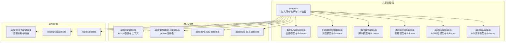
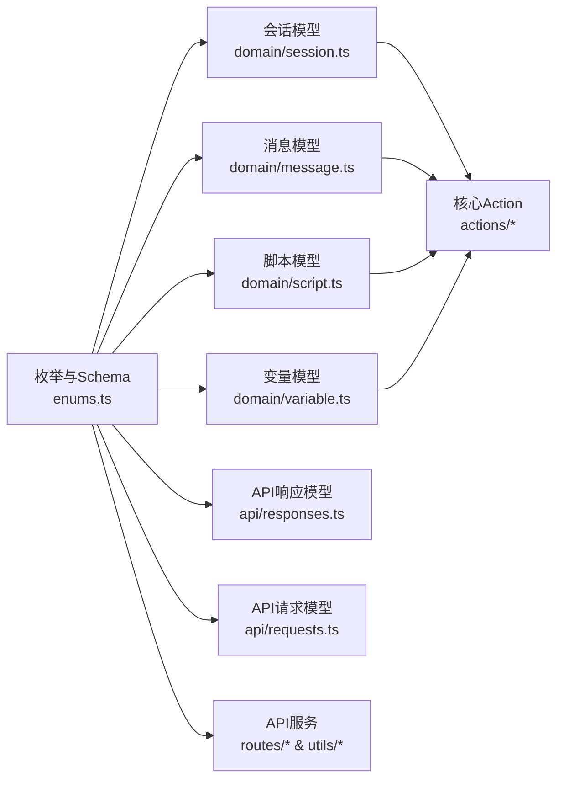
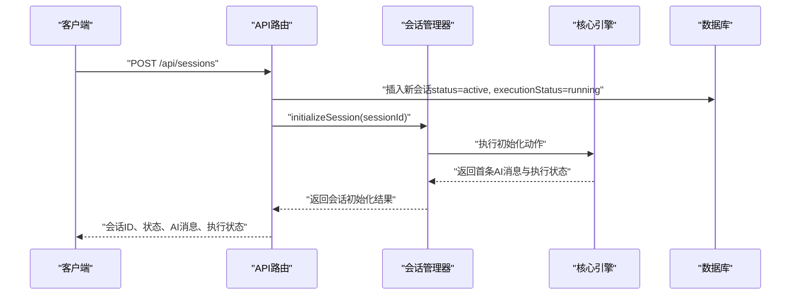
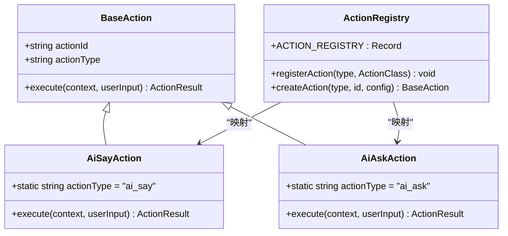
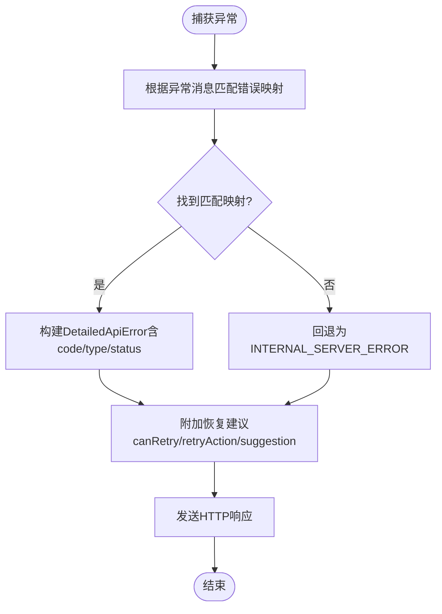
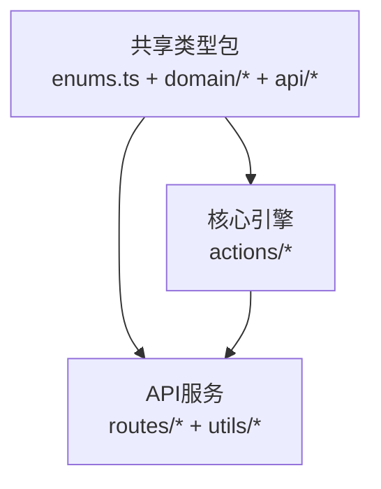

# 枚举和常量类型

<cite>
**本文引用的文件**
- [packages/shared-types/src/enums.ts](file://packages/shared-types/src/enums.ts)
- [packages/shared-types/src/domain/session.ts](file://packages/shared-types/src/domain/session.ts)
- [packages/shared-types/src/domain/message.ts](file://packages/shared-types/src/domain/message.ts)
- [packages/shared-types/src/domain/script.ts](file://packages/shared-types/src/domain/script.ts)
- [packages/shared-types/src/domain/variable.ts](file://packages/shared-types/src/domain/variable.ts)
- [packages/shared-types/src/api/responses.ts](file://packages/shared-types/src/api/responses.ts)
- [packages/shared-types/src/api/requests.ts](file://packages/shared-types/src/api/requests.ts)
- [packages/core-engine/src/actions/base.ts](file://packages/core-engine/src/actions/base.ts)
- [packages/core-engine/src/actions/action-registry.ts](file://packages/core-engine/src/actions/action-registry.ts)
- [packages/core-engine/src/actions/ai-say-action.ts](file://packages/core-engine/src/actions/ai-say-action.ts)
- [packages/core-engine/src/actions/ai-ask-action.ts](file://packages/core-engine/src/actions/ai-ask-action.ts)
- [packages/api-server/src/utils/error-handler.ts](file://packages/api-server/src/utils/error-handler.ts)
- [packages/api-server/src/routes/sessions.ts](file://packages/api-server/src/routes/sessions.ts)
- [packages/api-server/src/routes/chat.ts](file://packages/api-server/src/routes/chat.ts)
</cite>

## 目录
1. [简介](#简介)
2. [项目结构](#项目结构)
3. [核心组件](#核心组件)
4. [架构总览](#架构总览)
5. [详细组件分析](#详细组件分析)
6. [依赖关系分析](#依赖关系分析)
7. [性能考量](#性能考量)
8. [故障排查指南](#故障排查指南)
9. [结论](#结论)
10. [附录](#附录)

## 简介
本文件系统性梳理 HeartRule AI 咨询引擎中的“枚举与常量类型”，覆盖会话状态、执行状态、消息角色、脚本类型与状态、变量作用域与更新模式、Action 类型、错误类型与错误代码等。文档同时给出：
- 各枚举的取值范围、业务含义与使用场景
- 类型安全的使用方式与最佳实践
- 在不同包之间的共享与复用策略
- 扩展与向后兼容性建议
- 常量定义规范与常见陷阱

## 项目结构
本项目采用多包工作区（monorepo），枚举与常量主要集中在共享类型包中，核心引擎与 API 服务通过共享类型进行强类型约束与跨包通信。

图表来源
- [packages/shared-types/src/enums.ts](file://packages/shared-types/src/enums.ts#L1-L118)
- [packages/shared-types/src/domain/session.ts](file://packages/shared-types/src/domain/session.ts#L1-L88)
- [packages/shared-types/src/domain/message.ts](file://packages/shared-types/src/domain/message.ts#L1-L52)
- [packages/shared-types/src/domain/script.ts](file://packages/shared-types/src/domain/script.ts#L1-L64)
- [packages/shared-types/src/domain/variable.ts](file://packages/shared-types/src/domain/variable.ts#L1-L59)
- [packages/shared-types/src/api/responses.ts](file://packages/shared-types/src/api/responses.ts#L1-L166)
- [packages/shared-types/src/api/requests.ts](file://packages/shared-types/src/api/requests.ts#L1-L51)
- [packages/core-engine/src/actions/base.ts](file://packages/core-engine/src/actions/base.ts#L1-L75)
- [packages/core-engine/src/actions/action-registry.ts](file://packages/core-engine/src/actions/action-registry.ts#L1-L46)
- [packages/core-engine/src/actions/ai-say-action.ts](file://packages/core-engine/src/actions/ai-say-action.ts#L1-L105)
- [packages/core-engine/src/actions/ai-ask-action.ts](file://packages/core-engine/src/actions/ai-ask-action.ts#L1-L207)
- [packages/api-server/src/utils/error-handler.ts](file://packages/api-server/src/utils/error-handler.ts#L1-L233)
- [packages/api-server/src/routes/sessions.ts](file://packages/api-server/src/routes/sessions.ts#L1-L548)
- [packages/api-server/src/routes/chat.ts](file://packages/api-server/src/routes/chat.ts#L1-L152)

章节来源
- [packages/shared-types/src/enums.ts](file://packages/shared-types/src/enums.ts#L1-L118)
- [packages/shared-types/src/domain/session.ts](file://packages/shared-types/src/domain/session.ts#L1-L88)
- [packages/shared-types/src/domain/message.ts](file://packages/shared-types/src/domain/message.ts#L1-L52)
- [packages/shared-types/src/domain/script.ts](file://packages/shared-types/src/domain/script.ts#L1-L64)
- [packages/shared-types/src/domain/variable.ts](file://packages/shared-types/src/domain/variable.ts#L1-L59)
- [packages/shared-types/src/api/responses.ts](file://packages/shared-types/src/api/responses.ts#L1-L166)
- [packages/shared-types/src/api/requests.ts](file://packages/shared-types/src/api/requests.ts#L1-L51)

## 核心组件
本节对所有枚举与常量进行逐项说明，包括取值范围、业务语义、使用场景与类型安全实践。

- 会话状态（SessionStatus）
  - 取值：active、paused、completed、failed
  - 业务含义：表示一次咨询会话的整体生命周期状态
  - 使用场景：API 响应、数据库存储、前端状态管理
  - 类型安全：配合 Zod Schema 进行运行时校验
  - 章节来源
    - [packages/shared-types/src/enums.ts](file://packages/shared-types/src/enums.ts#L6-L11)
    - [packages/shared-types/src/domain/session.ts](file://packages/shared-types/src/domain/session.ts#L40-L52)
    - [packages/shared-types/src/domain/session.ts](file://packages/shared-types/src/domain/session.ts#L57-L69)

- 执行状态（ExecutionStatus）
  - 取值：running、waiting_input、paused、completed、error
  - 业务含义：表示当前脚本执行阶段的状态，区分等待用户输入、暂停、完成、错误等
  - 使用场景：会话执行流程控制、前端交互提示
  - 类型安全：配合 Zod Schema 进行运行时校验
  - 章节来源
    - [packages/shared-types/src/enums.ts](file://packages/shared-types/src/enums.ts#L16-L22)
    - [packages/shared-types/src/domain/session.ts](file://packages/shared-types/src/domain/session.ts#L40-L52)
    - [packages/shared-types/src/domain/session.ts](file://packages/shared-types/src/domain/session.ts#L57-L69)

- 消息角色（MessageRole）
  - 取值：user、assistant、system
  - 业务含义：区分用户消息、AI 回复、系统提示或上下文
  - 使用场景：消息持久化、对话历史、前端渲染
  - 类型安全：配合 Zod Schema 进行运行时校验
  - 章节来源
    - [packages/shared-types/src/enums.ts](file://packages/shared-types/src/enums.ts#L27-L31)
    - [packages/shared-types/src/domain/message.ts](file://packages/shared-types/src/domain/message.ts#L8-L16)
    - [packages/shared-types/src/domain/message.ts](file://packages/shared-types/src/domain/message.ts#L21-L29)

- 脚本类型（ScriptType）
  - 取值：session、technique、awareness
  - 业务含义：脚本的用途分类，如会话脚本、技术方法脚本、觉察类脚本
  - 使用场景：脚本选择、加载与执行策略
  - 类型安全：配合 Zod Schema 进行运行时校验
  - 章节来源
    - [packages/shared-types/src/enums.ts](file://packages/shared-types/src/enums.ts#L36-L40)
    - [packages/shared-types/src/domain/script.ts](file://packages/shared-types/src/domain/script.ts#L8-L21)
    - [packages/shared-types/src/domain/script.ts](file://packages/shared-types/src/domain/script.ts#L26-L39)

- 脚本状态（ScriptStatus）
  - 取值：draft、published、archived
  - 业务含义：脚本的发布状态，便于版本管理与可见性控制
  - 使用场景：脚本检索、权限控制、UI 展示
  - 类型安全：配合 Zod Schema 进行运行时校验
  - 章节来源
    - [packages/shared-types/src/enums.ts](file://packages/shared-types/src/enums.ts#L45-L49)
    - [packages/shared-types/src/domain/script.ts](file://packages/shared-types/src/domain/script.ts#L8-L21)
    - [packages/shared-types/src/domain/script.ts](file://packages/shared-types/src/domain/script.ts#L26-L39)

- 变量作用域（VariableScope）
  - 取值：global、session、phase、topic
  - 业务含义：变量的可见范围，从全局到主题级别
  - 使用场景：变量读写、作用域隔离、清理策略
  - 类型安全：配合 Zod Schema 进行运行时校验
  - 章节来源
    - [packages/shared-types/src/enums.ts](file://packages/shared-types/src/enums.ts#L54-L59)
    - [packages/shared-types/src/domain/variable.ts](file://packages/shared-types/src/domain/variable.ts#L13-L24)
    - [packages/shared-types/src/domain/variable.ts](file://packages/shared-types/src/domain/variable.ts#L47-L58)

- 变量更新模式（VariableUpdateMode）
  - 取值：overwrite、append、merge
  - 业务含义：变量更新策略，覆盖、追加、合并
  - 使用场景：变量提取与赋值、数据聚合
  - 类型安全：配合 Zod Schema 进行运行时校验
  - 章节来源
    - [packages/shared-types/src/enums.ts](file://packages/shared-types/src/enums.ts#L64-L68)
    - [packages/shared-types/src/domain/variable.ts](file://packages/shared-types/src/domain/variable.ts#L13-L24)
    - [packages/shared-types/src/domain/variable.ts](file://packages/shared-types/src/domain/variable.ts#L47-L58)

- Action 类型（ActionType）
  - 取值：ai_say、ai_ask、ai_think、use_skill
  - 业务含义：脚本中可执行的动作类型
  - 使用场景：脚本解析、Action 实例化、执行调度
  - 类型安全：配合注册表与字符串字面量进行运行时校验
  - 章节来源
    - [packages/shared-types/src/enums.ts](file://packages/shared-types/src/enums.ts#L73-L78)
    - [packages/core-engine/src/actions/action-registry.ts](file://packages/core-engine/src/actions/action-registry.ts#L17-L23)
    - [packages/core-engine/src/actions/ai-say-action.ts](file://packages/core-engine/src/actions/ai-say-action.ts#L17)
    - [packages/core-engine/src/actions/ai-ask-action.ts](file://packages/core-engine/src/actions/ai-ask-action.ts#L20)

- 错误类型（ErrorType）
  - 取值：syntax、configuration、runtime、session、system
  - 业务含义：错误的分类维度，便于统一处理与恢复建议
  - 使用场景：错误映射、响应体结构化、日志分级
  - 类型安全：配合 Zod Schema 进行运行时校验
  - 章节来源
    - [packages/shared-types/src/enums.ts](file://packages/shared-types/src/enums.ts#L83-L89)
    - [packages/shared-types/src/api/responses.ts](file://packages/shared-types/src/api/responses.ts#L68-L75)
    - [packages/shared-types/src/api/responses.ts](file://packages/shared-types/src/api/responses.ts#L77-L84)

- 错误代码（ErrorCode）
  - 取值：SCRIPT_NOT_FOUND、SCRIPT_PARSE_ERROR、SCRIPT_VALIDATION_ERROR、SESSION_NOT_FOUND、SESSION_EXECUTION_ERROR、ACTION_EXECUTION_ERROR、LLM_SERVICE_ERROR、VARIABLE_EXTRACTION_ERROR、DATABASE_ERROR、INTERNAL_SERVER_ERROR
  - 业务含义：具体的错误标识，用于 API 响应与前端提示
  - 使用场景：错误映射、响应体结构化、恢复建议
  - 类型安全：配合 Zod Schema 进行运行时校验
  - 章节来源
    - [packages/shared-types/src/enums.ts](file://packages/shared-types/src/enums.ts#L94-L105)
    - [packages/shared-types/src/api/responses.ts](file://packages/shared-types/src/api/responses.ts#L68-L75)
    - [packages/shared-types/src/api/responses.ts](file://packages/shared-types/src/api/responses.ts#L77-L84)

- Zod 校验枚举（XxxSchema）
  - 说明：为上述枚举提供 Zod nativeEnum 校验器，确保运行时类型安全
  - 使用场景：接口入参校验、数据库 Schema 校验、API 响应校验
  - 章节来源
    - [packages/shared-types/src/enums.ts](file://packages/shared-types/src/enums.ts#L108-L118)
    - [packages/shared-types/src/domain/session.ts](file://packages/shared-types/src/domain/session.ts#L57-L69)
    - [packages/shared-types/src/domain/message.ts](file://packages/shared-types/src/domain/message.ts#L21-L29)
    - [packages/shared-types/src/domain/script.ts](file://packages/shared-types/src/domain/script.ts#L26-L39)
    - [packages/shared-types/src/domain/variable.ts](file://packages/shared-types/src/domain/variable.ts#L47-L58)
    - [packages/shared-types/src/api/responses.ts](file://packages/shared-types/src/api/responses.ts#L77-L84)
    - [packages/shared-types/src/api/requests.ts](file://packages/shared-types/src/api/requests.ts#L12-L16)

## 架构总览
下图展示了枚举与常量在系统中的分布与依赖关系，以及它们如何被核心引擎与 API 服务消费。

图表来源
- [packages/shared-types/src/enums.ts](file://packages/shared-types/src/enums.ts#L1-L118)
- [packages/shared-types/src/domain/session.ts](file://packages/shared-types/src/domain/session.ts#L1-L88)
- [packages/shared-types/src/domain/message.ts](file://packages/shared-types/src/domain/message.ts#L1-L52)
- [packages/shared-types/src/domain/script.ts](file://packages/shared-types/src/domain/script.ts#L1-L64)
- [packages/shared-types/src/domain/variable.ts](file://packages/shared-types/src/domain/variable.ts#L1-L59)
- [packages/shared-types/src/api/responses.ts](file://packages/shared-types/src/api/responses.ts#L1-L166)
- [packages/shared-types/src/api/requests.ts](file://packages/shared-types/src/api/requests.ts#L1-L51)
- [packages/core-engine/src/actions/base.ts](file://packages/core-engine/src/actions/base.ts#L1-L75)
- [packages/core-engine/src/actions/action-registry.ts](file://packages/core-engine/src/actions/action-registry.ts#L1-L46)
- [packages/api-server/src/utils/error-handler.ts](file://packages/api-server/src/utils/error-handler.ts#L1-L233)
- [packages/api-server/src/routes/sessions.ts](file://packages/api-server/src/routes/sessions.ts#L1-L548)
- [packages/api-server/src/routes/chat.ts](file://packages/api-server/src/routes/chat.ts#L1-L152)

## 详细组件分析

### 会话与消息：状态驱动的对话生命周期
- 会话状态（SessionStatus）与执行状态（ExecutionStatus）共同决定会话的生命周期与交互节奏
- 消息角色（MessageRole）用于区分用户、AI 与系统消息，支撑对话历史与前端渲染
- 类型安全：通过 XxxSchema 对入参与响应进行严格校验，避免魔法字符串与魔法数字

图表来源
- [packages/api-server/src/routes/sessions.ts](file://packages/api-server/src/routes/sessions.ts#L76-L124)
- [packages/shared-types/src/domain/session.ts](file://packages/shared-types/src/domain/session.ts#L40-L69)
- [packages/shared-types/src/enums.ts](file://packages/shared-types/src/enums.ts#L6-L22)

章节来源
- [packages/shared-types/src/domain/session.ts](file://packages/shared-types/src/domain/session.ts#L40-L69)
- [packages/shared-types/src/domain/message.ts](file://packages/shared-types/src/domain/message.ts#L8-L29)
- [packages/api-server/src/routes/sessions.ts](file://packages/api-server/src/routes/sessions.ts#L76-L124)

### Action 类型与注册表：类型安全的动态分发
- Action 类型（ActionType）与注册表（ACTION_REGISTRY）实现基于字符串的动态实例化
- 通过静态 actionType 字段与注册表映射，避免魔法字符串直接散落各处
- 类型安全：注册表键与字符串字面量保持一致，结合 Zod Schema 保证运行时一致性

图表来源
- [packages/core-engine/src/actions/base.ts](file://packages/core-engine/src/actions/base.ts#L32-L50)
- [packages/core-engine/src/actions/ai-say-action.ts](file://packages/core-engine/src/actions/ai-say-action.ts#L16-L17)
- [packages/core-engine/src/actions/ai-ask-action.ts](file://packages/core-engine/src/actions/ai-ask-action.ts#L19-L20)
- [packages/core-engine/src/actions/action-registry.ts](file://packages/core-engine/src/actions/action-registry.ts#L17-L45)

章节来源
- [packages/core-engine/src/actions/action-registry.ts](file://packages/core-engine/src/actions/action-registry.ts#L17-L45)
- [packages/core-engine/src/actions/ai-say-action.ts](file://packages/core-engine/src/actions/ai-say-action.ts#L16-L17)
- [packages/core-engine/src/actions/ai-ask-action.ts](file://packages/core-engine/src/actions/ai-ask-action.ts#L19-L20)

### 错误处理：错误类型与错误代码的统一映射
- 错误类型（ErrorType）与错误代码（ErrorCode）构成统一的错误体系
- 错误映射表（ERROR_MAPPINGS）将底层异常消息映射到标准化的错误响应
- 类型安全：通过 DetailedApiError 与 XxxSchema 确保错误响应结构一致

图表来源
- [packages/api-server/src/utils/error-handler.ts](file://packages/api-server/src/utils/error-handler.ts#L22-L90)
- [packages/api-server/src/utils/error-handler.ts](file://packages/api-server/src/utils/error-handler.ts#L116-L181)
- [packages/shared-types/src/enums.ts](file://packages/shared-types/src/enums.ts#L83-L105)
- [packages/shared-types/src/api/responses.ts](file://packages/shared-types/src/api/responses.ts#L68-L84)

章节来源
- [packages/api-server/src/utils/error-handler.ts](file://packages/api-server/src/utils/error-handler.ts#L22-L90)
- [packages/api-server/src/utils/error-handler.ts](file://packages/api-server/src/utils/error-handler.ts#L116-L181)
- [packages/shared-types/src/api/responses.ts](file://packages/shared-types/src/api/responses.ts#L68-L84)

## 依赖关系分析
- 共享类型包集中定义枚举与 Schema，核心引擎与 API 服务均依赖该包
- 核心引擎通过注册表与 Action 基类实现类型安全的动态分发
- API 服务通过统一的错误处理模块与响应模型，保证错误与响应的一致性

图表来源
- [packages/shared-types/src/enums.ts](file://packages/shared-types/src/enums.ts#L1-L118)
- [packages/core-engine/src/actions/action-registry.ts](file://packages/core-engine/src/actions/action-registry.ts#L1-L46)
- [packages/api-server/src/utils/error-handler.ts](file://packages/api-server/src/utils/error-handler.ts#L1-L233)

章节来源
- [packages/shared-types/src/enums.ts](file://packages/shared-types/src/enums.ts#L1-L118)
- [packages/core-engine/src/actions/action-registry.ts](file://packages/core-engine/src/actions/action-registry.ts#L1-L46)
- [packages/api-server/src/utils/error-handler.ts](file://packages/api-server/src/utils/error-handler.ts#L1-L233)

## 性能考量
- 枚举与 Schema 的使用不会带来显著运行时开销，但能减少类型错误导致的运行时异常
- 在高频调用路径中，优先使用已编译的 Zod 校验器，避免重复构造 Schema
- 错误映射与响应构建应尽量复用，避免在热路径上频繁分配对象

## 故障排查指南
- 魔法字符串问题
  - 症状：字符串散落在各处，难以维护与重构
  - 解决：统一使用枚举与注册表键，避免硬编码字符串
  - 参考
    - [packages/core-engine/src/actions/action-registry.ts](file://packages/core-engine/src/actions/action-registry.ts#L17-L23)
    - [packages/core-engine/src/actions/ai-say-action.ts](file://packages/core-engine/src/actions/ai-say-action.ts#L17)
    - [packages/core-engine/src/actions/ai-ask-action.ts](file://packages/core-engine/src/actions/ai-ask-action.ts#L20)

- 类型不一致导致的运行时错误
  - 症状：API 响应或数据库存储出现不符合预期的值
  - 解决：使用 XxxSchema 进行入参与响应校验，确保枚举值合法
  - 参考
    - [packages/shared-types/src/domain/session.ts](file://packages/shared-types/src/domain/session.ts#L57-L69)
    - [packages/shared-types/src/domain/message.ts](file://packages/shared-types/src/domain/message.ts#L21-L29)
    - [packages/shared-types/src/domain/script.ts](file://packages/shared-types/src/domain/script.ts#L26-L39)
    - [packages/shared-types/src/domain/variable.ts](file://packages/shared-types/src/domain/variable.ts#L47-L58)
    - [packages/shared-types/src/api/responses.ts](file://packages/shared-types/src/api/responses.ts#L77-L84)

- 错误映射不准确
  - 症状：错误码与错误类型不匹配，恢复建议不当
  - 解决：检查 ERROR_MAPPINGS 中的映射规则，必要时扩展映射表
  - 参考
    - [packages/api-server/src/utils/error-handler.ts](file://packages/api-server/src/utils/error-handler.ts#L22-L90)
    - [packages/api-server/src/utils/error-handler.ts](file://packages/api-server/src/utils/error-handler.ts#L143-L178)

## 结论
本项目通过“共享类型包 + 核心引擎 + API 服务”的分层设计，将枚举与常量抽象为统一的类型系统，实现了：
- 类型安全：通过 Zod Schema 与强类型接口，避免魔法字符串与魔法数字
- 可维护性：集中定义与复用，降低耦合度
- 可扩展性：注册表与枚举扩展机制支持新增 Action 与错误类型
- 可观测性：统一的错误类型与错误代码，便于日志与监控

## 附录

### 类型安全使用示例（路径指引）
- 使用枚举作为参数与返回值
  - 会话状态与执行状态
    - [packages/shared-types/src/domain/session.ts](file://packages/shared-types/src/domain/session.ts#L40-L69)
  - 消息角色
    - [packages/shared-types/src/domain/message.ts](file://packages/shared-types/src/domain/message.ts#L8-L29)
  - 脚本类型与状态
    - [packages/shared-types/src/domain/script.ts](file://packages/shared-types/src/domain/script.ts#L8-L39)
  - 变量作用域与更新模式
    - [packages/shared-types/src/domain/variable.ts](file://packages/shared-types/src/domain/variable.ts#L13-L58)

- 使用 Zod Schema 校验
  - 会话、消息、脚本、变量、错误响应
    - [packages/shared-types/src/enums.ts](file://packages/shared-types/src/enums.ts#L108-L118)
    - [packages/shared-types/src/domain/session.ts](file://packages/shared-types/src/domain/session.ts#L57-L69)
    - [packages/shared-types/src/domain/message.ts](file://packages/shared-types/src/domain/message.ts#L21-L29)
    - [packages/shared-types/src/domain/script.ts](file://packages/shared-types/src/domain/script.ts#L26-L39)
    - [packages/shared-types/src/domain/variable.ts](file://packages/shared-types/src/domain/variable.ts#L47-L58)
    - [packages/shared-types/src/api/responses.ts](file://packages/shared-types/src/api/responses.ts#L77-L84)

- 动态 Action 实例化
  - 注册表与工厂
    - [packages/core-engine/src/actions/action-registry.ts](file://packages/core-engine/src/actions/action-registry.ts#L17-L45)
  - Action 类型常量
    - [packages/core-engine/src/actions/ai-say-action.ts](file://packages/core-engine/src/actions/ai-say-action.ts#L17)
    - [packages/core-engine/src/actions/ai-ask-action.ts](file://packages/core-engine/src/actions/ai-ask-action.ts#L20)

- 统一错误处理
  - 错误映射与响应
    - [packages/api-server/src/utils/error-handler.ts](file://packages/api-server/src/utils/error-handler.ts#L22-L90)
    - [packages/api-server/src/utils/error-handler.ts](file://packages/api-server/src/utils/error-handler.ts#L116-L181)

### 枚举扩展指南与向后兼容性
- 新增枚举值
  - 仅在共享类型包中添加，保持向后兼容
  - 更新对应 Schema，确保旧数据仍可读
  - 参考
    - [packages/shared-types/src/enums.ts](file://packages/shared-types/src/enums.ts#L108-L118)

- 新增 Action 类型
  - 在注册表中新增映射，确保字符串键与静态 actionType 一致
  - 参考
    - [packages/core-engine/src/actions/action-registry.ts](file://packages/core-engine/src/actions/action-registry.ts#L17-L30)

- 新增错误类型与错误代码
  - 在枚举中添加，同时在错误映射表中补充映射规则
  - 参考
    - [packages/shared-types/src/enums.ts](file://packages/shared-types/src/enums.ts#L83-L105)
    - [packages/api-server/src/utils/error-handler.ts](file://packages/api-server/src/utils/error-handler.ts#L22-L90)

### 常量定义规范与最佳实践
- 使用枚举替代魔法字符串，提升可读性与可维护性
- 通过 Zod Schema 对外暴露强类型接口，确保入参与响应一致
- 将常量集中管理于共享类型包，避免跨包重复定义
- 在 API 服务中统一使用错误处理模块，保证错误响应结构一致
- 在核心引擎中通过注册表与静态 actionType 字段，实现类型安全的动态分发