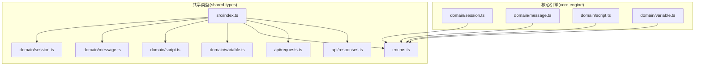
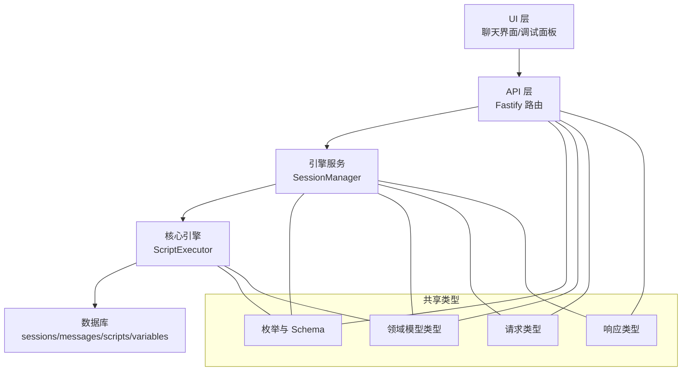
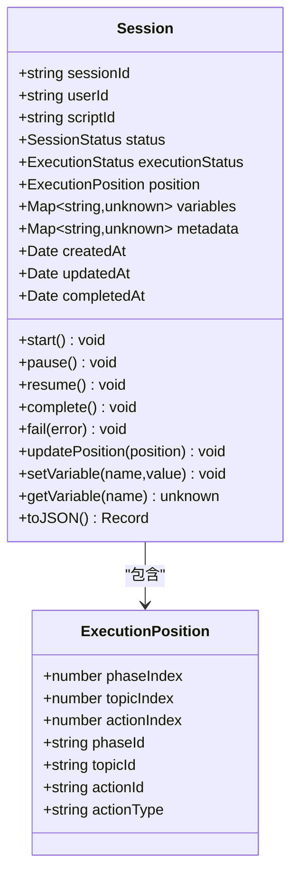
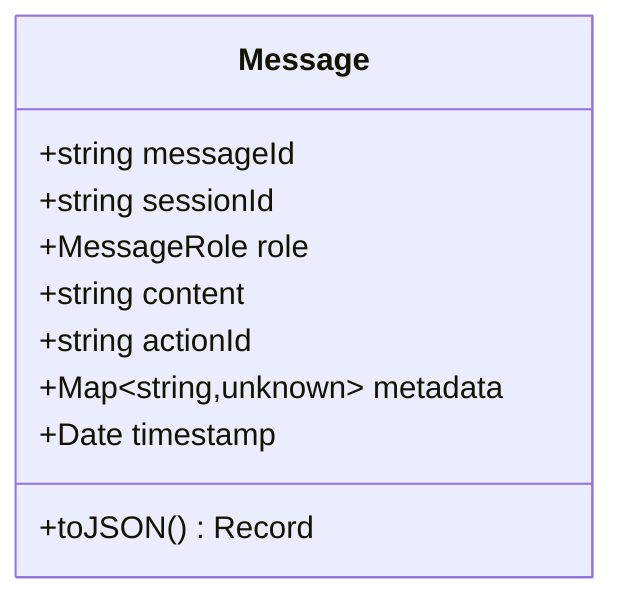
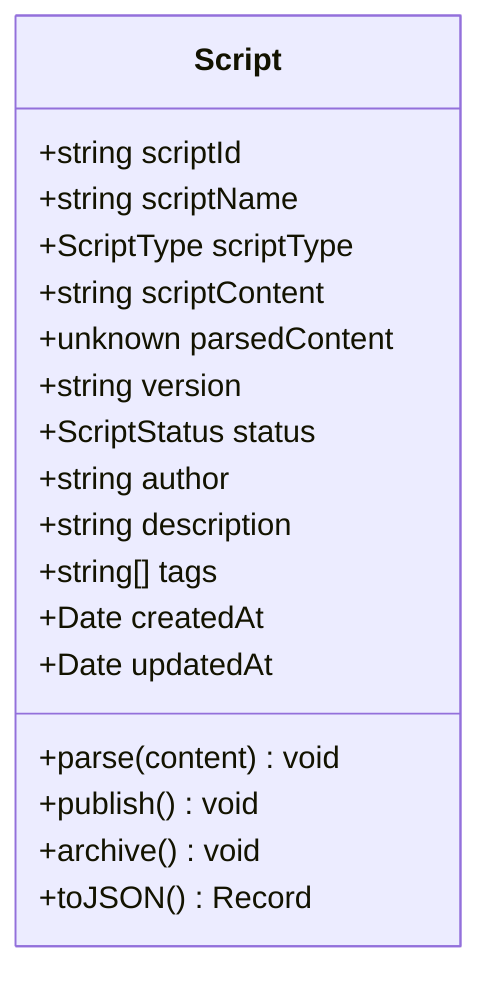
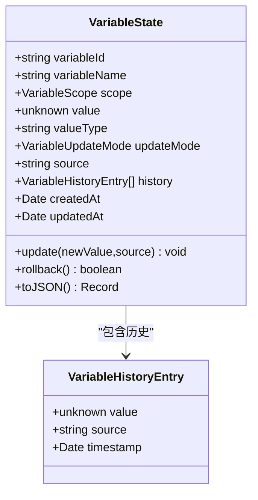
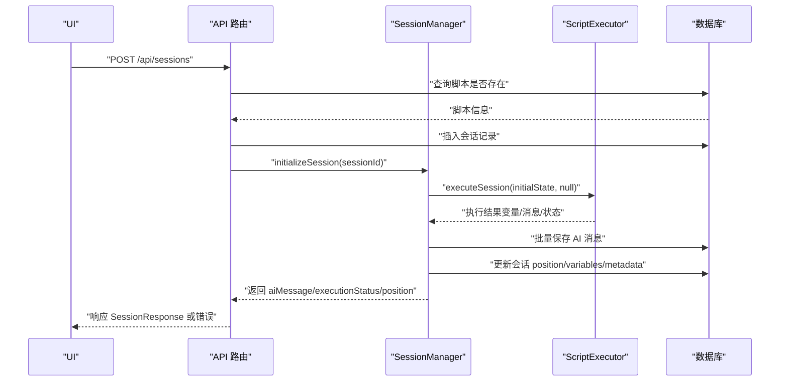
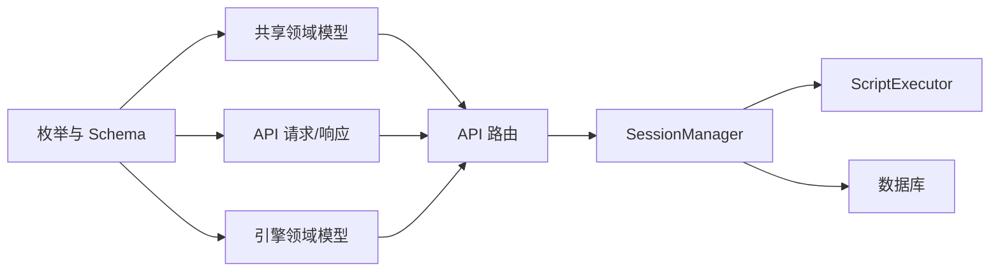

# 领域模型类型

<cite>
**本文引用的文件**
- [packages/core-engine/src/domain/session.ts](file://packages/core-engine/src/domain/session.ts)
- [packages/core-engine/src/domain/message.ts](file://packages/core-engine/src/domain/message.ts)
- [packages/core-engine/src/domain/script.ts](file://packages/core-engine/src/domain/script.ts)
- [packages/core-engine/src/domain/variable.ts](file://packages/core-engine/src/domain/variable.ts)
- [packages/shared-types/src/domain/session.ts](file://packages/shared-types/src/domain/session.ts)
- [packages/shared-types/src/domain/message.ts](file://packages/shared-types/src/domain/message.ts)
- [packages/shared-types/src/domain/script.ts](file://packages/shared-types/src/domain/script.ts)
- [packages/shared-types/src/domain/variable.ts](file://packages/shared-types/src/domain/variable.ts)
- [packages/shared-types/src/enums.ts](file://packages/shared-types/src/enums.ts)
- [packages/shared-types/src/api/responses.ts](file://packages/shared-types/src/api/responses.ts)
- [packages/shared-types/src/api/requests.ts](file://packages/shared-types/src/api/requests.ts)
- [packages/shared-types/src/index.ts](file://packages/shared-types/src/index.ts)
- [packages/api-server/src/routes/sessions.ts](file://packages/api-server/src/routes/sessions.ts)
- [packages/api-server/src/routes/chat.ts](file://packages/api-server/src/routes/chat.ts)
- [packages/api-server/src/services/session-manager.ts](file://packages/api-server/src/services/session-manager.ts)
</cite>

## 目录
1. [引言](#引言)
2. [项目结构](#项目结构)
3. [核心组件](#核心组件)
4. [架构总览](#架构总览)
5. [详细组件分析](#详细组件分析)
6. [依赖分析](#依赖分析)
7. [性能考虑](#性能考虑)
8. [故障排查指南](#故障排查指南)
9. [结论](#结论)
10. [附录](#附录)

## 引言
本文件系统性梳理 HeartRule AI 咨询引擎的领域模型类型，聚焦会话（Session）、消息（Message）、脚本（Script）、变量（Variable）四大核心模型。文档从数据结构设计、字段语义与业务规则出发，阐明各模型间的关系与依赖；结合 API 层、引擎层与 UI 层的实际使用场景，给出类型验证、序列化与反序列化的最佳实践，并通过图示帮助读者建立整体认知。

## 项目结构
领域模型类型分布在两个包中：
- shared-types：提供跨层共享的 TypeScript 类型与 Zod Schema，确保 API、服务与 UI 的一致性。
- core-engine：提供面向引擎的领域类（如 Session、Message、Script、Variable），封装状态变更与序列化逻辑。

图表来源
- [packages/shared-types/src/index.ts](file://packages/shared-types/src/index.ts#L7-L19)
- [packages/shared-types/src/domain/session.ts](file://packages/shared-types/src/domain/session.ts#L38-L88)
- [packages/shared-types/src/domain/message.ts](file://packages/shared-types/src/domain/message.ts#L5-L52)
- [packages/shared-types/src/domain/script.ts](file://packages/shared-types/src/domain/script.ts#L5-L64)
- [packages/shared-types/src/domain/variable.ts](file://packages/shared-types/src/domain/variable.ts#L10-L59)
- [packages/shared-types/src/enums.ts](file://packages/shared-types/src/enums.ts#L1-L118)
- [packages/shared-types/src/api/requests.ts](file://packages/shared-types/src/api/requests.ts#L1-L51)
- [packages/shared-types/src/api/responses.ts](file://packages/shared-types/src/api/responses.ts#L1-L166)
- [packages/core-engine/src/domain/session.ts](file://packages/core-engine/src/domain/session.ts#L1-L137)
- [packages/core-engine/src/domain/message.ts](file://packages/core-engine/src/domain/message.ts#L1-L49)
- [packages/core-engine/src/domain/script.ts](file://packages/core-engine/src/domain/script.ts#L1-L95)
- [packages/core-engine/src/domain/variable.ts](file://packages/core-engine/src/domain/variable.ts#L1-L120)

章节来源
- [packages/shared-types/src/index.ts](file://packages/shared-types/src/index.ts#L1-L19)

## 核心组件
本节对四个核心领域模型进行逐项说明，涵盖字段含义、默认值策略、可选字段处理、业务规则与序列化行为。

- 会话（Session）
  - 字段要点：标识符、所属用户与脚本、状态与执行状态、执行位置、变量与元数据、时间戳等。
  - 关键行为：启动、暂停、恢复、完成、失败、更新执行位置、设置/读取变量、JSON 序列化。
  - 默认策略：未提供时自动填充 UUID、默认 ACTIVE/ RUNNING、默认执行位置为起始索引、Map 初始化为空。
  - 可选字段：完成时间可为空，表示尚未结束。
  - 业务规则：状态机驱动（ACTIVE/PAUSED/COMPLETED/FAILED 与执行状态联动）。
  
- 消息（Message）
  - 字段要点：消息标识、所属会话、角色（用户/助手/系统）、内容、关联动作 ID、元数据、时间戳。
  - 关键行为：构造时自动生成 UUID，支持 JSON 序列化。
  - 可选字段：动作 ID 可空，元数据为 Map。
  - 业务规则：角色枚举约束，内容非空校验由 API 层保障。

- 脚本（Script）
  - 字段要点：脚本标识、名称、类型、原始内容、解析后内容、版本、状态、作者、描述、标签、时间戳。
  - 关键行为：解析内容、发布、归档、JSON 序列化。
  - 默认策略：未提供时默认草稿状态、版本号默认“1.0.0”。
  - 可选字段：解析后内容可空，标签为空数组。
  - 业务规则：状态转换（草稿→已发布/已归档）。

- 变量（Variable）
  - 字段要点：变量状态对象包含变量标识、名称、作用域、当前值、值类型字符串、更新模式、来源、历史、时间戳。
  - 关键行为：更新值（支持覆盖/追加/合并三种模式）、回滚至上一值、JSON 序列化。
  - 默认策略：未提供时默认覆盖模式、历史为空数组。
  - 业务规则：历史记录保存旧值与来源；合并仅对对象类型生效；追加对数组或非数组分别处理。

章节来源
- [packages/core-engine/src/domain/session.ts](file://packages/core-engine/src/domain/session.ts#L7-L137)
- [packages/core-engine/src/domain/message.ts](file://packages/core-engine/src/domain/message.ts#L7-L49)
- [packages/core-engine/src/domain/script.ts](file://packages/core-engine/src/domain/script.ts#L7-L95)
- [packages/core-engine/src/domain/variable.ts](file://packages/core-engine/src/domain/variable.ts#L15-L120)

## 架构总览
下图展示了领域模型在 API 层、引擎层与 UI 层的协作关系与数据流转。

图表来源
- [packages/api-server/src/routes/sessions.ts](file://packages/api-server/src/routes/sessions.ts#L13-L548)
- [packages/api-server/src/routes/chat.ts](file://packages/api-server/src/routes/chat.ts#L15-L152)
- [packages/api-server/src/services/session-manager.ts](file://packages/api-server/src/services/session-manager.ts#L21-L462)
- [packages/shared-types/src/enums.ts](file://packages/shared-types/src/enums.ts#L1-L118)
- [packages/shared-types/src/domain/session.ts](file://packages/shared-types/src/domain/session.ts#L38-L88)
- [packages/shared-types/src/domain/message.ts](file://packages/shared-types/src/domain/message.ts#L5-L52)
- [packages/shared-types/src/domain/script.ts](file://packages/shared-types/src/domain/script.ts#L5-L64)
- [packages/shared-types/src/domain/variable.ts](file://packages/shared-types/src/domain/variable.ts#L10-L59)
- [packages/shared-types/src/api/requests.ts](file://packages/shared-types/src/api/requests.ts#L1-L51)
- [packages/shared-types/src/api/responses.ts](file://packages/shared-types/src/api/responses.ts#L87-L166)

## 详细组件分析

### 会话（Session）类型与行为
- 数据结构与字段
  - 标识与归属：sessionId、userId、scriptId
  - 状态：status（ACTIVE/PAUSED/COMPLETED/FAILED）、executionStatus（RUNNING/WAITING_INPUT/PAUSED/COMPLETED/ERROR）
  - 执行位置：包含阶段、主题、动作索引及可选 ID 字段，便于 UI 导航树定位
  - 存储：variables、metadata 使用 Map；createdAt/updatedAt/completedAt 为日期
- 关键方法
  - 生命周期：start/pause/resume/complete/fail
  - 位置与变量：updatePosition/setVariable/getVariable
  - 序列化：toJSON 将 Map 转为普通对象，日期转 ISO 字符串
- 业务规则
  - 状态机：状态与执行状态需保持一致；失败时将错误写入 metadata
  - 默认值：未提供时自动填充 UUID、默认 ACTIVE/ RUNNING、默认位置为起始索引
- 与共享类型的关系
  - 执行位置接口与 Schema 定义了 phaseIndex/topicIndex/actionIndex 及扩展 ID 字段
  - Session 接口与 Schema 对字段进行 UUID、枚举与日期校验

图表来源
- [packages/core-engine/src/domain/session.ts](file://packages/core-engine/src/domain/session.ts#L7-L137)
- [packages/shared-types/src/domain/session.ts](file://packages/shared-types/src/domain/session.ts#L13-L69)

章节来源
- [packages/core-engine/src/domain/session.ts](file://packages/core-engine/src/domain/session.ts#L7-L137)
- [packages/shared-types/src/domain/session.ts](file://packages/shared-types/src/domain/session.ts#L38-L88)

### 消息（Message）类型与行为
- 数据结构与字段
  - 标识与归属：messageId、sessionId
  - 角色：MessageRole（user/assistant/system）
  - 内容：字符串，配合 UI 渲染
  - 关联：actionId（可空），metadata（Map）
  - 时间：timestamp
- 关键方法
  - 构造：自动生成 messageId
  - 序列化：toJSON 将 Map 转为普通对象，日期转 ISO 字符串
- 业务规则
  - 角色枚举约束；内容非空由 API 层保障
  - UI 中 assistant 角色可能映射为“ai”

图表来源
- [packages/core-engine/src/domain/message.ts](file://packages/core-engine/src/domain/message.ts#L7-L49)
- [packages/shared-types/src/domain/message.ts](file://packages/shared-types/src/domain/message.ts#L5-L29)

章节来源
- [packages/core-engine/src/domain/message.ts](file://packages/core-engine/src/domain/message.ts#L7-L49)
- [packages/shared-types/src/domain/message.ts](file://packages/shared-types/src/domain/message.ts#L5-L52)

### 脚本（Script）类型与行为
- 数据结构与字段
  - 标识与元信息：scriptId、scriptName、version、author、description、tags[]
  - 内容：scriptContent（原始 YAML 文本）、parsedContent（解析后的对象，可空）
  - 类型与状态：scriptType（枚举）、status（草稿/已发布/已归档）
  - 时间：createdAt/updatedAt
- 关键方法
  - parse：写入解析后内容并更新时间
  - publish/archive：状态转换
  - toJSON：序列化为普通对象
- 业务规则
  - 默认状态为草稿；版本默认“1.0.0”
  - API 层在会话详情中将脚本解析内容注入会话元数据，供 UI 构建导航树

图表来源
- [packages/core-engine/src/domain/script.ts](file://packages/core-engine/src/domain/script.ts#L7-L95)
- [packages/shared-types/src/domain/script.ts](file://packages/shared-types/src/domain/script.ts#L5-L39)

章节来源
- [packages/core-engine/src/domain/script.ts](file://packages/core-engine/src/domain/script.ts#L7-L95)
- [packages/shared-types/src/domain/script.ts](file://packages/shared-types/src/domain/script.ts#L5-L64)

### 变量（Variable）类型与行为
- 数据结构与字段
  - 变量状态：variableId、variableName、scope（全局/会话/阶段/主题）、value、valueType（字符串）
  - 更新策略：updateMode（覆盖/追加/合并）
  - 来源：source
  - 历史：VariableHistoryEntry 数组，包含旧值、来源与时间戳
  - 时间：createdAt/updatedAt
- 关键方法
  - update：根据模式更新值并记录历史
  - rollback：回滚至上一值
  - toJSON：序列化为普通对象
- 业务规则
  - 追加：数组则拼接，否则包装为数组
  - 合并：仅当两值均为对象时合并，否则新值覆盖
  - 历史为空时回滚返回 false

图表来源
- [packages/core-engine/src/domain/variable.ts](file://packages/core-engine/src/domain/variable.ts#L15-L120)
- [packages/shared-types/src/domain/variable.ts](file://packages/shared-types/src/domain/variable.ts#L10-L59)

章节来源
- [packages/core-engine/src/domain/variable.ts](file://packages/core-engine/src/domain/variable.ts#L15-L120)
- [packages/shared-types/src/domain/variable.ts](file://packages/shared-types/src/domain/variable.ts#L10-L59)

### 类型验证与序列化最佳实践
- 使用 Zod Schema 进行运行时验证
  - 会话：SessionSchema、ExecutionPositionSchema、CreateSessionInputSchema
  - 消息：MessageSchema、CreateMessageInputSchema
  - 脚本：ScriptSchema、CreateScriptInputSchema
  - 变量：VariableStateSchema、VariableHistoryEntrySchema
- 序列化策略
  - Map 类型统一转为普通对象（Object.fromEntries）
  - 日期统一转为 ISO 字符串
  - 可选字段在 Schema 中显式 optional，避免遗漏
- 反序列化策略
  - API 响应中日期字段通常为字符串，UI/服务侧再转换为 Date 对象
  - 执行位置增强：API 层将索引映射为带 ID 的详细位置信息，便于 UI 定位

章节来源
- [packages/shared-types/src/domain/session.ts](file://packages/shared-types/src/domain/session.ts#L57-L88)
- [packages/shared-types/src/domain/message.ts](file://packages/shared-types/src/domain/message.ts#L18-L52)
- [packages/shared-types/src/domain/script.ts](file://packages/shared-types/src/domain/script.ts#L23-L64)
- [packages/shared-types/src/domain/variable.ts](file://packages/shared-types/src/domain/variable.ts#L35-L59)
- [packages/shared-types/src/api/responses.ts](file://packages/shared-types/src/api/responses.ts#L11-L84)

### API 层使用示例与流程
- 创建会话
  - 请求体：CreateSessionRequest（userId、scriptId、initialVariables）
  - 响应体：SessionResponse 或包含 DetailedApiError 的响应
  - 流程：校验脚本存在 → 插入会话 → 初始化会话（调用引擎）→ 返回 AI 初始消息与执行状态
- 发送消息
  - 非流式：POST /api/chat → 返回 aiMessage、sessionStatus、executionStatus、extractedVariables
  - 流式（SSE）：POST /api/chat/stream → 服务端推送分片
- 会话详情
  - GET /api/sessions/:id → 返回会话信息，元数据中注入脚本解析内容，增强执行位置（含 ID）

图表来源
- [packages/api-server/src/routes/sessions.ts](file://packages/api-server/src/routes/sessions.ts#L14-L133)
- [packages/api-server/src/services/session-manager.ts](file://packages/api-server/src/services/session-manager.ts#L72-L253)

章节来源
- [packages/api-server/src/routes/sessions.ts](file://packages/api-server/src/routes/sessions.ts#L14-L548)
- [packages/api-server/src/routes/chat.ts](file://packages/api-server/src/routes/chat.ts#L15-L152)
- [packages/api-server/src/services/session-manager.ts](file://packages/api-server/src/services/session-manager.ts#L72-L462)

## 依赖分析
- 枚举与 Schema 的集中管理
  - 所有领域模型均依赖共享枚举（SessionStatus、ExecutionStatus、MessageRole、ScriptType、ScriptStatus、VariableScope、VariableUpdateMode）
  - API 层请求/响应类型与领域模型类型通过 Zod Schema 保持一致
- 引擎与 API 的耦合点
  - SessionManager 作为桥梁，负责将 API 输入转换为引擎可执行的状态，再将执行结果持久化并返回给 API
  - 执行位置增强：API 层根据脚本解析内容，将索引映射为带 ID 的详细位置，提升 UI 定位能力

图表来源
- [packages/shared-types/src/enums.ts](file://packages/shared-types/src/enums.ts#L1-L118)
- [packages/shared-types/src/domain/session.ts](file://packages/shared-types/src/domain/session.ts#L38-L88)
- [packages/shared-types/src/domain/message.ts](file://packages/shared-types/src/domain/message.ts#L5-L52)
- [packages/shared-types/src/domain/script.ts](file://packages/shared-types/src/domain/script.ts#L5-L39)
- [packages/shared-types/src/domain/variable.ts](file://packages/shared-types/src/domain/variable.ts#L10-L59)
- [packages/api-server/src/routes/sessions.ts](file://packages/api-server/src/routes/sessions.ts#L13-L548)
- [packages/api-server/src/services/session-manager.ts](file://packages/api-server/src/services/session-manager.ts#L21-L462)

章节来源
- [packages/shared-types/src/enums.ts](file://packages/shared-types/src/enums.ts#L1-L118)
- [packages/shared-types/src/index.ts](file://packages/shared-types/src/index.ts#L7-L19)

## 性能考虑
- 序列化成本控制
  - Map 转对象与日期序列化为字符串是常见开销点；建议在高频路径中缓存中间态或延迟序列化
- 批量写入
  - 引擎执行后批量保存 AI 消息与变量快照，减少事务次数
- 执行位置增强
  - API 层根据脚本解析内容动态生成 ID，避免 UI 侧重复计算

## 故障排查指南
- 常见错误类型与代码
  - 脚本未找到、脚本解析错误、会话执行错误、变量提取错误、数据库错误、系统内部错误
- 错误上下文
  - 包含脚本 ID/名称、会话 ID、执行位置、时间戳等，便于定位问题
- 建议排查步骤
  - 校验请求体是否满足 Zod Schema
  - 检查会话与脚本是否存在且状态正常
  - 查看 SessionManager 的执行日志与错误构建结果
  - 核对 UI 显示的执行位置是否与脚本解析内容一致

章节来源
- [packages/shared-types/src/enums.ts](file://packages/shared-types/src/enums.ts#L83-L105)
- [packages/shared-types/src/api/responses.ts](file://packages/shared-types/src/api/responses.ts#L66-L84)
- [packages/api-server/src/services/session-manager.ts](file://packages/api-server/src/services/session-manager.ts#L235-L252)

## 结论
本文件从类型定义、业务规则、API/引擎/UI 协作三个维度，全面阐述了 HeartRule 领域模型的设计与实现。通过共享类型与 Zod Schema 的统一约束，确保了跨层一致性；通过引擎服务的抽象，实现了脚本驱动的会话生命周期管理；通过 API 层的位置增强与错误上下文，提升了可观测性与可维护性。建议在后续迭代中持续完善 Schema 校验与错误分类，优化序列化与批量写入策略，进一步提升系统性能与稳定性。

## 附录
- 类型导出入口
  - 共享类型包统一导出领域模型、API 类型与枚举，便于跨包引用
- UI 层建议
  - 使用增强执行位置渲染导航树；对 assistant 角色进行“AI”友好显示
- 引擎层建议
  - 在变量更新前进行类型推断与快照记录，便于审计与回滚

章节来源
- [packages/shared-types/src/index.ts](file://packages/shared-types/src/index.ts#L7-L19)