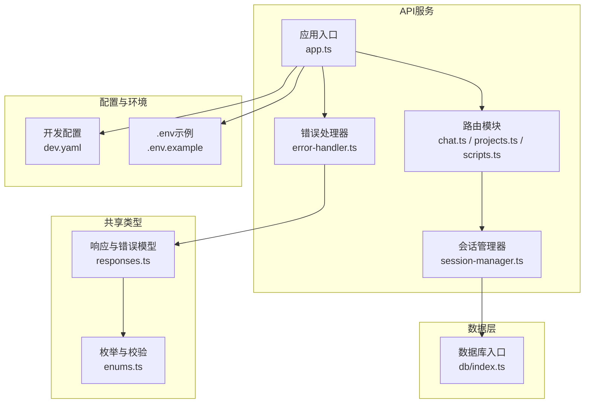
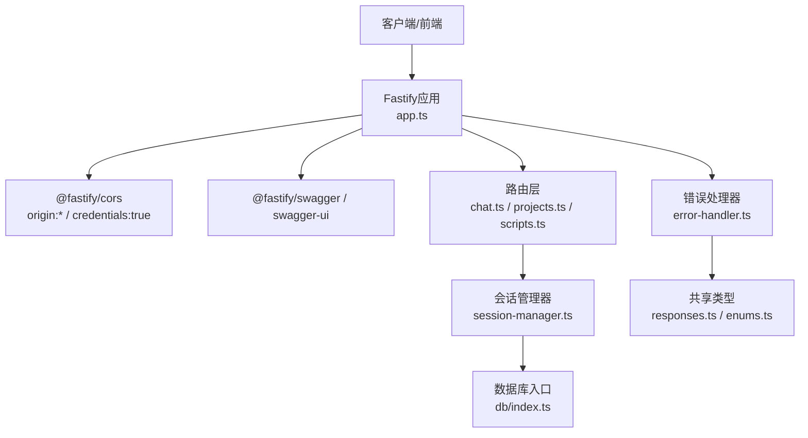
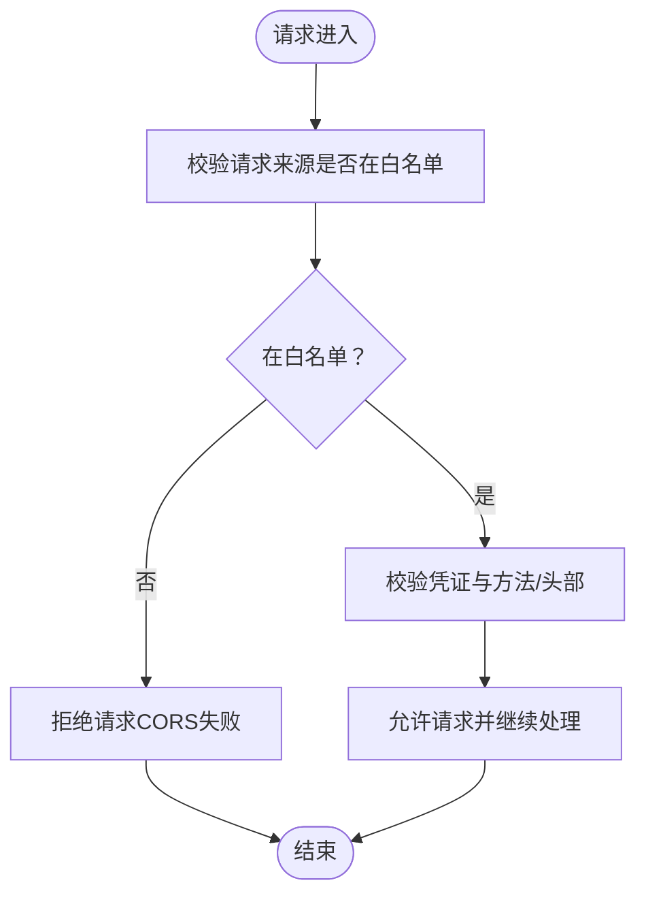
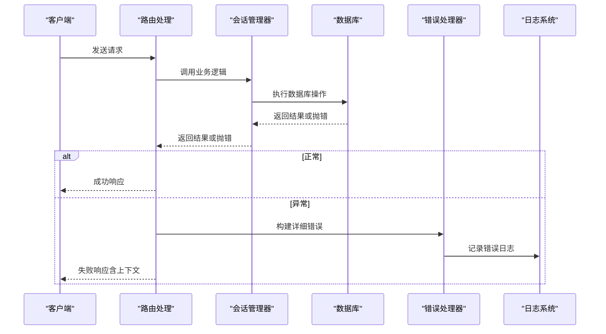
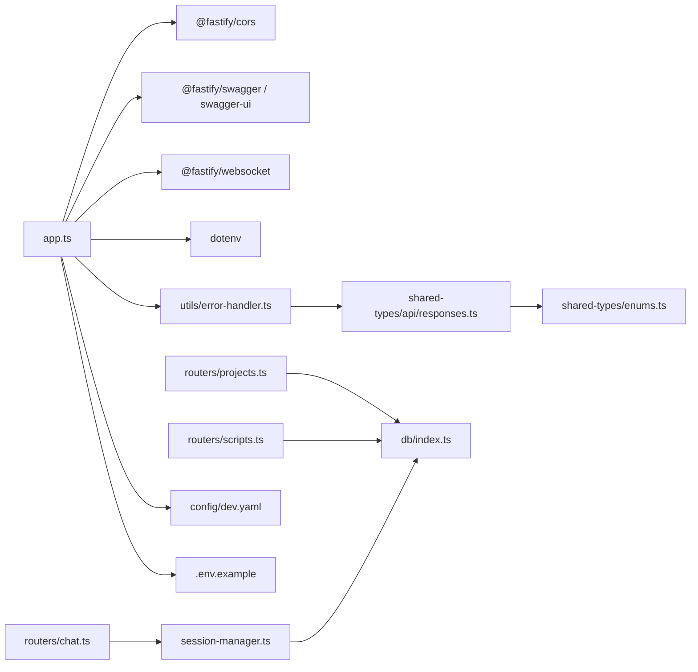

# API安全与认证

<cite>
**本文引用的文件**
- [packages/api-server/src/app.ts](file://packages/api-server/src/app.ts)
- [packages/api-server/src/utils/error-handler.ts](file://packages/api-server/src/utils/error-handler.ts)
- [packages/api-server/src/routers/chat.ts](file://packages/api-server/src/routers/chat.ts)
- [packages/api-server/src/routers/projects.ts](file://packages/api-server/src/routers/projects.ts)
- [packages/api-server/src/routers/scripts.ts](file://packages/api-server/src/routers/scripts.ts)
- [packages/api-server/src/services/session-manager.ts](file://packages/api-server/src/services/session-manager.ts)
- [packages/api-server/src/db/index.ts](file://packages/api-server/src/db/index.ts)
- [packages/shared-types/src/api/responses.ts](file://packages/shared-types/src/api/responses.ts)
- [packages/shared-types/src/enums.ts](file://packages/shared-types/src/enums.ts)
- [config/dev.yaml](file://config/dev.yaml)
- [.env.example](file://.env.example)
- [packages/api-server/test-api.ps1](file://packages/api-server/test-api.ps1)
</cite>

## 目录
1. [简介](#简介)
2. [项目结构](#项目结构)
3. [核心组件](#核心组件)
4. [架构总览](#架构总览)
5. [详细组件分析](#详细组件分析)
6. [依赖关系分析](#依赖关系分析)
7. [性能考量](#性能考量)
8. [故障排查指南](#故障排查指南)
9. [结论](#结论)
10. [附录](#附录)

## 简介
本指南面向HeartRule AI咨询引擎的API层，聚焦于API安全与认证的综合实践，覆盖CORS配置策略、请求访问控制（请求头校验、IP白名单、速率限制）、错误处理与日志记录、API密钥与JWT令牌、会话安全、常见攻击防护（XSS、CSRF、SQL注入）以及API监控与异常检测方案。文档以仓库现有实现为基础，结合最佳实践给出可操作的安全加固建议。

## 项目结构
API服务采用Fastify框架，通过模块化路由组织业务能力，并使用共享类型库进行响应与错误模型的约束。数据库访问通过Drizzle ORM封装，统一在数据库入口加载环境变量并建立连接。

**图表来源**
- [packages/api-server/src/app.ts](file://packages/api-server/src/app.ts#L21-L105)
- [packages/api-server/src/routers/chat.ts](file://packages/api-server/src/routers/chat.ts#L15-L152)
- [packages/api-server/src/routers/projects.ts](file://packages/api-server/src/routers/projects.ts#L26-L500)
- [packages/api-server/src/routers/scripts.ts](file://packages/api-server/src/routers/scripts.ts#L12-L325)
- [packages/api-server/src/services/session-manager.ts](file://packages/api-server/src/services/session-manager.ts#L21-L466)
- [packages/api-server/src/utils/error-handler.ts](file://packages/api-server/src/utils/error-handler.ts#L95-L233)
- [packages/api-server/src/db/index.ts](file://packages/api-server/src/db/index.ts#L1-L26)
- [packages/shared-types/src/api/responses.ts](file://packages/shared-types/src/api/responses.ts#L68-L166)
- [packages/shared-types/src/enums.ts](file://packages/shared-types/src/enums.ts#L83-L118)
- [config/dev.yaml](file://config/dev.yaml#L55-L63)
- [.env.example](file://.env.example#L27-L28)

**章节来源**
- [packages/api-server/src/app.ts](file://packages/api-server/src/app.ts#L21-L105)
- [packages/api-server/src/db/index.ts](file://packages/api-server/src/db/index.ts#L1-L26)

## 核心组件
- CORS与文档：应用入口注册CORS插件，默认允许任意来源与凭证；同时集成Swagger与Swagger UI，便于API文档与调试。
- 错误处理：统一错误映射、错误响应构建、日志记录与恢复建议，支持上下文定位与时间戳。
- 会话管理：封装脚本执行引擎，负责会话初始化、用户输入处理、消息持久化与变量快照记录。
- 路由与校验：各路由对请求体/参数进行Schema校验，结合Zod对项目管理等接口进行强类型约束。
- 数据库：集中式连接管理，要求显式设置数据库连接字符串。

**章节来源**
- [packages/api-server/src/app.ts](file://packages/api-server/src/app.ts#L28-L63)
- [packages/api-server/src/utils/error-handler.ts](file://packages/api-server/src/utils/error-handler.ts#L22-L90)
- [packages/api-server/src/services/session-manager.ts](file://packages/api-server/src/services/session-manager.ts#L21-L466)
- [packages/api-server/src/routers/projects.ts](file://packages/api-server/src/routers/projects.ts#L9-L24)
- [packages/api-server/src/db/index.ts](file://packages/api-server/src/db/index.ts#L10-L25)

## 架构总览
下图展示API安全与认证相关的关键交互：CORS策略、错误处理与日志、会话管理与脚本执行、数据库访问与共享类型约束。

**图表来源**
- [packages/api-server/src/app.ts](file://packages/api-server/src/app.ts#L28-L63)
- [packages/api-server/src/routers/chat.ts](file://packages/api-server/src/routers/chat.ts#L15-L152)
- [packages/api-server/src/routers/projects.ts](file://packages/api-server/src/routers/projects.ts#L26-L500)
- [packages/api-server/src/routers/scripts.ts](file://packages/api-server/src/routers/scripts.ts#L12-L325)
- [packages/api-server/src/services/session-manager.ts](file://packages/api-server/src/services/session-manager.ts#L21-L466)
- [packages/api-server/src/utils/error-handler.ts](file://packages/api-server/src/utils/error-handler.ts#L95-L233)
- [packages/api-server/src/db/index.ts](file://packages/api-server/src/db/index.ts#L1-L26)
- [packages/shared-types/src/api/responses.ts](file://packages/shared-types/src/api/responses.ts#L68-L166)
- [packages/shared-types/src/enums.ts](file://packages/shared-types/src/enums.ts#L83-L118)

## 详细组件分析

### CORS配置与白名单策略
- 当前实现：开发环境下CORS允许任意来源与凭证，未做白名单限制。
- 生产环境建议：
  - 明确配置允许的origin列表，避免通配符。
  - 严格限定allowMethods与allowHeaders，仅放行必要范围。
  - 凭证处理需谨慎，若origin为通配符，则credentials不可启用。
- 配置参考：
  - 开发环境白名单样例见开发配置文件中的CORS段落。
  - 环境变量模板中提供JWT密钥项，可用于后续认证扩展。

**章节来源**
- [packages/api-server/src/app.ts](file://packages/api-server/src/app.ts#L28-L32)
- [config/dev.yaml](file://config/dev.yaml#L55-L63)
- [.env.example](file://.env.example#L27-L28)

### API访问控制与请求头验证
- 请求头验证：当前路由未对Authorization或自定义鉴权头进行强制校验，建议在路由层增加中间件统一校验。
- IP白名单过滤：可在网关或反向代理层实现，或在Fastify插件中按请求源IP进行拦截。
- 速率限制：建议引入限流中间件（如基于内存或Redis），按IP/用户ID/端点维度进行配额控制。

**章节来源**
- [packages/api-server/src/routers/chat.ts](file://packages/api-server/src/routers/chat.ts#L15-L152)
- [packages/api-server/src/routers/projects.ts](file://packages/api-server/src/routers/projects.ts#L26-L500)
- [packages/api-server/src/routers/scripts.ts](file://packages/api-server/src/routers/scripts.ts#L12-L325)

### 错误处理与日志记录最佳实践
- 统一错误映射：根据错误消息关键字匹配错误类型与HTTP状态码，保证对外一致的错误语义。
- 详细错误响应：包含错误码、类型、消息、细节、上下文（脚本/会话/位置/时间戳）与恢复建议。
- 日志记录：记录错误对象的必要字段（消息、堆栈、名称），并附带上下文信息，避免泄露敏感数据。

**图表来源**
- [packages/api-server/src/services/session-manager.ts](file://packages/api-server/src/services/session-manager.ts#L237-L255)
- [packages/api-server/src/utils/error-handler.ts](file://packages/api-server/src/utils/error-handler.ts#L95-L233)
- [packages/api-server/src/routers/chat.ts](file://packages/api-server/src/routers/chat.ts#L44-L79)

**章节来源**
- [packages/api-server/src/utils/error-handler.ts](file://packages/api-server/src/utils/error-handler.ts#L22-L90)
- [packages/api-server/src/utils/error-handler.ts](file://packages/api-server/src/utils/error-handler.ts#L95-L233)

### API密钥管理、JWT令牌与会话安全
- API密钥：当前未在路由层实现密钥校验，建议在中间件中读取请求头中的密钥并进行校验。
- JWT令牌：环境变量模板提供JWT密钥项，可作为后续JWT签发与校验的基础。
- 会话安全：会话管理器负责会话状态与变量的持久化，建议在会话创建与访问时加入用户身份绑定与权限校验。

**章节来源**
- [.env.example](file://.env.example#L27-L28)
- [packages/api-server/src/services/session-manager.ts](file://packages/api-server/src/services/session-manager.ts#L73-L255)

### 常见安全漏洞防护
- XSS：对所有用户输入进行严格的Schema校验与输出编码；在前端渲染时避免内联脚本与危险DOM操作。
- CSRF：在同源策略基础上，结合CSRF Token或SameSite Cookie策略；对关键变更操作强制Token校验。
- SQL注入：当前使用ORM进行查询，建议保持使用参数化查询与Schema校验，避免动态拼接SQL。
- 敏感信息脱敏：日志记录中避免输出完整密钥、令牌与用户隐私数据；错误响应中不暴露内部实现细节。

**章节来源**
- [packages/api-server/src/routers/projects.ts](file://packages/api-server/src/routers/projects.ts#L9-L24)
- [packages/api-server/src/utils/error-handler.ts](file://packages/api-server/src/utils/error-handler.ts#L216-L232)

### API监控与异常检测
- 健康检查：根路径与健康检查端点用于服务可用性探测。
- 监控指标：建议接入指标采集（如请求量、响应时间、错误率、数据库连接数）。
- 异常检测：结合错误处理器的日志结构，建立告警规则（如错误码分布、上下文定位异常、LLM服务错误）。

**章节来源**
- [packages/api-server/src/app.ts](file://packages/api-server/src/app.ts#L72-L89)
- [packages/api-server/src/utils/error-handler.ts](file://packages/api-server/src/utils/error-handler.ts#L216-L232)

## 依赖关系分析
- 应用入口依赖CORS、Swagger、WebSocket与dotenv，统一加载环境变量。
- 路由层依赖数据库入口与会话管理器，部分路由使用Zod进行Schema校验。
- 错误处理器依赖共享类型库的错误模型与枚举，保证错误响应一致性。
- 开发配置与环境变量模板为CORS与JWT等安全配置提供基础。

**图表来源**
- [packages/api-server/src/app.ts](file://packages/api-server/src/app.ts#L4-L9)
- [packages/api-server/src/routers/chat.ts](file://packages/api-server/src/routers/chat.ts#L1-L10)
- [packages/api-server/src/routers/projects.ts](file://packages/api-server/src/routers/projects.ts#L1-L6)
- [packages/api-server/src/routers/scripts.ts](file://packages/api-server/src/routers/scripts.ts#L1-L7)
- [packages/api-server/src/services/session-manager.ts](file://packages/api-server/src/services/session-manager.ts#L1-L16)
- [packages/api-server/src/utils/error-handler.ts](file://packages/api-server/src/utils/error-handler.ts#L6-L7)
- [packages/shared-types/src/api/responses.ts](file://packages/shared-types/src/api/responses.ts#L1-L7)
- [packages/shared-types/src/enums.ts](file://packages/shared-types/src/enums.ts#L1-L1)
- [config/dev.yaml](file://config/dev.yaml#L1-L63)
- [.env.example](file://.env.example#L1-L31)

**章节来源**
- [packages/api-server/src/app.ts](file://packages/api-server/src/app.ts#L1-L105)
- [packages/api-server/src/db/index.ts](file://packages/api-server/src/db/index.ts#L1-L26)

## 性能考量
- CORS开销：生产环境应缩小白名单范围，减少预检请求与不必要的头部/方法放行。
- 数据库连接：集中式连接管理，注意连接池大小与超时设置，避免阻塞。
- 错误处理：统一错误映射与日志结构，减少重复计算与冗余字段。
- 路由校验：Zod Schema校验带来一定CPU开销，建议在高频端点评估缓存策略。

[本节为通用指导，无需“章节来源”]

## 故障排查指南
- CORS问题：确认生产环境origin白名单与credentials配置；浏览器开发者工具查看预检请求与响应头。
- 错误响应：使用错误处理器提供的上下文定位（脚本ID、会话ID、执行位置、时间戳）快速定位问题。
- 数据库连接：检查DATABASE_URL环境变量与连接字符串格式，确保数据库服务可达。
- API测试：可参考测试脚本进行端到端验证，确认会话创建与聊天流程。

**章节来源**
- [packages/api-server/src/utils/error-handler.ts](file://packages/api-server/src/utils/error-handler.ts#L95-L233)
- [packages/api-server/src/db/index.ts](file://packages/api-server/src/db/index.ts#L10-L14)
- [packages/api-server/test-api.ps1](file://packages/api-server/test-api.ps1#L1-L99)

## 结论
当前API服务具备良好的模块化结构与统一错误处理能力，但在生产环境的安全配置上仍需补齐：明确CORS白名单、引入请求头鉴权与速率限制、完善JWT与会话安全策略、强化日志脱敏与监控告警。遵循本指南的加固建议，可显著提升系统的安全性与稳定性。

[本节为总结，无需“章节来源”]

## 附录
- 开发配置中的CORS白名单样例可作为生产环境的起点，建议逐步收紧。
- 环境变量模板中的JWT密钥项需在生产环境替换为强随机值并妥善保管。

**章节来源**
- [config/dev.yaml](file://config/dev.yaml#L55-L63)
- [.env.example](file://.env.example#L27-L28)