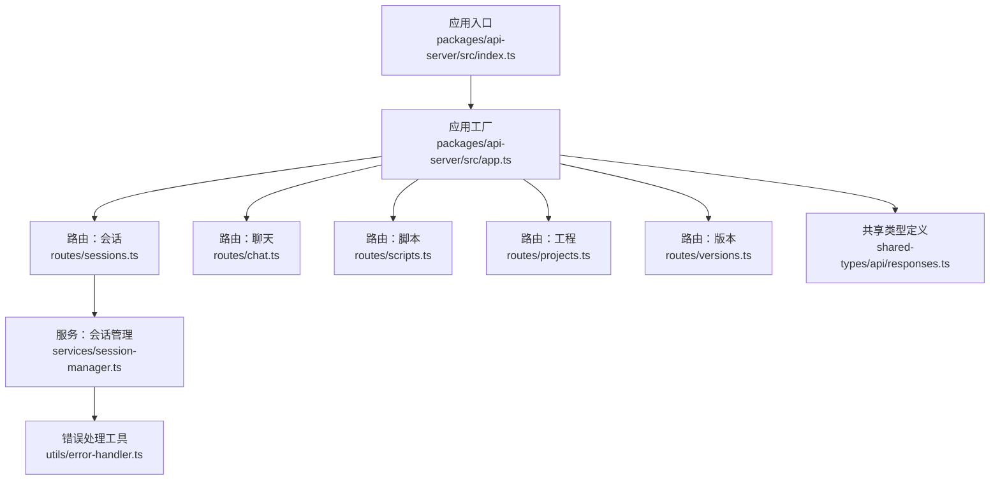
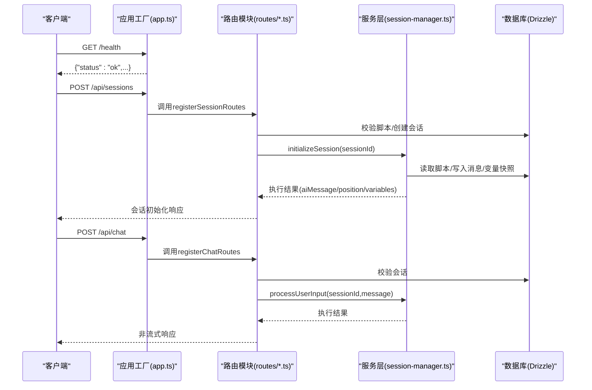
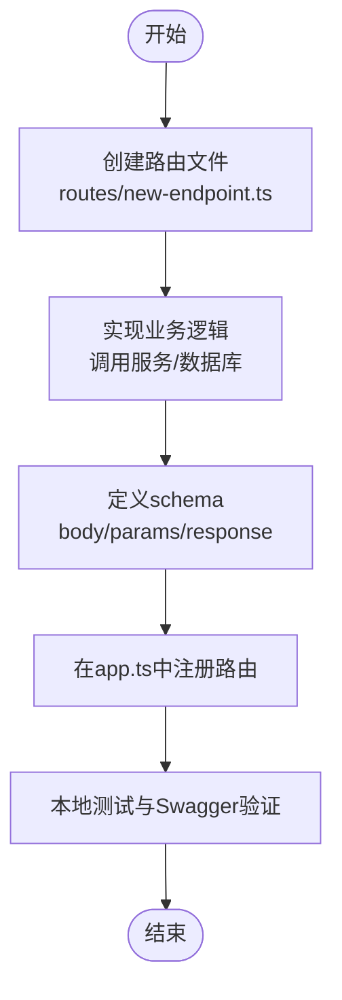
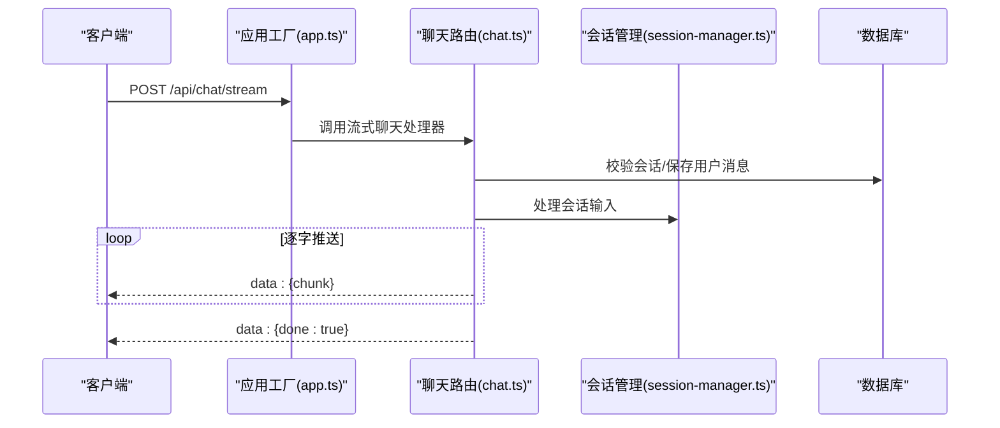
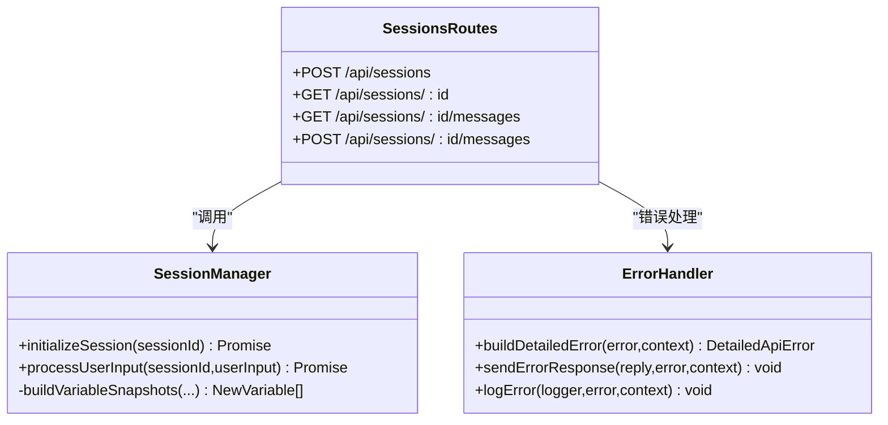
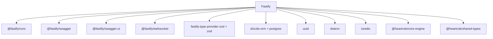

# API开发

<cite>
**本文引用的文件**
- [packages/api-server/src/app.ts](file://packages/api-server/src/app.ts)
- [packages/api-server/src/index.ts](file://packages/api-server/src/index.ts)
- [packages/api-server/src/route/sessions.ts](file://packages/api-server/src/routes/sessions.ts)
- [packages/api-server/src/routes/chat.ts](file://packages/api-server/src/routes/chat.ts)
- [packages/api-server/src/routes/scripts.ts](file://packages/api-server/src/routes/scripts.ts)
- [packages/api-server/src/routes/projects.ts](file://packages/api-server/src/routes/projects.ts)
- [packages/api-server/src/routes/versions.ts](file://packages/api-server/src/routes/versions.ts)
- [packages/api-server/src/services/session-manager.ts](file://packages/api-server/src/services/session-manager.ts)
- [packages/api-server/src/utils/error-handler.ts](file://packages/api-server/src/utils/error-handler.ts)
- [packages/shared-types/src/api/responses.ts](file://packages/shared-types/src/api/responses.ts)
- [packages/api-server/package.json](file://packages/api-server/package.json)
- [DEV_START_GUIDE.md](file://DEV_START_GUIDE.md)
- [scripts/sessions/cbt_depression_assessment.yaml](file://scripts/sessions/cbt_depression_assessment.yaml)
- [packages/api-server/test-full-flow.ts](file://packages/api-server/test-full-flow.ts)
</cite>

## 目录
1. [简介](#简介)
2. [项目结构](#项目结构)
3. [核心组件](#核心组件)
4. [架构总览](#架构总览)
5. [详细组件分析](#详细组件分析)
6. [依赖分析](#依赖分析)
7. [性能考量](#性能考量)
8. [故障排查指南](#故障排查指南)
9. [结论](#结论)
10. [附录](#附录)

## 简介
本指南面向HeartRule AI咨询引擎的API开发者，围绕Fastify框架在本项目中的路由开发规范、RESTful设计原则、错误处理策略、以及WebSocket实时通信实现进行系统化说明。文档以现有代码为依据，提供可操作的开发流程、最佳实践与测试策略，帮助你在生产环境中稳定地扩展API。

## 项目结构
- API服务采用模块化路由组织，每个领域（会话、聊天、脚本、工程、版本）独立文件，便于维护与扩展。
- 应用入口负责插件注册（CORS、Swagger、WebSocket）、健康检查、根路径响应，并集中注册各路由模块。
- 服务层封装业务逻辑（如会话管理），并与数据库层（Drizzle ORM）交互。
- 类型与错误模型由共享类型包提供，确保前后端一致的契约。

图表来源
- [packages/api-server/src/index.ts](file://packages/api-server/src/index.ts#L1-L10)
- [packages/api-server/src/app.ts](file://packages/api-server/src/app.ts#L91-L102)
- [packages/api-server/src/routes/sessions.ts](file://packages/api-server/src/routes/sessions.ts#L13-L133)
- [packages/api-server/src/routes/chat.ts](file://packages/api-server/src/routes/chat.ts#L15-L151)
- [packages/api-server/src/routes/scripts.ts](file://packages/api-server/src/routes/scripts.ts#L12-L324)
- [packages/api-server/src/routes/projects.ts](file://packages/api-server/src/routes/projects.ts#L26-L499)
- [packages/api-server/src/routes/versions.ts](file://packages/api-server/src/routes/versions.ts#L20-L406)
- [packages/api-server/src/services/session-manager.ts](file://packages/api-server/src/services/session-manager.ts#L21-L465)
- [packages/api-server/src/utils/error-handler.ts](file://packages/api-server/src/utils/error-handler.ts#L95-L232)
- [packages/shared-types/src/api/responses.ts](file://packages/shared-types/src/api/responses.ts#L89-L166)

章节来源
- [packages/api-server/src/app.ts](file://packages/api-server/src/app.ts#L21-L105)
- [packages/api-server/src/index.ts](file://packages/api-server/src/index.ts#L1-L10)

## 核心组件
- 应用工厂与插件注册：负责CORS、Swagger/OpenAPI、Swagger UI、WebSocket、根路径与健康检查。
- 路由模块：按领域拆分，统一通过schema声明请求体、参数、响应结构，提升可读性与可测试性。
- 服务层：封装业务流程（如会话初始化、消息处理），并与数据库交互。
- 错误处理：统一错误映射、状态码、上下文与恢复建议，保证一致的错误响应格式。
- 共享类型：定义API响应、错误、位置信息等结构，确保前后端契约一致。

章节来源
- [packages/api-server/src/app.ts](file://packages/api-server/src/app.ts#L21-L105)
- [packages/api-server/src/utils/error-handler.ts](file://packages/api-server/src/utils/error-handler.ts#L22-L181)
- [packages/shared-types/src/api/responses.ts](file://packages/shared-types/src/api/responses.ts#L68-L166)

## 架构总览
下图展示了API启动、路由注册与请求处理的关键路径，以及与服务层、数据库层的交互。

图表来源
- [packages/api-server/src/app.ts](file://packages/api-server/src/app.ts#L91-L102)
- [packages/api-server/src/routes/sessions.ts](file://packages/api-server/src/routes/sessions.ts#L55-L133)
- [packages/api-server/src/routes/chat.ts](file://packages/api-server/src/routes/chat.ts#L44-L79)
- [packages/api-server/src/services/session-manager.ts](file://packages/api-server/src/services/session-manager.ts#L73-L255)

## 详细组件分析

### Fastify路由开发规范与文件结构
- 路由文件命名与职责：按领域划分（sessions.ts、chat.ts、scripts.ts、projects.ts、versions.ts），每个文件导出注册函数或Fastify插件异步函数。
- schema声明：统一在路由中使用schema对象声明请求体、参数、响应结构，便于自动生成OpenAPI文档与类型校验。
- 请求处理函数：严格从request.body/request.params/request.query读取参数；使用reply.status().send()返回标准响应；错误通过统一工具或try/catch处理。
- 响应格式：遵循共享类型定义，统一包含success/data/error字段；错误时包含错误码、类型、上下文与恢复建议。

章节来源
- [packages/api-server/src/routes/sessions.ts](file://packages/api-server/src/routes/sessions.ts#L17-L53)
- [packages/api-server/src/routes/chat.ts](file://packages/api-server/src/routes/chat.ts#L20-L42)
- [packages/api-server/src/routes/scripts.ts](file://packages/api-server/src/routes/scripts.ts#L16-L33)
- [packages/api-server/src/routes/projects.ts](file://packages/api-server/src/routes/projects.ts#L28-L85)
- [packages/api-server/src/routes/versions.ts](file://packages/api-server/src/routes/versions.ts#L22-L46)
- [packages/shared-types/src/api/responses.ts](file://packages/shared-types/src/api/responses.ts#L89-L108)

### API端点添加流程（从创建到注册）
- 创建路由文件：在routes目录下新建文件，导出注册函数或插件异步函数。
- 实现业务逻辑：在对应服务层或直接在路由中实现处理逻辑，必要时调用数据库访问层。
- 声明schema：在路由中定义body/params/query/response schema，确保类型安全与文档生成。
- 注册路由：在应用工厂中动态导入并调用注册函数，或使用app.register(plugin, { prefix })。
- 启动与验证：启动服务后访问/doc查看Swagger UI确认端点可用。

图表来源
- [packages/api-server/src/app.ts](file://packages/api-server/src/app.ts#L91-L102)
- [packages/api-server/src/routes/sessions.ts](file://packages/api-server/src/routes/sessions.ts#L13-L133)

章节来源
- [packages/api-server/src/app.ts](file://packages/api-server/src/app.ts#L91-L102)
- [packages/api-server/src/routes/sessions.ts](file://packages/api-server/src/routes/sessions.ts#L13-L133)

### RESTful API设计原则
- HTTP方法选择：资源创建使用POST，查询使用GET，更新使用PUT，删除使用DELETE；会话消息发送使用POST（便于携带内容）。
- URL命名规范：使用名词复数形式表示集合（如/projects），使用资源ID表示单个资源（如/projects/:id/files/:fileId）。
- 状态码使用：成功创建使用201，查询/更新/删除使用200；参数错误使用400；资源不存在使用404；服务不可用使用503；内部错误使用500。
- 错误处理策略：统一返回{ success, error }结构，error包含code/type/message/details/context/recovery，便于前端展示与定位问题。

章节来源
- [packages/api-server/src/routes/projects.ts](file://packages/api-server/src/routes/projects.ts#L133-L193)
- [packages/api-server/src/routes/versions.ts](file://packages/api-server/src/routes/versions.ts#L118-L199)
- [packages/api-server/src/utils/error-handler.ts](file://packages/api-server/src/utils/error-handler.ts#L186-L211)
- [packages/shared-types/src/api/responses.ts](file://packages/shared-types/src/api/responses.ts#L89-L108)

### WebSocket实时通信实现
- 插件启用：在应用工厂中注册@fastify/websocket插件，并设置maxPayload等选项。
- SSE流式响应：聊天路由提供Server-Sent Events端点，设置正确的响应头，逐字节推送数据块，最后发送done标记。
- WebSocket端点：可在应用工厂中注册WebSocket路由，定义连接、消息收发与事件处理逻辑（例如心跳、断线重连、消息广播等）。

图表来源
- [packages/api-server/src/app.ts](file://packages/api-server/src/app.ts#L65-L70)
- [packages/api-server/src/routes/chat.ts](file://packages/api-server/src/routes/chat.ts#L82-L150)
- [packages/api-server/src/services/session-manager.ts](file://packages/api-server/src/services/session-manager.ts#L258-L464)

章节来源
- [packages/api-server/src/app.ts](file://packages/api-server/src/app.ts#L65-L70)
- [packages/api-server/src/routes/chat.ts](file://packages/api-server/src/routes/chat.ts#L82-L150)

### 会话管理与聊天处理（核心业务）
- 会话初始化：校验脚本存在性，创建会话记录，调用会话管理器执行脚本获取初始AI消息，保存消息与变量快照，返回位置信息与状态。
- 用户输入处理：保存用户消息，恢复执行状态，调用脚本执行器推进流程，批量保存新增AI消息，更新会话状态与变量快照。
- 错误处理：捕获异常并构建详细错误，包含上下文与恢复建议，返回统一错误响应。

图表来源
- [packages/api-server/src/services/session-manager.ts](file://packages/api-server/src/services/session-manager.ts#L21-L465)
- [packages/api-server/src/utils/error-handler.ts](file://packages/api-server/src/utils/error-handler.ts#L95-L232)
- [packages/api-server/src/routes/sessions.ts](file://packages/api-server/src/routes/sessions.ts#L15-L471)

章节来源
- [packages/api-server/src/routes/sessions.ts](file://packages/api-server/src/routes/sessions.ts#L55-L133)
- [packages/api-server/src/services/session-manager.ts](file://packages/api-server/src/services/session-manager.ts#L73-L255)
- [packages/api-server/src/utils/error-handler.ts](file://packages/api-server/src/utils/error-handler.ts#L186-L211)

### 脚本管理与工程版本控制
- 脚本管理：支持创建脚本（解析YAML）、获取详情、列出脚本、导入脚本（调试用途）、验证脚本（占位）。
- 工程管理：支持创建/更新/归档工程，复制工程，获取文件列表与单个文件，增删改文件。
- 版本管理：支持草稿保存/获取、发布版本、获取版本历史、回滚到指定版本、版本对比（占位）。

章节来源
- [packages/api-server/src/routes/scripts.ts](file://packages/api-server/src/routes/scripts.ts#L14-L324)
- [packages/api-server/src/routes/projects.ts](file://packages/api-server/src/routes/projects.ts#L133-L496)
- [packages/api-server/src/routes/versions.ts](file://packages/api-server/src/routes/versions.ts#L118-L403)

### 共享类型与响应结构
- 统一响应结构：ApiResponse包含success/data/error，便于前端统一处理。
- 详细错误结构：包含错误码、类型、消息、细节、上下文与恢复建议。
- 位置信息增强：在会话详情中将索引位置转换为带ID的位置信息，便于前端导航。

章节来源
- [packages/shared-types/src/api/responses.ts](file://packages/shared-types/src/api/responses.ts#L89-L166)

## 依赖分析
- 应用框架：Fastify作为核心Web框架，配合插件体系实现CORS、Swagger、WebSocket。
- 类型校验：使用fastify-type-provider-zod与Zod schema，结合共享类型包确保前后端一致性。
- 数据访问：Drizzle ORM提供类型安全的数据库操作。
- 业务引擎：@heartrule/core-engine负责脚本执行与状态推进。
- 工具与库：uuid用于生成ID，dotenv加载环境变量，ioredis用于缓存/队列（如需）。

图表来源
- [packages/api-server/package.json](file://packages/api-server/package.json#L20-L34)

章节来源
- [packages/api-server/package.json](file://packages/api-server/package.json#L20-L34)

## 性能考量
- 路由schema与类型校验：提前拦截无效请求，减少无效分支执行，降低数据库压力。
- 批量写入：会话管理器在一次执行中批量保存AI消息与变量快照，避免多次往返。
- SSE流式输出：按字符推送，降低首字延迟；注意背压与客户端断开处理。
- 缓存与限流：可结合ioredis实现会话状态缓存与速率限制（建议在后续扩展）。
- 数据库索引：确保常用查询字段（如sessions.userId、messages.sessionId）具备索引。

## 故障排查指南
- 启动与端口：参考开发指南，确认端口占用与Docker服务状态；必要时使用提供的脚本或命令。
- 数据库迁移：使用脚本运行数据库迁移，确保表结构与版本一致。
- 错误响应：统一错误响应包含上下文与恢复建议，优先根据recovery字段指导用户操作。
- 日志与追踪：利用应用日志与错误日志定位问题，必要时开启更详细日志级别。

章节来源
- [DEV_START_GUIDE.md](file://DEV_START_GUIDE.md#L67-L113)
- [packages/api-server/src/utils/error-handler.ts](file://packages/api-server/src/utils/error-handler.ts#L216-L232)

## 结论
本指南基于HeartRule现有实现，总结了Fastify路由开发规范、RESTful设计原则、错误处理策略与WebSocket实时通信方案。通过模块化路由、统一schema与共享类型、服务层封装与错误工具，API具备良好的可维护性与可扩展性。建议在新增端点时严格遵循本文规范，确保与现有架构保持一致。

## 附录

### API文档生成与预览
- Swagger/OpenAPI：应用工厂中已集成@fastify/swagger与@fastify/swagger-ui，启动后可通过/doc访问。
- 文档标签：按领域（sessions、chat、scripts）分类，便于导航与检索。

章节来源
- [packages/api-server/src/app.ts](file://packages/api-server/src/app.ts#L34-L63)

### 测试策略与示例
- 端到端流程测试：提供完整会话流程测试脚本，覆盖创建会话、初始化、多轮对话与状态持久化验证。
- 建议测试范围：单元测试（路由schema、服务方法）、集成测试（数据库事务、错误路径）、端到端测试（完整会话流程）。
- 示例脚本：可参考会话脚本样例，用于调试与演示。

章节来源
- [packages/api-server/test-full-flow.ts](file://packages/api-server/test-full-flow.ts#L16-L200)
- [scripts/sessions/cbt_depression_assessment.yaml](file://scripts/sessions/cbt_depression_assessment.yaml#L1-L166)