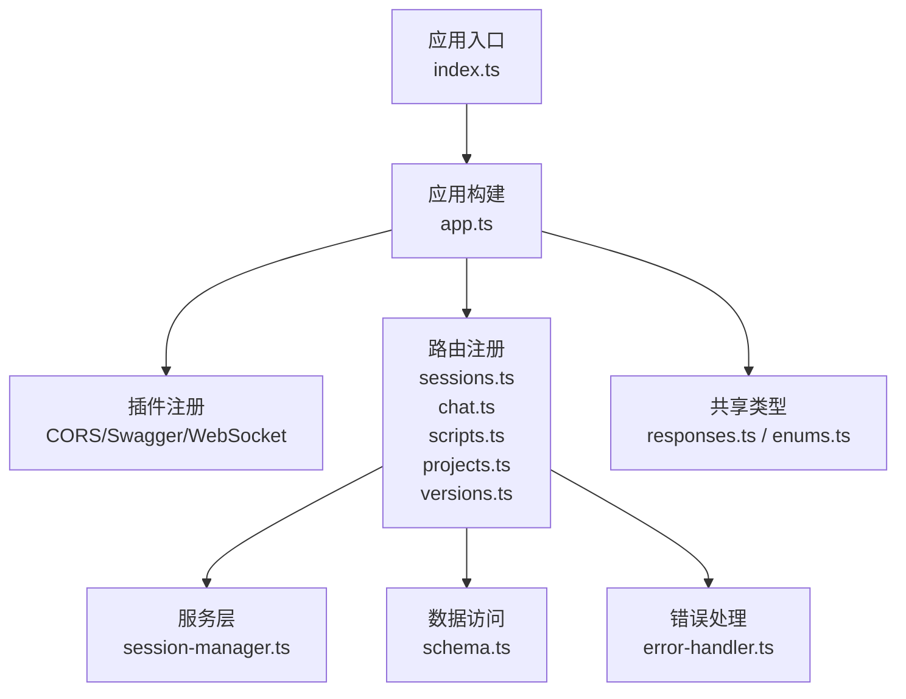
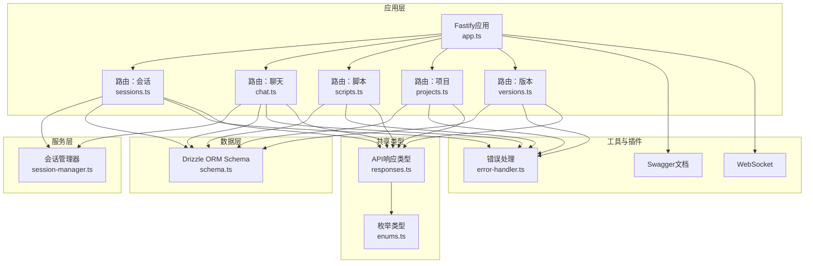
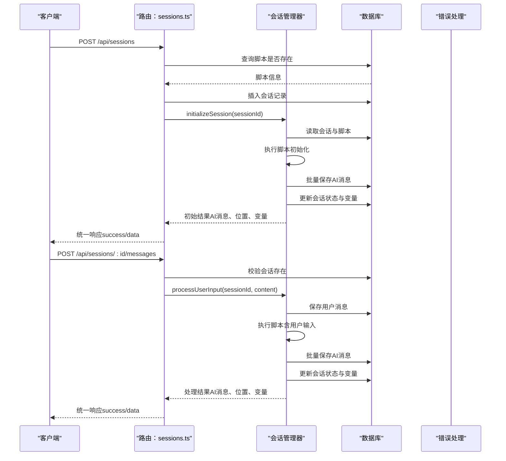
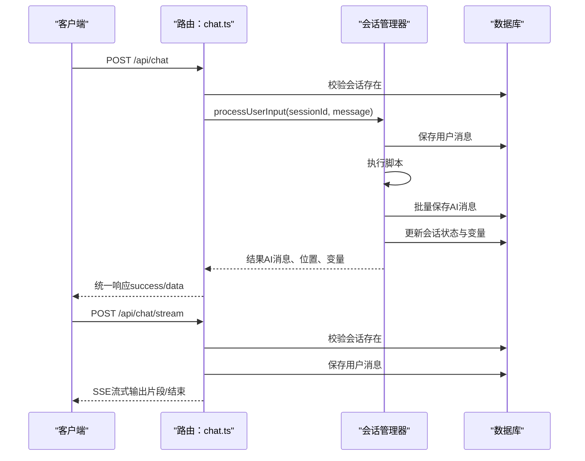
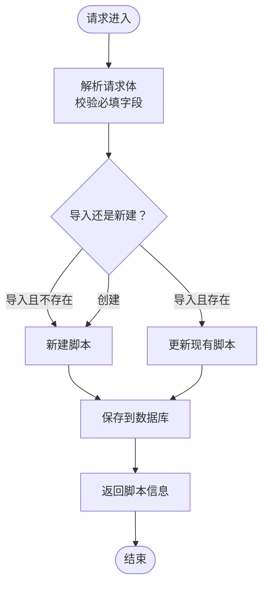
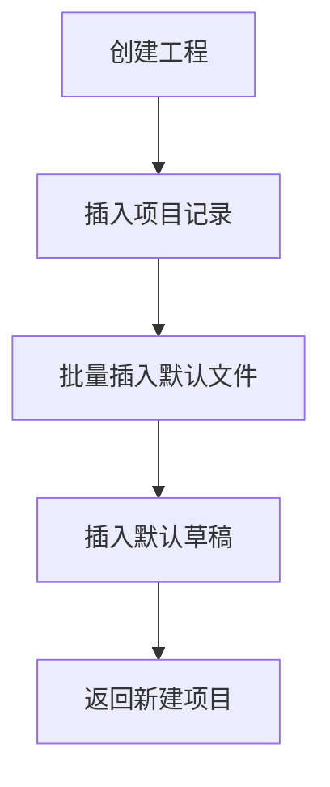
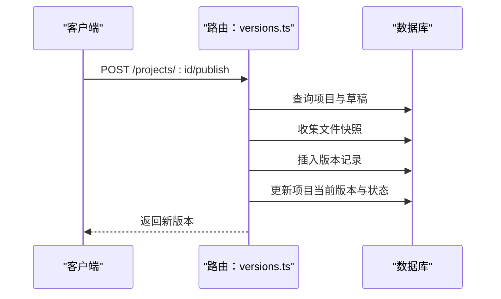
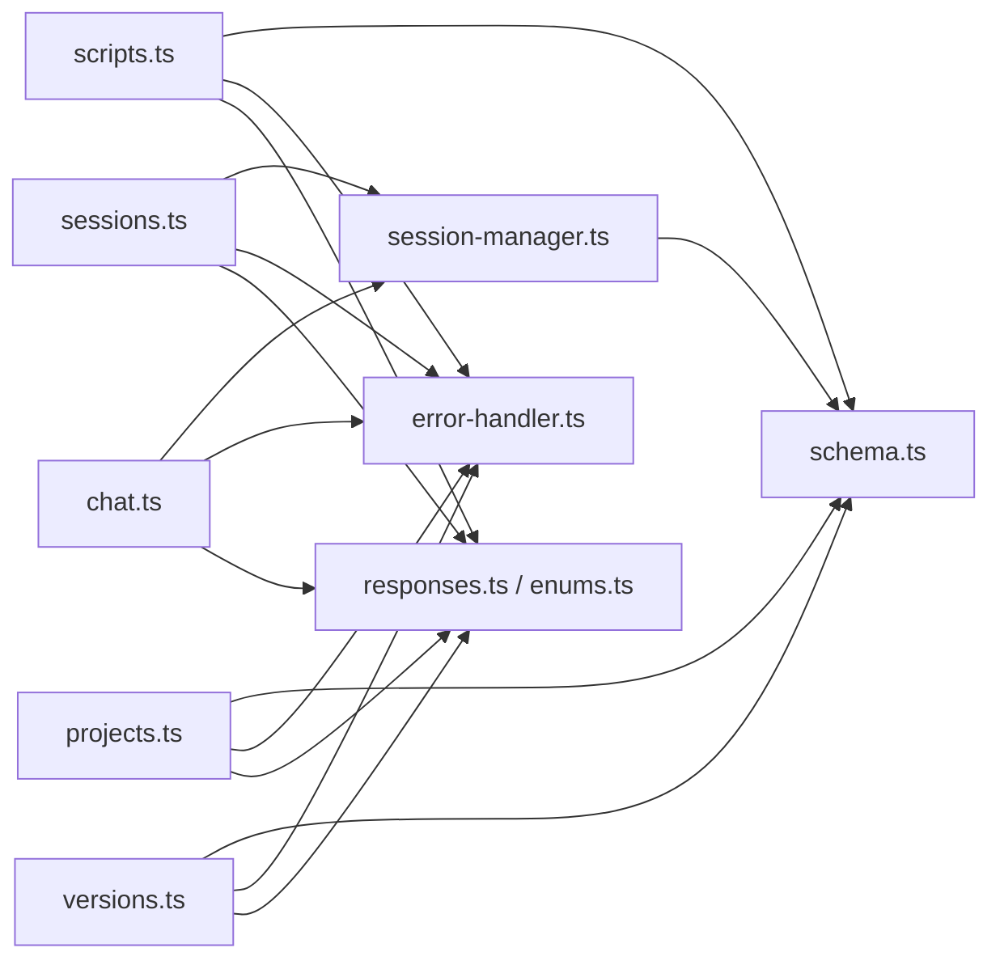

# RESTful API开发

<cite>
**本文引用的文件**
- [packages/api-server/src/app.ts](file://packages/api-server/src/app.ts)
- [packages/api-server/src/index.ts](file://packages/api-server/src/index.ts)
- [packages/api-server/src/routes/sessions.ts](file://packages/api-server/src/routes/sessions.ts)
- [packages/api-server/src/routes/chat.ts](file://packages/api-server/src/routes/chat.ts)
- [packages/api-server/src/routes/scripts.ts](file://packages/api-server/src/routes/scripts.ts)
- [packages/api-server/src/routes/projects.ts](file://packages/api-server/src/routes/projects.ts)
- [packages/api-server/src/routes/versions.ts](file://packages/api-server/src/routes/versions.ts)
- [packages/api-server/src/utils/error-handler.ts](file://packages/api-server/src/utils/error-handler.ts)
- [packages/api-server/src/services/session-manager.ts](file://packages/api-server/src/services/session-manager.ts)
- [packages/api-server/src/db/schema.ts](file://packages/api-server/src/db/schema.ts)
- [packages/shared-types/src/api/responses.ts](file://packages/shared-types/src/api/responses.ts)
- [packages/shared-types/src/enums.ts](file://packages/shared-types/src/enums.ts)
- [docs/DEVELOPMENT_GUIDE.md](file://docs/DEVELOPMENT_GUIDE.md)
</cite>

## 目录
1. [简介](#简介)
2. [项目结构](#项目结构)
3. [核心组件](#核心组件)
4. [架构总览](#架构总览)
5. [详细组件分析](#详细组件分析)
6. [依赖关系分析](#依赖关系分析)
7. [性能考量](#性能考量)
8. [故障排查指南](#故障排查指南)
9. [结论](#结论)
10. [附录](#附录)

## 简介
本指南面向HeartRule AI咨询引擎的RESTful API开发，聚焦于Fastify框架下的路由文件创建规范、请求处理函数实现模式、响应格式标准化、端点添加流程、REST设计原则、参数验证、错误处理策略、响应数据格式化与API版本控制最佳实践。文档以现有会话、聊天、脚本、项目与版本API端点为蓝本，提供可直接落地的开发与维护方法，并给出测试策略、性能优化与安全建议，确保新API满足生产环境需求。

## 项目结构
- 应用入口与启动：通过入口文件启动Fastify应用，注册插件与路由。
- 路由模块：按领域拆分，如会话、聊天、脚本、项目、版本等。
- 服务层：封装业务逻辑，如会话管理器。
- 数据访问：基于Drizzle ORM的PostgreSQL Schema定义。
- 共享类型：统一API响应、错误与枚举类型定义，保障前后端一致性。

图表来源
- [packages/api-server/src/index.ts](file://packages/api-server/src/index.ts#L1-L10)
- [packages/api-server/src/app.ts](file://packages/api-server/src/app.ts#L21-L105)
- [packages/api-server/src/routes/sessions.ts](file://packages/api-server/src/routes/sessions.ts#L13-L548)
- [packages/api-server/src/routes/chat.ts](file://packages/api-server/src/routes/chat.ts#L15-L152)
- [packages/api-server/src/routes/scripts.ts](file://packages/api-server/src/routes/scripts.ts#L12-L325)
- [packages/api-server/src/routes/projects.ts](file://packages/api-server/src/routes/projects.ts#L26-L500)
- [packages/api-server/src/routes/versions.ts](file://packages/api-server/src/routes/versions.ts#L20-L407)
- [packages/api-server/src/services/session-manager.ts](file://packages/api-server/src/services/session-manager.ts#L21-L466)
- [packages/api-server/src/db/schema.ts](file://packages/api-server/src/db/schema.ts#L1-L219)
- [packages/api-server/src/utils/error-handler.ts](file://packages/api-server/src/utils/error-handler.ts#L1-L233)
- [packages/shared-types/src/api/responses.ts](file://packages/shared-types/src/api/responses.ts#L1-L166)
- [packages/shared-types/src/enums.ts](file://packages/shared-types/src/enums.ts#L1-L118)

章节来源
- [packages/api-server/src/app.ts](file://packages/api-server/src/app.ts#L21-L105)
- [packages/api-server/src/index.ts](file://packages/api-server/src/index.ts#L1-L10)

## 核心组件
- 应用构建与启动：集中配置日志级别、CORS、Swagger、WebSocket，并注册各路由模块。
- 路由模块：每个领域一个文件，采用Fastify的路由注册模式，内置OpenAPI Schema校验与响应结构约束。
- 服务层：会话管理器负责脚本执行、消息持久化、变量快照与位置信息更新。
- 数据层：Drizzle ORM定义表结构、索引与枚举，保证数据一致性与查询效率。
- 错误处理：统一错误映射、错误上下文与恢复建议，标准化错误响应。
- 共享类型：统一API响应结构、错误结构与枚举，便于前后端契约一致。

章节来源
- [packages/api-server/src/app.ts](file://packages/api-server/src/app.ts#L21-L105)
- [packages/api-server/src/routes/sessions.ts](file://packages/api-server/src/routes/sessions.ts#L13-L548)
- [packages/api-server/src/routes/chat.ts](file://packages/api-server/src/routes/chat.ts#L15-L152)
- [packages/api-server/src/routes/scripts.ts](file://packages/api-server/src/routes/scripts.ts#L12-L325)
- [packages/api-server/src/routes/projects.ts](file://packages/api-server/src/routes/projects.ts#L26-L500)
- [packages/api-server/src/routes/versions.ts](file://packages/api-server/src/routes/versions.ts#L20-L407)
- [packages/api-server/src/services/session-manager.ts](file://packages/api-server/src/services/session-manager.ts#L21-L466)
- [packages/api-server/src/db/schema.ts](file://packages/api-server/src/db/schema.ts#L1-L219)
- [packages/api-server/src/utils/error-handler.ts](file://packages/api-server/src/utils/error-handler.ts#L1-L233)
- [packages/shared-types/src/api/responses.ts](file://packages/shared-types/src/api/responses.ts#L1-L166)
- [packages/shared-types/src/enums.ts](file://packages/shared-types/src/enums.ts#L1-L118)

## 架构总览
Fastify作为核心Web框架，结合Drizzle ORM与共享类型，形成“路由-服务-数据-类型”闭环。Swagger自动生成API文档，WebSocket支持实时通信；错误处理模块统一错误语义与恢复建议。

图表来源
- [packages/api-server/src/app.ts](file://packages/api-server/src/app.ts#L21-L105)
- [packages/api-server/src/routes/sessions.ts](file://packages/api-server/src/routes/sessions.ts#L13-L548)
- [packages/api-server/src/routes/chat.ts](file://packages/api-server/src/routes/chat.ts#L15-L152)
- [packages/api-server/src/routes/scripts.ts](file://packages/api-server/src/routes/scripts.ts#L12-L325)
- [packages/api-server/src/routes/projects.ts](file://packages/api-server/src/routes/projects.ts#L26-L500)
- [packages/api-server/src/routes/versions.ts](file://packages/api-server/src/routes/versions.ts#L20-L407)
- [packages/api-server/src/services/session-manager.ts](file://packages/api-server/src/services/session-manager.ts#L21-L466)
- [packages/api-server/src/db/schema.ts](file://packages/api-server/src/db/schema.ts#L1-L219)
- [packages/api-server/src/utils/error-handler.ts](file://packages/api-server/src/utils/error-handler.ts#L1-L233)
- [packages/shared-types/src/api/responses.ts](file://packages/shared-types/src/api/responses.ts#L1-L166)
- [packages/shared-types/src/enums.ts](file://packages/shared-types/src/enums.ts#L1-L118)

## 详细组件分析

### 会话API（sessions）
- 功能覆盖：创建会话、获取会话详情、获取消息历史、发送消息、获取变量、列出用户会话。
- 请求处理模式：参数校验（OpenAPI Schema）、业务逻辑调用（SessionManager）、数据库读写、错误处理与响应格式化。
- 响应格式：统一success字段，成功返回data，失败返回error对象（含错误码、类型、消息、上下文与恢复建议）。
- 关键流程：创建会话时先校验脚本存在性，再初始化会话并返回首条AI消息；发送消息时保存用户消息，执行脚本，批量保存AI消息，更新会话状态与变量快照。

图表来源
- [packages/api-server/src/routes/sessions.ts](file://packages/api-server/src/routes/sessions.ts#L13-L548)
- [packages/api-server/src/services/session-manager.ts](file://packages/api-server/src/services/session-manager.ts#L73-L255)
- [packages/api-server/src/utils/error-handler.ts](file://packages/api-server/src/utils/error-handler.ts#L186-L211)

章节来源
- [packages/api-server/src/routes/sessions.ts](file://packages/api-server/src/routes/sessions.ts#L13-L548)
- [packages/api-server/src/services/session-manager.ts](file://packages/api-server/src/services/session-manager.ts#L73-L255)
- [packages/api-server/src/utils/error-handler.ts](file://packages/api-server/src/utils/error-handler.ts#L186-L211)

### 聊天API（chat）
- 功能覆盖：非流式聊天与SSE流式聊天。
- 请求处理模式：参数校验（OpenAPI Schema）、会话存在性校验、调用SessionManager处理用户输入、非流式返回完整结果、SSE流式模拟输出。
- 响应格式：非流式遵循统一结构；SSE通过Server-Sent Events流式传输片段。

图表来源
- [packages/api-server/src/routes/chat.ts](file://packages/api-server/src/routes/chat.ts#L15-L152)
- [packages/api-server/src/services/session-manager.ts](file://packages/api-server/src/services/session-manager.ts#L257-L464)

章节来源
- [packages/api-server/src/routes/chat.ts](file://packages/api-server/src/routes/chat.ts#L15-L152)
- [packages/api-server/src/services/session-manager.ts](file://packages/api-server/src/services/session-manager.ts#L257-L464)

### 脚本API（scripts）
- 功能覆盖：创建脚本、获取脚本详情、列出脚本、导入脚本、验证脚本。
- 请求处理模式：参数校验（OpenAPI Schema）、YAML解析与校验、数据库读写、错误处理与响应格式化。
- 关键流程：创建脚本时解析YAML并保存解析结果；导入脚本支持更新已有记录或新建记录。

图表来源
- [packages/api-server/src/routes/scripts.ts](file://packages/api-server/src/routes/scripts.ts#L12-L325)

章节来源
- [packages/api-server/src/routes/scripts.ts](file://packages/api-server/src/routes/scripts.ts#L12-L325)

### 项目API（projects）
- 功能覆盖：工程列表、详情、创建、更新、归档、复制、文件管理、草稿与版本关联。
- 请求处理模式：Zod Schema参数校验、Drizzle ORM查询与更新、批量操作与事务性处理。
- 关键流程：创建工程时自动创建默认文件与草稿；复制工程时同步文件与草稿。

图表来源
- [packages/api-server/src/routes/projects.ts](file://packages/api-server/src/routes/projects.ts#L132-L193)

章节来源
- [packages/api-server/src/routes/projects.ts](file://packages/api-server/src/routes/projects.ts#L26-L500)

### 版本API（versions）
- 功能覆盖：获取草稿、保存草稿、发布版本、获取版本历史、获取单个版本、回滚到指定版本、版本对比。
- 请求处理模式：Zod Schema参数校验、Drizzle ORM查询与更新、版本号递增与回滚标记。
- 关键流程：发布版本时收集所有文件快照并写入版本表，同时更新项目当前版本与状态。

图表来源
- [packages/api-server/src/routes/versions.ts](file://packages/api-server/src/routes/versions.ts#L117-L199)

章节来源
- [packages/api-server/src/routes/versions.ts](file://packages/api-server/src/routes/versions.ts#L20-L407)

## 依赖关系分析
- 路由依赖：各路由模块依赖数据库Schema、服务层（会话管理器）、错误处理工具与共享类型。
- 服务依赖：会话管理器依赖Drizzle ORM、共享类型与错误处理工具。
- 数据依赖：Schema定义表结构、索引与枚举，支撑路由与服务的数据访问。
- 类型依赖：共享类型统一错误与响应结构，确保前后端契约一致。

图表来源
- [packages/api-server/src/routes/sessions.ts](file://packages/api-server/src/routes/sessions.ts#L1-L10)
- [packages/api-server/src/routes/chat.ts](file://packages/api-server/src/routes/chat.ts#L1-L10)
- [packages/api-server/src/routes/scripts.ts](file://packages/api-server/src/routes/scripts.ts#L1-L10)
- [packages/api-server/src/routes/projects.ts](file://packages/api-server/src/routes/projects.ts#L1-L6)
- [packages/api-server/src/routes/versions.ts](file://packages/api-server/src/routes/versions.ts#L1-L6)
- [packages/api-server/src/services/session-manager.ts](file://packages/api-server/src/services/session-manager.ts#L1-L16)
- [packages/api-server/src/db/schema.ts](file://packages/api-server/src/db/schema.ts#L1-L219)
- [packages/api-server/src/utils/error-handler.ts](file://packages/api-server/src/utils/error-handler.ts#L1-L233)
- [packages/shared-types/src/api/responses.ts](file://packages/shared-types/src/api/responses.ts#L1-L166)
- [packages/shared-types/src/enums.ts](file://packages/shared-types/src/enums.ts#L1-L118)

章节来源
- [packages/api-server/src/routes/sessions.ts](file://packages/api-server/src/routes/sessions.ts#L1-L10)
- [packages/api-server/src/routes/chat.ts](file://packages/api-server/src/routes/chat.ts#L1-L10)
- [packages/api-server/src/routes/scripts.ts](file://packages/api-server/src/routes/scripts.ts#L1-L10)
- [packages/api-server/src/routes/projects.ts](file://packages/api-server/src/routes/projects.ts#L1-L6)
- [packages/api-server/src/routes/versions.ts](file://packages/api-server/src/routes/versions.ts#L1-L6)
- [packages/api-server/src/services/session-manager.ts](file://packages/api-server/src/services/session-manager.ts#L1-L16)
- [packages/api-server/src/db/schema.ts](file://packages/api-server/src/db/schema.ts#L1-L219)
- [packages/api-server/src/utils/error-handler.ts](file://packages/api-server/src/utils/error-handler.ts#L1-L233)
- [packages/shared-types/src/api/responses.ts](file://packages/shared-types/src/api/responses.ts#L1-L166)
- [packages/shared-types/src/enums.ts](file://packages/shared-types/src/enums.ts#L1-L118)

## 性能考量
- 数据库索引：Schema中为常用查询字段建立索引（如会话用户ID、状态、创建时间；消息会话ID、时间戳；脚本类型与状态、名称；工程状态、作者、名称；版本项目ID、发布时间等），提升查询性能。
- 批量写入：会话初始化与用户输入处理中，批量保存AI消息，减少多次往返。
- 缓存与内存：会话状态与变量在内存中维护，避免频繁读取数据库；变量变更采用快照记录，降低全量写入成本。
- 日志与监控：统一日志级别与结构化日志，便于问题定位与性能分析。
- WebSocket：合理设置最大负载与连接保持策略，避免资源滥用。

章节来源
- [packages/api-server/src/db/schema.ts](file://packages/api-server/src/db/schema.ts#L34-L198)
- [packages/api-server/src/services/session-manager.ts](file://packages/api-server/src/services/session-manager.ts#L164-L200)
- [packages/api-server/src/app.ts](file://packages/api-server/src/app.ts#L65-L70)

## 故障排查指南
- 错误映射与恢复建议：根据错误消息匹配错误类型与状态码，自动填充恢复建议（重试、重试动作、建议），便于快速定位与修复。
- 上下文信息：错误响应包含脚本ID/名称、会话ID、执行位置（阶段/主题/动作索引与ID、动作类型）与时间戳，便于回溯。
- 统一错误响应：所有路由均返回统一结构（success、data、error），便于前端统一处理。
- 日志记录：错误发生时记录堆栈、上下文与请求信息，便于审计与问题追踪。

章节来源
- [packages/api-server/src/utils/error-handler.ts](file://packages/api-server/src/utils/error-handler.ts#L22-L90)
- [packages/api-server/src/utils/error-handler.ts](file://packages/api-server/src/utils/error-handler.ts#L95-L181)
- [packages/api-server/src/utils/error-handler.ts](file://packages/api-server/src/utils/error-handler.ts#L186-L233)

## 结论
HeartRule AI咨询引擎的RESTful API以Fastify为核心，结合Drizzle ORM与共享类型，实现了高内聚、低耦合的路由-服务-数据-类型体系。通过OpenAPI Schema与Zod Schema实现参数与响应的强约束，配合统一错误处理与恢复建议，确保了API的一致性与可维护性。遵循本文的开发规范与最佳实践，可高效地扩展新的API端点并满足生产环境的质量要求。

## 附录

### RESTful API设计原则与最佳实践
- HTTP方法选择
  - GET：获取资源列表或详情（如获取会话详情、消息历史、脚本列表、版本历史）。
  - POST：创建资源或触发动作（如创建会话、创建脚本、导入脚本、发布版本、复制工程）。
  - PUT：更新资源（如更新工程信息、保存草稿）。
  - DELETE：删除资源（如归档工程）。
- URL命名规范
  - 使用名词复数形式表示集合（如“/api/scripts”、“/api/sessions”）。
  - 使用层级表达资源关系（如“/api/projects/:id/files”）。
  - 使用子资源表达嵌套关系（如“/api/sessions/:id/messages”）。
- 状态码使用
  - 200：成功返回数据。
  - 201：创建成功（如创建工程、创建文件、发布版本）。
  - 400：参数校验失败或请求体不合法。
  - 404：资源不存在（如会话未找到、脚本未找到）。
  - 500：服务器内部错误。
  - 503：服务不可用（如LLM服务暂时不可用）。
- 参数验证
  - OpenAPI Schema：用于路由参数、请求体与响应结构的静态校验。
  - Zod Schema：用于复杂业务参数的运行时校验与转换。
- 响应格式标准化
  - 成功：统一返回“success: true, data: ...”。
  - 失败：统一返回“success: false, error: { code, type, message, details, context, recovery }”。
- API版本控制
  - 采用路径前缀版本化（如“/api/v1/...”），或通过Accept头部版本协商；当前项目采用路径前缀“/api”。

章节来源
- [packages/api-server/src/routes/sessions.ts](file://packages/api-server/src/routes/sessions.ts#L13-L548)
- [packages/api-server/src/routes/chat.ts](file://packages/api-server/src/routes/chat.ts#L15-L152)
- [packages/api-server/src/routes/scripts.ts](file://packages/api-server/src/routes/scripts.ts#L12-L325)
- [packages/api-server/src/routes/projects.ts](file://packages/api-server/src/routes/projects.ts#L26-L500)
- [packages/api-server/src/routes/versions.ts](file://packages/api-server/src/routes/versions.ts#L20-L407)
- [packages/shared-types/src/api/responses.ts](file://packages/shared-types/src/api/responses.ts#L89-L166)
- [packages/shared-types/src/enums.ts](file://packages/shared-types/src/enums.ts#L83-L118)

### 新API端点添加流程（从创建到注册）
- 创建路由文件：在“packages/api-server/src/routes/”下创建新文件，定义Fastify路由与OpenAPI Schema。
- 实现业务逻辑：在服务层或直接在路由中实现业务逻辑，必要时调用会话管理器。
- 参数验证：使用OpenAPI Schema与Zod Schema进行参数与响应结构校验。
- 注册到主应用：在“packages/api-server/src/app.ts”中引入并注册路由（或使用插件异步加载）。
- 文档与测试：Swagger自动生成文档；编写单元与集成测试，确保端点可用。

章节来源
- [docs/DEVELOPMENT_GUIDE.md](file://docs/DEVELOPMENT_GUIDE.md#L151-L245)
- [packages/api-server/src/app.ts](file://packages/api-server/src/app.ts#L91-L102)

### API测试策略
- 单元测试：针对路由与服务的边界场景进行测试。
- 集成测试：通过脚本导入与会话流程进行端到端测试。
- 手动测试：使用Web界面或PowerShell脚本进行交互测试。
- 健康检查：访问“/health”确认服务可用。

章节来源
- [docs/DEVELOPMENT_GUIDE.md](file://docs/DEVELOPMENT_GUIDE.md#L194-L245)
- [packages/api-server/test-api.ps1](file://packages/api-server/test-api.ps1#L82-L98)
- [packages/api-server/src/app.ts](file://packages/api-server/src/app.ts#L82-L89)

### 安全考虑
- CORS：开发环境允许所有来源，生产环境需配置白名单。
- 认证与授权：当前路由未强制认证，建议在路由中间件中加入鉴权逻辑。
- 输入校验：严格使用OpenAPI Schema与Zod Schema，防止SQL注入与YAML解析异常。
- 错误信息：避免泄露敏感信息，统一使用标准化错误响应。

章节来源
- [packages/api-server/src/app.ts](file://packages/api-server/src/app.ts#L28-L32)
- [packages/api-server/src/utils/error-handler.ts](file://packages/api-server/src/utils/error-handler.ts#L186-L211)