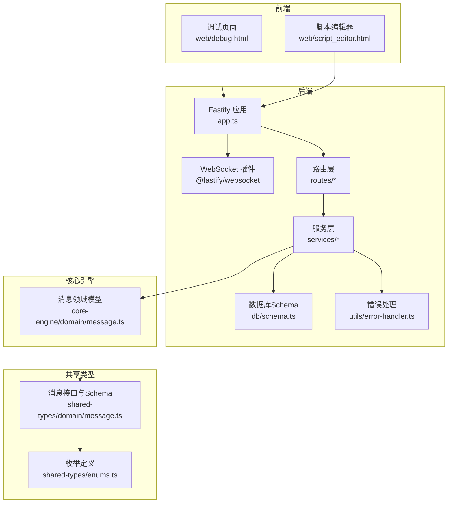
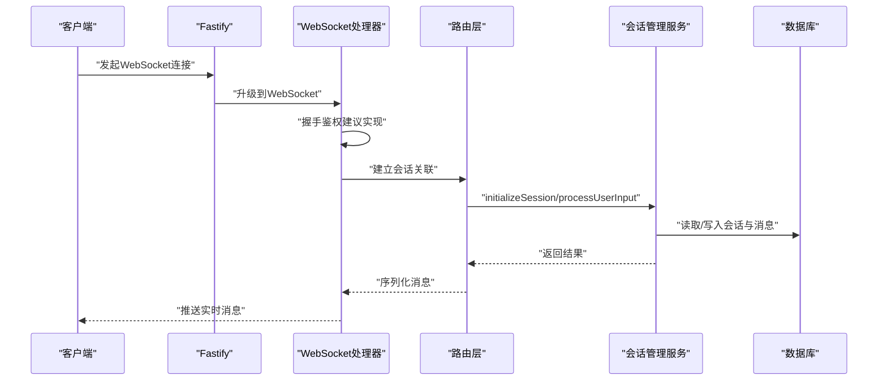
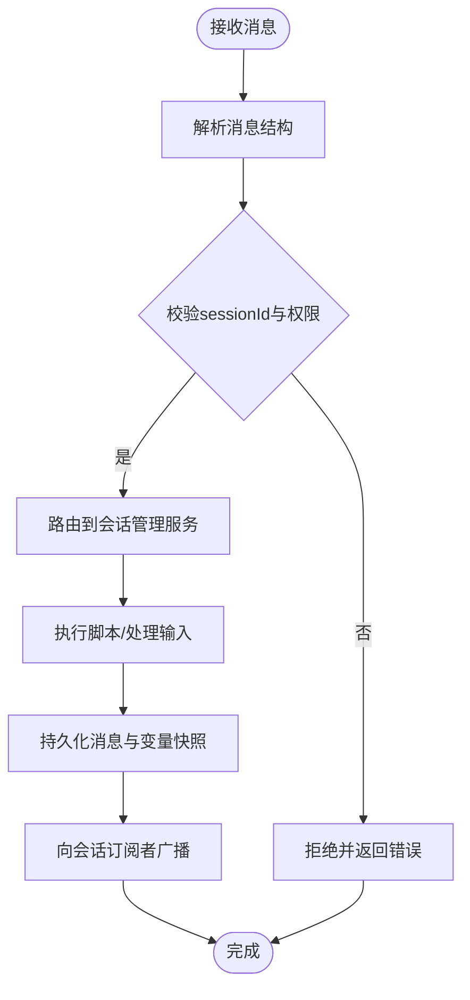
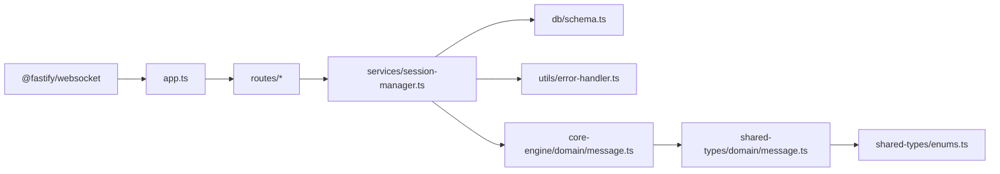

# WebSocket开发

<cite>
**本文引用的文件**
- [packages/api-server/src/app.ts](file://packages/api-server/src/app.ts)
- [packages/api-server/src/routes/chat.ts](file://packages/api-server/src/routes/chat.ts)
- [packages/api-server/src/routes/sessions.ts](file://packages/api-server/src/routes/sessions.ts)
- [packages/api-server/src/services/session-manager.ts](file://packages/api-server/src/services/session-manager.ts)
- [packages/api-server/src/db/schema.ts](file://packages/api-server/src/db/schema.ts)
- [packages/api-server/src/utils/error-handler.ts](file://packages/api-server/src/utils/error-handler.ts)
- [packages/core-engine/src/domain/message.ts](file://packages/core-engine/src/domain/message.ts)
- [packages/shared-types/src/domain/message.ts](file://packages/shared-types/src/domain/message.ts)
- [packages/shared-types/src/enums.ts](file://packages/shared-types/src/enums.ts)
- [web/debug.html](file://web/debug.html)
- [web/script_editor.html](file://web/script_editor.html)
</cite>

## 目录
1. [简介](#简介)
2. [项目结构](#项目结构)
3. [核心组件](#核心组件)
4. [架构总览](#架构总览)
5. [详细组件分析](#详细组件分析)
6. [依赖关系分析](#依赖关系分析)
7. [性能考虑](#性能考虑)
8. [故障排查指南](#故障排查指南)
9. [结论](#结论)
10. [附录](#附录)

## 简介
本指南面向HeartRule AI咨询引擎的WebSocket开发，目标是帮助开发者在现有Fastify架构上集成WebSocket能力，实现稳定的实时消息传输与调试信息推送。当前仓库中已内置Fastify WebSocket插件的注册与配置，并提供了会话管理、消息持久化与错误处理等基础设施。本文将围绕以下主题展开：
- Fastify WebSocket插件的注册与配置（连接选项、最大负载限制、安全配置）
- WebSocket连接建立流程（握手、认证、会话管理）
- 实时消息处理模式（消息格式、事件类型、路由机制）
- 会话管理在WebSocket中的应用（状态跟踪、身份验证、连接池）
- 生命周期管理、错误处理与性能优化建议
- 结合现有代码示例，给出可落地的实现路径

## 项目结构
HeartRule采用多包工作区结构，WebSocket相关能力主要位于api-server包内，核心业务逻辑由core-engine提供，共享类型定义位于shared-types。前端调试页面位于web目录。



图表来源
- [packages/api-server/src/app.ts](file://packages/api-server/src/app.ts#L65-L70)
- [packages/api-server/src/routes/chat.ts](file://packages/api-server/src/routes/chat.ts#L1-L152)
- [packages/api-server/src/routes/sessions.ts](file://packages/api-server/src/routes/sessions.ts#L1-L548)
- [packages/api-server/src/services/session-manager.ts](file://packages/api-server/src/services/session-manager.ts#L1-L466)
- [packages/api-server/src/db/schema.ts](file://packages/api-server/src/db/schema.ts#L1-L219)
- [packages/api-server/src/utils/error-handler.ts](file://packages/api-server/src/utils/error-handler.ts#L1-L233)
- [packages/core-engine/src/domain/message.ts](file://packages/core-engine/src/domain/message.ts#L1-L49)
- [packages/shared-types/src/domain/message.ts](file://packages/shared-types/src/domain/message.ts#L1-L52)
- [packages/shared-types/src/enums.ts](file://packages/shared-types/src/enums.ts#L1-L118)
- [web/debug.html](file://web/debug.html#L1-L661)
- [web/script_editor.html](file://web/script_editor.html#L1-L606)

章节来源
- [packages/api-server/src/app.ts](file://packages/api-server/src/app.ts#L1-L135)
- [packages/api-server/src/db/schema.ts](file://packages/api-server/src/db/schema.ts#L1-L219)

## 核心组件
- Fastify应用与WebSocket插件
  - 在应用启动时注册CORS、Swagger、WebSocket插件，并设置日志级别与健康检查端点。
  - WebSocket插件通过options配置maxPayload为1MB，满足一般实时消息传输需求。
- 会话管理服务
  - 负责会话初始化、用户输入处理、脚本执行、消息持久化与变量快照记录。
  - 提供initializeSession与processUserInput两大核心方法，支撑实时对话与调试。
- 数据库Schema
  - 定义sessions、messages、scripts、variables等表，支持会话状态、消息历史与变量快照的持久化。
- 错误处理工具
  - 统一错误映射、构建详细错误响应与日志记录，便于在WebSocket场景下传递错误上下文。
- 消息领域模型与共享类型
  - 定义消息结构、角色枚举与Schema，保证前后端一致的消息契约。

章节来源
- [packages/api-server/src/app.ts](file://packages/api-server/src/app.ts#L65-L70)
- [packages/api-server/src/services/session-manager.ts](file://packages/api-server/src/services/session-manager.ts#L73-L255)
- [packages/api-server/src/db/schema.ts](file://packages/api-server/src/db/schema.ts#L22-L58)
- [packages/api-server/src/utils/error-handler.ts](file://packages/api-server/src/utils/error-handler.ts#L22-L90)
- [packages/core-engine/src/domain/message.ts](file://packages/core-engine/src/domain/message.ts#L7-L32)
- [packages/shared-types/src/domain/message.ts](file://packages/shared-types/src/domain/message.ts#L8-L16)
- [packages/shared-types/src/enums.ts](file://packages/shared-types/src/enums.ts#L27-L31)

## 架构总览
WebSocket在HeartRule中的定位是：作为实时通信通道，承载聊天消息的即时传输与调试信息的推送。整体架构如下：

```mermaid
graph TB
Client["客户端<br/>web/debug.html / web/script_editor.html"]
WS["Fastify WebSocket 插件<br/>app.ts"]
Routes["路由层<br/>routes/chat.ts / routes/sessions.ts"]
SM["会话管理服务<br/>services/session-manager.ts"]
DB["数据库<br/>db/schema.ts"]
Err["错误处理<br/>utils/error-handler.ts"]
Client <- --> WS
WS --> Routes
Routes --> SM
SM --> DB
SM --> Err
```

图表来源
- [packages/api-server/src/app.ts](file://packages/api-server/src/app.ts#L65-L70)
- [packages/api-server/src/routes/chat.ts](file://packages/api-server/src/routes/chat.ts#L15-L152)
- [packages/api-server/src/routes/sessions.ts](file://packages/api-server/src/routes/sessions.ts#L13-L548)
- [packages/api-server/src/services/session-manager.ts](file://packages/api-server/src/services/session-manager.ts#L21-L466)
- [packages/api-server/src/db/schema.ts](file://packages/api-server/src/db/schema.ts#L22-L58)
- [packages/api-server/src/utils/error-handler.ts](file://packages/api-server/src/utils/error-handler.ts#L95-L211)

## 详细组件分析

### Fastify WebSocket插件注册与配置
- 插件注册位置：在应用构建函数中调用app.register(websocket, { options })。
- 连接选项：
  - maxPayload：限制单帧消息大小为1MB，避免内存膨胀与DDoS风险。
- 安全配置：
  - CORS已在app.register(cors, {...})中启用，生产环境建议收紧origin白名单。
  - 当前未见专用的WebSocket鉴权中间件，建议在握手阶段进行身份校验（见“会话管理”与“错误处理”章节）。

章节来源
- [packages/api-server/src/app.ts](file://packages/api-server/src/app.ts#L65-L70)
- [packages/api-server/src/app.ts](file://packages/api-server/src/app.ts#L29-L32)

### WebSocket连接建立流程
- 客户端连接
  - 前端页面通过原生WebSocket API发起连接请求。
- 握手验证
  - 建议在WebSocket升级阶段进行鉴权（如校验Authorization头或Cookie），并绑定用户身份到socket实例。
- 会话管理
  - 建立连接后，根据会话ID加载或创建会话状态，初始化消息历史与变量快照。
  - 将socket实例与会话ID关联，实现一对一或一对多的推送机制。



图表来源
- [packages/api-server/src/app.ts](file://packages/api-server/src/app.ts#L65-L70)
- [packages/api-server/src/routes/sessions.ts](file://packages/api-server/src/routes/sessions.ts#L13-L133)
- [packages/api-server/src/services/session-manager.ts](file://packages/api-server/src/services/session-manager.ts#L73-L255)
- [packages/api-server/src/db/schema.ts](file://packages/api-server/src/db/schema.ts#L22-L58)

### 实时消息处理模式
- 消息格式定义
  - 使用Message领域模型与共享类型，确保消息包含messageId、sessionId、role、content、actionId、metadata、timestamp等字段。
- 事件类型分类
  - 聊天消息：用户消息与AI消息，分别对应user与assistant角色。
  - 调试信息：包含LLM调试信息、变量快照、执行状态等。
- 消息路由机制
  - 基于sessionId路由到对应会话，结合Action上下文决定消息类型与后续动作。
  - 建议在WebSocket层维护“订阅-广播”机制：每个会话的参与者订阅该会话频道，服务端向频道推送消息。



图表来源
- [packages/core-engine/src/domain/message.ts](file://packages/core-engine/src/domain/message.ts#L7-L32)
- [packages/shared-types/src/domain/message.ts](file://packages/shared-types/src/domain/message.ts#L8-L16)
- [packages/api-server/src/services/session-manager.ts](file://packages/api-server/src/services/session-manager.ts#L257-L464)
- [packages/api-server/src/db/schema.ts](file://packages/api-server/src/db/schema.ts#L45-L58)

### 会话管理在WebSocket中的应用
- 会话状态跟踪
  - 通过sessions表记录会话状态、执行状态、当前位置与变量快照，WebSocket场景下可将其作为广播源。
- 用户身份验证
  - 建议在握手阶段校验用户身份，将userId绑定到socket实例，仅允许其访问自身会话。
- 连接池管理
  - 建议使用Map或Redis键空间维护“用户ID -> socket集合”的映射，实现精准推送与资源回收。

章节来源
- [packages/api-server/src/routes/sessions.ts](file://packages/api-server/src/routes/sessions.ts#L13-L133)
- [packages/api-server/src/services/session-manager.ts](file://packages/api-server/src/services/session-manager.ts#L73-L255)
- [packages/api-server/src/db/schema.ts](file://packages/api-server/src/db/schema.ts#L22-L40)

### 代码示例路径（不直接展示代码）
- WebSocket插件注册与配置
  - [packages/api-server/src/app.ts](file://packages/api-server/src/app.ts#L65-L70)
- 会话初始化与消息处理
  - [packages/api-server/src/services/session-manager.ts](file://packages/api-server/src/services/session-manager.ts#L73-L255)
  - [packages/api-server/src/services/session-manager.ts](file://packages/api-server/src/services/session-manager.ts#L257-L464)
- 消息持久化与变量快照
  - [packages/api-server/src/db/schema.ts](file://packages/api-server/src/db/schema.ts#L45-L58)
  - [packages/api-server/src/db/schema.ts](file://packages/api-server/src/db/schema.ts#L161-L176)
- 错误处理与响应
  - [packages/api-server/src/utils/error-handler.ts](file://packages/api-server/src/utils/error-handler.ts#L95-L211)
- 前端调试页面（演示HTTP API，可迁移至WebSocket）
  - [web/debug.html](file://web/debug.html#L406-L532)
  - [web/script_editor.html](file://web/script_editor.html#L346-L515)

## 依赖关系分析
- 组件耦合
  - WebSocket层依赖路由层；路由层依赖会话管理服务；会话管理服务依赖数据库Schema与错误处理工具。
- 外部依赖
  - @fastify/websocket用于WebSocket支持；@fastify/cors与Swagger用于跨域与文档；drizzle-orm与postgres-js用于数据库访问。
- 循环依赖
  - 当前结构清晰，未发现循环依赖迹象。



图表来源
- [packages/api-server/src/app.ts](file://packages/api-server/src/app.ts#L6-L10)
- [packages/api-server/src/routes/chat.ts](file://packages/api-server/src/routes/chat.ts#L1-L152)
- [packages/api-server/src/routes/sessions.ts](file://packages/api-server/src/routes/sessions.ts#L1-L548)
- [packages/api-server/src/services/session-manager.ts](file://packages/api-server/src/services/session-manager.ts#L1-L466)
- [packages/api-server/src/db/schema.ts](file://packages/api-server/src/db/schema.ts#L1-L219)
- [packages/api-server/src/utils/error-handler.ts](file://packages/api-server/src/utils/error-handler.ts#L1-L233)
- [packages/core-engine/src/domain/message.ts](file://packages/core-engine/src/domain/message.ts#L1-L49)
- [packages/shared-types/src/domain/message.ts](file://packages/shared-types/src/domain/message.ts#L1-L52)
- [packages/shared-types/src/enums.ts](file://packages/shared-types/src/enums.ts#L1-L118)

## 性能考虑
- 连接与消息大小
  - maxPayload设置为1MB，适合文本消息；若需传输大附件，建议拆分为多帧或采用独立上传通道。
- 并发与背压
  - 对高并发场景，建议引入队列与限流策略，避免瞬时洪峰导致内存压力。
- 数据库写入
  - 批量插入与事务合并可降低写入开销；对高频消息可考虑异步落库或缓冲刷盘。
- 前端渲染
  - 前端调试页面展示了大量消息的渲染，建议在WebSocket层做节流与分页，避免UI阻塞。

[本节为通用指导，无需列出章节来源]

## 故障排查指南
- 常见错误与定位
  - 会话不存在：检查sessionId合法性与会话状态，必要时重新创建会话。
  - 脚本解析/校验失败：查看错误映射与恢复建议，修正脚本内容后重试。
  - LLM服务不可用：检查网络连通性与服务可用性，适当重试。
- 日志与追踪
  - 使用统一错误处理工具记录错误上下文，包含脚本ID、会话ID、位置信息与时间戳。
- 建议的排查步骤
  - 确认WebSocket握手成功且鉴权通过；
  - 校验sessionId与用户权限；
  - 查看会话管理服务的日志与数据库写入情况；
  - 检查前端是否正确接收与渲染消息。

章节来源
- [packages/api-server/src/utils/error-handler.ts](file://packages/api-server/src/utils/error-handler.ts#L22-L90)
- [packages/api-server/src/utils/error-handler.ts](file://packages/api-server/src/utils/error-handler.ts#L95-L211)
- [packages/api-server/src/services/session-manager.ts](file://packages/api-server/src/services/session-manager.ts#L237-L254)

## 结论
HeartRule已具备完善的WebSocket基础设施：Fastify插件、会话管理、消息持久化与错误处理。基于这些能力，可在保持现有架构稳定性的前提下，快速实现可靠的实时通信。建议优先完成握手鉴权、订阅广播机制与连接池管理，再逐步完善调试信息推送与状态同步，最终形成可扩展、可观测、可维护的WebSocket体系。

[本节为总结性内容，无需列出章节来源]

## 附录
- 关键实现路径参考
  - WebSocket插件注册与配置：[packages/api-server/src/app.ts](file://packages/api-server/src/app.ts#L65-L70)
  - 会话初始化与消息处理：[packages/api-server/src/services/session-manager.ts](file://packages/api-server/src/services/session-manager.ts#L73-L255)、[packages/api-server/src/services/session-manager.ts](file://packages/api-server/src/services/session-manager.ts#L257-L464)
  - 消息与变量持久化：[packages/api-server/src/db/schema.ts](file://packages/api-server/src/db/schema.ts#L45-L58)、[packages/api-server/src/db/schema.ts](file://packages/api-server/src/db/schema.ts#L161-L176)
  - 错误处理与响应：[packages/api-server/src/utils/error-handler.ts](file://packages/api-server/src/utils/error-handler.ts#L95-L211)
  - 前端调试页面（HTTP API示例）：[web/debug.html](file://web/debug.html#L406-L532)、[web/script_editor.html](file://web/script_editor.html#L346-L515)

[本节为补充说明，无需列出章节来源]