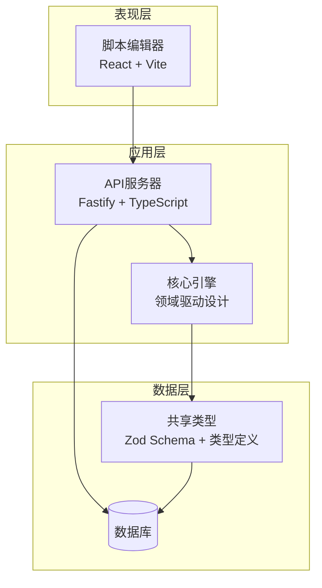
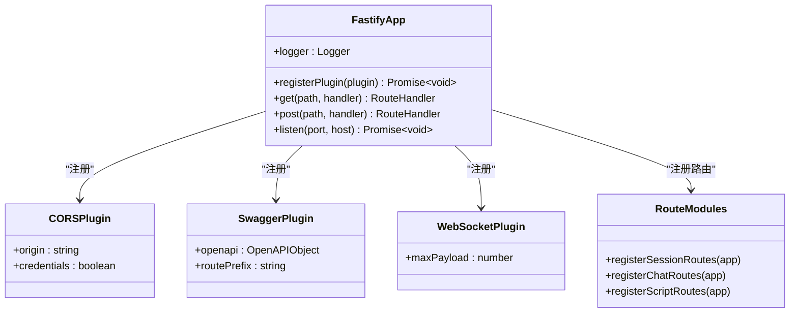
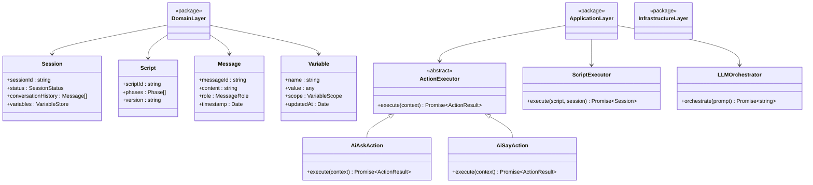
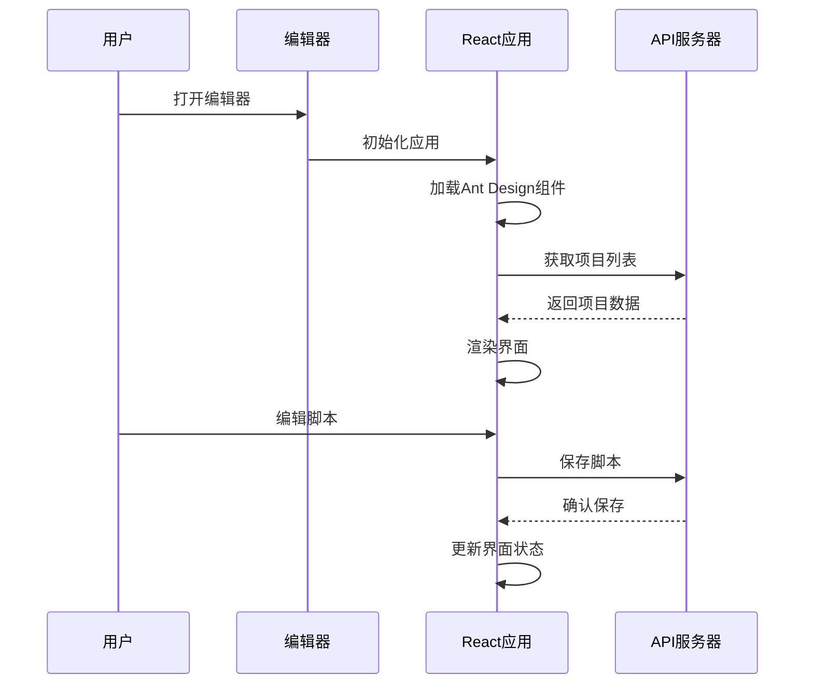
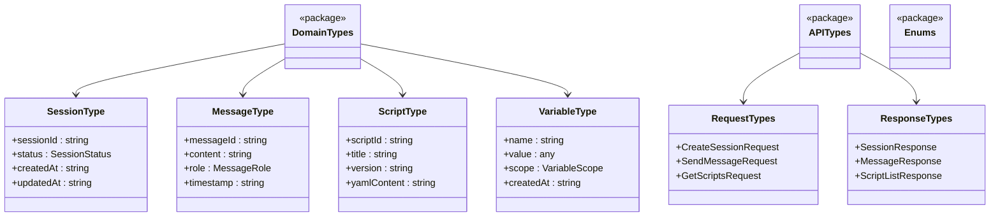

# TypeScript编译修复

<cite>
**本文档引用的文件**
- [tsconfig.json](file://tsconfig.json)
- [packages/api-server/tsconfig.json](file://packages/api-server/tsconfig.json)
- [packages/core-engine/tsconfig.json](file://packages/core-engine/tsconfig.json)
- [packages/script-editor/tsconfig.json](file://packages/script-editor/tsconfig.json)
- [packages/shared-types/tsconfig.json](file://packages/shared-types/tsconfig.json)
- [packages/script-editor/tsconfig.node.json](file://packages/script-editor/tsconfig.node.json)
- [package.json](file://package.json)
- [packages/api-server/package.json](file://packages/api-server/package.json)
- [packages/core-engine/package.json](file://packages/core-engine/package.json)
- [packages/script-editor/package.json](file://packages/script-editor/package.json)
- [packages/shared-types/package.json](file://packages/shared-types/package.json)
- [packages/api-server/src/app.ts](file://packages/api-server/src/app.ts)
- [packages/core-engine/src/index.ts](file://packages/core-engine/src/index.ts)
- [packages/shared-types/src/index.ts](file://packages/shared-types/src/index.ts)
- [packages/script-editor/src/main.tsx](file://packages/script-editor/src/main.tsx)
</cite>

## 目录
1. [项目概述](#项目概述)
2. [项目结构分析](#项目结构分析)
3. [核心组件分析](#核心组件分析)
4. [架构概览](#架构概览)
5. [详细组件分析](#详细组件分析)
6. [依赖关系分析](#依赖关系分析)
7. [性能考虑](#性能考虑)
8. [故障排除指南](#故障排除指南)
9. [结论](#结论)

## 项目概述

这是一个基于TypeScript的Monorepo项目，名为"HeartRule AI咨询引擎"，采用pnpm工作区管理多个包。项目包含API服务器、核心引擎、脚本编辑器和共享类型四个主要模块。该项目使用现代TypeScript配置和严格的编译选项来确保代码质量和类型安全。

## 项目结构分析

项目采用标准的Monorepo结构，每个包都有独立的配置文件和构建脚本：

```mermaid
graph TB
subgraph "根目录"
RootPkg[根package.json]
RootTS[根tsconfig.json]
end
subgraph "API服务器包"
APIServer[packages/api-server]
APIPkg[package.json]
APITSC[tsconfig.json]
APIApp[src/app.ts]
end
subgraph "核心引擎包"
CoreEngine[packages/core-engine]
CorePkg[package.json]
CoreTSC[tsconfig.json]
CoreIndex[src/index.ts]
end
subgraph "脚本编辑器包"
ScriptEditor[packages/script-editor]
EditorPkg[package.json]
EditorTSC[tsconfig.json]
EditorNode[tsconfig.node.json]
EditorMain[src/main.tsx]
end
subgraph "共享类型包"
SharedTypes[packages/shared-types]
SharedPkg[package.json]
SharedTSC[tsconfig.json]
SharedIndex[src/index.ts]
end
RootPkg --> APIServer
RootPkg --> CoreEngine
RootPkg --> ScriptEditor
RootPkg --> SharedTypes
RootTS --> APITSC
RootTS --> CoreTSC
RootTS --> EditorTSC
RootTS --> SharedTSC
```



**图表来源**
- [tsconfig.json](file://tsconfig.json#L1-L30)
- [packages/api-server/tsconfig.json](file://packages/api-server/tsconfig.json#L1-L10)
- [packages/core-engine/tsconfig.json](file://packages/core-engine/tsconfig.json#L1-L11)
- [packages/script-editor/tsconfig.json](file://packages/script-editor/tsconfig.json#L1-L34)
- [packages/shared-types/tsconfig.json](file://packages/shared-types/tsconfig.json#L1-L10)

**章节来源**
- [tsconfig.json](file://tsconfig.json#L1-L30)
- [package.json](file://package.json#L1-L67)

## 核心组件分析

### 根级TypeScript配置

根级tsconfig.json提供了统一的编译配置，确保所有包的一致性：

- **目标环境**: ES2022，支持最新的JavaScript特性
- **模块系统**: ESNext，配合bundler使用
- **严格模式**: 完全启用，包括noUnusedLocals、noUnusedParameters等
- **装饰器支持**: 启用实验性装饰器和元数据发射
- **模块解析**: 使用bundler模式，优化打包性能

### 包级配置差异

各包根据其特定需求调整了编译选项：

**API服务器** (`packages/api-server/tsconfig.json`)
- 继承根配置，设置rootDir和outDir
- 保持严格模式，确保服务器端代码质量

**核心引擎** (`packages/core-engine/tsconfig.json`)
- 继承根配置，但禁用noUnusedLocals
- 适用于库包，避免对使用者产生不必要的编译警告

**脚本编辑器** (`packages/script-editor/tsconfig.json`)
- 独立配置，target设为ES2020
- 启用isolatedModules和noEmit，专为Vite开发环境设计
- 配置了React JSX支持和路径映射

**共享类型** (`packages/shared-types/tsconfig.json`)
- 继承根配置，专注于类型定义
- 生成声明文件用于库发布

**章节来源**
- [tsconfig.json](file://tsconfig.json#L1-L30)
- [packages/api-server/tsconfig.json](file://packages/api-server/tsconfig.json#L1-L10)
- [packages/core-engine/tsconfig.json](file://packages/core-engine/tsconfig.json#L1-L11)
- [packages/script-editor/tsconfig.json](file://packages/script-editor/tsconfig.json#L1-L34)
- [packages/shared-types/tsconfig.json](file://packages/shared-types/tsconfig.json#L1-L10)

## 架构概览

项目采用分层架构设计，每个包都有明确的职责分工：



**图表来源**
- [packages/api-server/src/app.ts](file://packages/api-server/src/app.ts#L1-L135)
- [packages/core-engine/src/index.ts](file://packages/core-engine/src/index.ts#L1-L160)
- [packages/shared-types/src/index.ts](file://packages/shared-types/src/index.ts#L1-L19)

## 详细组件分析

### API服务器组件分析

API服务器是整个系统的核心入口点，负责HTTP请求处理和业务逻辑协调：



**图表来源**
- [packages/api-server/src/app.ts](file://packages/api-server/src/app.ts#L21-L105)

API服务器的主要特点：
- 使用Fastify框架，提供高性能HTTP服务
- 集成CORS、Swagger和WebSocket插件
- 动态导入路由模块，支持模块化组织
- 支持优雅关闭和信号处理

**章节来源**
- [packages/api-server/src/app.ts](file://packages/api-server/src/app.ts#L1-L135)

### 核心引擎组件分析

核心引擎采用领域驱动设计(Domain-Driven Design)，实现了复杂的业务逻辑：



**图表来源**
- [packages/core-engine/src/index.ts](file://packages/core-engine/src/index.ts#L1-L160)

核心引擎的关键特性：
- 版本兼容性检查机制
- 分层架构设计，清晰分离关注点
- 支持多种动作执行器(AI Ask/Say)
- 模块化的脚本执行引擎

**章节来源**
- [packages/core-engine/src/index.ts](file://packages/core-engine/src/index.ts#L1-L160)

### 脚本编辑器组件分析

脚本编辑器采用现代化的前端技术栈，提供可视化脚本编辑体验：



**图表来源**
- [packages/script-editor/src/main.tsx](file://packages/script-editor/src/main.tsx#L1-L16)

编辑器的技术特点：
- 基于React 18和TypeScript
- 使用Ant Design UI组件库
- 支持中文本地化
- 集成React Router进行页面导航

**章节来源**
- [packages/script-editor/src/main.tsx](file://packages/script-editor/src/main.tsx#L1-L16)

### 共享类型组件分析

共享类型包提供跨包使用的类型定义和验证规则：



**图表来源**
- [packages/shared-types/src/index.ts](file://packages/shared-types/src/index.ts#L1-L19)

共享类型的设计原则：
- 使用Zod进行运行时验证
- 提供完整的TypeScript类型定义
- 支持声明文件生成用于发布

**章节来源**
- [packages/shared-types/src/index.ts](file://packages/shared-types/src/index.ts#L1-L19)

## 依赖关系分析

项目采用pnpm工作区管理，包间依赖关系清晰：

```mermaid
graph TB
subgraph "工作区包"
API[@heartrule/api-server]
CORE[@heartrule/core-engine]
EDITOR[@heartrule/script-editor]
SHARED[@heartrule/shared-types]
end
subgraph "外部依赖"
FASTIFY[fastify]
ZOD[zod]
REACT[react]
ANTD[antd]
AI_SDK[@ai-sdk/openai]
end
EDITOR --> SHARED
API --> SHARED
API --> CORE
CORE --> SHARED
CORE --> AI_SDK
EDITOR --> REACT
EDITOR --> ANTD
API --> FASTIFY
API --> ZOD
```

**图表来源**
- [packages/api-server/package.json](file://packages/api-server/package.json#L21-L36)
- [packages/core-engine/package.json](file://packages/core-engine/package.json#L19-L26)
- [packages/script-editor/package.json](file://packages/script-editor/package.json#L14-L24)
- [packages/shared-types/package.json](file://packages/shared-types/package.json#L19-L21)

**章节来源**
- [packages/api-server/package.json](file://packages/api-server/package.json#L1-L46)
- [packages/core-engine/package.json](file://packages/core-engine/package.json#L1-L34)
- [packages/script-editor/package.json](file://packages/script-editor/package.json#L1-L36)
- [packages/shared-types/package.json](file://packages/shared-types/package.json#L1-L27)

## 性能考虑

### 编译性能优化

1. **模块解析优化**: 使用bundler模式减少模块解析开销
2. **增量编译**: 启用isolatedModules支持快速开发
3. **并行构建**: pnpm工作区支持并行构建多个包
4. **缓存策略**: 利用TypeScript编译缓存提高构建速度

### 运行时性能

1. **按需加载**: API服务器动态导入路由模块
2. **内存管理**: 核心引擎使用高效的变量存储机制
3. **连接池**: 数据库连接使用连接池优化
4. **缓存策略**: Redis缓存提升响应速度

## 故障排除指南

### 常见编译错误及解决方案

1. **模块解析失败**
   - 检查tsconfig.json中的baseUrl和paths配置
   - 确保包间依赖正确安装

2. **类型检查错误**
   - 运行`pnpm typecheck`检查所有包
   - 检查严格模式下的未使用变量

3. **开发服务器启动失败**
   - 确认端口未被占用
   - 检查环境变量配置

4. **包构建失败**
   - 清理node_modules和dist目录
   - 重新安装依赖

**章节来源**
- [package.json](file://package.json#L13-L37)
- [packages/api-server/package.json](file://packages/api-server/package.json#L8-L20)

## 结论

该项目展示了现代TypeScript Monorepo的最佳实践，通过合理的架构设计和严格的类型系统确保了代码质量和开发效率。各个包职责明确，依赖关系清晰，配置统一且灵活。建议继续维护现有的TypeScript配置，定期更新依赖版本，并保持代码风格的一致性。