# 开发指南

<cite>
**本文引用的文件**
- [开发指南(DEVELOPMENT_GUIDE.md)](file://docs/DEVELOPMENT_GUIDE.md)
- [Core-Engine DDD 六边形架构重构执行方案(DDD_HEXAGONAL_REFACTORING_PLAN.md)](file://packages/core-engine/DDD_HEXAGONAL_REFACTORING_PLAN.md)
- [数据库架构迁移指南(MIGRATION_TO_DATABASE_ARCHITECTURE.md)](file://docs/MIGRATION_TO_DATABASE_ARCHITECTURE.md)
- [packages/core-engine/src/index.ts](file://packages/core-engine/src/index.ts)
- [packages/core-engine/src/application/ports/inbound/session-application.port.ts](file://packages/core-engine/src/application/ports/inbound/session-application.port.ts)
- [packages/core-engine/src/application/ports/outbound/llm-provider.port.ts](file://packages/core-engine/src/application/ports/outbound/llm-provider.port.ts)
- [packages/core-engine/src/application/usecases/session-application-service.ts](file://packages/core-engine/src/application/usecases/session-application-service.ts)
- [packages/api-server/src/app.ts](file://packages/api-server/src/app.ts)
- [packages/api-server/src/routes/sessions.ts](file://packages/api-server/src/routes/sessions.ts)
- [packages/api-server/src/services/project-initializer.ts](file://packages/api-server/src/services/project-initializer.ts)
- [packages/api-server/src/adapters/outbound/llm/openai-provider.ts](file://packages/api-server/src/adapters/outbound/llm/openai-provider.ts)
- [packages/api-server/src/adapters/outbound/llm/volcano-provider.ts](file://packages/api-server/src/adapters/outbound/llm/volcano-provider.ts)
- [packages/api-server/src/db/schema.ts](file://packages/api-server/src/db/schema.ts)
- [packages/core-engine/README.md](file://packages/core-engine/README.md)
- [packages/api-server/README.md](file://packages/api-server/README.md)
- [playwright.config.ts](file://playwright.config.ts)
- [docs/E2E_TESTING_GUIDE.md](file://docs/E2E_TESTING_GUIDE.md)
- [packages/script-editor/e2e/version-management.spec.ts](file://packages/script-editor/e2e/version-management.spec.ts)
- [packages/script-editor/e2e/helpers.ts](file://packages/script-editor/e2e/helpers.ts)
- [packages/script-editor/e2e/create-test-project.mjs](file://packages/script-editor/e2e/create-test-project.mjs)
- [packages/script-editor/e2e/prepare-test-data.mjs](file://packages/script-editor/e2e/prepare-test-data.mjs)
- [packages/api-server/test-api.ps1](file://packages/api-server/test-api.ps1)
- [scripts/start-dev.ps1](file://scripts/start-dev.ps1)
</cite>

## 更新摘要

**所做更改**

- 新增DDD六边形架构开发指南章节
- 新增数据库优先架构开发指南章节
- 新增多用户项目工程开发指南章节
- 更新端口-适配器模式开发最佳实践
- 更新数据库架构迁移开发流程
- 更新API端点添加方法（基于新架构）
- 更新Action扩展流程（基于新架构）
- 更新测试策略（基于新架构）

## 目录

1. [简介](#简介)
2. [项目结构](#项目结构)
3. [核心组件](#核心组件)
4. [架构总览](#架构总览)
5. [详细组件分析](#详细组件分析)
6. [DDD六边形架构开发指南](#ddd六边形架构开发指南)
7. [数据库优先架构开发指南](#数据库优先架构开发指南)
8. [多用户项目工程开发指南](#多用户项目工程开发指南)
9. [端口-适配器模式开发最佳实践](#端口-适配器模式开发最佳实践)
10. [依赖关系分析](#依赖关系分析)
11. [性能考虑](#性能考虑)
12. [故障排除指南](#故障排除指南)
13. [结论](#结论)
14. [附录](#附录)

## 简介

本指南面向新加入的开发者，系统讲解HeartRule AI咨询引擎的开发流程与最佳实践，重点覆盖：

- **新增** DDD六边形架构的完整开发指南
- **新增** 数据库优先架构的开发流程
- **新增** 多用户项目工程的开发规范
- **更新** 基于新架构的Action类型开发流程
- **更新** 基于新架构的API端点添加方法
- **更新** 基于新架构的数据库Schema修改流程
- **更新** 基于新架构的前端组件开发规范
- **更新** 基于新架构的测试策略与E2E测试框架
- 代码质量标准、调试技巧、性能优化建议与故障排除

## 项目结构

项目采用Monorepo架构，基于DDD六边形架构，核心模块包括：

- shared-types：共享类型与Zod Schema
- core-engine：基于DDD六边形架构的六大核心引擎（headless），包含领域层、应用层、适配器层
- api-server：Fastify REST API + WebSocket，提供会话、聊天、脚本管理等端点
- script-editor：可视化脚本编辑器（前端）
- scripts：YAML脚本资源（会话与技术）
- **新增** E2E测试：Playwright自动化测试框架

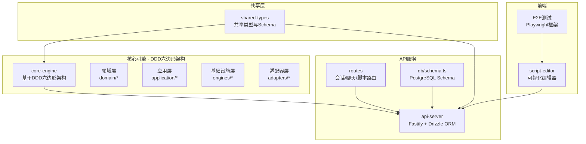

**图表来源**

- [packages/core-engine/src/index.ts](file://packages/core-engine/src/index.ts#L1-L193)
- [packages/api-server/src/app.ts](file://packages/api-server/src/app.ts#L1-L135)
- [packages/api-server/src/db/schema.ts](file://packages/api-server/src/db/schema.ts#L1-L219)
- [playwright.config.ts](file://playwright.config.ts#L1-L66)

**章节来源**

- [packages/core-engine/src/index.ts](file://packages/core-engine/src/index.ts#L1-L193)
- [packages/api-server/src/app.ts](file://packages/api-server/src/app.ts#L1-L135)

## 核心组件

- **新增** DDD六边形架构：领域层承载业务核心概念，应用层提供用例接口，基础设施层处理外部依赖，适配器层连接外部系统
- **新增** 端口-适配器模式：通过明确定义的端口接口实现依赖注入，支持测试替身和多实现切换
- Action体系：统一的Action基类与注册表，支持ai_say、ai_ask、ai_think等内置Action，并提供扩展机制
- 核心引擎：脚本执行、LLM编排、变量提取、记忆等引擎模块
- API服务：基于Fastify的REST API与Swagger文档，WebSocket支持
- 数据库：Drizzle ORM + PostgreSQL Schema，涵盖会话、消息、脚本、变量、记忆等表
- 可视化编辑器：支持YAML脚本的可视化编辑与双向映射
- **新增** E2E测试框架：Playwright自动化测试，支持跨平台浏览器测试

**章节来源**

- [packages/core-engine/src/application/ports/inbound/session-application.port.ts](file://packages/core-engine/src/application/ports/inbound/session-application.port.ts#L1-L152)
- [packages/core-engine/src/application/ports/outbound/llm-provider.port.ts](file://packages/core-engine/src/application/ports/outbound/llm-provider.port.ts#L1-L85)
- [packages/core-engine/src/application/usecases/session-application-service.ts](file://packages/core-engine/src/application/usecases/session-application-service.ts#L1-L372)

## 架构总览

系统采用严格的DDD六边形架构：表现层（前端/编辑器）、应用层（会话管理/脚本调试/编辑）、引擎层（六大核心引擎）、脚本层（YAML脚本）、基础设施层（PostgreSQL/Redis）。核心引擎以headless方式提供能力，API服务负责对外暴露。

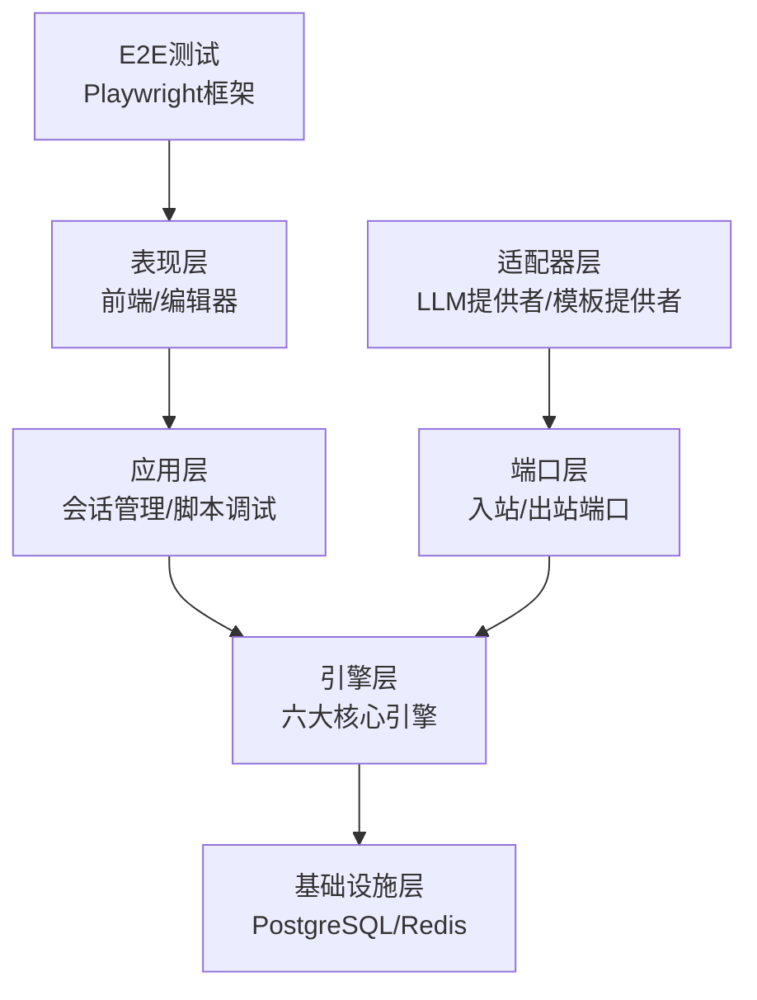

**图表来源**

- [packages/core-engine/src/index.ts](file://packages/core-engine/src/index.ts#L1-L193)

## 详细组件分析

### Action体系与扩展流程（基于新架构）

基于DDD六边形架构，Action现在分为领域层的行为实现和应用层的执行器：

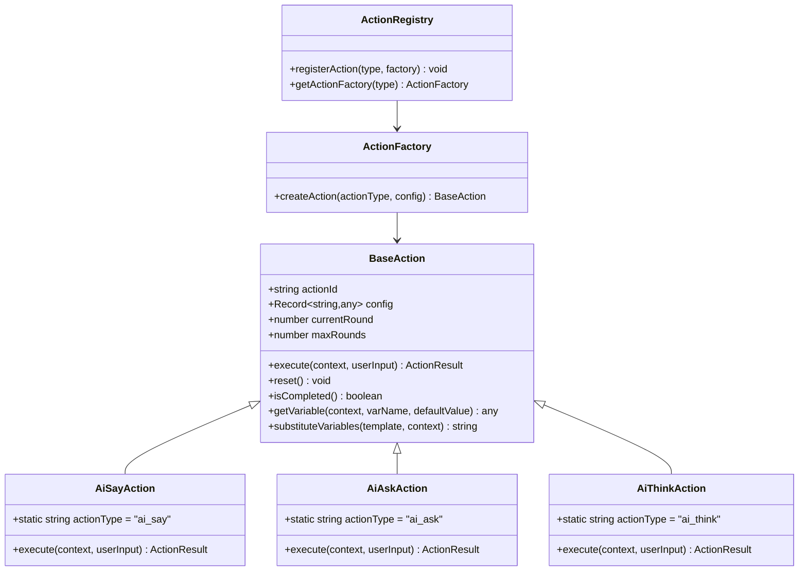

**图表来源**

- [packages/core-engine/src/domain/actions/base-action.ts](file://packages/core-engine/src/domain/actions/base-action.ts)
- [packages/core-engine/src/domain/actions/ai-say-action.ts](file://packages/core-engine/src/domain/actions/ai-say-action.ts)
- [packages/core-engine/src/domain/actions/ai-ask-action.ts](file://packages/core-engine/src/domain/actions/ai-ask-action.ts)
- [packages/core-engine/src/domain/actions/ai-think-action.ts](file://packages/core-engine/src/domain/actions/ai-think-action.ts)
- [packages/core-engine/src/application/actions/action-factory.ts](file://packages/core-engine/src/application/actions/action-factory.ts)
- [packages/core-engine/src/application/actions/action-registry.ts](file://packages/core-engine/src/application/actions/action-registry.ts)

#### 新Action开发步骤（基于新架构）

基于DDD六边形架构，新Action的开发流程更加规范化：

1. **领域层实现**：在`domain/actions/`目录创建Action类，继承BaseAction并实现execute
2. **应用层工厂**：在`application/actions/`目录创建Action工厂，负责Action实例化
3. **注册Action**：在`application/actions/action-registry.ts`中注册新类型
4. **端口接口**：确保Action实现符合领域抽象，不依赖外部框架
5. **测试**：编写单元测试与集成测试，验证执行流程与状态转换
6. **文档**：更新开发指南与可视化编辑器配置项支持

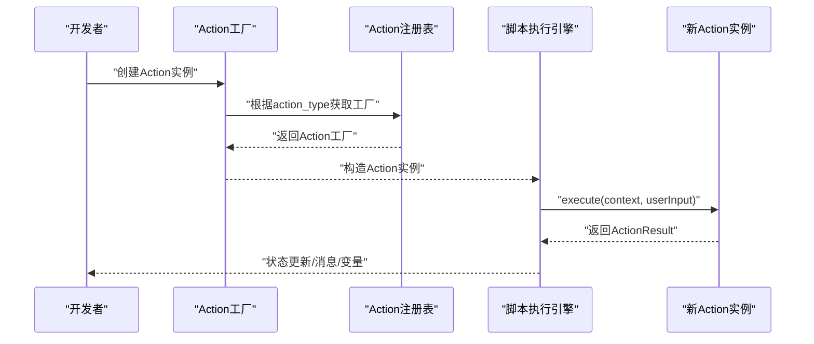

**图表来源**

- [packages/core-engine/src/application/actions/action-factory.ts](file://packages/core-engine/src/application/actions/action-factory.ts)
- [packages/core-engine/src/application/actions/action-registry.ts](file://packages/core-engine/src/application/actions/action-registry.ts)

**章节来源**

- [packages/core-engine/src/domain/actions/base-action.ts](file://packages/core-engine/src/domain/actions/base-action.ts)
- [packages/core-engine/src/application/actions/action-factory.ts](file://packages/core-engine/src/application/actions/action-factory.ts)
- [packages/core-engine/src/application/actions/action-registry.ts](file://packages/core-engine/src/application/actions/action-registry.ts)

### API端点添加方法（基于新架构）

基于新的架构模式，API端点的添加方法更加标准化：

1. **应用服务接口**：在`application/ports/inbound/`定义标准接口契约
2. **应用服务实现**：在`application/usecases/`实现具体业务逻辑
3. **适配器实现**：在`adapters/outbound/`实现外部依赖适配
4. **路由注册**：在api-server的routes目录新增路由文件
5. **依赖注入**：通过依赖注入容器组装服务实例

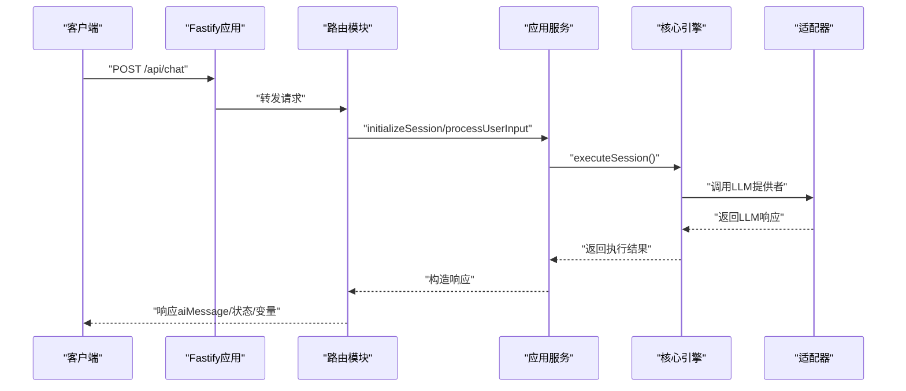

**图表来源**

- [packages/api-server/src/app.ts](file://packages/api-server/src/app.ts#L91-L103)
- [packages/api-server/src/routes/sessions.ts](file://packages/api-server/src/routes/sessions.ts#L1-L620)
- [packages/core-engine/src/application/ports/inbound/session-application.port.ts](file://packages/core-engine/src/application/ports/inbound/session-application.port.ts#L129-L151)

**章节来源**

- [packages/api-server/src/app.ts](file://packages/api-server/src/app.ts#L1-L135)
- [packages/api-server/src/routes/sessions.ts](file://packages/api-server/src/routes/sessions.ts#L1-L620)
- [packages/core-engine/src/application/ports/inbound/session-application.port.ts](file://packages/core-engine/src/application/ports/inbound/session-application.port.ts#L1-L152)

### 数据库Schema修改流程（基于数据库优先架构）

基于数据库优先架构，数据库Schema的修改流程更加严谨：

1. **数据库优先设计**：先在`schema.ts`中定义/修改表结构与枚举
2. **迁移生成**：使用drizzle-kit生成迁移文件
3. **迁移应用**：执行迁移脚本
4. **数据验证**：使用Drizzle Studio或psql验证结构与数据
5. **模板导入**：导入历史模板到数据库

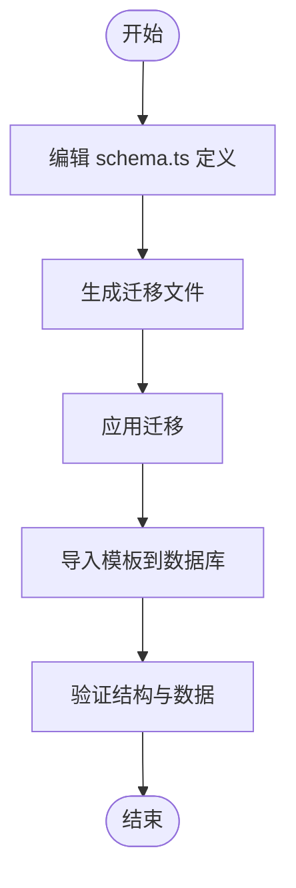

**图表来源**

- [packages/api-server/src/db/schema.ts](file://packages/api-server/src/db/schema.ts#L1-L219)
- [docs/MIGRATION_TO_DATABASE_ARCHITECTURE.md](file://docs/MIGRATION_TO_DATABASE_ARCHITECTURE.md#L96-L112)

**章节来源**

- [docs/MIGRATION_TO_DATABASE_ARCHITECTURE.md](file://docs/MIGRATION_TO_DATABASE_ARCHITECTURE.md#L80-L112)
- [packages/api-server/package.json](file://packages/api-server/package.json#L12-L18)

### 前端组件开发规范（基于新架构）

基于新架构，前端组件开发规范更加明确：

- **类型定义**：在script-editor的types目录中扩展Action接口，确保与后端一致
- **解析与映射**：在编辑器页面中实现YAML与前端数据结构的双向映射
- **UI组件**：在ActionPropertyPanel中渲染对应控件，支持数据校验与默认值
- **测试**：提供测试脚本验证新配置项的解析与生成

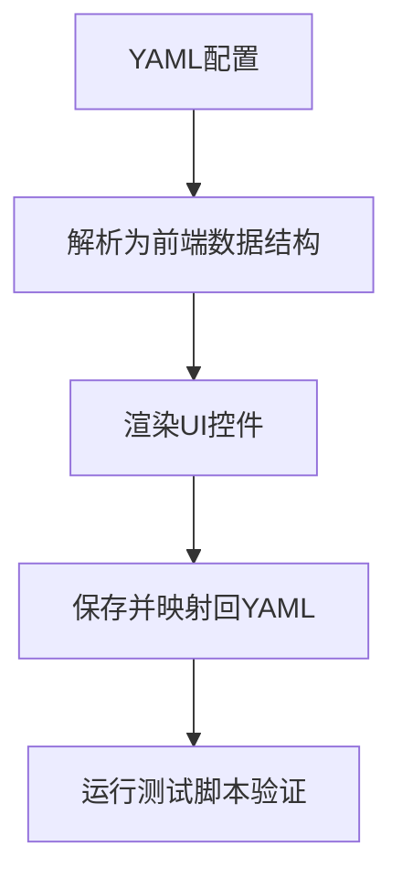

**图表来源**

- [新增动作配置指南(NEW_ACTION_CONFIG_GUIDE.md)](file://docs/NEW_ACTION_CONFIG_GUIDE.md#L147-L199)

**章节来源**

- [新增动作配置指南(NEW_ACTION_CONFIG_GUIDE.md)](file://docs/NEW_ACTION_CONFIG_GUIDE.md#L1-L310)

### 引擎扩展与最佳实践（基于新架构）

基于DDD六边形架构，引擎扩展的最佳实践：

- **新引擎开发**：在core-engine的engines目录创建子模块，提供index入口与职责边界清晰的实现
- **端口依赖**：通过明确定义的端口接口依赖外部服务，避免紧耦合
- **适配器实现**：在adapters/outbound/目录实现具体适配器
- **可测试性**：为引擎提供单元测试与集成测试，确保在不同Provider/配置下的稳定性
- **文档与示例**：为新引擎提供使用示例与配置说明

**章节来源**

- [packages/core-engine/DDD_HEXAGONAL_REFACTORING_PLAN.md](file://packages/core-engine/DDD_HEXAGONAL_REFACTORING_PLAN.md#L54-L96)

## DDD六边形架构开发指南

### 架构分层详解

基于DDD六边形架构，系统分为四个主要层次：

1. **领域层（Domain Layer）**：承载业务核心概念与规则，不依赖外部基础设施
   - 包含Session、Script、Message、Variable等核心领域模型
   - ActionDefinition属于领域模型的一部分

2. **应用层（Application Layer）**：定义用例接口与业务流程协调
   - 包含应用服务接口（Ports）和具体实现（Use Cases）
   - 负责编排领域模型和外部依赖

3. **基础设施层（Infrastructure Layer）**：处理外部系统交互
   - 包含脚本执行引擎、LLM编排、变量提取等
   - 不直接依赖外部框架

4. **适配器层（Adapters Layer）**：连接外部系统
   - 包含LLM提供者适配器、模板提供者适配器等
   - 实现端口接口并与外部系统交互

```mermaid
graph TB
subgraph "领域层"
DOMAIN_MODELS["领域模型<br/>Session, Script, Message, Variable"]
ACTION_BEHAVIOR["Action行为<br/>ai_say, ai_ask, ai_think"]
END
subgraph "应用层"
PORTS["端口接口<br/>入站/出站"]
USE_CASES["用例实现<br/>SessionApplicationService"]
STATE["状态管理<br/>ActionStateManager"]
HANDLERS["处理器<br/>ExecutionResultHandler"]
MONITORING["监控<br/>MonitorOrchestrator"]
END
subgraph "基础设施层"
ENGINES["引擎<br/>ScriptExecutor, LLMOrchestrator"]
PROMPT_TEMPLATES["模板引擎<br/>PromptTemplateManager"]
VARIABLE_EXTRACT["变量引擎<br/>VariableExtractor"]
MEMORY["记忆引擎<br/>MemoryEngine"]
END
subgraph "适配器层"
LLM_ADAPTER["LLM适配器<br/>OpenAIAdapter, VolcanoAdapter"]
TEMPLATE_ADAPTER["模板适配器<br/>DatabaseTemplateProvider"]
END
DOMAIN_MODELS --> USE_CASES
PORTS --> USE_CASES
USE_CASES --> ENGINES
ENGINES --> LLM_ADAPTER
ENGINES --> TEMPLATE_ADAPTER
```

**图表来源**

- [packages/core-engine/src/index.ts](file://packages/core-engine/src/index.ts#L88-L176)

### 端口接口设计

基于端口-适配器模式，定义清晰的接口契约：

#### 入站端口（Inbound Ports）

- **ISessionApplicationService**：定义会话管理的标准接口
- **InitializeSessionRequest/ProcessUserInputRequest**：定义请求数据结构
- **SessionExecutionResponse**：定义响应数据结构

#### 出站端口（Outbound Ports）

- **ILLMProvider**：定义LLM调用的标准接口
- **ITemplateProvider**：定义模板加载的标准接口
- **ILLMProvider**接口包含getModel()、generateText()、streamText()方法

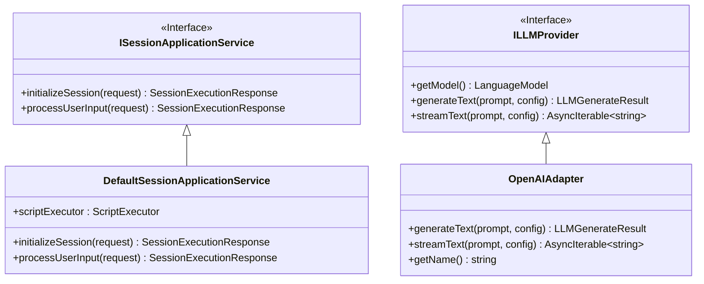

**图表来源**

- [packages/core-engine/src/application/ports/inbound/session-application.port.ts](file://packages/core-engine/src/application/ports/inbound/session-application.port.ts#L129-L151)
- [packages/core-engine/src/application/ports/outbound/llm-provider.port.ts](file://packages/core-engine/src/application/ports/outbound/llm-provider.port.ts#L59-L84)
- [packages/core-engine/src/application/usecases/session-application-service.ts](file://packages/core-engine/src/application/usecases/session-application-service.ts#L27-L371)

### 依赖注入与适配器实现

基于依赖注入容器，实现灵活的服务组合：

#### 依赖注入容器

- 在api-server中创建DependencyContainer
- 根据环境变量选择不同的LLM提供者实现
- 组装LLMOrchestrator和SessionApplicationService

#### 适配器实现

- **OpenAIAdapter**：实现ILLMProvider接口，调用OpenAI API
- **VolcanoAdapter**：实现ILLMProvider接口，调用火山引擎API
- **DatabaseTemplateProvider**：实现ITemplateProvider接口，从数据库加载模板

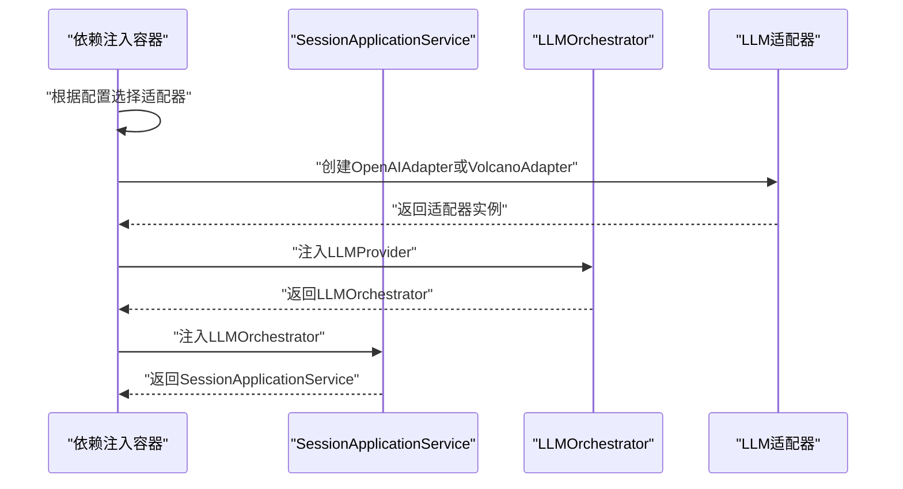

**图表来源**

- [packages/core-engine/src/application/usecases/session-application-service.ts](file://packages/core-engine/src/application/usecases/session-application-service.ts#L30-L33)
- [packages/api-server/src/adapters/outbound/llm/openai-provider.ts](file://packages/api-server/src/adapters/outbound/llm/openai-provider.ts)
- [packages/api-server/src/adapters/outbound/llm/volcano-provider.ts](file://packages/api-server/src/adapters/outbound/llm/volcano-provider.ts)

**章节来源**

- [packages/core-engine/DDD_HEXAGONAL_REFACTORING_PLAN.md](file://packages/core-engine/DDD_HEXAGONAL_REFACTORING_PLAN.md#L54-L96)
- [packages/core-engine/src/application/ports/inbound/session-application.port.ts](file://packages/core-engine/src/application/ports/inbound/session-application.port.ts#L1-L152)
- [packages/core-engine/src/application/ports/outbound/llm-provider.port.ts](file://packages/core-engine/src/application/ports/outbound/llm-provider.port.ts#L1-L85)
- [packages/core-engine/src/application/usecases/session-application-service.ts](file://packages/core-engine/src/application/usecases/session-application-service.ts#L1-L372)

## 数据库优先架构开发指南

### 架构设计理念

基于数据库优先架构，系统从纯数据库模式开始设计：

- **单一数据源**：所有工程资源存储于PostgreSQL数据库
- **移除文件系统依赖**：不再依赖物理workspace目录
- **统一数据管理**：通过数据库实现数据一致性与备份
- **支持多租户**：基于数据库级隔离实现多用户项目管理

### 数据库表结构设计

基于数据库优先架构，核心表结构设计：

#### 项目表（projects）

- 存储工程元数据和配置信息
- 支持多用户、多项目管理
- 包含metadata字段存储工程配置

#### 脚本文件表（script_files）

- 存储模板和脚本文件内容
- 支持虚拟路径管理
- 包含JSONB格式的内容存储

#### 会话表（sessions）

- 存储会话状态和执行信息
- 支持多轮对话状态管理
- 包含变量存储和调试信息

#### 消息表（messages）

- 存储对话历史记录
- 支持角色区分（user/assistant）
- 包含元数据和时间戳

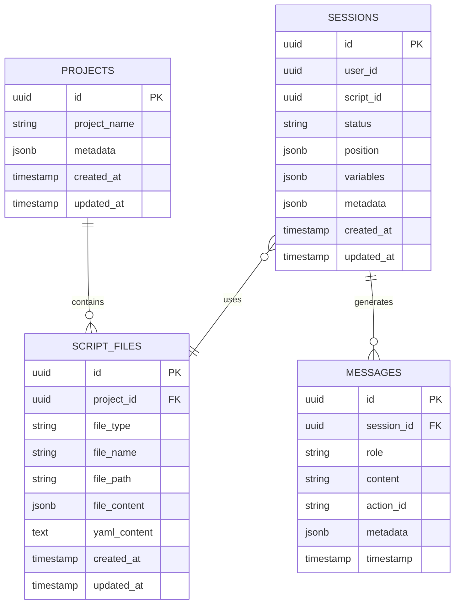

**图表来源**

- [packages/api-server/src/db/schema.ts](file://packages/api-server/src/db/schema.ts#L1-L219)

### 数据库迁移流程

基于数据库优先架构，数据迁移流程更加标准化：

#### 迁移前准备

1. **备份数据库**：使用pg_dump备份现有数据
2. **检查环境**：确认当前版本和数据库状态
3. **准备工具**：安装必要的迁移工具和依赖

#### 迁移执行步骤

1. **升级代码**：切换到v2.1版本
2. **执行迁移**：运行数据库迁移脚本
3. **导入模板**：使用迁移工具导入历史模板
4. **验证功能**：运行E2E测试验证数据库模式

#### 迁移验证

- 模板从script_files表正确加载
- ai_ask和ai_say动作使用数据库模板
- 变量提取和替换正常工作
- 会话状态正确持久化

**章节来源**

- [docs/MIGRATION_TO_DATABASE_ARCHITECTURE.md](file://docs/MIGRATION_TO_DATABASE_ARCHITECTURE.md#L1-L499)
- [packages/api-server/src/db/schema.ts](file://packages/api-server/src/db/schema.ts#L1-L219)

## 多用户项目工程开发指南

### 工程初始化流程

基于数据库优先架构，新工程的初始化流程：

#### 工程创建

1. **项目注册**：在projects表中创建新工程记录
2. **模板导入**：从系统模板目录导入默认模板到script_files表
3. **配置设置**：设置工程元数据和权限配置

#### 模板管理

- **系统模板**：存储在config/prompts目录
- **自定义模板**：支持用户自定义模板方案
- **模板版本**：支持模板版本管理和方案切换

#### 示例脚本生成

- **空白工程**：生成hello-world.yaml示例
- **CBT评估**：生成抑郁症评估示例脚本
- **自定义生成**：支持根据配置生成特定类型的脚本

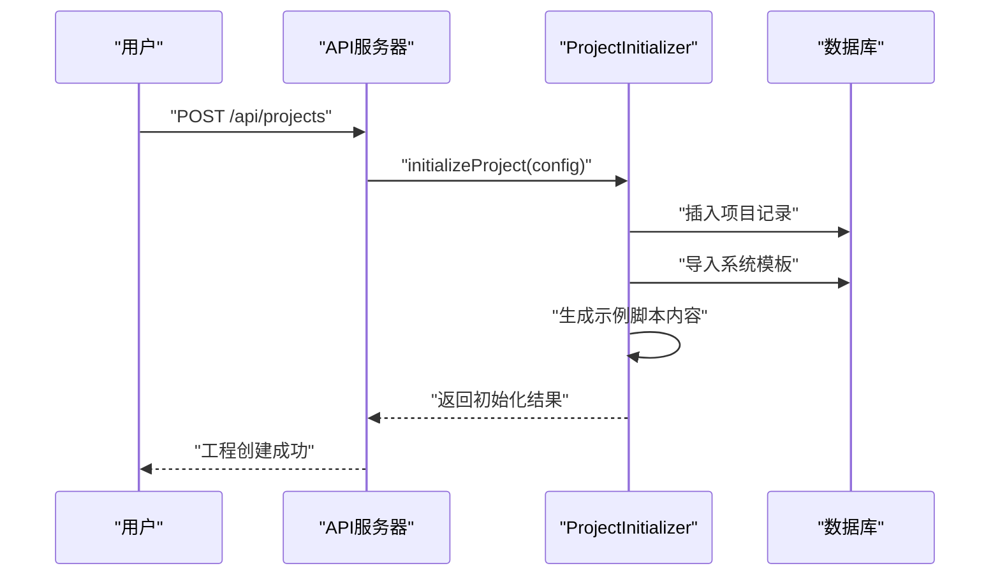

**图表来源**

- [packages/api-server/src/services/project-initializer.ts](file://packages/api-server/src/services/project-initializer.ts#L63-L102)

### 工程管理功能

基于多用户架构，工程管理功能包括：

#### 工程状态管理

- **草稿状态**：工程创建但未激活
- **启用状态**：工程可正常使用
- **停用状态**：工程暂时不可用
- **作废状态**：工程标记为作废

#### 权限控制

- **用户绑定**：每个工程关联特定用户
- **访问控制**：基于用户权限控制工程访问
- **数据隔离**：基于数据库级隔离确保数据安全

#### 工程复制与导出

- **工程复制**：支持快速复制现有工程
- **模板导出**：支持工程模板的导出和分享
- **批量操作**：支持多工程的批量管理

**章节来源**

- [packages/api-server/src/services/project-initializer.ts](file://packages/api-server/src/services/project-initializer.ts#L1-L263)
- [packages/api-server/src/routes/projects.ts](file://packages/api-server/src/routes/projects.ts#L366-L484)

## 端口-适配器模式开发最佳实践

### 端口设计原则

基于端口-适配器模式，设计清晰的接口契约：

#### 入站端口（Inbound Ports）

- **职责单一**：每个端口只定义一组相关的业务操作
- **接口稳定**：避免频繁变更，确保向后兼容
- **数据契约**：明确定义请求和响应的数据结构

#### 出站端口（Outbound Ports）

- **抽象依赖**：只依赖抽象接口，不依赖具体实现
- **可替换性**：支持不同实现的无缝切换
- **测试友好**：便于Mock替身的创建和使用

### 适配器实现规范

基于端口-适配器模式，适配器实现的最佳实践：

#### 适配器设计

- **单一职责**：每个适配器只实现一个端口接口
- **错误处理**：统一的错误处理和异常转换
- **性能考虑**：合理的缓存和连接池管理

#### 依赖注入

- **容器管理**：通过依赖注入容器统一管理适配器实例
- **配置驱动**：支持通过环境变量配置不同的适配器实现
- **生命周期**：合理管理适配器的创建和销毁

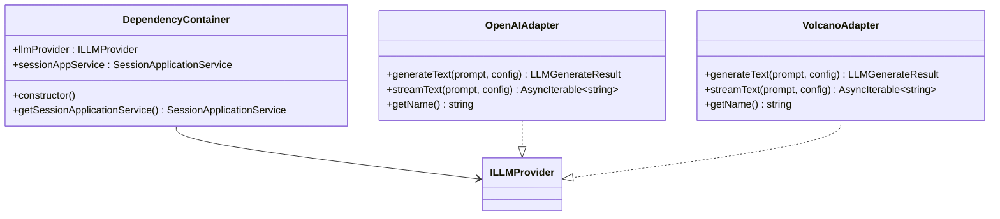

**图表来源**

- [packages/core-engine/src/application/usecases/session-application-service.ts](file://packages/core-engine/src/application/usecases/session-application-service.ts#L640-L661)
- [packages/api-server/src/adapters/outbound/llm/openai-provider.ts](file://packages/api-server/src/adapters/outbound/llm/openai-provider.ts#L605-L612)
- [packages/api-server/src/adapters/outbound/llm/volcano-provider.ts](file://packages/api-server/src/adapters/outbound/llm/volcano-provider.ts#L605-L612)

### 测试策略

基于端口-适配器模式，测试策略更加灵活：

#### 单元测试

- **接口测试**：测试端口接口的契约实现
- **适配器测试**：测试适配器的具体实现
- **依赖注入测试**：测试依赖注入容器的正确性

#### 集成测试

- **端到端测试**：测试完整的业务流程
- **适配器切换测试**：测试不同适配器实现的切换
- **错误场景测试**：测试各种异常情况的处理

**章节来源**

- [packages/core-engine/DDD_HEXAGONAL_REFACTORING_PLAN.md](file://packages/core-engine/DDD_HEXAGONAL_REFACTORING_PLAN.md#L570-L696)
- [packages/core-engine/src/application/ports/inbound/session-application.port.ts](file://packages/core-engine/src/application/ports/inbound/session-application.port.ts#L1-L152)
- [packages/core-engine/src/application/ports/outbound/llm-provider.port.ts](file://packages/core-engine/src/application/ports/outbound/llm-provider.port.ts#L1-L85)

## 依赖关系分析

基于新架构，依赖关系更加清晰和可控：

- **领域层**：不依赖任何外部框架，保持纯净的业务逻辑
- **应用层**：通过端口接口依赖外部服务，避免直接依赖具体实现
- **基础设施层**：处理具体的引擎实现，不依赖外部框架
- **适配器层**：实现端口接口，连接外部系统
- **API服务**：依赖core-engine的应用服务接口，使用Drizzle ORM访问数据库
- **脚本编辑器**：与API服务通过YAML协议协同，编辑器负责可视化与双向映射
- **E2E测试框架**：依赖Playwright，与前端编辑器紧密集成

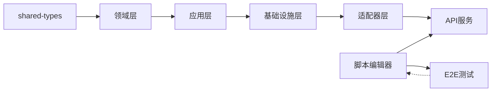

**图表来源**

- [packages/core-engine/src/index.ts](file://packages/core-engine/src/index.ts#L88-L176)
- [packages/api-server/src/app.ts](file://packages/api-server/src/app.ts#L91-L103)
- [playwright.config.ts](file://playwright.config.ts#L1-L66)

**章节来源**

- [packages/core-engine/src/index.ts](file://packages/core-engine/src/index.ts#L88-L176)
- [packages/api-server/src/app.ts](file://packages/api-server/src/app.ts#L1-L135)

## 性能考虑

基于新架构，性能优化策略更加系统化：

- **异步事件循环与高性能框架**：使用Fastify提升HTTP性能
- **类型安全与编译时检查**：TypeScript严格模式减少运行时错误
- **ORM零运行时开销**：Drizzle ORM提供高效查询
- **LLM调用优化**：统一Provider抽象，支持流式/非流式调用，合理设置超时与重试
- **前端渲染优化**：可视化编辑器采用受控组件与最小化重渲染
- **E2E测试优化**：使用fullyParallel并行执行，retries机制提高稳定性
- **数据库查询优化**：基于索引的查询优化，避免N+1查询问题
- **适配器缓存**：合理使用缓存机制减少重复调用
- **依赖注入优化**：避免循环依赖，优化对象生命周期管理

## 故障排除指南

基于新架构，故障排除策略更加系统化：

- **端口接口问题**：检查端口定义与实现的一致性
- **适配器实现问题**：验证适配器是否正确实现端口接口
- **依赖注入问题**：确认依赖注入容器的正确配置
- **数据库连接问题**：检查DATABASE_URL、容器状态与日志
- **LLM调用问题**：核对API密钥与网络连通性
- **类型错误**：确保shared-types已构建且导入路径正确
- **CORS问题**：确认API服务器运行与前端地址一致
- **E2E测试问题**：
  - 浏览器安装失败：使用国内镜像源或离线安装
  - 服务器未启动：确认API和编辑器服务都在运行
  - 测试超时：调整playwright.config.ts中的timeout设置
  - 选择器失效：使用Playwright Inspector调试DOM结构
- **架构违规问题**：检查是否违反DDD六边形架构原则

**章节来源**

- [packages/core-engine/DDD_HEXAGONAL_REFACTORING_PLAN.md](file://packages/core-engine/DDD_HEXAGONAL_REFACTORING_PLAN.md#L700-L758)
- [docs/E2E_TESTING_GUIDE.md](file://docs/E2E_TESTING_GUIDE.md#L192-L212)

## 结论

通过本指南，新开发者可以快速掌握基于DDD六边形架构的HeartRule引擎开发技能，包括：

- **新增** DDD六边形架构的完整开发流程
- **新增** 数据库优先架构的设计理念与实现
- **新增** 多用户项目工程的开发规范
- **新增** 端口-适配器模式的开发最佳实践
- **更新** 基于新架构的Action扩展、引擎扩展、API与数据库变更、前端编辑器开发
- **更新** 基于新架构的测试策略与E2E测试框架
- **更新** 基于新架构的调试技巧、性能优化与故障排除

建议在开发过程中遵循DDD六边形架构原则、端口-适配器模式、数据库优先设计，持续完善文档与测试用例，确保系统的可维护性、可扩展性和可测试性。

## 附录

### 快速开始与常用命令

- **启动开发环境**：一键启动API与编辑器，或分别启动
- **数据库**：生成迁移、应用迁移、打开Studio
- **测试**：运行单元测试、集成测试与覆盖率
- **E2E测试**：运行Playwright测试、UI调试模式、调试模式
- **架构验证**：运行DDD架构合规性检查
- **lint与格式化**：ESLint + Prettier，配合Git钩子

**章节来源**

- [package.json](file://package.json#L13-L38)
- [packages/core-engine/DDD_HEXAGONAL_REFACTORING_PLAN.md](file://packages/core-engine/DDD_HEXAGONAL_REFACTORING_PLAN.md#L737-L758)
- [docs/E2E_TESTING_GUIDE.md](file://docs/E2E_TESTING_GUIDE.md#L61-L77)
