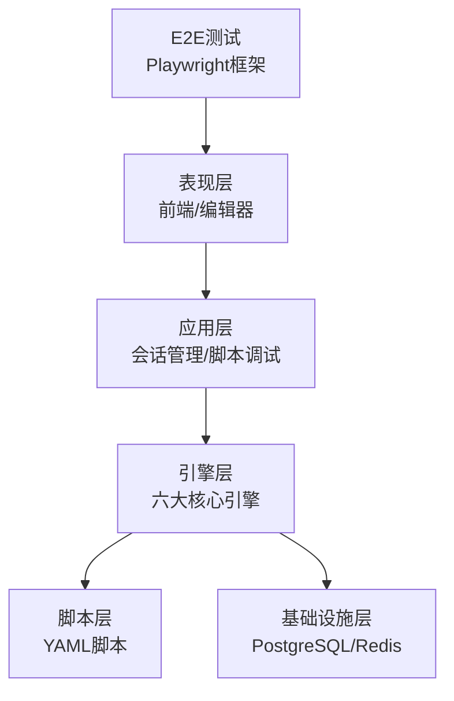
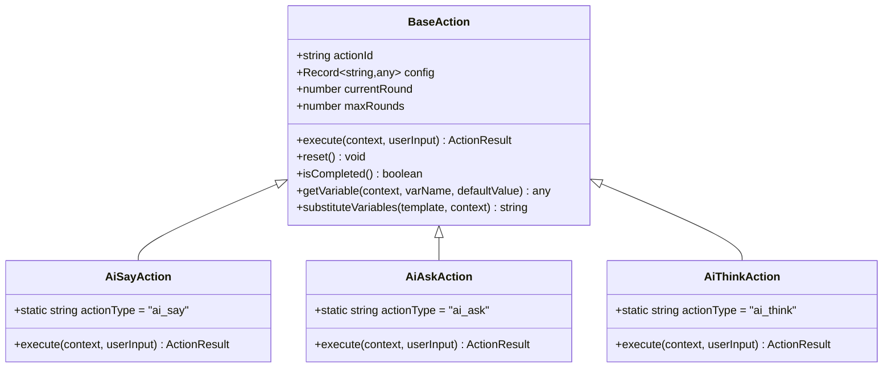
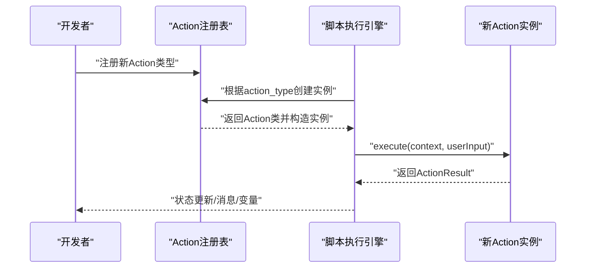
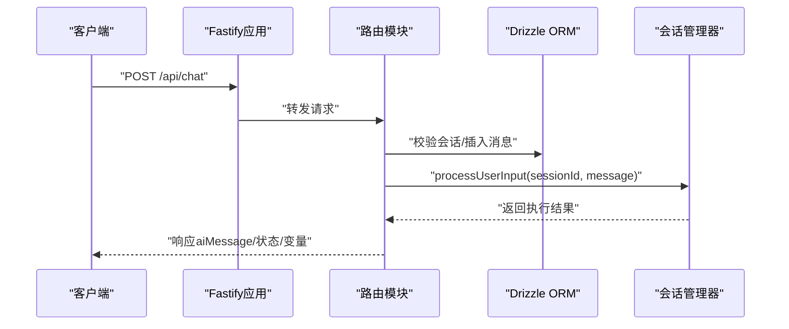
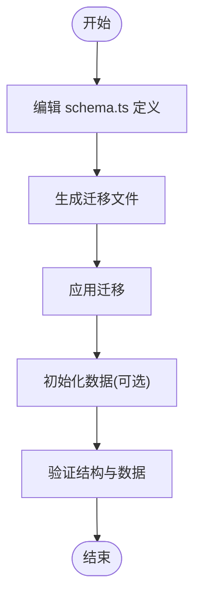
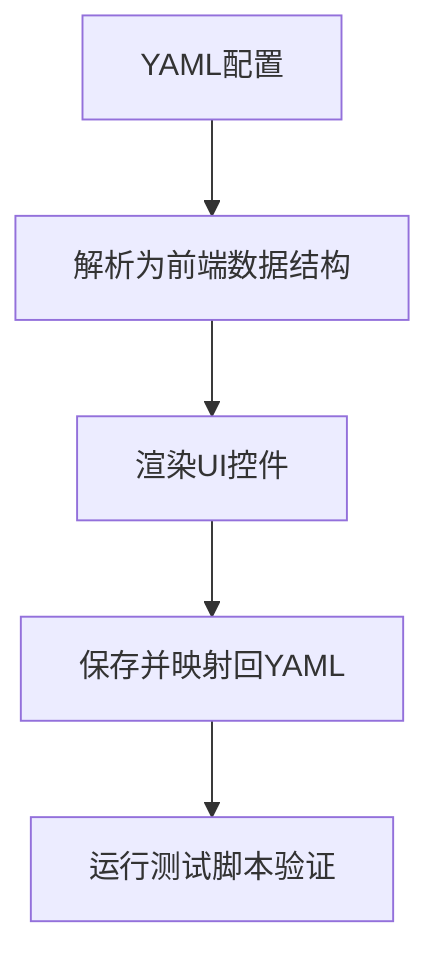
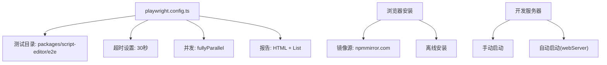
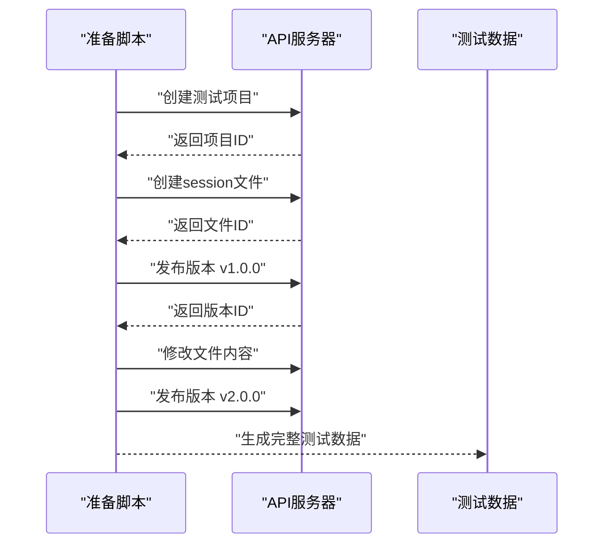
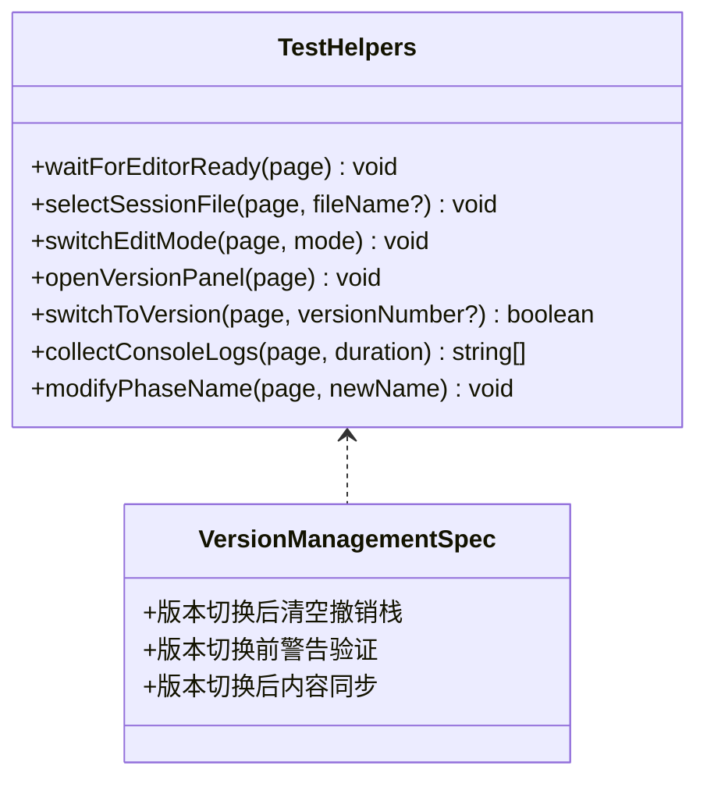
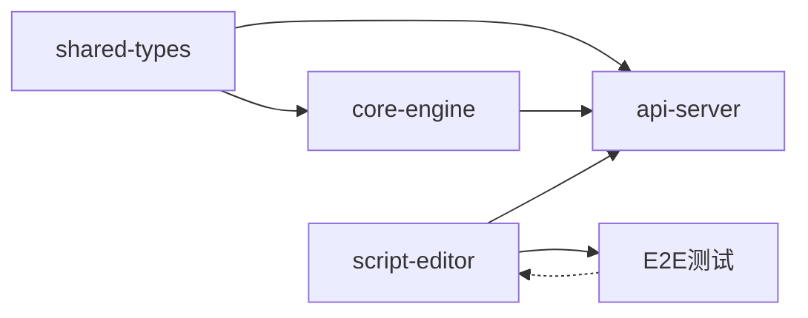

# 开发指南

<cite>
**本文引用的文件**
- [README.md](file://README.md)
- [开发指南(DEVELOPMENT_GUIDE.md)](file://docs/DEVELOPMENT_GUIDE.md)
- [新增动作配置指南(NEW_ACTION_CONFIG_GUIDE.md)](file://docs/NEW_ACTION_CONFIG_GUIDE.md)
- [开发环境启动指南(DEV_START_GUIDE.md)](file://DEV_START_GUIDE.md)
- [快速启动指南(QUICK_START_GUIDE.md)](file://QUICK_START_GUIDE.md)
- [packages/core-engine/src/actions/base-action.ts](file://packages/core-engine/src/actions/base-action.ts)
- [packages/core-engine/src/actions/action-registry.ts](file://packages/core-engine/src/actions/action-registry.ts)
- [packages/core-engine/src/actions/ai-say-action.ts](file://packages/core-engine/src/actions/ai-say-action.ts)
- [packages/core-engine/src/actions/ai-ask-action.ts](file://packages/core-engine/src/actions/ai-ask-action.ts)
- [packages/core-engine/src/actions/ai-think-action.ts](file://packages/core-engine/src/actions/ai-think-action.ts)
- [packages/core-engine/src/index.ts](file://packages/core-engine/src/index.ts)
- [packages/api-server/src/app.ts](file://packages/api-server/src/app.ts)
- [packages/api-server/src/routes/chat.ts](file://packages/api-server/src/routes/chat.ts)
- [packages/api-server/src/db/schema.ts](file://packages/api-server/src/db/schema.ts)
- [packages/api-server/package.json](file://packages/api-server/package.json)
- [packages/core-engine/package.json](file://packages/core-engine/package.json)
- [package.json](file://package.json)
- [playwright.config.ts](file://playwright.config.ts)
- [docs/E2E_TESTING_GUIDE.md](file://docs/E2E_TESTING_GUIDE.md)
- [packages/script-editor/e2e/version-management.spec.ts](file://packages/script-editor/e2e/version-management.spec.ts)
- [packages/script-editor/e2e/helpers.ts](file://packages/script-editor/e2e/helpers.ts)
- [packages/script-editor/e2e/create-test-project.mjs](file://packages/script-editor/e2e/create-test-project.mjs)
- [packages/script-editor/e2e/prepare-test-data.mjs](file://packages/script-editor/e2e/prepare-test-data.mjs)
- [packages/api-server/test-api.ps1](file://packages/api-server/test-api.ps1)
- [scripts/start-dev.ps1](file://scripts/start-dev.ps1)
</cite>

## 更新摘要
**所做更改**
- 新增Playwright E2E测试框架开发指导章节
- 更新开发环境配置，移除PowerShell脚本依赖
- 添加跨平台脚本和测试工具函数
- 更新测试数据准备和调试技巧

## 目录
1. [简介](#简介)
2. [项目结构](#项目结构)
3. [核心组件](#核心组件)
4. [架构总览](#架构总览)
5. [详细组件分析](#详细组件分析)
6. [依赖关系分析](#依赖关系分析)
7. [性能考虑](#性能考虑)
8. [故障排除指南](#故障排除指南)
9. [结论](#结论)
10. [附录](#附录)

## 简介
本指南面向新加入的开发者，系统讲解HeartRule AI咨询引擎的开发流程与最佳实践，重点覆盖：
- 新Action类型的开发全流程：从创建Action类、注册到测试
- 引擎扩展：如何添加新的核心引擎、如何扩展现有引擎功能
- API端点的添加方法
- 数据库Schema的修改流程
- 前端组件开发规范（基于可视化编辑器）
- **新增** Playwright E2E测试框架的开发指导
- **更新** 跨平台开发环境配置
- 代码质量标准、测试策略与持续集成配置
- 调试技巧、性能优化建议与故障排除

## 项目结构
项目采用Monorepo架构，核心模块包括：
- shared-types：共享类型与Zod Schema
- core-engine：六大核心引擎（headless），包含Action体系与脚本执行、LLM编排、变量提取、记忆等引擎
- api-server：Fastify REST API + WebSocket，提供会话、聊天、脚本管理等端点
- script-editor：可视化脚本编辑器（前端）
- scripts：YAML脚本资源（会话与技术）
- **新增** E2E测试：Playwright自动化测试框架

```mermaid
graph TB
subgraph "共享层"
ST["shared-types<br/>共享类型与Schema"]
end
subgraph "核心引擎"
CE["core-engine<br/>六大核心引擎(headless)"]
ACT["actions<br/>Action基类与注册表"]
END
subgraph "API服务"
API["api-server<br/>Fastify + Drizzle ORM"]
ROUTES["routes<br/>会话/聊天/脚本路由"]
DB["db/schema.ts<br/>PostgreSQL Schema"]
end
subgraph "前端"
EDITOR["script-editor<br/>可视化编辑器"]
E2E["E2E测试<br/>Playwright框架"]
end
ST --> CE
ST --> API
CE --> API
ROUTES --> API
DB --> API
EDITOR --> API
E2E --> EDITOR
```

**图表来源**
- [packages/core-engine/src/index.ts](file://packages/core-engine/src/index.ts#L1-L27)
- [packages/api-server/src/app.ts](file://packages/api-server/src/app.ts#L1-L135)
- [packages/api-server/src/db/schema.ts](file://packages/api-server/src/db/schema.ts#L1-L219)
- [playwright.config.ts](file://playwright.config.ts#L1-L66)

**章节来源**
- [README.md](file://README.md#L50-L58)
- [README.md](file://README.md#L97-L129)

## 核心组件
- Action体系：统一的Action基类与注册表，支持ai_say、ai_ask、ai_think等内置Action，并提供扩展机制
- 核心引擎：脚本执行、LLM编排、变量提取、记忆等引擎模块
- API服务：基于Fastify的REST API与Swagger文档，WebSocket支持
- 数据库：Drizzle ORM + PostgreSQL Schema，涵盖会话、消息、脚本、变量、记忆等表
- 可视化编辑器：支持YAML脚本的可视化编辑与双向映射
- **新增** E2E测试框架：Playwright自动化测试，支持跨平台浏览器测试

**章节来源**
- [packages/core-engine/src/actions/base-action.ts](file://packages/core-engine/src/actions/base-action.ts#L1-L96)
- [packages/core-engine/src/actions/action-registry.ts](file://packages/core-engine/src/actions/action-registry.ts#L1-L46)
- [packages/core-engine/src/actions/ai-say-action.ts](file://packages/core-engine/src/actions/ai-say-action.ts#L1-L105)
- [packages/core-engine/src/actions/ai-ask-action.ts](file://packages/core-engine/src/actions/ai-ask-action.ts#L1-L207)
- [packages/core-engine/src/actions/ai-think-action.ts](file://packages/core-engine/src/actions/ai-think-action.ts#L1-L57)
- [packages/api-server/src/app.ts](file://packages/api-server/src/app.ts#L1-L135)
- [packages/api-server/src/db/schema.ts](file://packages/api-server/src/db/schema.ts#L1-L219)
- [playwright.config.ts](file://playwright.config.ts#L1-L66)

## 架构总览
系统采用五层分层架构：表现层（前端/编辑器）、应用层（会话管理/脚本调试/编辑）、引擎层（六大核心引擎）、脚本层（YAML脚本）、基础设施层（PostgreSQL/Redis）。核心引擎以headless方式提供能力，API服务负责对外暴露。



**图表来源**
- [README.md](file://README.md#L26-L48)

## 详细组件分析

### Action体系与扩展流程
Action是脚本执行的基本单元，所有Action需继承基类并实现execute方法，通过注册表统一管理。



**图表来源**
- [packages/core-engine/src/actions/base-action.ts](file://packages/core-engine/src/actions/base-action.ts#L1-L96)
- [packages/core-engine/src/actions/ai-say-action.ts](file://packages/core-engine/src/actions/ai-say-action.ts#L1-L105)
- [packages/core-engine/src/actions/ai-ask-action.ts](file://packages/core-engine/src/actions/ai-ask-action.ts#L1-L207)
- [packages/core-engine/src/actions/ai-think-action.ts](file://packages/core-engine/src/actions/ai-think-action.ts#L1-L57)

#### 新Action开发步骤
- 创建Action类：在core-engine的actions目录新增文件，继承BaseAction并实现execute
- 配置与模板：利用基类提供的变量替换与上下文访问能力
- 注册Action：在action-registry中注册新类型，导出到包入口
- 测试：编写单元测试与集成测试，验证执行流程与状态转换
- 文档：更新开发指南与可视化编辑器配置项支持



**图表来源**
- [packages/core-engine/src/actions/action-registry.ts](file://packages/core-engine/src/actions/action-registry.ts#L25-L45)
- [packages/core-engine/src/actions/base-action.ts](file://packages/core-engine/src/actions/base-action.ts#L51-L57)

**章节来源**
- [packages/core-engine/src/actions/base-action.ts](file://packages/core-engine/src/actions/base-action.ts#L1-L96)
- [packages/core-engine/src/actions/action-registry.ts](file://packages/core-engine/src/actions/action-registry.ts#L1-L46)
- [开发指南(DEVELOPMENT_GUIDE.md)](file://docs/DEVELOPMENT_GUIDE.md#L111-L139)

### API端点添加方法
- 在api-server的routes目录新增路由文件，定义schema与处理器
- 在app.ts中注册路由（带/api前缀）
- 使用Drizzle ORM访问数据库，确保Schema与实体一致
- Swagger自动生成API文档，便于联调与测试



**图表来源**
- [packages/api-server/src/app.ts](file://packages/api-server/src/app.ts#L91-L103)
- [packages/api-server/src/routes/chat.ts](file://packages/api-server/src/routes/chat.ts#L15-L152)
- [packages/api-server/src/db/schema.ts](file://packages/api-server/src/db/schema.ts#L1-L219)

**章节来源**
- [packages/api-server/src/app.ts](file://packages/api-server/src/app.ts#L1-L135)
- [packages/api-server/src/routes/chat.ts](file://packages/api-server/src/routes/chat.ts#L1-L152)
- [开发指南(DEVELOPMENT_GUIDE.md)](file://docs/DEVELOPMENT_GUIDE.md#L151-L173)

### 数据库Schema修改流程
- 在schema.ts中定义/修改表结构与枚举
- 生成迁移：使用drizzle-kit生成迁移文件
- 应用迁移：执行迁移脚本
- 初始化数据：必要时运行初始化脚本
- 验证：使用Drizzle Studio或psql验证结构与数据



**图表来源**
- [packages/api-server/src/db/schema.ts](file://packages/api-server/src/db/schema.ts#L1-L219)
- [开发指南(DEVELOPMENT_GUIDE.md)](file://docs/DEVELOPMENT_GUIDE.md#L174-L193)

**章节来源**
- [开发指南(DEVELOPMENT_GUIDE.md)](file://docs/DEVELOPMENT_GUIDE.md#L174-L193)
- [packages/api-server/package.json](file://packages/api-server/package.json#L12-L18)

### 前端组件开发规范（可视化编辑器）
- 类型定义：在script-editor的types目录中扩展Action接口，确保与后端一致
- 解析与映射：在编辑器页面中实现YAML与前端数据结构的双向映射
- UI组件：在ActionPropertyPanel中渲染对应控件，支持数据校验与默认值
- 测试：提供测试脚本验证新配置项的解析与生成



**图表来源**
- [新增动作配置指南(NEW_ACTION_CONFIG_GUIDE.md)](file://docs/NEW_ACTION_CONFIG_GUIDE.md#L147-L199)

**章节来源**
- [新增动作配置指南(NEW_ACTION_CONFIG_GUIDE.md)](file://docs/NEW_ACTION_CONFIG_GUIDE.md#L1-L310)

### 引擎扩展与最佳实践
- 新增核心引擎：在core-engine的engines目录创建子模块，提供index入口与职责边界清晰的实现
- 与现有引擎协作：通过共享类型与上下文传递数据，避免紧耦合
- 可测试性：为引擎提供单元测试与集成测试，确保在不同Provider/配置下的稳定性
- 文档与示例：为新引擎提供使用示例与配置说明

**章节来源**
- [开发指南(DEVELOPMENT_GUIDE.md)](file://docs/DEVELOPMENT_GUIDE.md#L140-L149)

### Playwright E2E测试框架开发指导

**新增** 本节详细介绍如何使用Playwright进行Web端自动化测试，包括测试配置、编写规范、数据准备和调试技巧。

#### 测试配置与环境准备
- **配置文件**：playwright.config.ts定义了测试目录、报告输出、超时设置、并发策略等
- **浏览器安装**：支持多种安装方式，包括国内镜像源和离线安装
- **开发服务器**：需要手动启动前后端服务，或使用webServer配置自动启动



**图表来源**
- [playwright.config.ts](file://playwright.config.ts#L1-L66)

**章节来源**
- [playwright.config.ts](file://playwright.config.ts#L1-L66)
- [docs/E2E_TESTING_GUIDE.md](file://docs/E2E_TESTING_GUIDE.md#L1-L212)

#### 测试数据准备与管理
- **项目创建**：使用create-test-project.mjs脚本创建测试项目
- **数据准备**：prepare-test-data.mjs脚本自动化准备多版本数据
- **测试项目ID**：通过文件或环境变量传递测试项目ID
- **版本管理**：支持v1.0.0和v2.0.0两个版本的测试数据



**图表来源**
- [packages/script-editor/e2e/prepare-test-data.mjs](file://packages/script-editor/e2e/prepare-test-data.mjs#L1-L168)
- [packages/script-editor/e2e/create-test-project.mjs](file://packages/script-editor/e2e/create-test-project.mjs#L1-L46)

**章节来源**
- [packages/script-editor/e2e/prepare-test-data.mjs](file://packages/script-editor/e2e/prepare-test-data.mjs#L1-L168)
- [packages/script-editor/e2e/create-test-project.mjs](file://packages/script-editor/e2e/create-test-project.mjs#L1-L46)

#### 测试编写规范与工具函数
- **测试文件结构**：每个功能模块对应一个.spec.ts文件
- **工具函数**：helpers.ts提供常用的页面操作封装
- **等待策略**：使用waitForSelector而非固定等待时间
- **断言验证**：结合控制台日志和DOM元素验证



**图表来源**
- [packages/script-editor/e2e/helpers.ts](file://packages/script-editor/e2e/helpers.ts#L1-L143)
- [packages/script-editor/e2e/version-management.spec.ts](file://packages/script-editor/e2e/version-management.spec.ts#L1-L212)

**章节来源**
- [packages/script-editor/e2e/helpers.ts](file://packages/script-editor/e2e/helpers.ts#L1-L143)
- [packages/script-editor/e2e/version-management.spec.ts](file://packages/script-editor/e2e/version-management.spec.ts#L1-L212)

#### 调试技巧与最佳实践
- **可视化调试**：使用--ui模式启动Playwright Inspector
- **失败截图**：自动截取失败测试的屏幕截图
- **视频录制**：保留失败时的测试视频
- **控制台日志**：监听并收集页面控制台输出
- **选择器策略**：优先使用文本选择器，其次data-testid

**章节来源**
- [docs/E2E_TESTING_GUIDE.md](file://docs/E2E_TESTING_GUIDE.md#L132-L212)

### 开发环境配置更新

**更新** 移除了PowerShell脚本依赖，添加了跨平台支持：

#### 跨平台启动脚本
- **PowerShell脚本**：scripts/start-dev.ps1已被移除
- **Node.js脚本**：使用原生JavaScript替代PowerShell功能
- **并发启动**：使用concurrently实现多服务并发启动
- **环境检测**：自动检测pnpm安装和依赖状态

#### 测试脚本更新
- **PowerShell测试**：packages/api-server/test-api.ps1已被移除
- **跨平台测试**：使用Playwright替代PowerShell测试
- **API测试**：通过Vitest进行单元测试
- **E2E测试**：完整的Playwright测试套件

**章节来源**
- [package.json](file://package.json#L13-L38)
- [packages/api-server/test-api.ps1](file://packages/api-server/test-api.ps1#L1-L99)
- [scripts/start-dev.ps1](file://scripts/start-dev.ps1#L1-L54)

## 依赖关系分析
- 核心引擎依赖shared-types提供类型与Schema
- API服务依赖core-engine与shared-types，使用Drizzle ORM访问数据库
- 脚本编辑器与API服务通过YAML协议协同，编辑器负责可视化与双向映射
- **新增** E2E测试框架依赖Playwright，与前端编辑器紧密集成



**图表来源**
- [packages/core-engine/package.json](file://packages/core-engine/package.json#L19-L26)
- [packages/api-server/package.json](file://packages/api-server/package.json#L20-L34)
- [package.json](file://package.json#L1-L60)
- [playwright.config.ts](file://playwright.config.ts#L1-L66)

**章节来源**
- [packages/core-engine/package.json](file://packages/core-engine/package.json#L1-L34)
- [packages/api-server/package.json](file://packages/api-server/package.json#L1-L44)
- [package.json](file://package.json#L1-L60)

## 性能考虑
- 异步事件循环与高性能框架：使用Fastify提升HTTP性能
- 类型安全与编译时检查：TypeScript严格模式减少运行时错误
- ORM零运行时开销：Drizzle ORM提供高效查询
- LLM调用优化：统一Provider抽象，支持流式/非流式调用，合理设置超时与重试
- 前端渲染优化：可视化编辑器采用受控组件与最小化重渲染
- **新增** E2E测试优化：使用fullyParallel并行执行，retries机制提高稳定性

## 故障排除指南
- 端口占用：使用netstat查找占用进程并终止
- Docker未启动：确认Docker Desktop运行并重新执行docker:dev
- 数据库连接失败：检查DATABASE_URL、容器状态与日志
- LLM调用失败：核对API密钥与网络连通性
- 类型错误：确保shared-types已构建且导入路径正确
- CORS问题：确认API服务器运行与前端地址一致
- **新增** E2E测试问题：
  - 浏览器安装失败：使用国内镜像源或离线安装
  - 服务器未启动：确认API和编辑器服务都在运行
  - 测试超时：调整playwright.config.ts中的timeout设置
  - 选择器失效：使用Playwright Inspector调试DOM结构

**章节来源**
- [开发环境启动指南(DEV_START_GUIDE.md)](file://DEV_START_GUIDE.md#L67-L114)
- [快速启动指南(QUICK_START_GUIDE.md)](file://QUICK_START_GUIDE.md#L225-L283)
- [开发指南(DEVELOPMENT_GUIDE.md)](file://docs/DEVELOPMENT_GUIDE.md#L292-L323)
- [docs/E2E_TESTING_GUIDE.md](file://docs/E2E_TESTING_GUIDE.md#L192-L212)

## 结论
通过本指南，新开发者可以快速掌握HeartRule引擎的Action扩展、引擎扩展、API与数据库变更、前端编辑器开发、**新增的Playwright E2E测试框架**、**更新的跨平台开发环境配置**、测试与CI配置、调试与性能优化等关键技能。建议在开发过程中遵循类型安全、模块化与可测试性的原则，持续完善文档与测试用例，确保系统的可维护性与可扩展性。

## 附录

### 快速开始与常用命令
- 启动开发环境：一键启动API与编辑器，或分别启动
- 数据库：生成迁移、应用迁移、打开Studio
- 测试：运行单元测试、集成测试与覆盖率
- **新增** E2E测试：运行Playwright测试、UI调试模式、调试模式
- Lint与格式化：ESLint + Prettier，配合Git钩子

**章节来源**
- [开发环境启动指南(DEV_START_GUIDE.md)](file://DEV_START_GUIDE.md#L48-L59)
- [快速启动指南(QUICK_START_GUIDE.md)](file://QUICK_START_GUIDE.md#L14-L41)
- [package.json](file://package.json#L13-L38)
- [docs/E2E_TESTING_GUIDE.md](file://docs/E2E_TESTING_GUIDE.md#L61-L77)