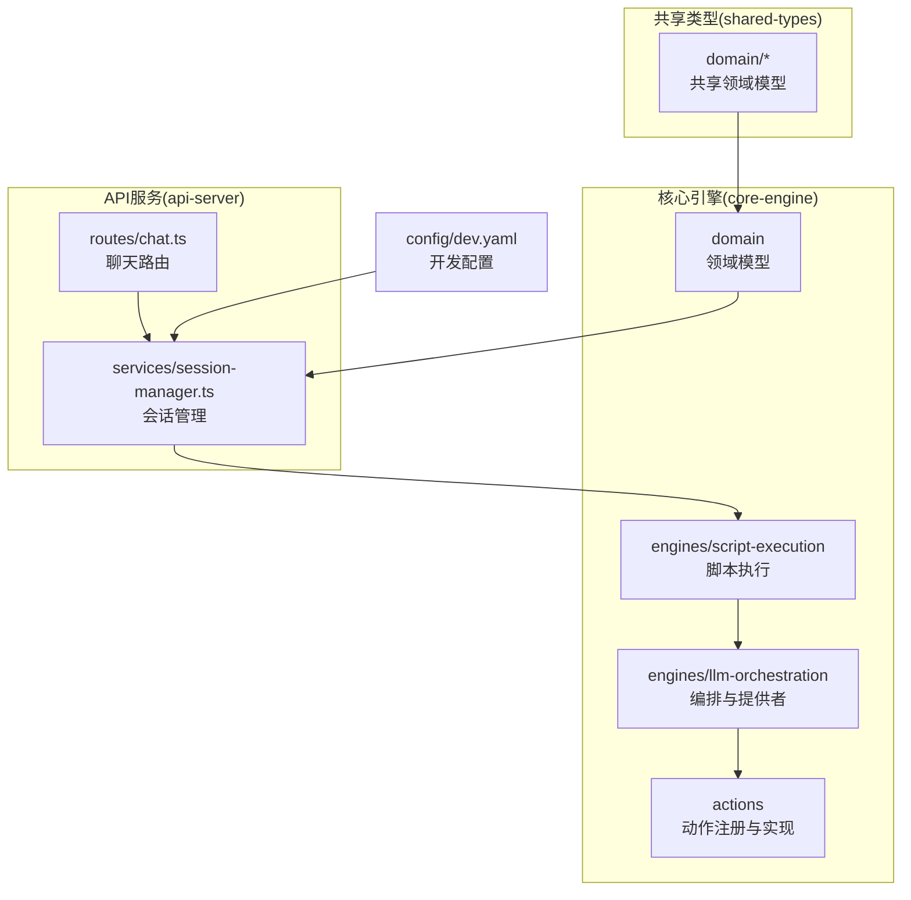
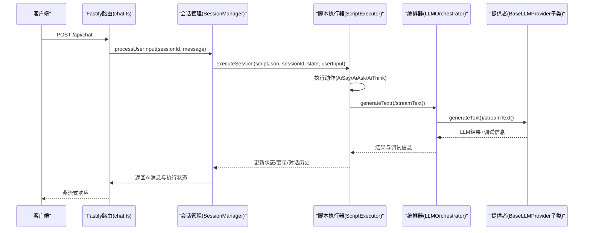
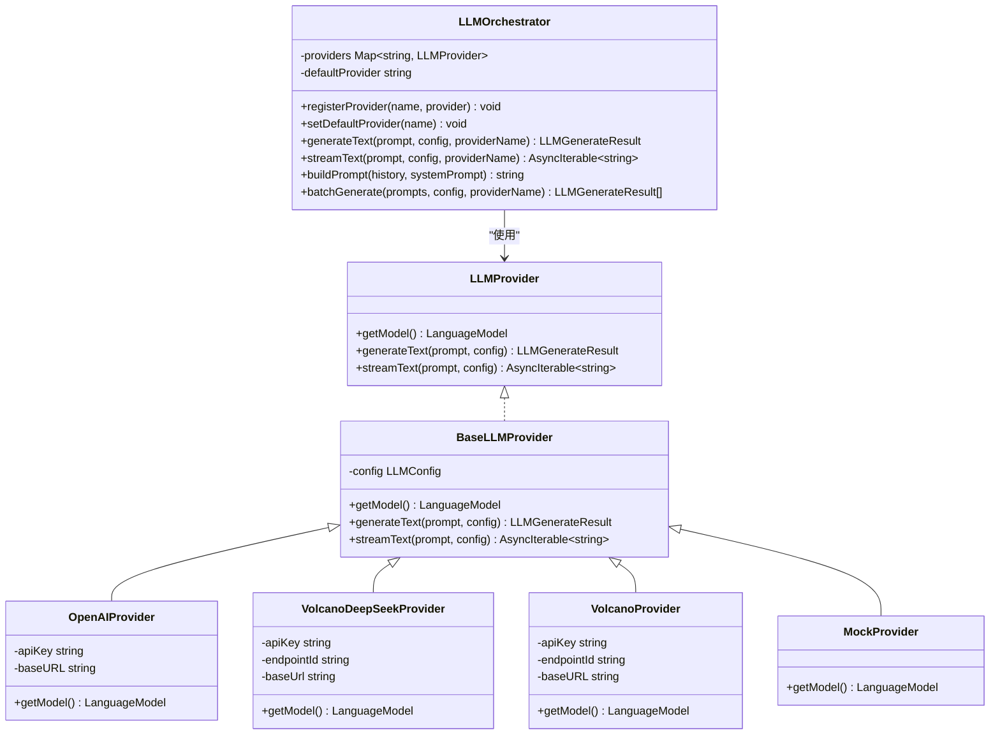
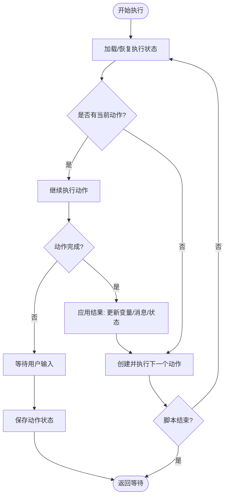
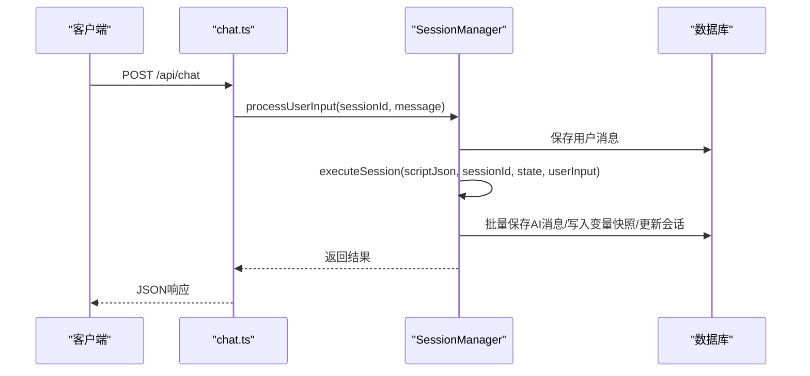
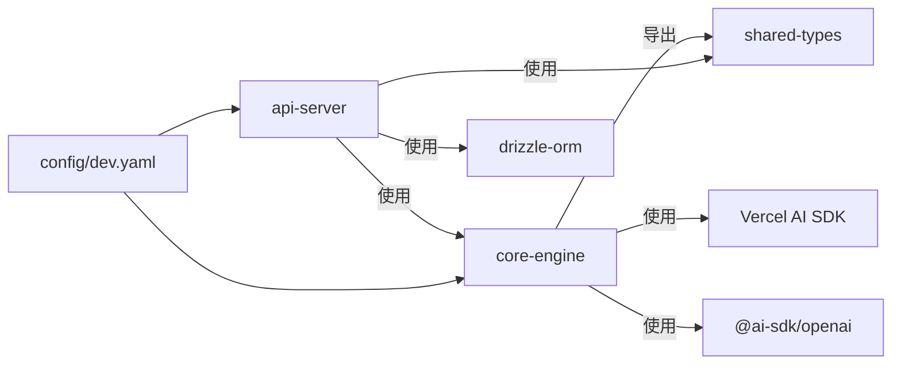

# LLM编排引擎扩展

<cite>
**本文引用的文件**
- [packages/core-engine/src/index.ts](file://packages/core-engine/src/index.ts)
- [packages/core-engine/src/engines/llm-orchestration/orchestrator.ts](file://packages/core-engine/src/engines/llm-orchestration/orchestrator.ts)
- [packages/core-engine/src/engines/llm-orchestration/providers.ts](file://packages/core-engine/src/engines/llm-orchestration/providers.ts)
- [packages/core-engine/src/engines/llm-orchestration/openai-provider.ts](file://packages/core-engine/src/engines/llm-orchestration/openai-provider.ts)
- [packages/core-engine/src/engines/llm-orchestration/volcano-provider.ts](file://packages/core-engine/src/engines/llm-orchestration/volcano-provider.ts)
- [packages/core-engine/src/engines/llm-orchestration/index.ts](file://packages/core-engine/src/engines/llm-orchestration/index.ts)
- [packages/core-engine/src/actions/ai-ask-action.ts](file://packages/core-engine/src/actions/ai-ask-action.ts)
- [packages/core-engine/src/actions/ai-say-action.ts](file://packages/core-engine/src/actions/ai-say-action.ts)
- [packages/core-engine/src/actions/ai-think-action.ts](file://packages/core-engine/src/actions/ai-think-action.ts)
- [packages/core-engine/src/actions/action-registry.ts](file://packages/core-engine/src/actions/action-registry.ts)
- [packages/core-engine/src/engines/script-execution/script-executor.ts](file://packages/core-engine/src/engines/script-execution/script-executor.ts)
- [packages/core-engine/src/domain/message.ts](file://packages/core-engine/src/domain/message.ts)
- [packages/core-engine/src/domain/session.ts](file://packages/core-engine/src/domain/session.ts)
- [packages/api-server/src/services/session-manager.ts](file://packages/api-server/src/services/session-manager.ts)
- [packages/api-server/src/routes/chat.ts](file://packages/api-server/src/routes/chat.ts)
- [config/dev.yaml](file://config/dev.yaml)
- [packages/shared-types/src/index.ts](file://packages/shared-types/src/index.ts)
</cite>

## 目录
1. [简介](#简介)
2. [项目结构](#项目结构)
3. [核心组件](#核心组件)
4. [架构总览](#架构总览)
5. [详细组件分析](#详细组件分析)
6. [依赖关系分析](#依赖关系分析)
7. [性能考虑](#性能考虑)
8. [故障排查指南](#故障排查指南)
9. [结论](#结论)
10. [附录](#附录)

## 简介
本指南面向希望在现有LLM编排引擎基础上进行扩展的开发者，涵盖以下主题：
- 新增AI服务提供商：接口定义、认证机制与调用协议实现
- 编排器扩展：多模型协调、负载均衡与故障转移策略
- 新的LLM调用模式：流式响应、批量请求与缓存策略
- 自定义提示工程模板与上下文管理机制
- 性能监控、成本控制与质量评估的扩展方案

## 项目结构
该项目采用多包工作区结构，核心引擎位于packages/core-engine，API服务位于packages/api-server，共享类型位于packages/shared-types。LLM编排引擎位于core-engine的engines/llm-orchestration目录，脚本执行引擎位于engines/script-execution。

图表来源
- [packages/core-engine/src/index.ts](file://packages/core-engine/src/index.ts#L1-L27)
- [packages/core-engine/src/engines/llm-orchestration/index.ts](file://packages/core-engine/src/engines/llm-orchestration/index.ts#L1-L10)
- [packages/api-server/src/routes/chat.ts](file://packages/api-server/src/routes/chat.ts#L1-L152)
- [packages/api-server/src/services/session-manager.ts](file://packages/api-server/src/services/session-manager.ts#L1-L466)
- [config/dev.yaml](file://config/dev.yaml#L1-L63)

章节来源
- [packages/core-engine/src/index.ts](file://packages/core-engine/src/index.ts#L1-L27)
- [packages/core-engine/src/engines/llm-orchestration/index.ts](file://packages/core-engine/src/engines/llm-orchestration/index.ts#L1-L10)
- [packages/api-server/src/routes/chat.ts](file://packages/api-server/src/routes/chat.ts#L1-L152)
- [packages/api-server/src/services/session-manager.ts](file://packages/api-server/src/services/session-manager.ts#L1-L466)
- [config/dev.yaml](file://config/dev.yaml#L1-L63)

## 核心组件
- LLM编排器：统一管理多个LLM提供者，支持非流式与流式调用、批量调用、滑动窗口上下文构建
- 提供者抽象：BaseLLMProvider封装通用配置与调用逻辑，具体提供者继承实现getModel
- 动作系统：AiSayAction、AiAskAction、AiThinkAction等，配合脚本执行引擎驱动对话流程
- 脚本执行器：解析YAML脚本，按阶段/话题/动作顺序执行，维护执行状态与对话历史
- 会话管理：API层对接数据库，持久化会话、消息与变量快照，驱动脚本执行

章节来源
- [packages/core-engine/src/engines/llm-orchestration/orchestrator.ts](file://packages/core-engine/src/engines/llm-orchestration/orchestrator.ts#L50-L161)
- [packages/core-engine/src/engines/llm-orchestration/providers.ts](file://packages/core-engine/src/engines/llm-orchestration/providers.ts#L1-L70)
- [packages/core-engine/src/actions/ai-say-action.ts](file://packages/core-engine/src/actions/ai-say-action.ts#L1-L105)
- [packages/core-engine/src/actions/ai-ask-action.ts](file://packages/core-engine/src/actions/ai-ask-action.ts#L1-L207)
- [packages/core-engine/src/actions/ai-think-action.ts](file://packages/core-engine/src/actions/ai-think-action.ts#L1-L57)
- [packages/core-engine/src/engines/script-execution/script-executor.ts](file://packages/core-engine/src/engines/script-execution/script-executor.ts#L62-L216)
- [packages/api-server/src/services/session-manager.ts](file://packages/api-server/src/services/session-manager.ts#L21-L26)

## 架构总览
下图展示了从API请求到脚本执行与LLM调用的整体流程。

图表来源
- [packages/api-server/src/routes/chat.ts](file://packages/api-server/src/routes/chat.ts#L16-L79)
- [packages/api-server/src/services/session-manager.ts](file://packages/api-server/src/services/session-manager.ts#L257-L441)
- [packages/core-engine/src/engines/script-execution/script-executor.ts](file://packages/core-engine/src/engines/script-execution/script-executor.ts#L66-L216)
- [packages/core-engine/src/engines/llm-orchestration/orchestrator.ts](file://packages/core-engine/src/engines/llm-orchestration/orchestrator.ts#L80-L99)
- [packages/core-engine/src/engines/llm-orchestration/providers.ts](file://packages/core-engine/src/engines/llm-orchestration/providers.ts#L10-L40)

## 详细组件分析

### LLM编排器与提供者体系
- 接口与抽象
  - LLMProvider定义getModel、generateText、streamText三要素
  - BaseLLMProvider统一处理配置合并、调用与调试信息封装
  - LLMOrchestrator负责提供者注册、默认提供者切换、批量调用与上下文构建
- 现有提供者
  - OpenAIProvider：基于@ai-sdk/openai，支持自定义baseURL
  - VolcanoDeepSeekProvider：通过OpenAI兼容接口对接火山Ark API
  - VolcanoProvider：兼容OpenAI格式的火山DeepSeek服务
  - MockProvider：用于测试的模拟实现
- 扩展建议
  - 新提供者需继承BaseLLMProvider，实现getModel返回LanguageModel
  - 支持认证：apiKey、endpointId、baseURL等参数注入
  - 支持流式与非流式两种调用模式，保持与LLMOrchestrator一致的签名

图表来源
- [packages/core-engine/src/engines/llm-orchestration/orchestrator.ts](file://packages/core-engine/src/engines/llm-orchestration/orchestrator.ts#L39-L43)
- [packages/core-engine/src/engines/llm-orchestration/orchestrator.ts](file://packages/core-engine/src/engines/llm-orchestration/orchestrator.ts#L166-L237)
- [packages/core-engine/src/engines/llm-orchestration/openai-provider.ts](file://packages/core-engine/src/engines/llm-orchestration/openai-provider.ts#L9-L27)
- [packages/core-engine/src/engines/llm-orchestration/volcano-provider.ts](file://packages/core-engine/src/engines/llm-orchestration/volcano-provider.ts#L11-L41)
- [packages/core-engine/src/engines/llm-orchestration/providers.ts](file://packages/core-engine/src/engines/llm-orchestration/providers.ts#L10-L70)

章节来源
- [packages/core-engine/src/engines/llm-orchestration/orchestrator.ts](file://packages/core-engine/src/engines/llm-orchestration/orchestrator.ts#L50-L161)
- [packages/core-engine/src/engines/llm-orchestration/openai-provider.ts](file://packages/core-engine/src/engines/llm-orchestration/openai-provider.ts#L1-L28)
- [packages/core-engine/src/engines/llm-orchestration/volcano-provider.ts](file://packages/core-engine/src/engines/llm-orchestration/volcano-provider.ts#L1-L42)
- [packages/core-engine/src/engines/llm-orchestration/providers.ts](file://packages/core-engine/src/engines/llm-orchestration/providers.ts#L1-L70)

### 动作系统与脚本执行
- 动作类型
  - AiSayAction：向用户传达信息，可配置是否需要确认
  - AiAskAction：向用户提问并提取答案，支持多轮验证与重试
  - AiThinkAction：占位实现，后续可接入LLM进行推理
- 执行流程
  - ScriptExecutor按阶段/话题/动作顺序执行，维护ExecutionState
  - 动作执行结果可携带AI消息、提取变量与元数据
  - 对话历史在执行过程中累积，便于上下文构建

图表来源
- [packages/core-engine/src/engines/script-execution/script-executor.ts](file://packages/core-engine/src/engines/script-execution/script-executor.ts#L66-L216)
- [packages/core-engine/src/actions/ai-say-action.ts](file://packages/core-engine/src/actions/ai-say-action.ts#L19-L104)
- [packages/core-engine/src/actions/ai-ask-action.ts](file://packages/core-engine/src/actions/ai-ask-action.ts#L27-L167)

章节来源
- [packages/core-engine/src/actions/ai-say-action.ts](file://packages/core-engine/src/actions/ai-say-action.ts#L1-L105)
- [packages/core-engine/src/actions/ai-ask-action.ts](file://packages/core-engine/src/actions/ai-ask-action.ts#L1-L207)
- [packages/core-engine/src/actions/ai-think-action.ts](file://packages/core-engine/src/actions/ai-think-action.ts#L1-L57)
- [packages/core-engine/src/engines/script-execution/script-executor.ts](file://packages/core-engine/src/engines/script-execution/script-executor.ts#L62-L216)

### API层与会话管理
- 路由
  - /api/chat：非流式消息发送
  - /api/chat/stream：SSE流式响应（当前为模拟）
- 会话管理
  - SessionManager负责初始化会话、处理用户输入、持久化消息与变量快照
  - 将脚本执行状态映射为API响应，包含会话状态、执行状态、变量与调试信息

图表来源
- [packages/api-server/src/routes/chat.ts](file://packages/api-server/src/routes/chat.ts#L16-L79)
- [packages/api-server/src/services/session-manager.ts](file://packages/api-server/src/services/session-manager.ts#L257-L441)

章节来源
- [packages/api-server/src/routes/chat.ts](file://packages/api-server/src/routes/chat.ts#L1-L152)
- [packages/api-server/src/services/session-manager.ts](file://packages/api-server/src/services/session-manager.ts#L1-L466)

### 上下文管理与提示工程
- 上下文构建
  - LLMOrchestrator.buildPrompt支持系统提示与滑动窗口策略，仅保留最近N条消息
  - ScriptExecutor维护conversationHistory，便于动作间共享上下文
- 提示模板
  - AiSayAction与AiAskAction均支持prompt_template/content_template等多模板字段
  - 可在配置中指定变量替换与校验规则，实现灵活的提示工程

章节来源
- [packages/core-engine/src/engines/llm-orchestration/orchestrator.ts](file://packages/core-engine/src/engines/llm-orchestration/orchestrator.ts#L104-L134)
- [packages/core-engine/src/engines/script-execution/script-executor.ts](file://packages/core-engine/src/engines/script-execution/script-executor.ts#L42-L57)
- [packages/core-engine/src/actions/ai-say-action.ts](file://packages/core-engine/src/actions/ai-say-action.ts#L21-L28)
- [packages/core-engine/src/actions/ai-ask-action.ts](file://packages/core-engine/src/actions/ai-ask-action.ts#L29-L37)

## 依赖关系分析
- 包导出
  - core-engine导出领域模型、引擎与动作，供api-server与shared-types使用
- 外部依赖
  - Vercel AI SDK用于统一的LLM调用接口（generateText/streamText）
  - @ai-sdk/openai用于OpenAI兼容接口
  - drizzle-orm用于数据库访问
- 配置
  - dev.yaml集中管理LLM提供者、超时、重试与缓存开关

图表来源
- [packages/core-engine/src/index.ts](file://packages/core-engine/src/index.ts#L7-L27)
- [packages/shared-types/src/index.ts](file://packages/shared-types/src/index.ts#L7-L19)
- [packages/api-server/src/services/session-manager.ts](file://packages/api-server/src/services/session-manager.ts#L7-L16)
- [config/dev.yaml](file://config/dev.yaml#L17-L31)

章节来源
- [packages/core-engine/src/index.ts](file://packages/core-engine/src/index.ts#L1-L27)
- [packages/shared-types/src/index.ts](file://packages/shared-types/src/index.ts#L1-L19)
- [packages/api-server/src/services/session-manager.ts](file://packages/api-server/src/services/session-manager.ts#L1-L466)
- [config/dev.yaml](file://config/dev.yaml#L1-L63)

## 性能考虑
- 批量调用
  - LLMOrchestrator.batchGenerate支持并行调用，适合多提示并发场景
- 流式响应
  - BaseLLMProvider.streamText直接透传底层流式接口，降低首字节延迟
- 上下文裁剪
  - 滑动窗口减少上下文长度，控制token与延迟
- 缓存策略
  - 可在应用层引入键控缓存（如相同提示+配置命中），避免重复调用
- 超时与重试
  - dev.yaml提供timeout与max_retries配置，结合网络层超时策略提升稳定性

章节来源
- [packages/core-engine/src/engines/llm-orchestration/orchestrator.ts](file://packages/core-engine/src/engines/llm-orchestration/orchestrator.ts#L153-L160)
- [packages/core-engine/src/engines/llm-orchestration/orchestrator.ts](file://packages/core-engine/src/engines/llm-orchestration/orchestrator.ts#L219-L236)
- [config/dev.yaml](file://config/dev.yaml#L23-L24)

## 故障排查指南
- 常见错误
  - Provider未找到：检查LLMOrchestrator.registerProvider与setDefaultProvider调用
  - 动作类型未知：检查action-registry中的ACTION_REGISTRY是否包含对应类型
  - 会话/脚本不存在：API层会返回404，确认数据库中是否存在对应记录
- 调试信息
  - LLM调用包含完整调试信息（prompt、response、model、config、timestamp、tokensUsed）
  - ScriptExecutor与SessionManager均输出详细日志，便于定位问题
- 错误处理
  - SessionManager将错误转换为DetailedApiError并返回，避免异常泄露

章节来源
- [packages/core-engine/src/engines/llm-orchestration/orchestrator.ts](file://packages/core-engine/src/engines/llm-orchestration/orchestrator.ts#L70-L75)
- [packages/core-engine/src/actions/action-registry.ts](file://packages/core-engine/src/actions/action-registry.ts#L35-L45)
- [packages/api-server/src/routes/chat.ts](file://packages/api-server/src/routes/chat.ts#L56-L60)
- [packages/api-server/src/services/session-manager.ts](file://packages/api-server/src/services/session-manager.ts#L241-L254)

## 结论
本指南提供了在现有LLM编排引擎上进行扩展的系统性方法，包括提供者接入、编排器扩展、调用模式与上下文管理的最佳实践。通过遵循统一接口与现有实现模式，可快速集成新的AI服务提供商并保证系统的稳定性与可观测性。

## 附录

### 新增AI服务提供商步骤
- 继承BaseLLMProvider并实现getModel
- 在LLMOrchestrator中注册提供者并设置默认提供者
- 在配置中新增对应提供者参数（如apiKey、baseURL、endpointId）
- 如需流式支持，确保底层SDK支持streamText

章节来源
- [packages/core-engine/src/engines/llm-orchestration/orchestrator.ts](file://packages/core-engine/src/engines/llm-orchestration/orchestrator.ts#L63-L75)
- [packages/core-engine/src/engines/llm-orchestration/providers.ts](file://packages/core-engine/src/engines/llm-orchestration/providers.ts#L10-L40)
- [config/dev.yaml](file://config/dev.yaml#L17-L31)

### 编排器扩展：多模型协调、负载均衡与故障转移
- 多模型协调
  - 通过LLMOrchestrator.registerProvider注册多个提供者，按需选择providerName
- 负载均衡
  - 在应用层实现轮询或权重策略，动态选择提供者
- 故障转移
  - 在调用失败时回退至备用提供者，结合超时与重试策略

章节来源
- [packages/core-engine/src/engines/llm-orchestration/orchestrator.ts](file://packages/core-engine/src/engines/llm-orchestration/orchestrator.ts#L63-L75)
- [config/dev.yaml](file://config/dev.yaml#L23-L24)

### 新的LLM调用模式
- 流式响应
  - 使用streamText接口，逐块产出文本
- 批量请求
  - 使用batchGenerate并行处理多个提示
- 缓存策略
  - 基于提示内容与配置生成唯一键，命中则直接返回

章节来源
- [packages/core-engine/src/engines/llm-orchestration/orchestrator.ts](file://packages/core-engine/src/engines/llm-orchestration/orchestrator.ts#L92-L99)
- [packages/core-engine/src/engines/llm-orchestration/orchestrator.ts](file://packages/core-engine/src/engines/llm-orchestration/orchestrator.ts#L153-L160)

### 自定义提示工程模板与上下文管理
- 模板字段
  - 支持prompt_template、content_template、question_template等多字段回退
- 上下文管理
  - 使用buildPrompt与conversationHistory实现滑动窗口与系统提示

章节来源
- [packages/core-engine/src/actions/ai-say-action.ts](file://packages/core-engine/src/actions/ai-say-action.ts#L21-L28)
- [packages/core-engine/src/actions/ai-ask-action.ts](file://packages/core-engine/src/actions/ai-ask-action.ts#L30-L37)
- [packages/core-engine/src/engines/llm-orchestration/orchestrator.ts](file://packages/core-engine/src/engines/llm-orchestration/orchestrator.ts#L104-L134)
- [packages/core-engine/src/engines/script-execution/script-executor.ts](file://packages/core-engine/src/engines/script-execution/script-executor.ts#L42-L57)

### 性能监控、成本控制与质量评估
- 性能监控
  - 利用LLM调试信息中的tokensUsed与timestamp进行延迟与成本统计
- 成本控制
  - 基于tokensUsed与模型单价计算成本，结合缓存降低调用频次
- 质量评估
  - 通过LLM调试信息中的finishReason与原始响应进行质量分析

章节来源
- [packages/core-engine/src/engines/llm-orchestration/orchestrator.ts](file://packages/core-engine/src/engines/llm-orchestration/orchestrator.ts#L198-L211)