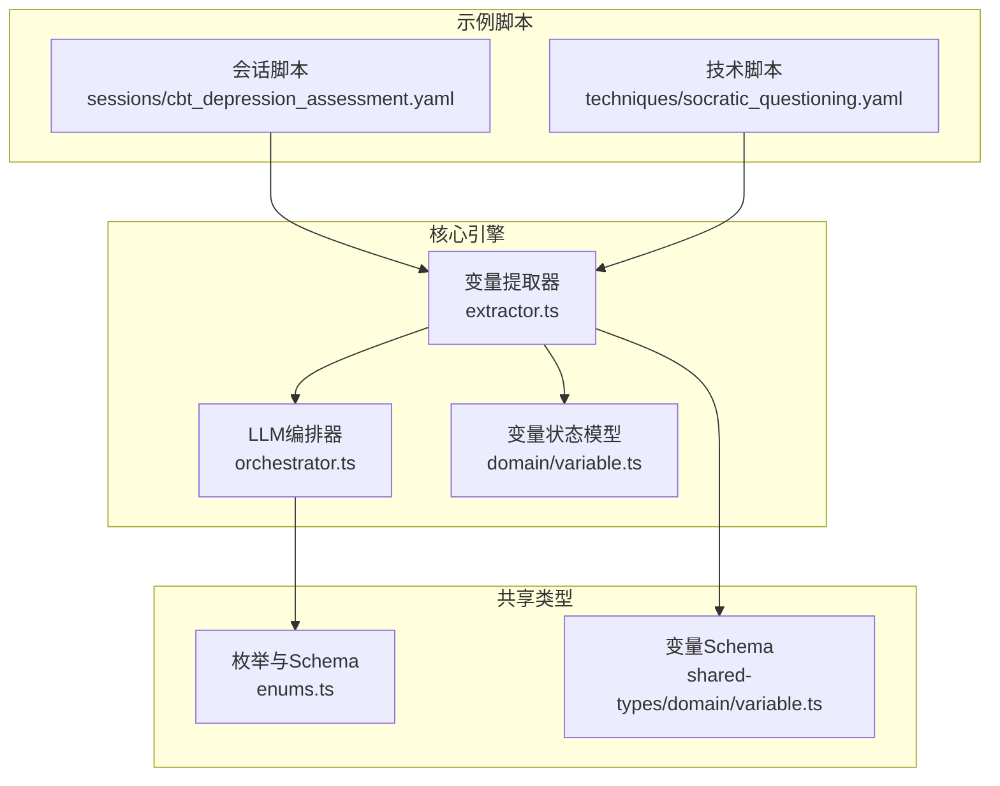
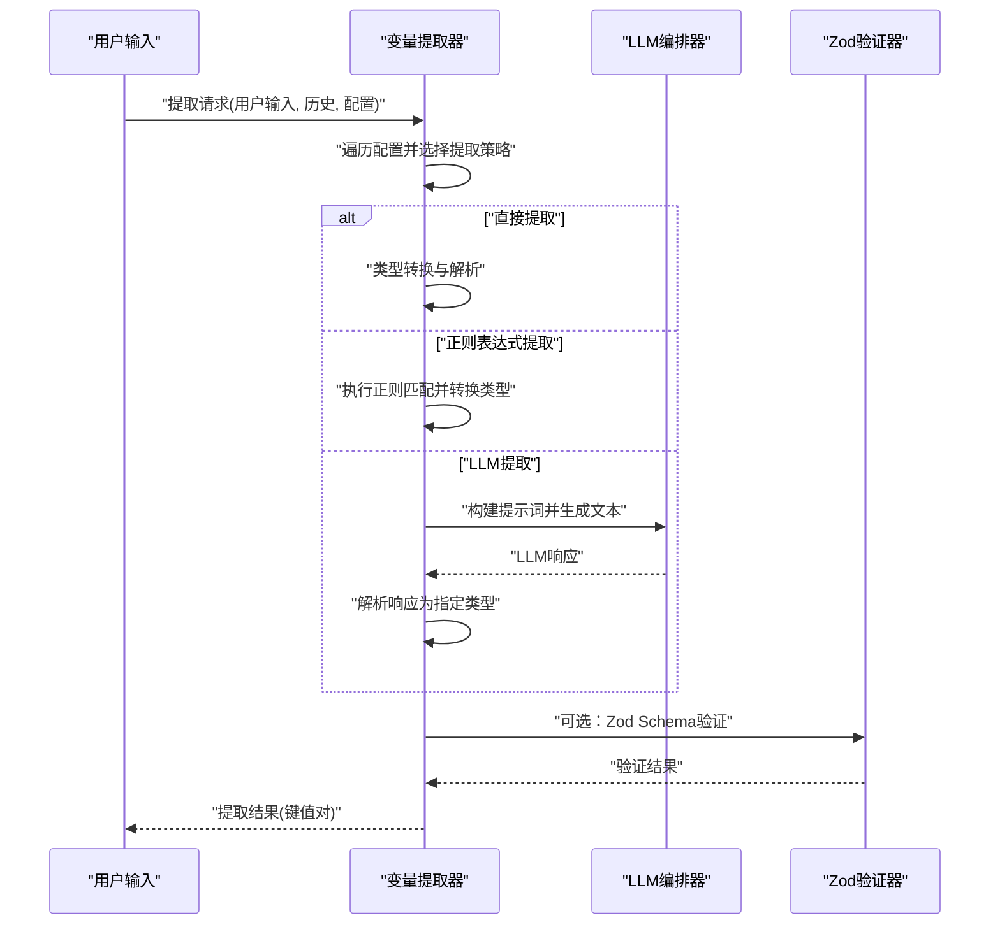
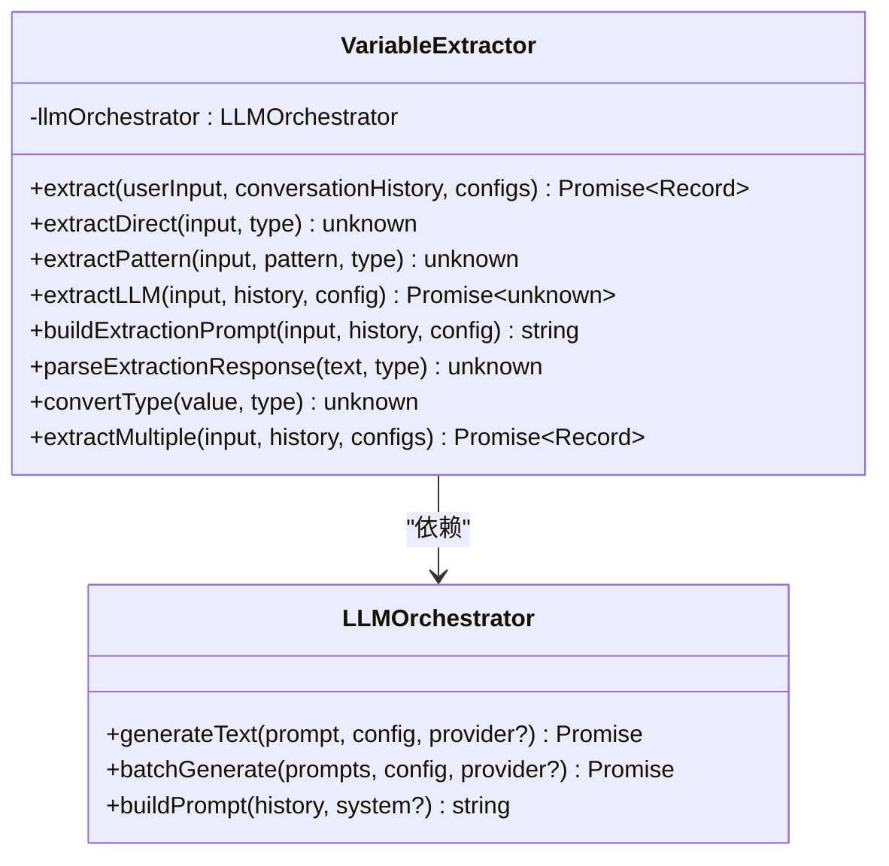
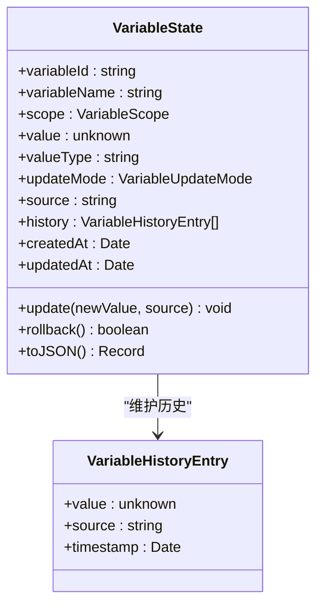
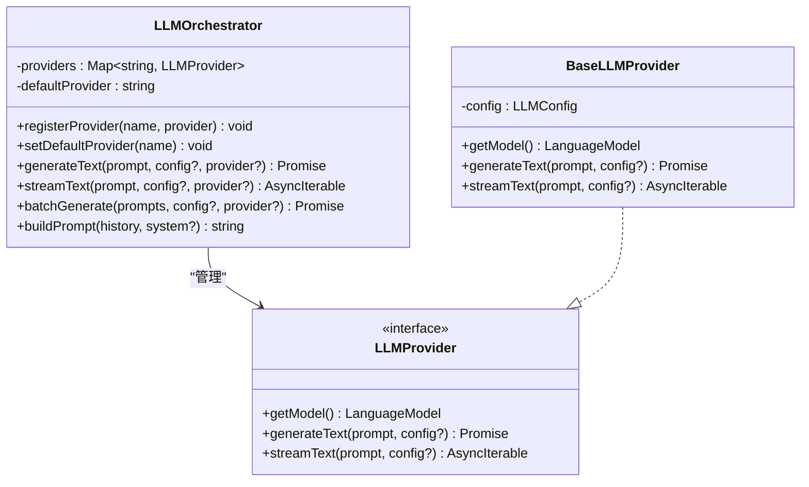
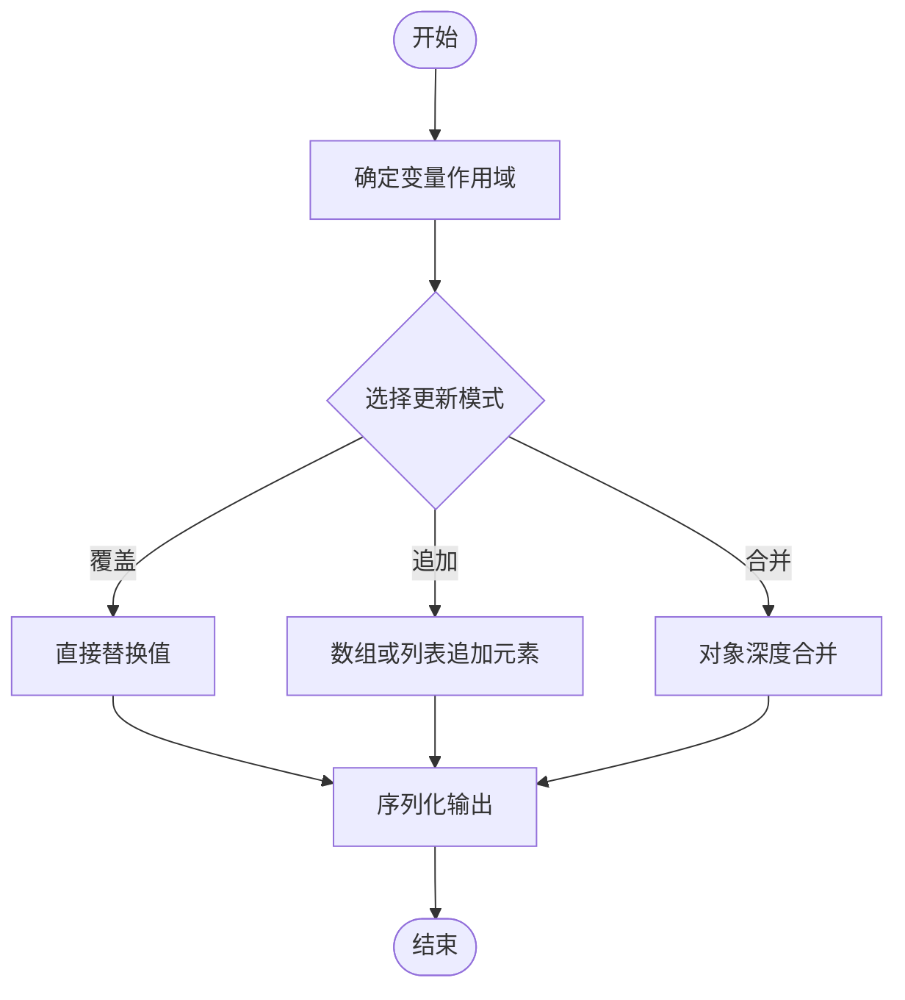
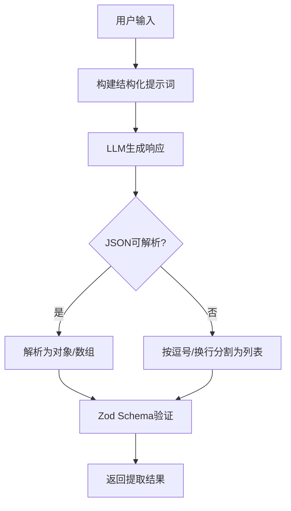
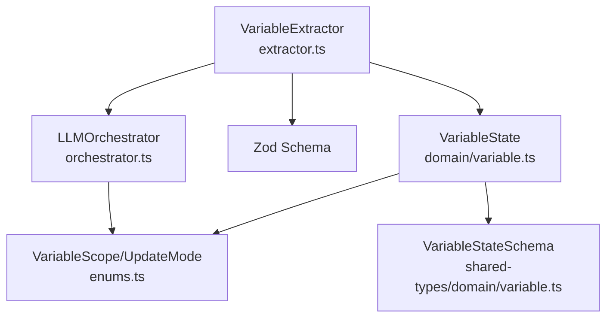

# 变量提取引擎扩展

<cite>
**本文档引用的文件**
- [packages/core-engine/src/index.ts](file://packages/core-engine/src/index.ts)
- [packages/core-engine/src/domain/variable.ts](file://packages/core-engine/src/domain/variable.ts)
- [packages/core-engine/src/engines/variable-extraction/index.ts](file://packages/core-engine/src/engines/variable-extraction/index.ts)
- [packages/core-engine/src/engines/variable-extraction/extractor.ts](file://packages/core-engine/src/engines/variable-extraction/extractor.ts)
- [packages/shared-types/src/domain/variable.ts](file://packages/shared-types/src/domain/variable.ts)
- [packages/shared-types/src/enums.ts](file://packages/shared-types/src/enums.ts)
- [packages/core-engine/src/engines/llm-orchestration/orchestrator.ts](file://packages/core-engine/src/engines/llm-orchestration/orchestrator.ts)
- [scripts/sessions/cbt_depression_assessment.yaml](file://scripts/sessions/cbt_depression_assessment.yaml)
- [scripts/techniques/socratic_questioning.yaml](file://scripts/techniques/socratic_questioning.yaml)
- [packages/api-server/temp-script.yaml](file://packages/api-server/temp-script.yaml)
</cite>

## 目录
1. [简介](#简介)
2. [项目结构](#项目结构)
3. [核心组件](#核心组件)
4. [架构总览](#架构总览)
5. [详细组件分析](#详细组件分析)
6. [依赖分析](#依赖分析)
7. [性能考虑](#性能考虑)
8. [故障排除指南](#故障排除指南)
9. [结论](#结论)
10. [附录](#附录)

## 简介
本指南面向希望扩展变量提取引擎的开发者，涵盖以下主题：
- 如何扩展变量提取策略：新增提取算法、正则表达式模式与机器学习模型集成
- 变量作用域管理扩展：全局、会话、阶段、话题级变量的处理机制
- 自定义变量类型的实现：数据类型定义、验证规则与序列化机制
- 复杂提取场景：嵌套结构、条件提取与动态变量生成
- 性能优化策略与准确性评估方法

## 项目结构
变量提取引擎位于核心引擎包中，采用模块化设计，主要由以下部分组成：
- 领域模型：变量状态与历史记录
- 引擎层：变量提取器与LLM编排器
- 共享类型：变量作用域与更新模式的枚举与Schema
- 示例脚本：展示变量提取在实际会话与技术脚本中的应用

**图表来源**
- [packages/core-engine/src/engines/variable-extraction/extractor.ts](file://packages/core-engine/src/engines/variable-extraction/extractor.ts#L25-L316)
- [packages/core-engine/src/engines/llm-orchestration/orchestrator.ts](file://packages/core-engine/src/engines/llm-orchestration/orchestrator.ts#L50-L161)
- [packages/core-engine/src/domain/variable.ts](file://packages/core-engine/src/domain/variable.ts#L15-L119)
- [packages/shared-types/src/enums.ts](file://packages/shared-types/src/enums.ts#L52-L68)
- [packages/shared-types/src/domain/variable.ts](file://packages/shared-types/src/domain/variable.ts#L47-L58)
- [scripts/sessions/cbt_depression_assessment.yaml](file://scripts/sessions/cbt_depression_assessment.yaml#L47-L86)
- [scripts/techniques/socratic_questioning.yaml](file://scripts/techniques/socratic_questioning.yaml#L47-L77)

**章节来源**
- [packages/core-engine/src/index.ts](file://packages/core-engine/src/index.ts#L7-L26)
- [packages/core-engine/src/engines/variable-extraction/index.ts](file://packages/core-engine/src/engines/variable-extraction/index.ts#L1-L11)

## 核心组件
- 变量提取器：支持直接提取、正则表达式提取与LLM智能提取，并可结合Zod Schema进行验证
- 变量状态模型：封装变量的值、类型、作用域、更新模式、来源与历史记录
- LLM编排器：统一管理LLM提供者，支持批量调用与对话历史构建
- 共享类型：定义变量作用域（全局、会话、阶段、话题）与更新模式（覆盖、追加、合并）

关键职责与交互：
- 变量提取器根据配置选择提取策略，必要时调用LLM编排器
- 变量状态模型负责值的更新、回滚与序列化
- LLM编排器提供稳定的文本生成能力与调试信息

**章节来源**
- [packages/core-engine/src/engines/variable-extraction/extractor.ts](file://packages/core-engine/src/engines/variable-extraction/extractor.ts#L8-L77)
- [packages/core-engine/src/domain/variable.ts](file://packages/core-engine/src/domain/variable.ts#L15-L119)
- [packages/core-engine/src/engines/llm-orchestration/orchestrator.ts](file://packages/core-engine/src/engines/llm-orchestration/orchestrator.ts#L50-L161)
- [packages/shared-types/src/enums.ts](file://packages/shared-types/src/enums.ts#L52-L68)

## 架构总览
变量提取引擎的整体架构如下：

**图表来源**
- [packages/core-engine/src/engines/variable-extraction/extractor.ts](file://packages/core-engine/src/engines/variable-extraction/extractor.ts#L35-L77)
- [packages/core-engine/src/engines/variable-extraction/extractor.ts](file://packages/core-engine/src/engines/variable-extraction/extractor.ts#L152-L176)
- [packages/core-engine/src/engines/llm-orchestration/orchestrator.ts](file://packages/core-engine/src/engines/llm-orchestration/orchestrator.ts#L80-L87)

## 详细组件分析

### 变量提取器（VariableExtractor）
职责与特性：
- 支持三种提取策略：direct、pattern、llm
- 对提取结果进行类型转换与Zod验证
- 提供批量提取与分组执行能力
- 可选：与LLM编排器集成以实现智能提取

扩展点与实现模式：
- 新增提取算法：在提取方法分支中添加新策略，并在类型转换与验证处适配
- 正则表达式模式：通过配置中的pattern字段传入，内部构建正则并执行匹配
- LLM模型集成：通过构造函数注入LLM编排器，在LLM分支中调用其生成接口

**图表来源**
- [packages/core-engine/src/engines/variable-extraction/extractor.ts](file://packages/core-engine/src/engines/variable-extraction/extractor.ts#L25-L316)
- [packages/core-engine/src/engines/llm-orchestration/orchestrator.ts](file://packages/core-engine/src/engines/llm-orchestration/orchestrator.ts#L50-L161)

**章节来源**
- [packages/core-engine/src/engines/variable-extraction/extractor.ts](file://packages/core-engine/src/engines/variable-extraction/extractor.ts#L8-L77)
- [packages/core-engine/src/engines/variable-extraction/extractor.ts](file://packages/core-engine/src/engines/variable-extraction/extractor.ts#L288-L315)

### 变量状态模型（VariableState）
职责与特性：
- 封装变量的标识、名称、作用域、值、类型、更新模式、来源与历史
- 提供值更新、回滚与JSON序列化能力
- 支持多种更新模式：覆盖、追加、合并

**图表来源**
- [packages/core-engine/src/domain/variable.ts](file://packages/core-engine/src/domain/variable.ts#L15-L119)
- [packages/shared-types/src/domain/variable.ts](file://packages/shared-types/src/domain/variable.ts#L27-L58)

**章节来源**
- [packages/core-engine/src/domain/variable.ts](file://packages/core-engine/src/domain/variable.ts#L15-L119)
- [packages/shared-types/src/domain/variable.ts](file://packages/shared-types/src/domain/variable.ts#L13-L58)

### LLM编排器（LLMOrchestrator）
职责与特性：
- 统一管理多个LLM提供者，支持注册、切换与默认提供者设置
- 提供文本生成与流式生成接口
- 支持批量调用与对话历史滑动窗口处理
- 生成调试信息（提示词、模型、配置、Token用量等）

**图表来源**
- [packages/core-engine/src/engines/llm-orchestration/orchestrator.ts](file://packages/core-engine/src/engines/llm-orchestration/orchestrator.ts#L50-L237)

**章节来源**
- [packages/core-engine/src/engines/llm-orchestration/orchestrator.ts](file://packages/core-engine/src/engines/llm-orchestration/orchestrator.ts#L50-L161)

### 变量作用域与更新模式
- 作用域：全局（global）、会话（session）、阶段（phase）、话题（topic）
- 更新模式：覆盖（overwrite）、追加（append）、合并（merge）
- 通过共享类型中的枚举与Schema进行约束与验证

**图表来源**
- [packages/shared-types/src/enums.ts](file://packages/shared-types/src/enums.ts#L52-L68)
- [packages/core-engine/src/domain/variable.ts](file://packages/core-engine/src/domain/variable.ts#L63-L81)

**章节来源**
- [packages/shared-types/src/enums.ts](file://packages/shared-types/src/enums.ts#L52-L68)
- [packages/shared-types/src/domain/variable.ts](file://packages/shared-types/src/domain/variable.ts#L47-L58)

### 自定义变量类型与验证
- 类型定义：text、number、boolean、list、object
- 验证规则：通过Zod Schema进行强类型校验
- 序列化机制：变量状态模型提供toJSON方法，便于持久化与传输

扩展建议：
- 新增类型：在配置类型与类型转换逻辑中添加新类型分支
- 验证规则：为新类型定义对应的Zod Schema
- 序列化：确保toJSON包含新字段并在下游系统中兼容

**章节来源**
- [packages/core-engine/src/engines/variable-extraction/extractor.ts](file://packages/core-engine/src/engines/variable-extraction/extractor.ts#L8-L15)
- [packages/core-engine/src/engines/variable-extraction/extractor.ts](file://packages/core-engine/src/engines/variable-extraction/extractor.ts#L268-L285)
- [packages/core-engine/src/domain/variable.ts](file://packages/core-engine/src/domain/variable.ts#L105-L118)

### 复杂提取场景实现

#### 嵌套结构提取
- 使用LLM提取器构建结构化提示词，要求模型返回JSON格式
- 在解析阶段尝试JSON.parse，失败时回退为字符串分割
- 结合Zod Schema对嵌套对象进行严格验证

**图表来源**
- [packages/core-engine/src/engines/variable-extraction/extractor.ts](file://packages/core-engine/src/engines/variable-extraction/extractor.ts#L181-L212)
- [packages/core-engine/src/engines/variable-extraction/extractor.ts](file://packages/core-engine/src/engines/variable-extraction/extractor.ts#L240-L263)

#### 条件提取
- 在脚本配置中为变量设置target_variable与extraction_prompt
- 根据不同话题与阶段动态选择不同的提取策略与正则模式
- 使用conversationHistory增强上下文理解，提升提取准确性

**章节来源**
- [scripts/sessions/cbt_depression_assessment.yaml](file://scripts/sessions/cbt_depression_assessment.yaml#L47-L86)
- [scripts/techniques/socratic_questioning.yaml](file://scripts/techniques/socratic_questioning.yaml#L47-L77)
- [packages/api-server/temp-script.yaml](file://packages/api-server/temp-script.yaml#L24-L26)

#### 动态变量生成
- 在AI思考动作中，基于已提取变量生成新的输出变量
- 通过模板字符串拼接变量，形成动态提示词与内容
- 结合作用域控制变量生命周期与可见范围

**章节来源**
- [scripts/sessions/cbt_depression_assessment.yaml](file://scripts/sessions/cbt_depression_assessment.yaml#L88-L102)
- [scripts/techniques/socratic_questioning.yaml](file://scripts/techniques/socratic_questioning.yaml#L80-L97)

## 依赖分析
变量提取引擎的关键依赖关系如下：

**图表来源**
- [packages/core-engine/src/engines/variable-extraction/extractor.ts](file://packages/core-engine/src/engines/variable-extraction/extractor.ts#L1-L3)
- [packages/core-engine/src/engines/llm-orchestration/orchestrator.ts](file://packages/core-engine/src/engines/llm-orchestration/orchestrator.ts#L1-L3)
- [packages/core-engine/src/domain/variable.ts](file://packages/core-engine/src/domain/variable.ts#L1-L1)
- [packages/shared-types/src/enums.ts](file://packages/shared-types/src/enums.ts#L52-L68)
- [packages/shared-types/src/domain/variable.ts](file://packages/shared-types/src/domain/variable.ts#L47-L58)

**章节来源**
- [packages/core-engine/src/engines/variable-extraction/index.ts](file://packages/core-engine/src/engines/variable-extraction/index.ts#L1-L11)
- [packages/core-engine/src/index.ts](file://packages/core-engine/src/index.ts#L15-L16)

## 性能考虑
- 并行与分组执行：将LLM提取与其他提取策略分离，优先执行非LLM快速路径，再批量执行LLM提取
- 对话历史优化：限制最近N条消息参与提示词构建，减少Token消耗
- 缓存与重试：对LLM响应进行缓存，避免重复调用；对解析失败的响应进行重试或降级处理
- 类型转换与验证：尽量在早期阶段进行类型转换，减少后续处理成本

**章节来源**
- [packages/core-engine/src/engines/variable-extraction/extractor.ts](file://packages/core-engine/src/engines/variable-extraction/extractor.ts#L295-L315)
- [packages/core-engine/src/engines/llm-orchestration/orchestrator.ts](file://packages/core-engine/src/engines/llm-orchestration/orchestrator.ts#L128-L134)

## 故障排除指南
常见问题与解决方法：
- LLM提取失败：检查编排器是否正确初始化，确认提示词构建逻辑与模型配置
- 正则表达式匹配失败：验证pattern语法，确保捕获组正确，提供默认值或降级策略
- Zod验证失败：检查schema定义与期望类型，提供更宽松的schema或自定义解析器
- 变量更新异常：确认作用域与更新模式配置，检查历史记录是否正确回滚

**章节来源**
- [packages/core-engine/src/engines/variable-extraction/extractor.ts](file://packages/core-engine/src/engines/variable-extraction/extractor.ts#L143-L146)
- [packages/core-engine/src/engines/variable-extraction/extractor.ts](file://packages/core-engine/src/engines/variable-extraction/extractor.ts#L172-L175)
- [packages/core-engine/src/domain/variable.ts](file://packages/core-engine/src/domain/variable.ts#L90-L100)

## 结论
变量提取引擎提供了灵活的扩展点，支持多种提取策略与验证机制。通过合理利用作用域与更新模式、完善Zod Schema与序列化机制，以及优化LLM集成与性能策略，可以稳定地支持复杂提取场景并保证准确性。

## 附录
- 示例脚本展示了变量提取在实际会话与技术脚本中的应用，可作为扩展实现的参考模板
- 共享类型定义了变量作用域与更新模式的枚举与Schema，确保跨模块一致性

**章节来源**
- [scripts/sessions/cbt_depression_assessment.yaml](file://scripts/sessions/cbt_depression_assessment.yaml#L47-L86)
- [scripts/techniques/socratic_questioning.yaml](file://scripts/techniques/socratic_questioning.yaml#L47-L77)
- [packages/shared-types/src/enums.ts](file://packages/shared-types/src/enums.ts#L52-L68)