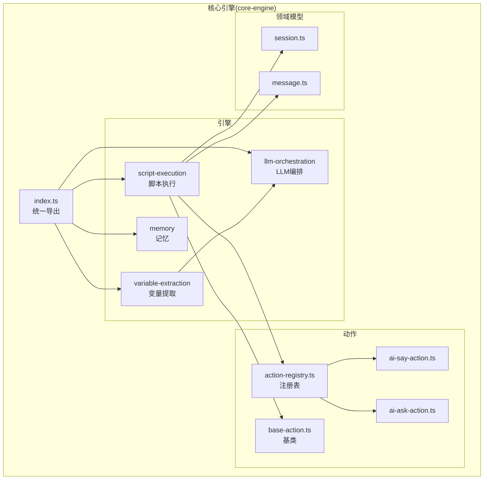
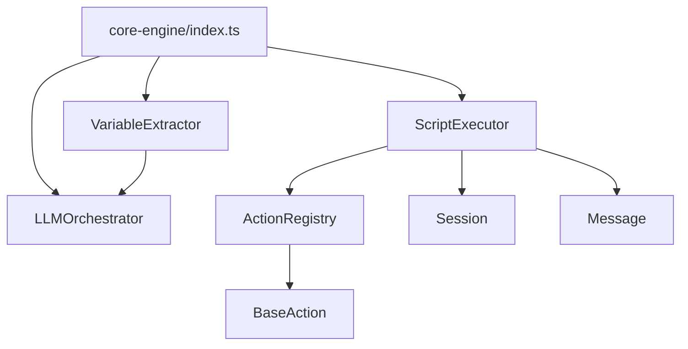
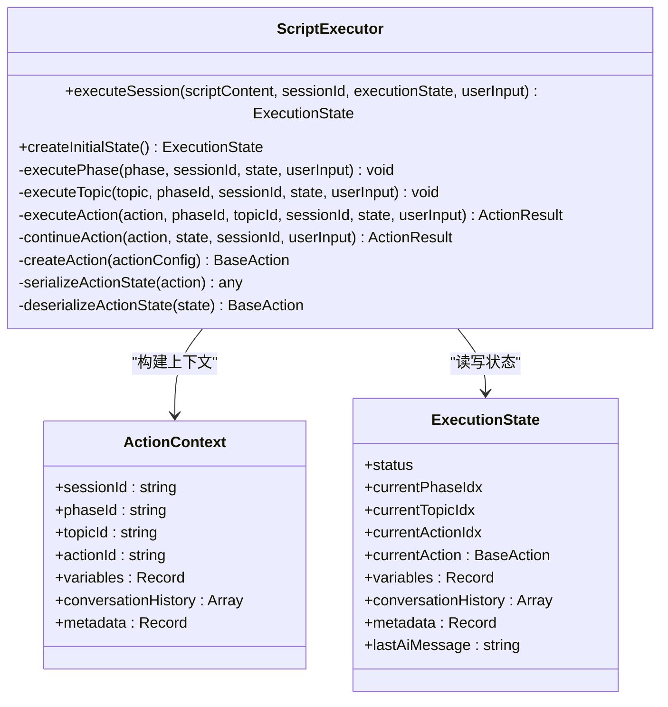
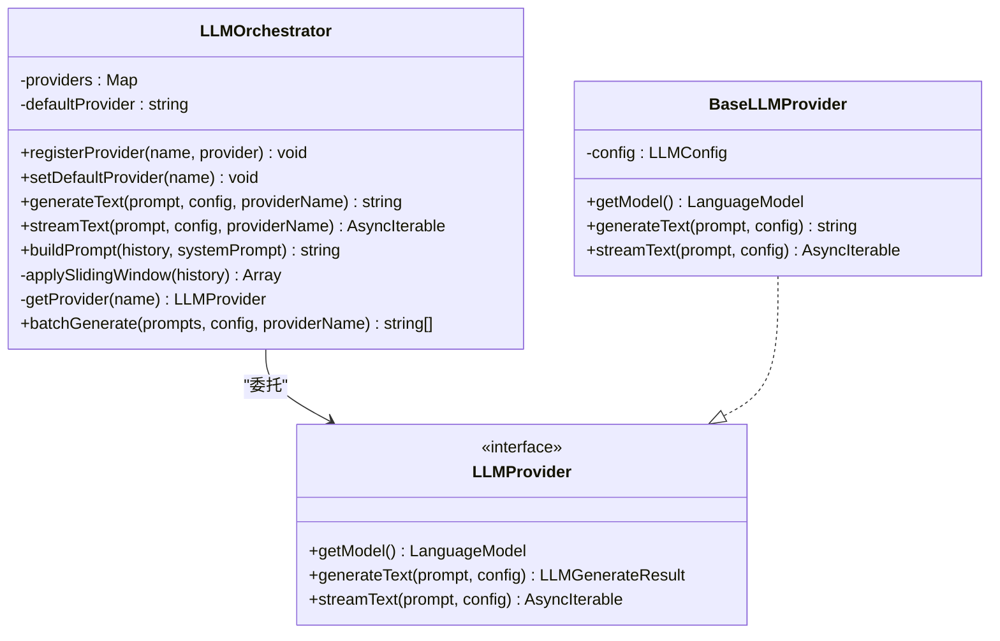
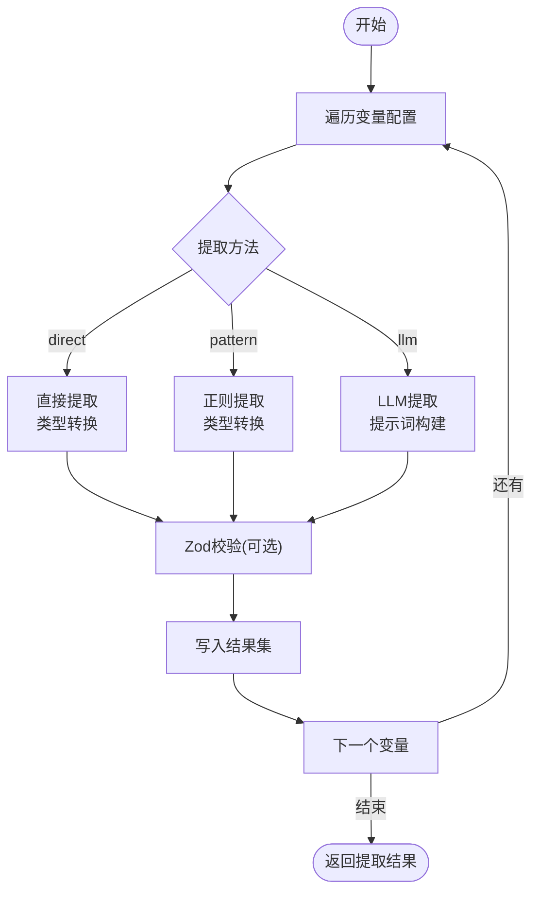
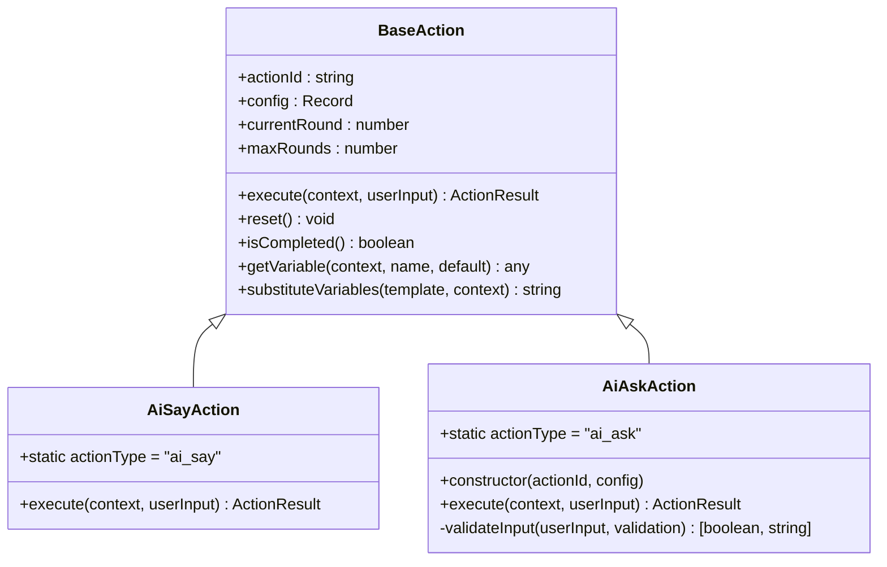
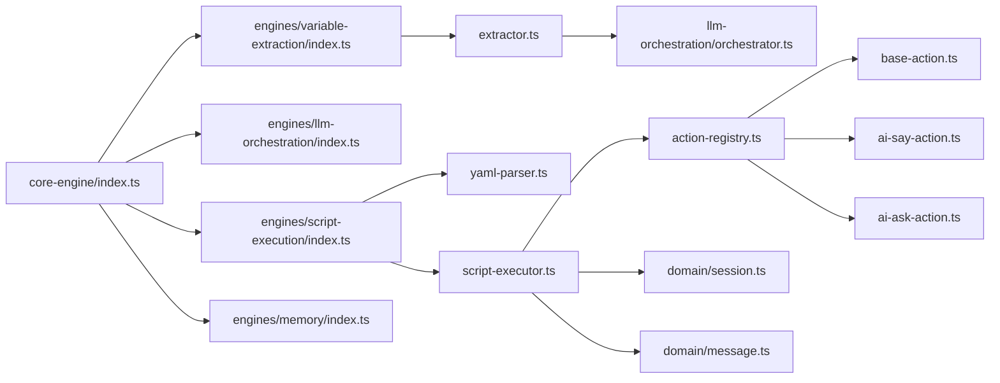

# 引擎扩展

<cite>
**本文引用的文件**
- [packages/core-engine/src/index.ts](file://packages/core-engine/src/index.ts)
- [packages/core-engine/src/engines/script-execution/index.ts](file://packages/core-engine/src/engines/script-execution/index.ts)
- [packages/core-engine/src/engines/script-execution/script-executor.ts](file://packages/core-engine/src/engines/script-execution/script-executor.ts)
- [packages/core-engine/src/engines/script-execution/yaml-parser.ts](file://packages/core-engine/src/engines/script-execution/yaml-parser.ts)
- [packages/core-engine/src/engines/llm-orchestration/index.ts](file://packages/core-engine/src/engines/llm-orchestration/index.ts)
- [packages/core-engine/src/engines/llm-orchestration/orchestrator.ts](file://packages/core-engine/src/engines/llm-orchestration/orchestrator.ts)
- [packages/core-engine/src/engines/variable-extraction/index.ts](file://packages/core-engine/src/engines/variable-extraction/index.ts)
- [packages/core-engine/src/engines/variable-extraction/extractor.ts](file://packages/core-engine/src/engines/variable-extraction/extractor.ts)
- [packages/core-engine/src/engines/memory/index.ts](file://packages/core-engine/src/engines/memory/index.ts)
- [packages/core-engine/src/actions/action-registry.ts](file://packages/core-engine/src/actions/action-registry.ts)
- [packages/core-engine/src/actions/base-action.ts](file://packages/core-engine/src/actions/base-action.ts)
- [packages/core-engine/src/actions/ai-say-action.ts](file://packages/core-engine/src/actions/ai-say-action.ts)
- [packages/core-engine/src/actions/ai-ask-action.ts](file://packages/core-engine/src/actions/ai-ask-action.ts)
- [packages/core-engine/src/domain/session.ts](file://packages/core-engine/src/domain/session.ts)
- [packages/core-engine/src/domain/message.ts](file://packages/core-engine/src/domain/message.ts)
</cite>

## 目录
1. [引言](#引言)
2. [项目结构](#项目结构)
3. [核心组件](#核心组件)
4. [架构总览](#架构总览)
5. [详细组件分析](#详细组件分析)
6. [依赖关系分析](#依赖关系分析)
7. [性能考虑](#性能考虑)
8. [故障排查指南](#故障排查指南)
9. [结论](#结论)
10. [附录](#附录)

## 引言
本指南面向希望在 HeartRule AI 咨询引擎中扩展“六大引擎”的开发者，系统阐述脚本执行引擎、LLM 编排引擎、变量提取引擎、记忆引擎等的架构设计与扩展机制，并提供新增引擎的目录结构、入口导出规范、引擎间协作模式、配置扩展与参数校验、测试策略与性能优化建议。文档以代码为依据，配合图示帮助不同背景的读者理解与落地。

## 项目结构
核心引擎位于 packages/core-engine，采用按“引擎/功能”分层组织：
- engines：六大引擎实现与对外导出
- actions：动作体系与注册表
- domain：会话、消息、脚本、变量等领域模型
- index.ts：统一导出入口，控制可见性与兼容性

图表来源
- [packages/core-engine/src/index.ts](file://packages/core-engine/src/index.ts#L1-L27)
- [packages/core-engine/src/engines/script-execution/index.ts](file://packages/core-engine/src/engines/script-execution/index.ts#L1-L11)
- [packages/core-engine/src/engines/llm-orchestration/index.ts](file://packages/core-engine/src/engines/llm-orchestration/index.ts#L1-L11)
- [packages/core-engine/src/engines/variable-extraction/index.ts](file://packages/core-engine/src/engines/variable-extraction/index.ts#L1-L12)
- [packages/core-engine/src/engines/memory/index.ts](file://packages/core-engine/src/engines/memory/index.ts#L1-L26)
- [packages/core-engine/src/actions/action-registry.ts](file://packages/core-engine/src/actions/action-registry.ts#L1-L46)
- [packages/core-engine/src/actions/base-action.ts](file://packages/core-engine/src/actions/base-action.ts#L1-L96)
- [packages/core-engine/src/actions/ai-say-action.ts](file://packages/core-engine/src/actions/ai-say-action.ts#L1-L105)
- [packages/core-engine/src/actions/ai-ask-action.ts](file://packages/core-engine/src/actions/ai-ask-action.ts#L1-L207)
- [packages/core-engine/src/domain/session.ts](file://packages/core-engine/src/domain/session.ts#L1-L137)
- [packages/core-engine/src/domain/message.ts](file://packages/core-engine/src/domain/message.ts#L1-L49)

章节来源
- [packages/core-engine/src/index.ts](file://packages/core-engine/src/index.ts#L1-L27)

## 核心组件
- 脚本执行引擎：负责解析 YAML 脚本、驱动动作序列、维护执行状态与会话进度。
- LLM 编排引擎：统一管理多提供者、构建提示词、批量调用与流式输出。
- 变量提取引擎：支持直取、正则与 LLM 三种提取路径，并可结合 Zod 校验。
- 记忆引擎：预留短期/中期/长期记忆能力，当前为占位实现。
- 动作体系：通过注册表动态创建动作实例，动作基类统一多轮交互与变量替换。
- 领域模型：会话、消息等持久化与状态管理的基础。

章节来源
- [packages/core-engine/src/engines/script-execution/script-executor.ts](file://packages/core-engine/src/engines/script-execution/script-executor.ts#L1-L511)
- [packages/core-engine/src/engines/llm-orchestration/orchestrator.ts](file://packages/core-engine/src/engines/llm-orchestration/orchestrator.ts#L1-L218)
- [packages/core-engine/src/engines/variable-extraction/extractor.ts](file://packages/core-engine/src/engines/variable-extraction/extractor.ts#L1-L317)
- [packages/core-engine/src/engines/memory/index.ts](file://packages/core-engine/src/engines/memory/index.ts#L1-L26)
- [packages/core-engine/src/actions/action-registry.ts](file://packages/core-engine/src/actions/action-registry.ts#L1-L46)
- [packages/core-engine/src/actions/base-action.ts](file://packages/core-engine/src/actions/base-action.ts#L1-L96)
- [packages/core-engine/src/domain/session.ts](file://packages/core-engine/src/domain/session.ts#L1-L137)
- [packages/core-engine/src/domain/message.ts](file://packages/core-engine/src/domain/message.ts#L1-L49)

## 架构总览
六大引擎通过统一导出入口暴露能力，动作由注册表创建并注入上下文执行，LLM 编排为变量提取提供可选能力，脚本执行引擎贯穿会话生命周期，领域模型承载状态与元数据。

图表来源
- [packages/core-engine/src/index.ts](file://packages/core-engine/src/index.ts#L1-L27)
- [packages/core-engine/src/engines/script-execution/script-executor.ts](file://packages/core-engine/src/engines/script-execution/script-executor.ts#L1-L511)
- [packages/core-engine/src/engines/variable-extraction/extractor.ts](file://packages/core-engine/src/engines/variable-extraction/extractor.ts#L1-L317)
- [packages/core-engine/src/engines/llm-orchestration/orchestrator.ts](file://packages/core-engine/src/engines/llm-orchestration/orchestrator.ts#L1-L218)
- [packages/core-engine/src/actions/action-registry.ts](file://packages/core-engine/src/actions/action-registry.ts#L1-L46)
- [packages/core-engine/src/actions/base-action.ts](file://packages/core-engine/src/actions/base-action.ts#L1-L96)
- [packages/core-engine/src/domain/session.ts](file://packages/core-engine/src/domain/session.ts#L1-L137)
- [packages/core-engine/src/domain/message.ts](file://packages/core-engine/src/domain/message.ts#L1-L49)

## 详细组件分析

### 脚本执行引擎（Script Execution Engine）
职责与流程
- 解析 YAML 脚本，按 Phase → Topic → Action 顺序执行。
- 维护 ExecutionState：状态、索引、变量、对话历史、元数据、当前 Action。
- 动作多轮交互：支持等待用户输入、恢复 Action 内部状态、记录对话与变量。
- 错误处理：捕获异常并标记错误状态与错误信息。

图表来源
- [packages/core-engine/src/engines/script-execution/script-executor.ts](file://packages/core-engine/src/engines/script-execution/script-executor.ts#L1-L511)
- [packages/core-engine/src/actions/base-action.ts](file://packages/core-engine/src/actions/base-action.ts#L1-L96)

章节来源
- [packages/core-engine/src/engines/script-execution/script-executor.ts](file://packages/core-engine/src/engines/script-execution/script-executor.ts#L1-L511)
- [packages/core-engine/src/engines/script-execution/yaml-parser.ts](file://packages/core-engine/src/engines/script-execution/yaml-parser.ts#L1-L96)

扩展要点
- 新增动作：在动作注册表中注册新类型，实现 BaseAction 子类，遵循多轮交互与变量替换约定。
- 新增执行器：在 index.ts 中导出新执行器并更新统一入口。
- 状态持久化：利用 ExecutionState.metadata.actionState 持久化 Action 内部状态。

### LLM 编排引擎（LLM Orchestration Engine）
职责与特性
- 统一管理多个 LLM 提供者，支持默认提供者切换与批量调用。
- 构建提示词：支持系统提示与滑动窗口对话历史。
- 流式与非流式输出：封装 generateText/streamText。
- 可扩展：通过注册提供者扩展新模型。

图表来源
- [packages/core-engine/src/engines/llm-orchestration/orchestrator.ts](file://packages/core-engine/src/engines/llm-orchestration/orchestrator.ts#L1-L218)

章节来源
- [packages/core-engine/src/engines/llm-orchestration/orchestrator.ts](file://packages/core-engine/src/engines/llm-orchestration/orchestrator.ts#L1-L218)
- [packages/core-engine/src/engines/llm-orchestration/index.ts](file://packages/core-engine/src/engines/llm-orchestration/index.ts#L1-L11)

扩展要点
- 新增提供者：实现 LLMProvider 接口或继承 BaseLLMProvider，注册到 Orchestrator。
- 配置扩展：在 LLMConfig 中增加参数键并在 BaseLLMProvider 合并配置。
- 调试信息：通过 LLMDebugInfo 输出 prompt/response/model/tokens 等。

### 变量提取引擎（Variable Extraction Engine）
职责与策略
- 支持 direct/pattern/llm 三种提取方法。
- 结合 Zod Schema 进行强类型校验。
- 对 LLM 提取进行提示词构建与响应解析。
- 批量提取：区分 LLM 与非 LLM 配置，分别处理以提升效率。

图表来源
- [packages/core-engine/src/engines/variable-extraction/extractor.ts](file://packages/core-engine/src/engines/variable-extraction/extractor.ts#L1-L317)

章节来源
- [packages/core-engine/src/engines/variable-extraction/extractor.ts](file://packages/core-engine/src/engines/variable-extraction/extractor.ts#L1-L317)
- [packages/core-engine/src/engines/variable-extraction/index.ts](file://packages/core-engine/src/engines/variable-extraction/index.ts#L1-L12)

扩展要点
- 新增提取方法：在 switch 中新增分支并实现对应逻辑。
- 新增类型校验：在 VariableConfig 中提供 schema 或在提取后统一校验。
- LLM 提示词：参考 buildExtractionPrompt 的结构扩展上下文与约束。

### 记忆引擎（Memory Engine）
现状与规划
- 当前为占位实现，预留短期（Redis）、中期（PostgreSQL）、长期（向量检索）能力。
- 接口 MemoryEngine 提供 store/retrieve 两个方法。

章节来源
- [packages/core-engine/src/engines/memory/index.ts](file://packages/core-engine/src/engines/memory/index.ts#L1-L26)

扩展要点
- 实现存储与检索：根据需求选择持久化方案并实现接口。
- 重要性评分：结合业务场景引入 importance 字段用于排序与过滤。

### 动作体系（Actions）
动作注册与执行
- 注册表：集中管理 actionType 与构造函数映射。
- 基类：统一多轮交互、变量替换、状态判断与重置。
- 典型动作：AiSayAction（可选确认）、AiAskAction（带校验与多轮）。

图表来源
- [packages/core-engine/src/actions/base-action.ts](file://packages/core-engine/src/actions/base-action.ts#L1-L96)
- [packages/core-engine/src/actions/ai-say-action.ts](file://packages/core-engine/src/actions/ai-say-action.ts#L1-L105)
- [packages/core-engine/src/actions/ai-ask-action.ts](file://packages/core-engine/src/actions/ai-ask-action.ts#L1-L207)
- [packages/core-engine/src/actions/action-registry.ts](file://packages/core-engine/src/actions/action-registry.ts#L1-L46)

章节来源
- [packages/core-engine/src/actions/action-registry.ts](file://packages/core-engine/src/actions/action-registry.ts#L1-L46)
- [packages/core-engine/src/actions/base-action.ts](file://packages/core-engine/src/actions/base-action.ts#L1-L96)
- [packages/core-engine/src/actions/ai-say-action.ts](file://packages/core-engine/src/actions/ai-say-action.ts#L1-L105)
- [packages/core-engine/src/actions/ai-ask-action.ts](file://packages/core-engine/src/actions/ai-ask-action.ts#L1-L207)

扩展要点
- 新增动作：定义静态 actionType，实现 execute 并在注册表中注册。
- 多轮交互：合理设置 maxRounds，利用 currentRound 控制流程。
- 上下文使用：通过 ActionContext 访问 variables/conversationHistory/metadata。

### 领域模型（Domain）
会话与消息
- Session：会话生命周期、执行状态、位置、变量、元数据与时间戳。
- Message：消息角色、内容、动作关联与元数据。

章节来源
- [packages/core-engine/src/domain/session.ts](file://packages/core-engine/src/domain/session.ts#L1-L137)
- [packages/core-engine/src/domain/message.ts](file://packages/core-engine/src/domain/message.ts#L1-L49)

## 依赖关系分析
- 统一导出：core-engine/index.ts 控制对外暴露，隐藏旧版兼容项。
- 引擎耦合：脚本执行依赖动作注册表与领域模型；变量提取可选依赖 LLM 编排；记忆引擎为可插拔。
- 外部依赖：ai SDK、js-yaml、zod、uuid 等。

图表来源
- [packages/core-engine/src/index.ts](file://packages/core-engine/src/index.ts#L1-L27)
- [packages/core-engine/src/engines/script-execution/index.ts](file://packages/core-engine/src/engines/script-execution/index.ts#L1-L11)
- [packages/core-engine/src/engines/llm-orchestration/index.ts](file://packages/core-engine/src/engines/llm-orchestration/index.ts#L1-L11)
- [packages/core-engine/src/engines/variable-extraction/index.ts](file://packages/core-engine/src/engines/variable-extraction/index.ts#L1-L12)
- [packages/core-engine/src/engines/memory/index.ts](file://packages/core-engine/src/engines/memory/index.ts#L1-L26)
- [packages/core-engine/src/engines/script-execution/script-executor.ts](file://packages/core-engine/src/engines/script-execution/script-executor.ts#L1-L511)
- [packages/core-engine/src/engines/script-execution/yaml-parser.ts](file://packages/core-engine/src/engines/script-execution/yaml-parser.ts#L1-L96)
- [packages/core-engine/src/engines/llm-orchestration/orchestrator.ts](file://packages/core-engine/src/engines/llm-orchestration/orchestrator.ts#L1-L218)
- [packages/core-engine/src/engines/variable-extraction/extractor.ts](file://packages/core-engine/src/engines/variable-extraction/extractor.ts#L1-L317)
- [packages/core-engine/src/actions/action-registry.ts](file://packages/core-engine/src/actions/action-registry.ts#L1-L46)
- [packages/core-engine/src/actions/base-action.ts](file://packages/core-engine/src/actions/base-action.ts#L1-L96)
- [packages/core-engine/src/actions/ai-say-action.ts](file://packages/core-engine/src/actions/ai-say-action.ts#L1-L105)
- [packages/core-engine/src/actions/ai-ask-action.ts](file://packages/core-engine/src/actions/ai-ask-action.ts#L1-L207)
- [packages/core-engine/src/domain/session.ts](file://packages/core-engine/src/domain/session.ts#L1-L137)
- [packages/core-engine/src/domain/message.ts](file://packages/core-engine/src/domain/message.ts#L1-L49)

## 性能考虑
- LLM 调用
  - 批量调用：使用 Orchestrator.batchGenerate 并行请求，减少总延迟。
  - 滑动窗口：限制对话历史长度，降低 token 消耗与延迟。
  - 流式输出：在前端实时渲染，改善用户体验。
- 变量提取
  - 非 LLM 提取优先：先处理 direct/pattern，再批量 LLM 提取，减少模型调用次数。
  - Zod 校验：尽量在提取后一次性校验，避免重复解析。
- 脚本执行
  - 状态持久化：仅在必要时序列化 Action 内部状态，避免频繁深拷贝。
  - 对话历史：按需记录，避免冗余消息影响性能。
- 记忆引擎
  - 短期：使用内存或 Redis，注意过期与淘汰策略。
  - 长期：向量检索需评估索引与查询成本。

## 故障排查指南
- 脚本执行
  - 状态异常：检查 ExecutionStatus 与 ExecutionPosition，定位卡住的 Action。
  - Action 恢复：确认 metadata.actionState 是否正确序列化/反序列化。
  - 错误传播：查看 ExecutionState.metadata.error 并回溯 Action 抛错点。
- LLM 编排
  - 提供者缺失：setDefaultProvider/registerProvider 后再调用。
  - 配置合并：确认 BaseLLMProvider 合并逻辑是否覆盖预期字段。
  - 调试信息：通过 LLMDebugInfo 定位 prompt 与响应问题。
- 变量提取
  - 提取失败：检查提取方法与正则表达式，确认 Zod 校验是否严格。
  - LLM 提示词：核对 buildExtractionPrompt 的上下文与约束。
- 动作执行
  - 多轮超限：检查 maxRounds 与 currentRound，避免死循环。
  - 变量替换：确认 substituteVariables 占位符与上下文变量一致。

章节来源
- [packages/core-engine/src/engines/script-execution/script-executor.ts](file://packages/core-engine/src/engines/script-execution/script-executor.ts#L1-L511)
- [packages/core-engine/src/engines/llm-orchestration/orchestrator.ts](file://packages/core-engine/src/engines/llm-orchestration/orchestrator.ts#L1-L218)
- [packages/core-engine/src/engines/variable-extraction/extractor.ts](file://packages/core-engine/src/engines/variable-extraction/extractor.ts#L1-L317)
- [packages/core-engine/src/actions/base-action.ts](file://packages/core-engine/src/actions/base-action.ts#L1-L96)

## 结论
通过清晰的引擎边界、动作注册表与统一导出机制，HeartRule 的核心引擎具备良好的可扩展性。新增引擎应遵循：
- 目录与导出：在 engines 下新建子目录，完善 index.ts 导出。
- 配置与校验：在对应模块内定义配置接口与 Zod 校验。
- 协作与状态：遵循 ExecutionState/ActionContext 规范，正确传递与持久化状态。
- 测试与性能：提供单元/集成测试，关注 LLM 调用与变量提取的性能瓶颈。

## 附录

### 如何添加新的引擎功能
- 目录结构
  - 在 packages/core-engine/src/engines 下新增子目录，例如 my-engine。
  - 在该目录下创建 index.ts，统一导出核心类与类型。
- 入口文件配置
  - 在 core-engine/src/index.ts 中添加导出语句，保持对外 API 稳定。
- 模块导出规范
  - 优先导出公共接口与工厂方法，隐藏实现细节。
  - 为可选依赖（如 LLM）提供可选构造参数与降级策略。

章节来源
- [packages/core-engine/src/index.ts](file://packages/core-engine/src/index.ts#L1-L27)
- [packages/core-engine/src/engines/script-execution/index.ts](file://packages/core-engine/src/engines/script-execution/index.ts#L1-L11)
- [packages/core-engine/src/engines/llm-orchestration/index.ts](file://packages/core-engine/src/engines/llm-orchestration/index.ts#L1-L11)
- [packages/core-engine/src/engines/variable-extraction/index.ts](file://packages/core-engine/src/engines/variable-extraction/index.ts#L1-L12)
- [packages/core-engine/src/engines/memory/index.ts](file://packages/core-engine/src/engines/memory/index.ts#L1-L26)

### 引擎间协作模式
- 数据传递
  - 脚本执行引擎通过 ActionContext 传递 variables、conversationHistory、metadata。
  - 变量提取引擎将提取结果合并到 ExecutionState.variables。
- 状态管理
  - ExecutionState.status 与 ExecutionPosition 作为全局状态。
  - Action 内部状态通过 serialize/deserialize 持久化到 metadata.actionState。
- 错误传播
  - Action 返回 ActionResult.error，脚本执行引擎捕获并设置 ExecutionStatus.ERROR 与 metadata.error。

章节来源
- [packages/core-engine/src/engines/script-execution/script-executor.ts](file://packages/core-engine/src/engines/script-execution/script-executor.ts#L1-L511)
- [packages/core-engine/src/actions/base-action.ts](file://packages/core-engine/src/actions/base-action.ts#L1-L96)

### 引擎配置扩展方式
- LLM 编排
  - 在 LLMConfig 中新增字段，BaseLLMProvider 合并配置。
  - 在 LLMProvider 实现中读取新字段并传入底层 SDK。
- 变量提取
  - 在 VariableConfig 中新增字段（如 extractionMethod 的扩展），在 extractor.ts 中处理。
  - 通过 Zod schema 增强类型安全。
- 脚本执行
  - 在 YAMLParser 中扩展 validateSessionScript/validateTechniqueScript，确保脚本合法性。
- 记忆引擎
  - 在 MemoryEngine 接口中新增方法签名，按阶段实现短期/中期/长期策略。

章节来源
- [packages/core-engine/src/engines/llm-orchestration/orchestrator.ts](file://packages/core-engine/src/engines/llm-orchestration/orchestrator.ts#L1-L218)
- [packages/core-engine/src/engines/variable-extraction/extractor.ts](file://packages/core-engine/src/engines/variable-extraction/extractor.ts#L1-L317)
- [packages/core-engine/src/engines/script-execution/yaml-parser.ts](file://packages/core-engine/src/engines/script-execution/yaml-parser.ts#L1-L96)
- [packages/core-engine/src/engines/memory/index.ts](file://packages/core-engine/src/engines/memory/index.ts#L1-L26)

### 引擎测试策略与最佳实践
- 单元测试
  - 动作：模拟 ActionContext，断言 ActionResult 的 success/completed/aiMessage/extractedVariables/error。
  - LLM 编排：mock 提供者，断言 generateText/streamText 调用与参数合并。
  - 变量提取：构造不同输入与配置，验证 direct/pattern/llm 与 Zod 校验。
- 集成测试
  - 脚本执行：构造最小 YAML，逐步验证 Phase/Topic/Action 的执行顺序与状态迁移。
  - 引擎协作：验证变量在动作间传递、对话历史累积与错误冒泡。
- 性能测试
  - LLM 批量：对比串行与并行调用的吞吐与延迟。
  - 变量提取：对比不同提取方法的准确率与耗时。
- 最佳实践
  - 保持无副作用：动作内部只通过上下文读取与修改变量。
  - 明确错误边界：在动作层抛出可诊断的错误信息。
  - 可观测性：在关键路径输出调试信息，便于定位问题。