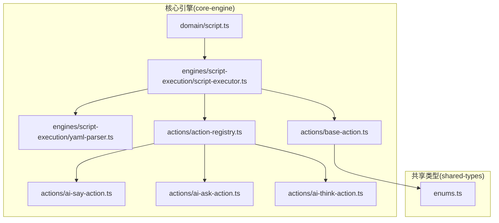
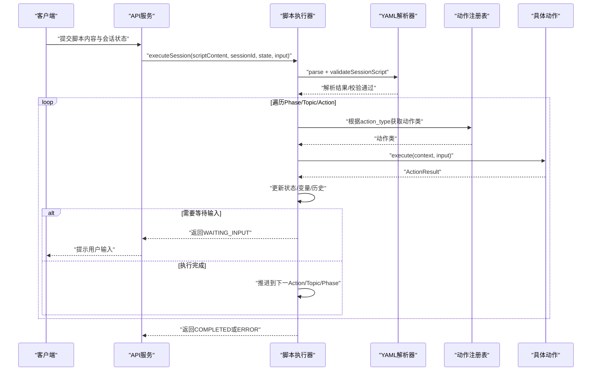
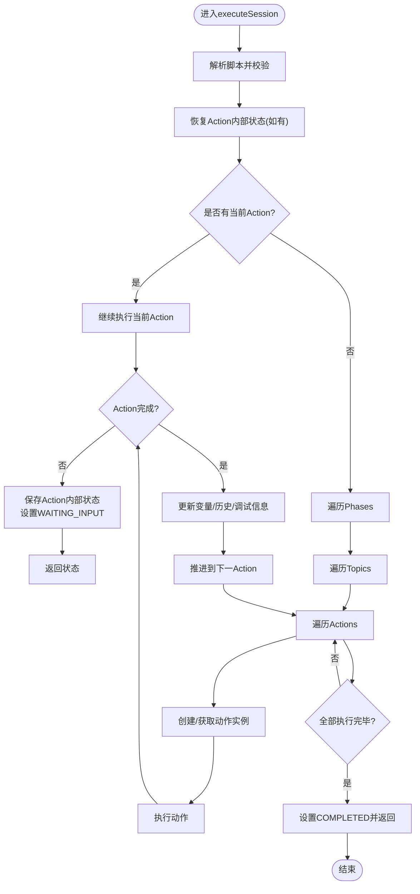
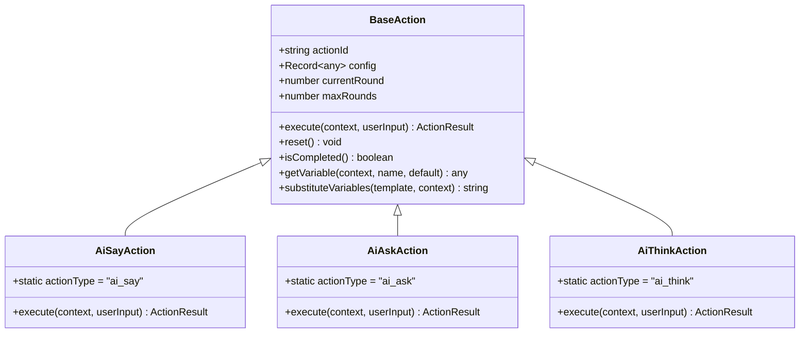
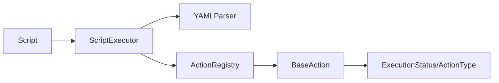

# 脚本执行引擎扩展

<cite>
**本文引用的文件**
- [packages/core-engine/src/index.ts](file://packages/core-engine/src/index.ts)
- [packages/core-engine/src/engines/script-execution/yaml-parser.ts](file://packages/core-engine/src/engines/script-execution/yaml-parser.ts)
- [packages/core-engine/src/engines/script-execution/executor.ts](file://packages/core-engine/src/engines/script-execution/executor.ts)
- [packages/core-engine/src/engines/script-execution/script-executor.ts](file://packages/core-engine/src/engines/script-execution/script-executor.ts)
- [packages/core-engine/src/actions/base-action.ts](file://packages/core-engine/src/actions/base-action.ts)
- [packages/core-engine/src/actions/action-registry.ts](file://packages/core-engine/src/actions/action-registry.ts)
- [packages/core-engine/src/actions/ai-say-action.ts](file://packages/core-engine/src/actions/ai-say-action.ts)
- [packages/core-engine/src/actions/ai-ask-action.ts](file://packages/core-engine/src/actions/ai-ask-action.ts)
- [packages/core-engine/src/actions/ai-think-action.ts](file://packages/core-engine/src/actions/ai-think-action.ts)
- [packages/core-engine/src/domain/script.ts](file://packages/core-engine/src/domain/script.ts)
- [packages/shared-types/src/enums.ts](file://packages/shared-types/src/enums.ts)
- [packages/api-server/test-full-flow.ts](file://packages/api-server/test-full-flow.ts)
- [scripts/sessions/cbt_depression_assessment.yaml](file://scripts/sessions/cbt_depression_assessment.yaml)
- [scripts/techniques/socratic_questioning.yaml](file://scripts/techniques/socratic_questioning.yaml)
</cite>

## 目录
1. [简介](#简介)
2. [项目结构](#项目结构)
3. [核心组件](#核心组件)
4. [架构总览](#架构总览)
5. [详细组件分析](#详细组件分析)
6. [依赖分析](#依赖分析)
7. [性能考虑](#性能考虑)
8. [故障排查指南](#故障排查指南)
9. [结论](#结论)
10. [附录](#附录)

## 简介
本指南面向希望扩展“脚本执行引擎”的开发者，围绕以下目标提供系统化的扩展方法与最佳实践：
- 扩展YAML解析器：新增脚本类型校验与解析规则
- 扩展执行器：完善状态管理、错误处理与回滚机制
- 自定义脚本指令：定义语法、解析规则与执行逻辑
- 自定义执行策略：并发控制、超时与资源管理
- 性能优化与测试策略：保障稳定性与可靠性

## 项目结构
核心模块位于 packages/core-engine，采用按职责分层组织：
- domain：领域模型（会话、消息、脚本、变量）
- engines：引擎实现（脚本执行、LLM编排、变量抽取、内存）
- actions：动作体系（AI说话、提问、思考等）

图表来源
- [packages/core-engine/src/engines/script-execution/script-executor.ts](file://packages/core-engine/src/engines/script-execution/script-executor.ts#L62-L216)
- [packages/core-engine/src/engines/script-execution/yaml-parser.ts](file://packages/core-engine/src/engines/script-execution/yaml-parser.ts#L8-L96)
- [packages/core-engine/src/actions/base-action.ts](file://packages/core-engine/src/actions/base-action.ts#L40-L99)
- [packages/core-engine/src/actions/action-registry.ts](file://packages/core-engine/src/actions/action-registry.ts#L17-L45)
- [packages/core-engine/src/domain/script.ts](file://packages/core-engine/src/domain/script.ts#L7-L47)
- [packages/shared-types/src/enums.ts](file://packages/shared-types/src/enums.ts#L16-L22)

章节来源
- [packages/core-engine/src/index.ts](file://packages/core-engine/src/index.ts#L1-L27)

## 核心组件
- 执行状态与位置：定义执行状态枚举、执行位置与执行状态结构，支撑断点续跑与状态持久化
- YAML解析器：负责脚本内容解析与会话/技术脚本Schema校验
- 脚本执行器：驱动会话流程，按Phase/Topic/Action逐级执行，处理等待输入、错误与回滚
- 动作体系：统一的BaseAction抽象，支持多轮对话、变量提取与元数据传递
- 注册表：集中管理动作类型映射，便于扩展新动作

章节来源
- [packages/core-engine/src/engines/script-execution/script-executor.ts](file://packages/core-engine/src/engines/script-execution/script-executor.ts#L15-L57)
- [packages/core-engine/src/engines/script-execution/yaml-parser.ts](file://packages/core-engine/src/engines/script-execution/yaml-parser.ts#L34-L94)
- [packages/core-engine/src/engines/script-execution/executor.ts](file://packages/core-engine/src/engines/script-execution/executor.ts#L14-L29)
- [packages/core-engine/src/actions/base-action.ts](file://packages/core-engine/src/actions/base-action.ts#L9-L33)
- [packages/core-engine/src/actions/action-registry.ts](file://packages/core-engine/src/actions/action-registry.ts#L17-L45)

## 架构总览
脚本执行引擎以“脚本内容 → 解析与校验 → 执行器调度 → 动作执行 → 状态更新”为主线，贯穿会话生命周期。

图表来源
- [packages/core-engine/src/engines/script-execution/script-executor.ts](file://packages/core-engine/src/engines/script-execution/script-executor.ts#L66-L216)
- [packages/core-engine/src/engines/script-execution/yaml-parser.ts](file://packages/core-engine/src/engines/script-execution/yaml-parser.ts#L12-L67)
- [packages/core-engine/src/actions/action-registry.ts](file://packages/core-engine/src/actions/action-registry.ts#L35-L45)

## 详细组件分析

### YAML解析器扩展
- 新增脚本类型校验：在现有会话脚本与技术脚本Schema基础上，增加新类型的Zod校验函数，并在解析器中暴露对应校验方法
- 解析与序列化：保持现有parse/stringify行为，确保错误包装与可追踪性
- 扩展点路径
  - 校验方法定义与调用：参考会话与技术脚本校验函数位置
  - 错误处理：捕获解析/序列化异常并抛出带上下文的错误
- 示例参考
  - 会话脚本Schema校验：[validateSessionScript](file://packages/core-engine/src/engines/script-execution/yaml-parser.ts#L34-L67)
  - 技术脚本Schema校验：[validateTechniqueScript](file://packages/core-engine/src/engines/script-execution/yaml-parser.ts#L72-L94)

章节来源
- [packages/core-engine/src/engines/script-execution/yaml-parser.ts](file://packages/core-engine/src/engines/script-execution/yaml-parser.ts#L8-L96)

### 执行器状态管理与流程定制
- 执行状态与位置
  - 状态枚举：RUNNING/WAITING_INPUT/PAUSED/COMPLETED/ERROR
  - 位置信息：当前Phase/Topic/Action索引与ID，便于断点续跑
  - 初始状态：提供静态工厂创建初始执行状态
- 流程控制
  - executeSession：解析脚本、恢复Action状态、逐级执行、推进位置、处理等待输入与错误
  - 断点续跑：通过metadata.actionState序列化/反序列化动作内部状态
- 扩展点路径
  - 状态推进与位置预设：参考Phase/Topic/Action级别的索引推进与ID预设逻辑
  - 等待输入处理：当Action返回未完成时，保存Action内部状态并设置WAITING_INPUT
  - 错误处理：捕获异常，设置ERROR状态并记录错误信息
- 示例参考
  - 状态推进与等待输入：[executeSession主流程](file://packages/core-engine/src/engines/script-execution/script-execution.ts#L66-L216)
  - 序列化/反序列化动作状态：[serializeActionState/deserializeActionState](file://packages/core-engine/src/engines/script-execution/script-execution.ts#L498-L517)

图表来源
- [packages/core-engine/src/engines/script-execution/script-execution.ts](file://packages/core-engine/src/engines/script-execution/script-execution.ts#L66-L216)

章节来源
- [packages/core-engine/src/engines/script-execution/script-execution.ts](file://packages/core-engine/src/engines/script-execution/script-execution.ts#L15-L57)
- [packages/core-engine/src/engines/script-execution/script-execution.ts](file://packages/core-engine/src/engines/script-execution/script-execution.ts#L66-L216)
- [packages/core-engine/src/engines/script-execution/script-execution.ts](file://packages/core-engine/src/engines/script-execution/script-execution.ts#L498-L517)

### 新脚本指令添加方法
- 语法定义与解析规则
  - 在脚本Schema中新增字段（如action_type、action_id、config），并为新指令定义对应的Zod校验
  - 在动作注册表中注册新动作类型映射
- 执行逻辑实现
  - 继承BaseAction，实现execute方法；支持多轮对话、变量提取与元数据传递
  - 使用ActionContext访问会话ID、Phase/Topic/Action ID、变量、对话历史与元数据
- 示例参考
  - 动作基类与上下文：[BaseAction/ActionContext/ActionResult](file://packages/core-engine/src/actions/base-action.ts#L9-L33)
  - 动作注册表：[ACTION_REGISTRY/createAction/registerAction](file://packages/core-engine/src/actions/action-registry.ts#L17-L45)
  - 现有动作示例：AI说话/AI提问/AI思考

图表来源
- [packages/core-engine/src/actions/base-action.ts](file://packages/core-engine/src/actions/base-action.ts#L40-L99)
- [packages/core-engine/src/actions/ai-say-action.ts](file://packages/core-engine/src/actions/ai-say-action.ts#L16-L105)
- [packages/core-engine/src/actions/ai-ask-action.ts](file://packages/core-engine/src/actions/ai-ask-action.ts#L19-L207)
- [packages/core-engine/src/actions/ai-think-action.ts](file://packages/core-engine/src/actions/ai-think-action.ts#L11-L57)

章节来源
- [packages/core-engine/src/actions/base-action.ts](file://packages/core-engine/src/actions/base-action.ts#L9-L33)
- [packages/core-engine/src/actions/action-registry.ts](file://packages/core-engine/src/actions/action-registry.ts#L17-L45)
- [packages/core-engine/src/actions/ai-say-action.ts](file://packages/core-engine/src/actions/ai-say-action.ts#L16-L105)
- [packages/core-engine/src/actions/ai-ask-action.ts](file://packages/core-engine/src/actions/ai-ask-action.ts#L19-L207)
- [packages/core-engine/src/actions/ai-think-action.ts](file://packages/core-engine/src/actions/ai-think-action.ts#L11-L57)

### 自定义执行策略：并发、超时与资源管理
- 并发控制
  - 会话级串行：单会话内按Phase/Topic/Action顺序执行，避免竞态
  - 多会话并发：由上层服务控制多个会话的并行调度
- 超时处理
  - 在动作执行层面设置超时（如调用LLM时），超时视为执行失败并进入ERROR状态
  - 在API层面对长时间WAITING_INPUT进行超时清理
- 资源管理
  - 对话历史与变量存储：限制历史长度与变量数量，定期清理
  - 动作内部状态：仅在WAITING_INPUT时序列化，完成后清理
- 示例参考
  - 等待输入与状态保存：[等待输入分支与actionState保存](file://packages/core-engine/src/engines/script-execution/script-execution.ts#L323-L341)
  - 错误状态设置：[ERROR状态设置](file://packages/core-engine/src/engines/script-execution/script-execution.ts#L129-L134)

章节来源
- [packages/core-engine/src/engines/script-execution/script-execution.ts](file://packages/core-engine/src/engines/script-execution/script-execution.ts#L323-L341)
- [packages/core-engine/src/engines/script-execution/script-execution.ts](file://packages/core-engine/src/engines/script-execution/script-execution.ts#L129-L134)

### 现有执行器实现模式与扩展点
- 模式一：会话脚本执行器（新版本）
  - 通过ScriptExecutor.executeSession驱动执行，支持断点续跑与等待输入
  - 参考：[executeSession主流程](file://packages/core-engine/src/engines/script-execution/script-execution.ts#L66-L216)
- 模式二：遗留执行器（兼容）
  - 通过executor.ts中的ScriptExecutor实现，同样支持断点续跑与状态推进
  - 参考：[executeSession主流程](file://packages/core-engine/src/engines/script-execution/executor.ts#L46-L127)
- 扩展点
  - 新增动作类型：在注册表中注册并在脚本Schema中允许该类型
  - 新增脚本类型：在YAML解析器中新增校验方法并在入口处调用
  - 新增执行策略：在API层面对会话并发与超时进行控制

章节来源
- [packages/core-engine/src/engines/script-execution/script-execution.ts](file://packages/core-engine/src/engines/script-execution/script-execution.ts#L66-L216)
- [packages/core-engine/src/engines/script-execution/executor.ts](file://packages/core-engine/src/engines/script-execution/executor.ts#L46-L127)

## 依赖分析
- 执行器依赖解析器与动作注册表，动作依赖共享类型中的枚举
- 脚本模型与执行器解耦，通过parsedContent与JSON结构交互
- API层通过SessionManager协调数据库与执行器

图表来源
- [packages/core-engine/src/engines/script-execution/script-execution.ts](file://packages/core-engine/src/engines/script-execution/script-execution.ts#L62-L216)
- [packages/core-engine/src/engines/script-execution/yaml-parser.ts](file://packages/core-engine/src/engines/script-execution/yaml-parser.ts#L8-L96)
- [packages/core-engine/src/actions/action-registry.ts](file://packages/core-engine/src/actions/action-registry.ts#L17-L45)
- [packages/core-engine/src/actions/base-action.ts](file://packages/core-engine/src/actions/base-action.ts#L40-L99)
- [packages/core-engine/src/domain/script.ts](file://packages/core-engine/src/domain/script.ts#L7-L47)
- [packages/shared-types/src/enums.ts](file://packages/shared-types/src/enums.ts#L16-L22)

章节来源
- [packages/core-engine/src/domain/script.ts](file://packages/core-engine/src/domain/script.ts#L7-L47)
- [packages/shared-types/src/enums.ts](file://packages/shared-types/src/enums.ts#L16-L22)

## 性能考虑
- 解析与校验
  - 将YAML解析与Schema校验分离，仅在首次执行或脚本变更时进行
  - 对大型脚本启用增量校验与缓存
- 执行器
  - 避免在循环中进行昂贵操作，尽量批量更新变量与历史
  - 控制WAITING_INPUT状态的最长持续时间，防止资源泄漏
- 动作执行
  - 对外部服务调用（如LLM）设置合理超时与重试
  - 对长文本处理进行分片与限流
- 存储
  - 对会话状态与消息历史进行压缩与归档
  - 定期清理过期会话与无用变量

## 故障排查指南
- 常见错误类型
  - 脚本解析错误：检查YAML语法与Schema字段
  - 动作执行错误：查看ActionResult.error与调试信息
  - 等待输入超时：检查用户输入是否及时到达
- 排查步骤
  - 核对执行状态与位置：确认是否停留在某个Action或Topic
  - 检查metadata.actionState：确认断点续跑是否正确恢复
  - 查看对话历史：定位最后一次AI消息与用户输入
- 示例参考
  - 完整会话流程测试：[testFullFlow](file://packages/api-server/test-full-flow.ts#L16-L208)

章节来源
- [packages/api-server/test-full-flow.ts](file://packages/api-server/test-full-flow.ts#L16-L208)

## 结论
通过以上扩展指南，可以在不破坏现有执行流程的前提下，安全地引入新的脚本类型、动作与执行策略。建议在扩展过程中严格遵循状态机设计、错误隔离与断点续跑原则，并结合完善的测试策略与性能优化手段，确保系统的稳定性与可维护性。

## 附录
- 示例脚本
  - 会话脚本：[cbt_depression_assessment.yaml](file://scripts/sessions/cbt_depression_assessment.yaml#L1-L166)
  - 技术脚本：[socratic_questioning.yaml](file://scripts/techniques/socratic_questioning.yaml#L1-L110)
- 关键实现路径
  - 执行状态与位置：[ExecutionState/ExecutionStatus](file://packages/core-engine/src/engines/script-execution/script-execution.ts#L15-L57)
  - 执行器主流程：[executeSession](file://packages/core-engine/src/engines/script-execution/script-execution.ts#L66-L216)
  - YAML解析与校验：[YAMLParser](file://packages/core-engine/src/engines/script-execution/yaml-parser.ts#L8-L96)
  - 动作注册与创建：[ACTION_REGISTRY/createAction](file://packages/core-engine/src/actions/action-registry.ts#L17-L45)
  - 动作基类与上下文：[BaseAction](file://packages/core-engine/src/actions/base-action.ts#L40-L99)