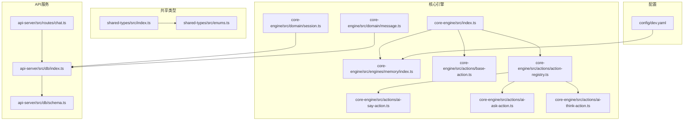
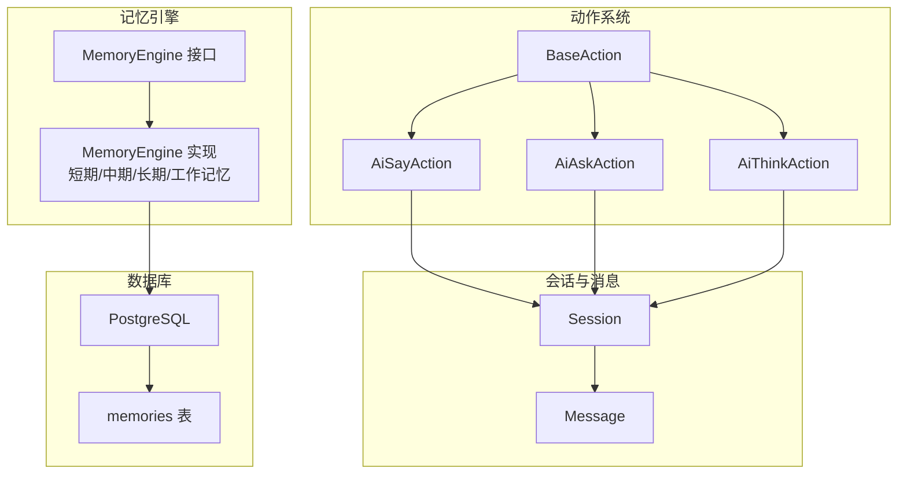
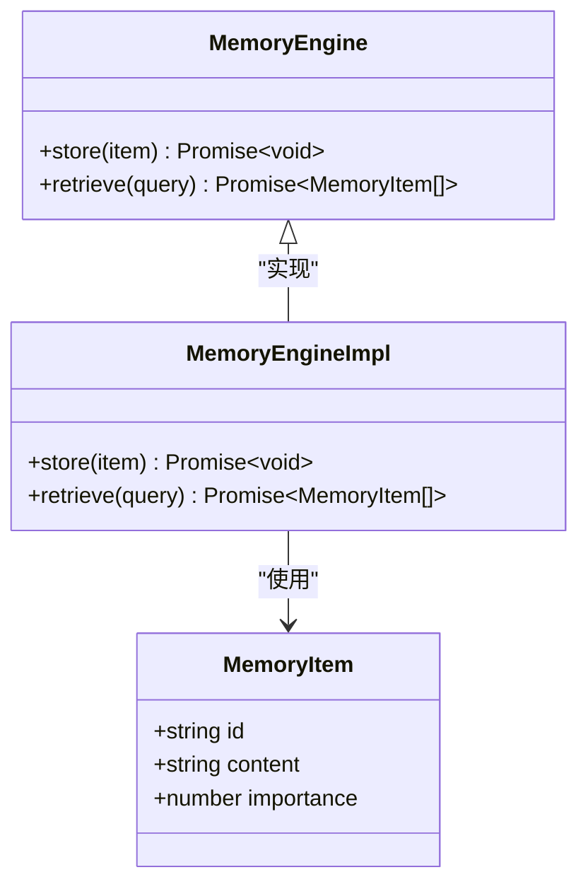
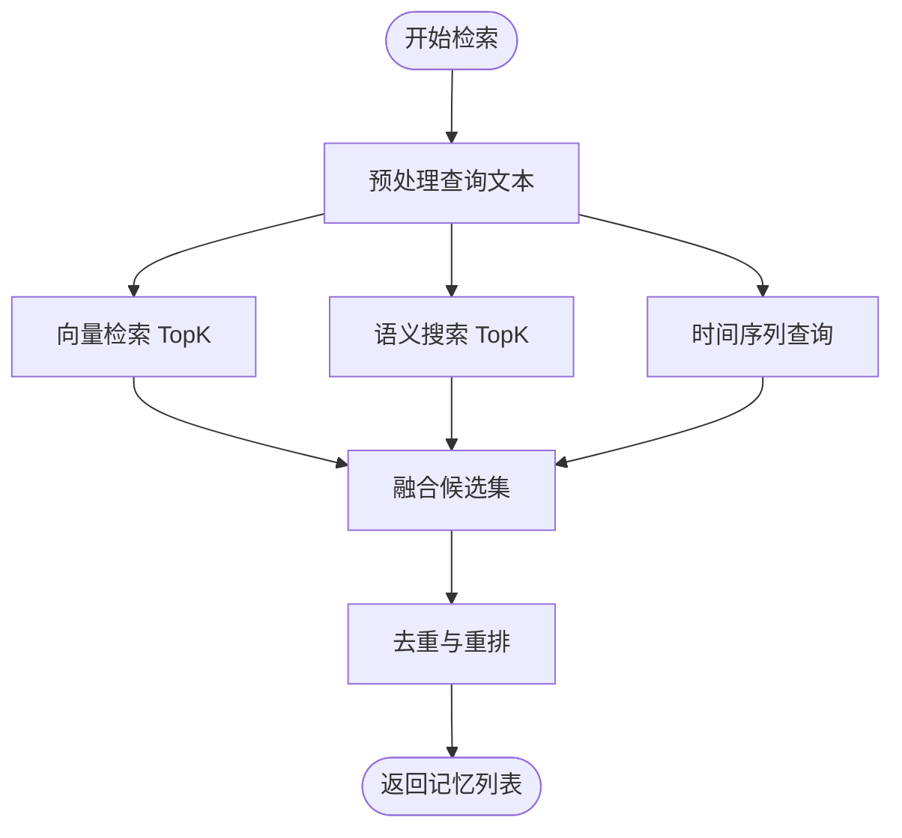
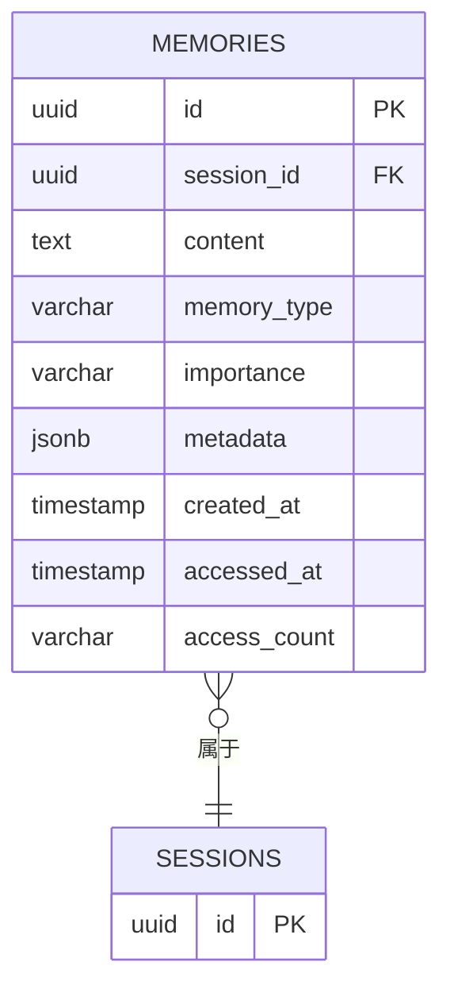
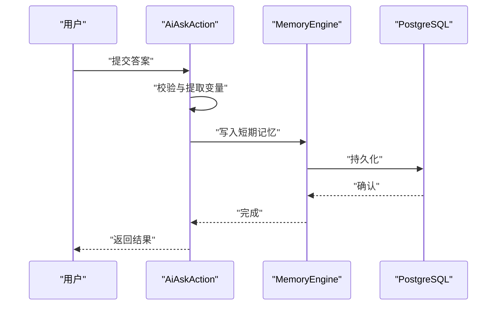
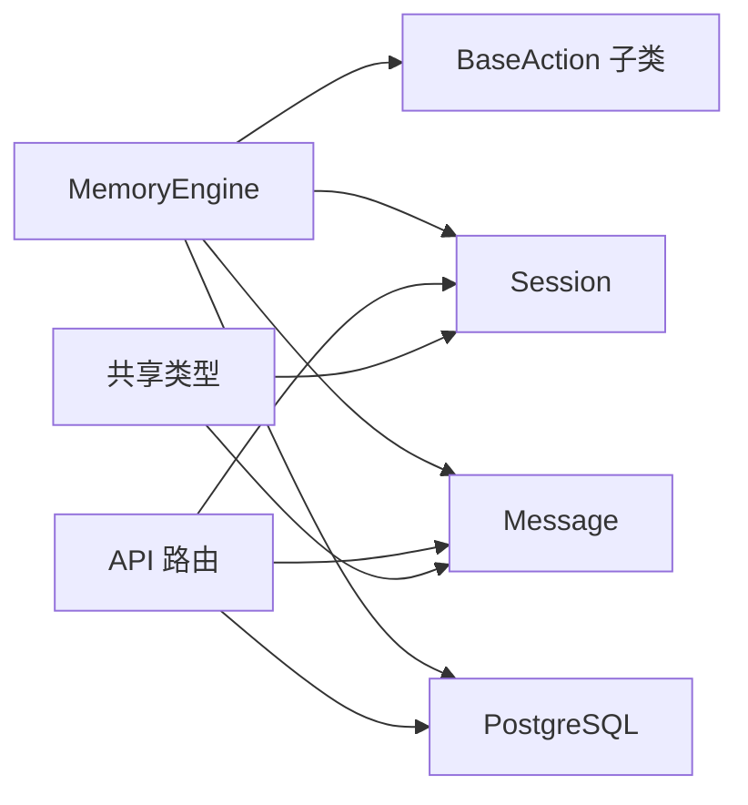

# 记忆引擎扩展

<cite>
**本文引用的文件**
- [packages/core-engine/src/index.ts](file://packages/core-engine/src/index.ts)
- [packages/core-engine/src/engines/memory/index.ts](file://packages/core-engine/src/engines/memory/index.ts)
- [packages/core-engine/src/domain/message.ts](file://packages/core-engine/src/domain/message.ts)
- [packages/core-engine/src/domain/session.ts](file://packages/core-engine/src/domain/session.ts)
- [packages/core-engine/src/actions/base-action.ts](file://packages/core-engine/src/actions/base-action.ts)
- [packages/core-engine/src/actions/action-registry.ts](file://packages/core-engine/src/actions/action-registry.ts)
- [packages/core-engine/src/actions/ai-say-action.ts](file://packages/core-engine/src/actions/ai-say-action.ts)
- [packages/core-engine/src/actions/ai-ask-action.ts](file://packages/core-engine/src/actions/ai-ask-action.ts)
- [packages/core-engine/src/actions/ai-think-action.ts](file://packages/core-engine/src/actions/ai-think-action.ts)
- [packages/shared-types/src/index.ts](file://packages/shared-types/src/index.ts)
- [packages/shared-types/src/enums.ts](file://packages/shared-types/src/enums.ts)
- [packages/api-server/src/db/schema.ts](file://packages/api-server/src/db/schema.ts)
- [packages/api-server/src/db/index.ts](file://packages/api-server/src/db/index.ts)
- [packages/api-server/src/routes/chat.ts](file://packages/api-server/src/routes/chat.ts)
- [config/dev.yaml](file://config/dev.yaml)
</cite>

## 目录
1. [简介](#简介)
2. [项目结构](#项目结构)
3. [核心组件](#核心组件)
4. [架构总览](#架构总览)
5. [详细组件分析](#详细组件分析)
6. [依赖关系分析](#依赖关系分析)
7. [性能考虑](#性能考虑)
8. [故障排查指南](#故障排查指南)
9. [结论](#结论)
10. [附录](#附录)

## 简介
本指南面向希望扩展“记忆引擎”的开发者，系统性地说明如何在现有代码基础上实现短期记忆、中期记忆、长期记忆与工作记忆；如何扩展记忆检索算法（向量检索、语义搜索、时间序列查询）；如何新增记忆类型（情感记忆、认知记忆、行为记忆）；以及如何实现记忆的压缩、去重与索引优化。文档同时给出与现有核心引擎、动作系统、会话与消息模型、数据库模式的对接方式，并提供性能优化与故障排查建议。

## 项目结构
- 核心引擎位于 packages/core-engine，包含领域模型、动作系统与脚本执行引擎等模块。
- 记忆引擎目前处于占位实现，接口定义清晰，便于扩展。
- API 服务位于 packages/api-server，负责数据库连接、路由与会话管理。
- 共享类型位于 packages/shared-types，统一导出领域模型与枚举。
- 配置文件 config/dev.yaml 提供开发环境参数，包含短期记忆窗口与 tokens 等配置项。

**图表来源**
- [packages/core-engine/src/index.ts](file://packages/core-engine/src/index.ts#L1-L27)
- [packages/core-engine/src/engines/memory/index.ts](file://packages/core-engine/src/engines/memory/index.ts#L1-L26)
- [packages/core-engine/src/domain/message.ts](file://packages/core-engine/src/domain/message.ts#L1-L49)
- [packages/core-engine/src/domain/session.ts](file://packages/core-engine/src/domain/session.ts#L1-L137)
- [packages/core-engine/src/actions/base-action.ts](file://packages/core-engine/src/actions/base-action.ts#L1-L99)
- [packages/core-engine/src/actions/action-registry.ts](file://packages/core-engine/src/actions/action-registry.ts#L1-L46)
- [packages/core-engine/src/actions/ai-say-action.ts](file://packages/core-engine/src/actions/ai-say-action.ts#L1-L105)
- [packages/core-engine/src/actions/ai-ask-action.ts](file://packages/core-engine/src/actions/ai-ask-action.ts#L1-L207)
- [packages/core-engine/src/actions/ai-think-action.ts](file://packages/core-engine/src/actions/ai-think-action.ts#L1-L57)
- [packages/api-server/src/db/index.ts](file://packages/api-server/src/db/index.ts#L1-L26)
- [packages/api-server/src/db/schema.ts](file://packages/api-server/src/db/schema.ts#L1-L219)
- [packages/api-server/src/routes/chat.ts](file://packages/api-server/src/routes/chat.ts#L1-L152)
- [packages/shared-types/src/index.ts](file://packages/shared-types/src/index.ts#L1-L19)
- [packages/shared-types/src/enums.ts](file://packages/shared-types/src/enums.ts#L1-L118)
- [config/dev.yaml](file://config/dev.yaml#L1-L63)

**章节来源**
- [packages/core-engine/src/index.ts](file://packages/core-engine/src/index.ts#L1-L27)
- [packages/api-server/src/db/schema.ts](file://packages/api-server/src/db/schema.ts#L178-L198)
- [config/dev.yaml](file://config/dev.yaml#L38-L43)

## 核心组件
- 记忆引擎接口与占位实现：定义了 MemoryItem 结构与 MemoryEngine 的 store/retrieve 方法，为后续扩展短期/中期/长期记忆提供统一入口。
- 会话与消息模型：Session 与 Message 提供会话生命周期、执行状态与消息持久化能力，是记忆与动作系统交互的基础。
- 动作系统：BaseAction 及其子类（AiSayAction、AiAskAction、AiThinkAction）定义了对话与推理的执行流程，可作为记忆写入与检索的触发点。
- 数据库模式：memories 表定义了记忆的字段、索引与外键约束，支撑短期/中期/长期记忆的数据持久化与检索优化。
- 共享类型：统一导出领域模型与枚举，保证跨包一致性。

**章节来源**
- [packages/core-engine/src/engines/memory/index.ts](file://packages/core-engine/src/engines/memory/index.ts#L10-L25)
- [packages/core-engine/src/domain/session.ts](file://packages/core-engine/src/domain/session.ts#L7-L44)
- [packages/core-engine/src/domain/message.ts](file://packages/core-engine/src/domain/message.ts#L7-L32)
- [packages/core-engine/src/actions/base-action.ts](file://packages/core-engine/src/actions/base-action.ts#L9-L33)
- [packages/api-server/src/db/schema.ts](file://packages/api-server/src/db/schema.ts#L178-L198)
- [packages/shared-types/src/index.ts](file://packages/shared-types/src/index.ts#L7-L18)

## 架构总览
记忆引擎在整体架构中承担“数据持久化与检索”的职责，与动作系统协同工作，通过会话与消息模型进行数据流转。短期记忆通常驻留于内存或 Redis，中期记忆落库于 PostgreSQL，长期记忆引入向量检索以支持语义相似度匹配。

**图表来源**
- [packages/core-engine/src/actions/base-action.ts](file://packages/core-engine/src/actions/base-action.ts#L40-L60)
- [packages/core-engine/src/actions/ai-say-action.ts](file://packages/core-engine/src/actions/ai-say-action.ts#L19-L66)
- [packages/core-engine/src/actions/ai-ask-action.ts](file://packages/core-engine/src/actions/ai-ask-action.ts#L27-L78)
- [packages/core-engine/src/actions/ai-think-action.ts](file://packages/core-engine/src/actions/ai-think-action.ts#L18-L47)
- [packages/core-engine/src/domain/session.ts](file://packages/core-engine/src/domain/session.ts#L7-L44)
- [packages/core-engine/src/domain/message.ts](file://packages/core-engine/src/domain/message.ts#L7-L32)
- [packages/core-engine/src/engines/memory/index.ts](file://packages/core-engine/src/engines/memory/index.ts#L16-L24)
- [packages/api-server/src/db/schema.ts](file://packages/api-server/src/db/schema.ts#L178-L198)

## 详细组件分析

### 记忆引擎接口与扩展点
- MemoryItem：包含唯一标识、内容与重要性评分，用于短期/中期/长期记忆的统一表示。
- MemoryEngine：提供 store 与 retrieve 两个核心方法，分别用于写入与检索记忆。
- 扩展方向：
  - 短期记忆：基于内存队列或 Redis，结合配置的窗口大小与 tokens 上限，实现 LRU/滑动窗口淘汰。
  - 中期记忆：基于 PostgreSQL 的 memories 表，按会话维度分片，建立类型与重要性索引。
  - 长期记忆：引入向量嵌入（如 pgvector），支持语义相似度检索。
  - 工作记忆：在动作执行过程中临时聚合上下文，执行完成后写入短期/中期记忆。

**图表来源**
- [packages/core-engine/src/engines/memory/index.ts](file://packages/core-engine/src/engines/memory/index.ts#L10-L25)

**章节来源**
- [packages/core-engine/src/engines/memory/index.ts](file://packages/core-engine/src/engines/memory/index.ts#L1-L26)
- [config/dev.yaml](file://config/dev.yaml#L39-L43)

### 记忆检索算法扩展
- 向量检索：在长期记忆中为每条记录计算向量嵌入，使用向量相似度（余弦/内积）进行 Top-K 检索，结合时间衰减与重要性加权。
- 语义搜索：对查询与记忆内容进行编码，采用 BM25 或混合词向量+TF-IDF策略，提升语义召回质量。
- 时间序列查询：基于 accessed_at/created_at 维度，支持按时间窗口过滤与排序，配合 access_count 实现热度排序。
- 检索融合：将三类检索结果按权重融合，输出最终候选集，再进行去重与重排。

**图表来源**
- [packages/core-engine/src/engines/memory/index.ts](file://packages/core-engine/src/engines/memory/index.ts#L21-L24)
- [packages/api-server/src/db/schema.ts](file://packages/api-server/src/db/schema.ts#L178-L198)

### 新的记忆类型建模
- 情感记忆：记录情绪标签（如 joy/sad/anger/fear/anxiety/disgust/surprise）、强度与触发事件，支持情感趋势分析与调节建议生成。
- 认知记忆：记录认知偏差识别、自动思维与反驳过程，辅助认知重构训练。
- 行为记忆：记录行为触发条件、行为链路与结果反馈，支持行为激活与习惯追踪。
- 建模要点：统一使用 memory_type 字段区分类型，metadata 存放结构化属性，配合索引优化查询效率。

**图表来源**
- [packages/api-server/src/db/schema.ts](file://packages/api-server/src/db/schema.ts#L178-L198)

**章节来源**
- [packages/api-server/src/db/schema.ts](file://packages/api-server/src/db/schema.ts#L178-L198)

### 记忆压缩、去重与索引优化
- 压缩：对重复语义内容进行哈希去重，仅保留最新版本；对长文本进行摘要或分块嵌入，降低存储与检索成本。
- 去重：基于内容指纹（如 SimHash/MinHash）与向量近似去重，避免冗余记忆干扰检索效果。
- 索引优化：memories 表已具备 session_id、memory_type、importance 的索引，建议增加：
  - 向量索引（pgvector）：为 embedding 字段建立 ivfflat/HNSW 索引。
  - 查询热点索引：按 memory_type+importance+created_at 的复合索引加速高频查询。
  - TTL 管理：为短期记忆设置自动清理策略，释放存储空间。

**章节来源**
- [packages/api-server/src/db/schema.ts](file://packages/api-server/src/db/schema.ts#L192-L198)

### 与动作系统的集成模式
- 写入时机：AiSayAction/AiAskAction 在消息发送前后，根据配置决定是否写入短期/中期记忆；AiThinkAction 可将推理结论写入工作记忆。
- 读取时机：动作执行前，从短期/中期/长期记忆中检索上下文，注入 ActionContext 的 conversationHistory 与 variables。
- 元数据：通过 metadata 字段记录记忆来源、重要性与检索权重，便于后续优化。

**图表来源**
- [packages/core-engine/src/actions/ai-ask-action.ts](file://packages/core-engine/src/actions/ai-ask-action.ts#L139-L159)
- [packages/core-engine/src/engines/memory/index.ts](file://packages/core-engine/src/engines/memory/index.ts#L17-L19)
- [packages/api-server/src/db/schema.ts](file://packages/api-server/src/db/schema.ts#L178-L198)

**章节来源**
- [packages/core-engine/src/actions/ai-ask-action.ts](file://packages/core-engine/src/actions/ai-ask-action.ts#L27-L159)
- [packages/core-engine/src/actions/ai-say-action.ts](file://packages/core-engine/src/actions/ai-say-action.ts#L19-L95)
- [packages/core-engine/src/actions/ai-think-action.ts](file://packages/core-engine/src/actions/ai-think-action.ts#L18-L47)

### 与会话/消息模型的衔接
- 会话维度：短期记忆按会话窗口维护，中期/长期记忆通过 session_id 关联，确保检索范围可控。
- 消息持久化：消息写入 messages 表，作为短期记忆的来源之一；也可作为长期记忆的语料补充。
- 执行状态：Session 的执行状态与记忆生命周期联动，暂停/恢复/完成时触发记忆的迁移或清理。

**章节来源**
- [packages/core-engine/src/domain/session.ts](file://packages/core-engine/src/domain/session.ts#L7-L44)
- [packages/core-engine/src/domain/message.ts](file://packages/core-engine/src/domain/message.ts#L7-L32)
- [packages/api-server/src/db/schema.ts](file://packages/api-server/src/db/schema.ts#L178-L198)

## 依赖关系分析
- 记忆引擎依赖动作系统提供的上下文与执行时机，依赖会话/消息模型进行数据组织，依赖数据库进行持久化。
- API 服务通过 Drizzle ORM 连接 PostgreSQL，暴露聊天路由，驱动会话管理与记忆写入。
- 共享类型统一了领域模型与枚举，保证跨包一致性。

**图表来源**
- [packages/core-engine/src/engines/memory/index.ts](file://packages/core-engine/src/engines/memory/index.ts#L16-L24)
- [packages/core-engine/src/actions/base-action.ts](file://packages/core-engine/src/actions/base-action.ts#L40-L60)
- [packages/core-engine/src/domain/session.ts](file://packages/core-engine/src/domain/session.ts#L7-L44)
- [packages/core-engine/src/domain/message.ts](file://packages/core-engine/src/domain/message.ts#L7-L32)
- [packages/api-server/src/db/index.ts](file://packages/api-server/src/db/index.ts#L16-L25)
- [packages/api-server/src/routes/chat.ts](file://packages/api-server/src/routes/chat.ts#L15-L79)
- [packages/shared-types/src/index.ts](file://packages/shared-types/src/index.ts#L7-L18)

**章节来源**
- [packages/api-server/src/db/index.ts](file://packages/api-server/src/db/index.ts#L16-L25)
- [packages/api-server/src/routes/chat.ts](file://packages/api-server/src/routes/chat.ts#L15-L79)
- [packages/shared-types/src/index.ts](file://packages/shared-types/src/index.ts#L7-L18)

## 性能考虑
- 内存管理
  - 短期记忆：基于 LRU/滑动窗口，结合 tokens 上限控制内存占用；定期合并相邻相似内容，减少碎片。
  - 工作记忆：仅在动作执行期间驻留，结束后批量写入短期/中期记忆。
- 缓存机制
  - 对高频检索结果进行缓存，设置合理 TTL；对向量检索结果进行分页缓存，避免重复计算。
- 查询优化
  - 为 memory_type/importance/created_at 建立复合索引；向量检索使用合适的探测数量与索引类型。
  - 检索时先做粗排（时间/重要性），再做细排（向量/语义）。
- 数据库连接
  - 使用连接池，限制并发；对写入操作批量提交，减少往返开销。

[本节为通用性能指导，无需特定文件来源]

## 故障排查指南
- 记忆写入失败
  - 检查数据库连接字符串与权限；确认 memories 表结构与索引存在。
  - 查看 API 路由错误响应与日志，定位 Drizzle ORM 报错。
- 检索结果异常
  - 核对 memory_type/importance 的取值范围；检查向量维度与索引构建状态。
  - 对比查询预处理逻辑（分词、清洗、编码）是否一致。
- 会话状态不一致
  - 确认 Session 的执行状态与记忆生命周期策略一致；检查暂停/恢复/完成时的清理逻辑。

**章节来源**
- [packages/api-server/src/db/index.ts](file://packages/api-server/src/db/index.ts#L10-L14)
- [packages/api-server/src/routes/chat.ts](file://packages/api-server/src/routes/chat.ts#L50-L78)
- [packages/api-server/src/db/schema.ts](file://packages/api-server/src/db/schema.ts#L178-L198)

## 结论
通过在 MemoryEngine 中实现短期/中期/长期/工作记忆的差异化策略，并结合向量检索、语义搜索与时间序列查询，可显著提升记忆系统的召回质量与效率。配合压缩、去重与索引优化，可在大规模记忆数据下保持高性能。与动作系统、会话/消息模型的紧密耦合，使记忆成为智能对话与认知训练的核心基础设施。

[本节为总结性内容，无需特定文件来源]

## 附录
- 开发配置参考：短期记忆窗口大小与 tokens 上限可在配置文件中调整，便于快速迭代与压测。
- 数据库迁移：如启用向量检索，需安装并初始化 pgvector 扩展，迁移 schema 并重建索引。

**章节来源**
- [config/dev.yaml](file://config/dev.yaml#L39-L43)
- [packages/api-server/src/db/schema.ts](file://packages/api-server/src/db/schema.ts#L178-L198)