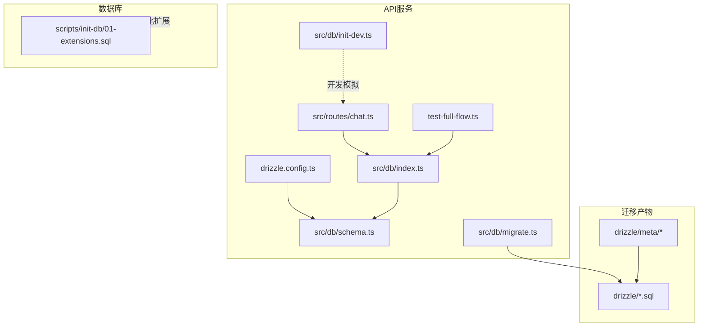
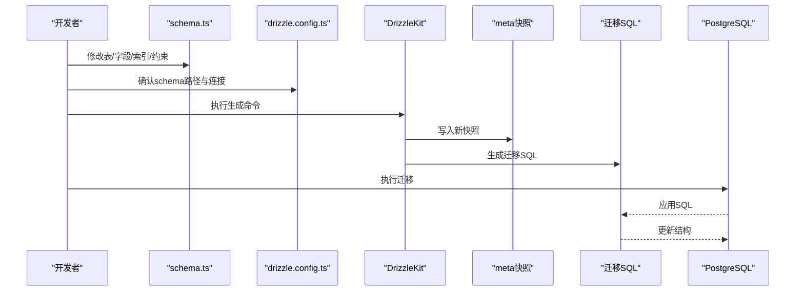
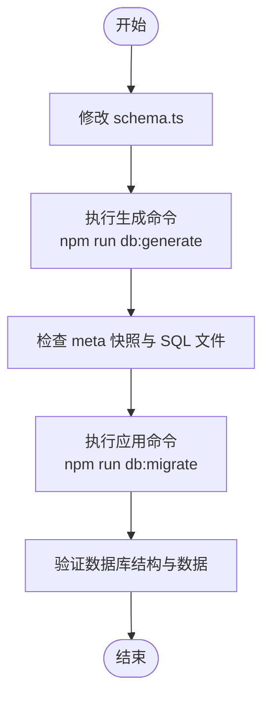
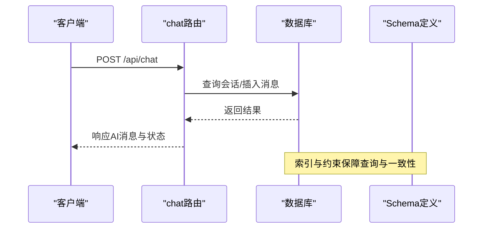
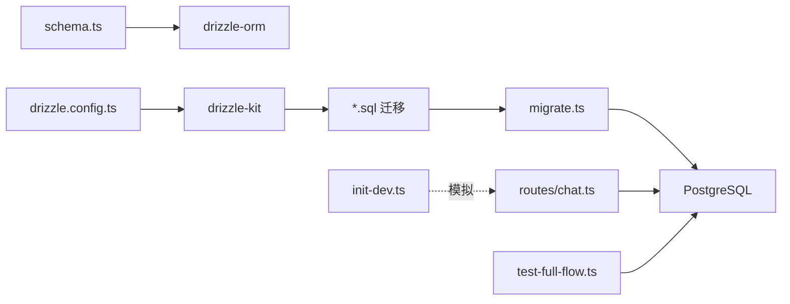

# 数据库Schema修改

<cite>
**本文引用的文件**
- [packages/api-server/src/db/schema.ts](file://packages/api-server/src/db/schema.ts)
- [packages/api-server/drizzle.config.ts](file://packages/api-server/drizzle.config.ts)
- [packages/api-server/src/db/index.ts](file://packages/api-server/src/db/index.ts)
- [packages/api-server/src/db/migrate.ts](file://packages/api-server/src/db/migrate.ts)
- [packages/api-server/src/db/init-dev.ts](file://packages/api-server/src/db/init-dev.ts)
- [packages/api-server/drizzle/meta/_journal.json](file://packages/api-server/drizzle/meta/_journal.json)
- [packages/api-server/drizzle/meta/0001_snapshot.json](file://packages/api-server/drizzle/meta/0001_snapshot.json)
- [packages/api-server/drizzle/0000_massive_young_avengers.sql](file://packages/api-server/drizzle/0000_massive_young_avengers.sql)
- [packages/api-server/drizzle/0001_dusty_iceman.sql](file://packages/api-server/drizzle/0001_dusty_iceman.sql)
- [scripts/init-db/01-extensions.sql](file://scripts/init-db/01-extensions.sql)
- [packages/api-server/src/routes/chat.ts](file://packages/api-server/src/routes/chat.ts)
- [packages/api-server/package.json](file://packages/api-server/package.json)
- [packages/api-server/test-full-flow.ts](file://packages/api-server/test-full-flow.ts)
</cite>

## 目录
1. [简介](#简介)
2. [项目结构](#项目结构)
3. [核心组件](#核心组件)
4. [架构总览](#架构总览)
5. [详细组件分析](#详细组件分析)
6. [依赖分析](#依赖分析)
7. [性能考虑](#性能考虑)
8. [故障排查指南](#故障排查指南)
9. [结论](#结论)
10. [附录](#附录)

## 简介
本指南面向HeartRule AI咨询引擎的数据库Schema修改需求，系统讲解如何基于Drizzle ORM进行表结构定义、字段类型与约束配置，并覆盖完整的迁移流程：从修改schema.ts、生成迁移脚本、到应用迁移的全过程。同时提供Schema设计最佳实践（表关系、索引、数据类型）、DrizzleKit工具使用（diff与生成）、调试技巧、性能优化与备份恢复策略，确保数据库变更的安全性与可靠性。

## 项目结构
与数据库Schema及迁移直接相关的目录与文件如下：
- Drizzle配置：drizzle.config.ts
- Schema定义：src/db/schema.ts
- 连接与查询入口：src/db/index.ts
- 迁移执行：src/db/migrate.ts
- 开发环境数据模拟：src/db/init-dev.ts
- 迁移产物与快照：drizzle/ 与 drizzle/meta/
- 初始化扩展：scripts/init-db/01-extensions.sql
- 使用示例：src/routes/chat.ts、test-full-flow.ts
- 脚本命令：package.json 中的db:generate、db:migrate等

图表来源
- [packages/api-server/drizzle.config.ts](file://packages/api-server/drizzle.config.ts#L1-L16)
- [packages/api-server/src/db/schema.ts](file://packages/api-server/src/db/schema.ts#L1-L219)
- [packages/api-server/src/db/index.ts](file://packages/api-server/src/db/index.ts#L1-L26)
- [packages/api-server/src/db/migrate.ts](file://packages/api-server/src/db/migrate.ts#L1-L23)
- [packages/api-server/src/db/init-dev.ts](file://packages/api-server/src/db/init-dev.ts#L1-L56)
- [packages/api-server/drizzle/meta/_journal.json](file://packages/api-server/drizzle/meta/_journal.json#L1-L20)
- [packages/api-server/drizzle/0000_massive_young_avengers.sql](file://packages/api-server/drizzle/0000_massive_young_avengers.sql#L1-L130)
- [packages/api-server/drizzle/0001_dusty_iceman.sql](file://packages/api-server/drizzle/0001_dusty_iceman.sql#L1-L90)
- [scripts/init-db/01-extensions.sql](file://scripts/init-db/01-extensions.sql#L1-L17)

章节来源
- [packages/api-server/drizzle.config.ts](file://packages/api-server/drizzle.config.ts#L1-L16)
- [packages/api-server/src/db/schema.ts](file://packages/api-server/src/db/schema.ts#L1-L219)
- [packages/api-server/src/db/index.ts](file://packages/api-server/src/db/index.ts#L1-L26)
- [packages/api-server/src/db/migrate.ts](file://packages/api-server/src/db/migrate.ts#L1-L23)
- [packages/api-server/src/db/init-dev.ts](file://packages/api-server/src/db/init-dev.ts#L1-L56)
- [packages/api-server/drizzle/meta/_journal.json](file://packages/api-server/drizzle/meta/_journal.json#L1-L20)
- [packages/api-server/drizzle/0000_massive_young_avengers.sql](file://packages/api-server/drizzle/0000_massive_young_avengers.sql#L1-L130)
- [packages/api-server/drizzle/0001_dusty_iceman.sql](file://packages/api-server/drizzle/0001_dusty_iceman.sql#L1-L90)
- [scripts/init-db/01-extensions.sql](file://scripts/init-db/01-extensions.sql#L1-L17)

## 核心组件
- Drizzle配置：定义schema路径、输出目录、驱动与连接信息，供DrizzleKit生成迁移使用。
- Schema定义：集中声明所有表、枚举、索引与外键约束，统一类型推断。
- 连接与查询：通过drizzle-orm/postgres-js建立连接，导出db实例与关闭连接函数。
- 迁移执行：调用migrate API按顺序应用drizzle目录下的迁移脚本。
- 快照与日志：meta目录记录迁移快照与应用顺序，确保幂等与可追踪。
- 初始化扩展：启用uuid-ossp、pgcrypto、pg_trgm等扩展，为后续功能预留基础。

章节来源
- [packages/api-server/drizzle.config.ts](file://packages/api-server/drizzle.config.ts#L1-L16)
- [packages/api-server/src/db/schema.ts](file://packages/api-server/src/db/schema.ts#L1-L219)
- [packages/api-server/src/db/index.ts](file://packages/api-server/src/db/index.ts#L1-L26)
- [packages/api-server/src/db/migrate.ts](file://packages/api-server/src/db/migrate.ts#L1-L23)
- [packages/api-server/drizzle/meta/_journal.json](file://packages/api-server/drizzle/meta/_journal.json#L1-L20)
- [scripts/init-db/01-extensions.sql](file://scripts/init-db/01-extensions.sql#L1-L17)

## 架构总览
下图展示了Schema修改与迁移的端到端流程：从修改schema.ts出发，借助drizzle.config.ts与DrizzleKit生成迁移，再由migrate.ts应用迁移，最终通过routes与测试验证变更效果。

图表来源
- [packages/api-server/src/db/schema.ts](file://packages/api-server/src/db/schema.ts#L1-L219)
- [packages/api-server/drizzle.config.ts](file://packages/api-server/drizzle.config.ts#L1-L16)
- [packages/api-server/drizzle/meta/_journal.json](file://packages/api-server/drizzle/meta/_journal.json#L1-L20)
- [packages/api-server/drizzle/0000_massive_young_avengers.sql](file://packages/api-server/drizzle/0000_massive_young_avengers.sql#L1-L130)
- [packages/api-server/drizzle/0001_dusty_iceman.sql](file://packages/api-server/drizzle/0001_dusty_iceman.sql#L1-L90)

## 详细组件分析

### 表结构与字段类型选择
- sessions：主键uuid，用户标识、脚本引用、状态与执行状态枚举，位置与变量jsonb快照，时间戳默认值，复合索引覆盖常用查询。
- messages：主键uuid，外键级联删除至sessions，角色枚举，内容text，时间戳索引，便于按会话与时间检索。
- scripts：主键uuid，唯一约束的脚本名，类型与状态枚举，版本号、作者、描述、标签数组，时间戳默认值。
- projects：主键uuid，工程元数据、版本要求、当前版本引用、状态枚举、标签与元数据jsonb。
- script_files：主键uuid，外键级联删除至projects，文件类型枚举，文件名与内容jsonb，可选yaml文本。
- project_drafts：主键为projects的外键，草稿文件jsonb，校验状态与错误列表，更新人与时间。
- project_versions：主键uuid，版本号、版本文件jsonb、回滚标记与来源、发布时间与发布人。
- variables：主键uuid，外键级联删除至sessions，变量名、值jsonb、作用域枚举、类型与来源字符串。
- memories：主键uuid，外键级联删除至sessions，内容text，类型与重要性字符串，元数据jsonb，访问统计与时间戳。

章节来源
- [packages/api-server/src/db/schema.ts](file://packages/api-server/src/db/schema.ts#L22-L198)

### 约束与索引配置
- 枚举类型：通过pgEnum统一管理，避免魔法字符串，提升一致性与可维护性。
- 唯一约束：scripts的script_name唯一，确保脚本命名全局唯一。
- 外键与级联：messages、variables、script_files、project_drafts、project_versions均对sessions或projects进行级联删除，保证数据一致性。
- 复合索引：scripts的(type,status)，sessions的(user_id,status,created_at)，memories与messages的时间与会话索引，variables的(name)索引，提升查询效率。
- 默认值：大量字段采用defaultNow()与defaultRandom()，减少应用层逻辑，保持数据完整性。

章节来源
- [packages/api-server/src/db/schema.ts](file://packages/api-server/src/db/schema.ts#L8-L17)
- [packages/api-server/src/db/schema.ts](file://packages/api-server/src/db/schema.ts#L63-L81)
- [packages/api-server/src/db/schema.ts](file://packages/api-server/src/db/schema.ts#L22-L40)
- [packages/api-server/src/db/schema.ts](file://packages/api-server/src/db/schema.ts#L45-L58)
- [packages/api-server/src/db/schema.ts](file://packages/api-server/src/db/schema.ts#L110-L124)
- [packages/api-server/src/db/schema.ts](file://packages/api-server/src/db/schema.ts#L141-L156)
- [packages/api-server/src/db/schema.ts](file://packages/api-server/src/db/schema.ts#L161-L176)
- [packages/api-server/src/db/schema.ts](file://packages/api-server/src/db/schema.ts#L181-L198)

### 迁移流程与DrizzleKit使用
- 生成迁移：通过package.json中的db:generate脚本调用drizzle-kit generate:pg，读取drizzle.config.ts，扫描src/db/schema.ts，生成迁移SQL与meta快照。
- 应用迁移：通过db:migrate脚本调用src/db/migrate.ts，内部使用migrate API按序执行drizzle目录下的SQL文件。
- 快照与日志：meta/_journal.json记录已应用迁移的顺序；0000与0001等SQL文件对应不同版本的数据库结构。
- 初始化扩展：scripts/init-db/01-extensions.sql启用uuid-ossp、pgcrypto、pg_trgm等扩展，为后续功能（如向量检索）预留空间。

图表来源
- [packages/api-server/package.json](file://packages/api-server/package.json#L8-L18)
- [packages/api-server/drizzle.config.ts](file://packages/api-server/drizzle.config.ts#L1-L16)
- [packages/api-server/src/db/migrate.ts](file://packages/api-server/src/db/migrate.ts#L1-L23)
- [packages/api-server/drizzle/meta/_journal.json](file://packages/api-server/drizzle/meta/_journal.json#L1-L20)
- [packages/api-server/drizzle/0000_massive_young_avengers.sql](file://packages/api-server/drizzle/0000_massive_young_avengers.sql#L1-L130)
- [packages/api-server/drizzle/0001_dusty_iceman.sql](file://packages/api-server/drizzle/0001_dusty_iceman.sql#L1-L90)

章节来源
- [packages/api-server/package.json](file://packages/api-server/package.json#L8-L18)
- [packages/api-server/drizzle.config.ts](file://packages/api-server/drizzle.config.ts#L1-L16)
- [packages/api-server/src/db/migrate.ts](file://packages/api-server/src/db/migrate.ts#L1-L23)
- [packages/api-server/drizzle/meta/_journal.json](file://packages/api-server/drizzle/meta/_journal.json#L1-L20)
- [scripts/init-db/01-extensions.sql](file://scripts/init-db/01-extensions.sql#L1-L17)

### 使用DrizzleKit生成迁移
- 配置文件：drizzle.config.ts指定schema路径、输出目录、驱动与连接字符串，严格模式与详细输出便于定位问题。
- 生成命令：package.json中db:generate脚本调用drizzle-kit generate:pg，自动对比当前schema与快照差异，生成最小化迁移SQL。
- 推荐流程：
  1) 在schema.ts中完成表/字段/索引/约束的修改；
  2) 执行npm run db:generate生成迁移；
  3) 审核生成的SQL与meta快照；
  4) 在测试环境执行npm run db:migrate；
  5) 在生产环境执行前再次确认并做好备份。

章节来源
- [packages/api-server/drizzle.config.ts](file://packages/api-server/drizzle.config.ts#L1-L16)
- [packages/api-server/package.json](file://packages/api-server/package.json#L12-L12)

### 数据库调试与验证
- 路由集成：chat路由通过db.query与db.insert操作sessions与messages，验证Schema与索引是否满足查询与插入需求。
- 测试验证：test-full-flow.ts模拟完整会话流程，验证会话状态、变量提取与消息历史，确保Schema变更不影响业务逻辑。
- 连接管理：index.ts负责连接字符串校验、连接创建与关闭，避免资源泄漏。

图表来源
- [packages/api-server/src/routes/chat.ts](file://packages/api-server/src/routes/chat.ts#L44-L79)
- [packages/api-server/src/db/schema.ts](file://packages/api-server/src/db/schema.ts#L22-L58)
- [packages/api-server/src/db/index.ts](file://packages/api-server/src/db/index.ts#L10-L25)

章节来源
- [packages/api-server/src/routes/chat.ts](file://packages/api-server/src/routes/chat.ts#L1-L152)
- [packages/api-server/test-full-flow.ts](file://packages/api-server/test-full-flow.ts#L1-L200)
- [packages/api-server/src/db/index.ts](file://packages/api-server/src/db/index.ts#L1-L26)

## 依赖分析
- Drizzle ORM与postgres-js：提供类型安全的查询与迁移能力。
- DrizzleKit：生成与推送迁移，支持diff与可视化Studio。
- Fastify路由：通过db实例访问数据库，验证Schema与索引的有效性。
- 开发模拟：init-dev.ts提供内存Map模拟，便于前端联调与无数据库环境演示。

图表来源
- [packages/api-server/src/db/schema.ts](file://packages/api-server/src/db/schema.ts#L1-L219)
- [packages/api-server/drizzle.config.ts](file://packages/api-server/drizzle.config.ts#L1-L16)
- [packages/api-server/src/db/migrate.ts](file://packages/api-server/src/db/migrate.ts#L1-L23)
- [packages/api-server/src/routes/chat.ts](file://packages/api-server/src/routes/chat.ts#L1-L152)
- [packages/api-server/test-full-flow.ts](file://packages/api-server/test-full-flow.ts#L1-L200)
- [packages/api-server/src/db/init-dev.ts](file://packages/api-server/src/db/init-dev.ts#L1-L56)

章节来源
- [packages/api-server/package.json](file://packages/api-server/package.json#L20-L42)

## 性能考虑
- 索引设计：为高频查询列（如sessions.user_id、messages.session_id、scripts.type_status、projects.name等）建立单列或复合索引，降低查询成本。
- JSONB字段：合理使用jsonb存储动态结构，但需避免过度嵌套与超大对象；必要时拆分为独立表或限制大小。
- 默认值与类型：使用合适的数据类型（如uuid、timestamp with default、枚举），减少转换开销与存储冗余。
- 外键级联：谨慎使用级联删除，避免大规模级联影响；对高并发写入场景评估触发器与约束带来的锁竞争。
- 扩展启用：提前启用uuid-ossp、pgcrypto、pg_trgm等扩展，避免后续迁移中频繁重建索引或重写数据。

## 故障排查指南
- 迁移失败：检查migrate.ts的错误输出与数据库连接字符串；确认drizzle目录下SQL文件是否完整；查看meta/_journal.json的已应用记录。
- 连接问题：确认.env中的DATABASE_URL；在index.ts中检查连接字符串解析与抛错逻辑。
- 架构不一致：使用drizzle-kit studio或diff命令对比schema与数据库实际结构，定位差异。
- 生产回滚：利用project_versions的回滚标记与来源字段，结合备份恢复策略进行安全回滚。
- 开发调试：init-dev.ts提供内存Map模拟，可在无数据库环境下验证业务逻辑与接口契约。

章节来源
- [packages/api-server/src/db/migrate.ts](file://packages/api-server/src/db/migrate.ts#L8-L20)
- [packages/api-server/src/db/index.ts](file://packages/api-server/src/db/index.ts#L10-L14)
- [packages/api-server/drizzle/meta/_journal.json](file://packages/api-server/drizzle/meta/_journal.json#L1-L20)
- [packages/api-server/package.json](file://packages/api-server/package.json#L12-L14)
- [packages/api-server/src/db/init-dev.ts](file://packages/api-server/src/db/init-dev.ts#L14-L56)

## 结论
通过规范的Schema定义、严格的迁移流程与完善的调试验证机制，HeartRule项目能够在演进过程中安全地进行数据库Schema修改。建议在每次变更前做好快照与备份，遵循“小步快跑”的原则，配合索引与类型优化，确保系统在高并发与大数据量场景下的稳定性与性能。

## 附录

### Schema设计最佳实践清单
- 使用枚举替代字符串常量，统一约束与可读性。
- 为高频查询列建立索引，避免全表扫描。
- 合理使用JSONB，控制嵌套深度与体积。
- 明确外键与级联策略，平衡一致性与性能。
- 为时间序列字段设置默认值，简化应用逻辑。
- 为唯一约束字段（如脚本名）添加唯一索引。

### 迁移执行清单
- 修改schema.ts后，执行npm run db:generate生成迁移。
- 审核生成的SQL与meta快照，确认变更范围。
- 在测试环境执行npm run db:migrate，验证路由与测试用例。
- 生产环境执行前，备份数据库并制定回滚计划。

### 备份与恢复策略
- 备份：定期导出数据库结构与数据，保留最近N个版本的快照。
- 恢复：在回滚时结合project_versions的回滚标记与来源字段，逐步恢复到目标版本。
- 验证：恢复后运行test-full-flow.ts等关键测试，确保数据一致性与业务可用性。